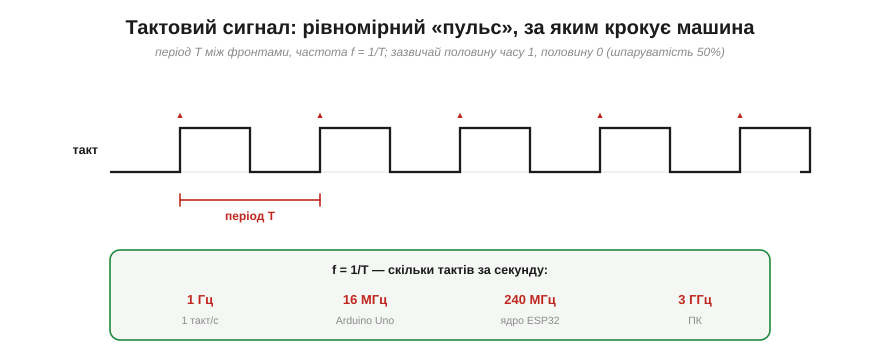
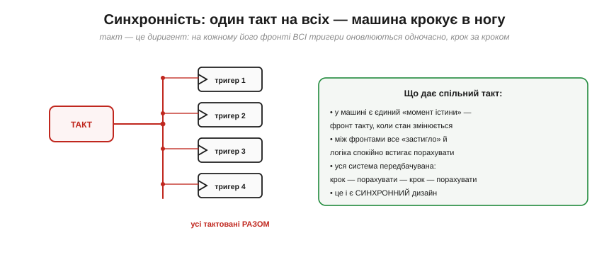
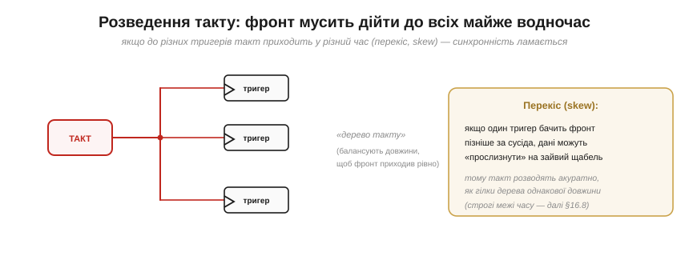

# Тактовий сигнал: спільний ритм

Усі тригери [регістра](book:electronics/register), усі тригери процесора оновлюються по **спільному** сигналу — **такту**. Він стоїть за роботою всієї цифрової машини, та так звично, що його легко сприйняти за даність. Придивімося до самого такту: що це за сигнал, чому завдяки йому вся машина працює **синхронно**, звідки він береться й чому саме він задає **швидкість** усієї системи. Такт — це серцебиття цифрової машини, і варто зрозуміти його як слід.

### Що таке такт

Тактовий сигнал (*clock*) — це проста, рівномірна **прямокутна хвиля**: 0, 1, 0, 1… з постійним ритмом. Уся машина звіряється з нею, як оркестр із паличкою диригента.

*Рис. Такт — періодична хвиля. **Період** T — час одного циклу (від фронту до фронту); **частота** f = 1/T — скільки тактів за секунду (у герцах). Зазвичай половину періоду сигнал високий, половину низький (**шпаруватість** 50%). Частоти бувають різні: 1 Гц (раз на секунду), 16 МГц (ядро Arduino Uno), 80 МГц (шина периферії ESP32, APB), 240 МГц (ядро ESP32), гігагерци (процесор ПК) — і що вища частота, то більше кроків за секунду робить машина.*

Запам'ятайте зв'язок T і f — він усюди: 16 МГц означає період 1/16 000 000 ≈ 62.5 наносекунди, тобто кожні 62.5 нс машина робить крок. Частота — це буквально темп роботи: скільки разів за секунду відбувається «крок» синхронної логіки.

### Синхронність: усі крокують разом

Навіщо потрібен **один** такт на всіх? Бо він дає машині **єдиний момент**, коли стан змінюється, — і це робить її передбачуваною.

*Рис. Один тактовий сигнал розходиться до **всіх** тригерів. На кожному його фронті **всі** вони оновлюються **одночасно** — машина робить один узгоджений крок. Між фронтами все «застигло»: стан не змінюється, і комбінаційна логіка спокійно встигає порахувати наступні значення. Потім — фронт, усі тригери захоплюють нові значення, — і знову пауза на обчислення. Крок — порахувати — крок. Це і є **синхронний** дизайн.*

Це найважливіша дисципліна всієї цифрової техніки. Завдяки спільному такту в системі є **домовлений ритм**: усі зміни стану відбуваються разом, у мить фронту, а весь час між фронтами віддано на **обчислення** комбінаційною логікою. Не треба гадати, хто коли оновився, — оновлюються **всі разом**, по команді диригента. Без цього сотні тисяч тригерів і вентилів злилися б у непередбачуваний хаос; з ним — машина крокує чітко й відтворювано.

### Звідки береться такт

Сам такт хтось має **створити** — потрібен **генератор** коливань. Найпростіший спирається на просту річ: [непарна петля інверторів](book:electronics/state-memory) **осцилює** — ніколи не знаходить стійкого стану й безперервно перекидається.

*Рис. **Кільцевий генератор** (зліва): непарне число інверторів у петлі (тут три) ніколи не вщухає — сигнал безперервно перекидається, даючи коливання. Просто, але частота «гуляє»: вона залежить від затримок вентилів, які повзуть із температурою й напругою. Годиться для **приблизного** такту. **Кварцовий генератор** (справа): підсилювач із **кварцовим** резонатором у петлі. Кристал кварцу має дуже стабільний механічний резонанс на точній частоті — і нав'язує її всій схемі. Так роблять **головний, точний** такт системи.*

Ось чому для **точного головного** такту зазвичай беруть маленький **кварцовий** резонатор (часто видно як блискучу металеву «таблетку» біля процесора): він дає частоту, стабільну до мільйонних часток, бо спирається на механічні коливання кристала, а не на примхливі затримки вентилів. Саме кварц колись навчив машини й годинники точного часу — перший кварцовий годинник побудував Воррен Маррісон (*Warren Marrison*) 1927 року. А прості **внутрішні RC- й кільцеві** генератори лишаються для невибагливих тактів, де точність не критична. (Часто з одного точного джерела роблять багато частот: схема **ФАПЧ** (*PLL*) множить опорну частоту кварцу — скажімо, 40 МГц ESP32 — до робочих 240 МГц ядра. Тож «кварц 40 МГц» і «ядро 240 МГц» уживаються в одному чипі, а кварц однаково лишається єдиним точним еталоном.)

### Такт — це «ручка швидкості»

Здавалося б, підкрути частоту вище — і машина працюватиме швидше. Так, але є **межа**, і вона прямо випливає з того, що вентилі перемикаються не миттєво.

*Рис. Між двома фронтами комбінаційна логіка мусить **встигнути** порахувати нові значення й «устоятися» (на це йдуть [затримки й фронти](book:electronics/edges-rise-time) вентилів). Найдовший шлях сигналу крізь логіку звуть **критичним шляхом**. Період такту T має бути **більшим** за цей шлях плюс невеликий запас (час setup тригера). Якщо ж розігнати такт надто високо (внизу), наступний фронт прийде, **поки логіка ще рахує**, — тригер захопить «сире», недолічене значення, і буде помилка.*

Звідси — фундаментальне обмеження: у кожної схеми є **максимальна** тактова частота, за якою її логіка вже не встигає. Щоб машина працювала швидше, мало підкрутити генератор — треба **скоротити критичний шлях**: спростити логіку чи розбити її на коротші ділянки ([конвеєр](book:programming/pipeline)). До того ж вища частота — це й більше **тепла**: у [CMOS-логіки](book:electronics/cmos-gate) динамічна потужність росте з f, тому розгін небайдужий і для нагріву. Тому такт — це завжди компроміс «швидкість проти затримок логіки й нагріву», і саме він визначає, [скільки мегагерц «витягне» процесор](book:programming/clock-frequency).

### Розведення такту й перекіс

Остання тонкість: такт мусить дійти до **всіх** тригерів майже **водночас**. А це не задарма — провідник має скінченну довжину, і фронт до далекого тригера доходить трохи пізніше.

*Рис. Такт розводять «деревом», балансуючи довжини гілок, щоб фронт приходив до всіх тригерів рівно. Якщо ж до одного тригера такт дістається помітно **пізніше**, ніж до сусіда (це **перекіс**, *clock skew*), дані можуть «прослизнути» на зайвий щабель, і синхронність ламається. Тому в реальних чипах розведенню такту приділяють величезну увагу.*

Перекіс — одна з причин, чому проєктувати дуже швидкі синхронні системи складно: мало порахувати логіку, треба ще гарантувати, що **диригентська паличка** змахнула для всіх в один момент. Звідси випливають [строгі часові межі](book:electronics/metastability-timing) — скільки даним треба «встояти» до фронту й «потриматися» після.

> 🔧 **Навіщо це.** Такт — це поняття, з яким ви матимете справу **постійно**, працюючи з мікроконтролером. Винесіть головне. Перше: такт задає **темп** машини (f = 1/T), і кожен «крок» синхронної логіки — це один його фронт; коли в даташиті ESP32 пишуть «240 МГц», це означає 240 мільйонів кроків за секунду. Друге: **синхронність** — спільний такт дає єдиний момент зміни стану, тож система передбачувана; майже все цифрове проєктують саме так. Третє: **головний такт роблять кварцом** (точна частота), а простіші — кільцевим генератором; і ви свідомо [обиратимете джерело такту](book:programming/clock-power), налаштовуючи мікроконтролер. Четверте, практичне: **вища частота = швидше, але гарячіше й важче за таймінгом**, і є межа, яку диктує найдовший шлях логіки. «Скільки герц» — це не просто число в налаштуваннях, а серцебиття, від якого залежить і швидкість, і споживання, і надійність.

---

Коротко про головне: **тактовий сигнал** — рівномірна прямокутна хвиля (період T, частота f = 1/T, шпаруватість ~50%), за якою синхронізується вся машина. **Спільний** такт дає **синхронність**: на кожному фронті всі тригери оновлюються разом, а між фронтами логіка встигає порахувати — «крок — обчислення — крок». Такт **генерують**: непарним **кільцем** інверторів (просто, та неточно) або **кварцовим** резонатором (стабільна, точна частота — головний такт). Такт — це **ручка швидкості**: період мусить вмістити **критичний шлях** логіки плюс запас, тож є максимальна частота, а вище неї — лише спростивши логіку чи розбивши її на [конвеєр](book:programming/pipeline). І такт треба **розвести** до всіх тригерів рівно, бо **перекіс** ламає синхронність. А коли є тригери, регістри й такт, їх можна з'єднати так, що схема сама **рахує** такти, — це [лічильник](book:electronics/counters).

---
