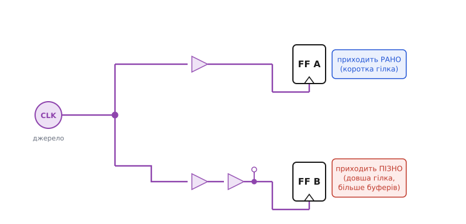
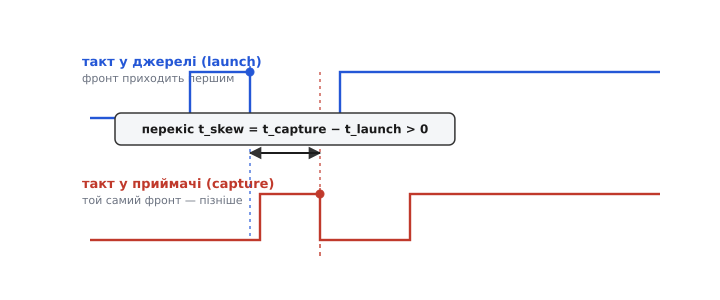
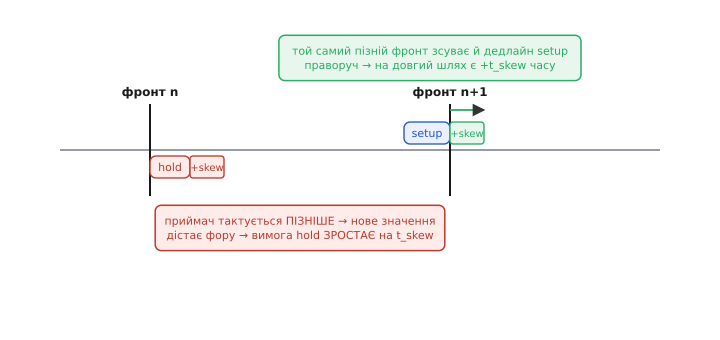

# Перекіс тактового сигналу (clock skew)

Синхронну схему уявляють так: є один такт, спільний барабанщик, і всі тригери клацають **разом**, у ту саму мить. Ця картинка зручна й майже правдива — але слово «разом» у ній приховує проблему, яка визначає, чи працюватиме чип на потрібній частоті. Бо такт — не телепатія. Це звичайний електричний сигнал, і щоб дійти до тригера, він мусить **пробігти дротом**, а біг дротом займає час. До ближчого тригера фронт добігає раніше, до дальшого — пізніше. Ця різниця в часі приходу того самого фронту до різних тригерів і зветься **перекіс такту** (англ. *clock skew* — перекіс, зсув).

Різниця крихітна — десятки-сотні пікосекунд, — та саме на цьому масштабі й живе весь цифровий таймінг. Розберімося від першопричини: **чому** такт не може дійти всюди одночасно, **звідки** беруться ці пікосекунди, і чому перекіс — не просто вада, а сила, що одну умову таймінгу рятує, а протилежну руйнує.

### Чому «одночасно» неможливе

Спершу — чому це взагалі неминуче. Здавалося б, проведи від генератора один дріт до всіх тригерів, і фронт дійде до них разом. Але одному дроту до сотень тисяч тригерів не впоратися: сигнал на вході генератора слабкий, а навантаження — величезна сумарна ємність усіх входів. Тому такт розводять **деревом**: генератор жене фронт у товстий стовбур, той розгалужується на гілки, гілки — на гілочки, і на кожному вузлі стоїть **буфер** (підсилювач), що відновлює сигнал і живить далі. Ця розгалужена мережа зветься **тактове дерево** (англ. *clock tree*).

А тепер ключове: гілки дерева **не однакові**. Один тригер сидить біля стовбура, інший — на кінці довгої гілки. До одного фронт іде крізь два буфери, до іншого — крізь п'ять. Одна гілка коротка й ненавантажена, інша тягне довгий дріт із великою ємністю. Кожна така відмінність додає своєї затримки, і **сума затримок до різних тригерів різна**. Ось і весь перекіс: не помилка й не брак, а неминучий наслідок того, що сигнал іде фізичними дротами скінченної довжини, а дроти ці нерівні.


*Той самий фронт від генератора розходиться деревом. Верхня гілка коротка, з одним буфером — фронт приходить рано. Нижня довша, звивиста, з двома буферами й зайвим навантаженням — фронт приходить пізно. Різниця часу приходу до FF A і FF B і є перекіс: наслідок нерівних дротів, а не помилки.*

> 🔧 **Навіщо це.** Щойно ти розумієш, що такт — це сигнал у дереві, а не миттєвий імпульс, зникає ілюзія «всі клацають разом». І стає зрозуміло, чому в описі будь-якого серйозного цифрового блоку є окремий етап — **синтез тактового дерева**: інструмент навмисно вирівнює гілки, додає буфери в короткі шляхи, щоб фронт приходив до всіх якомога ближче до одного моменту. Без цього кроку перекіс розповзається неконтрольовано, і схема падає на цілком «здоровій» частоті.

### Знак перекосу: хто спізнився, джерело чи приймач

Щоб перекіс приносив користь, а не плутанину, треба домовитися про **знак**. У кожному з'єднанні двох тригерів є **джерело** (англ. *launch* — той, що запускає дані на своєму фронті) і **приймач** (англ. *capture* — той, що захоплює їх на своєму). Перекіс рахують як різницю **їхніх** моментів приходу такту:

```
t_skew = t_приходу_в_приймач − t_приходу_в_джерело
```

Знак каже все:

- **Додатний перекіс** (`t_skew > 0`): фронт приходить у приймач **пізніше**, ніж у джерело. Приймач ніби «загаявся» — клацає трохи згодом.
- **Від'ємний перекіс** (`t_skew < 0`): фронт приходить у приймач **раніше**, ніж у джерело. Приймач «поспішає» — клацає перший.


*Верхній ряд — такт у джерелі, нижній — у приймачі. Обидва показують той самий активний фронт, але в приймача він настає пізніше. Відстань між ними — перекіс; тут він додатний, бо приймач тактується після джерела. Знак не косметичний: від нього залежить, який край таймінгу перекіс підважить.*

Ця домовленість — не педантство. Вона визначає, кому перекіс допоможе, а кого підставить. Бо на дві головні умови синхронного таймінгу перекіс діє **протилежно**, і саме тому знак треба тримати в голові.

### Двобічність: та сама пікосекунда — і ліки, і отрута

Ось найважливіше в усій темі. У синхронній схемі кожен перегін «тригер → тригер» мусить пройти **дві** перевірки, і перекіс зсуває їх у **різні** боки.

Перша перевірка — **setup**: дані мусять **встигнути** дійти до приймача й застигнути на його вході за час t_setup **до наступного** фронту (інакше приймач захопить недороблене значення й [зірветься в метастабільність](topic:electronics/metastability-timing)). Тут працює **наступний** фронт приймача — той, що на період пізніший за фронт запуску. І якщо цей фронт **спізнюється** (додатний перекіс), дедлайн зсувається праворуч — у даних з'являється **зайвий час** на подорож. Тобто додатний перекіс **допомагає** setup: наче трохи подовжує період саме для цього перегону.

Друга перевірка — **hold**: дані мусять **не змінитися надто рано** — постояти незмінно ще час t_hold **після** фронту, поки петля приймача замкне старе значення (порушиш — [те саме метастабільне зависання](topic:electronics/hold-violation), лише з іншого боку фронту). А тут — увага — працює **той самий** фронт, що й запустив дані. Джерело виставило нове значення, і воно мчить до приймача. Якщо фронт приймача **спізнюється** (той самий додатний перекіс!), приймач ще тримає **старе** значення, коли нове вже прибуло, — нове дістає **фору** й стирає старе просто у вікні hold. Тобто додатний перекіс **шкодить** hold: додається прямо до вимоги утримання.


*Ліворуч від поточного фронту — вікно hold: пізній фронт приймача **розширює** його на t_skew, бо нове значення дістає стільки ж фори. Праворуч, перед наступним фронтом, — дедлайн setup: той самий пізній фронт **відсуває** його, даючи довгому шляху +t_skew часу. Одна й та сама затримка — полегшення для setup і борг для hold.*

Звести це можна двома нерівностями, і в них уся суть:

```
setup (найдовший шлях):   t_cq + t_логіки + t_setup  <  T + t_skew
                                                             ↑ перекіс ДОДАЄ часу

hold  (найкоротший шлях):  t_cq(min) + t_логіки(min)  >  t_hold + t_skew
                                                             ↑ перекіс ЗАБИРАЄ запас
```

Придивися до правих частин. У setup перекіс стоїть на боці **дозволеного** (додається до періоду T — більше часу). У hold — на боці **вимоги** (додається до t_hold — суворіша умова). **Одна й та сама пікосекунда** додатного перекосу послаблює один край і затягує інший. Тому не буває «перекіс — це погано» чи «перекіс — це добре»: усе залежить від того, який край ти дивишся. Повне виведення обох нерівностей — з найгіршими кутами й знаком запасу — живе поруч, у розборі [бюджету hold-часу й перекосу](topic:electronics/hold-violation/math-hold-slack.md).

> 🔧 **Навіщо це.** Ця двобічність — джерело найкориснішого практичного правила таймінгу. Побачив у звіті аналізатора **hold violation** — **не чіпай частоту**: у формулі hold періоду T немає взагалі, тож сповільнення такту не зрушить борг ні на пікосекунду. Лікують hold або **сповільненням шляху даних** (буфери-затримки), або **зменшенням перекосу**. І навпаки: якщо не сходиться **setup**, а перекіс великий і випадковий, то саме він міг «з'їсти» ті наносекунди — тоді рятує не так додаткова логіка, як акуратніше тактове дерево.

### Звідки беруться пікосекунди

Ми сказали «нерівні гілки». Розкладімо, з чого саме складається різниця часу приходу — бо кожне джерело перекосу лікують по-своєму.

**Нерівна довжина й навантаження гілок.** Найпряміше: одна гілка фізично довша за іншу, тягне довший дріт, живить більше тригерів. Сигнал у дроті — це [RC-заряджання](topic:electronics/rc-time-constant): буфер мусить зарядити ємність дроту й входів крізь свій опір, і що більша ємність, то повільніший фронт і пізніший його прихід. Довша, навантаженіша гілка = пізніший фронт. Це основне джерело, і саме його вирівнює синтез дерева.

**Різна кількість буферів.** Кожен буфер додає власну затримку. Якщо до одного тригера фронт іде крізь три буфери, а до іншого — крізь п'ять, ці два зайві буфери — чистий перекіс. Тому в збалансованому дереві намагаються, щоб до всіх листків було **однакове число щаблів**.

**Розкид виготовлення й умов (PVT).** Навіть у геометрично ідеальному дереві два однакові буфери працюють **не зовсім** однаково: транзистори виходять з фабрики трохи різними (розкид процесу), напруга живлення в різних кутах кристала трохи різна, температура нерівномірна. Швидкість вентиля залежить від усього цього. Тому один буфер може виявитися прудкішим за сусіда — і додати перекосу, якого в кресленні не було. Цей клас розкиду звуть **розкидом у межах кристала** (англ. *on-chip variation*, OCV), і саме через нього перекіс не можна звести точно до нуля — лишається невитравний «плаваючий» залишок, який таймінг-аналіз мусить закладати з запасом.

> 🔧 **Навіщо це.** Розклад на джерела підказує, що робити. Перекіс від довжини й буферів — **систематичний**, його виловлює й вирівнює синтез дерева. Перекіс від PVT — **випадковий**, його не прибереш розведенням, лише **закладеш у бюджет** (аналізатор рахує таймінг у песимістичних кутах — швидке джерело проти повільного приймача для hold, і навпаки для setup). Плутати ці два не варто: перший — задача розведення, другий — задача запасу.

### Перекіс проти джитера: різні звірі

Тут легко сплутати перекіс із іншим ворогом такту — **джитером** (англ. *jitter* — тремтіння). Різниця принципова, і її варто закарбувати.

**Перекіс — це різниця в просторі, стала в часі.** Той самий фронт приходить до FF A і FF B у різні моменти, але ця різниця **постійна**: якщо гілка B довша, вона довша **завжди**, фронт за фронтом. Перекіс не «мерехтить» — він статична властивість розведення, і його можна порахувати й скомпенсувати.

**Джитер — це різниця в часі, для того самого місця.** Це коли фронти приходять у **одну** точку, але з **нерівними** проміжками: цей період трохи коротший, наступний трохи довший — генератор тремтить. Джитер випадковий і від такту до такту різний, тож його не «вирівняєш» — його можна лише **приборкати** (чистіший генератор, петля фазового автопідстроювання) і закласти в запас. У швидкій вибірці сигналу це тремтіння прямо псує точність — [апертурна невизначеність](topic:electronics/aperture-jitter) саме про це.

Коротко: **перекіс — де фронт приходить (стабільно різні місця), джитер — коли фронт приходить (нестабільно той самий фронт).** Аналізатор таймінгу враховує обидва, але важелі різні: перекіс лагодять розведенням дерева, джитер — якістю джерела такту.

### Як перекіс тримають малим

Раз перекіс неминучий, головна робота — не прибрати його (не вийде), а **звести до керованого мінімуму** й **знати** його межу. Кілька важелів.

**Синтез тактового дерева.** У чипах і FPGA це окремий автоматичний етап: інструмент будує дерево так, щоб затримка до всіх листків була якомога ближчою до однакової — додає буфери в короткі гілки, підбирає розміри, вирівнює навантаження. Мета — **збалансоване дерево**, де фронт приходить до всіх майже одночасно. Те, що сьогодні здається очевидним кроком у процесі, народилося не одразу: доки схеми були малі, перекосом просто нехтували, і лише зі зростанням кристалів він став окремою проблемою, задля якої виріс цілий клас алгоритмів — [як перекіс став першорядним клопотом і звідки взявся синтез дерева](topic:electronics/clock-skew/hist-clock-tree-synthesis.md).

**Симетрична геометрія — H-дерево.** Класичний спосіб гарантувати рівні шляхи — розводити такт **симетрично**, так щоб відстань від кореня до будь-якого листка була однакова. Найвідоміша така форма — **H-дерево** (англ. *H-tree*): літера «H», у якій кожен кінець сам стає центром меншої «H», і так рекурсивно. За побудовою шлях від кореня до кожного листка має **однакову довжину**, тож (якщо довжина — міра ємності) і однакову затримку. H-дерево — не єдиний рецепт, але добрий приклад ідеї: **однакова геометрія → однаковий час приходу → малий перекіс**.

**Виділені тактові ресурси.** Усередині FPGA такт не розводять як звичайний сигнал — для нього є **спеціальні лінії** (global clock networks) з навмисно вирівняними, малоперекісними маршрутами. Тому правило: критичний такт заводь на такий ресурс, а не на випадкові дроти загального призначення, — інакше перекіс поповзе.

**На платі — узгоджені доріжки.** Коли такт роздають **кільком мікросхемам** на платі (кілька зовнішніх регістрів, пам'ять, паралельна шина), перекіс між ними — це різниця довжин **мідних доріжок** до кожної. Тому доріжки такту навмисно роблять однакової довжини (додаючи «зміячки» — meander — коротшим), а швидкі паралельні шини на кшталт [DDR-пам'яті](topic:electronics/lpddr) взагалі калібрують затримки, щоб дані й такт приходили злагоджено.

### Навмисний перекіс — коли його додають зумисне

І наостанок — поворот, що спершу дивує: з перекосом не завжди борються — іноді його **навмисно додають**. Раз додатний перекіс **полегшує setup** (дає зайвий час до наступного фронту), інженер може зумисне **затримати** такт до приймача на критичному довгому перегоні — і той перегін почне встигати за коротший період, ніж міг би. Час ніби «позичають» у сусіднього перегону, де запасу вдосталь, і віддають туди, де його бракує. Цей прийом звуть **корисним перекосом** (англ. *useful skew*), а ширшу його форму — **плануванням перекосу** (англ. *clock skew scheduling*): кожному тригеру навмисно призначають зсув такту так, щоб забрати запас у нетугих шляхів і докласти в тугі.

Але це двосічний важіль — і тут коло замикається. Той самий пізній фронт приймача, що полегшив setup, **погіршив hold** на його коротких шляхах. Тому корисний перекіс завжди йде в парі з ретельною перевіркою hold: позичив час для setup — переконайся, що не проламав утримання деінде. Саме через цю двобічність навмисний перекіс лишається тонким інструментом оптимізації, а не універсальними ліками; основний спосіб лагодити hold — усе-таки **затримка в шляху даних**, що не чіпає setup зовсім.

### Зведімо нитку

**Перекіс такту** — різниця в часі приходу того самого фронту до різних тригерів; неминучий наслідок того, що такт іде **тактовим деревом** нерівних дротів і буферів, а не приходить усюди миттєво. Рахують його як `t_приходу_в_приймач − t_приходу_в_джерело`; знак вирішує все, бо на **setup** і **hold** перекіс діє **протилежно**: пізній фронт приймача **додає** часу до наступного фронту (легше setup) і **подовжує фору** новому значенню на поточному (важче hold) — у формулі setup перекіс на боці дозволеного (`T + t_skew`), у формулі hold на боці вимоги (`t_hold + t_skew`). Береться він із нерівних гілок, різного числа буферів і невитравного розкиду PVT; від **джитера** відрізняється тим, що стабільний у часі (різні місця), тоді як джитер — нестабільний для того самого місця. Тримають перекіс малим синтезом збалансованого дерева, симетричною геометрією (H-дерево), виділеними тактовими лініями й узгодженими доріжками на платі; а іноді **навмисно** додають — корисний перекіс позичає час зі шляхів із запасом у критичні, ціною пильної перевірки hold.
