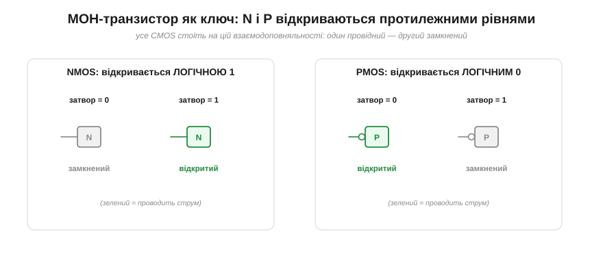
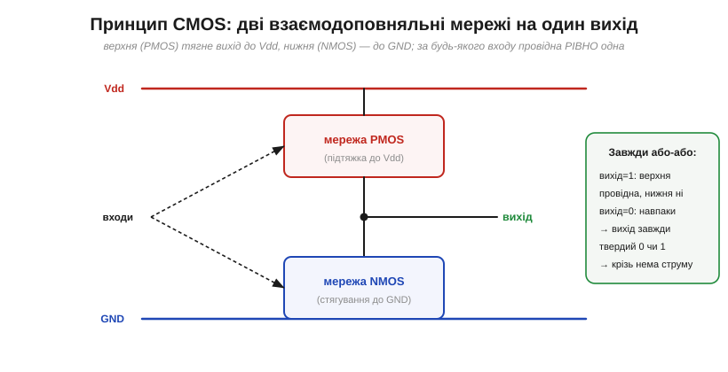
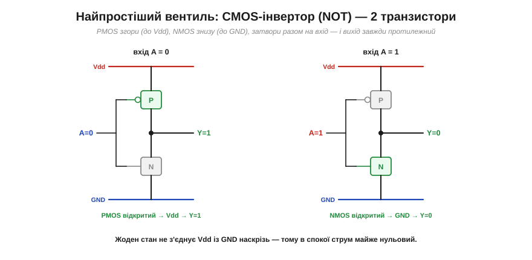

# Як із транзисторів роблять вентиль

Вентиль легко уявити **чорною скринькою**: подав 0 і 1 — отримав результат за таблицею. Та всередині кожного вентиля — кілька **транзисторів**, тих самих [польових MOSFET-ів](book:electronics/mosfet-structure). Розкриймо скриньку й розгляньмо найголовніший трюк усієї цифрової електроніки — **CMOS** ([комплементарну пару](book:electronics/cmos); комплементарний — від лат. *complementum*, «доповнення»), завдяки якому логіка вийшла дешевою, швидкою й майже не споживає енергії в спокої. Заразом стане зрозуміло, [чому NAND/NOR — рідні вентилі кремнію, а AND/OR — похідні](book:electronics/nand-nor), і абстрактна булева алгебра остаточно зведеться до фізики кремнію.

### Транзистор як ключ

Усе починається з простого погляду на MOSFET: це [**керований напругою ключ**](book:electronics/field-control). А вся магія — у тому, що бувають [**два** взаємодоповняльні типи](book:electronics/nmos-pmos), які відкриваються **протилежними** рівнями.

***NMOS** відкривається (проводить) логічною **1** на затворі, а нулем — замикається. **PMOS** — навпаки: відкривається логічним **0**, а одиницею замикається. Тобто за будь-якого рівня на затворі один із цих транзисторів **провідний**, а другий — **замкнений**. Саме на цій дзеркальності («комплементарності», звідки й «C» у CMOS) стоїть уся подальша побудова.*

Запам'ятати легко: **N любить 1, P любить 0**. Дайте обом однаковий сигнал на затвори — і вони завжди в протилежних станах: один відкритий, другий закритий. Ця проста властивість — фундамент, на якому тримається все.

### Принцип CMOS: дві взаємодоповняльні мережі

Ідея CMOS геніально проста. Вихід вентиля з'єднують із живленням **через мережу PMOS** (її звуть **підтяжкою**, *pull-up*) і з землею **через мережу NMOS** (**стягування**, *pull-down*). Мережі будують так, щоб за **будь-якого** набору входів провідною була **рівно одна** з них.

*Загальна будова будь-якого CMOS-вентиля. Верхня мережа з PMOS тягне вихід до **Vdd** (дає «1»), нижня з NMOS — до **GND** (дає «0»). Входи керують обома мережами одночасно, і вони влаштовані **взаємовиключно**: коли провідна верхня — нижня замкнена, і навпаки. Тому вихід завжди **твердо** притиснутий або до Vdd, або до GND — ніколи не «висить» і в усталеному стані не з'єднує Vdd із GND наскрізь (а от під час самого перемикання обидві мережі на коротку мить прочиняються — про цей нюанс нижче).*

З цього принципу одразу випливають дві чудові властивості: вихід завжди **повносилий** (близько до шин — звідси чудові [рівні й запас за завадостійкістю](book:electronics/logic-families)), і крізь вентиль у спокої **не тече** наскрізний струм (бо одна з двох мереж завжди розірвана). Тепер наповнімо цю схему конкретними транзисторами.

### Інвертор — найпростіший вентиль

Почнімо з найменшого — **інвертора** (NOT; від лат. *inverto* — «перевертати», бо він перевертає вхід на протилежне). Тут кожна «мережа» — це один-єдиний транзистор: один PMOS згори, один NMOS знизу, обидва затвори — на спільний вхід.

*Інвертор із двох транзисторів. **Вхід A=0**: PMOS відкритий (любить 0), NMOS замкнений — вихід притягнуто до Vdd, Y=1. **Вхід A=1**: PMOS замкнений, NMOS відкритий (любить 1) — вихід притягнуто до GND, Y=0. Вихід завжди **протилежний** входу — це і є NOT. Зверніть увагу: в жодному стані немає наскрізного шляху Vdd→GND, тож у спокої струм майже нульовий.*

Ось вона — вся «магія» інверсії, у двох транзисторах. Подивіться, як гарно працює комплементарність: той самий вхід відкриває рівно один транзистор і замикає інший, тож вихід щоразу певно «знає», куди йому стати. Це **найважливіша** елементарна комірка кремнію — з інвертора (часом просто як «підсилювача-відновлювача») складають незліченні вузли, і саме його два транзистори додають до NAND, щоб [перетворити його на AND](book:electronics/nand-nor).

### NAND і NOR: послідовно ↔ паралельно

А тепер — вентилі на два входи, і тут відкривається елегантна **двоїстість**. Щоб дістати NAND чи NOR, ту саму пару транзисторів з'єднують **послідовно** або **паралельно** — дзеркально у верхній і нижній мережах.

***NAND**: два NMOS **послідовно** в стягуванні (вихід піде в 0, лише коли ОБИДВА входи 1 — обидва відкриті, ланцюг до GND замкнено), і дзеркально два PMOS **паралельно** в підтяжці. **NOR**: навпаки — два NMOS **паралельно** (досить однієї 1, щоб стягнути вихід у 0) і два PMOS **послідовно**. Щоразу — рівно **4 транзистори**, а мережі завжди дзеркальні: послідовно в одній ⇔ паралельно в іншій.*

Вловіть логіку «послідовно = і». Щоб струм пройшов крізь **послідовний** ланцюг двох NMOS до землі, **обидва** мусять бути відкриті (обидва входи 1) — це й дає поведінку «0 на виході лише коли все 1», тобто NAND. А **паралельний** ланцюг проводить, якщо відкритий **хоч один**, — це «або», звідки NOR. Послідовність — це «і», паралельність — «або»: рівно той звʼязок між [булевою алгеброю](book:math/boolean-algebra) і перемиканням ланцюгів, який Клод Шеннон 1937 року помітив у релейних схемах, тільки тепер він утілений у транзисторах.

### Чому CMOS виграв — і чому «простий» AND дорожчий

Лишається зрозуміти, **чому** саме CMOS витіснив усі інші способи робити логіку — і чому «прямий» AND виходить дорожчим за «перевернутий» NAND.

*Ліворуч — сила CMOS: в усталеному стані Vdd і GND не з'єднані наскрізь, тож статичний струм **малий** (хоч і не точно нульовий — лишається струм витоку); енергія йде **переважно на перемикання** (перезаряд ємностей), звідси динамічна потужність P ≈ C·V²·f — і менші напруга й частота прямо означають менше тепла. Праворуч — рахунок транзисторів: інвертор 2, NAND/NOR по 4, а **AND = NAND + інвертор = 6**, OR = NOR + інвертор = 6. Ось чому NAND/NOR — рідні, базові, а AND/OR будують **через** них.*

Тепер видно все разом. **Низька потужність**: оскільки одна з мереж завжди розірвана, постійного струму від живлення до землі немає — чип «їсть» майже тільки тоді, коли перемикається. Це й зробило можливими щільні мікросхеми на мільярди транзисторів, які не згоряють від власного тепла, і живлені від батареї пристрої на кшталт ESP32. А **рахунок транзисторів** остаточно пояснює, [чому NAND і NOR — базові, а AND і OR будують через них](book:electronics/nand-nor): «природний» CMOS-вентиль — це NAND чи NOR (бо мережа стягування з двох транзисторів природно дає інверсію), а щоб дістати «прямий» AND, доводиться **доклеїти** інвертор і витратити на два транзистори більше. У кремнії простота — на боці «перевернутих» вентилів.

Заради чесності додаймо, що «нульова статична потужність» — **ідеалізація**, зручна для моделі стабільних 0/1, але не вся правда. Реальний CMOS споживає й у спокої: крізь транзистори тече дрібний **струм витоку** (і що дрібніший техпроцес, то він помітніший — у сучасних чипах це вже відчутна частка). А під час **перемикання**, поки вхід проходить «середину» між 0 і 1, обидві мережі на мить **прочинені** — і крізь вентиль проскакує короткий **наскрізний струм** (*shoot-through*). Тому **повільні** фронти на вході шкідливі вдвічі: вони подовжують цей наскрізний струм (зайвий нагрів), а на високоомних входах можуть навіть спричинити паразитні **коливання** — через що даташити логічних серій прямо вимагають достатньо крутих вхідних фронтів (звідси й [тригери Шмітта](book:electronics/threshold-schmitt) на «брудних» входах). Тож повна потужність CMOS — це **динамічна** (перемикання, головна) **плюс статична** (витоки), а не «лише під час перемикання». Для нашої моделі ідеалізація годиться, але в реальному проєктуванні враховують обидва доданки.

> 🔧 **Навіщо це.** Розуміння, що вентиль — це **кілька транзисторів-ключів**, а не магія, дає кілька дуже практичних висновків. По-перше, чому цифрова логіка майже не гріється в спокої, але починає споживати тим більше, чим **швидше** перемикається (P ∝ f) і чим **вища** напруга (P ∝ V²) — звідси вся боротьба за нижчий Vdd у живленні мікроконтролерів. По-друге, чому вхід CMOS «нічого не споживає» (затвор — це [ізольований конденсатор](book:electronics/gate-capacitance)), але його **ємність** доводиться перезаряджати на кожному фронті — а це й є та сама [RC-затримка фронту](book:electronics/edges-rise-time). По-третє, чому реальні чипи рясніють NAND/NOR: вони просто **дешевші** транзисторами. Логіка перестає бути абстракцією — за кожним вентилем стоять конкретні ключі, що жеруть конкретні джоулі.

---

Підсумок: вентиль зсередини — це **транзистори-ключі** ([польові MOSFET](book:electronics/mosfet-structure)). Уся **CMOS**-логіка стоїть на комплементарності: **NMOS** відкривається 1, **PMOS** — 0, тож вихід з'єднують із Vdd через мережу PMOS (**підтяжка**) і з GND через мережу NMOS (**стягування**), влаштовані так, що провідна завжди **рівно одна**. Звідси **інвертор** (2 транзистори, вихід завжди протилежний входу), а далі — **NAND/NOR** (по 4 транзистори) за принципом «послідовно = і, паралельно = або», з дзеркальними мережами. CMOS переміг через **дуже малу статичну потужність** (енергія йде переважно на перемикання, P ≈ C·V²·f; у спокої лишається тільки струм витоку) і повносилі рівні, а рахунок транзисторів (AND = NAND + інвертор = 6) пояснює, чому [NAND/NOR — рідні вентилі кремнію](book:electronics/nand-nor). Зі з'єднаних між собою вентилів будують [комбінаційні схеми](book:electronics/combinational-circuits) — блоки, що **рахують**: суматори, мультиплексори, дешифратори.

---
