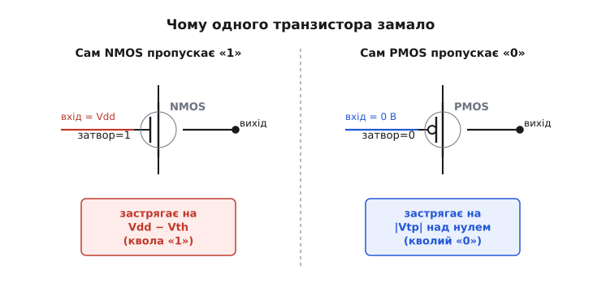
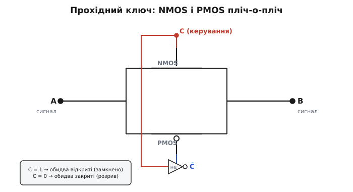
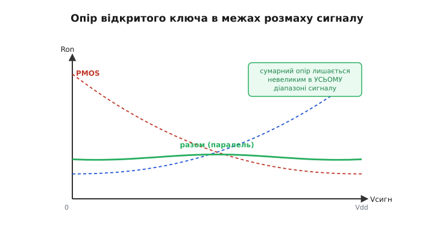

# CMOS-прохідний ключ (transmission gate)

Уявіть, що вам треба не **сформувати** логічний рівень, а просто **з'єднати дві точки дротом** — і то так, щоб цей дріт можна було командою то прокласти, то прибрати. Не «видати 0 чи 1», а пропустити крізь себе будь-яку напругу, яка там уже є, в обидва боки, без власної думки про неї. У кремнії таким керованим шматком дроту і є **прохідний ключ** (англ. *transmission gate* — «передавальний вентиль»; також *pass gate*). Його будова парадоксально проста — лише два транзистори пліч-о-пліч, — але саме ця пара робить те, чого жоден транзистор поодинці не вміє: чесно проводить **весь** розмах сигналу від землі до живлення.

Щоб зрозуміти, навіщо потрібні **два**, треба спершу побачити, чим поганий **один**. А це, своєю чергою, повертає нас до самого способу, у який польовий транзистор проводить струм.

### Чому одного транзистора замало

[MOSFET — це ключ, керований напругою на затворі](book:electronics/field-control): підняв напругу затвор–канал вище порога — канал відкрився, струм тече; опустив — канал зник, розрив. Тонкість у слові «затвор–**канал**»: відкритість залежить не від напруги затвора самої по собі, а від **різниці** між затвором і тим, що в каналі. А коли транзистор працює прохідним ключем, у його каналі сидить **сам сигнал, який ми пропускаємо** — і він не стоїть на місці, а гуляє від 0 до Vdd. Отут і ховається пастка.

Візьмемо n-канальний транзистор (NMOS) і спробуємо пропустити крізь нього високий рівень. Затвор тримаємо на Vdd (ключ нібито відкритий), на вхід подаємо Vdd, хочемо побачити Vdd на виході. Поки вихідна напруга низька, різниця затвор–канал велика, канал широкий — заряд біжить, вихід росте. Але що вище піднімається вихід, то **менша** стає різниця між затвором (він на Vdd) і каналом (він уже майже на Vdd). Щойно вихід доходить до **Vdd − Vth** (де Vth — [порогова напруга](book:electronics/mosfet-threshold), англ. *threshold*), різниця затвор–канал падає рівно до порога — і канал **закривається сам собою**. Далі вихід не йде. Кажуть: NMOS пропускає **сильний нуль, але кволу одиницю** — він добре дотягує до землі, та не дотягує до живлення на цілий поріг.

PMOS поводиться дзеркально. Він відкривається низьким затвором і чудово передає високий рівень, бо біля Vdd різниця затвор–канал у нього велика. А от коли треба протягти сигнал **донизу**, до нуля, його канал закривається, не дійшовши до землі: вихід застрягає десь на **|Vtp|** над нулем. PMOS пропускає **сильну одиницю, але кволий нуль**.


*Те, що псує одинокий транзистор-ключ. Ліворуч NMOS пропускає високий рівень лише до Vdd − Vth і там «затискається» сам: коли вихід підріс, різниці затвор–канал уже бракує, щоб тримати канал відкритим. Праворуч PMOS дзеркально не дотягує низький рівень до нуля, застрягаючи на |Vtp|. Кожен сильний з одного боку шкали й кволий з протилежного.*

Це не дрібниця, яку можна стерпіти. Втрачений поріг — це з'їдений [запас завадостійкості](book:electronics/noise-margin): «одиниця», що не дотягла до шини, ближча до зони невизначеності, і будь-яка завада штовхне її в хибне читання. Гірше того — якщо така квола «одиниця» потрапляє на вхід наступного CMOS-вентиля, вона не повністю замикає його p-мережу, і крізь вентиль починає текти зайвий **наскрізний струм**, гріючи кристал. Один транзистор як ключ годиться там, де сигнал ходить лише біля «свого» краю шкали; для **повного** розмаху він непридатний.

> 🔧 **Навіщо це.** Тут видно, чому в цифрових бібліотеках ключі для сигналу майже ніколи не роблять на одному транзисторі. Якщо комірці треба передати рівень, що гуляє в усьому діапазоні живлення — вибрати один із двох входів, замкнути петлю зворотного зв'язку в защіпці, прокинути дані повз вентиль, — одинокий NMOS чи PMOS зіпсує один із країв і відбере запас. Звідси й народжується прохідний ключ: поставити обидва й дати кожному робити те, що він уміє.

### Двоє, що доповнюють один одного

Розв'язок напрошується сам: якщо NMOS добрий унизу й поганий угорі, а PMOS — навпаки, **увімкнімо їх паралельно**. З'єднаймо стік одного зі стоком другого, витік — з витоком, щоб вони перекривали той самий шлях A↔B. Тоді на будь-якій ділянці шкали працює той, кому там зручно: біля землі тягне NMOS, біля живлення підхоплює PMOS, а посередині обидва допомагають. Жодного «мертвого» краю більше нема — пара проводить **весь** розмах від 0 до Vdd.

Лишається одне: щоб ця пара була **ключем**, обидва транзистори мусять відкриватися й закриватися **разом**. Але NMOS любить на затворі одиницю, а PMOS — нуль. Тому на їхні затвори подають **протилежні** рівні: на NMOS — сигнал керування C, на PMOS — його заперечення C̄. Заперечення дає крихітний [інвертор](book:electronics/cmos-gate) тут-таки поруч. Коли C = 1, NMOS дістає 1, PMOS дістає 0 — **обидва відкриті**, ключ замкнений. Коли C = 0, обидва дістають «свій» закривальний рівень — **обидва закриті**, між A і B розрив. Один сигнал керує парою, і пара діє як єдиний ключ.


*Будова прохідного ключа. NMOS і PMOS увімкнені паралельно між тими самими вузлами A і B. На затвор NMOS іде сигнал керування C, на затвор PMOS — його заперечення C̄ від маленького інвертора. C = 1 відкриває обидва (ключ замкнено, A і B з'єднані), C = 0 закриває обидва (розрив). Жодного «верху» й «низу»: сигнал так само вільно йде з A в B, як із B в A.*

Зверніть увагу на симетрію цієї картинки. У ключа немає виділеного «входу» й «виходу» — лише два рівноправні виводи A і B. Струм так само охоче тече з A в B, як і навпаки, бо канал MOSFET сам по собі **двонапрямлений**: він не діод, у нього немає «правильного» боку. Тому прохідний ключ ще звуть **двонапрямленим** (англ. *bilateral* — «двобічний»). Це не дрібна деталь, а суть: саме двонапрямленість дозволяє одним ключем замкнути петлю зворотного зв'язку, де сигнал має йти то в один бік, то в інший, або з'єднати дві шини, не вирішуючи наперед, котра з них джерело.

> 🔧 **Навіщо це.** Інвертор у складі ключа — це ціна, яку платять за повний розмах: на кожен прохідний ключ припадає ще пара транзисторів на формування C̄. У готових мікросхемах-ключах ([на кшталт серій 4066/4051, що комутують аналоговий сигнал](book:electronics/analog-switches-mux)) цей інвертор уже всередині, і ви бачите лише вивід «дозвіл». А коли ключі будують **усередині** цифрової комірки (мультиплексора, защіпки), один інвертор часто роздають на кілька ключів, бо C̄ потрібне їм усім.

### Опір відкритого ключа: два горби, що гасять один одного

Замкнений прохідний ключ — не ідеальна перемичка з нульовим опором, а маленький резистор. Його [опір у відкритому стані](book:electronics/mosfet-switch) (англ. *on-resistance*, Ron) — головна неідеальність, і поводиться він повчально.

Опір кожного з двох транзисторів **залежить від рівня сигналу**, бо від рівня залежить різниця затвор–канал, а отже й ширина каналу. У NMOS біля землі різниця велика, канал широкий, опір малий; ближче до Vdd різниця тане, канал звужується, опір круто росте (до того самого порога, де NMOS зовсім закрився б сам). У PMOS усе дзеркально: малий опір біля Vdd, великий біля нуля. Кожна крива опору — це горб, задертий до «свого» поганого краю.

А тепер найкрасивіше. Транзистори увімкнені **паралельно**, тож складаються не їхні опори, а їхні **провідності** (величини, обернені до опору): G = G_N + G_P, і вже звідси Ron = 1 / (G_N + G_P). Там, де опір NMOS злітає вгору (біля Vdd), його провідність падає до нуля — але саме там провідність PMOS максимальна, і вона тримає суму. І навпаки біля землі. Два горби опору, задерті в протилежні боки, у паралельному з'єднанні **гасять один одного**: сумарний Ron лишається невеликим в усьому діапазоні сигналу, лиш трохи піднімаючись десь посередині, де жоден із двох не у своїй найкращій формі.


*Чому Ron прохідного ключа лишається обмеженим. Пунктиром — опір кожного транзистора окремо: NMOS малий біля нуля й росте до Vdd, PMOS навпаки. Суцільна крива — опір пари в паралель: де один здається, другий тягне, тож загальний опір не злітає на жодному краї, а лише трохи горбатиться посередині. Саме це робить ключ придатним для всього розмаху сигналу, а не для половини.*

Те, що Ron не зовсім сталий, а трохи «дихає» з рівнем сигналу, має наслідок: на низькоомному навантаженні ця нерівність вносить дрібне **нелінійне спотворення**. Для логіки це байдуже (там сигнал стрибає між кінцями, а не плавно гуляє), а от для комутації якісного аналогового сигналу — уже ні, і саме тому в прецизійних ключах борються не лише за малий, а й за **рівний** Ron.

Звідки беруться конкретні числа — варто прорахувати на пальцях. Опір каналу відкритого MOSFET грубо обернений до запасу над порогом:

```
Ron(NMOS) ≈ 1 / [ k·(Vgs − Vth) ]
```

де k збирає в собі розміри транзистора й рухливість носіїв. Підставмо рівень сигналу замість Vgs і подивімося, як росте опір NMOS, коли вихід підбирається до Vdd.

**Приклад. Vdd = 3.3 В, Vth = 0.7 В, коефіцієнт k = 1.5 мА/В². Який опір NMOS біля землі й біля верху?**
```
Сигнал = 0.3 В (низько):
  Vgs − Vth = (3.3 − 0.3) − 0.7 = 2.3 В
  Ron ≈ 1 / (1.5e-3 · 2.3)        = 290 Ω

Сигнал = 2.6 В (близько до Vdd − Vth):
  Vgs − Vth = (3.3 − 2.6) − 0.7 = 0.0 В
  Ron → ∞   (канал ось-ось закриється)
```
Біля землі NMOS дає прийнятні сотні ом, а коло Vdd його опір прямує в нескінченність — сам він тут марний. Якраз у цій точці PMOS, навпаки, відкритий навстіж і дає свої сотні ом, тож пара тримає розумний сумарний опір там, де NMOS уже здався. Підставивши дзеркальні числа в PMOS і склавши провідності, дістанемо ту саму суцільну криву з фігури: ніде не злітає.

### Як прохідний ключ робить логіку

Двонапрямлений ключ, що чесно проводить весь розмах, — це не лише «аналогова перемичка». На ньому будують і саму **цифрову** логіку, причому подеколи дешевше, ніж на звичайних вентилях. Принцип звуть **передавальною логікою** (англ. *pass-transistor logic*): значення не формується щоразу заново мережею до шин, а **пропускається** з входу на вихід крізь ключі, якими керують інші сигнали.

Найнаочніший приклад — **мультиплексор «2 в 1»**, вибір одного з двох сигналів. Поставмо два прохідні ключі: вхід D0 через перший на спільний вихід, вхід D1 через другий на той самий вихід. Керуймо ними протилежно — першим сигналом S̄, другим S. Коли S = 0, відкритий лише перший ключ: на вихід проходить D0. Коли S = 1 — лише другий: проходить D1. Один біт вибору, два ключі, і вихід — копія обраного входу, повносила, бо ключ передає весь розмах.

**Приклад. Той самий вибір «2 в 1», записаний як логіка на мові C — модель того, що роблять транзистори.**
:::tabs
```cpp
// Прохідний ключ замикається керуванням і "копіює" вхід на вихід.
// out лишається тим, чим був, поки ключ розімкнено (тут — просто
// обираємо активний ключ; у кремнії неактивний шлях висить у Z).

int mux2_tg(int d0, int d1, int sel) {
    if (sel == 0) return d0;   // відкритий ключ S̄: проходить D0
    else          return d1;   // відкритий ключ S : проходить D1
}
```
```py
# Прохідний ключ замикається керуванням і "копіює" вхід на вихід.
# out лишається тим, чим був, поки ключ розімкнено (тут — просто
# обираємо активний ключ; у кремнії неактивний шлях висить у Z).

def mux2_tg(d0, d1, sel):
    if sel == 0:
        return d0   # відкритий ключ S̄: проходить D0
    else:
        return d1   # відкритий ключ S : проходить D1
```
:::
Логіка тривіальна — і в цьому суть: мультиплексор на двох прохідних ключах не «обчислює», він **спрямовує**. У звичайному CMOS той самий вибір вимагав би більше транзисторів (вентилі AND-OR з інверторами); передавальна логіка робить його коротше, бо користається тим, що ключ просто пропускає готовий рівень.

З мультиплексора «2 в 1» виростає чимало. Поставте на один із входів сигнал, а на другий — його заперечення, керуйте вибором іншою змінною — і дістанете **XOR/XNOR** малою ціною; це класична економна реалізація «виключного або» в передавальній логіці. А з'єднайте вихід защіпки назад на її вхід **через прохідний ключ** — і дістанете кероване **тримання стану**: ключ замкнено, петля замкнена, [защіпка](book:electronics/sr-latch) тримає біт; ключ розімкнено, петлю розірвано, у защіпку можна вписати нове. Саме так усередині [D-защіпок і тригерів](book:electronics/d-flip-flop) прохідні ключі керують тим, коли комірка «слухає» вхід, а коли «замикається» на збереженому значенні.

> 🔧 **Навіщо це.** Передавальна логіка — це не екзотика з підручника, а те, що лежить у кожному мультиплексорі, защіпці й тригері всередині мікросхем і ПЛІС. Розуміючи прохідний ключ, ви розумієте, **чому** тригер має фази «прозорий / замкнений» і чому мультиплексор у кремнії — це не «велика формула», а кілька керованих перемичок. Це й пояснює, чому такі вузли виходять компактними та швидкими.

### Чого прохідний ключ не вміє

У прохідного ключа є межі, і їх варто тримати в голові, щоб не помилитися з застосуванням.

Перше: він **не підсилює й не відновлює** сигнал. Звичайний вентиль на виході дає свіжі, повносилі рівні від власних шин — він **джерело**. Прохідний ключ нічого свого не дає: що на вхід прийшло, те (з невеликою втратою на Ron) і вийде. Тому довгі ланцюги передавальної логіки, де сигнал біжить крізь багато ключів поспіль, **слабшають** — на кожному Ron і паразитній ємності рівень мерхне й гальмується. Лік один: через кожні кілька ключів ставлять інвертор-**відновлювач**, що знов притискає рівень до шини. Передавальною логікою будують короткі ділянки, а не цілі магістралі.

Друге: розімкнений ключ лишає вихід **у високому імпедансі** (Z — ні до чого не притиснутий). Якщо в схемі бувають миті, коли **жоден** ключ на спільному вузлі не відкритий, цей вузол повисає в повітрі й тримає старий заряд лише на паразитній ємності — доти, доки витоки його не зіпсують. У защіпках це використовують навмисно (короткочасне зберігання на ємності), але там, де такого не хочуть, дбають, щоб у кожен момент був замкнений **рівно один** шлях, або вішають слабкий відновлювач, що тримає вузол.

Третє — і це межа між **цим** і сусіднім поняттям. Коли той самий прохідний ключ беруть, щоб комутувати не логіку, а **аналоговий сигнал** (звук, напругу з давача), на передній план виходять зовсім інші числа: рівність Ron у всьому розмаху, [струм витоку розімкненого ключа, інжекція заряду в мить перемикання, ізоляція на високих частотах](book:electronics/analog-switches-mux). Сам **прилад** той самий — два транзистори паралельно з інвертором, — але як **аналоговий ключ** його оцінюють за прецизійністю, а як цифрову **передавальну логіку** — за швидкістю й компактністю. Одна цеглинка, два кути зору.

Звідки, до речі, взялася сама назва й перші такі мікросхеми — окрема [коротка історія прохідного ключа й «двобічних ключів» серії 4000](book:electronics/cmos-transmission-gate/hist-transmission-gate.md): як CMOS подарував електроніці керовану перемичку, що однаково добре пропускає і логіку, і аналог.
