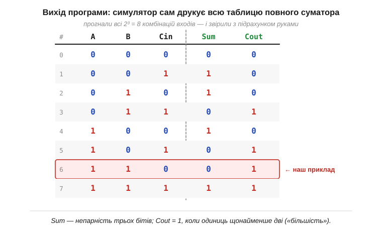

# ⚙️ Симулятор вентилів: збираємо повний суматор і проганяємо всю таблицю істинності

> Це алгоритмічна вставка про [комбінаційну схему](topic:electronics/combinational-circuits) — повний суматор, зібраний із двох півсуматорів і OR. Намалювати таку схему й **звірити її з рукою** на одному прикладі легко, але одна перевірена комбінація — це ще не доказ: повний суматор має 2³ = 8 рядків, і помилка легко ховається в тому рядку, який забули перебрати. Тут ми зробимо інакше — напишемо крихітну програму, що **сама** збере схему з вентилів і прожене **всі вісім** комбінацій, друкуючи таблицю істинності. Заразом побачимо, як інженери описують схему так, щоб її «зрозумів» комп'ютер, — це той самий принцип, на якому стоять справжні логічні симулятори (*logic simulators*).

### Задача

Маємо схему з вентилів — повний суматор — і хочемо, щоб машина обчислила її вихід для будь-якого набору входів, а тоді й для **всіх** наборів одразу. Звести це до коду непросто з однієї причини: [вентилі](topic:electronics/basic-gates) з'єднані не як завгодно, а **ланцюжком**, де вихід одного стає входом іншого. Щоб порахувати OR переносів, треба спершу знати обидва переноси; щоб знати їх — спершу обчислити перший півсуматор. Тобто порядок обчислення **диктує сама схема**, і програма мусить його дотримати.

### Ідея: схема як список вузлів

Ключ — описати схему не картинкою, а **даними**: списком вузлів, де кожен вузол каже, який він вентиль і звідки бере входи. Входи й проміжні сигнали отримують **імена** (так само, як на схемі підписують проміжні дроти), а вузол посилається на ці імена. Виходить структура, яку інженери звуть **нетлістом** (*netlist*, «список з'єднань»), — текстовий опис того, що на схемі намальовано лініями.


*Повний суматор, записаний нетлістом. Кожен вузол — це маленький запис «який вентиль (op) і два його входи за іменами». Входи A, B, Cin відомі (тут A=1, B=1, Cin=0); решта сигналів обчислюється по черзі: g1, g2 (перший півсуматор), тоді g3, g4 (другий, що бере g1 і Cin), і нарешті g5 = Cout (OR двох переносів). Сірі стрілки — залежності «хто від кого». Порядок g1→…→g5 не випадковий: вузол рахують лише тоді, коли всі його входи вже відомі.*

Цей порядок «обчислюй вузол лише після його входів» і є серцем усієї справи. Якщо вузли вже виписати в такій послідовності (а для невеликої схеми це легко зробити руками), то симулятор просто йде списком **згори вниз**, раз за разом беручи готові значення зліва й кладучи новий результат у словник сигналів. Жодної магії — лише акуратний обхід у правильному порядку.

### Симулятор у коді

Тема залізна, тож і код беремо мовою заліза — C++. Спершу самі [вентилі](topic:electronics/basic-gates). Кожен із них — це елементарна дія над бітами, тож увесь набір кодується одним `switch`:

```cpp
#include <cstdio>
#include <string>
#include <vector>
#include <map>

// Чотири вентилі — кожен це елементарна дія над бітами
enum class Op { And, Or, Xor, Not };

int gate(Op op, int a, int b) {
    switch (op) {
        case Op::And: return a & b;   // 1 лише коли обидва 1
        case Op::Or:  return a | b;   // 1 коли хоч один 1
        case Op::Xor: return a ^ b;   // 1 коли біти різні
        case Op::Not: return 1 - a;   // перевертає 0↔1 (b не потрібен)
    }
    return 0;
}
```

Тепер — обчислювач нетліста. Вузол — це маленький запис «який вентиль і звідки два входи за іменами». Обчислювач тримає словник `signals` (ім'я → 0/1), куди спершу лягають входи, а тоді проходить вузли по черзі. Входи читаємо через `.at()` навмисно: якщо вузол послався на ще не обчислене ім'я, програма чесно спіткнеться, а не тихо підставить нуль і збреше:

```cpp
// Вузол нетліста: який вентиль і звідки два його входи (за іменами)
struct Node {
    std::string name;   // ім'я вузла = підписаний проміжний дріт
    Op op;              // який вентиль
    std::string a, b;   // входи за іменами; b порожнє, якщо вхід один (NOT)
};

// Обчислити нетліст: signals відображає ім'я → його значення 0/1
std::map<std::string, int> evaluate(const std::vector<Node>& net,
                                    std::map<std::string, int> signals) {
    for (const Node& n : net) {                      // порядок — топологічний
        int va = signals.at(n.a);
        int vb = n.b.empty() ? 0 : signals.at(n.b);  // NOT має лише один вхід
        signals[n.name] = gate(n.op, va, vb);        // порахували — запам'ятали
    }
    return signals;
}
```

Сам повний суматор — це п'ять вузлів нетліста (два XOR і два AND двох півсуматорів плюс OR переносів):

```cpp
// Повний суматор — п'ять вузлів, уже в топологічному порядку
std::vector<Node> adder = {
    {"g1", Op::Xor, "A",  "B"},    // півсуматор 1: сума    = A⊕B
    {"g2", Op::And, "A",  "B"},    // півсуматор 1: перенос = A·B
    {"g3", Op::Xor, "g1", "Cin"},  // півсуматор 2: сума    = Sum
    {"g4", Op::And, "g1", "Cin"},  // півсуматор 2: перенос
    {"g5", Op::Or,  "g2", "g4"},   // об'єднаний перенос    = Cout
};
```

Імена вузлів `g1…g5` — ті самі, що в нетлісті на рисунку: підсумкова сума виходить у `g3`, об'єднаний перенос — у `g5`. Лишилося прогнати **всі** входи. Їх рівно 2³ = 8, тож перебрати їх — це три вкладені цикли «0/1». Для кожного набору обчислюємо схему й друкуємо рядок:

```cpp
int main() {
    printf("A B Cin | Sum Cout\n");
    for (int A = 0; A <= 1; ++A)
        for (int B = 0; B <= 1; ++B)
            for (int Cin = 0; Cin <= 1; ++Cin) {
                auto s = evaluate(adder, {{"A", A}, {"B", B}, {"Cin", Cin}});
                printf("%d %d  %d  |  %d    %d\n",
                       A, B, Cin, s.at("g3"), s.at("g5"));   // Sum=g3, Cout=g5
            }
}
```

Усе разом — кілька десятків рядків живого коду: чотири вентилі, обчислювач нетліста, опис суматора й цикл-драйвер. А на виході — повна таблиця, яку лишається звірити з тією, що ми вивели руками.


*Те, що друкує симулятор: усі вісім рядків. Підсвічений рядок A=1, B=1, Cin=0 дає Sum=0, Cout=1 — рівно те, що дає підрахунок руками. Звіривши всі вісім, переконуємося, що схема правильна **скрізь**, а не лише в одній перевіреній точці. Sum — непарність трьох бітів, Cout — «більшість» (одиниць щонайменше дві).*

### Чому це працює

Програма не «розуміє» арифметики — вона лише чесно повторює те, що робить залізо: проводить біти крізь вентилі в тому порядку, в якому ті з'єднані. Оскільки нетліст виписано топологічно (кожен вузол **після** своїх входів), у мить обчислення вузла обидва його значення вже лежать у словнику. Тому результат збігається з фізичним суматором рядок у рядок — а вісім збігів поспіль уже не випадковість, а вичерпна перевірка: для схеми з трьох входів **усіх** можливих ситуацій рівно вісім, і всі вони пройдені.

### Складність і пастки на МК

- **Час росте як 2ⁿ.** Вичерпний прогін перебирає **всі** входи, а їх 2ⁿ. Для трьох входів це 8 рядків — дрібниця; для 32-бітного суматора (65 входів) — астрономічне число, повна таблиця нездійсненна (та сама «стіна» 2ⁿ, що постає, коли [із вентилів складають складні функції](topic:electronics/gates-to-functions)). Тоді входи або перебирають **вибірково** (важливі випадки + випадкові), або переходять до інших методів перевірки.
- **Порядок вузлів критичний.** Якщо у списку вузол стоїть **перед** тим, чий вихід йому потрібен, `.at()` не знайде імені й програма спіткнеться. Для невеликої схеми порядок виставляють руками; для великої його шукають **топологічним сортуванням** графа (це окрема класична задача). А якщо у схемі є **кільце** зворотного зв'язку (як у [тригерах](topic:electronics/sr-latch), де вихід вентиля повертається на його ж вхід), топологічного порядку не існує взагалі — такий простий «прохід згори вниз» там уже не годиться, і потрібен інший рушій.
- **Лише один біт на сигнал.** Модель тримає в кожному сигналі чистий 0 або 1 і **миттєву** відповідь — без затримок, без гонок і глітчів (*hazards*) під час перемикання. Це правильна **усталена** картина, але не динаміка: справжні симулятори ще й моделюють час, щоб ловити перегони сигналів.
- **На МК — жодних словників, самі побітові операції.** `std::map` із рядковими іменами зручний на столі, але на мікроконтролері він завеликий (купа, рядки). Там його й не треба: вентилі — це буквально інструкції процесора `&`, `|`, `^`, тож суматор згортається в кілька рядків без жодного нетліста:

```cpp
int g1   = A ^ B;             // сума півсуматора 1
int g2   = A & B;             // перенос півсуматора 1
int Sum  = g1 ^ Cin;          // Sum
int Cout = g2 | (g1 & Cin);   // Cout = «більшість»
```

Більше того: раз кожен сигнал — це один біт, у розряди одного цілого можна скласти **всі вісім рядків** таблиці й порахувати їх **за один прохід**. Стовпчик A по восьми рядках — це число `0xF0`, стовпчик B — `0xCC`, Cin — `0xAA`; ті самі `^` і `&` над ними дають одразу цілі стовпчики Sum і Cout:

```cpp
uint8_t A = 0xF0, B = 0xCC, Cin = 0xAA;   // 8 рядків таблиці — по біту на рядок
uint8_t Sum  = A ^ B ^ Cin;               // 0x96 — увесь стовпчик Sum
uint8_t Cout = (A & B) | ((A ^ B) & Cin); // 0xE8 — увесь стовпчик Cout
```

Одна арифметична дія рахує весь стовпчик — вичерпний прогін маленької схеми стає майже безкоштовним.

### Де ще це трапляється

Той самий підхід — «опиши схему нетлістом і прожени по вузлах» — лежить в основі промислових симуляторів цифрової логіки, на яких перевіряють процесори ще до того, як їх віллють у кремній. Наші кілька десятків рядків — їхня крихітна, але чесна модель: ті самі вентилі, той самий обхід у топологічному порядку, та сама ідея вичерпної таблиці. А вміння звести схему до даних і «виконати» її кодом стане в пригоді щоразу, коли логіку треба перевірити раніше, ніж паяти.
