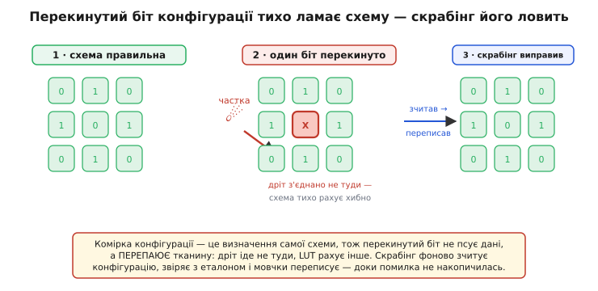
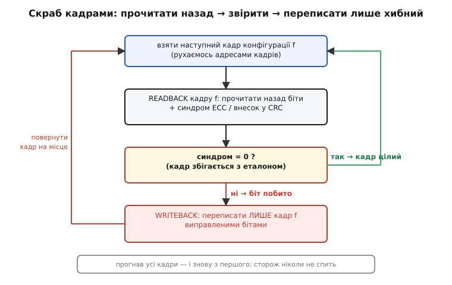
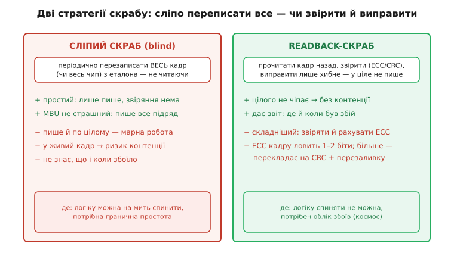
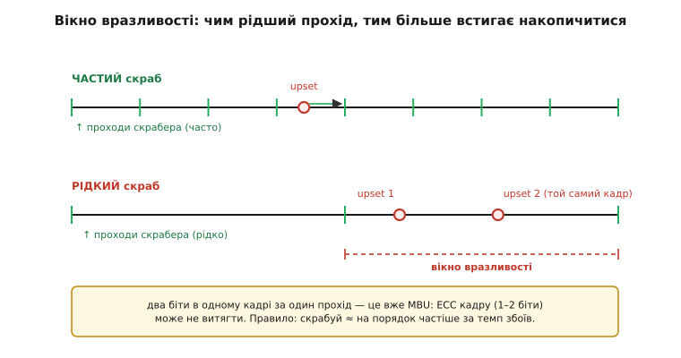

# ⚙️ Скрабер конфігураційної пам'яті: як зчитувати креслення й тихо латати перекинуті біти

Уявімо супутник на орбіті. Усередині його обчислювача — [SRAM-FPGA](topic:electronics/programmable-logic), і вся її схема лежить не в міді, а в [конфігураційній пам'яті](topic:electronics/config-memory) — мільйонах крихітних SRAM-засувів, кожен з яких тримає один біт креслення: цей дріт з'єднати з тим, ця [LUT](topic:electronics/lut) рахує оце. Живлення є, чип працює, усе добре. Аж раптом крізь кристал пролітає заряджена частинка космічного променя, влучає в один-єдиний засув — і перекидає його. Не спалює, не ламає фізично: просто перевертає біт з `0` на `1`. І в ту ж мить один дріт усередині чипа тихо перепаявся: перемикач, що мав вести сигнал у точку B, повів його в точку C.

Найгірше тут — що нічого не «зламалося» в тому сенсі, до якого ми звикли. Чип не завис, не димить, не подає жодної тривоги. Він просто **рахує тепер трохи інакше**, бо його схема нишком стала іншою. Один такий біт можна ще й не помітити — та частки летять безперервно, і рано чи пізно другий, третій, десятий перекинутий біт зіллються у щось, від чого пристрій уже видимо збожеволіє. Питання, яке ми тут розв'язуємо, гранично конкретне: **як фоново, не спиняючи роботу чипа, знаходити ці перекинуті біти й повертати їх на місце — швидше, ніж вони встигають накопичитися?** Відповідь зветься скрабінг (англ. *scrubbing* — «відшкрібання»), і зараз ми напишемо його з нуля, з робочим C-кодом і всіма пастками, на які натикаються ті, хто робить це вперше.

## Задача: креслення повільно тане, а пристрій про це не знає

Почнімо з того, чому це взагалі проблема, — бо без гострого відчуття «навіщо» весь код нижче буде просто ритуалом. Розгляньмо, чим збій у конфігураційній пам'яті відрізняється від звичного нам збою даних.

Коли частинка перекидає біт у пам'яті **даних** — у змінній, у буфері, у стеку — псується **одне число**. Програма, можливо, порахує помилку, можливо, зловить виняток, можливо, наступна ітерація перезапише зіпсовану комірку свіжим значенням, і збій сам собою розсмокчеться. Дані **течуть**: їх постійно переписують, тож поодинокий перекинутий біт часто просто змивається потоком нових значень.

Конфігураційна пам'ять поводиться протилежно. Її залили **один раз** при старті — і більше ніхто в неї не пише. Її вміст не «тече»: він застиг і мовчки визначає схему. Тому перекинутий біт конфігурації **нікуди не змиється сам** — він лишається перевернутим доти, доки хтось ззовні його не поверне. І він псує не число, а **топологію**: дріт іде не туди, [мультиплексор](topic:electronics/analog-mux) вибирає інший вхід, біт таблиці підстановки дає іншу відповідь. Схема тихо стала іншою — і рахує неправильно не через помилку в арифметиці, а тому, що її **фізично склали не так**. Це зветься одиничним збоєм (англ. *single event upset*, SEU — «збій від одиничної події»).


*Комірка конфігурації — це визначення самої схеми, тож перекинутий біт не псує дані, а перепаює тканину: дріт іде не туди, LUT рахує інше. Скрабер фоново зчитує конфігурацію, звіряє з еталоном і мовчки переписує зіпсоване — доки помилка не встигла накопичитися з іншими.*

Тепер — головний нюанс, який робить задачу і можливою, і терміновою водночас. **Можливою** — бо ми **точно знаємо**, яким має бути правильний вміст конфігураційної пам'яті. Це ж той самий потік бітів (бітстрім), що ми заливали при старті; він лежить незмінним в [зовнішній незникній пам'яті](topic:electronics/fpga-configuration) поряд із чипом. Отже, є з чим звіряти — є еталон. **Терміновою** — бо збої **накопичуються**. Один перекинутий біт більшість схем ще переживе (він може влучити в невживану частину тканини, або в місце, де помилка не критична). Але поки ми його не виправили, наступний біт лягає **поверх** нього — і десь на другому-третьому починається справжня біда: два незалежні збої в одному місці схеми, які разом дають ефект, що його жодна одиночна корекція вже не витягне.

> 🔧 **Навіщо це.** Осягніть асиметрію: у пам'яті даних час — ваш союзник (наступна ітерація змиє збій), у конфігураційній пам'яті час — ваш ворог (збої тільки накопичуються, самі не зникають). Тому пам'ять даних часто захищають реактивно — ловлять збій, коли до нього дійшли руки. А конфігураційну доводиться захищати **проактивно й безперервно**: сторож мусить обійти всю пам'ять швидше, ніж встигне лягти небезпечна кількість збоїв. Ця різниця в природі й диктує всю архітектуру скрабера — не «спрацювати на подію», а «постійно обходити коло».

Сформулюймо рівно. **Дано:** SRAM-FPGA, чия конфігураційна пам'ять поступово псується поодинокими перекинутими бітами; поряд є еталонний бітстрім у незникній пам'яті; чип **не можна спиняти** — він робить корисну роботу. **Знайти:** фоновий процес, що безперервно обходить конфігураційну пам'ять, виявляє перекинуті біти й повертає їх на місце — так, щоб між двома обходами не встигала лягти небезпечна кількість збоїв, і так, щоб самі виправлення не заважали роботі чипа. Здавалося б, суперечність: як лізти в пам'ять, що описує **живу** схему, не збивши цю схему? Розв'язок є, і він тримається на одній фізичній обставині, яку варто зрозуміти до кінця.

## Ідея: конфігураційну пам'ять можна читати назад, кадр за кадром

Уся конструкція спирається на те, що конфігураційна пам'ять FPGA — не «річ у собі», замурована навіки. У чипі є **порт конфігурації**: той самий канал, яким бітстрім заливають при старті, працює і у зворотний бік — через нього пам'ять можна **зчитати назад** (англ. *readback* — «зчитування назад»). І, що ключове, цей порт доступний **зсередини**: у більшості сучасних FPGA є внутрішній порт доступу до конфігурації, яким керує логіка **в самому чипі** (у різних виробників він зветться по-різному; узагальнено — внутрішній конфігураційний порт). Тобто скрабер може жити прямо в тканині FPGA й читати її власну конфігурацію, ні на мить не спиняючи решту схеми.

Друга опора — **зернистість**. Конфігураційна пам'ять адресується не байтами й не бітами, а **кадрами** (англ. *frame* — «кадр», «рамка»): кадр — це найдрібніша порція конфігурації, яку можна прочитати чи записати за одну операцію. Один кадр покриває вузьку смужку кристала — кілька стовпчиків клітинок і маршрутизації. Уся пам'ять — це багато тисяч таких кадрів підряд. Це подарунок для нас: не треба перечитувати мільйони бітів разом і не треба переписувати всю конфігурацію, щоб полагодити один збій. Досить **обійти кадри по черзі**, а виправляти — лише той кадр, у якому знайшовся перекинутий біт.

Третя, і найелегантніша, опора — **як саме звіряти кадр з еталоном**. Найпростіше — тримати поряд повну копію правильного бітстріму й порівнювати кадр за кадром байт у байт. Це працює, але вимагає читати еталон із зовнішньої пам'яті на кожен кадр. Розумніші чипи роблять хитріше: у **кожен кадр** зашито власну **контрольну суму з виправленням** — код корекції помилок (англ. *error-correcting code*, ECC). Це кілька додаткових бітів (типово близько десятка на кадр), обчислених так, що вони не лише **виявляють** перекинутий біт усередині кадру, а й **вказують, який саме**, — тобто дають виправити його, не звертаючись до жодного зовнішнього еталона взагалі. А поверх усіх кадрів іде ще одна, глобальна контрольна сума (типово 32-бітна циклічна надлишкова перевірка, англ. *cyclic redundancy check*, CRC — «циклічна надлишкова перевірка»), яка ловить те, що прослизнуло повз покадровий ECC.

> 🔧 **Навіщо це.** Розкладімо ролі, бо на цьому будується весь код. **ECC кадру** — це «медсестра на місці»: вона й помічає збій, і сама його латає, миттєво, без походу по еталон. Але її сил стає лише на **один-два** перекинуті біти в кадрі. **Глобальний CRC** — це «загальний аналіз»: він не каже, **де** саме збій, зате ловить **факт**, що в пам'яті взагалі щось не так, — навіть коли в одному кадрі перекинуто стільки бітів, що покадровий ECC уже здався. **Зовнішній еталонний бітстрім** — це «повна історія хвороби»: коли ECC не витягнув, а CRC лише кричить «біда», ми беремо правильний кадр із незникної пам'яті й переписуємо його цілком. Три рівні захисту, від найдешевшого й найточнішого до найдорожчого й найгрубішого, — і грамотний скрабер користується всіма трьома, кожним за призначенням.

Складімо ідею в один цикл. Скрабер бере кадр за кадром; кожен **зчитує назад** через внутрішній порт; **звіряє** — спершу покадровим ECC, за потреби глобальним CRC; якщо кадр цілий — іде далі, нічого не чіпаючи; якщо перекинуто біт — **переписує лише цей кадр** виправленими даними; дійшов до останнього кадру — вертається до першого й починає коло наново. Сторож, що безперервно обходить креслення й тихо латає дірки.


*Один прохід кільця. Скрабер рухається адресами кадрів, кожен зчитує назад разом із синдромом ECC. Синдром нульовий — кадр збігається з еталоном, ідемо далі, нічого не пишучи. Синдром ненульовий — біт перекинуто: переписуємо лише цей кадр виправленими бітами й вертаємось у коло. Обійшли всі кадри — починаємо з першого: сторож ніколи не спить.*

## Робочий код: цикл readback-скрабу з покадровим ECC і відкатом на CRC

Напишімо скрабер, який керує портом конфігурації FPGA. Це реальна прошивка: код або крутиться в невеликому вбудованому процесорі поряд із тканиною (у багатьох FPGA такий є прямо на кристалі), або в зовнішньому [мікроконтролері](topic:electronics/gpio-expander), що добирається до порту конфігурації по інтерфейсу. Абстрагуймо фізичний доступ до порту за кількома функціями драйвера — так код лишиться читним і не прив'яже нас до конкретного чипа.

Почнімо з найнижчого шару — того, як фізично торкнутися одного кадру. Порт конфігурації працює як адресована пам'ять кадрів: задаєш адресу кадру, а тоді або читаєш його слова назад, або пишеш нові:

```c
#include <stdint.h>
#include <stdbool.h>

// Скільки 32-бітних слів в одному кадрі конфігурації (залежить від чипа;
// у сучасних FPGA — кількадесят слів + кілька слів на ECC/вирівнювання).
#define FRAME_WORDS      101u

// Скільки всього кадрів у конфігураційній пам'яті цього пристрою.
// Реально — багато тисяч; тут число умовне для прикладу.
#define FRAME_COUNT      25000u

// ── Драйвер порту конфігурації (реалізується під конкретний чип) ────────────
// Нижчий шар: керує внутрішнім портом доступу до конфігурації.
extern void     cfg_read_frame (uint32_t frame_addr, uint32_t *dst); // зчитати кадр назад
extern void     cfg_write_frame(uint32_t frame_addr, const uint32_t *src); // переписати кадр
extern uint16_t cfg_frame_ecc  (uint32_t frame_addr); // синдром ECC цього кадру від апаратури
extern uint32_t cfg_global_crc (void);                // поточний глобальний CRC усієї памʼяті
```

Тепер — серце скрабера: перевірка **одного** кадру. Апаратура FPGA сама рахує синдром ECC для щойно зчитаного кадру — нам треба лише його прочитати й розтлумачити. Синдром — це коротке число, у якому апаратура закодувала результат перевірки кадру його власним ECC. Нуль означає «кадр цілий»; ненульове значення несе **тип** проблеми й, для однобітового випадку, **позицію** перекинутого біта:

```c
// Що показав ECC для одного кадру.
typedef enum {
    FRAME_OK = 0,      // синдром нульовий — кадр збігається з еталоном
    FRAME_SBE,         // single-bit error: один перекинутий біт — ECC знає, який
    FRAME_DBE_OR_WORSE // double-bit або гірше — ECC виявив, але виправити НЕ може
} frame_status_t;

// Розкодувати синдром ECC кадру в зрозумілий статус.
// (Точні бітові поля синдрому — з даташита конкретного чипа; тут — типова логіка.)
static frame_status_t decode_ecc(uint16_t syndrome)
{
    if (syndrome == 0u) {
        return FRAME_OK;                 // жодного збою в цьому кадрі
    }
    // Старший біт синдрому у багатьох реалізацій = «є непарна кількість помилок»
    // (класична ознака однобітового збою, який код Геммінга виправляє).
    if (syndrome & 0x8000u) {
        return FRAME_SBE;                // один біт — виправний на місці
    }
    return FRAME_DBE_OR_WORSE;           // два+ біти — місцевого ECC замало
}
```

Чому ми взагалі розрізняємо `FRAME_SBE` і `FRAME_DBE_OR_WORSE`, а не просто «є збій / нема збою»? Бо реакція на них **різна за вартістю**. Однобітовий збій ECC виправляє сам, миттєво, без жодного звертання до зовнішньої пам'яті — це найдешевший і найпоширеніший випадок, заради якого весь механізм і є. А ось два й більше бітів в одному кадрі покадровий ECC уже **не витягне** (класичний код корекції гарантує виправлення лише одного біта, виявлення — двох); тут доведеться діставати правильний кадр із зовнішнього еталона й переписувати його цілком. Розрізнити ці випадки — значить не платити дорогу ціну там, де вистачить дешевої.

Тепер — обробка одного кадру цілком: зчитати, звірити, а за потреби виправити. Зверніть увагу на головну обережність: **у цілий кадр ми не пишемо нічого**. Скрабер торкається пам'яті записом **лише тоді**, коли справді знайшов збій, — і це принципово (чому — розберемо в пастках):

```c
// Правильні («золоті») кадри в незникній пам'яті поряд із чипом —
// той самий бітстрім, що заливали при старті. Потрібні лише для важких випадків,
// коли покадрового ECC не вистачило.
extern void golden_read_frame(uint32_t frame_addr, uint32_t *dst);

typedef enum {
    SCRUB_CLEAN = 0,   // кадр був цілий — нічого не робили
    SCRUB_FIXED_SBE,   // виправили один біт силами ECC (дешево)
    SCRUB_FIXED_HARD,  // довелось перезалити кадр із золотого еталона (дорого)
    SCRUB_FAILED       // не вдалося виправити навіть перезаливкою (тривога!)
} scrub_result_t;

static uint32_t frame_buf[FRAME_WORDS];   // робочий буфер під один кадр

// Обробити ОДИН кадр: прочитати назад, звірити, за потреби виправити.
static scrub_result_t scrub_one_frame(uint32_t f)
{
    cfg_read_frame(f, frame_buf);                 // зчитати кадр назад
    frame_status_t st = decode_ecc(cfg_frame_ecc(f));

    if (st == FRAME_OK) {
        return SCRUB_CLEAN;                       // цілий — не чіпаємо ЖОДНИМ записом
    }

    if (st == FRAME_SBE) {
        // Однобітовий збій: апаратний ECC уже знає позицію й підправив дані
        // в буфері (або ми правимо самі за синдромом). Повертаємо кадр на місце.
        cfg_write_frame(f, frame_buf);
        return SCRUB_FIXED_SBE;
    }

    // FRAME_DBE_OR_WORSE: місцевого ECC замало — беремо золотий кадр і перезаливаємо.
    golden_read_frame(f, frame_buf);
    cfg_write_frame(f, frame_buf);

    // Переконаймося, що перезаливка справді допомогла (раптом б'ється сам кадр чи еталон).
    cfg_read_frame(f, frame_buf);
    if (decode_ecc(cfg_frame_ecc(f)) == FRAME_OK) {
        return SCRUB_FIXED_HARD;
    }
    return SCRUB_FAILED;                          // не витягли — це вже привід бити на сполох
}
```

І нарешті — сам цикл обходу, той, що робить скрабер сторожем. Він іде кадрами по колу: пройшов усі — почав спочатку. Але робить це не наосліп: між кадрами й між колами він дає рахувати корисній логіці, тримає статистику знайдених збоїв (вона потім скаже, чи не занадто густо летять частки) і зважає на глобальний CRC як на дешевий сигнал «десь щось таки перекинулось»:

```c
// Лічильники для телеметрії: скільки й яких збоїв набігло.
typedef struct {
    uint32_t frames_scanned;   // скільки кадрів перевірено
    uint32_t sbe_fixed;        // виправлено однобітових
    uint32_t hard_fixed;       // перезалито з еталона
    uint32_t failed;           // не вдалося виправити — критично
    uint32_t full_passes;      // скільки разів обійшли ВСЮ пам'ять
} scrub_stats_t;

static scrub_stats_t stats;

extern void report_uncorrectable(uint32_t frame); // тривога назовні (журнал, прапор, скидання)
extern void yield_to_logic(void);                 // віддати трохи часу корисній роботі

// Головний фоновий цикл скрабера. Крутиться, доки живий пристрій.
void scrubber_run(void)
{
    uint32_t f = 0;
    uint32_t last_crc = cfg_global_crc();

    for (;;) {
        scrub_result_t r = scrub_one_frame(f);
        stats.frames_scanned++;

        switch (r) {
            case SCRUB_CLEAN:      break;
            case SCRUB_FIXED_SBE:  stats.sbe_fixed++;  break;
            case SCRUB_FIXED_HARD: stats.hard_fixed++; break;
            case SCRUB_FAILED:
                stats.failed++;
                report_uncorrectable(f);   // самі не впорались — хай вирішує система
                break;
        }

        if (++f >= FRAME_COUNT) {           // обійшли всю память — коло замкнулось
            f = 0;
            stats.full_passes++;

            // Дешева глобальна перевірка раз на коло: CRC змінився попри наші виправлення?
            // Значить, десь прослизнув збій, якого покадровий ECC не помітив, — варто
            // на наступному колі бути особливо уважним (або форсувати перезаливку).
            uint32_t crc = cfg_global_crc();
            (void)last_crc;                 // (порівняння/реакція — за політикою пристрою)
            last_crc = crc;
        }

        yield_to_logic();                   // не монополізуємо порт: даємо жити логіці
    }
}
```


*Дві стратегії однієї задачі. Сліпий скраб просто періодично перезаписує весь кадр (чи весь чип) з еталона — гранично простий, не боїться навіть багатобітових збоїв, але марно пише й по цілих кадрах і ризикує зачепити живу логіку. Readback-скраб читає назад, звіряє ECC/CRC і виправляє лише те, що справді побите, — цілого не чіпає, дає повний звіт про збої, коштом складнішої логіки. Перше — де можна на мить спинити логіку й цінна простота; друге — де спиняти не можна й потрібен облік (космос).*

## Сліпий скраб проти readback: коли простіше — краще

Написаний вище скрабер — це **readback-скраб**: він читає, звіряє й виправляє лише хибне. Але є й радикально простіший підхід, і зрозуміти, чому він інколи **виграє**, — значить по-справжньому осягнути задачу.

**Сліпий скраб** (англ. *blind scrubbing* — «сліпе відшкрібання») не читає нічого й не звіряє нічого. Він просто **періодично перезаписує** конфігураційну пам'ять — кадр за кадром, а то й усю разом — правильним бітстрімом із зовнішнього еталона. Не питаючи, чи є там збій. Логіка проста до непристойності: якщо раз у якийсь час затерти всю пам'ять свіжою правильною копією, то будь-який перекинутий біт буде затерто **разом з усім рештою** — просто тому, що ми пишемо поверх усього. Скрабер тут — не сторож із лупою, а прибиральник, що методично мив підлогу, не дивлячись, де саме бруд.

Порівняймо чесно, бо кожен підхід за щось платить.

Сліпий скраб **виграє простотою**. Йому не потрібні ні звіряння, ні ECC-логіка, ні розбір синдромів — лише вміти писати кадри з еталона по таймеру. Його майже неможливо написати неправильно. І — несподівано — він **краще тримає багатобітові збої**: readback-скраб спотикається, коли в одному кадрі перекинуто більше бітів, ніж витягує ECC, а сліпому байдуже, скільки їх, — він однаково перезаписує весь кадр цілком.

Readback-скраб **виграє акуратністю й обліком**. По-перше, він **не пише в цілі кадри** — а їх переважна більшість (збої рідкісні). Менше записів — менше ризику зачепити живу схему й менше витраченої енергії; сліпий же марно переписує тисячі цілих кадрів заради кількох побитих. По-друге, readback **дає звіт**: він знає, скільки збоїв, у яких кадрах і коли — а це безцінно, щоб оцінити реальний темп частинок і вчасно помітити, що радіаційне середовище погіршало. Сліпий скраб працює наосліп у прямому сенсі: він щось латає, але **ніколи не дізнається, що саме й коли** ламалося.

> 🔧 **Навіщо це.** Вибір між ними — це вибір за **обмеженнями місії**, а не за «що краще взагалі». Сліпий скраб беруть там, де цінна гранична простота й де перезапис нічому не завадить, — наприклад, якщо конфігурацію можна оновлювати шматками, не збиваючи критичну логіку, або систему й так можна на мить призупинити. Readback беруть там, де логіку спиняти **не можна** нізащо, де потрібен точний облік збоїв для телеметрії, і де шкода марно ганяти запис по цілій пам'яті. Багато реальних систем роблять **гібрид**: readback як щоденний сторож плюс зрідка сліпий прохід як «генеральне прибирання» від усього, що readback проґавив. Питання не «який кращий», а «що диктує ця конкретна місія».

## Вибір інтервалу: як часто обходити коло

Ми маємо скрабер. Лишилося найтонше рішення в усій задачі: **як швидко** він має обходити пам'ять? Не абстрактно «якнайшвидше» — а конкретне число, від якого прямо залежить, виживе система чи ні.

Спокуса сказати «скрабуй безперервно, на повній швидкості» зрозуміла, але хибна з двох боків. Занадто **повільний** скраб лишає довге вікно, у яке встигає накопичитися небезпечна кількість збоїв, — і ми програємо. Занадто **швидкий** скраб гризеться з корисною логікою за той самий порт конфігурації, гріє чип марною роботою й дає щораз менше користі: перечитувати пам'ять удесятеро частіше, ніж прилітають частки, — це переважно перечитувати кадри, у яких нічого не змінилося. Істина, як завжди, посередині, і її можна прикинути числом.

Ключ — **темп збоїв**: як часто у **цій конкретній** пам'яті в **цьому конкретному** середовищі прилітає один перекинутий біт. Його або беруть із паспорта чипа (виробник дає стійкість комірки до збоїв — переріз, англ. *cross-section*), помноженого на потік частинок середовища, або міряють прямо на місці тими самими лічильниками `stats`, що ми завели. Хай, для прикладу, вийшло: у робочій орбіті ця пам'ять ловить у середньому **один перекинутий біт на 10 секунд**.

Тепер — правило, яке інженери вивели й перевірили на практиці: **скрабер має встигати обійти всю пам'ять приблизно на порядок частіше, ніж прилітають збої** — тобто в середньому зробити близько **десяти повних обходів між двома збоями**. Чому саме десятикратний запас? Бо він робить імовірність зустріти **два** збої в одному кадрі **між двома обходами** зникомо малою — а саме два збої в одному місці і є та біда, якої ми боїмось найбільше.

```
темп збоїв        = 1 перекинутий біт / 10 с        # виміряно/з паспорта
запас             = 10× (десять обходів між збоями)  # інженерне правило
час повного обходу ≤ 10 с / 10 = 1 с                  # ось стеля на прохід усіх кадрів
```

Порахуймо, чи встигаємо. Хай пам'ять — 25000 кадрів, а зчитати-звірити один кадр коштує близько 3 мікросекунд:

```
25000 кадрів × 3 мкс/кадр ≈ 75 мс на повний обхід
```

75 мілісекунд проти дозволеної секунди — запас більш ніж десятикратний, усе гаразд: наш скрабер обходить пам'ять із солідним резервом. Якби вийшло, скажімо, 2 секунди на обхід (пам'ять велика, порт повільний), ми б **не вклалися** в правило — і мусили б або пришвидшити порт, або зменшити запас, або взяти зовсім інший підхід (розбити скраб на паралельні ділянки, додати апаратне виправлення на льоту).


*Чому інтервал вирішує все. Угорі частий скраб: один перекинутий біт між двома проходами — і наступний прохід його виправляє, поки він самотній. Унизу рідкий скраб: між двома проходами встигають лягти два збої в той самий кадр — а два біти в одному кадрі за один прохід це вже багатобітовий збій, який покадровий ECC (1–2 біти) може й не витягти. Правило: скрабуй приблизно на порядок частіше за темп збоїв.*

> 🔧 **Навіщо це.** Інтервал скрабу — це не «налаштування для галочки», а прямий важіль надійності, і рахувати його треба під **реальне** середовище, а не «про запас». Поставите інтервал навмання малим — марно спалюєте пропускну здатність порту й заважаєте логіці; поставите завеликим — лишаєте діру, у яку накопичиться багатобітовий збій, і весь дорогий readback-механізм не врятує, бо він саме на багатобітових і пасує. Тому грамотний скрабер **міряє темп збоїв на місці** (лічильники `stats`) і за потреби підлаштовує інтервал: погіршало середовище (спалах на Сонці, прохід крізь радіаційний пояс) — скрабуй частіше; тихо — можна відпустити. Число «десять обходів між збоями» — добра відправна точка, але жива система має тримати руку на пульсі власної статистики.

## Складність і пастки

Скрабер короткий, але живе серед пасток, кожна з яких уже когось підводила. Розберімо по черзі — з механізмом, а не просто списком «обережно».

**Гонитва скрабера з робочою логікою за той самий порт.** Внутрішній порт конфігурації — **один**, а охочих до нього може бути двоє: наш скрабер і сама робоча логіка, якщо вона теж чогось хоче від конфігурації (динамічної перебудови ділянки, читання власного стану). Якщо обидва полізуть до порту без узгодження, вони переб'ють один одному операцію на півслові — і в кращому разі скрабер прочитає сміття (сплутавши його за збій і кинувшись «виправляти» цілий кадр), а в гіршому зіпсує кадр недописаним записом. Тому доступ до порту **мусить бути під замком**: або весь порт віддано винятково скраберу, або доступ до нього серіалізовано арбітром — хто взяв, той закінчив операцію, і лише тоді відпустив. Наш `yield_to_logic()` — саме про це: скрабер свідомо відпускає порт між кадрами, щоб логіка встигла зробити своє, а не тримає його мертвою хваткою ціле коло.

```c
// Доступ до порту конфігурації — під взаємним виключенням: скрабер і логіка
// НЕ повинні лізти до нього одночасно, інакше зіпсують операцію одне одному.
extern void cfg_port_lock(void);
extern void cfg_port_unlock(void);

// Обгортка: обробити кадр, тримаючи порт замкненим лише на час однієї операції.
static scrub_result_t scrub_one_frame_locked(uint32_t f)
{
    cfg_port_lock();                       // ніхто інший зараз до порту не влізе
    scrub_result_t r = scrub_one_frame(f);
    cfg_port_unlock();                     // відпустили — хай логіка теж попрацює
    return r;
}
```

**Запис у живий кадр може смикнути схему — надто у сліпому скрабі.** Найтонше в перезаписі кадру те, що кадр описує **працюючу зараз** логіку. Поки ми його переписуємо, чи не смикнеться на мить дріт, що ним керує? У readback-скрабі це майже нестрашно: ми переписуємо кадр **тими самими** правильними бітами (лише виправивши один перекинутий), тож переважна більшість комірок кадру отримує **те саме** значення, яке в них і було, — схема цього не помічає. А ось сліпий скраб, що ллє весь кадр наосліп, теоретично може під час запису створити на частку секунди неприпустиму комбінацію (наприклад, два виходи, з'єднані на одну лінію, — контенцію). Тому запис конфігурації проєктують **атомарним на рівні кадру** (кадр або старий, або новий, без напівстанів на виходах), а критичні до перезапису ділянки або тримають у частині пам'яті, яку скраб обходить обережно, або дублюють так, щоб перезапис однієї копії не збивав роботу.

**Накопичення багатобітового збою — те, проти чого ми й воюємо, і водночас наша ахіллесова п'ята.** Уся readback-схема тримається на тому, що в одному кадрі збій **однобітовий** — тоді ECC кадру його бере. Але збої накопичуються: якщо між двома нашими проходами в один кадр перекинуться **два** біти, покадровий ECC уже спасує (він гарантує виправлення лише одного). Гірше — деякі частинки лишають **кілька** перекинутих бітів поряд **за один удар** (англ. *multi-bit upset*, MBU — «багатобітовий збій»): важка частинка проорює доріжку через кілька сусідніх комірок одразу. Проти обох бід — той самий важіль, що ми вже обговорили: **скрабувати досить часто**, щоб два незалежні збої не встигали зійтися в одному кадрі між проходами (ось навіщо десятикратний запас), плюс тримати відкат на глобальний CRC і перезаливку з еталона для випадків, коли ECC таки здався. А там, де MBU справді ймовірні, ідуть далі: беруть чипи з рознесеним ECC (біти одного кадру фізично розкидані так, щоб одна частинка не влучала в кілька захищених разом) або дублюють критичну логіку втричі з голосуванням, щоб перекинута схема в одній копії не зіпсувала результат.

**Вікно вразливості між проходами нікуди не зникає — його лише звужують.** Хоч би як часто ми скрабували, між моментом, коли частинка перекинула біт, і моментом, коли наш прохід до цього кадру дійшов, минає час — і весь цей час схема працює **зіпсованою**. Скрабер не робить збій неможливим; він робить його **короткочасним** і **не дає накопичитися**. Це важливо чесно розуміти: якщо перекинутий біт критичний **негайно** (керує, скажімо, аварійним відключенням просто зараз), самого скрабу замало — його виправлять запізно, за десятки мілісекунд. Для таких місць скраб доповнюють **миттєвим** захистом: критичну логіку дублюють утричі й голосують у реальному часі, щоб перекинута копія одразу тонула в голосах двох правильних, а скрабер тим часом спокійно полагодить перекинуту в фоні. Скраб лікує **накопичення**; миттєвий збій лікує **надлишковість**. Це дві різні задачі, і плутати їх — значить довіритися скраберу там, де він структурно не встигає.

**Вбудовані механізми — брати чи писати самому.** Багато сучасних FPGA пропонують готовий блок м'якого захисту від збоїв (англ. *soft-error mitigation*) — це логіка (зазвичай постачається як готовий модуль інтелектуальної власності, англ. *IP core*), що робить рівно те, що ми написали вручну: сама читає конфігурацію через внутрішній порт, ловить збої покадровим ECC і глобальним CRC, виправляє однобітові й сигналить про важкі. Використати готовий такий блок — часто розумніше, ніж писати свій: він вилизаний під конкретний кремній, знає точні формати кадрів і синдромів, атомарність запису й тонкощі порту цього чипа. Свій скрабер пишуть тоді, коли готового немає (простіші чипи), коли треба нестандартну політику (свій інтервал, своя телеметрія, свій гібрид зі сліпим скрабом) або коли скрабер має жити в зовнішньому процесорі, а не в самій тканині. Знати, як він влаштований усередині, потрібно **в обох** випадках: навіть беручи готовий блок, ви маєте розуміти, що він робить, — інакше не оберете правильно інтервал, не зрозумієте його телеметрію й не помітите, коли він структурно не встигає за вашим середовищем.

Підсумуймо однією думкою, яку варто тримати в голові щоразу, коли SRAM-FPGA виходить за межі теплого офісу. **Конфігураційна пам'ять — це живе креслення схеми, і в суворому середовищі воно повільно тане під частинками, ні про що не сповіщаючи; скрабер — це сторож, який безперервно обходить креслення, звіряє з еталоном і тихо латає дірки, доки поодинокий перекинутий біт не встиг зустрітися з іншим.** Він не робить збій неможливим — він не дає йому накопичитися й перетворитися на біду. І весь інженерний смак тут — у трьох числах і одному замку: досить часто обходити (інтервал під темп збоїв), досить дешево звіряти (ECC кадру плюс CRC, а еталон лише на важке), досить акуратно писати (лише в побите й лише під замком порту) — і в чіткому усвідомленні, що накопичення лікує скраб, а миттєвий збій лікує надлишковість, і одне не заміняє другого.
