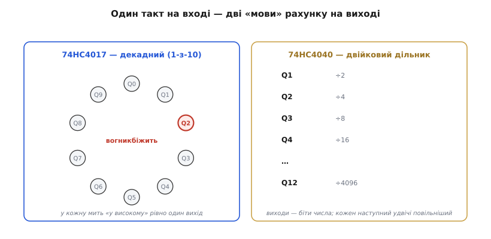

# 📋 74HC4017 і 74HC4040: розпіновка, керівні входи, підключення

> 🔧 **Навіщо це.** [Лічильник](book:electronics/counters) зсередини — це ланцюг toggle-тригерів: кожен ділить такт навпіл, а їхні виходи разом складають двійкове число, що росте щотакту. Тут та сама схема береться вже **готовим чипом** — і рахує без мікроконтролера. Два копійчані корпуси, **74HC4017** і **74HC4040**, дають дві найужиткованіші форми лічильника: «біжучий вогник» по черзі й дільник частоти. Це довідник їхнього «інтерфейсу»: які ніжки, що роблять керівні входи і як усе під'єднати. Звідки взялася ця родина мікросхем — окрема [історія родини CMOS-лічильників](book:electronics/counters/hist-cmos-counters.md); а зібраний вогник із прикидкою частот у ділі — у [проєкті «біжучий вогник і дільник» на 74HC4017/4040](book:electronics/counters/proj-4017-4040.md).

### Що це за клас: лічильник, відлитий у корпус

Обидва чипи належать до **серії 4000** (*CD4000*, технологія CMOS) і її швидшого продовження [74HCxx](book:electronics/logic-families) — тобто живляться в широкому діапазоні (для HC — звичні 2…6 В, чудово на 5 В) і майже не їдять струму в спокої. Усередині кожного — звичайний [лічильник](book:electronics/counters), лише виведений на ніжки. Різниця між ними — у тому, **як прочитано виходи**:

- **74HC4017** — *декадний лічильник* (від грец. *deka*, десять): десять **декодованих** виходів, з яких у кожну мить «у високому» рівно **один**, а наступний фронт такту перемикає вогник на сусідній. Це готовий «1-з-10».
- **74HC4040** — *двійковий лічильник-дільник* (*binary ripple counter*) на 12 розрядів: виходи Q1…Q12 — це **біти числа**, кожен наступний удвічі повільніший. Готовий поділ частоти на 2ⁿ.

*Один такт на вході — два способи прочитати рахунок на виході. **74HC4017** запалює свої десять виходів по черзі (вогник «біжить» Q0→Q1→…→Q9→Q0); це лічильник Джонсона, у якому щокроку чисто, без глітчів, активний лише один вихід. **74HC4040** показує на виходах **двійкове число**, що зростає щотакту: Q1 = такт/2, Q2 = такт/4, … Q12 = такт/4096 — тобто водночас і лічильник, і дільник частоти.*

### Блок-схема й розпіновка: майже самі виходи

Усередині немає ні стабілізатора, ні складної обв'язки — лише ланцюг тригерів і трохи декодувальної логіки. Тому й ніжок-«керма» обмаль: майже весь корпус DIP-16 зайнятий **виходами**, а керують чипом лічені входи.

У **4017** це **CLK** (такт), **RST** (*reset*, скинути в Q0), **CE** (*clock enable*, він же CLK INHIBIT — «стоп-такт») і службовий **CO** (*carry out*, перенос: один імпульс за повні 10 тактів — щоб каскадувати наступний чип). У **4040** усе ще простіше: лише **CLK** і **RST**. Плюс на обох — живлення **VDD/GND**.

*Підключення без МК. Повільний такт дає зовнішній генератор — [інвертор Шмітта 74HC14](book:electronics/threshold-schmitt) з резистором і конденсатором, частота ≈ 1/(RC). У **4017** цей такт іде на CLK, а десять виходів засвічують десять світлодіодів — виходить «біжучий вогник»; RST і CE тримаємо в нулі, інакше лічильник стоїть. У **4040** той самий такт на CLK, а будь-який вихід Q — це поділена частота (Q4 = такт/16, Q12 = такт/4096). VDD/GND і блокувальний конденсатор 100 нФ — обов'язкові.*

### Підключення: дати такт і відпустити гальма

Схема живиться й заводиться трьома кроками. **Живлення:** VDD на «плюс», GND на «мінус», блокувальний конденсатор 100 нФ упритул до ніжок живлення — звична гігієна CMOS, що гасить кидки струму при перемиканнях. **Такт:** лічильнику потрібен рівномірний CLK; найпростіше зробити його зовнішнім RC-генератором на [74HC14](book:electronics/threshold-schmitt) — частота приблизно 1/(RC), тож резистором і конденсатором задаємо темп вогника чи вихідну частоту дільника. **Гальма:** входи керування не можна лишати в повітрі — у 4017 притягуємо **RST=0** (інакше чип вічно скинутий у Q0) і **CE=0** (інакше такт заблоковано); у 4040 притягуємо **RST=0**. Виходи навантажуємо обережно: світлодіоди — лише через [струмообмежувальні резистори](book:physics/joule-heating).

### Типові граблі

- **Плаваючі RST/CE.** Найчастіша помилка: лишити reset чи clock-enable «у повітрі». У CMOS такий вхід ловить наводки — і лічильник або стоїть, або скидається випадково. **Кожен** керівний вхід має сидіти на чіткому рівні (RST=0, CE=0 для нормального рахунку).
- **Який фронт рахує.** 4040 за класикою лічить за **спадним** фронтом такту, 4017 — за **наростаючим**. Якщо порядок вогника «дзеркальний» до очікуваного, річ зазвичай у фронті — звіртеся з даташитом.
- **Каскад через CO, а не через старший вихід.** Щоб з'єднати кілька 4017 у довший ланцюг, наступний чип тактують саме від **CO** (один імпульс на 10 тактів), а не від котрогось із Q-виходів.
- **Дзвін на швидкому такті.** HC-версія прудка; на високих частотах і довгих дротах [край такту «дзвенить»](book:electronics/edges-rise-time) — придушується послідовним резистором біля CLK.
- **Світлодіод без резистора.** Виходи 4017 живлять світлодіоди напряму — спокуса, від якої згорають і вихід, і світлодіод. Резистор обов'язковий.

### Варіації класу

За тим самим принципом влаштована ціла полиця лічильників-чипів. **74HC4060** — той самий 4040, але з **вбудованим генератором** (досить причепити кварц або RC — окремий 74HC14 уже не потрібен). **74HC4020/4024** — двійкові дільники на іншу кількість розрядів. **74HC4022** — «вісімковий» родич 4017 (1-з-8). А там, де потрібні швидкість і [синхронність](book:electronics/counters), беруть синхронні лічильники серії 74 — **74HC161/163**. Усі вони — той самий лічильник, винесений у залізо: дайте такт, приберіть гальма з керівних входів — і чип рахує сам, без єдиного рядка коду.
