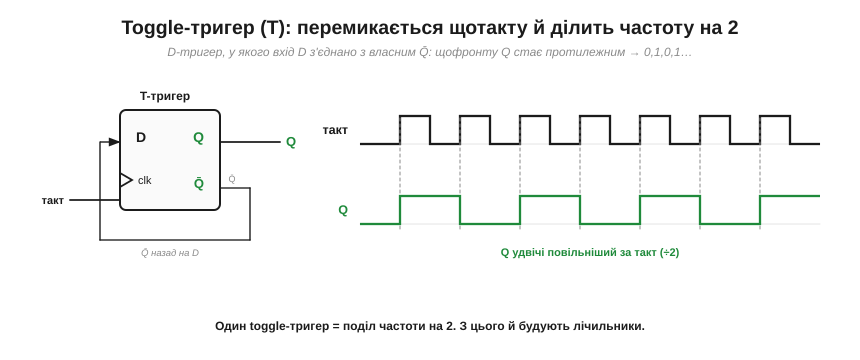
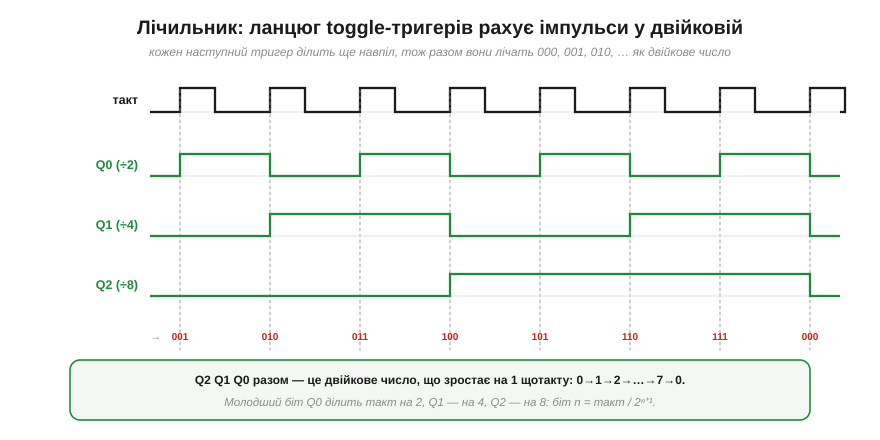
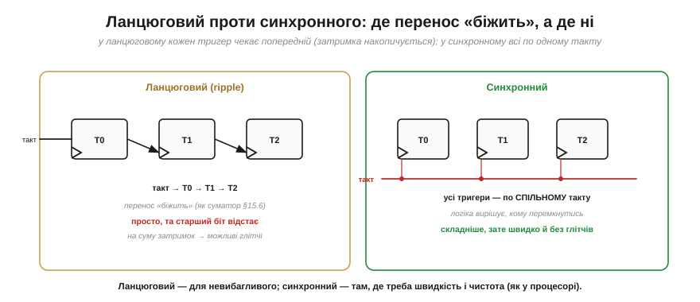
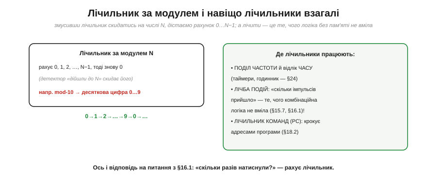

# Лічильники

Тригери, регістри й такт дають усе, щоб побудувати першу по-справжньому «розумну» послідовнісну схему — **лічильник** (*counter*). Це схема, що **рахує**: на кожному такті її число зростає на одиницю. Здавалося б, дрібниця — але [чиста комбінаційна логіка](book:electronics/gates-to-functions) принципово **не вміє** полічити, скільки разів щось сталося, бо не має [внутрішнього стану](book:electronics/state-memory). Лічильник це нарешті вміє — і не лише лічить події, а ще й **відмірює час** і **ділить частоту**, ставши серцем годинників і таймерів. Розберімо, як він влаштований.

### Toggle-тригер: ділимо частоту навпіл

Цеглинка лічильника — особливий тригер, що на кожному такті **перемикається** в протилежний стан. Зробити його з D-тригера елементарно: з'єднати вхід D із власним виходом Q̄.

*Рис. **Toggle-тригер** (*T flip-flop*): вхід D під'єднано до **власного** Q̄. На кожному фронті тригер захоплює Q̄ — тобто **протилежне** тому, що в ньому зараз, — і Q перемикається: 0, 1, 0, 1… А оскільки Q міняється раз на **два** такти, його частота **вдвічі менша** за тактову. Один toggle-тригер = поділ частоти на 2.*

Запам'ятайте цей факт: **один тригер ділить частоту навпіл**. На ньому стоїть усе подальше. А поставивши кілька таких поспіль, дістанемо не просто поділ, а справжній **рахунок**.

### Лічильник: рахуємо у двійковій

З'єднаймо toggle-тригери ланцюжком так, щоб кожен тактувався виходом попереднього. Тоді перший ділить такт на 2, другий — ще навпіл (на 4), третій — на 8, і разом їхні виходи утворюють… **двійкове число**, що зростає на одиницю щотакту.

*Рис. Три тригери, виходи Q2 Q1 Q0. Молодший Q0 перемикається щотакту (÷2), Q1 — раз на два такти (÷4), Q2 — раз на чотири (÷8). Прочитайте їх **разом**, як двійкове число — і побачите рахунок: 001, 010, 011, 100, 101, 110, 111, 000… Лічильник буквально лічить такти, виражаючи число у двійковій системі. Загальне правило: біт n дає частоту такт / 2ⁿ⁺¹.*

Помилуйтеся, як гарно тут сходяться дві ідеї: **поділ частоти** (кожен біт удвічі повільніший) і **двійковий рахунок** (біти разом — це число) виявляються **одним і тим самим**. Лічильник, що ділить частоту, і лічильник, що рахує події, — це одна схема, побачена з двох боків.

### Ділення частоти: повільний такт із швидкого

Перший великий ужиток лічильника — **робити повільні ритми зі швидкого такту**. N-бітний лічильник на старшому біті дає частоту, поділену на 2ᴺ, — і це найпростіший спосіб дістати будь-який потрібний темп.

*Рис. Кожен наступний біт лічильника вдвічі повільніший: Q0 = такт/2, Q9 = такт/1024, Q23 ≈ такт/16 мільйонів. Хочете блимати світлодіодом раз на секунду? Візьміть кварцовий такт 16 МГц і поділіть на ≈2²⁴ ≈ 16.8 млн — на відповідному біті лічильника якраз вийде ≈1 Гц. Так само лічильник відмірює секунди годинника, періоди таймерів, частоти звуку.*

Ось чому лічильник — це **одночасно** і дільник частоти, і **годинник**: рахуючи відомі такти, він відмірює час. Знаючи частоту кварцу, ми точно знаємо, скільки тактів — це секунда, тож порахувати їх — і є виміряти час. Саме на цьому стоять усі **апаратні таймери** мікроконтролера: всередині кожного сидить лічильник тактів.

### Ланцюговий проти синхронного

Лічильник, у якому кожен тригер тактується попереднім, зветься **ланцюговим** (*ripple*, асинхронним) — і він простий, та має знайому ваду, пов'язану із затримками поширення сигналу.

*Рис. У **ланцюговому** лічильнику зміна «біжить» від молодшого тригера до старшого, як [перенос у суматорі](book:electronics/combinational-circuits): старший біт перемикається лише після того, як спрацювали всі молодші, тож він **відстає** на суму затримок, і на мить число може бути «неправильним» (глітч). У **синхронному** всі тригери тактуються **спільним** сигналом, а окрема логіка вирішує, кому з них перемкнутися; це складніше, зате всі біти міняються **разом** — швидко й без глітчів.*

Це той самий компроміс «простота проти швидкості», що й усюди. Ланцюговий лічильник годиться для невибагливих задач (поділ частоти, де глітчі неважливі), а от там, де потрібні **швидкість і чистота** — як у лічильнику команд процесора, — будують **синхронний**. І тут проступає глибша спорідненість: ланцюгова затримка переносу — та сама проблема, що й [поширення переносу в суматорі](book:electronics/combinational-circuits), лише в часовому, а не просторовому вигляді.

### Лічильник за модулем і навіщо лічильники взагалі

Звичайний N-бітний лічильник рахує до 2ᴺ і починає спочатку. Та часто треба рахувати до **довільного** числа — скажімо, до 10 для десяткової цифри. Тоді додають **детектор**, що скидає лічильник, щойно той досягне потрібного N. Виходить **лічильник за модулем N** (*modulo-N*), що рахує 0, 1, …, N−1 і повертається в 0.

*Рис. **Mod-N**: лічильник, що скидається на числі N, лічить 0…N−1 по колу (mod-10 дає десяткову цифру 0…9). А праворуч — навіщо лічильники взагалі: **поділ частоти й відлік часу** (таймери, годинник); **лічба подій** — «скільки імпульсів прийшло», те саме, чого [комбінаційна логіка не вміла](book:electronics/gates-to-functions); і **лічильник команд** (PC), що крокує адресами програми, ведучи [процесор](book:programming/processor-parts) від інструкції до інструкції.*

Так замикається коло. Поставте схемі питання «скільки разів натиснули кнопку?» — і [гола комбінаційна логіка](book:electronics/gates-to-functions) не відповість, бо не має пам'яті. Лічильник дає відповідь: **він рахує**. Маючи пам'ять (тригери) і ритм (такт), машина нарешті вміє і запам'ятовувати, і лічити, і відмірювати час — усе, чого бракувало для повноцінного обчислювача.

> 🔧 **Навіщо це.** Лічильник — одна з найуживаніших схем, і ви зустрічатимете його постійно, навіть не торкаючись окремих тригерів. Винесіть головне. Перше: **один тригер ділить частоту на 2**, ланцюг із N — на 2ᴺ; так із кварцового такту роблять будь-який повільніший ритм. Друге: лічильник — це **і годинник, і дільник частоти, і лічильник подій** одночасно; усі апаратні **таймери** мікроконтролера — це лічильники, що рахують відомі такти й тому вміють відмірювати точний час. Третє: **лічильник команд** (PC) — це лічильник, що веде [процесор](book:programming/processor-parts) програмою крок за кроком. Коли ви налаштовуєте таймер ESP32 «спрацювати через стільки-то мікросекунд», за лаштунками працює саме лічильник, що рахує такти кварцу. Лічильник — це місток від «пам'яті» до «часу».

---

Коротко про головне: **лічильник** — це послідовнісна схема, що **рахує**. Цеглинка — **toggle-тригер** (D=Q̄), що перемикається щотакту й **ділить частоту на 2**. Ланцюг toggle-тригерів дає **двійковий рахунок** (Q2Q1Q0 = число, що зростає щотакту) і водночас **ділення частоти** (біт n = такт/2ⁿ⁺¹) — це одна схема з двох боків. Звідси два головні вжитки: робити **повільні ритми** зі швидкого такту (блимання, таймери, годинник) і **лічити події**. **Ланцюговий** (ripple) лічильник простий, та перенос у ньому «біжить» із затримкою (як [поширення переносу в суматорі](book:electronics/combinational-circuits)); **синхронний** тактує всі тригери разом — швидше й чистіше. **Mod-N** лічильник рахує до довільного N. І головне: лічильник закриває питання, на яке [гола логіка без пам'яті](book:electronics/gates-to-functions) відповісти не могла — «скільки разів сталося?».

---
