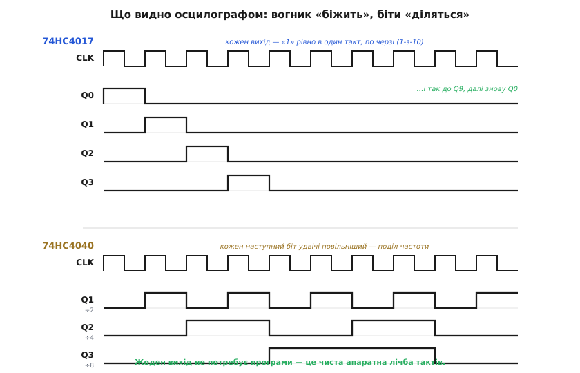

# ⚙️ Біжучий вогник і дільник частоти на 74HC4017/4040

Найпряміший спосіб відчути [лічильник](topic:electronics/counters) — зібрати його з готового чипа й **не написати жодного рядка коду**: лічба тут суто апаратна. Беремо два копійчані CMOS-корпуси. **74HC4017** — декадний, з десятьма виходами «1-з-10»: він робитиме «біжучий вогник». **74HC4040** — двійковий на 12 розрядів: він працюватиме дільником частоти. Обом потрібен лише повільний такт; найпростіше дати його зовнішнім RC-генератором на [інверторі Шмітта 74HC14](topic:electronics/threshold-schmitt) з частотою ≈ 1/(RC). Розпіновку, живлення й що подати на керівні входи зібрано в [довіднику з підключення 74HC4017/4040](topic:electronics/counters/api-4017-4040.md) — тут же дивимося, як воно рахує в ділі.

### Що знадобиться

Складників небагато, і всі копійчані: один **74HC4017** (для вогника) або **74HC4040** (для дільника); один **74HC14** із резистором `R` і конденсатором `C` як генератор такту; для вогника — **десять світлодіодів** і по резистору до кожного (щоб не спалити виходи); блокувальний конденсатор **100 нФ** на живлення кожного чипа. Живлення — 5 В. Більше нічого: ні кварцу, ні програматора, ні мікроконтролера.

### Запустити й побачити рахунок

«Заговорити» тут означає просто **подати такт і подивитися на виходи** — програмувати нічого. Подайте на 4017 повільний CLK (скажімо, кілька герц) — і світлодіоди почнуть по черзі спалахувати по колу. На 4040 підімкніть осцилограф (чи ще один світлодіод) до Q1 — він блиматиме вдвічі повільніше за такт, до Q2 — вчетверо, і так далі.


*Що видно осцилографом. У **74HC4017** кожен вихід піднімається у «високий» рівно на **один** такт, по черзі (1-з-10), і знову Q0 — вогник біжить по колу. У **74HC4040** молодші біти діляться навпіл: Q1 міняється щотакту (÷2), Q2 — раз на два (÷4), Q3 — раз на чотири (÷8) … до Q12 (÷4096). Жоден вихід не потребує програми — це чиста апаратна лічба тактів.*

Наочно поділ видно й без осцилографа: чіпляєте світлодіод до Q1 — він мерехтить надто швидко, щоб око розрізнило; переносите на Q10 — і вже добре видно повільне блимання. Кожен наступний вихід удвічі повільніший, тож дільник — це готовий спосіб зробити з невидимо-швидкого такту зриме блимання, знову ж таки без коду.

Один практичний трюк видно одразу на цій самій схемі: вхід **CE** (clock enable) у 4017 — це «пауза». Поки CE=0, вогник біжить; підтягніть CE до одиниці (скажімо, кнопкою) — і лічильник завмирає на поточному виході, не втрачаючи місця; щойно відпустите — біжить далі з того самого світлодіода. Так той самий чип стає ще й «стоп-кадром», без жодної логіки навколо.

### Скільки це виходить у числах

Корисно прикинути частоти наперед, щоб не гадати з осцилографом. Якщо RC-генератор дає такт `f`, то на 4040 вихід Qn — це `f / 2ⁿ`. Скажімо, для `f = 32768 Гц` (типовий «годинниковий» кварц) старший вихід Q12 дає `32768 / 2¹² = 8 Гц`. А щоб дістати рівно секундний імпульс — «1 Гц», на якому історично будували годинники, — треба поділити на всі `2¹⁵ = 32768`, тобто на 15 розрядів: або каскадом із додатковими тригерами, або ширшим дільником родини (той-таки 4060). На 4017 повний цикл вогника — це 10 тактів, тож якщо вхід `f`, то одне коло вогника триває `10 / f` секунд, а службовий вихід CO дає `f / 10`. Звідси видно, чому каскадують саме через CO: він уже поділив на 10, тож другий 4017 рахує «десятки», третій — «сотні».

Зворотна задача корисніша: маємо бажаний темп — які взяти `R` і `C`?

**Приклад: вогник, що робить одне коло приблизно за секунду.** 4017 проходить десять виходів за десять тактів, тож для кола за 1 с потрібен такт 10 Гц, а генератор на 74HC14 дає `f ≈ 1/(R·C)`:

```
ціль:  одне коло за 1 с  →  f = 10 кроків / 1 с = 10 Гц
f ≈ 1 / (R · C)
беремо C = 1 мкФ = 1·10⁻⁶ Ф
R = 1 / (f · C) = 1 / (10 · 1·10⁻⁶) = 100000 Ом = 100 кОм
```

Отже, `R ≈ 100 кОм` і `C = 1 мкФ` дають вогник, що обходить десять світлодіодів приблизно за секунду; хочете вдвічі швидше — удвічі менший `R` (чи `C`). Ту саму прикидку вихідних частот дільника 4040 зручно зробити кодом-помічником — пробігтися по всіх розрядах і роздрукувати `f / 2ⁿ`:

:::tabs
```c
// Прикидка вихідних частот дільника 4040 у прошивці-помічнику
#include <stdint.h>
#include <stdio.h>

int main(void) {
    double f_clk = 32768.0;          // вхідний такт, Гц (годинниковий кварц)
    for (int n = 1; n <= 12; n++) {  // 4040 має 12 розрядів: Q1..Q12
        double f_out = f_clk / (1u << n);   // Qn = такт / 2^n
        printf("Q%-2d = %.4f Hz\n", n, f_out);
    }
    return 0;                         // Q12 = 8 Hz; для рівно 1 Гц треба 15 розрядів (2¹⁵)
}
```
```cpp
// Прикидка вихідних частот дільника 4040
#include <cstdint>
#include <iostream>

int main() {
    double f_clk = 32768.0;          // вхідний такт, Гц (годинниковий кварц)
    for (int n = 1; n <= 12; ++n) {  // 4040 має 12 розрядів: Q1..Q12
        double f_out = f_clk / (1u << n);   // Qn = такт / 2^n
        std::printf("Q%-2d = %.4f Hz\n", n, f_out);
    }
    return 0;                         // Q12 = 8 Hz; для рівно 1 Гц треба 15 розрядів (2¹⁵)
}
```
```py
# Прикидка вихідних частот дільника 4040
f_clk = 32768.0                      # вхідний такт, Гц (годинниковий кварц)
for n in range(1, 13):               # 4040 має 12 розрядів: Q1..Q12
    f_out = f_clk / (1 << n)         # Qn = такт / 2^n
    print(f"Q{n:<2} = {f_out:.4f} Hz")
# Q12 = 8 Hz; для рівно 1 Гц треба 15 розрядів (2¹⁵)
```
:::

А щоб рахувати далі, ніж до десяти, 4017 каскадують: службовий вихід **CO** (один імпульс за повні 10 тактів) стає тактом для другого чипа. Тоді перший відлічує «одиниці» (0…9), другий — «десятки»; два ряди по десять світлодіодів показують двоцифровий рахунок 0…99 — і все одно без жодного рядка коду.

Отже, вся «настройка» цієї схеми — це вибір R і C: вони задають вхідний такт, а всі інші частоти виходять із нього діленням — на 2ⁿ у 4040 чи на 10 у 4017. Число на виходах — це просто полічені такти; жодної прошивки схема не потребує.
