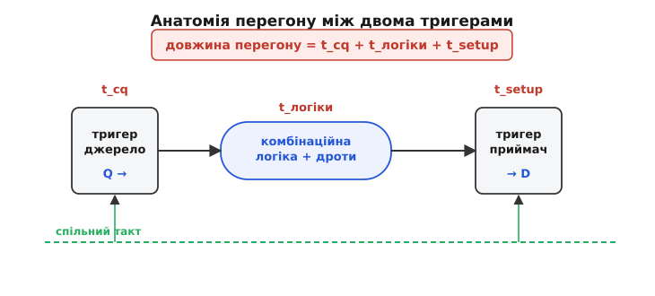

# Критичний шлях і тайминг-клоужер

У будь-якій синхронній схемі — байдуже, чи це три мікросхеми лічильника на макетці, ядро мікроконтролера чи мільйон вентилів на кристалі — між двома цоканнями такту сигнал мусить встигнути пробігти від одного тригера до наступного. Уся схема тактується спільним ритмом, тож ритм цей можна прискорювати лише доти, доки **найповільніший** маршрут ще встигає. Цей найповільніший маршрут і зветься **критичний шлях** (англ. *critical path*; *critical* — вирішальний, від грец. *kritikós* — той, що виносить присуд). Він один-єдиний вирішує, як швидко може працювати вся схема, а стан, коли кожен шлях перевірено й жоден не провалено, зветься **тайминг-клоужер** (англ. *timing closure*; *closure* — замикання, зведення докупи, від лат. *claudere* — зачиняти).

Слово «критичний» тут не про аварію, а про вирішальність: серед тисяч шляхів долю частоти вирішує рівно один. І це навдивовижу практична річ. Коли інструмент після збірки пише «схема тримає лише 78 МГц замість бажаних 100», він насправді каже: «є один перегін, якому бракує наносекунд». Знайти той перегін, зрозуміти, з чого складається його затримка, і вкоротити саме його — ось про що вся ця тема. Почнімо з того, звідки взагалі береться обмеження.

### Чому такт має нижню межу

Синхронна схема живе фронтами такту. На кожному фронті всі [тригери](book:electronics/d-flip-flop) одночасно **захоплюють** те, що стоїть у них на входах, а в проміжку між фронтами комбінаційна логіка перемелює захоплені значення й готує нові. Наступний фронт має право прийти лише тоді, коли ці нові значення вже **встигли** докотитися й застигнути на входах приймачів. Прийде зарано — приймач захопить недороблене, напівперемкнуте значення, і схема почне видавати сміття.

Розкладімо один такий перегін «від тригера до тригера». Сигнал стартує на фронті з виходу **тригера-джерела**, але не миттєво: від фронту такту до появи нового значення на виході Q минає час **t_cq** (англ. *clock-to-Q* — від фронту до Q). Далі значення повзе крізь ланцюг вентилів і дротів — це затримка **t_логіки**. І нарешті воно має застигнути на вході **тригера-приймача** не пізніше ніж за час **t_setup** до наступного фронту, бо тригеру потрібна мить тиші, щоб надійно замкнути дані (інакше — [зрив у метастабільність](book:electronics/metastability-timing)). Складімо ці три часи:

```
затримка перегону = t_cq + t_логіки + t_setup
```

Ось і вся арифметика. Період такту не може бути коротшим за цю суму — інакше сигнал не добіжить. А оскільки в схемі таких перегонів безліч і всі під спільним тактом, період мусить накрити **найдовший** із них. Той найдовший перегін і є критичний шлях, а мінімальний період і найвища частота випливають із нього напряму:

```
T_мін = затримка_критичного_шляху
Fmax  = 1 / T_мін
```


*Сигнал стартує на фронті з виходу тригера-джерела (t_cq), біжить логікою (t_логіки) і мусить застигнути на вході приймача за t_setup до наступного фронту. Сума цих трьох часів — довжина перегону; найдовший перегін у схемі й зветься критичним.*

Тут криється висновок, що суперечить звичному відчуттю про [тактову частоту процесора](book:programming/clock-frequency) як паспортну цифру чипа. Частоту синхронної схеми визначає **не** абстрактна «швидкість заліза», а **сам дизайн** — скільки логіки нагромаджено між тригерами на найдовшому маршруті. Поклав багато вентилів поспіль — критичний шлях довгий, Fmax низька. Розклав ощадливо, розбив довгі ланцюги — критичний шлях коротшає, частота росте. Тому «зробити схему швидшою» майже завжди означає одне: **знайти й укоротити критичний шлях**.

### Анатомія шляху: дані біжать по одній дорозі, такт — по іншій

Щоб розуміти звіти таймінгу, треба побачити, що в кожному перегоні працюють **дві** дороги, а не одна. Є **шлях даних** (англ. *data path*) — від виходу Q тригера-джерела крізь логіку до входу D тригера-приймача; саме його довжину ми щойно склали. Але фронт такту теж не приходить до обох тригерів одночасно: він біжить своєю мережею дротів — **шляхом такту** (англ. *clock path*) — і до приймача може прибути трохи пізніше або раніше, ніж до джерела. Ця різниця часу приходу такту зветься **перекіс такту** (англ. *clock skew* — перекіс, зсув).

Перекіс — не дрібниця, бо він або допомагає, або шкодить. Якщо такт до приймача приходить трохи **пізніше**, ніж до джерела, приймач ловить дані пізніше — у даних з'являється додатковий час на подорож, і критичний шлях наче подовжується на величину перекосу. Це варто тримати в голові: у реальному звіті затримка шляху даних завжди зважується проти того, коли саме прийшов фронт на приймач.

Але головне, що дає ця картина двох доріг, — вона пояснює **другу** умову, без якої тайминг не зійдеться.

### Дві умови замикання: одна тисне зверху, друга не залежить від частоти

Досі йшлося про те, щоб дані **встигли**. Це умова **setup**: дані мусять прибути **не пізніше** дедлайну (за t_setup до фронту). Вона й задає нижню межу періоду — тому сповільнення такту завжди рятує setup: даєш більше часу, і навіть повільний шлях устигає.

Та є й дзеркальна небезпека — дані можуть прибути **зарано**. Уявімо дуже короткий шлях даних: тригер-джерело щойно клацнув на фронті, і нове значення миттю пролетіло крихітну логіку й уже стукає у вхід приймача. Але ж приймач на **тому самому** фронті ще тільки замикає **старе** значення, і йому потрібна мить, щоб дотримати його на вході — час **t_hold** (англ. *hold* — утримувати). Якщо нові дані прибігли раніше, ніж збіг цей час утримання, вони затруть старе значення просто в момент захоплення — і приймач знову зірветься. Це умова **hold**: дані мусять прибути **не раніше** ніж через t_hold після фронту.

Ось де ховається найпідступніше в усій темі. **Setup ламають повільні (довгі) шляхи, hold ламають швидкі (короткі)**. І — ключове — **hold не залежить від періоду такту зовсім**. Обидва фронти, від яких рахують hold, — це той **самий** фронт (запуск і захоплення на одному цоканні); період у нерівність не входить. Тому сповільнення такту, яке лікує будь-який setup, hold **не рятує ні на йоту**. Порушення hold — це вирок самій **структурі** шляху: занадто короткий шлях даних порівняно з перекосом такту й часом утримання. Лагодять його не сповільненням, а **сповільненням шляху** — уставляють у надто прудкий перегін буфери-затримки, щоб дані прийшли трохи пізніше.


*Вхід приймача має право мінятися лише у вікні між двома заборонами. Ліворуч від нього — вікно **hold** одразу після фронту (нові дані затруть старі, що ще замикаються); праворуч — вікно **setup** перед наступним фронтом (дані не встигнуть застигнути). Setup ламають повільні шляхи й лікує сповільнення такту; hold ламають швидкі шляхи, і від періоду він не залежить.*

> 🔧 **Навіщо це.** Практичний висновок звучить різко: **hold-проблему не можна «обійти нижчою частотою».** Якщо прошив FPGA чи розвів плату, а вона збоїть однаково і на 100 МГц, і на 10 МГц — це майже напевно порушення hold, і опускати такт марно, треба лагодити структуру. І навпаки: якщо схема працює на 40 МГц, а на 80 МГц сипле помилки — це setup, і тут якраз частота винна, критичний шлях не встигає. Уміння з симптому («псується від частоти» проти «псується завжди») відрізнити setup від hold економить дні марного колупання не в тому місці.

### Слек: скільки саме бракує (або лишається)

«Не встигає» — це вирок, але глухий: він не каже, наскільки саме. Щоб зробити тайминг **вимірюваним**, для кожного приймача рахують **слек** (англ. *slack* — провис, вільний кінець мотузки) — різницю між тим, коли дані мусили б прибути, і коли реально прибули:

```
слек = час_коли_треба − час_коли_прибули
```

Знак слека — це і є присуд. **Додатний** слек означає «дані застигли завчасно, лишився запас стільки-то наносекунд» — добре, надійно. **Нуль** — «рівно на межі», тривожно. **Від'ємний** слек — «не встигли на стільки-то» — тайминг провалено, і саме на цю величину треба вкоротити шлях (або сповільнити такт). Слек чудовий тим, що перетворює абстрактне «швидко/повільно» на точне число боргу: −1.5 нс каже не «погано», а «вкороти рівно на півтори наносекунди, і зійдеться».

Слек рахують для **кожного** приймача окремо, а долю всієї схеми вирішує **найгірший** із них — той самий критичний шлях, лише названий через його запас. Коли найгірший слек невід'ємний — жоден шлях не провалено, тайминг **зійшовся**. Коли від'ємний — інструмент показує винний перегін поіменно.

**Приклад (читаємо запас на перегоні).** Хай ціль — 100 МГц (період 10 нс), а найдовший перегін дає таку розкладку часу. Порахуймо, встигає він чи ні, реальним обчисленням у прошивці.

:::tabs
```cpp
// Розкладка часу критичного перегону, наносекунди
float T        = 10.0f;   // період такту (100 МГц)
float t_cq     = 0.6f;    // clock-to-Q тригера-джерела
float t_logic  = 8.2f;    // затримка логіки на шляху  ← домінує
float t_setup  = 0.5f;    // вимога setup приймача

// Коли дані реально прибувають на вхід приймача:
float arrival  = t_cq + t_logic;           // 0.6 + 8.2 = 8.8 нс
// Крайній момент, коли вони ще встигають (дедлайн setup):
float required = T - t_setup;              // 10.0 − 0.5 = 9.5 нс

float slack    = required - arrival;       // 9.5 − 8.8 = +0.7 нс  → встигає

// А на якій частоті перегін уперся б у нуль?
float T_min    = t_cq + t_logic + t_setup; // 0.6 + 8.2 + 0.5 = 9.3 нс
float f_max    = 1000.0f / T_min;          // 1000 / 9.3 ≈ 107.5 МГц
```
```python
# Розкладка часу критичного перегону, наносекунди
T       = 10.0   # період такту (100 МГц)
t_cq    = 0.6    # clock-to-Q тригера-джерела
t_logic = 8.2    # затримка логіки на шляху  ← домінує
t_setup = 0.5    # вимога setup приймача

# Коли дані реально прибувають на вхід приймача:
arrival  = t_cq + t_logic       # 0.6 + 8.2 = 8.8 нс
# Крайній момент, коли вони ще встигають (дедлайн setup):
required = T - t_setup          # 10.0 − 0.5 = 9.5 нс

slack    = required - arrival   # 9.5 − 8.8 = +0.7 нс  → встигає

# А на якій частоті перегін уперся б у нуль?
T_min = t_cq + t_logic + t_setup  # 0.6 + 8.2 + 0.5 = 9.3 нс
f_max = 1000.0 / T_min            # 1000 / 9.3 ≈ 107.5 МГц
```
:::

Висновок: перегін встигає із запасом 0.7 нс, а стеля цієї схеми — близько 107 МГц. Помітно й головне: у бюджеті домінує t_логіки (8.2 з 9.3 нс), тож і коротшати треба саме її — менше рівнів вентилів між тригерами.

### Як знаходять критичний шлях: аналіз без прогону схеми

Здавалося б, найпростіше — запустити схему в [симуляції](book:electronics/hdl-simulation), поганяти сигнали й подивитися, де що не встигає. Але симуляція перевіряє лише **ті** комбінації входів, які їй згодували, а критичний шлях може ховатися в рідкісному поєднанні, якого тест і не торкнеться. Тому долю таймінгу вирішує інший, надійніший метод — [**статичний часовий аналіз** (перебирає всі шляхи одразу, без жодних вхідних векторів)](book:electronics/critical-path-timing/math-static-timing-analysis.md).

Ідея його елегантна. Схему подають як граф: вузли — виходи вентилів і тригерів, ребра — затримки. Час приходу на виході кожного вентиля — це найбільший час приходу на його входах **плюс** власна затримка вентиля. Аналізатор іде графом **уперед**, від джерел, складаючи затримки вздовж кожного маршруту, аж поки в кожного приймача не набереться повний час приходу. Окремо він іде **назад** від дедлайнів, рахуючи, до якого моменту дані мали б устигнути. Різниця двох чисел на кожному приймачі й дає слек. Жодного прогону в часі, жодних тестових векторів — лише додавання паспортних затримок уздовж ребер графа. Тому метод і зветься **статичним**: він не зважає на конкретні значення сигналів, а бачить **усі** шляхи за один прохід і нічого не пропустить.

Саме через цю повноту статичному аналізу довіряють присуд про частоту, а симуляцію лишають для перевірки логіки. Метод не новий: він виріс із [способу шукати найдовший ланцюг у будь-якому проєкті, ще з інженерії великих робіт 1950-х](book:electronics/critical-path-timing/hist-critical-path.md), і на цифрову схему ліг як улитий, бо схема — це теж мережа залежностей із затримками.

### Тайминг-клоужер: коли шляхів багато

Один перегін порахувати легко. Але реальна схема — це від тисяч до мільйонів перегонів одночасно, і полагодити всі їх воднораз не можна, бо вони **ділять спільний ресурс**: місце на кристалі й дроти між клітинками. Ось де окреме число перетворюється на **процес зведення**.

Уяви, що знайшов найгірший перегін і попросив покласти його тригери ближче, щоб дріт між ними скоротився. Тригери зайняли місце, яке хтось інший уже займав, — і **той** перегін тепер їде далі, його дроти довшають, його слек падає. Тайминг — це ковдра, яку натягуєш на один кут, а оголюється інший. Тому після кожної правки треба **перерахувати весь дизайн наново** й подивитися, що зламалося тепер. Через це замикання таймінгу — не разова дія, а **цикл**: правка → перерахунок → нова правка, — і крутиться він, доки жоден шлях не лишиться провалений ні за setup, ні за hold.

Щоб керувати цим морем шляхів, їхні слеки згортають у кілька осяжних чисел і читають їх після кожної збірки — це вже [окреме ремесло зведення таймінгу з його стратегіями й пастками](book:electronics/timing-closure). Для дискретної схеми на кількох мікросхемах або простого дизайну цикл коротий і його ведуть уручну; для великого кристала його провадить [сам інструмент розкладки](root:embedded/fpga-flow), автоматично правлячи затримки. Але суть скрізь та сама: **тайминг-клоужер — це стан, коли на кожному шляху виконано обидві умови**, і лише в цьому стані схему можна прошивати чи віддавати на виготовлення. Доки не зійшовся — це не дизайн, а чернетка, яка на потрібній частоті працюватиме як пощастить.

> 🔧 **Навіщо це.** Звідси залізне правило розробника: **ніколи не заливай чип і не відправляй плату з від'ємним слеком «бо на макетці ж запустилося».** На теплому столі при рівній напрузі схема потрапила в зручні умови, і критичний шлях устиг випадково. Той самий виріб на морозі чи на просілій батарейці стане повільнішим — і той самий шлях уже не встигне, схема почне збоїти «на холоді». Тому мета — не «щоб запустилося тут і зараз», а «щоб на кожному шляху був невід'ємний запас у всіх умовах роботи». Це різниця між виробом, що надійно тримає частоту, і тим, що «то працює, то ні».

### Чим коротшають критичний шлях

Коли слек від'ємний, у розробника є кілька перевірених прийомів, і всі вони роблять одне — **вкорочують найдовший шлях** так, щоб він уліз у період.

Головний і найпотужніший — **конвеєризація** (англ. *pipelining*, від *pipeline* — трубопровід, де порції течуть одна за одною). Довгий шлях розрізають [тригером навпіл, роблячи з нього дві короткі ділянки](book:electronics/fpga-timing): кожна половина тепер удвічі коротша, тож період можна майже вдвічі вкоротити. Плата — зайвий такт [латентності (результат виходить на такт пізніше)](book:programming/pipeline), але пропускна здатність не страждає, дані течуть конвеєром навіть швидше. Це найчистіше рішення, коли частота задана ззовні й знизити її не можна.

Далі — **менше рівнів логіки**: іноді шлях довгий не через дроти, а через кількість вентилів, які сигнал проходить **послідовно** один за одним. Тоді той самий булів вираз переписують у пласкішу форму — менше вентилів поспіль, — і глибина шляху падає. Найкраще, коли це помічають ще в самому [описі схеми](book:electronics/hdl): неоковирний код народжує довгі ланцюги, які потім важко полагодити внизу. Ще два прийоми діють на фізику: **сильніший драйвер** (вентиль на шляху заміняють на потужнішу копію, що швидше перезаряджає ємність наступного входу) і **буфери на довгому дроті** (сам дріт має [RC-затримку](book:electronics/edges-rise-time), яка з довжиною росте квадратично; розбивши дріт повторювачем посередині, дістаємо два коротші замість одного довгого).

І окремо — **hold**, який жоден із цих прийомів не лікує, бо його ламає **надто швидкий** шлях. Його виправляють протилежним: [уставляють буфери-затримки в надто прудкий перегін](book:electronics/hold-violation), щоб дані прийшли трохи пізніше. Підступність у тому, що правки setup і hold тягнуть у різні боки — вкоротив шлях заради setup, і можеш зламати hold сусіда, — тому обидві умови тримають в оці **одночасно**, а не по черзі.

**Приклад (від'ємний слек як точна міра боргу).** Хай аналізатор видав такий звіт, і треба вирішити, куди тягнути.

```c
// Звіт таймінгу після збірки
float T_target = 8.0f;    // заданий період, нс (125 МГц)
float WNS      = -1.2f;   // найгірший запас — від'ємний, шлях НЕ встигає

// Скільки насправді триває найгірший шлях?
// слек = період − довжина  ⇒  довжина = період − слек
float worst_path = T_target - WNS;      // 8.0 − (−1.2) = 9.2 нс
// Отже, реально ця розкладка потягне не більш ніж:
float f_real     = 1000.0f / worst_path; // 1000 / 9.2 ≈ 108.7 МГц

// Два чесні виходи:
//  (а) опустити ціль до ~108 МГц — якщо частота не критична;
//  (б) вкоротити найгірший шлях рівно на 1.2 нс (конвеєр / менше логіки),
//      щоб він уліз у 8 нс і дав повні 125 МГц.
```

Висновок: від'ємний WNS — не вирок «не працює ніколи», а точна ціна питання. −1.2 нс каже: або живи на 108 МГц, або відшукай, де вкоротити критичний шлях саме на ці 1.2 наносекунди. Оце й є щоденна робота з таймінгом — читати запас, знаходити винний перегін і коротшати саме його.

---

Коротко про головне: у синхронній схемі спільний такт можна прискорювати лише доти, доки встигає **найдовший** маршрут «від тригера до тригера» — **критичний шлях**. За один період сигнал має вийти з джерела (t_cq), пройти логіку (t_логіки) і застигнути на вході приймача за t_setup до фронту; сума цих часів на найдовшому шляху задає нижню межу періоду, звідки **Fmax = 1 / критичний шлях**, і визначає її **сам дизайн**, а не паспорт чипа. У кожному перегоні працюють дві дороги — шлях даних і шлях такту (їхню різницю звуть перекосом), — і замикання таймінгу вимагає **двох** умов: **setup** (дані не пізніше дедлайну — ламають повільні шляхи, лікує сповільнення такту) і **hold** (дані не раніше вікна утримання — ламають швидкі шляхи, від періоду не залежить). Долю кожного приймача згортають у **слек** = коли треба − коли прибули: додатний — запас, від'ємний — борг рівно на стільки наносекунд. Знаходять критичний шлях [статичним аналізом](book:electronics/critical-path-timing/math-static-timing-analysis.md), що складає паспортні затримки по всіх шляхах одразу без прогону схеми. **Тайминг-клоужер** — це стан, коли на кожному шляху виконано обидві умови; на великій схемі до нього йдуть [циклом зведення](book:electronics/timing-closure), бо всі шляхи ділять місце й дроти. Лагодять від'ємний слек, коротшаючи найдовший шлях — [конвеєром](book:electronics/fpga-timing), меншою глибиною логіки, сильнішим драйвером, буферами на дротах, — а надто швидкі шляхи, що ламають hold, навпаки сповільнюють буферами.
