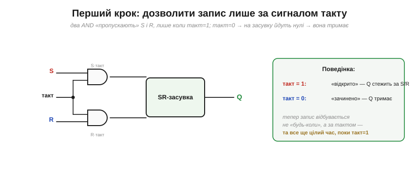
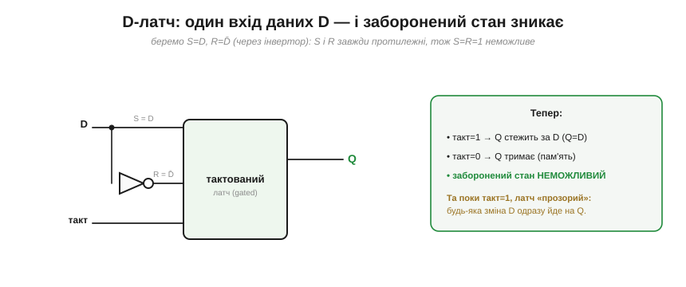
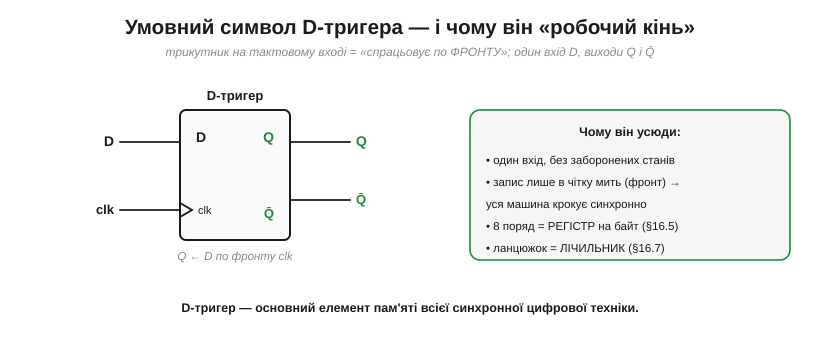

# Тактований D-тригер

[SR-засувка](book:electronics/sr-latch) має дві вади, що заважають будувати з неї великі машини. По-перше, вона **прозора** — пише будь-коли, щойно змінилися входи; а нам треба, щоб сотні комірок оновлювалися **узгоджено**, в один домовлений момент. По-друге, у неї є **заборонений** стан S=R=1, через який легко напартачити. Обидві вади усуваються двома кроками — і в кінці постає головний елемент пам'яті всієї цифрової техніки: **тактований D-тригер**, що захоплює дані рівно по **фронту** такту.

### Крок 1: тактований латч — писати лише за командою

Перша ідея проста: поставити перед входами засувки «ворота», які пропускають S і R лише тоді, коли дозволяє окремий сигнал — **такт** (*clock*). Зробити такі ворота легко двома вентилями AND.


*Рис. Входи S і R проходять крізь AND, другий вхід яких — **такт**. Коли такт=1, AND «прозорі» — S і R доходять до засувки, і вона працює як звичайно. Коли такт=0, обидва AND видають 0 — на засувку йдуть нулі (режим «тримати»), і вона **ігнорує** входи. Тепер запис відбувається не «будь-коли», а лише **за дозволом такту**. Та поки такт=1, латч усе ще прозорий — стежить за входами цілий цей час.*

Це вже крок уперед: ми керуємо **коли** можна писати. Та лишилася друга вада — заборонений стан. Приберімо й її.

### Крок 2: D-латч — один вхід даних

Звідки брався заборонений стан? Із того, що S і R **незалежні**, і можна випадково підняти обидва. А що, як зробити їх **завжди протилежними**? Тоді ситуація S=R=1 стане просто неможливою. Для цього беремо **один** вхід даних D і подаємо його на S напряму, а на R — через інвертор (тобто R=D̄).


*Рис. **D-латч**: вхід даних D іде на S, а його інверсія D̄ — на R. Тепер S і R **завжди** протилежні, тож заборонений стан виникнути не може. Поведінка проста: поки такт=1, вихід **стежить** за D (Q=D); коли такт=0, латч **тримає** останнє значення D. Один вхід, жодних заборон — куди зручніше за SR. Та одна риса лишилася: поки такт=1, латч **прозорий**, тобто будь-яка зміна D одразу проходить на вихід.*

D-латч — уже майже те, що треба: один вхід, без заборонених станів, керується тактом. Лишилася та сама **прозорість**: поки такт високий, вихід «бовтається» за входом. А це у складних схемах небезпечно.

### Проблема прозорості — і захоплення по фронту

Уявіть, що вихід D-латча через якусь логіку повертається назад на його ж вхід (а так буде в лічильниках і регістрах зсуву). Поки такт високий, латч прозорий — і нове значення може **прогнатися** крізь нього й повернутися ще раз у тому самому такті, зробивши схему непередбачуваною. Нам потрібно, щоб латч ловив значення D **рівно один раз** — і то в чітко визначену **мить**, а не протягом цілого рівня такту.

Розв'язок — перейти від реакції на **рівень** такту до реакції на **фронт** (*edge*) — на ту коротку мить, коли такт **перемикається** з 0 на 1. Елемент, що оновлює вихід лише в цю мить, називають **тригером** (*flip-flop*), на відміну від прозорого **латча**. (Чому саме [фронт надійніший за рівень](book:electronics/edge-vs-level) — окрема докладна розмова.)

### D-тригер: майстер-слейв

Найкласичніший спосіб зробити «захоплення по фронту» — поставити **два** D-латчі поспіль, тактовані **протилежно**: перший («майстер») і другий («слейв»).


*Рис. Майстер і слейв тактовані **в протифазі** (слейв — через інвертор такту), тож вони «прозорі» **по черзі**, і ніколи — водночас. Поки такт=0, майстер дивиться на D (а слейв тримає вихід); у мить **фронту** 0→1 майстер «замикається» на тому значенні D, що було якраз зараз, і передає його слейву, який виставляє його на вихід. Між фронтами вихід Q **не реагує** на D зовсім. Так пара латчів пропускає дані лише на коротку мить переходу — це й є **захоплення по фронту**.*

Суть трюку: оскільки два латчі прозорі в **різні** півперіоди, даним нема як «прослизнути» крізь обидва одразу — вони можуть «перестрибнути» з входу на вихід лише в **момент перемикання** такту. Виходить елемент, що оновлюється **раз за такт**, у строго визначену мить.

### Поведінка: Q ловить D по фронту

Найкраще цю поведінку видно на часовій діаграмі — і її варто прочитати уважно, бо це **головна** діаграма всієї синхронної логіки.


*Рис. Угорі — **такт** (червоні ▲ позначають наростання — робочі фронти). Посередині — вхід **D**, що змінюється довільно. Унизу — вихід **Q**. На кожному фронті Q бере те значення, яке D має **саме в цю мить**, і тримає його до наступного фронту. Зверніть увагу: між фронтами D кілька разів смикається — і Q це **повністю ігнорує**. Тригер «фотографує» D у моменти фронтів, а решту часу не дивиться на нього взагалі.*

**Приклад (прочитати діаграму).** За діаграмою простежмо Q на чотирьох фронтах.

```
фронт 1:  D=1 у цю мить  →  Q ← 1   (тримає до фронту 2)
фронт 2:  D=0 у цю мить  →  Q ← 0
фронт 3:  D=1 у цю мить  →  Q ← 1
фронт 4:  D=1 у цю мить  →  Q ← 1   (без зміни)
між фронтами D смикався — Q не зреагував
```

Оце «фотографує по фронту, а між фронтами не дивиться» — і є та визначеність, якої бракувало прозорому латчу. Тепер усі тригери, тактовані спільним сигналом, оновлюються **одночасно**, в один момент, — і машина крокує злагоджено.

### Символ і роль робочого коня

Малюють D-тригер компактним символом, у якому є одна важлива деталь.


*Рис. Прямокутник із входом **D**, виходами **Q** і **Q̄**, і тактовим входом, позначеним **трикутником** «❯». Цей трикутник — ключовий знак: він означає «спрацьовує по **фронту**» (а не по рівню). Побачивши його на схемі, ви одразу знаєте: елемент захоплює D у мить фронту такту. Без трикутника — це був би прозорий латч.*

D-тригер — справжній **робочий кінь** цифрової техніки, і ось чому. Він має один вхід, не має заборонених станів, а головне — пише **в чітко визначену мить**, тож уся машина може крокувати **синхронно**. Поставте 8 таких тригерів поряд, з'єднавши їхні такти, — і дістанете [**регістр**](book:electronics/register) на байт. З'єднайте їх ланцюжком (вихід кожного → вхід наступного) — дістанете **зсувний регістр**; а додавши перемикання (toggle, D=Q̄) — [**лічильник**](book:electronics/counters). Майже вся пам'ять усередині процесора, всі його регістри — це D-тригери, що клацають разом по спільному такту.

> 🔧 **Навіщо це.** D-тригер — це елемент, який ви насправді використовуватимете ([SR-засувку](book:electronics/sr-latch) радше зустрінете в книжках, а D-тригер — у кожній схемі). Три речі винесіть. Перша: він бере **один** вхід D і запам'ятовує його по **фронту** такту — «що було на D в мить фронту, те й застрягло до наступного фронту». Друга: трикутник «❯» на тактовому вході в схемі = «по фронту»; це відрізняє тригер від латча, і плутати їх не можна. Третя: оскільки всі тригери ловлять дані **одночасно** (на спільному фронті), цифрова система працює **тактами** — крок, крок, крок, — і це фундамент усієї синхронної логіки, аж до [циклу процесора](book:programming/fetch-decode-execute). Запам'ятайте D-тригер як «комірку, що оновлюється раз за такт».

---

Підсумок: щоб засувка годилася для великих машин, її **тактують**. Спершу — **gated-латч**: вентилі AND пропускають S/R лише коли такт=1. Тоді — **D-латч**: один вхід D іде на S, а D̄ на R, тож заборонений стан зникає, і поки такт=1, Q=D. Та латч лишається **прозорим**; щоб ловити дані в одну **мить**, переходять від рівня до **фронту** — будують **D-тригер** (майстер-слейв із двох латчів у протифазі), що захоплює D рівно по фронту такту й тримає між фронтами. Його символ має **трикутник** «❯» на тактовому вході. D-тригер — основний елемент пам'яті: з нього роблять [регістри](book:electronics/register) і [лічильники](book:electronics/counters), і саме він змушує цифрову машину крокувати синхронно.

---
