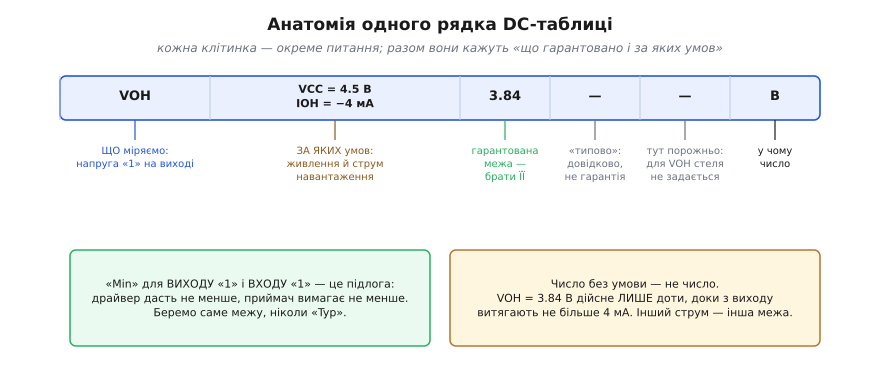
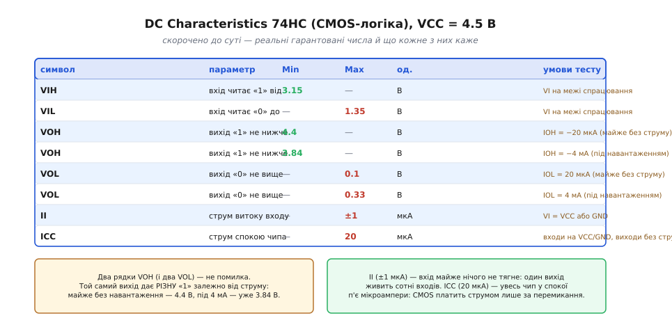
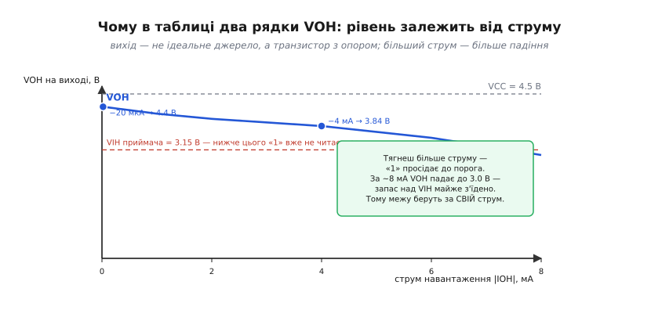

# Як читати DC Characteristics у даташиті

Наймоторошніший баг у цифровій схемі — коли все «з'єднано правильно», а лінія читається як заманеться: то нуль, то одиниця, то працює на столі й відмовляє в корпусі. Причина майже завжди та сама: два піни з'єднали за схемою, але не звірили за **числами**. А числа ці лежать в одному конкретному місці даташита — у таблиці **електричних характеристик постійного струму** (*DC Electrical Characteristics*, від *direct current* — постійний струм). Це не довідкова дрібниця десь у кінці. Це **контракт**: рядок за рядком виробник перелічує, що саме він гарантує на входах і виходах чипа — і за яких умов. Уміти читати цю таблицю — означає бачити наперед, чи «порозуміються» дві мікросхеми, ще до того, як паяльник торкнувся плати.

Мета тут — не завчити числа конкретного чипа, а навчитися **читати сам рядок**: розуміти, що означає кожна клітинка, чому та сама величина трапляється двічі з різними значеннями, і яке з чисел брати в розрахунок. Далі це стане звичкою, що економить години пошуку невловимих збоїв.

### Чому саме «постійного струму» — і де ця таблиця

У даташиті характеристики поділені на дві великі родини, і плутати їх не можна. **DC-характеристики** описують чип у **сталому стані**: вхід тримається на «0» чи «1», вихід теж усталився — і питання лише в тому, **які напруги й струми** при цьому гарантовані. **AC-характеристики** (*alternating current*, змінний струм) описують чип **у русі**: як швидко він перемикається, які затримки, час наростання фронту. Це різні світи — DC каже, **які рівні** правильні; AC каже, **як швидко** вони встигають змінитися.

Нас тут цікавить перша родина. DC-таблиця відповідає на прості, але вирішальні питання: яку напругу вихід видасть за «1» і за «0»; яку напругу вхід ще зрозуміє як «1» і як «0»; скільки струму тягне вхід; скільки струму п'є весь чип, коли нічого не перемикає. Усе це — властивості усталеного стану, і всі вони живуть в одній таблиці.

### Анатомія одного рядка: чотири питання в одному рядку

Спершу розберімо **один** рядок на частини — бо як тільки видно логіку однієї, читається вся таблиця. Візьмімо рядок для напруги виходу «1»:


*Один рядок, розкладений на клітинки. Символ каже, ЩО міряємо (VOH — напруга «1» на виході). Стовпець умов каже, ЗА ЯКИХ обставин (тут: живлення 4.5 В і струм навантаження 4 мА). Три стовпці Min/Typ/Max дають межі: для виходу «1» задано лише Min — підлогу, нижче якої «1» не впаде. Останній стовпець — одиниця. Два висновки внизу: беремо саме межу (не «типове»), і число дійсне лише за своєї умови.*

Прочитати рядок означає відповісти на чотири питання підряд.

**Що це за величина** — каже **символ** у першому стовпці. Символи побудовані як конструктор: перша літера **V** — напруга (*voltage*) або **I** — струм (*current*); далі йде вхід (**I**nput) чи вихід (**O**utput); далі — «0» (**L**ow) чи «1» (**H**igh). Тому `VOH` читається по літерах: **V**oltage **O**utput **H**igh — напруга виходу у стані «1». А `IIL` — **I**nput **L**ow current, струм, що тече крізь вхід, коли на ньому «0». Розшифрувавши перші дві-три літери, ви вже знаєте, про що рядок, навіть не заглядаючи у визначення. (Ці чотири напругові пороги — VIL, VIH, VOL, VOH — задають самі межі логічних «0» і «1»; чому рівень — це [ціла смуга напруг, а не точка](book:electronics/logic-levels-as-ranges), варто тримати в голові, читаючи таблицю.)

**Скільки це** — кажуть три стовпці **Min · Typ · Max** (мінімум · типове · максимум). І тут перша й найважливіша думка: **рядок дає не одне число, а межу**. Виробник не обіцяє «вихід буде рівно стільки»; він обіцяє «не менше» (Min) або «не більше» (Max). Так і має бути — бо двох однакових чипів не існує: параметри повзуть від екземпляра до екземпляра, з температурою, з навантаженням. Тому таблиця обіцяє **край коридору**, у якому гарантовано опиниться будь-який справний чип за дозволених умов.

Який саме стовпець задано — залежить від того, що це за величина. Для «підлоги» (VOH — «1» не нижче; VIH — вхід читає «1» від) задають **Min**. Для «стелі» (VOL — «0» не вище; VIL — вхід читає «0» до; струми витоку — не більше) задають **Max**. Стовпець **Typ** («типово») — довідковий: це те, що вийде «на око» за кімнатної температури й номінального живлення. **У розрахунок його брати не можна** — це не гарантія, а орієнтир. Проєктувати треба **за межею**, припускаючи найгірший дозволений випадок; тільки тоді схема працюватиме на будь-якому екземплярі, а не лише на тому, що пощастило спаяти.

**У чому це** — каже стовпець **одиниці** (В, мВ, мА, мкА, нА). Дрібниця, та переплутати мікроампери з міліамперами — це помилка в тисячу разів, і саме на струмах витоку так найлегше обпектися.

**За яких умов** — і це найпідступніший стовпець, повз який пробігають очима найчастіше. Про нього — окрема розмова далі, бо саме тут ховається більшість помилок «на папері сходилось».

> 🔧 **Навіщо це.** Перше вміння читача даташита — не сплутати «Typ» із гарантією. Новачок бачить `VOH typ = 4.4 В` і радіє: «майже до живлення дотягує». А в розрахунок треба брати `VOH min` — і воно під навантаженням може бути помітно нижчим. Візьмеш «typ» — і запас, який ти порахував, фіктивний: половина партії чипів у нього не вкладеться. Правило просте й залізне: **для входу й виходу беруть межу (Min/Max), ніколи Typ**.

### Уся таблиця: рядок за рядком на реальному чипі

Тепер, коли анатомія рядка зрозуміла, пройдімо цілу (скорочену до суті) таблицю справжнього чипа. Візьмімо класику — чотири логічні елементи «І-НЕ» у корпусі [сімейства 74HC](book:electronics/logic-families) (швидка КМОН-логіка), живлення 4.5 В. Чому саме 4.5, а не «рівні» 5 — стане ясно трохи згодом.


*Скорочена DC-таблиця 74HC (числа за даташитом, VCC = 4.5 В). Зелені значення в стовпці Min — «підлога» (вихід/вхід «1» не нижче); червоні в Max — «стеля» (вихід/вхід «0» не вище, витоки не більше). VIH = 3.15 В, VIL = 1.35 В — це 70 % і 30 % від живлення. VOH задано двома рядками (за різного струму), так само VOL. Внизу — чому рядків VOH два, і що означають крихітні струми II та ICC.*

Пройдімося рядками — кожен несе окрему думку.

**VIH = 3.15 В (Min).** Вхід гарантовано прочитає «1», якщо на ньому не менше 3.15 В. Зверніть увагу: це **70 %** від живлення 4.5 В. КМОН-входи задають пороги як частку живлення — приблизно 0.3·VCC знизу і 0.7·VCC згори. Тому той самий чип на іншому живленні матиме інші вольти порогів, хоч частки лишаться ті самі.

**VIL = 1.35 В (Max).** Вхід гарантовано прочитає «0», якщо на ньому не більше 1.35 В — це **30 %** живлення. Між VIL і VIH (від 1.35 до 3.15 В) лежить **заборонена зона**: подаси туди сигнал — і вихід поведеться непередбачувано.

**VOH = 4.4 В (Min) за IOH = −20 мкА.** Ось перша поява **умови тесту**. Вихід у стані «1» видасть не менше 4.4 В — але **лише** доки з нього витягають зовсім мало струму (20 мікроампер; мінус означає, що струм *витікає* з виходу). Це майже холостий хід — вихід дотягується майже до живлення.

**VOH = 3.84 В (Min) за IOH = −4 мА.** Той самий вихід, той самий стан «1» — а гарантована напруга вже **нижча**, бо струм навантаження більший (4 міліампери). Це не два різні чипи й не помилка друку: **рівень виходу залежить від струму**, і таблиця чесно дає обидві точки. Про механізм — за мить.

**VOL = 0.1 В (Max) за IOL = 20 мкА** і **VOL = 0.33 В (Max) за IOL = 4 мА.** Дзеркально до VOH: вихід «0» майже без навантаження сідає до 0.1 В, а під струмом 4 мА піднімається до 0.33 В. Що більший струм *втікає* у вихід, то вище «0» від землі.

**II = ±1 мкА (Max).** Струм витоку входу (*input leakage current*). КМОН-вхід — це, по суті, ізольований затвор; постійного струму крізь нього майже не тече, лише мікроскопічний витік до ±1 мкА. Практичний наслідок величезний: **один вихід може живити сотні входів**, бо кожен бере копійки струму. Саме тому цифрові схеми так легко «розгалужуються».

**ICC = 20 мкА (Max).** Струм спокою всього чипа (*quiescent supply current*) — скільки він п'є з живлення, коли входи стоять на «0»/«1», а виходи нічого не перемикають. Двадцять мікроампер на весь чотириелементний чип — мізер. Це фундаментальна риса КМОН: **у спокої струм майже не тече**, чип платить енергією лише за самі́ перемикання. (Це прямий наслідок будови [КМОН-пари](book:electronics/cmos): у сталому «0» чи «1» один із двох транзисторів завжди закритий, тож наскрізного шляху від живлення до землі немає.)

Одного погляду на ці рядки часто досить, щоб зрозуміти чип: КМОН-входи з порогами 30/70 %, виходи, що майже дотягуються до шин, копійчані струми витоку й спокою. Далі — розберімо ту саму умову тесту, повз яку так легко пробігти.

### Число без умови — не число

Ось найважливіша ідея всієї статті, і повторити її варто прямо: **рівень виходу — це не стала властивість чипа, а обіцянка за певних обставин**. VOH = 3.84 В дійсне лише «за 4 мА». Той самий вихід за 8 мА дасть уже помітно менше, а за 20 мА — і поготів. Чому так?

Бо вихід — **не ідеальне джерело напруги**, а транзистор зі скінченним опором у відкритому стані. Уяви його як внутрішній резистор між живленням і піном (для «1») чи між піном і землею (для «0»). Що більший струм тягнеш крізь цей резистор, то більше на ньому падає напруги за законом Ома — і то далі рівень «сповзає» від ідеалу до порога. «1» просідає вниз, «0» піднімається вгору.


*Напруга «1» на виході (VOH) як функція струму навантаження. Крапки — дві точки з даташита: за 20 мкА вихід дає 4.4 В (майже до живлення 4.5 В), за 4 мА — уже 3.84 В. Крива йде далі вниз: за ~8 мА «1» просідає до 3.0 В, а це майже впритул до порога приймача VIH = 3.15 В — запас майже з'їдено. Тому межу VOH завжди беруть за СВІЙ робочий струм, а не за холостий хід.*

Звідси — практичне правило, що рятує реальні плати. Коли ти рахуєш, чи дотягнеться «1» твого драйвера до порога приймача, ти **мусиш** брати VOH за той струм, що реально потече. А струм створюють усі, хто «висить» на виході: світлодіод, [резистор підтяжки](book:electronics/floating-pullups), довга шина, кілька паралельних входів. Якщо загальне навантаження більше за струм, для якого даташит гарантує VOH, — гарантований рівень уже не гарантований. Порахуєш запас за «холостим» VOH = 4.4 В, а насправді вихід просяде до 3.5 В — і те, що на папері мало запас у вольт, у залізі його майже не має.

**Приклад (той самий вихід, два струми).** Внутрішній опір відкритого виходу «1» — приблизно `RON ≈ (VCC − VOH) / IOH`. Порахуймо його з двох рядків таблиці й побачимо, що це та сама величина:

```
за IOH = 20 мкА:  RON ≈ (4.5 − 4.4)  / 0.00002 = 0.1 / 0.00002 ≈ 5000 Ом ... (майже без струму — оцінка груба)
за IOH = 4 мА:    RON ≈ (4.5 − 3.84) / 0.004   = 0.66 / 0.004    ≈ 165 Ом
```

За робочих струмів опір виходу — десь пара сотень ом. Тепер видно наслідок прямо: якби ми тягнули 10 мА, падіння було б `10 мА × 165 Ом ≈ 1.65 В`, і «1» просіла б аж до `4.5 − 1.65 ≈ 2.85 В` — **нижче** за поріг VIH = 3.15 В! Приймач читав би таку «1» як заборонену зону. Ось чому [навантажувальна здатність ніжки](book:electronics/pin-drive-limits) — не абстракція: перевищив струм — і рівень зривається.

> 🔧 **Навіщо це.** Читаючи VOH/VOL, завжди дивись на його умову IOH/IOL і питай себе: **мій робочий струм не більший за цей?** Якщо в даташиті VOH гарантований за 4 мА, а ти вішаєш на пін навантаження на 8 мА — ти вийшов за умову, і жодне число з таблиці тобі більше нічого не гарантує. Або тримай струм у межах умови, або шукай рядок таблиці з більшим IOL/IOH (потужніші чипи їх мають), або став окремий драйвер.

### Найгірший кут: чому 4.5 В, а не 5, і до чого тут температура

Лишилося пояснити дрібницю, що виказує досвідченого читача даташита. Чому таблицю вище взято на **4.5 В**, хоча живлять такий чип від 5 В? Бо 5 В — це **номінал**, а реальне живлення «гуляє»: типовий допуск ±10 %, тобто від 4.5 до 5.5 В. І тут спрацьовує дисципліна найгіршого випадку: виходи найслабші (VOH найнижче, VOL найвище) саме за **найнижчого** живлення. Тому виробник наводить гарантії для 4.5 В — це і є «найгірший кут» (*worst-case corner*) за напругою. Спроєктуєш за ним — витримаєш будь-яке живлення в допуску.

Так само таблиця завжди прив'язана до **діапазону температури**. Пороги й струми повзуть із нагрівом: витоки з температурою зростають (іноді на порядок), рівні трохи зсуваються. Гарні даташити дають окремі стовпці для −40…+85 °C і −40…+125 °C. Читаючи число, звіряй, для якого температурного діапазону воно дійсне — бо чип, що працює на столі за +25 °C, може підвести в закритому корпусі за +70 °C, де витоки виросли, а запас стиснувся.

Отже, «взяти число з даташита» — це насправді взяти **трійку**: значення + його струмову умову + його кут за живленням і температурою. Пропустиш будь-яку складову — і розрахунок стане фікцією.

### Складаємо разом: перевірка стику двох чипів

Заради чого вся ця пильність? Заради однієї головної перевірки — чи «порозуміються» вихід одного чипа й вхід іншого. Її роблять навхрест: VOH/VOL беруть із даташита **драйвера** (того, хто видає), а VIH/VIL — із даташита **приймача** (того, хто читає). Умова стику проста: «1» драйвера має дотягтися до порога приймача, а «0» — опуститися нижче за його поріг.

```
щоб «1» пройшла:  VOH(драйвера, за робочого струму)  ≥  VIH(приймача)
щоб «0» пройшов:  VOL(драйвера, за робочого струму)  ≤  VIL(приймача)
```

**Приклад (перевірка на пальцях).** Драйвер — той самий 74HC на 4.5 В, вихід «1» під струмом 4 мА дає VOH = 3.84 В. Приймач вимагає VIH = 3.15 В. Чи проходить «1»?

```
VOH(драйв.) = 3.84 В   ≥   VIH(прийм.) = 3.15 В    →    так, з запасом 0.69 В
```

«1» проходить, і навіть із подушкою. Ту подушку — різницю між тим, що дають, і тим, що вимагають, — називають [запасом завадостійкості](book:electronics/noise-margin), і вона каже, скільки вольтів шуму лінія проковтне, перш ніж помилитися. Якби ж драйвер був на 3.3 В, а приймач вимагав високий VIH, «1» могла б і не дотягтися — і тоді потрібен [зсувач рівнів](book:electronics/level-shifter). Але помітити це можна **лише** звіривши числа з обох таблиць. Хто читає DC-характеристики звичкою, той ловить несумісність рівнів на папері — за хвилину й безкоштовно; хто ні — ловить її на платі, годинами й із загадковими симптомами.

Повний, крок-за-кроком розбір справжнього даташита — від того, як знайти потрібний стовпець серед кількох напруг живлення, до готового розрахунку стику двох різних сімейств із кодом перевірки — винесено окремо: [практикум: читаємо DC-таблицю справжнього чипа від початку до кінця](book:electronics/datasheet-dc-characteristics/proj-read-datasheet.md).

**Приклад (перевірка стику в коді прошивки).** У реальному коді таку звірку інколи роблять програмно — наприклад, у самотесті плати, де мікроконтролер порівнює виміряні на піні рівні з очікуваними межами. Ось як виглядає логіка «чи вкладається виміряний рівень у гарантований коридор»:

```c
// Межі з DC-таблиці приймача (74HC на 4.5 В), у мілівольтах — цілі, без float.
#define VIH_MIN_MV   3150   // вхід читає «1» від 3.15 В
#define VIL_MAX_MV   1350   // вхід читає «0» до 1.35 В

typedef enum { LVL_LOW, LVL_HIGH, LVL_FORBIDDEN } logic_level_t;

// Класифікувати виміряну на піні напругу за порогами приймача.
logic_level_t classify_level(uint16_t v_mv)
{
    if (v_mv >= VIH_MIN_MV) return LVL_HIGH;       // впевнена «1»
    if (v_mv <= VIL_MAX_MV) return LVL_LOW;        // впевнений «0»
    return LVL_FORBIDDEN;                          // заборонена зона — тривога
}

// Перевірити, чи «1» драйвера дотягується до порога приймача із запасом.
bool high_level_ok(uint16_t voh_driver_mv, uint16_t noise_budget_mv)
{
    // потрібно: VOH(драйвера) − VIH(приймача) ≥ бюджет шуму
    return (voh_driver_mv >= VIH_MIN_MV) &&
           (voh_driver_mv - VIH_MIN_MV >= noise_budget_mv);
}
```

Тут видно все зразу: пороги приймача — прямо з таблиці; класифікація ділить шкалу на «0», «1» і заборонену зону; а перевірка стику — те саме віднімання VOH − VIH, тільки в цілих мілівольтах (щоб уникнути похибок дробів у прошивці). Числа в `#define` узяті з реальної DC-таблиці — і саме тому код звіряється з фізикою, а не з бажаннями.

### Підсумок

Таблиця **DC Characteristics** — це контракт чипа на його входи й виходи в усталеному стані: що гарантовано і за яких умов. Кожен рядок читається за чотирма питаннями: **символ** (V/I + Input/Output + Low/High каже, що це) → **Min/Typ/Max** (рядок дає **межу**, а не одне число; беруть Min або Max, ніколи «Typ») → **одиниця** → і найважливіше — **умова тесту**. Головна ідея всієї таблиці: **число без умови — не число**. VOH і VOL «пливуть» зі струмом навантаження, бо вихід — це транзистор з опором, а не ідеальне джерело; тому в таблиці той самий рівень трапляється двічі за різних IOH/IOL, і брати треба той, що відповідає **твоєму** робочому струму. Читати значення слід за **найгіршим кутом** — найнижчим живленням у допуску (тому гарантії дають на 4.5 В, а не 5) і за потрібним діапазоном температури, де витоки більші. Зібравши це докупи, роблять головну перевірку — звірку стику навхрест: VOH драйвера проти VIH приймача, VOL проти VIL, — і саме вона ловить несумісність рівнів на папері, поки вона ще безкоштовна. А те, що ці чотири напруги задають самі межі логічних «0» і «1», і яку «подушку» між виходом і входом вони лишають, докладніше — у темах про [рівні-діапазони](book:electronics/logic-levels-as-ranges) і [запас завадостійкості](book:electronics/noise-margin).

---
