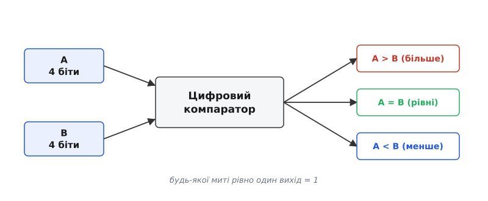
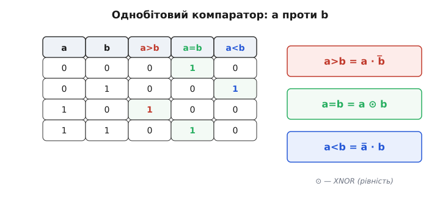
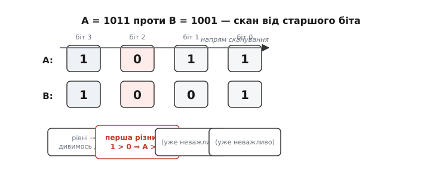
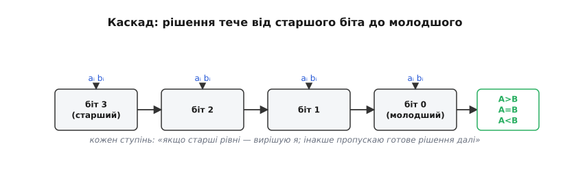
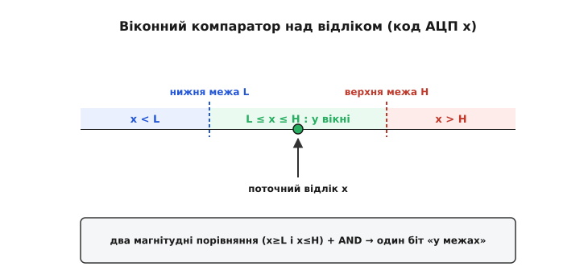

# Цифровий компаратор

Машина раз у раз має ухвалити рішення на основі двох чисел: чи дійшов лічильник до межі, чи перевищив відлік датчика поріг, який із двох пакетів старший за пріоритетом. У всіх цих питаннях ховається одна й та сама дія — **порівняти два числа**. Схема, що робить це за один такт і відповідає трьома взаємовиключними словами — «більше», «рівні», «менше», — і є **цифровий компаратор** (лат. *comparare* — порівнювати, від *com-* «разом» + *par* «рівний», тобто «ставити поряд як рівні»).

Тут варто одразу розвести два пристрої з тим самим словом у назві. [Аналоговий компаратор](book:electronics/comparator) порівнює дві **напруги** і каже одним бітом, яка з них вища, — це межа між аналоговим і цифровим світом. Цифровий компаратор живе цілком усередині цифрового світу: на його входах не напруги, а **числа** — групи бітів, кожен із яких уже надійно «0» або «1». Він не вимірює, наскільки один сигнал вищий за інший; він читає два двійкові числа й повідомляє їхнє **відношення за величиною**.

## Три відповіді, а не одна

Перше, що дивує: чому виходів **три**? Здавалося б, досить одного біта «A більше за B» — а решта виводиться. Але між двома числами можливі рівно три **взаємовиключні** відношення: A > B, A = B, A < B. Будь-якої миті істинне точно одне з них. Один біт розрізнив би лише два випадки («більше» / «не більше»), і тоді «рівні» та «менше» злилися б. Тому повноцінний компаратор виводить три окремі лінії, з яких **завжди активна рівно одна**.


*Два двійкові числа A і B заходять у компаратор, назовні виходять три лінії — A>B, A=B, A<B. У будь-який момент рівно одна з них дорівнює 1, бо два числа перебувають в одному й лише одному з трьох відношень. Це і є вся «робота» компаратора, згорнута в один блок.*

> 🔧 **Навіщо це.** Три роздільні виходи зручні саме тим, що рішення вже розкладене. Гілку «рівні» бере термостат, що мусить вимкнути нагрів точно на заданій температурі; гілку «більше» — захист, що скидає навантаження при перевищенні струму; гілку «менше» — логіка, що тримає процес, доки величина не дотягне до уставки. Один блок одразу годує три різні реакції, без додаткового дешифрування.

## Зерно: однобітовий компаратор

Щоб зрозуміти ціле, спершу порівняймо найменше, що буває, — **два окремі біти** a і b. Можливих комбінацій лише чотири, і відношення для кожної очевидне: 0 проти 0 — рівні; 0 проти 1 — менше; 1 проти 0 — більше; 1 проти 1 — знову рівні. Випишімо це таблицею й одразу прочитаймо з неї логіку.


*Усі чотири комбінації двох бітів і три виходи. «Більше» загоряється рівно в одному рядку — коли a=1, b=0; це добуток a·b̅. «Менше» — коли a=0, b=1; добуток a̅·b. «Рівні» — у двох рядках, де біти збігаються; це XNOR, який позначають ⊙. Три прості рівняння — і однобітовий компаратор готовий.*

Звідси три рівняння читаються прямо з таблиці:

```
a > b  =  a · b̅      (a має одиницю там, де в b нуль)
a < b  =  a̅ · b      (навпаки)
a = b  =  a ⊙ b      (XNOR: одиниця, коли біти однакові)
```

Перші два — звичайні вентилі AND з одним інвертованим входом. Третій, рівність, — це [XNOR](book:electronics/xor-comparison): його вихід дорівнює 1 саме тоді, коли входи **збігаються** (XOR дає 1 на різницю, XNOR — на однаковість). Глибше виводити рівність тут не потрібно: для нашої мети достатньо знати, що один вентиль каже «ці два біти рівні».

## Рівність двох чисел: збіглися всі біти

Найпростіше з повних порівнянь — питання «**чи рівні** числа A і B?». Два двійкові числа рівні тоді й лише тоді, коли в них збігається **кожна** пара однойменних бітів. Тобто беремо XNOR над кожним розрядом окремо («цей біт A дорівнює цьому біту B?»), а тоді вимагаємо, щоб усі ці відповіді були «так» воднораз — а «всі воднораз» у логіці завжди означає **AND**.

```
A = B   ⇔   (a₃ ⊙ b₃) · (a₂ ⊙ b₂) · (a₁ ⊙ b₁) · (a₀ ⊙ b₀) = 1
```

Досить одній парі бітів розійтися — і її XNOR дасть 0, спільний AND обнулиться, схема чесно скаже «не рівні». Це найдешевший вузол усієї теми: жодного перебору від старшого біта, просто «всі збіглися — рівні». Саме так влаштований **компаратор рівності**, і та сама ідея «XNOR кожного біта плюс AND» докладніше розібрана як одне із застосувань [XOR і логіки порівняння](book:electronics/xor-comparison).

## Більше чи менше: скан від старшого біта

Рівність далася легко, бо порядок бітів у ній неважливий. А ось «більше / менше» вимагає врахувати **вагу** розрядів — і тут криється головна ідея всієї теми. Як людина порівнює два багатоцифрові числа? Не з кінця, а **зліва**, зі старших цифр. У 1011 проти 1001 ми не дивимося на молодші біти, поки старші однакові: тисячна позиція в обох «1» — рівні, рухаємось далі; наступна теж «0»/«0» — рівні; а ось на третій позиції в A одиниця, у B нуль — і все вирішено: A більше, хай там що в молодшому біті.


*Порівняння A=1011 і B=1001. Біти переглядаються від старшого до молодшого. Поки пара рівна — рішення відкладене, дивимось далі. Перша ж пара, що різниться, остаточно визначає результат: тут на біті 1 у A одиниця проти нуля в B, отже A > B, і молодший біт уже ні на що не впливає.*

Це і є **правило старшого біта**: відношення двох чисел визначає **найстарша позиція, де вони різняться**. Усі рівні старші біти лише «пропускають хід» далі; перший розбіжний — виносить вирок; усе, що молодше за нього, не має значення. Формально для 4-бітових чисел «A > B» збирається так:

```
A > B  =  (a₃ · b̅₃)
        + (a₃ ⊙ b₃) · (a₂ · b̅₂)
        + (a₃ ⊙ b₃) · (a₂ ⊙ b₂) · (a₁ · b̅₁)
        + (a₃ ⊙ b₃) · (a₂ ⊙ b₂) · (a₁ ⊙ b₁) · (a₀ · b̅₀)
```

Читається це рівняння точно як наш словесний опис. Перший доданок: старший біт A — одиниця, B — нуль, ось і все. Другий: старші біти рівні (XNOR), зате на наступній позиції A більший. І так донизу: кожен доданок вимагає рівності всіх старших пар і «перемоги» A на черговій. «A < B» симетричне — поміняти місцями a й b. А «A = B» — це вже знайомий випадок «усі XNOR разом».

> 🔧 **Навіщо це.** Це правило пояснює, чому при порівнянні чисел не можна сліпо складати всі біти однаково: старший біт «важить» більше за весь хвіст молодших разом узятих. Та сама асиметрія — причина, чому в системах із пріоритетами поле пріоритету кладуть у **старші** біти слова: тоді одне магнітудне порівняння цілого слова автоматично спершу зважує пріоритет, а вже за рівних пріоритетів — усе інше.

## Як зростити широкий компаратор: каскад

Однобітові ступені природно з'єднуються в **ланцюг** (каскад), що порівнює числа будь-якої ширини. Кожен ступінь дивиться на свою пару бітів і на рішення, що прийшло від старшого сусіда, та працює за простим правилом: «якщо старші розряди вже визначили результат — пропускаю його далі незмінним; якщо вони рівні — вирішую сам за своєю парою бітів».


*Ступені шикуються від старшого біта до молодшого. Кожен приймає свою пару бітів aᵢ, bᵢ та проміжне рішення зліва. Поки старші ступені рівні, право голосу спускається далі; щойно хтось виявив різницю — його вердикт уже без змін протікає крізь усі молодші ступені на вихід. Так із простого зерна виростає компаратор на скільки завгодно бітів.*

У цьому ланцюгу є тонкий, але корисний момент — **вхід каскаду на самому початку**. Найстаршому ступеню теж треба «попереднє рішення», хоча старше за нього нічого немає. Туди подають стартовий стан «поки що рівні» — і саме цей вхід дає змогу **стикувати кілька мікросхем-компараторів** у ширше число: вихід молодшого блока заводять у каскадний вхід старшого, і два 4-бітові компаратори стають одним 8-бітовим без жодного зайвого вентиля. Готові мікросхеми цього класу — [каскадований магнітудний компаратор](book:electronics/digital-comparator/comp-magnitude-comparator.md) — саме так і нарощують.

За цю простоту платять **затримкою**. Рішення мусить фізично «протекти» крізь ступені — від старшого до молодшого, — тож у найгіршому разі (числа різняться аж у наймолодшому біті) сигнал проходить увесь ланцюг. Що ширше число, то довший шлях і пізніше встановлюється відповідь. Це той самий компроміс «простота проти швидкості», що й у суматора з наскрізним переносом; способи його обійти (порівнювати групи бітів паралельно) — це вже глибша тема [комбінаційних схем](book:electronics/combinational-circuits) і прискорених структур.

## Компаратор у цифровому обробленні сигналів

Дотепер ішлося про порівняння двох довільних чисел. Та найчастіше в реальній прошивці компаратор працює над **відліками** — числами, що їх АЦП щотакту виробляє з [дискретизованого сигналу](book:electronics/sampling-quantization). Тут компаратор стає робочим інструментом цифрового оброблення: він не змінює сигнал, а **класифікує** кожен його відлік.

Найпряміше застосування — **порогова перевірка**: чи перевищив відлік уставку. Один магнітудний порівняч коду АЦП із заздалегідь обчисленим порогом — і маємо цифрове реле, що спрацьовує точно на потрібному рівні, без дрейфу аналогового кола.

**Порогова перевірка відліку.**
:::tabs
```c
// 12-бітовий АЦП дає код 0..4095; поріг — у тих самих одиницях коду
#define OVERLOAD_CODE  3277u      // ≈ 80% повної шкали

uint16_t s = adc_read();          // свіжий відлік
if (s > OVERLOAD_CODE) {          // те саме «A > B», лише в коді МК
    trip_protection();            // гілка «більше»
}
```
```python
# 12-бітовий АЦП дає код 0..4095; поріг — у тих самих одиницях коду
OVERLOAD_CODE = 3277              # ≈ 80% повної шкали

s = adc_read()                    # свіжий відлік
if s > OVERLOAD_CODE:             # те саме «A > B», лише в коді МК
    trip_protection()             # гілка «більше»
```
:::
Порівняння `>` тут — це буквально наш магнітудний компаратор, тільки виконаний інструкцією процесора над числом, а не вентилями над дротами. Логіка ідентична: важать старші біти коду, перша відмінність вирішує.

Часто питання складніше — чи лежить відлік **усередині діапазону**. Це **віконний компаратор**: два магнітудні порівняння з нижньою та верхньою межами, зведені разом через AND.


*Дві уставки L і H ділять усю шкалу коду на три зони: нижче вікна (x < L), у вікні (L ≤ x ≤ H) і вище (x > H). Поточний відлік потрапляє рівно в одну з них. Щоб дізнатися «у межах», беруть два магнітудні порівняння — x не менший за L і не більший за H — та об'єднують їх логічним AND.*

**Віконна перевірка відліку.**
```c
#define LO_CODE  1200u            // нижня межа вікна (код АЦП)
#define HI_CODE  2800u            // верхня межа

static inline int in_window(uint16_t s) {
    return (s >= LO_CODE) && (s <= HI_CODE);   // два порівняння + AND
}

uint16_t s = adc_read();
if (!in_window(s))                // відлік вийшов за межі
    flag_out_of_range();
```
Той самий вузол «дві межі плюс AND» цілодобово стереже датчики: сигнал у нормі — мовчимо, вийшов за вікно — піднімаємо тривогу. Тахометр так ловить надмірні оберти, монітор живлення — просадку чи стрибок напруги.

Магнітудне порівняння — це ще й фундамент **пошуку крайнощів** у потоці відліків. Щоб знайти пік (максимум) сигналу за вікно вимірювання, кожен новий відлік порівнюємо з поточним рекордом і лишаємо більший — суцільне «A > B», прокручене в часі.

**Пік у потоці відліків.**
:::tabs
```c
uint16_t peak = 0;                              // поки рекордів немає
for (int i = 0; i < N; i++) {
    uint16_t s = adc_read();
    if (s > peak) peak = s;                     // більший — новий рекорд
}
// peak — найбільший відлік за N зчитувань
```
```python
peak = 0                                        # поки рекордів немає
for _ in range(N):
    s = adc_read()
    if s > peak:                                # більший — новий рекорд
        peak = s
# peak — найбільший відлік за N зчитувань
```
:::
На тому самому порівнянні стоять і фільтр-медіана, і сортування, і пошук мінімуму — усюди, де треба впорядкувати числа, у глибині працює компаратор. Докладніше про прошивкові патерни — від побітового порівняння «як у залізі» до пошуку крайнощів у потоці — у [практичних прийомах порівняння в коді](book:electronics/digital-comparator/proj-comparator-patterns.md).

> 🔧 **Навіщо це.** Поріг, вікно й пошук крайнощів — це майже все, що робить прошивка з відліками датчиків на найнижчому рівні. За кожним «спрацювало / в нормі / новий максимум» стоїть магнітудне порівняння. Тримати поріг у тих самих одиницях, що й код АЦП (а не перераховувати щораз у вольти), — і дешевше, і точніше: порівняння цілих чисел не має ні похибки округлення, ні дрейфу.

На цьому й тримається місце компаратора в цифровій машині: він — та найменша ланка, де число перетворюється на **дію**. Лічильники, регістри, коди АЦП самі собою лише тримають величини; аж на порівнянні величина вперше розгалужує поведінку — цією гілкою чи тією, спрацювати чи змовчати. Тому щойно пристрій має вибрати за «скільки», вибір урешті впирається в одне-єдине порівняння — і цей крихітний вузол виявляється всюди, де числа керують рішеннями.
