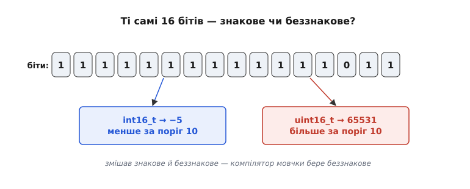
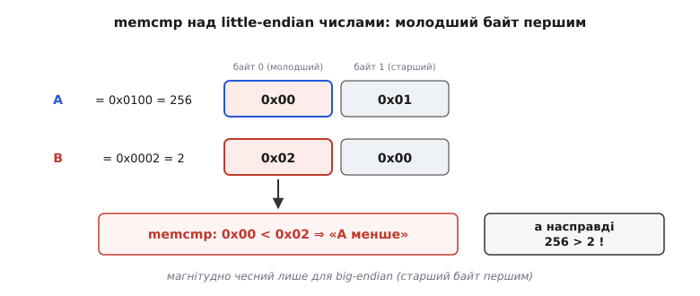
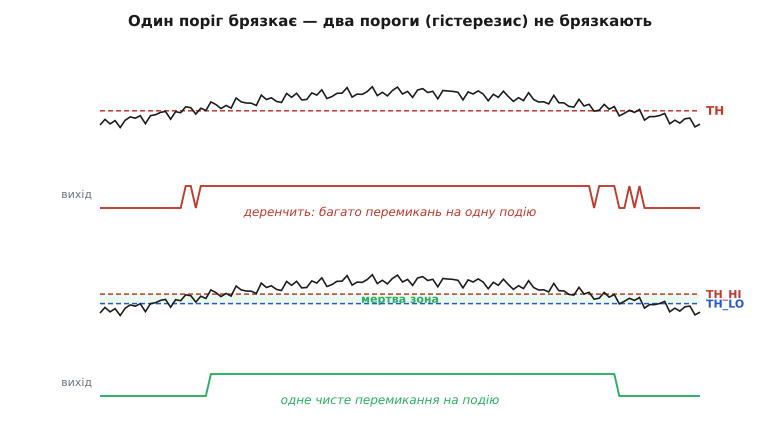

# ⚙️ Практичні прийоми порівняння в коді

У прошивці порівняння виглядає обманливо просто: написав `if (a > b)` — і готово. Але саме тут ховається найбільша купа тихих багів мікроконтролерної розробки. Знак, ширина, порядок байтів, тремтіння порогу — усе це перетворює невинне «більше» на джерело помилок, які не видно на око й важко спіймати без осцилографа під рукою. Тут ми пройдемо шлях від того, як порівняння виглядає **в залізі** (побітово, старший розряд вирішує), до того, як його правильно писати **над числами** в реальному коді: чому компаратор іноді бреше, як порівнювати багатобайтові буфери, як прибрати брязкіт на порозі й як за один прохід дістати з потоку відліків максимум, мінімум і їхні позиції.

Це продовження теми — сама ідея магнітудного порівняння, правило старшого біта й віконний компаратор уже розібрані в статті про [цифровий компаратор](book:electronics/digital-comparator). Тут — прошивковий бік: робочий код і граблі, на які наступають.

## Компаратор «як у залізі»: побітове порівняння без відніманя

Почнімо з питання, яке звучить дивно: **навіщо взагалі писати компаратор руками**, коли процесор має інструкцію `cmp` і оператори `<`, `>`, `==`? У повсякденному коді — не треба, оператор і є найкращий компаратор. Але є ситуації, де корисно порівняти два числа **точно так, як це робить залізо** — розряд за розрядом, від старшого до молодшого, без арифметики. Найтиповіша — коли треба порівняти числа **ширші за машинне слово** (128-бітний лічильник, багатобайтовий ключ), а віднімати цілком їх дорого чи незручно. Тоді працює саме побітовий скан: перша відмінність вирішує все.

Ідея дослівно повторює правило старшого біта. Ідемо від найстаршого біта до найменшого. Поки біти рівні — «пропускаємо хід», дивимось далі. Перший біт, де числа розійшлися, виносить вирок: чиє тут «1» — те число й більше, а всі молодші біти вже не мають значення. Ось прямий переклад цього словесного опису в код:

**Побітовий магнітудний компаратор (16 біт, як зерно каскаду).**
:::tabs
```cpp
#include <stdint.h>

// Повертає: +1 якщо a>b,  0 якщо a==b,  -1 якщо a<b.
// Свідомо скановано побітово від старшого біта — так само, як каскад у залізі.
int cmp16_bitwise(uint16_t a, uint16_t b) {
    for (int i = 15; i >= 0; --i) {          // біт 15 = старший
        uint16_t mask = (uint16_t)(1u << i);
        uint16_t abit = a & mask;
        uint16_t bbit = b & mask;
        if (abit != bbit)                     // перша відмінність
            return (abit > bbit) ? +1 : -1;   // чий біт «1» — той більший
    }
    return 0;                                 // жодної відмінності — рівні
}
```
```python
# Повертає: +1 якщо a>b,  0 якщо a==b,  -1 якщо a<b.
# Свідомо скановано побітово від старшого біта — так само, як каскад у залізі.
def cmp16_bitwise(a: int, b: int) -> int:
    for i in range(15, -1, -1):          # біт 15 = старший
        mask = 1 << i
        abit = a & mask
        bbit = b & mask
        if abit != bbit:                 # перша відмінність
            return +1 if abit > bbit else -1   # чий біт «1» — той більший
    return 0                             # жодної відмінності — рівні
```
:::

Цей цикл — це буквально каскад однобітових ступенів, розгорнутий у часі замість простору. Кожен виток — один ступінь; `if (abit != bbit)` — це «якщо старші рівні — вирішую я»; `return` — це вирок, що «протікає» назовні й обриває решту. Затримка каскаду в залізі тут стає кількістю витків циклу: у найгіршому разі (числа різняться аж у наймолодшому біті) робимо всі 16 порівнянь.

> 🔧 **Навіщо це.** Такий скан незамінний, коли число не влазить у регістр. 256-бітний лічильник монотонного часу чи криптоключ зберігають масивом байтів; порівняти їх одним `>` не можна — оператор працює лише над цілими типами мови. Побітовий (а на практиці — побайтовий, нижче) скан від старшого кінця дає відповідь, ніколи не переповнюючись і не потребуючи довгої арифметики.

На практиці бітами перебирати марно повільно — залізо й компілятор порівнюють цілими словами за один такт. Але сам **принцип** «старший розряд першим, перша відмінність вирішує» лишається, і ми повертаємось до нього, щойно дійде до багатобайтових буферів.

## Пастка номер один: знак

Тепер — до головної причини, чому компаратор у прошивці **бреше**. Оператор `>` порівнює числа за їхнім типом, а тип на мікроконтролері легко переплутати. І найпідступніша плутанина — між **знаковим** і **беззнаковим** цілим.

Уявімо датчик, що видає знаковий відлік (температура буває від'ємна), і поріг, записаний як звичайне беззнакове число. Наївний код:

:::tabs
```cpp
int16_t  t         = read_temp();    // −40 .. +125, знакове
uint16_t threshold = 10;             // поріг, беззнакове
if (t > threshold) alarm();          // ПАСТКА
```
```python
t = read_temp()                      # −40 .. +125, знакове
threshold = 10                       # поріг

# У самому Python пастки немає: int безмежний, −5 < 10 завжди.
# Але щойно ми імітуємо 16-бітне беззнакове поле (маска & 0xFFFF) —
# той самий біт-візерунок −5 читається як 65531, і порівняння бреше так само:
if (t & 0xFFFF) > threshold:         # ПАСТКА: −5 стало 65531
    alarm()
```
:::

Здавалося б, при t = −5 умова хибна — і правильно, −5 не більше за 10. Але вона **істинна**. Компілятор, щоб порівняти знакове зі беззнаковим однакового рангу, за правилами мови зводить **обидва до беззнакового** (це називають звичайними арифметичними перетвореннями, англ. *usual arithmetic conversions*). Знакове −5 у 16-бітному беззнаковому стає 65531 — і воно, звісно, більше за 10. Тривога спрацьовує там, де мала б мовчати, і, що гірше, при найхолоднішій температурі.


*Бітовий візерунок 1111111111111011 незмінний. Прочитаний як знакове (int16_t) — це −5, менше за поріг 10. Прочитаний як беззнакове (uint16_t) — це 65531, набагато більше. Змішавши в одному порівнянні знакове й беззнакове, ми змушуємо компілятор мовчки перетворити −5 на 65531; компаратор чесно каже «більше», але порівнює вже не те, що ми думали.*

Механізм тут той самий, що й у знаменитому багу `if (x < 0)` для беззнакового `x` — така умова **завжди хибна**, бо беззнакове число не буває від'ємним, і компілятор має право викинути всю гілку. Це не примха окремого компілятора, а вимога стандарту мови, тож помилка відтворюється всюди й не залежить від оптимізації.

**Лікування** одне: не змішувати знаковість у порівнянні. Або обидва операнди знакові, або обидва беззнакові — а якщо мусимо порівняти різні, свідомо й видимо приводимо їх до спільного типу, який **вміщує обидва діапазони**:

**Безпечне порівняння знакового з порогом.**
```c
int16_t t         = read_temp();     // −40 .. +125
int16_t threshold = 10;              // поріг ТЕЖ знаковий — діапазони збігаються
if (t > threshold) alarm();          // тепер −5 > 10 хибне, як і має бути

// Якщо поріг за природою беззнаковий і великий (не влазить у int16_t),
// піднімаємо ОБИДВА в ширший знаковий тип, що вміщує все:
int32_t tw  = t;                     // −5
int32_t thr = 40000;                 // великий поріг
if (tw > thr) alarm();               // порівняння чесне: обидва int32_t
```

Правило, яке варто вбити в звичку: **порівнювані величини мають бути одного типу, і цей тип має вміщувати обидва їхні діапазони**. Тоді жодне мовчазне перетворення не зіпсує вирок.

## Пастка номер два: підвищення до int і різна ширина

Знак — не єдине джерело мовчазних перетворень. Друга пастка тонша: у мові C будь-яке ціле **вужче за `int`** перед арифметикою чи порівнянням автоматично **підвищується до `int`** (англ. *integer promotion*). Тобто `uint8_t`, `int8_t`, `uint16_t` (на 32-бітному ядрі) у виразі перетворюються на `int` **ще до** того, як почне діяти правило знаковості з попереднього розділу.

Наслідок несподіваний: `int8_t` проти `uint8_t` порівнюються **знаково**, бо обидва підвищуються до знакового `int` — і тут −1 лишається −1, а не стає 255. А от `int` проти `unsigned int` (обидва «широкі», підвищувати нікуди) порівнюються **беззнаково** — і −1 стає UINT_MAX. Той самий на вигляд код поводиться протилежно залежно від ширини типів:

```c
int8_t  a8 = -1;    uint8_t  b8 = 1;
if (a8 < b8) { /* ІСТИНА: обидва → int, −1 < 1 знаково */ }

int32_t a32 = -1;   uint32_t b32 = 1;
if (a32 < b32) { /* ХИБА: a32 → unsigned, −1 стає 4294967295 */ }
```

Розбіжність не в логіці, а в тому, куди мова підвищує операнди. Тому «працює на менших типах» ще не означає «працюватиме, коли поле розширять до 32 біт» — типовий регрес, який спливає через рік після написання.

Практичний висновок той самий: не покладайся на автоматику. Коли порівнюєш величини різної ширини й знаковості, **сам приведи їх** до одного явного типу, широкого настільки, щоб вмістити геть усі можливі значення обох. Тоді результат не залежить ні від ширини `int` на конкретному ядрі, ні від напряму підвищення.

> 🔧 **Навіщо це.** Ці правила виводяться з арифметики цілих у самій мові — та сама механіка стоїть за прапорцями переносу й знаку в процесорі, докладніше про них в [арифметико-логічному пристрої](book:electronics/arithmetic-logic-unit). На мікроконтролері типи змішуються постійно: 8-бітний регістр периферії, 16-бітний код АЦП, 32-бітна змінна лічильника. Свідоме приведення — єдиний спосіб, щоб `>` порівнював саме те, що ти маєш на увазі, а не те, у що мова мовчки перетворила операнди.

## Порівняння багатобайтових даних: буфери й порядок байтів

Часто порівнювати треба не одне число, а **послідовність байтів** — версію протоколу, серійний номер, заголовок пакета, зчитаний блок пам'яті. Тут прошивка спирається на стандартний `memcmp` — і саме тут криється тонкість, яку легко проґавити.

`memcmp(p, q, n)` порівнює `n` байтів двох буферів і повертає число: 0 — байти однакові; від'ємне — перший відмінний байт у `p` менший; додатне — більший. Ключове, зафіксоване стандартом мови: байти порівнюються **як `unsigned char`**, зліва направо, і **знак результату — це знак різниці першої відмінної пари байтів**. Тобто `memcmp` — це той самий побайтовий скан «перша відмінність вирішує», тільки над байтами замість бітів.

**Перевірка збігу заголовка пакета.**
```c
#include <string.h>
#include <stdint.h>

static const uint8_t MAGIC[4] = { 0xDE, 0xAD, 0xBE, 0xEF };

int header_ok(const uint8_t *pkt) {
    return memcmp(pkt, MAGIC, sizeof MAGIC) == 0;   // 0 == усі 4 байти збіглися
}
```
Для перевірки на **рівність** усе прозоро: 0 означає «збіглося», решта — «ні». Тут `memcmp` — це апаратний компаратор рівності (XNOR кожного біта плюс AND), розгорнутий у прошивку; та сама ідея побітової рівності розібрана у [XOR і логіці порівняння](book:electronics/xor-comparison).

А ось коли ми хочемо **«більше / менше»** над багатобайтовим числом — вилазить порядок байтів. `memcmp` порівнює від **першого байта в пам'яті**, тобто як великий порядок (англ. *big-endian*): старший байт лежить першим. Якщо число теж зберігається великим порядком, `memcmp` дає правильне магнітудне порівняння — старший байт вирішує, точно за правилом старшого розряду. Але якщо число лежить **малим порядком** (англ. *little-endian*, як на більшості мікроконтролерів — молодший байт першим), `memcmp` порівняє спершу молодші байти й **збреше**: 0x0100 і 0x0002 у пам'яті лежать як `00 01` і `02 00`, `memcmp` гляне на перший байт (00 проти 02) і скаже «перше менше», хоча 256 > 2.


*Два 16-бітні числа A=0x0100 (256) і B=0x0002 (2). У пам'яті little-endian вони лежать молодшим байтом уперед: A → «00 01», B → «02 00». memcmp читає з першого байта й порівнює 0x00 проти 0x02 — вирішує, що A менше, хоча за величиною A більше в 128 разів. memcmp дає правильне магнітудне порівняння лише для big-endian зберігання, де перший байт у пам'яті і є старший.*

Звідси правило: **`memcmp` магнітудно коректний лише для великого порядку байтів.** Для рівності порядок не важливий (усі байти однакові — і край), тож перевірку заголовків і ключів `memcmp` робить надійно завжди. А для «більше/менше» над багатобайтовим числом на little-endian платформі байти треба порівнювати вручну від старшого кінця — тим самим побайтовим сканом:

**Магнітудне порівняння багатобайтового числа незалежно від порядку.**
:::tabs
```cpp
// Порівнює два числа однакової довжини, задані масивами байтів у little-endian.
// Повертає +1 / 0 / −1, скануючи від СТАРШОГО байта (останній індекс) до молодшого.
int cmp_le_bytes(const uint8_t *a, const uint8_t *b, size_t n) {
    for (size_t i = n; i-- > 0; ) {        // від n-1 (старший) до 0 (молодший)
        if (a[i] != b[i])                   // перша відмінність від старшого кінця
            return (a[i] > b[i]) ? +1 : -1;
    }
    return 0;                               // усі байти рівні
}
```
```python
# Порівнює два числа однакової довжини, задані bytes у little-endian.
# Повертає +1 / 0 / −1, скануючи від СТАРШОГО байта (останній індекс) до молодшого.
def cmp_le_bytes(a: bytes, b: bytes) -> int:
    for i in range(len(a) - 1, -1, -1):    # від n-1 (старший) до 0 (молодший)
        if a[i] != b[i]:                    # перша відмінність від старшого кінця
            return +1 if a[i] > b[i] else -1
    return 0                                # усі байти рівні

# Ідіоматичний Python зробив би те саме одним рядком — реверс кортежів байтів
# порівнює саме від старшого кінця:
#     return (a[::-1] > b[::-1]) - (a[::-1] < b[::-1])
```
:::
Це той самий каскад, що й `cmp16_bitwise`, тільки ступінь — байт, а не біт, і йдемо від старшого байта (у little-endian це **останній** індекс). Ідея незмінна від заліза: старший розряд першим, перша відмінність — вирок.

> 🔧 **Навіщо це.** Плутанина порядку байтів у порівнянні — класична причина, чому «версія A старша за версію B» рахується навпаки, чому сортування серійних номерів дає безлад, чому монотонний лічильник у зовнішній пам'яті «стрибає назад». `memcmp` спокушає простотою, але його магнітудна семантика прив'язана до big-endian. Пам'ятай: рівність — `memcmp` завжди; «більше/менше» багатобайтового — лише якщо дані big-endian, інакше побайтовий скан від старшого кінця.

## Пастка на порозі: брязкіт і гістерезис

Повернімось до найчастішого прошивкового застосування — **порогової перевірки** відліку датчика (сам поріг як цифрове реле вже показаний у статті про [цифровий компаратор](book:electronics/digital-comparator)). Тут чигає пастка вже не мовна, а фізична. Голе порівняння `if (x > TH)` бездоганне на папері, та над реальним зашумленим сигналом воно починає **брязкати**.

Причина проста, і її варто побачити на очах. Сигнал ніколи не буває ідеально гладким — на нього накладено шум (аналоговий шум давача, [квантування](book:electronics/sampling-quantization) в АЦП). Коли справжня величина повзе якраз повз поріг, шум щомиті кидає відлік то трохи вище, то трохи нижче за уставку. Компаратор чесно реагує на кожен перетин — і на виході замість одного чистого «спрацювало» отримуємо шквал: увімк-вимк-увімк-вимк десятки разів за частку секунди. Реле деренчить, світлодіод миготить, лічильник подій зашкалює.


*Угорі: зашумлений сигнал перетинає єдиний поріг TH багато разів поспіль, і вихід деренчить — серія хибних спрацювань там, де подія одна. Унизу: два пороги, верхній TH_HI й нижній TH_LO, лишають між собою «мертву зону». Вихід вмикається лише вгорі й вимикається лише внизу; поки відлік гуляє в зоні між ними, стан не міняється — одне чисте перемикання замість зграї.*

Ліки — **гістерезис** (грец. *hysteresis* — «відставання»): замість одного порога беремо **два**. Вмикаємось, коли відлік підіймається вище верхнього порога `TH_HI`; вимикаємось, коли падає нижче нижнього `TH_LO`. Між ними — «мертва зона», у якій вихід **не міняється**, а тримає попередній стан. Тепер, щоб перемкнутися назад, шуму мало «лизнути» поріг — треба пройти всю зону наскрізь, а це шуму не до снаги. Одна подія — одне перемикання.

Тонкість реалізації в тому, що гістерезис **потребує пам'яті стану**: який поріг зараз активний, залежить від того, увімкнені ми чи ні. Тобто це вже не чиста комбінаційна логіка, а маленький [скінченний автомат](book:electronics/finite-state-machines) на два стани.

**Пороговий детектор із гістерезисом.**
:::tabs
```cpp
#include <stdint.h>
#include <stdbool.h>

// Два пороги в одиницях коду АЦП; TH_HI > TH_LO — це і є ширина мертвої зони.
#define TH_HI  2600u
#define TH_LO  2400u

static bool tripped = false;          // пам'ять стану між викликами

bool threshold_hysteresis(uint16_t x) {
    if (!tripped) {
        if (x > TH_HI) tripped = true;    // увімкнення — лише вгорі
    } else {
        if (x < TH_LO) tripped = false;   // вимкнення — лише внизу
    }
    return tripped;
}
```
```python
# Два пороги в одиницях коду АЦП; TH_HI > TH_LO — це і є ширина мертвої зони.
TH_HI = 2600
TH_LO = 2400

class ThresholdHysteresis:
    def __init__(self):
        self.tripped = False          # пам'ять стану між викликами

    def __call__(self, x: int) -> bool:
        if not self.tripped:
            if x > TH_HI:
                self.tripped = True   # увімкнення — лише вгорі
        else:
            if x < TH_LO:
                self.tripped = False  # вимкнення — лише внизу
        return self.tripped
```
:::
Зверніть увагу: `tripped` — `static`, стан живе між викликами; без нього гістерезису не буває. Активний поріг щоразу залежить від поточного стану — саме це прибирає брязкіт. Ширину зони `TH_HI − TH_LO` беруть щедро більшою за розмах шуму (типово кілька-десятки одиниць коду): вужча зона гірше глушить брязкіт, ширша — притуплює чутливість, бо реагувати починаємо пізніше. Той самий прийом у залізі роблять аналогово — [тригер Шмітта](book:electronics/threshold-schmitt) саме так чистить фронти від дребезгу.

> 🔧 **Навіщо це.** Гістерезис — обов'язковий скрізь, де порівняння керує реальним виконавчим механізмом. Термостат без нього клацав би реле нагрівача разів десять на секунду рівно на заданій температурі — і спалив би контакти за тиждень. Монітор напруги гуляв би між «норма» й «аварія» на кожній пульсації. Правило: **на будь-якому порозі, що керує фізичним виходом над зашумленою величиною, ставимо два пороги, а не один.**

## Крайнощі в потоці: максимум, мінімум і їхні позиції за один прохід

Останній прошивковий патерн — **пошук крайнощів у потоці відліків**. Простий пошук піка вже показано у статті-власнику; тут заглибимось у те, що потрібно на практиці: часто мало знати *яке* значення максимальне — треба ще й *коли* воно сталося (індекс відліку), і водночас відстежувати мінімум. Усе це збирається на тому самому магнітудному порівнянні за **один прохід** по даних, без зайвого перегляду й без зайвої пам'яті.

Ідея — тримати кілька «рекордів» одночасно й кожен новий відлік порівнювати з кожним із них. Максимум і його позиція; мінімум і його позиція. Проходимо потік раз: більший за поточний максимум — оновлюємо максимум і запам'ятовуємо номер; менший за поточний мінімум — оновлюємо мінімум. Розмах (англ. *peak-to-peak*, різниця максимуму й мінімуму) виходить дарма, наприкінці.

**Максимум, мінімум, їхні індекси й розмах за один прохід.**
:::tabs
```cpp
#include <stdint.h>

typedef struct {
    uint16_t max, min;        // крайні значення
    uint16_t imax, imin;      // індекси відліків, де вони сталися
    uint16_t range;           // розмах max − min (peak-to-peak)
} stream_stats_t;

stream_stats_t scan_stream(const uint16_t *x, uint16_t n) {
    stream_stats_t s;
    s.max = s.min = x[0];     // ПОЧАТОК — з першого відліку, не з 0 і не з 0xFFFF
    s.imax = s.imin = 0;
    for (uint16_t i = 1; i < n; ++i) {
        if (x[i] > s.max) { s.max = x[i]; s.imax = i; }   // «A > B» на максимум
        else if (x[i] < s.min) { s.min = x[i]; s.imin = i; }  // «A < B» на мінімум
    }
    s.range = (uint16_t)(s.max - s.min);
    return s;
}
```
```python
from typing import NamedTuple, Sequence

class StreamStats(NamedTuple):
    max: int          # крайні значення
    min: int
    imax: int         # індекси відліків, де вони сталися
    imin: int
    range: int        # розмах max − min (peak-to-peak)

def scan_stream(x: Sequence[int]) -> StreamStats:
    mx = mn = x[0]    # ПОЧАТОК — з першого відліку, не з 0 і не з 0xFFFF
    imx = imn = 0
    for i in range(1, len(x)):
        if x[i] > mx:            # «A > B» на максимум
            mx, imx = x[i], i
        elif x[i] < mn:          # «A < B» на мінімум
            mn, imn = x[i], i
    return StreamStats(mx, mn, imx, imn, mx - mn)
```
:::

Три деталі тут не випадкові — і кожна з них пастка, якщо зробити навпаки.

**Ініціалізація з першого відліку, а не з константи.** Спокуса — почати максимум із 0, а мінімум із 0xFFFF, «щоб будь-що їх побило». Для беззнакового це ще проходить, але для знакового чи для іншої ширини межі плутаються, і при порожньому масиві (`n == 0`) звертання `x[0]` взагалі поза межами. Правильно й універсально — узяти за перший рекорд **сам перший елемент**, а цикл почати з другого. Тоді код не залежить від типу й діапазону, а `n == 0` треба лише відсікти окремо перед викликом.

**`else if`, а не два незалежні `if`.** Один відлік не може бути водночас і новим максимумом, і новим мінімумом (окрім найпершого, який уже вписаний до циклу). `else if` економить одне порівняння на кожен виток: розпізнали новий максимум — не перевіряємо його ж на мінімум. На довгих потоках чи швидкому АЦП ця дрібниця відчутна.

**Індекс, а не лише значення.** Знати *коли* стався пік — часто цінніше за саме значення: це момент удару, спалаху, піка струму. Позиція дається задарма — просто фіксуємо `i` тієї ж миті, коли оновлюємо рекорд. Жодного другого проходу шукати, «а де ж воно було».

Складність — лінійна: рівно `n − 1` витків, у кожному одне-два порівняння, пам'яті — жменя змінних незалежно від довжини потоку. Це найдешевше, що буває; жоден хитріший алгоритм не знайде максимум, не глянувши бодай раз на кожен елемент. На тому самому магнітудному порівнянні, прокрученому в часі, стоять і сортування, і фільтр-медіана, і відстеження огинаючої сигналу — усюди в глибині працює те саме «більше/менше», з якого почалась уся тема.

> 🔧 **Навіщо це.** Один прохід замість кількох — це і швидкість, і місце. На мікроконтролері відліки часто течуть потоком і в пам'яті не осідають: обробив — викинув. Тому важливо витиснути з кожного відліку все за один дотик — максимум, мінімум, їхні позиції, розмах, — не тримаючи весь буфер і не пробігаючи його вдруге. Розмах `max − min`, до речі, — це готова оцінка амплітуди сигналу без жодної математики, лише два порівняння в циклі.

---

Отже, порівняння в прошивці — це не просто `>`. У залізі воно йде побітово від старшого розряду, і той самий скан оживає в коді, коли число ширше за слово чи лежить багатобайтовим буфером — «перша відмінність від старшого кінця вирішує». Оператор `>` бреше на змішаній знаковості (знакове мовчки стає беззнаковим) і поводиться по-різному залежно від ширини типів через підвищення до `int` — тож порівнювані величини тримаємо одного типу, широкого досить для обох діапазонів. `memcmp` дає рівність завжди, але магнітуду — лише для big-endian; на little-endian «більше/менше» рахуємо побайтовим сканом від старшого кінця. На фізичному порозі одне порівняння брязкає — ставимо два пороги з мертвою зоною (гістерезис) і пам'яттю стану. А крайнощі потоку — максимум, мінімум, їхні позиції й розмах — знімаємо за один прохід на тому самому «A > B», ініціалізуючи рекорди першим відліком і розділяючи гілки через `else if`.
