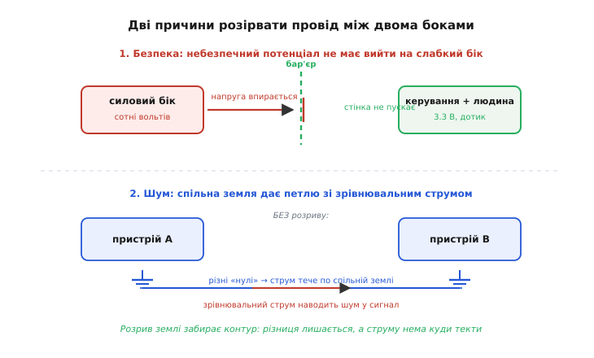
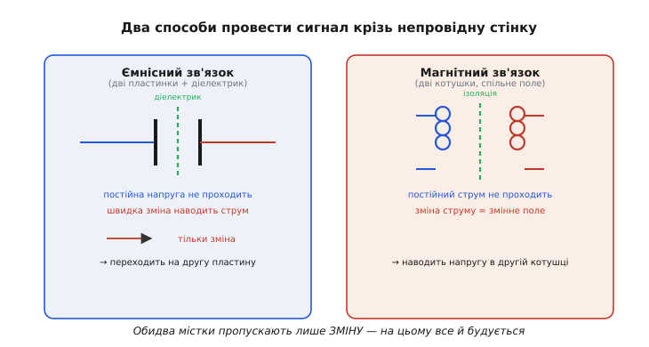
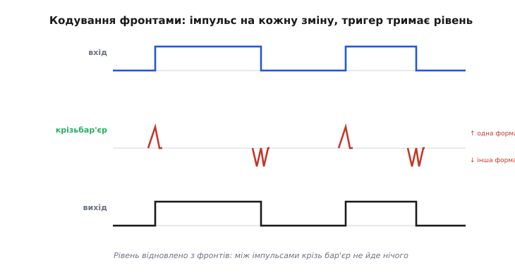
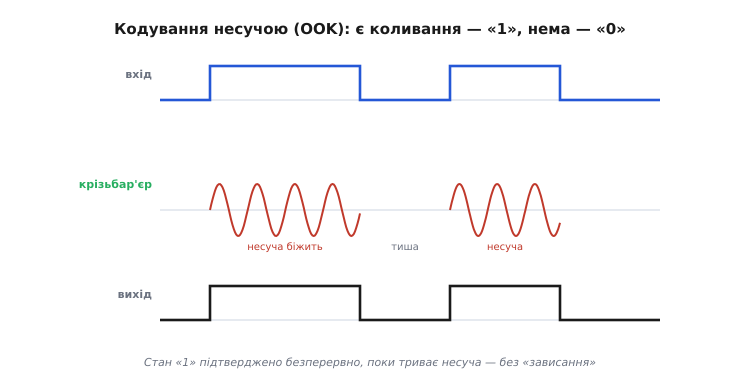
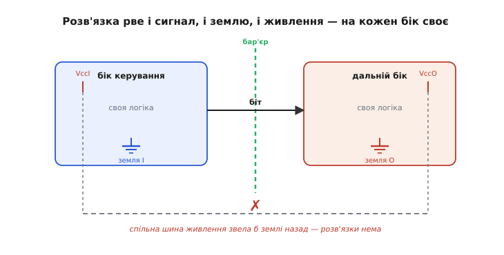

# Цифровий ізолятор

Дві частини однієї плати іноді мусять **розмовляти сигналом, але не мати спільного проводу**. Мікроконтролер керує силовим інвертором, чий «нуль» стрибає на сотні вольтів відносно землі керування; давач стоїть на моторі, який ловить розряди; лічильник живиться від мережі, а зчитувати його треба з боку, де людина торкається кнопок. У всіх цих випадках з'єднати землі навпростець не можна: або небезпечна напруга пройде туди, де її бути не повинно, або по спільному проводу піде **зрівнювальний струм** і спалить те, що з'єднав. Але логічний сигнал — «0» чи «1» — пройти має. Цифровий ізолятор (*isolator*, від латинського *insula* — «острів»: він робить два боки островами, між якими ходить лише інформація) — це мікросхема, що **переносить цифровий біт з одного боку на інший, не пропускаючи струм і не поділяючи землю**.

Слово «ізолятор» тут означає саме **гальванічну розв'язку** (*galvanic* — за прізвищем Луїджі Гальвані, чиї досліди з «тваринною електрикою» дали назву прямому струмовому зв'язку): між входом і виходом немає жодного суцільного провідника, лише бар'єр, крізь який струм не тече. І водночас біт крізь цей бар'єр проходить — за частки мікросекунди. Уся хитрість теми в тому, **як передати сигнал крізь стінку, що навмисне не проводить струм**.

## Навіщо взагалі рвати провід

Щоб зрозуміти ізолятор, треба спершу побачити, **чим шкідливий суцільний провід** між двома частинами системи. Причин рвати його дві, і вони різні за природою.

Перша — **безпека й напруга**. Один бік може працювати під потенціалом, смертельним для людини або згубним для сусідньої мікросхеми: мережеві 230 В, шина силового перетворювача, високовольтна батарея електромобіля. Якщо низьковольтна керувальна частина ділить землю з цим боком, то будь-який пробій, будь-яка несправність виведе небезпечний потенціал прямо на роз'єми, яких торкається людина, і на слабкі 3.3-вольтові мікросхеми. Розрив проводу ставить **фізичну стінку**: навіть коли на силовому боці все загорілося, керувальний бік лишається під безпечними вольтами.

Друга — **шум і різні «нулі»**. Здавалося б, земля скрізь однакова, але це ілюзія. Двоє пристроїв за кілька метрів один від одного мають землі, що відрізняються на десятки мілівольтів, а під час комутації силового ключа — і на десятки вольтів. З'єднавши їхні землі проводом, ми даємо цій різниці **гнати струм по землі** — виникає [земляна петля](book:electronics/ground-loop): паразитний контур, у якому наводки й зрівнювальні струми котяться крізь наші сигнальні кола й псують дані, а часом і залізо. Розірвавши землю, ми **прибираємо петлю**: різниця потенціалів лишається, але тепер їй нема куди текти, бо кола нема.

> 🔧 **Навіщо це.** Перш ніж ставити ізолятор, назвіть уголос, **яку саме з двох бід** ви лікуєте. Якщо це безпека (мережа, силова шина, дотик людини) — вам потрібен ізолятор із сертифікованим бар'єром на потрібну напругу, і тут економити не можна. Якщо це шум і земляна петля (давач на моторі, довга лінія між платами) — вистачить простішого «базового» ізолятора, а головне число для вас — не пробивна напруга, а стійкість до швидких стрибків (про неї нижче). Переплутати ці дві задачі означає або взяти надлишкове, або поставити те, що не рятує від головної загрози.


*Зверху: без розриву небезпечний потенціал силового боку через спільну землю виходить на керувальну частину й на людину — бар'єр ставить фізичну стінку. Знизу: різниця «нулів» двох боків жене зрівнювальний струм по спільній землі (земляна петля), наводячи шум у сигнал; розрив землі лишає різницю потенціалів, але забирає контур, і струму нема куди текти.*

## Головна складність: провести біт крізь непровідну стінку

Отже, ми **навмисне** прибрали суцільний провід. Але сигнал перейти мусить. Як передати «0» і «1» крізь щось, що струм не пропускає?

Відповідь спирається на просту фізику: **струм постійний крізь бар'єр не тече, а от зміна поля — проходить**. Два способи це зробити й лежать в основі всіх цифрових ізоляторів.

**Ємнісний зв'язок.** Постав дві пластинки одна проти одної з тонким шаром діелектрика (ізолятора) між ними — це конденсатор. Постійна напруга крізь нього не проходить: діелектрик струм не проводить. Але **швидка зміна** напруги на одній пластинці наводить струм на другій — конденсатор пропускає змінне й ріже постійне. Саме [ця властивість](book:electronics/capacitive-reactance) і є містком: різко смикнемо напругу на вхідній пластинці — на вихідній з'явиться імпульс, а постійний потенціал (у тому числі небезпечний) лишиться по свій бік бар'єра.

**Магнітний зв'язок.** Постав поряд дві крихітні котушки — це [трансформатор](book:electronics/transformer). Провода між ними нема; зв'язує їх лише магнітне поле. Пропустимо крізь першу котушку **зміну струму** — вона створить змінне магнітне поле, а те наведе напругу в другій котушці. Знову: постійне не проходить (для сталого струму трансформатор — просто два розімкнені дроти), а зміна — переноситься полем крізь ізоляційний прошарок.


*Ліворуч — ємнісний зв'язок: дві пластинки з діелектриком між ними; постійна напруга не проходить (стрілка вперта в бар'єр), швидка зміна наводить струм на другій пластинці. Праворуч — магнітний зв'язок: дві котушки без спільного проводу, змінне магнітне поле переносить сигнал крізь ізоляцію. Обидва пропускають лише зміну — і саме на цьому доведеться будувати передавання біта.*

Обидва містки мають спільну рису, з якої випливає **вся інженерія теми**: вони пропускають лише **зміну**, а не рівень. Стала «1», що просто лежить на вході, не створює ні зміни напруги на конденсаторі, ні зміни струму в котушці — а отже, **на тому боці нічого не з'являється**. Бар'єр «бачить» тільки фронти й імпульси. Тому не можна просто «покласти» логічний рівень на вхід і чекати його на виході: рівень крізь бар'єр не проходить. Треба **закодувати** біт так, щоб він жив у змінах, які бар'єр пропускає, а на тому боці — **відновити** з тих змін вихідний рівень. Це вже цифрове оброблення сигналу: кодування на вході, декодування на виході, а посередині — стінка, крізь яку ходить лише змінна складова.

## Як кодують біт: два підходи

Оскільки бар'єр пропускає тільки зміну, обидва боки ізолятора — це маленькі цифрові схеми: передавач кодує біт в імпульси, приймач декодує імпульси назад у рівень. Історично склалися два способи кодування, і кожен — прямий наслідок того, як саме зв'язані боки.

### Кодування фронтами (edge-based)

Перший спосіб придумали для **магнітного** зв'язку. Ідея проста: раз крізь бар'єр проходить тільки зміна, то й передаваймо **самі зміни** вхідного сигналу — його фронти. Коли вхід перемикається з «0» на «1» (наростання), передавач шле крізь трансформатор короткий імпульс однієї форми; коли з «1» на «0» (спадання) — імпульс іншої форми (наприклад, іншої полярності або подвійний замість одинарного). Приймач ловить ці імпульси й тримає на виході тригер: побачив імпульс-наростання — виставив «1» і тримає; побачив імпульс-спадання — виставив «0» і тримає.


*Верхній рядок — вхідний логічний сигнал. Середній — короткі імпульси, що передавач шле крізь бар'єр: одна форма на наростання, інша на спадання; між змінами крізь бар'єр не йде нічого. Нижній — вихід приймача: тригер підхоплює кожен імпульс і тримає рівень до наступного. Так рівень, який сам крізь бар'єр не проходить, відновлюється з переданих фронтів.*

Це ощадливо: енергію бар'єр витрачає лише на самих фронтах, а між ними мовчить. Але тут же вилазить **корінна вада**, яку доведеться лікувати окремо. Уяви, що вхід перейшов у «1» — передавач шле імпульс-наростання, приймач виставляє «1» і **мовчить**, бо нового фронту нема. А тепер живлення передавача на мить пропало, або сильна завада «збила» приймач. Вхід усе ще тримає «1», але приймач цього **не знає** — він чекає наступного фронту, якого може не бути секундами. Вихід «завис» на старому (можливо, хибному) рівні. Схема, що передає **лише зміни**, не має як повідомити «а зараз усе ще одиниця» — і це небезпечно.

### Кодування несучою (OOK)

Другий спосіб історично пов'язали з **ємнісним** зв'язком, і він лікує ваду першого в корені. Замість того щоб передавати рідкі імпульси на фронтах, передавач шле крізь бар'єр **безперервний високочастотний сигнал-несучу**, коли треба «1», і **мовчить**, коли треба «0». Це і є *OOK* (*on-off keying* — «вмикання-вимикання»): наявність несучої означає один стан, її відсутність — інший. Несуча — швидкі коливання (сотні мегагерц), тож ємнісний бар'єр їх пропускає легко; приймач весь час дивиться, **чи є несуча**, і виставляє «1», поки вона є, «0», поки її нема.


*Верхній рядок — вхідний рівень. Середній — те, що йде крізь бар'єр: поки на вході «1», передавач жене пакет високочастотної несучої; поки «0» — тиша. Нижній — вихід приймача, що відновлює рівень із наявності чи відсутності несучої. На відміну від кодування фронтами, стан «1» тут підтверджується безперервно, поки триває, а не одним давнім імпульсом.*

Різниця принципова. За OOK стан «1» **підтверджується весь час**, поки він триває: несуча біжить безперервно, приймач її бачить безперервно. Пропала несуча — за частки мікросекунди приймач розуміє, що «1» скінчилася. Немає «зависання» на давньому фронті. Платня — енергія: гнати несучу весь час дорожче, ніж блимнути імпульсом на зміні, тож ізолятори з OOK зазвичай споживають трохи більше, коли передають довгі «1».

Ці два способи — не жорстко прив'язані «магнітний = фронти, ємнісний = несуча»; сучасні мікросхеми змішують підходи. Важливе інше: **обидва мусять якось розв'язати проблему сталого рівня**, бо стінка пропускає лише зміну. OOK розв'язує її вбудовано (несуча = безперервне «зараз тут одиниця»); кодування фронтами доводиться **рятувати окремим механізмом** — і саме тому в таких ізоляторах з'являється «оновлення».

## Проблема сталого рівня і як її лікують

Розберімо ваду кодування фронтами до кінця, бо саме вона диктує дві важливі властивості будь-якого ізолятора — **оновлення** й **безпечний стан за замовчуванням**.

Корінь у тому, що бар'єр — це фізично **фільтр верхніх частот**: він пропускає швидке й ріже повільне й постійне. А логічний рівень, що не змінюється, — це постійна складова. Тому будь-який ізолятор мусить окремо подбати про **DC-коректність**: щоб вихід правильно тримав рівень, який на вході лежить нерухомо як завгодно довго.

**Оновлення (refresh).** Ізолятори на фронтах додають сторожа: якщо вхід довго не змінюється, передавач сам, з певним періодом, шле крізь бар'єр **службовий імпульс-нагадування** «поточний стан такий-то». Приймач, отримавши його, підтверджує рівень і **перезаводить власний таймер-сторож** (*watchdog*). Тепер логіка приймача така: доки нагадування приходять вчасно — рівень чинний; якщо за встановлений час не прийшло **нічого** (ні фронту, ні нагадування), приймач вважає, що **зв'язок утрачено**, і не тримає далі старий рівень наосліп.

**Безпечний стан за замовчуванням (fail-safe).** А що виставити на вихід, коли зв'язок таки втрачено — передавач знеструмлено, бар'єр збито тривалою завадою? Тримати останній відомий рівень небезпечно: він може бути хибним, а система на нього покладеться. Тому ізолятор має **наперед визначений безпечний стан**: за відсутності сигналу вихід іде в заздалегідь відомий рівень. Для одних мікросхем це «1», для інших — «0»; у реальних родин це **позначено окремо** (частина партномерів дає «за замовчуванням високий», частина — «за замовчуванням низький»), і вибрати треба **під свою схему**: щоб «безпечний» рівень означав саме безпечну дію — вимкнений силовий ключ, зупинений мотор, знятий дозвіл.

> 🔧 **Навіщо це.** Це не дрібниця даташита, а питання того, **що зробить ваша залізяка, коли ізолятор осліпне**. Уявіть: ізолятор веде сигнал «увімкнути силовий транзистор». Живлення передавача моргнуло. Якщо безпечний стан виходу — «увімкнено», транзистор лишиться відкритим без керування: коротке, дим. Якщо «вимкнено» — усе безпечно згасне. Тому, ставлячи ізолятор на будь-яку лінію, що керує потужністю, з'ясуйте дві речі: **який рівень він видасть, утративши зв'язок**, і чи цей рівень означає **безпечну** дію. Це саме той механізм, що робить систему передбачуваною у відмові, а не лишає її на волю випадку.

Помітно, що OOK цю проблему теж «має», але лікує її самою природою кодування: поки триває «1», несуча біжить безперервно — це і є нескінченне «оновлення», тож окремого сторожа для утримання рівня не потрібно, а безпечний стан спрацьовує просто тому, що зникла несуча читається як «0» (або як обрана відсутність-сигналу).

## Найголовніше число: стійкість до стрибків землі (CMTI)

Тепер до параметра, який у цифрового ізолятора **важливіший за все інше** й пояснює, чому його взагалі беруть замість старого рішення. Річ у тім, що два боки ізолятора живуть на **різних землях**, і ці землі можуть стрибати одна відносно одної **дуже швидко**. Коли силовий транзистор перемикається, «нуль» силового боку може за десяток наносекунд підскочити на кількасот вольтів відносно «нуля» керувального боку. Тобто весь бар'єр разом з одним своїм берегом **сіпається** відносно другого з шаленою швидкістю.

Цю швидкість міряють у **кіловольтах за мікросекунду** (кВ/мкс) — наскільки крутий стрибок різниці земель ізолятор витримає, не збрехавши на виході. Параметр звуть *CMTI* (*common-mode transient immunity* — «несприйнятливість до синфазного перепаду»): «синфазний» тут означає, що смикається не сам сигнал, а **обидва береги бар'єра разом** відносно зовнішнього світу.

Чому це складно? Бо бар'єр — конденсатор (чи трансформатор), і **різкий стрибок напруги на всьому бар'єрі сам наводить струм** крізь нього — точнісінько такий, який приймач міг би сплутати з корисним сигналом. Швидкий стрибок землі — це велика зміна напруги, а зміну бар'єр саме й пропускає. Тому погано зроблений ізолятор під час комутації силового ключа **сам собі покаже неіснуючий фронт** і видасть хибний біт. Уся майстерність — зробити приймач так, щоб він **відрізняв** корисну передачу від наведення синфазним стрибком.

**Приклад (чи витримає ізолятор комутацію).** Силовий MOSFET перемикає 400 В за 20 нс. Оцінимо швидкість стрибка землі й порівняймо з тим, що дають різні технології.

```c
// Наскільки швидко «нуль» силового боку стрибає відносно керувального
const float dV = 400.0f;      // перепад напруги на комутації, В
const float dt = 20e-9f;      // час фронту, с
float slew = dV / dt;         // = 400 / 20e-9 = 2.0e10 В/с

// переведемо у зручні кВ/мкс:
float cmti_need = slew / 1e9f;   // 2.0e10 / 1e9 = 20 кВ/мкс
// висновок: потрібен ізолятор із CMTI помітно вище 20 кВ/мкс,
// із запасом — бо реальні фронти бувають різкіші
```

Двадцять кіловольтів за мікросекунду — і це ще спокійний випадок. Ось де цифровий ізолятор **виграє в старого способу**: типовий [оптрон](book:electronics/optocoupler) (розв'язка через світло: світлодіод + фотоприймач) тримає лише 1…10 кВ/мкс, бо його приймач-фототранзистор повільний і легко «засвічується» наведенням. Магнітні цифрові ізолятори витримують понад 35 кВ/мкс, ємнісні — понад 150 кВ/мкс. Саме тому в силовій електроніці, де землі стрибають найлютіше, оптрон дедалі частіше поступається цифровому ізолятору: не через моду, а тому що **фізично тримає стрибок**, який оптрон уже не тримає.

## Чому цей клас витіснив оптрон

Варто прямо порівняти цифровий ізолятор із його попередником — [оптроном](book:electronics/optocoupler) (*opto-* від грецького *optós* — «видимий»; розв'язка через промінь світла). Оптрон робить ту саму роботу зовсім іншим містком: усередині світлодіод світить крізь прозорий ізоляційний шар на фотоприймач, і струм крізь бар'єр не тече — його переносить **світло**. Ідея гарна й десятиліттями була стандартом, але має вроджені слабини, з яких і виріс цифровий ізолятор.

Головна слабина оптрона — **світлодіод старіє**. Його світловіддача з роками падає (кристал деградує від струму й тепла), тож відношення вихідного струму до вхідного (*CTR*, *current transfer ratio*) з часом зменшується. Схему доводиться **проєктувати із запасом** на десятиліття наперед — гнати крізь світлодіод більший струм, ніж треба сьогодні, щоб через двадцять років, коли він потьмяніє, сигналу ще вистачало. Цей запас коштує струму, тепла й місця. У цифрового ізолятора переносить сигнал не світлодіод, а стійкий електромагнітний зв'язок крізь бар'єр — старіти нічому, тож **від виробу до виробу поведінка однакова й у часі стабільна**, без наперед закладеного надлишку.

До старіння додаються швидкість (оптрон повільніший — фотоприймач має інерцію), споживання (світити струмом дорого), і вже названа **вразливість до стрибків землі** (низький CMTI). Разом це й пояснює, чому нові розробки в живленні, промисловій автоматиці та інтерфейсах дедалі частіше беруть цифровий ізолятор. Оптрон не зник — там, де швидкість і стрибки не критичні, він живий і дешевий, — але **як стандарт** його місце заступає цифрова розв'язка.

> 🔧 **Навіщо це.** Коли на старій схемі бачите оптрон на швидкій цифровій лінії (наприклад, на інтерфейсі зв'язку чи в керуванні затвором) — це часто перше, що варто замінити цифровим ізолятором: отримаєте вищу швидкість, стійкість до стрибків землі й позбудетеся розрахунку «на старіння світлодіода». Але **не міняйте наосліп**: перевірте, чи стара схема не покладалася на аналогову лінійність оптрона (у деяких зворотних зв'язках по напрузі оптрон працює як плавний елемент, а не як «0/1») — там цифрова заміна не підійде без переробки. Цифровий ізолятор — це саме **цифровий** місток: він передає біти, а не плавну величину.

## Живлення двох островів і де це стоїть

Лишається питання, яке новачки часто пропускають, а воно ламає більше схем, ніж будь-що інше. Ізолятор **розриває землю навмисне** — отже, кожен його бік потребує **свого живлення**, і ці два живлення теж мусять бути розв'язані. Вхідний бік живиться від землі керування, вихідний — від землі того, з ким говорить (силового боку, віддаленого давача). Дати обом бокам одну шину живлення означало б **звести землі назад тим самим проводом живлення** — і вся розв'язка нанівець.


*Ізолятор має по власному живленню й власній землі з кожного боку бар'єра. Сигнал переходить крізь бар'єр, а землі й шини живлення двох боків лишаються незалежними. Спільна шина живлення (пунктир) звела б землі назад і знищила б розв'язку — тому вихідний бік живлять окремо: ізольованим перетворювачем або власним джерелом на дальньому боці.*

Тому поряд з ізолятором майже завжди стоїть **ізольоване джерело живлення** для дальнього боку — маленький перетворювач, що бере енергію з боку керування й віддає її на бік давача, теж крізь бар'єр (частіше трансформаторний), не з'єднуючи землі. Іноді дальній бік має власне живлення (наприклад, давач на моторі живиться там локально) — тоді окреме джерело не потрібне. Але **питання живлення двох островів треба вирішити завжди**, інакше ізолятор стоїть, а розв'язки немає.

Живе цей клас там, де два світи мусять говорити, не поділяючи землі. Найтиповіші місця: **керування затвором** силового транзистора (низьковольтна логіка командує ключем, чий виток скаче на сотні вольтів); **інтерфейси зв'язку**, що йдуть між приладами з різними землями (промислові лінії, де кожен вузол має свій «нуль» і довгі кабелі ловлять наводки); **давачі струму й напруги** на силовому боці, чиї покази треба безпечно завести в керування; **мережеві лічильники й прилади**, де вимірювальна частина під мережею, а індикація й кнопки — під рукою людини. Скрізь тут ізолятор робить ту саму вузьку й чесну роботу: **пропустити біт, не пропустивши струм**.

Варто тримати в голові й межу теми. Цифровий ізолятор переносить **цифровий сигнал** — біти, логічні рівні, а часто ще й тактові чи керувальні лінії кількома каналами в одному корпусі. Він **не передає плавну аналогову величину** (для цього потрібні ізольовані підсилювачі або спершу оцифрувати сигнал на дальньому боці) і **не живить** дальній бік як силове джерело — його справа лише інформація. Усе інше — кодування, оновлення, безпечний стан, стійкість до стрибків — це деталі того, **як** саме він проводить біт крізь стінку, що навмисне не проводить струм.

---

Підсумок: цифровий ізолятор — це мікросхема, що **переносить біт з одного боку на інший, не пропускаючи струм і не поділяючи землю** (гальванічна розв'язка). Рвуть провід із двох причин: **безпека** (небезпечний потенціал не має вийти на людину чи слабку логіку) і **шум** (спільна земля дає земляну петлю зі зрівнювальним струмом). Головна складність — бар'єр пропускає **лише зміну**, а не сталий рівень: він фізично фільтр верхніх частот. Тому біт **кодують** у зміни — фронтами (імпульс на кожен перехід, магнітний зв'язок) або несучою OOK (є коливання — «1», нема — «0», ємнісний зв'язок) — і **декодують** на виході. Стала «1» крізь стінку не проходить, тож потрібні **оновлення** (службові нагадування + сторож-таймер) і **безпечний стан за замовчуванням** на випадок утрати зв'язку. Найважливіше число — **CMTI**, стійкість до швидких стрибків різниці земель (кВ/мкс): тут цифровий ізолятор (35…150+ кВ/мкс) лишає позаду оптрон (1…10 кВ/мкс), бо той старіє світлодіодом і легко «засвічується» наведенням. І завжди пам'ятай про **два живлення**: кожен острів живиться окремо, інакше спільна шина зведе землі назад і знищить розв'язку.

---
