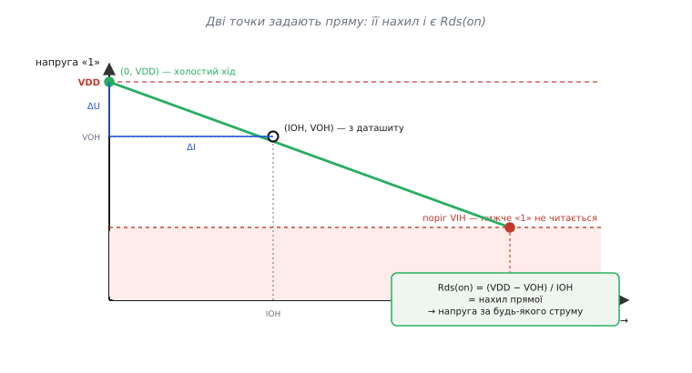
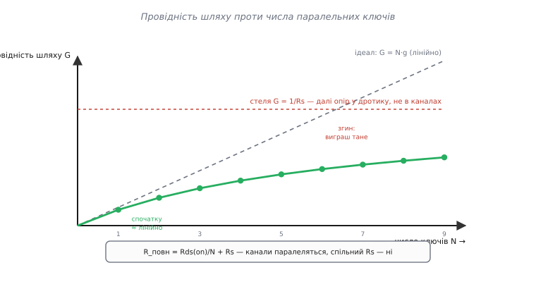
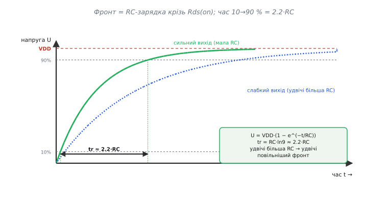

# 🧮 Просідання рівня, поділ струму й бюджет фронту: три формули з одного опору

Уся арифметика сили виходу тримається на одному-єдиному факті: відкритий вихідний транзистор — це резистор. Не метафора, не «приблизно резистор», а цілком конкретний опір **Rds(on)**, увімкнений послідовно між шиною живлення й ніжкою. Прийми це — і три різні на вигляд питання («на скільки просяде рівень?», «що дасть пара запаралелених виходів?», «як швидко наростає фронт?») виявляються трьома проєкціями одного й того самого числа. Тут ми виведемо кожну формулу від першопричини, а не подамо готовою, і покажемо, де кожна ламається — бо саме на зламах ховаються реальні помилки проєктування.

## Означення: опір як нахил, а не як окреме число

Спершу домовмося, що взагалі означає «опір відкритого каналу». У шкільному законі Ома опір — це стала: скільки не подавай напруги, відношення U/I однакове. Транзистор так поводиться лише в певному кутку своєї характеристики — у так званій **триодній** (або омічній) ділянці, коли напруга стік-витік мала. Саме там виробник і гарантує роботу цифрового виходу, тому для наших потреб канал справді поводиться як лінійний резистор. Але означати цей опір зручно не через одну точку, а через **нахил** прямої «напруга на ніжці проти струму».

Ось чому. Реальний вихід — це джерело напруги VDD із послідовним опором Rds(on). Напруга, яку бачить навантаження, спадає лінійно зі струмом:

```
U = VDD − I · Rds(on)
```

Це рівняння прямої: вільний член — VDD (напруга без навантаження, коли струму немає), а нахил — саме −Rds(on). Тобто опір каналу — це **крутість** цієї прямої: на скільки вольт просідає ніжка на кожен додатковий міліампер відібраного струму. Означивши опір як нахил, ми одразу дістаємо спосіб його виміряти: візьми дві точки прямої й поділи різницю напруг на різницю струмів.

> 🔧 **Навіщо це.** Даташит майже ніколи не пише «Rds(on) = стільки-то ом» для цифрового виходу — він дає точку на прямій: напругу VOH за конкретного струму IOH. Уміти перетворити ту точку на нахил означає вміти передбачити просідання за **будь-якого** свого струму, а не лише за тестового. Без цього ти прикутий до єдиного числа, яке інженер даташита обрав для зручності вимірювання, а не для твого застосування.

## Інтуїція: чому лінія, а не крива

Перш ніж рахувати, варто відчути, чому просідання саме лінійне. Уяви воду: помпа (живлення) жене потік крізь вузьку трубу (канал) до крана (навантаження). Що вужча труба, то більший перепад тиску на ній за того самого потоку — і то менше тиску лишається крану. Перепад на трубі пропорційний потоку: подвоїв витрату — подвоїв втрату тиску. Точнісінько так падіння на Rds(on) пропорційне струму. Це і є закон Ома в дії: напруга на резисторі = струм × опір, лінійно.

Аналогія точна рівно доти, доки труба поводиться як труба. Вона ламається, коли струм такий великий, що канал виходить із омічної ділянки й «затискається» (переходить у насичення) — там струм уже майже не залежить від напруги, і модель «постійний опір» бреше. Але цифровий вихід у робочому режимі туди не заходить: якби заходив, рівень «одиниці» був би вже давно втрачений і сперечатися про точну форму кривої не мало б сенсу. Тож у корисному діапазоні пряма — це не спрощення, а правда.

## Формальний апарат: як дістати Rds(on) з пари VOH/IOH

Тепер сам розрахунок. У розділі DC-характеристик даташита стоїть гарантія на «одиницю»: напруга виходу VOH за струму навантаження IOH. Читається вона як обіцянка: «поки ти не тягнеш більше за IOH, напруга не впаде нижче за VOH». Це одна точка на нашій прямій. Друга точка відома задарма: за нульового струму ніжка сидить на VDD (падати немає на чому). Дві точки — і нахил визначено:

```
Rds(on) = (VDD − VOH) / IOH
```

Це і є еквівалентний опір верхнього ключа. Подивись, звідки він узявся: (VDD − VOH) — це те, скільки вже просіла ніжка при струмі IOH, а поділивши просідання на струм, дістаємо «вольтів просідання на ампер» — тобто оми.

**Приклад: RP2040 на найсильнішому виході.** Даташит RP2040 для живлення 3.3 В на максимальному щаблі сили (12 мА) гарантує VOH не нижче за 2.62 В. Скільки це в омах?

```
VDD  = 3.30 В
VOH  = 2.62 В    (мінімум за даташитом)
IOH  = 12 мА     = 0.012 А

Rds(on) = (3.30 − 2.62) / 0.012
        = 0.68 / 0.012
        ≈ 57 Ом
```

Отже, верхній ключ RP2040 на цьому щаблі — це десь 57-омний резистор. (Числа з даташиту RP2040, розділ «Interpreting GPIO output voltage specifications»; статус: усталено.) Тепер ми не прив'язані до єдиної точки. Хочеш знати напругу за свого струму, скажімо 6 мА? Підстав опір назад у пряму:

```
U = 3.30 − 0.006 · 57
  = 3.30 − 0.34
  = 2.96 В
```

За вдвічі меншого струму просідання вдвічі менше — рівно як велить лінійність. А тепер обернене, куди корисніше питання: скільки струму можна взяти, поки «одиниця» ще читається приймачем? Приймач читає одиницю, поки напруга вище за свій поріг VIH. Прирівнюємо просілу напругу до порога й розв'язуємо відносно струму:

```
VIH = VDD − I · Rds(on)
  ⇒  I = (VDD − VIH) / Rds(on)
```

Хай приймач — звичайний CMOS-вхід від 3.3 В із порогом VIH = 2.0 В:

```
I_макс = (3.30 − 2.00) / 57
       = 1.30 / 57
       ≈ 23 мА
```

Тобто фізично ніжка втримає одиницю над порогом аж до ~23 мА — але гарантію даташит дає лише до 12 мА. Різниця між цими числами — і є та сіра зона, де все ще працює, та вже без обіцянок; серйозна розробка в неї не заходить.



*Дві відомі точки — холостий хід (0, VDD) і даташитна (IOH, VOH) — цілком задають пряму; її нахил і є еквівалентний опір каналу, а перетин із порогом дає межу читабельної одиниці.*

Той самий рецепт працює для нуля, лише дзеркально. Нижній ключ садить ніжку на землю крізь свій опір, і напруга нуля **піднімається** над землею зі струмом, що втікає в ніжку:

```
U_нуля = 0 + I · Rds(on)_low
Rds(on)_low = VOL / IOL
```

Наприклад, «VOL = 0.4 В при IOL = 8 мА» дає Rds(on)_low = 0.4 / 0.008 = 50 Ом. Симетрія тут не гарантована: у багатьох виходів верхнє й нижнє плече мають різний опір (діркова провідність pMOS зазвичай слабша за електронну nMOS того ж розміру), тож не переноси число з одного плеча на друге — читай обидві пари з даташита окремо.

> 🔧 **Навіщо це.** Найчастіша практична задача — «скільки світлодіодів/входів повісити на ніжку, поки рівень тримається». Вона розв'язується саме цією формулою: береш свій сумарний струм, множиш на Rds(on), дивишся, чи лишок над порогом додатний і з запасом. Усе інше — деталі. А ще: коли на платі «одиниця» несподівано читається як 2.9 В замість 3.3 В, ти тепер бачиш не поломку, а закон Ома — просто хтось тягне з ніжки більше струму, ніж думав.

## Поділ струму між паралельними виходами: провідності додаються

Тепер друге питання. Що, як одна ніжка не тягне — з'єднати кілька виходів того самого порту паралельно й хай тягнуть гуртом? Ідея правильна, але рахувати її треба через **провідність**, а не через опір, інакше легко наламати дров.

Провідність (англ. *conductance*) — це просто обернений опір, G = 1/R, і вимірюється в сименсах (См). Фізично вона каже, скільки струму пройде на кожен вольт: більша провідність — жирніший шлях. Ключове її свято — паралельне з'єднання. Коли два резистори стоять пліч-о-пліч між тими самими двома вузлами, той самий перепад напруги жене струм крізь обидва, і струми **додаються**. А струм-на-вольт — це і є провідність, тож провідності просто складаються:

```
G_заг = G₁ + G₂ + … + G_N
```

Для N однакових виходів, кожен із провідністю g = 1/Rds(on), сума очевидна:

```
G_заг = N · g = N / Rds(on)
  ⇒  R_заг = Rds(on) / N
```

Ось чому в чипі керовану силу роблять саме набором однакових транзисторів паралельно: увімкнув удвічі більше — дістав удвічі меншу опірність і, за тієї самої напруги просідання, удвічі більший струм. Обернене прочитання того самого: щоб просідання лишалося колишнім, N паралельних виходів можуть віддати в N разів більший сумарний струм.

**Приклад: три ніжки по 57 Ом паралельно.** Візьмемо три однакові виходи RP2040, кожен ~57 Ом, з'єднані на одну лінію:

```
R_заг = 57 / 3 ≈ 19 Ом
```

За того самого струму просідання втричі менше; або, тримаючи те саме допустиме просідання (VDD − VIH = 1.30 В), сумарний струм зростає втричі:

```
I_заг = 1.30 / 19 ≈ 68 мА     (проти ~23 мА з однієї ніжки)
```

Виглядає як безплатне потроєння сили. І тут ховається пастка.

## Чому паралель не масштабує лінійно на межі

Формула R_заг = Rds(on)/N обіцяє: досить увімкнути достатньо ключів — і опір впаде як завгодно низько, а струм зросте як завгодно високо. У житті цього не буває, і причина знову в тому, що додається саме провідність.

Жоден вихід не з'єднаний із зовнішнім світом самим лише каналом транзистора. Між кристалом і ніжкою корпусу стоїть **спільний послідовний опір**, якого паралель не прибирає: тонка металізація розводки на кристалі, зварний дротик (англ. *bond wire*) до виводу, сам вивід, доріжка на платі до спільного вузла. Позначмо цей неусувний послідовний шматок Rs. Тоді повний опір шляху — це паралель каналів **плюс** те, що стоїть послідовно з усіма ними:

```
R_повн = Rds(on) / N + Rs
```

Дивись, що робить кожен доданок. Перший, Rds(on)/N, слухняно падає, коли N росте, — це паралель каналів. А другий, Rs, не залежить від N зовсім: він однаковий і для одного ключа, і для сотні, бо струм усіх плечей врешті зливається в один спільний провід і тече крізь Rs гуртом. Тому провідність усього шляху впирається в стелю:

```
N → великий:  Rds(on)/N → 0,   R_повн → Rs
```

Скільки ключів не додавай, нижче за Rs опір не впаде. Перші кілька паралельних виходів дають майже лінійний виграш (поки Rds(on)/N ще більший за Rs), а далі кожен наступний додає дедалі менше, і зрештою ти впираєшся в дротик та розводку, а не в канали.

Є й другий, підступніший бік «нелінійності на межі» — **нерівність плечей**. Формула N·g припускає, що всі виходи однакові й ділять струм порівну. Насправді пороги ввімкнення й опори каналів трохи різняться від ніжки до ніжки (розкид виробництва), а доріжки до спільного вузла мають різну довжину. Хто має менший опір шляху — той бере на себе більший струм. У межі найсильніша ніжка гріється й просідає першою, і гурт віддає менше, ніж наївне N × (струм однієї). Тому паралелити виходи можна, але без ілюзій щодо рівного поділу, і бажано короткими симетричними доріжками до спільної точки.



*Спочатку кожен доданий ключ додає провідності майже стільки ж, скільки й попередній; коли Rds(on)/N спадає до рівня спільного Rs, крива згинається — неусувний послідовний опір стає стелею.*

> 🔧 **Навіщо це.** Це рятує від двох типових розчарувань. Перше: «запаралелив чотири ніжки, а струм виріс лише вдвічі» — бо вперся в bond wire, і це не полагодити ще однією ніжкою. Друге: «запаралелив, а одна з ніжок гріється дужче за інших» — нерівний поділ через розкид і асиметрію доріжок. Знаючи стелю Rs, ти заздалегідь бачиш, скільки виходів має сенс єднати, а коли час брати зовнішній транзистор чи буфер, який тягне навантаження одним жирним каналом без цих ігор.

## Бюджет фронту: той самий опір керує швидкістю

Досі йшлося про статику — сталий рівень під сталим струмом. Але той самий Rds(on) командує й **динамікою**: як швидко ніжка перемикається. Механізм інший, а число те саме, і в цьому вся краса.

Будь-яке навантаження виходу має ємність: затвор наступної мікросхеми, доріжка на платі, кабель, вхідні лапки приймачів. Ємність (англ. *capacitance*) — це «відро» для заряду: щоб підняти на ній напругу, у неї треба **налити заряд**, а заряд несе струм. Зв'язок жорсткий і виводиться з самого означення ємності C = Q/U: продиференціювавши за часом (ємність стала), маємо

```
I = C · (dU/dt)
```

Читай праворуч наліво: щоб змінювати напругу на ємності зі швидкістю dU/dt, треба гнати в неї струм I = C·(dU/dt). Хочеш крутий фронт (велика dU/dt) на великій ємності — потрібен великий струм. А струм обмежений опором ключа: коли вихід перемикається з нуля на VDD, він заряджає ємність не миттєво, а крізь свій Rds(on). І це вже класична RC-зарядка.

Щоб побачити її форму, з'єднаймо два рівняння. Струм крізь опір під час зарядки — це різниця «куди хочемо» й «де зараз», поділена на опір: I = (VDD − U)/R. Прирівнявши до ємнісного I = C·(dU/dt), дістаємо рівняння, у якому швидкість зміни напруги тим менша, чим ближче U підповзло до VDD:

```
C · (dU/dt) = (VDD − U) / R
```

Розв'язок — знайомий наростальний експонент: напруга підходить до VDD, спершу швидко, потім усе повільніше, ніби гальмуючи перед стіною:

```
U(t) = VDD · (1 − e^(−t / RC))
```

Добуток RC тут — **стала часу** τ: за один τ ємність долає 63 % шляху до цілі, за три τ — 95 %, за п'ять τ — 99 %. Ця експонента й ці відсотки — не властивість саме виходу, а універсальна поведінка [сталої RC](topic:electronics/rc-time-constant): будь-яка ємність, що заряджається крізь опір, підходить до цілі за тим самим законом, і τ = R·C — єдина мірка її швидкості. Але коли говорять про «час наростання фронту», зазвичай мають на увазі конкретніше — час від 10 % до 90 % розмаху, бо саме цю ділянку видно на екрані й саме вона визначає, коли сигнал «уже перемкнувся». Дістати цей час — чиста алгебра: знайти, коли U сягає 0.1·VDD і коли 0.9·VDD, і відняти.

## Звідки береться множник 2.2

Виведімо його явно, бо це той рідкісний випадок, коли «магічна константа» з підручника народжується на очах за два рядки. Питаємо: у який момент t напруга становить частку p від повного розмаху? Ставимо U(t) = p·VDD у розв'язок і скорочуємо VDD:

```
p = 1 − e^(−t/RC)
  ⇒  e^(−t/RC) = 1 − p
  ⇒  t = −RC · ln(1 − p)
```

Тепер підставляємо дві потрібні частки. Для рівня 90 %:

```
t₉₀ = −RC · ln(1 − 0.9) = −RC · ln(0.1) = RC · ln(10) ≈ 2.3026 · RC
```

Для рівня 10 %:

```
t₁₀ = −RC · ln(1 − 0.1) = −RC · ln(0.9) ≈ 0.1054 · RC
```

Час наростання — різниця цих двох:

```
t_r = t₉₀ − t₁₀ = RC · (ln 10 − ln(1/0.9))
    = RC · ln(0.9 / 0.1)
    = RC · ln(9)
    ≈ 2.197 · RC
    ≈ 2.2 · RC
```

Ось і весь секрет: 2.2 — це просто ln(9), натуральний логарифм дев'ятки, і жодної магії. Він з'являється щоразу, коли міряють фронт по рівнях 10–90 % на будь-якій RC-зарядці, тому й зашитий у формули так часто, що його вже приймають за аксіому. Підставивши R = Rds(on), маємо готовий бюджет фронту виходу на ємнісне навантаження:

```
t_r ≈ 2.2 · Rds(on) · C
```

**Приклад: сильний вихід жене доріжку з кількома входами.** Хай наш вихід має Rds(on) ≈ 57 Ом і навантажений на доріжку та три CMOS-входи. Типовий вхід 74HC-логіки має ємність близько 3.5 пФ; доріжка середньої довжини на платі додає ще десяток-другий пікофарад. Складімо реалістичну оцінку:

```
3 входи × 3.5 пФ    = 10.5 пФ
доріжка ~10 см       ≈ 13 пФ      (≈ 1.3 пФ/см для FR4-мікросмужки)
------------------------------------
C_заг                ≈ 24 пФ
```

(Значення ємностей — типові з даташитів 74HC та практики розводки FR4; статус: усталено як порядок величини, конкретне число залежить від геометрії.) Час наростання:

```
t_r ≈ 2.2 · 57 · 24·10⁻¹²
    = 2.2 · 57 · 24  пс
    ≈ 3010 пс
    ≈ 3.0 нс
```

Три наносекунди. Прикинемо, що це означає для швидкості: фронт у 3 нс комфортно передає біти з періодом хоча б у кілька разів довшим, тобто десятки мегабіт на секунду — з запасом. А тепер підстав слабкий вихід, скажімо 2 мА замість 12: його Rds(on) приблизно вшестеро більший (~340 Ом), і час наростання так само вшестеро довший — близько 18 нс. Ось чому на швидкій шині слабкий вихід «не встигає»: не тому, що бракує напруги, а тому, що RC-стала його зарядки перевищує час, відведений на біт.



*Фронт — це RC-зарядка ємності крізь опір каналу; час 10→90 % дорівнює 2.2·RC незалежно від масштабу, тож удвічі більший опір дає рівно вдвічі повільніший фронт.*

Зверни увагу, як три формули змикаються в одну картину. Той самий Rds(on), що визначає статичне просідання U = VDD − I·Rds(on), стоїть і в бюджеті фронту t_r ≈ 2.2·Rds(on)·C. Зменшив опір (увімкнув більше паралельних ключів — R_заг = Rds(on)/N) — і рівень тримається твердіше, **і** фронт стає крутіший, обидва заразом, бо обидва живляться з того самого струму, що його пропускає канал. У цьому й полягає єдність усієї теми: сила виходу — це керування одним опором, а всі спостережні наслідки (просідання, поділ струму, швидкість) — його різні тіні.

> 🔧 **Навіщо це.** Формула t_r ≈ 2.2·Rds(on)·C — це кишеньковий калькулятор придатності виходу до швидкості. Перш ніж розводити швидку лінію, множиш опір потрібного щабля сили на очікувану ємність, множиш на 2.2 і дивишся, чи вкладається фронт у бюджет біта. Якщо ні — або підіймаєш силу (менший опір), або вкорочуєш лінію (менша ємність). А ще ця сама формула застерігає від надлишку: надто малий опір дає надто крутий фронт, а крутий фронт — це викид, дзвін і завади. Правильна сила — та, що дає фронт **достатньо** швидкий, і ні на щабель швидший.

## Де ця математика працює в темі

Зведімо докупи. З пари VOH/IOH (і дзеркально VOL/IOL) даташита ти дістаєш еквівалентний опір каналу як (VDD − VOH)/IOH — нахил прямої просідання, а не просто число. Цим опором ти передбачаєш напругу за будь-якого свого струму й межу читабельної одиниці. Запаралеливши N виходів, ти складаєш їхні провідності (R_заг = Rds(on)/N), але пам'ятаєш про неусувний послідовний опір розводки й дротика, який ставить стелю виграшу й ламає лінійність на межі. А той самий опір, помножений на ємність навантаження й на ln(9) ≈ 2.2, дає час наростання фронту — динамічний бік тієї самої сили. Три формули, один опір: усе, що робить сила виходу, — це рухає це єдине число, а решта тільки рахує його наслідки.
