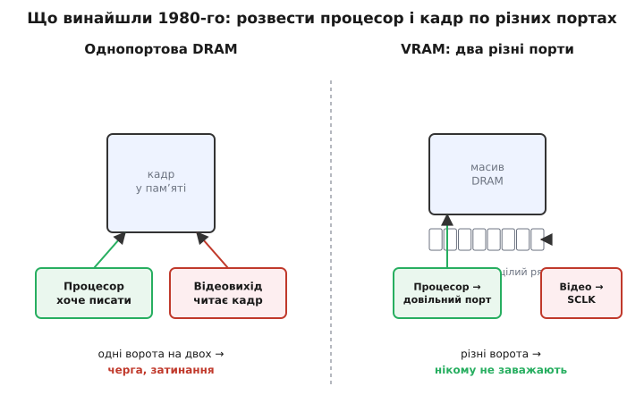

# 📜 Відеопам'ять: як екран навчився не красти такти в процесора

Уся ця історія починається з прикрого відкриття, яке зробили інженери перших графічних машин: **показати картинку на екрані — означає зупинити обчислення**. Не сповільнити, а буквально зупинити. І щоб зрозуміти, чому відеопам'ять узагалі довелося винаходити, треба спершу пережити цей біль так, як його переживали на початку 1970-х.

Візьмімо машину, з якої, по суті, почалася вся сучасна графіка, — **Xerox Alto**, зібраний 1973 року в дослідному центрі Xerox PARC. Це перший комп'ютер із растровим екраном, де кожен піксель — окремий біт у звичайній пам'яті; звідти пішли вікна, миша, шрифти на екрані. Але влаштований Alto був майже жорстоко просто. Окремого «відеоконтролера» в сучасному сенсі там не було: увесь кадр лежав у тій самій оперативній пам'яті, що й програми, а на екран його виштовхував **мікрокод самого процесора**. Апаратура дисплея зводилася до крихітного 16-бітного зсувного регістра. Мікропрограма брала з пам'яті чергове 16-бітне слово, вантажила його в цей регістр, і регістр видавав біти по одному, засвічуючи чи гасячи пікселі рядка. Тридцять разів на секунду процесор мусив пройти так **увесь** екран — 606 на 808 точок.

Наслідок був нещадний: поки триває вивід кадру, **процесор не виконує вашу програму**. Він зайнятий тим, що перекладає пікселі з пам'яті в зсувний регістр. Люди, які пізніше рахували обчислення Мандельброта на відреставрованому Alto, з подивом виявили, що левову частку часу машина витрачає не на математику, а на те, щоб просто *тримати картинку на екрані*. Вивід зображення з'їдав такти, яких не вистачало на власне роботу.

> 🔧 **Навіщо це.** Тут у чистому вигляді видно проблему, заради якої й народилася відеопам'ять, — і той самий конфлікт ви зустрінете в будь-якому пристрої з екраном, який робите сьогодні. Мікроконтролер хоче малювати інтерфейс — писати пікселі туди-сюди. А екран водночас треба **безперервно** оновлювати з тієї самої пам'яті, інакше картинка згасне чи «попливе». Двоє тягнуться до одних даних, і хтось мусить чекати. Історія VRAM — це історія одного дуже вдалого способу зробити так, щоб не чекав ніхто.

## Чому одного порту фізично не вистачає

Мікрокод, що краде такти, — то ще напівбіда епохи Alto. Справжня стіна виросла трохи згодом, коли екрани стали більшими, кольоровими, і кадр почав важити стільки, що на його безперервне зчитування вже не лишалося пропускної здатності пам'яті. Порахуймо цю стіну прямо, бо саме арифметика й пояснює, чому звичайна пам'ять з одним портом приречена.

Растровий екран треба перемальовувати повністю десятки разів на секунду — інакше око бачить мерехтіння. Кожне таке перемальовування — це прочитати **весь** кадр із пам'яті. Візьмімо роздільність, яку невдовзі зробить стандартною графіка робочих станцій: 1024 на 768 точок, вісім бітів (один байт) на піксель для 256 кольорів, оновлення 60 разів на секунду.

```
байтів у кадрі = 1024 · 768 · 1 = 786 432 ≈ 0.79 МБ
потік на екран = 786 432 · 60 ≈ 47 200 000 байт/с ≈ 47 МБ/с
```

Сорок сім мегабайтів щосекунди — і це лише щоб **тримати** зображення, ще нічого не малюючи. А тепер погляньмо, на що здатна пам'ять тих років. Динамічна пам'ять (DRAM) початку 1980-х мала повний цикл звернення близько 200–375 наносекунд. Візьмімо оптимістичні 200 нс:

```
одне звернення = 200 нс = 200 · 10⁻⁹ с
звернень за секунду = 1 / (200 · 10⁻⁹) = 5 000 000 = 5 млн/с
```

П'ять мільйонів звернень на секунду. Якщо кожне віддає одне слово, то навіть на найшвидшій тодішній DRAM самé зчитування кадру з'їдає **майже всю** пропускну здатність мікросхеми — а процесорові, щоб щось намалювати, лишаються крихти між рядками. Двоє — відеовихід і процесор — б'ються за той самий-єдиний комплект виводів пам'яті, і в кожну мить ним володіє лише хтось один.


*Суть проблеми й суть винаходу поруч. Одні ворота на двох — і безупинне зчитування кадру душить процесор. Розв'язок 1980-го: лишити процесорові звичайний порт довільного доступу, а для відео прибудувати окремий послідовний порт, у який цілий рядок перекидається одним махом і біжить назовні під тактом зсуву.*

Можна, звісно, зробити пам'ять **насправді** двопортовою — з двома повними комплектами адресних і даних виводів, як у двопортовій статичній пам'яті. Тоді процесор і відео мали б кожен свої ворота. Але для великих кадрів це надто дорого: така пам'ять малоємна й коштує втридорога, бо кожна комірка розростається на другий комплект транзисторів доступу. Будувати з неї цілий кадровий буфер на мегабайт — розкіш, доступна хіба найдорожчим робочим станціям. Потрібне було щось хитріше — і саме тут з'являється головна ідея цієї історії.

## Осяяння 1980 року: порти не мусять бути однакові

Ключ, який відчинив двері, — думка проста й тому геніальна. **Процесорові й відеовиходу потрібне зовсім різне, тож і порти їм потрібні різні.**

Придивімося, чого хоче кожен. Процесор працює з екраном **вибірково й безладно**: домалював курсор тут, оновив літеру там, перефарбував кнопку в куті. Йому потрібен **довільний доступ** — здатність будь-якої миті сягнути будь-якої комірки. А відеовихід читає кадр **суцільно й у строгому порядку**: рядок за рядком, зліва направо, згори вниз, без пропусків, безкінечно по колу. Йому довільність не потрібна взагалі — потрібен рівний, швидкий, передбачуваний **потік**.

Отут і криється розв'язок. Якщо одному потрібен випадковий доступ, а іншому — послідовний потік, навіщо давати обом однакові ворота? Лишімо процесорові звичайний порт довільного доступу, як у будь-якій DRAM. А для відео прибудуймо **окремий послідовний порт**: довгий зсувний регістр збоку від масиву, у який **цілий рядок пам'яті перекидається за один-єдиний внутрішній цикл**, а тоді видається назовні біт за бітом (точніше, слово за словом) під власний тактовий сигнал — його назвали **тактом зсуву**, SCLK (англ. *shift clock*).

Гляньмо, як це працює в парі. Відеоконтролер зрідка каже мікросхемі: «перекинь мені такий-то рядок у зсувний регістр» — і та за один внутрішній такт копіює туди весь рядок (сотні бітів разом). Далі контролер просто цокає SCLK, і рядок витікає з регістра назовні, піксель за пікселем, годуючи екран. **Увесь цей час масив DRAM вільний** — послідовний порт живиться зі свого зсувного регістра й до масиву не звертається. А процесор тим часом крізь свій довільний порт спокійно порядкує в пам'яті: малює, стирає, оновлює. Двоє більше не б'ються за одні ворота, бо кожен ходить своїми. Масив турбують лише зрідка — коли треба перезарядити зсувний регістр наступним рядком (а це раз на цілий рядок пікселів, тобто в сотні разів рідше, ніж читати кожен піксель окремо).

Асиметрія — і є вся суть. Не два рівні вікна, а одне «робоче» для безладного доступу процесора й одне «конвеєрне» для потоку, що біжить майже сам по собі. За рахунок цього те саме зчитування кадру, яке душило однопортову пам'ять, тепер майже не чіпає масиву — і пропускна здатність, яку ми щойно рахували, звільняється для малювання.

## Хто, де і коли

Цю ідею народили 1980 року в **дослідному центрі IBM** (IBM Research, Йорктаун-Гайтс, штат Нью-Йорк) троє інженерів: **Фредерік Ділл** (англ. Frederick H. Dill), **Деніел Лінг** (англ. Daniel T. Ling) і **Річард Метік** (англ. Richard E. Matick). Останній — відомий фахівець зі схемотехніки пам'яті, автор класичних праць про пам'ять комп'ютерів; саме за його підписом виходили тодішні статті IBM про цю архітектуру.

Задокументовано винахід двічі, і варто розрізняти ці два сліди, бо вони фіксують різні речі.

**Патент.** Заявку на патент США подано **30 червня 1982 року**, а видано патент **10 вересня 1985 року** під номером **US 4 541 075**, з промовистою назвою «Random access memory having a second input/output port» — «Пам'ять довільного доступу з другим портом вводу-виводу». Власник — корпорація IBM, винахідники — ті самі троє. Патент точно описує механізм, який ми щойно розібрали: внутрішній рядковий буфер-регістр, під'єднаний до підсилювачів зчитування, і **окремий керувальний сигнал «READ/TRANSFER»**, за яким цілий рядок за один цикл RAS (за одне звернення до масиву) перекидається в цей буфер, а звідти незалежно від основного порту витікає через другий вихід.

**Стаття.** Паралельно, 1984 року, у фаховому журналі IBM (IBM Journal of Research and Development, том 28, № 4, липень 1984, с. 379–393) вийшла праця «All points addressable raster display memory» — «Пам'ять для повністю адресованого растрового дисплея». Її підписали чотири прізвища: R. Matick, D. Ling, S. Gupta, F. Dill. Тут архітектуру виклали вже як інженерну систему, з розрахунками пропускної здатності — тобто показали не лише «як влаштовано», а й «навіщо це виграє».

Дата винаходу тут — **1980-й**, і статус цього твердження **усталений**: воно спирається на власний патент і власну публікацію IBM, а не на переказ. Це рідкісний випадок, коли й ідею, і механізм, і мотивацію задокументовано першоджерелом за підписами самих авторів.

## Ідея — це ще не робочий чип: чому важливо розрізняти

А тепер найцікавіша й найповчальніша частина, без якої історія була б неповна. Винахід — не одна подія, а **ланцюг** із кількох різних досягнень, і плутати їх не можна: одне діло **придумати** ідею, інше — **запатентувати** її, третє — **зробити чип**, що справді працює в реальній системі, і четверте — **поставити його в продукт**, який купують. VRAM пройшла всі чотири щаблі, і — що показово — не всі їх зробили одні й ті самі люди.

Ідею й патент, як ми бачили, дала IBM. Але **перший комерційний чип** відеопам'яті випустила зовсім інша компанія — **Texas Instruments**, і сталося це 1984 року. Мікросхема називалася **TMS4161** — «відео-DRAM» ємністю 64 кілобіти (64K на 1 біт) зі згаданим послідовним портом. І ось тут криється тонка, дуже людська деталь, яку варто розповісти чесно.

Сама думка «причепити до DRAM зсувний регістр» на той час, за спогадами учасників, «висіла в повітрі» і всередині Texas Instruments теж. Але — і це ключове — **той спосіб, яким її там уявляли, був непридатний до реального застосування в системі**. Ідея сама по собі ще нічого не варта, поки хтось не доведе її до архітектури, яку інженер справді зможе під'єднати й змусити працювати. Цю доведеність забезпечив **Карл Ґуттаг** (англ. Karl Guttag) зі своєю командою. Ґуттаг тоді визначав те, що стане графічним процесором TMS34010, і вперся в ту саму стіну пропускної здатності пам'яті, з якої почалася наша розповідь. Його група **домовилася** з підрозділом пам'яті TI (MOS Memory group) так: ми, графісти, допоможемо визначити архітектуру VRAM, придатну для реальної системи, — а ви, пам'ятярі, її виготовите. Саме з цієї угоди й вийшов практичний чип.

Мораль тут точнісінько та, яку варто засвоїти про будь-який винахід: **винаходи колективні**, і між «ми теж про це думали» та «ось працюючий чип у продукті» лежить величезна відстань. IBM належить першість ідеї, механізму й патенту — це задокументовано й безсумнівно. Texas Instruments належить перший **придатний** чип і та інженерна праця, без якої ідея лишилася б цікавою нотаткою. Приписати все комусь одному було б перекрученням; чесна картина — саме така, розподілена.


*Ланцюг, а не одна мить. Пекучу проблему зробив наочною ще Xerox Alto; ідею асиметричних портів дала IBM 1980-го й закріпила патентом; перший придатний чип випустила Texas Instruments 1984-го; у продукт технологію першою поставила знову IBM. Кожен щабель — окреме досягнення окремих людей.*

## У продукт: RT PC і 8514/A

Лишалося поставити відеопам'ять у машину, яку купують, — і тут знову вийшла наперед IBM. **Перше комерційне застосування** VRAM — графічний адаптер високої роздільності для робочої станції **IBM RT PC** (RISC Technology Personal Computer), яку оголосили в січні 1986 року. RT PC вміла показувати 1024 на 768 точок — саме ту роздільність, чию арифметику ми рахували на початку, — і без відеопам'яті годувати такий екран, не душачи процесор, було б важко. Це задало планку: висока роздільність перестала бути винятковою примхою найдорожчих систем.

По-справжньому ж масовою відеопам'ять зробив наступний крок. **2 квітня 1987 року**, разом із лінійкою персональних комп'ютерів PS/2, IBM оголосила окремий графічний адаптер **8514/A** — і саме він рознесе VRAM по світу. 8514/A будувався на відеопам'яті (у базі 512 кілобайтів, з розширенням до мегабайта — тоді відкривалися 256 кольорів при 1024 на 768) і був одним із перших масових прискорювачів графіки для персональних комп'ютерів: він умів **сам**, без процесора, малювати лінії, заливати кольором, копіювати прямокутники. Відеопам'ять давала йому пропускну здатність, щоб робити це швидко й не заважати процесорові.

Статус цих дат — **усталений**: анонс PS/2 і 8514/A 2 квітня 1987 року, поява RT PC 1986-го — добре задокументовані події з багатьох незалежних джерел.

Після 8514/A відеопам'ять стала звичною цеглиною графічних карт на півтора десятиліття. Ім'я «VRAM» закріпилося саме за цим класом — асиметричною двопортовою DRAM із послідовним відеопортом; згодом до нього додали зручностей (наприклад, здатність швидко заповнювати блок одним кольором чи маскувати запис), і такий вдосконалений різновид назвали SGRAM.

## Чому зрештою зникла — і що по собі лишила

Наприкінці 1990-х відеопам'ять почала відступати, і причина повчальна: **звичайна пам'ять наздогнала**. Синхронна DRAM (SDRAM), а надто її графічний варіант, навчилася віддавати дані настільки швидким безперервним потоком, що окремий послідовний порт перестав давати вирішальну перевагу — а коштувала «проста» пам'ять помітно менше за «хитру» двопортову. Коли пропускної здатності однопортової пам'яті раптом вистачає й процесорові, й відео, платити кремнієм за другий порт більше немає сенсу. Тому графічні карти поступово перейшли на швидку однопортову пам'ять, а класична VRAM тихо зійшла зі сцени.

Але вона не зникла безслідно — вона розчинилася в самій ідеї. Урок VRAM ширший за графіку: **коли двом сторонам потрібне принципово різне, не давайте їм однакові ворота**. Одному — довільний доступ, іншому — рівний потік, і вони перестають заважати одне одному. Цей самий хід — асиметрія портів під характер задачі — живе всюди, де швидкий потік мусить розминутися з безладними зверненнями. Відеопам'ять була найгучнішим його втіленням; сцену вона поступилася, а думку лишила.

І коли наступного разу на екрані вашого пристрою рівно, без мерехтіння, стоїть картинка, поки процесор спокійно її перемальовує, — за цією буденністю стоїть та давня прикрість інженерів Alto, які виявили, що показати піксель означає вкрасти такт, і ті троє з IBM, які 1980 року здогадалися: ворота мусять бути двоє, і зовсім різні.
