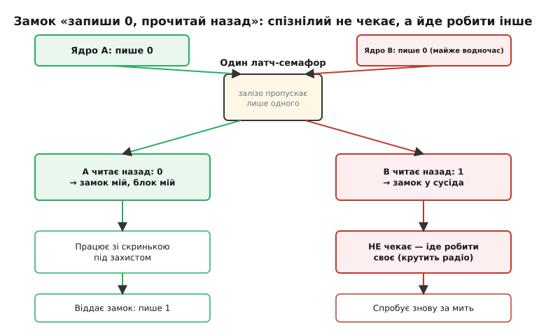
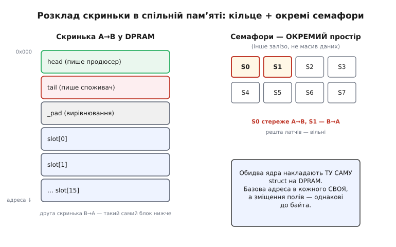

# ⚙️ Поштова скринька між двома ядрами: черга у двопортовій пам'яті під семафором

Два ядра сидять на одній двопортовій пам'яті. Одне готує пакети — команди, кадри для радіо, відліки давачів; друге їх забирає й пускає в діло. Порти незалежні, тож ядра ніколи не стають у чергу за шиною: пиши й читай водночас, кожне у власному ритмі. Ідилія тримається рівно доти, доки вони працюють у **різних** комірках. Але скринька — це спільна структура даних: спільні індекси, спільний буфер, спільний лічильник. І тут-таки повертається єдина справжня небезпека двопортової пам'яті — двоє тягнуться до **однієї** комірки в ту саму мить.

Розберімо цю скриньку до дна — від того, як вона лежить у спільній пам'яті, до кожного рядка прошивки, що її обслуговує. Наприкінці зберемо чек-лист пасток, кожна з яких коштувала комусь тижня в лабораторії.

## Задача: передати потік між ядрами, не спиняючи жодне

Уявіть типовий двоядерний вузол. Ядро A — «застосунок»: веде логіку, приймає рішення, породжує команди. Ядро B — «зв'язок»: крутить радіо чи шину, вантажить у ефір те, що A наготувало. Між ними тече потік пакетів в один бік (A → B), а назад — підтвердження й статуси (B → A). Класична пара черг.

Чому не обійтися однією спільною змінною «поточний пакет»? Бо ядра **не синхронні**. Поки B вантажить попередній пакет, A вже наготувало наступний — і затерло б попередній, якого B ще не забрало. Слово загубилось би без сліду. Потрібен **буфер**, куди пакети складаються один за одним і чекають, поки їх заберуть **у тому самому порядку**. Тобто черга «перший зайшов — перший вийшов». Та сама ідея, що й в [асинхронній FIFO](topic:electronics/async-fifo), тільки тепер кільце лежить не в кремнії мікросхеми, а в спільній двопортовій пам'яті, і обслуговують його не тактові домени, а дві прошивки.

Тепер головна вимога, від якої залежить уся конструкція: **жодне ядро не має права зупинитися й чекати на інше**. Ядро B крутить радіо за жорстким розкладом — застрягне на пів мілісекунди в очікуванні замка, і зірветься кадр. Ядро A веде керування — зависне, і система осліпне. Тому скринька мусить бути такою, щоб «зараз зайнято» ніколи не означало «стій і чекай». Означати воно має інше: «не вийшло цього разу — займися своїм, спробуєш за мить». Ця вимога — не забаганка, а те, що відрізняє робочу прошивку від тієї, що раз на годину клинить під навантаженням.

> 🔧 **Навіщо це.** Двоядерні вузли — уже норма, не екзотика. ESP32 із двома ядрами, зв'язки «головний МК плюс радіо-співпроцесор», ARM-чипи з парою ядер на спільній SRAM. Щойно два ядра ділять пам'ять, постає та сама пара питань: як передати потік, не ставлячи ядра в чергу, — і як уберегти спільну структуру від двох одночасних доторків. Скринька під семафором — канонічна відповідь; зробите її неправильно, і матимете плавучий баг, який зникає під налагоджувачем і вилазить раз на мільйон пакетів у полі.

## Чому самих індексів тут замало

У [програмному кільцевому буфері](topic:electronics/async-fifo/proj-ring-buffer.md) між обробником переривання й головним циклом замок був **непотрібний**: там працює контракт «один хазяїн на індекс» — голову пише лише письменник, хвіст лише читач, кожен читає чуже, але ніколи його не пише. Раз у кожного індексу один хазяїн, класичної гонки «двоє пишуть в одну змінну» просто нема чому виникнути.

Спокуса — перенести цей фокус сюди один в один: голова живе у спільній пам'яті, її пише лише A; хвіст живе поруч, його пише лише B. Здавалося б, той самий контракт, замок зайвий. І на **одному** чипі так і було б. Але між **двома ядрами** з'являється те, чого на одному ядрі не існувало: **порядок, у якому записи одного ядра доходять до іншого, може не збігтися з порядком, у якому їх зроблено**. Ядро A акуратно кладе пакет у слот, а **тоді** посуває голову — а ядро B бачить нову голову **раніше**, ніж бачить записаний пакет. Публікація випередила дані, B кидається читати слот, а там ще старе сміття.

Отут і криється розвилка, і її треба пройти свідомо, бо звідси ростуть два різні дизайни. Є два способи вберегти скриньку, і плутати їх — джерело найкаверзніших багів.

**Шлях перший — без замка, на самих бар'єрах пам'яті.** Лишаємося при контракті «один хазяїн на індекс», а проблему порядку лікуємо не замком, а [бар'єром пам'яті](topic:programming/memory-barrier-instructions): письменник ставить бар'єр між записом пакета й публікацією голови, читач — дзеркальний бар'єр між читанням голови й читанням пакета. Це найшвидший шлях, і саме його беруть для чистої черги «один продюсер — один споживач». Його докладно розбирає проєкт про кільцевий буфер; тут не повторюватимемось.

**Шлях другий — замок на весь блок, узятий семафором.** Коли структура складніша за просте кільце — коли треба одним заходом торкнутися кількох полів (голови, хвоста, лічильника, кількох слотів) так, щоб інше ядро побачило зміну **цілою**, а не наполовину, — контракт «один хазяїн» уже не рятує. Тоді беруть **замок**: перш ніж чіпати спільний блок, ядро захоплює семафор, робить усе своє під захистом, тоді семафор віддає. Поки замок у нього, інше ядро в цей блок не лізе — воно бачить семафор зайнятим і займається чимось іншим.

Саме цей другий шлях — тема нашого проєкту, бо він показує те, чого кільцевий буфер не показує: **як залізо двопортової пам'яті дає атомарний замок**, якого в звичайній пам'яті між двома ядрами доводиться будувати хитрими алгоритмами. І дає його так елегантно, що варто розібрати механізм до останнього біта.

## Ідея: залізний замок протоколом «запиши 0, прочитай назад»

Побудувати замок між двома ядрами на **звичайній** спільній пам'яті — задача не з простих. Наївне «прочитай прапорець; якщо вільний — постав свій» не працює: між «прочитав вільно» і «поставив свій» устигає влізти інше ядро, теж прочитати вільно, теж поставити свій — і замок опиняється в обох. Класична гонка. Правильні алгоритми взаємного виключення на голій пам'яті (Деккера, Петерсона) існують, але вони громіздкі й повільні.

Двопортова пам'ять розрубує цей вузол апаратно. Крім масиву даних, у ній є окремий набір **латчів-семафорів** — зазвичай вісім, — незалежних від пам'яті й зі своєю вбудованою логікою. Кожен латч — це прапорець, який двоє ядер використовують як замок на якийсь спільний блок. Магія в тому, що **неподільність гарантує саме залізо**, а не хитрий код.

Прапорці **активні нулем**: вільний семафор читається як 1, захоплений — як 0. Щоб узяти замок, ядро робить дві прості дії поспіль:

1. **пише 0** у вибраний латч-семафор;
2. **читає його назад**.

Прочитало 0 — замок його, блок можна чіпати. Прочитало 1 — його випередили, замок у сусіда, треба зайнятися чимось іншим і спробувати згодом. Уся суть — у тому, що коли **обидва** ядра пишуть 0 у той самий семафор майже одночасно, вбудована логіка пропускає лише **одне** — те, що зайшло на крихту раніше, — а другому латч віддає прочитане **1**. Прапорець фізично не може стати «захопленим для обох». Звільняють замок зворотно: власник пише 1, семафор знову читається як 1 і вільний для іншого.

> 🔧 **Навіщо це.** Придивіться, чому читати назад **обов'язково**. Ви пишете 0 — але це ще не означає, що замок ваш: сусід міг записати свій 0 у ту саму мить. Записане вами 0 — лише **заявка**, а не володіння. Вердикт виносить залізо, і дізнатися його можна **тільки** прочитавши латч назад. Прочитали 0 — залізо присудило замок вам; прочитали 1 — сусідові. Ось чому крок «прочитай назад» не можна викинути як зайвий: у ньому вся розв'язка гонки.

За описаним стоїть цілком реальний клас мікросхем. Асинхронні двопортові SRAM від IDT (нині Renesas) — родина 7007, 7130 і рідня — саме так і роблять: вісім семафорних латчів, активних нулем, доступ протоколом «запиши 0, прочитай назад», а внутрішня схема не дає прапорцю піти в обидва боки водночас. Це усталений галузевий механізм, описаний у їхніх даташитах і застосовних нотатках, — не абстрактна вигадка.


*Захоплення замка. Обидва ядра пишуть 0 у той самий семафор майже водночас. Внутрішня логіка присуджує латч тому, хто зайшов першим: воно читає назад 0 і володіє блоком. Друге читає назад 1 — заявка не пройшла, замок у сусіда; воно НЕ чекає, а йде робити інше й спробує пізніше. Уся розв'язка — в одному прочитаному біті.*

## Структура скриньки у спільній пам'яті

Тепер закладемо саму скриньку. Вона лежить у двопортовій пам'яті так, щоб обидва ядра бачили її за **тими самими** адресами. Це важлива, легко пропущена деталь: у карті пам'яті ядра A блок DPRAM може починатися з однієї базової адреси, у ядра B — з іншої, залежно від того, як кожне ядро підключене до пам'яті. Але **зміщення** полів усередині блоку мусять збігатися до байта, інакше ядра писатимуть і читатимуть **різні** місця, гадаючи, що те саме. Тому структуру описуємо як `struct` з фіксованим розкладом, а базу підставляє кожне ядро свою.

Одна скринька — це кільцевий буфер в один бік. Для двобічного обміну (A → B і B → A) кладемо **дві** скриньки, кожну зі своїм семафором.

```c
#include <stdint.h>
#include <stdbool.h>

#define SLOTS      16u          // місткість кільця (степінь двійки!)
#define SLOT_MASK  (SLOTS - 1u)
#define PAYLOAD    60u          // байтів корисних даних у слоті

// Один слот — рівно те, що передаємо за раз.
typedef struct {
    uint8_t  len;               // скільки байтів у payload насправді
    uint8_t  payload[PAYLOAD];
} slot_t;

// Уся скринька в один бік. Лежить у DPRAM; ОБИДВА ядра бачать однаковий розклад.
typedef struct {
    volatile uint16_t head;     // куди покласти наступний пакет (пише продюсер)
    volatile uint16_t tail;     // звідки взяти наступний (пише споживач)
    volatile uint16_t _pad;     // до вирівнювання 4 (див. пастку про вирівнювання)
    slot_t            slot[SLOTS];
} mailbox_t;
```

Кільце на `SLOTS` слотів, дві індексні змінні, вирівнювальний проміжок і масив слотів. Розмір кільця — **степінь двійки**, щоб обгортання індексу було швидкою маскою `& (SLOTS−1)`, а не дорогим діленням `% SLOTS`. Це та сама причина, з якої й апаратне кільце завжди роблять розміром 2ᵏ.

Тепер прив'язка до пам'яті. Кожне ядро оголошує **свою** базу DPRAM — адресу, за якою двопортова пам'ять з'являється в **його** просторі, — і накладає на неї структуру:

```c
// Прив'язка структур до фізичних адрес DPRAM.
// A2B — скринька «застосунок → зв'язок»; B2A — назад.
// БАЗУ підставляє КОЖНЕ ядро свою (у ядра A і ядра B адреси різні,
// а зміщення полів усередині — однакові).
#define DPRAM_BASE   0x60000000u        // приклад: сюди мапнута DPRAM цього ядра

#define MB_A2B  ((mailbox_t volatile *)(DPRAM_BASE + 0x000))
#define MB_B2A  ((mailbox_t volatile *)(DPRAM_BASE + 0x100))

// Семафори — окремий простір, теж мапнутий у пам'ять.
// Латч 0 стереже скриньку A2B, латч 1 — B2A.
#define SEM_BASE  0x60010000u
#define SEM_A2B   (*(volatile uint8_t *)(SEM_BASE + 0))
#define SEM_B2A   (*(volatile uint8_t *)(SEM_BASE + 1))
```

Зверніть увагу: семафори живуть в **окремому** адресному просторі, не в масиві даних. Це принципово — латч-семафор і комірка пам'яті це різне залізо. Запис 0 у комірку `slot[3].len` не захопить жодного замка; захоплює лише запис у **семафорний** латч, за його власною адресою.


*Дві скриньки й семафори у спільній пам'яті. Кожна скринька — кільце: голова (куди класти), хвіст (звідки брати), проміжок вирівнювання, масив слотів. Семафорні латчі — ОКРЕМИЙ простір поряд із масивом даних, не всередині нього. Обидва ядра бачать однаковий розклад полів; різниться лише базова адреса, з якої DPRAM починається в кожного.*

## Захоплення й звільнення замка у прошивці

Семафори відображені в пам'ять, тож робота з ними — прості читання й запис. Ось три операції: спроба захопити, звільнити і зачекати з обмеженням.

```c
// Спроба захопити замок. Повертає true, якщо блок ТЕПЕР наш.
// НЕ блокує: не вийшло — одразу повертає false, ядро займеться іншим.
static inline bool sem_try_lock(volatile uint8_t *sem)
{
    *sem = 0;                    // 1) пишемо 0 — заявляємо намір
    return (*sem & 1u) == 0u;    // 2) читаємо назад: 0 → наш, 1 → нас випередили
}

// Звільнити замок. Пишемо 1 — семафор знову вільний для іншого ядра.
static inline void sem_unlock(volatile uint8_t *sem)
{
    *sem = 1;
}
```

Слово `volatile` тут — не прикраса, а несуча деталь. Без нього компілятор побачив би, що ми пишемо в комірку 0, а наступним рядком її ж читаємо, — і вирішив би, що читати марно: «там же щойно записали 0, навіщо йти в пам'ять». Він викинув би друге звернення й підставив константу 0. А саме друге звернення — **вся суть**: назад ми читаємо не «своє» значення, а **вердикт арбітра**, який залізо могло змінити на 1. Слово [`volatile`](topic:programming/volatile) (англ. «мінливий») забороняє цю оптимізацію й змушує щоразу лізти в пам'ять насправді. Забудете `volatile` на семафорі — і ваш `sem_try_lock` завжди повертатиме `true`, замок стане фікцією, а гонка — постійною.

Тепер важливий момент: `sem_try_lock` **не блокує**. Не дали замка — він одразу повертає `false`, і ядро вільне зайнятися чимось іншим. Це прямо відповідає нашій головній вимозі. Але інколи ядру таки треба дочекатися замка, щоб зробити конкретну справу, — і тоді очікування має бути **обмеженим**, з виходом, а не вічним:

```c
// Зачекати замок, але не довше за budget спроб. Повертає false, якщо не дочекались.
// Між спробами — коротка пауза, щоб дати іншому ядру шанс віддати замок.
static bool sem_lock_timeout(volatile uint8_t *sem, uint32_t budget)
{
    while (budget--) {
        if (sem_try_lock(sem))
            return true;         // взяли
        cpu_relax();             // дрібна пауза/підказка ядру; НЕ довге sleep
    }
    return false;                // не дочекались — хай викликач вирішує, що робити
}
```

`cpu_relax()` — це коротка підказка процесору (на ARM — інструкція `WFE` або хоча б кілька `NOP`), щоб гарячий цикл очікування не смажив шину даремно й дав сусідові фізично дописати своє. Ключове — **budget**: цикл скінченний. Навіть якщо сусіднє ядро зависло з замком у руці, ми вийдемо через `budget` спроб і повернемо `false`, а не заклинимо назавжди. Вічний `while (!sem_try_lock(sem));` без ліміту — пряма дорога до непомітного зависання всієї системи, коли одне ядро спіткнулось.

## Покласти пакет: продюсер під замком

Тепер сама передача. Продюсер (ядро A) хоче покласти пакет у скриньку A2B. Порядок дій вивірений, і кожен крок має причину.

```c
// Кладе один пакет у скриньку. Повертає:
//   1  — покладено;
//   0  — черга повна (свідомо вирішуємо, що робити);
//  -1  — не дали замка цього разу (спробувати згодом).
int mailbox_send(mailbox_t volatile *mb, volatile uint8_t *sem,
                 const uint8_t *data, uint8_t len)
{
    if (len > PAYLOAD) len = PAYLOAD;   // не вилазимо за слот

    // 1) Беремо замок з обмеженням. Не дали — виходимо, ядро зайнято НЕ буде.
    if (!sem_lock_timeout(sem, 64))
        return -1;                      // замок у сусіда — спробуємо пізніше

    // 2) Під замком читаємо індекси. Тепер вони стабільні: сусід сюди не лізе.
    uint16_t h = mb->head;
    uint16_t n = (uint16_t)((h + 1u) & SLOT_MASK);

    if (n == mb->tail) {                // повно (пожертвувана комірка-роздільник)
        sem_unlock(sem);               // ОБОВ'ЯЗКОВО віддати замок перед виходом!
        return 0;
    }

    // 3) Заповнюємо слот СПЕРШУ, голову посуваємо ПОТІМ.
    slot_t volatile *s = &mb->slot[h];
    s->len = len;
    for (uint8_t i = 0; i < len; i++)
        s->payload[i] = data[i];

    mb->head = n;                       // публікуємо: пакет готовий до забирання

    // 4) Віддаємо замок — блок знову вільний для сусіда.
    sem_unlock(sem);
    return 1;
}
```

Кілька місць тут не випадкові. По-перше, **порядок «дані, потім голова»**: слот заповнюємо повністю, і **лише тоді** посуваємо `head`. Рух голови — це **публікація**, сигнал споживачеві «бери». Посунь голову раніше за дані — і споживач (якби він якимось чином зазирнув) побачив би новий слот із недописаним пакетом. Під замком споживач сюди не зайде, але звичка «перемикач останнім» рятує і в тонших випадках, і її варто тримати завжди.

По-друге, і це найчастіша пастка: **на кожному шляху виходу замок віддається**. Повно — віддали й вийшли. Успіх — віддали й вийшли. Пропустіть `sem_unlock` хоч на одній гілці `return` — і замок залишиться захопленим **назавжди**: сусіднє ядро вічно бачитиме блок зайнятим, скринька в цей бік замре мертво. Це класика: замок, узятий і не відданий на якомусь рідкісному шляху помилки. Тому правило: **скільки шляхів виходу з-під замка — стільки й `sem_unlock`**, і кожен звірити очима.

## Забрати пакет: споживач і сигнал «є пошта»

Дзеркальна операція — споживач (ядро B) забирає пакет зі скриньки A2B.

```c
// Забирає один пакет. Повертає довжину (>0), 0 якщо порожньо, -1 якщо не дали замка.
int mailbox_recv(mailbox_t volatile *mb, volatile uint8_t *sem,
                 uint8_t *out, uint8_t out_cap)
{
    if (!sem_lock_timeout(sem, 64))
        return -1;                      // замок у сусіда — спробуємо пізніше

    uint16_t t = mb->tail;
    if (t == mb->head) {                // порожньо
        sem_unlock(sem);
        return 0;
    }

    slot_t volatile *s = &mb->slot[t];
    uint8_t len = s->len;
    if (len > out_cap) len = out_cap;

    for (uint8_t i = 0; i < len; i++)   // СПЕРШУ дані зі слота
        out[i] = s->payload[i];

    mb->tail = (uint16_t)((t + 1u) & SLOT_MASK);  // ПОТІМ звільняємо слот

    sem_unlock(sem);
    return len;
}
```

Той самий скелет: узяв замок → зробив своє → віддав замок, на кожному виході. І той самий порядок, тільки дзеркальний: **спершу забери дані, потім посунь хвіст**, бо рух хвоста звільняє слот під перезапис — це теж публікація, тільки «місце вільне».

Лишається одна річ. Споживач мусить якось **дізнатися**, що пошта прийшла. Найгрубіше — раз у раз опитувати скриньку в головному циклі: узяв замок, глянув `head == tail`, порожньо — віддав замок, пішов далі. Працює, але марнує такти на порожні перевірки й додає затримку: пакет полежить, поки цикл до нього дійде. Багато двопортових мікросхем дають краще — **вбудований поштовий сигнал переривання**.

Механізм такий: у пам'яті виділено кілька особливих адрес-скриньок (зазвичай **дві найвищі** адреси — по одній на кожен бік). Коли одне ядро **пише** в таку адресу, у **сусіда** апаратно зводиться сигнал переривання (лінія INT, активна нулем). Сусід прокидається за перериванням, забирає пошту — і сам факт того, що він **прочитав** цю адресу, **гасить** переривання. Ні опитування, ні зайвих тактів: поклав — сусід негайно прокинувся, забрав — сигнал згас.

```c
// Адреси-поштарі: запис сюди зводить INT у сусіда, читання — гасить.
// Зазвичай це дві найвищі адреси DPRAM (по одній на напрям).
#define MBX_TO_B  (*(volatile uint8_t *)(DPRAM_BASE + 0x0FFF))  // A пише → перериває B
#define MBX_TO_A  (*(volatile uint8_t *)(DPRAM_BASE + 0x0FFE))  // B пише → перериває A

// Продюсер після вдалого mailbox_send «дзвонить» сусідові:
static inline void ring_doorbell_to_B(void)
{
    MBX_TO_B = 1;               // значення байдуже — важливий сам факт запису
}

// Обробник переривання на боці B: прокинувся, забрав ВСЕ, що встигло накопичитись.
void DPRAM_INT_Handler(void)
{
    uint8_t buf[PAYLOAD];
    int n;
    // Забираємо всі пакети, а не один: між дзвінками їх могло лягти кілька.
    while ((n = mailbox_recv(MB_A2B, &SEM_A2B, buf, sizeof buf)) > 0)
        process_packet(buf, (uint8_t)n);

    (void)MBX_TO_B;             // читаємо свою скриньку-поштар → гасимо INT
}
```

Тонкість, на якій ловляться: в обробнику треба **вигребти все**, а не один пакет. Поки B спало між дзвінками, A могло покласти кілька пакетів, а INT — це один сигнал, не лічильник. Прокинувшись, B крутить `mailbox_recv`, доки черга не спорожніє; інакше залишок пролежить до наступного дзвінка, а якщо дзвінків більше не буде — зависне назовсім. І другий момент: гасити INT читанням своєї адреси-поштаря треба **після** того, як забрали пошту, — тоді новий дзвінок, що прийшов під час обробки, не загубиться.

> 🔧 **Навіщо це.** Поштове переривання прибирає найгіршу ваду опитування — **латентність з невизначеним хвостом**. На опитуванні пакет чекає, поки головний цикл добіжить до перевірки; а якщо цикл саме зайнятий довгою справою, чекатиме довго й непередбачувано. З дзвінком приймач реагує за одиниці мікросекунд, детерміновано, і не палить такти на порожні перевірки, коли пошти нема. Для потоку з жорсткими строками (радіо, керування рухом) це різниця між «працює» і «зрідка зриває кадр».

## Пастка, що чигає лише там, де є кеш

Досі ми мовчки припускали, що коли одне ядро записало байт у DPRAM, друге, прочитавши ту саму адресу, побачить цей байт. На простих мікроконтролерах без кешу так і є: `volatile` змушує команду читання насправді піти в пам'ять, а там уже лежить свіже. Але на ядрах **із кешем даних** ця очевидність ламається — і ламається тихо, бо `volatile` тут **не рятує**.

Ось у чому річ. Коли ядро читає адресу, воно тягне не один байт, а цілу **лінію кешу** (типово 32 байти) і тримає її копію в себе. Наступні читання цієї адреси йдуть **у кеш**, не в пам'ять, — швидко, але сліпо до того, що сусіднє ядро тим часом переписало комірку в **справжній** DPRAM. Дзеркально й запис: ядро могло змінити комірку лише у своїй копії лінії, а до фізичної пам'яті вона ще не дійшла — сусід, читаючи пам'ять, побачить старе. Слово [`volatile`](topic:programming/volatile) тут безсиле: воно керує тим, як **компілятор** породжує команди, а не тим, чи команда читання дістає дані з кешу чи з пам'яті. Проти [кеш-неузгодженості](topic:electronics/cache-coherency-mcu) воно мовчить.

> Коротко про суть кешу тут. Кеш — маленька швидка пам'ять при ядрі, що тримає копії щойно вжитих комірок, щоб не бігати щоразу в повільну зовнішню пам'ять. Проблема двоядерного обміну: копія в кеші одного ядра й вміст справжньої пам'яті можуть **розійтися** — ядро бачить своє старе, поки сусід уже переписав. Докладніше — у [кеш-коерентності мікроконтролера](topic:electronics/cache-coherency-mcu).

Ліки залежать від заліза, і їх два.

**Найпростіше — виключити DPRAM із кешування.** У блоку керування пам'яттю (MPU на Cortex-M) регіон, де лежить двопортова пам'ять, позначають як **non-cacheable** (та ще й **strongly-ordered** чи **device**). Тоді кожен доступ до DPRAM іде **прямо в пам'ять**, повз кеш, і питання знімається саме собою — ціною того, що доступи трохи повільніші (кеш же не пришвидшує). Для скриньки, де важлива узгодженість, а не пікова швидкість, це майже завжди правильний вибір, і робити його треба **свідомо на етапі налаштування MPU**, а не сподіватися, що «якось обійдеться».

**Тонше — лишити кеш, але вручну його узгоджувати.** Регіон кешований, а прошивка сама тримає кеш і пам'ять у згоді спеціальними операціями: **перед** тим як прочитати те, що сусід міг оновити, ядро **скидає (invalidate)** відповідні лінії — викидає свої копії, щоб наступне читання пішло в пам'ять; **після** того як записало для сусіда, ядро **вивантажує (clean/flush)** лінії — жене свою копію у фізичну пам'ять, щоб сусід її побачив. Порядок строгий: `clean` після запису, `invalidate` перед читанням.

```c
#include "cmsis_gcc.h"   // SCB_CleanDCache_by_Addr / SCB_InvalidateDCache_by_Addr

// Продюсер: заповнив слот у кешованій DPRAM — і мусить вигнати його в пам'ять,
// ІНАКШЕ сусід прочитає з реальної пам'яті старе сміття.
static inline void publish_slot(slot_t volatile *s)
{
    SCB_CleanDCache_by_Addr((uint32_t *)s, sizeof(slot_t));  // моя копія → пам'ять
}

// Споживач: перш ніж читати слот, викинути свою копію лінії,
// щоб читання пішло в пам'ять і дістало те, що сусід щойно записав.
static inline void refresh_slot(slot_t volatile *s)
{
    SCB_InvalidateDCache_by_Addr((uint32_t *)s, sizeof(slot_t));  // з пам'яті наново
}
```

Цей ручний шлях швидший (гарячі дані лишаються в кеші), але значно підступніший: забув `clean` — сусід читає старе; забув `invalidate` — сам читаєш старе; переплутав порядок — ловиш рідкісний плавучий баг. І тут-таки з'являється сусідня вимога — **вирівнювання**.

## Вирівнювання: щоб «прибрати» одне не зачепило чужого

Операції кешу працюють **лінією** — цілими 32 байтами, не окремим байтом. Скидаєш чи чистиш якусь адресу — залізо чіпає всю лінію, у яку вона попала. І якщо у **тій самій** лінії лежать дані **двох** різних ділянок скриньки — скажімо, кінець одного слота й початок іншого, або індекси й перший слот, — то, узгоджуючи одне, ви ненароком зачепите й друге. Скинули лінію заради «свого» слота, а разом викинули свіжу копію індексів, яку сусід щойно оновив, — і прочитали старе. Це **хибне сусідство** (англ. *false sharing*): дві незалежні речі поділили одну лінію кешу й почали заважати одна одній без жодної логічної причини.

Ліки — **вирівняти** ключові поля на межу лінії кешу, щоб те, що узгоджується окремо, і лежало в окремих лініях:

```c
// Кожне поле, що узгоджується окремо, — на СВОЮ лінію кешу (32 байти).
typedef struct {
    __attribute__((aligned(32))) volatile uint16_t head;
    uint8_t  _p1[32 - sizeof(uint16_t)];      // добити лінію до кінця

    __attribute__((aligned(32))) volatile uint16_t tail;
    uint8_t  _p2[32 - sizeof(uint16_t)];

    __attribute__((aligned(32))) slot_t slot[SLOTS];   // слоти — з нової лінії
} mailbox_aligned_t;
```

Так голова, хвіст і масив слотів не ділять лінію: скидання чи чистка одного не зачіпає інших. Плата — трохи витраченої пам'яті на проміжки, але DPRAM під скриньку зазвичай і так із запасом, а надійність того варта. І помітьте: та `_pad`-дірка, що ми клали в першу, найпростішу структуру, — це зародок тієї самої думки. Навіть без кешу тримати індекси вирівняними корисно, щоб кожен читався **однією** машинною командою (про це — в пастках нижче).

Найважливіше про кеш і вирівнювання одним рядком: **ця пастка чигає рівно там, де є кеш даних, і зовсім не існує там, де його нема**. На дрібному Cortex-M0 без кешу забудьте про `clean`/`invalidate` й вирівнювання під лінію — там нема чого узгоджувати, а `volatile` самодостатній. На Cortex-M7 чи парі великих ядер із кешем це — перше, що треба закласти, ще до першого рядка логіки скриньки. Не знаючи цієї межі, переносять код із M0 на M7 без єдиної правки, воно компілюється мовчки — і зрідка під навантаженням віддає зіпсований пакет.

## Складність і пастки

Скринька під семафором — це масив, кілька індексів і два залізні латчі, а вся підступність зібрана в кількох точних місцях. Ось чек-лист, який варто тримати перед очима.

- **Гонка без семафора.** Спокуса «та тут же лише два байти індексу, обійдемось без замка» — і ось уже двоє пишуть суміжні поля, порядок їхніх записів між ядрами розсипається, скринька віддає покручене. Замок на весь блок для того й потрібен: під ним сусід у структуру не лізе, і всі поля змінюються **цілою** групою, а не наполовину. Якщо ж вирішили йти без замка — то **тільки** строгим SPSC із бар'єрами пам'яті (як у кільцевому буфері), а не «майже без замка».

- **Забутий `volatile` на семафорі.** Без нього компілятор викине читання-назад як «зайве» після щойного запису 0 — і `sem_try_lock` завжди поверне `true`. Замок стане декорацією, гонка — постійною, а баг — невловним, бо в налагоджувачі оптимізації часто інакші. `volatile` на латчі-семафорі — **обов'язковий**, і саме тому, що читаємо ми вердикт заліза, а не власне значення.

- **Замок, узятий і не відданий.** На **кожному** шляху виходу з-під замка мусить бути `sem_unlock` — і на гілці «повно», і на «порожньо», і на успіху, і на будь-якій помилці. Пропустіть один `return` без розблокування — і сусід вічно бачитиме блок зайнятим, скринька в цей бік замре. Правило: скільки виходів — стільки розблокувань, кожен звірити очима.

- **Дедлок на двох замках.** Щойно ядру треба тримати **два** семафори водночас (скажімо, замкнути обидві скриньки), виникає ризик: A взяло замок 1 і тягнеться по 2, а B узяло 2 і тягнеться по 1 — обидва чекають одне одного вічно. Ліки класичні: або **не тримати два замки разом** узагалі, або брати їх **завжди в тому самому порядку** обома ядрами (спершу 1, тоді 2 — ніколи навпаки). І оскільки наш `sem_lock_timeout` має **budget**, навіть попавши в затик, ядра виходять через ліміт спроб і не зависають намертво — це остання лінія оборони, але покладатися варто на впорядкованість, а не на неї.

- **Вічне очікування замка.** `while (!sem_try_lock(sem));` без ліміту — пряма дорога до зависання: сусід спіткнувся з замком у руці, і це ядро крутиться довіку. **Завжди** обмежуйте очікування (`budget`) і давайте викликачеві чесне «не дочекався», щоб він зайнявся іншим. Головна вимога проєкту — жодне ядро не спиняється назавжди — тримається саме на цьому.

- **Кеш на боці, де він є.** На ядрах із кешем даних `volatile` **не** гарантує, що записане одним ядром побачить інше: копія в кеші й реальна DPRAM розходяться. Або виключіть регіон DPRAM із кешування через MPU (найпростіше й надійне для скриньки), або вручну `clean` після запису й `invalidate` перед читанням — строго в цьому порядку. На МК без кешу цієї пастки нема взагалі; на M7 чи парі великих ядер — це перше, що закладають.

- **Вирівнювання й хибне сусідство.** Операції кешу чіпають цілу лінію (32 байти). Якщо в одній лінії лежать дві незалежні речі — індекси й слот, кінець одного слота й початок іншого, — то узгоджуючи одне, зачепите друге й прочитаєте старе. Вирівняйте кожне поле, що узгоджується окремо, на межу лінії. Навіть без кешу вирівняний індекс корисний: він читається **однією** машинною командою, а не двома, тож сусід ніколи не впіймає його «напівоновленим».

- **Розбіжність розкладу структури між ядрами.** Обидва ядра мусять накладати на DPRAM **однаковий** розклад полів — ті самі зміщення, той самий розмір. Різні компілятори, різні опції пакування (`#pragma pack`), різна розрядність — і `head` в одного ядра опиниться там, де в іншого `tail`. Тримайте опис структури **спільним** (один заголовок на обидва ядра) і фіксуйте пакування явно, щоб зміщення збіглися до байта.

- **Розмір кільця — степінь двійки.** Тоді обгортання індексу — маска `& (SLOTS−1)` в один такт замість ділення `% SLOTS` у десятки тактів на ядрі без апаратного дільника. Не степінь двійки — маска дасть неправильний індекс; тоді чесний `%` або ручна перевірка `if (i == SLOTS) i = 0;`.

Складіть це докупи — і матимете надійний двобічний міст між двома ядрами: спільне кільце у двопортовій пам'яті, залізний замок, узятий одним рухом «запиши 0, прочитай назад», необов'язковий дзвінок-переривання й свідомо оброблені випадки «зайнято» та «повно». Скелет усюди той самий — кільце й два індекси; двопортова пам'ять лише додає до нього те, чого звичайна між двома ядрами не дає задарма: **атомарний замок у кремнії** й **поштовий сигнал сусідові**. Побачивши цю зв'язку раз, ви впізнаватимете її в кожному вузлі, де два «мозки» ділять одну пам'ять.
