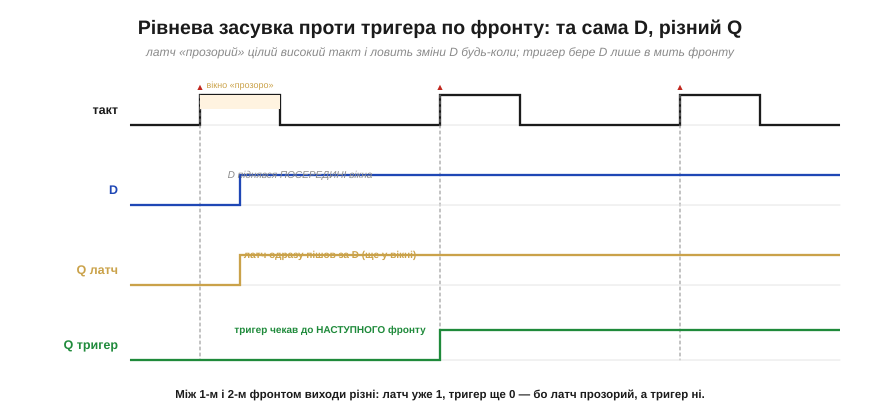
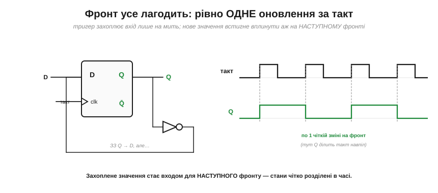
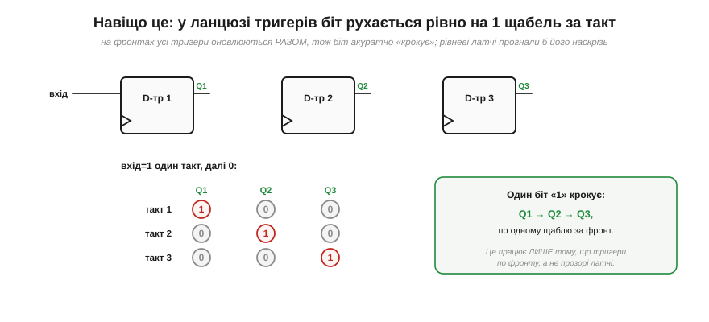
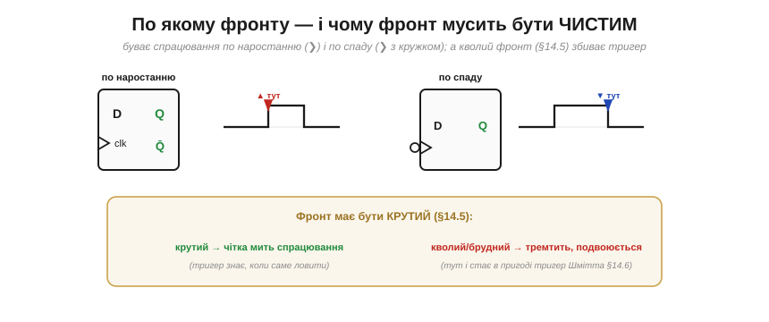

# Фронт vs рівень: чому тактують по фронту

[D-тригер](book:electronics/d-flip-flop) захоплює дані по **фронту** такту, і кажуть, що так надійніше, ніж реагувати на **рівень**. Розберімо, **чому** саме — бо це не дрібниця стилю, а фундамент, на якому стоїть уся синхронна цифрова техніка. Виявиться, що різниця між «прозорим» латчем і тригером по фронту вирішує, чи буде складна схема **передбачуваною**, чи перетвориться на хаос.

### Рівень vs фронт: іще раз про різницю

Спершу чітко, на одній діаграмі, побачимо, чим вони відрізняються поведінкою.

*Рис. Той самий такт і той самий вхід D, але два різні елементи. **Латч** (рівневий) «прозорий» цілий час, поки такт=1, — тож коли D піднявся **посеред** високого такту, латч одразу пішов за ним. **Тригер** (по фронту) дивиться на D лише в мить наростання (▲) — на першому фронті D ще був 0, тож тригер лишився 0 й чекав аж до **наступного** фронту. Між першим і другим фронтом їхні виходи **різні**: латч уже 1, тригер ще 0.*

Отже, латч реагує **протягом усього** високого рівня такту, а тригер — лише в одну **мить**. Це здається дрібною різницею, та саме вона стає вирішальною, щойно схема має **зворотний зв'язок**.

### Біда прозорості: гонка крізь латч

Уявімо найпростіше: вихід латча через якусь логіку повертається на його ж вхід (а так буде в кожному лічильнику й регістрі). Поки такт високий, латч **прозорий** — і ось що тоді коїться.

*Рис. Вихід Q заведено назад на вхід D (тут через інвертор). Поки такт=1, латч відкритий, тож нове значення Q **оббігає** петлю, інвертується, повертається на вхід, знову змінює Q — і так **багато разів за один** високий такт. Скільки саме обертів устигне — залежить від мікроскопічних затримок вентилів, тож результат у кінці такту **непередбачуваний**. Це називають **гонкою** (*race-through*).*

Ось у чому корінь біди: прозорий латч під час високого такту — це **замкнена петля без гальма**. Один такт мав би означати «одне оновлення», а виходить казна-скільки оновлень, та ще й їхня кількість залежить від фізичних затримок, які щоразу трохи інші. Схема стає **невідтворюваною** — найгірше, що може бути в цифровій техніці.

### Фронт усе лагодить: одне оновлення за такт

Тепер замінімо латч на **тригер по фронту** — і та сама петля стає бездоганно передбачуваною.

*Рис. Та сама петля «Q назад на D», але через тригер по фронту. Тепер захоплення триває лише **мить**, тож нове значення Q **не встигає** оббігти петлю й вплинути на цей самий фронт — воно вплине аж на **наступному**. Виходить рівно **одне** оновлення за такт (тут Q перемикається щофронту, ділячи такт навпіл). Захоплене значення стає входом для **наступного** кроку — стани чітко розділені в часі.*

Ось ключова перевага, заради якої все й затівалося: тригер по фронту **розриває** небезпечну петлю в часі. Те, що схема обчислює **зараз**, вона запам'ятає на **цьому** фронті, а використає — лише на **наступному**. [«Поточний стан» і «наступний стан»](book:electronics/state-memory) виявляються **акуратно розділені** межею фронту, і ніякої гонки бути не може. Один фронт — один крок. Завжди.

### Демонстрація: зсувний регістр

Найнаочніше це видно на **зсувному регістрі** (*shift register*) — ланцюжку тригерів, де вихід кожного йде на вхід наступного, і всі тактовані **разом**.

*Рис. Три D-тригери в ланцюзі, спільний такт. Подамо на вхід одиничку на один такт. На кожному фронті всі тригери оновлюються **одночасно**, причому кожен захоплює те, що було на вході його попередника **щойно перед** фронтом. Тому одиничка акуратно **крокує**: такт 1 — вона в Q1, такт 2 — у Q2, такт 3 — у Q3. По одному щаблю за фронт.*

А тепер уявіть, що тут стояли б **прозорі латчі**. На високому такті **всі** вони відкрилися б воднораз — і одиничка **прогналася** б крізь увесь ланцюг за один такт (Q1→Q2→Q3 миттєво, race-through), замість крокувати. Зсувний регістр просто **не працював** би. Він працює **тільки** тому, що тригери по фронту: кожен ловить **старе** значення сусіда, перш ніж той устигне змінитися. Це — найчистіша демонстрація, навіщо потрібен фронт.

### По якому фронту — і чому він мусить бути чистим

Лишилися дві практичні деталі. По-перше, **який саме** фронт: тригери бувають по **наростанню** (*positive/rising edge*, такт 0→1) і по **спаду** (*negative/falling edge*, такт 1→0). На символі це розрізняють кружком: трикутник «❯» без кружка — по наростанню, з кружком на тактовому вході — по спаду (та сама [бульбашка-інверсія](book:electronics/basic-gates)).

*Рис. Зліва — спрацювання по наростанню (▲), праворуч — по спаду (▼, кружок на тактовому вході). А внизу — важлива засторога: фронт такту мусить бути [**крутим** і чистим](book:electronics/edges-rise-time). Крутий фронт дає тригеру чітку **мить** спрацювання; кволий чи зашумлений — тригер «не знає», коли саме ловити, може смикнутися двічі або застрягти. Саме тут, на тактових лініях, у пригоді стає [тригер Шмітта](book:electronics/threshold-schmitt).*

Тут усе впирається у фізику реального сигналу. Тригер спрацьовує на **переході** такту — а перехід не миттєвий, він має [скінченний час наростання](book:electronics/edges-rise-time). Щоб тригер захопив дані в чітко визначений момент, цей перехід має бути **крутим**: тоді «мить фронту» справді мить. Кволий, повільний чи брудний такт — і момент спрацювання «розмазується», тригер може зловити не те або смикнутися двічі. Ось чому до тактових ліній ставляться особливо прискіпливо, а де треба — «загострюють» їх [тригером Шмітта](book:electronics/threshold-schmitt).

> 🔧 **Навіщо це.** Головне, що варто винести: **майже вся** цифрова техніка тактується **по фронту**, і не випадково. Прозорий латч у петлі дає **гонку** — кілька непередбачуваних оновлень за такт; тригер по фронту дає рівно **одне** оновлення, чисто розділяючи «поточний» і «наступний» стан межею фронту. Тому зсувні регістри, лічильники, конвеєри процесора майже завжди будують на тригерах по фронту, а не на латчах. (Це не абсолют: у деяких високопродуктивних процесорах і ASIC свідомо вживають латч-схеми — заради «позичання часу» (*time borrowing*), площі й потужності, — та для нашого рівня орієнтир «усе на тригерах по фронту» цілком надійний.) На практиці: побачивши трикутник «❯» на тактовому вході — знайте, що тут спрацювання по фронту (кружок = по спаду); і пам'ятайте, що **такт мусить бути [чистим і крутим](book:electronics/edges-rise-time)**, бо саме від його фронту залежить, коли вся машина зробить крок. «Один фронт — один крок» — це девіз синхронної логіки.

---

Коротко про головне: **рівневий** латч прозорий цілий високий такт, **тригер** по фронту захоплює дані в одну мить. У петлях зі зворотним зв'язком прозорість дає **гонку** (*race-through*) — кілька непередбачуваних, залежних від затримок оновлень за один такт. Тригер по фронту цю біду усуває: рівно **одне** оновлення за такт, причому захоплене значення впливає лише на **наступному** фронті, чітко відділяючи поточний стан від наступного. Найнаочніше — **зсувний регістр**: на тригерах біт крокує на щабель за такт, а на прозорих латчах прогнався б наскрізь. Спрацьовувати можна по **наростанню** (❯) чи по **спаду** (❯ з кружком), і фронт такту мусить бути **крутим**, щоб мить спрацювання була чіткою. А коли поставити вісім надійних D-тригерів поряд, дістанемо те, у чому процесор зберігає число, — [**регістр**](book:electronics/register).

---
