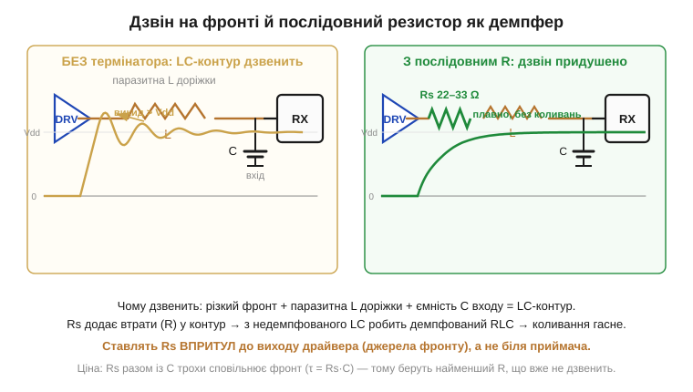
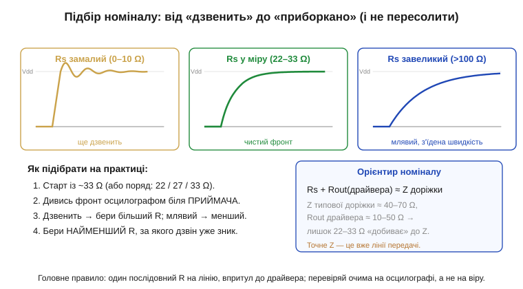

# 🔌 Дзвін на фронті: послідовний резистор 22–33 Ом біля швидких ліній

> Це компонентна вставка 🔌 до теми про [фронти й час наростання](topic:electronics/edges-rise-time). Коли фронт сигналу **надто** крутий, він дзвенить — дає викиди над Vdd і затухаючі коливання, — і поширені ліки від цього: «послідовний резистор». Тут розберемо цей прийом до кінця: що це за «компонент», куди він стає, який номінал брати і як перевірити, що допомогло.

## Що це за «пристрій» і навіщо

«Компонент» тут — звичайнісінький **резистор** на 22–33 Ом, але поставлений в особливе місце: **послідовно** в сигнальну лінію, впритул до виходу драйвера. У цій ролі він має власну назву — **послідовний термінатор** (*series termination*, або *source termination*, бо стоїть біля джерела фронту). Це не нова деталь і не мікросхема — це той самий [резистор](topic:electronics/resistor), тільки робота в нього інша: не ділити напругу, а **гасити дзвін**.

Чому ж дрібний резистор лікує коливання? Будь-яка доріжка має паразитну **[індуктивність](topic:electronics/inductance)** (*inductance*, L), а вхід приймача — **[ємність](topic:electronics/capacitance)** (*capacitance*, C). L і C разом — це **[коливальний контур](topic:electronics/lc-resonance)**: різкий фронт б'є по ньому, як молоточок по дзвону, і контур **дзвенить**. У такого LC-контуру майже нема втрат, тому коливання затухає поволі. Послідовний резистор **додає втрати** прямо в це коло: недемпфований LC перетворюється на демпфований **RLC** — і дзвін гасне за один-два періоди.


*Зліва без термінатора: фронт збуджує LC-контур (паразитна L доріжки + ємність C входу), сигнал дзвенить із викидом над Vdd. Справа той самий шлях, але з резистором Rs = 22–33 Ом упритул до драйвера: він вносить втрати в контур, і коливання придушено майже без сліду. Ціна — Rs разом із C трохи сповільнює фронт (τ = Rs·C), тож беруть найменший номінал, який уже не дзвенить.*

## Куди він стає: розпіновка з двох ніжок

«Розпіновка» резистора проста — дві ніжки, але важить **порядок** і **місце**. Правильно — так:

```
вихід драйвера ──[ Rs ]── доріжка ─────────── вхід приймача
                  22–33 Ω    (тут і виникає
              (впритул      дзвін, якщо Rs нема)
              до драйвера)
```

Ключове — Rs стоїть **біля джерела** фронту (драйвера), а не біля приймача. Повне пояснення, чому саме там, дає лише теорія [ліній передачі](topic:communications/transmission-lines), тож тут приймемо це як практичне правило: послідовний термінатор працює **з боку джерела**. Ставлять його **по одному на лінію** — окремий резистор на кожен швидкий сигнал.

## «Перший байт»: як підключити й переконатися, що допомогло

Підключення — у розрив доріжки одразу за виводом драйвера; ніяких живлень чи землі цьому резистору не треба. А далі — не на віру, а **очима**: «перший байт» термінатора читають [осцилографом](topic:electronics/oscilloscope).


*Той самий фронт із трьома номіналами. Замалий R (зліва) — ще дзвенить; у міру 22–33 Ом (посередині) — чистий фронт без коливань; завеликий R (справа) — дзвону нема, але фронт млявий і швидкість з'їдена (та сама RC, що сповільнює будь-який фронт). Орієнтир номіналу: Rs разом із вихідним опором драйвера має приблизно дорівнювати хвильовому опору доріжки (десятки Ом). Процедура: старт із ~33 Ом, дивись фронт біля приймача, бери найменший R, за якого дзвін уже зник.*

Покроково: постав 33 Ом, поглянь на фронт біля приймача; якщо ще дзвенить — збільш номінал, якщо фронт став млявий — зменш. Шукаємо **найменший** резистор, за якого коливання вже нема: він гасить дзвін і найменше шкодить швидкості.

> 🔧 **Навіщо це.** Це найдешевший прийом проти «незрозумілого» дзвону на швидких лініях — тактах SPI, шинах пам'яті, виходах, що тягнуть довгу доріжку. Один резистор копійчаної ціни прибирає викиди над Vdd, які гризуть вхід приймача перенапругою, приборкує електромагнітну заваду й рятує [запас завадостійкості](topic:electronics/noise-margin). Тому в багатьох ланцюгах посадкове місце під такий Rs закладають **наперед**, навіть якщо ставлять туди перемичку 0 Ом, — щоб було куди вписати номінал, коли лінія раптом задзвенить.

## Варіації й короткий родовід

Сам прийом старший за нашу цифрову електроніку: гасити відбиття узгодженням з боку джерела навчилися ще телеграфісти й телефоністи XIX століття на довгих лініях — це колективний доробок інженерів зв'язку, не один «винахідник». У цифровому світі послідовний термінатор живе в кількох подобах. Класичний варіант — **окремий резистор 22–33 Ом** на доріжку. Часто його лишають **єдиним демпфером** там, де лінія коротка, а дзвону мало. На високій швидкості, де ліній багато (шина пам'яті), ставлять **резисторні збірки** — кілька однакових Rs в одному корпусі. А деякі драйвери взагалі мають **кероване наростання** (*slew-rate control*): фронт у них від початку не «якнайкрутіший», тож зовнішній термінатор уже не потрібен — крутість приборкали в самому джерелі.

Спільна нитка з усіма цими варіаціями одна, і саме її варто винести зі вставки: дзвін на фронті — це збуджений LC-контур доріжки, а послідовний резистор вносить у нього втрати й перетворює дзвін на чистий перепад. Чому термінатор працює **саме з боку джерела** і як точно порахувати хвильовий опір, докладно пояснює теорія [ліній передачі](topic:communications/transmission-lines).
