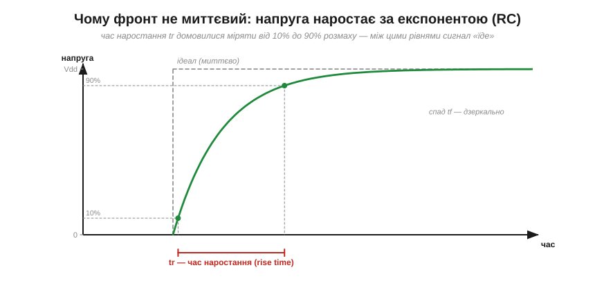
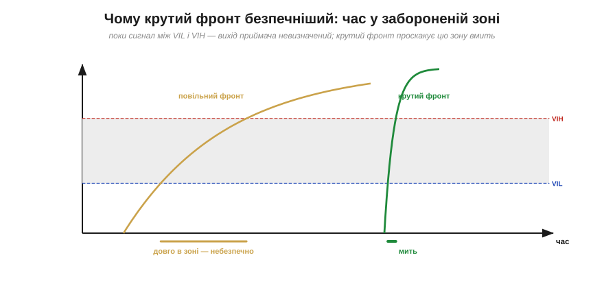
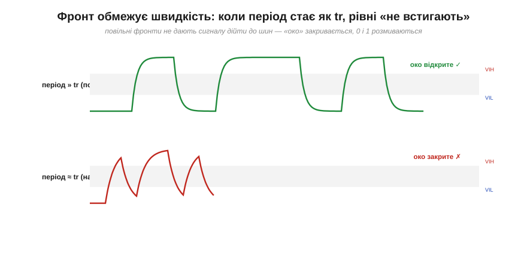
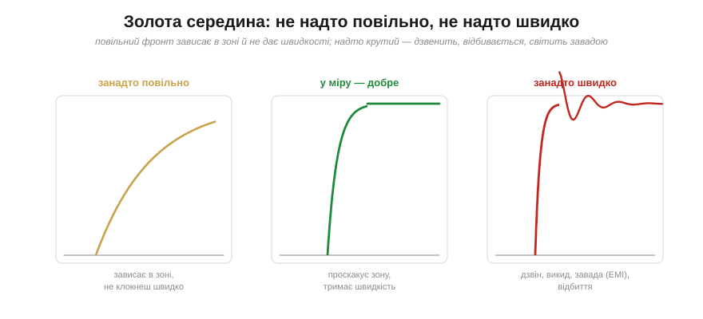

# Фронти й час наростання: чому не миттєво

Цифрові сигнали зазвичай зображають так, ніби 0 і 1 — це **миттєві стрибки**, вертикальні стінки прямокутного імпульсу. Це зручна брехня. Насправді жоден сигнал не змінюється за нуль часу: перехід із 0 у 1 — це коротка, але цілком вимірна **подорож** напруги вгору, а з 1 у 0 — униз. Ці переходи називають **фронтами** (*edges*): передній (наростання, *rising edge*) і задній (спад, *falling edge*). Розберімо, **чому** перемикання займає час, **скільки** саме, від чого залежить — і чому надто повільний фронт небезпечний, а надто швидкий теж недобрий.

### Ідеальний стрибок проти реального фронту

Подивімося на одне-єдине перемикання зблизька. Замість вертикальної стінки постане характерна для [RC-заряджання](topic:electronics/rc-time-constant) крива — **експонента** (лат. *exponens* — «той, що виставляє показник»).


*Сіра штрихова лінія — ідеал (миттєвий стрибок), якого не буває. Зелена крива — реальність: напруга наростає плавно, за експонентою. Оскільки «хвости» експоненти тягнуться довго, домовилися міряти швидкість фронту не «від 0 до 100%», а від **10% до 90%** розмаху — цей проміжок і називають **часом наростання** (*rise time*, tr). Спад (*fall time*, tf) міряють дзеркально, від 90% до 10%.*

Чому саме 10–90%, а не 0–100%? Бо математично експонента наближається до кінцевого рівня **нескінченно** довго (останній відсоток «доповзає» вічно), тож «час до 100%» — нескінченність, нею не поміряєш. А ось 10–90% — це чітко окреслена, повторювана величина. Це інженерна конвенція, як і пороги: домовилися — і користуємося.

### Звідки експонента: RC-заряджання вузла

Чому взагалі експонента, а не, скажімо, пряма? Відповідь — у природі [RC-ланки](topic:electronics/rc-time-constant). Будь-який вузол схеми має **ємність** (*capacitance*, C): це затвор приймача (адже [затвор MOSFET — це конденсатор](topic:electronics/gate-capacitance)), плюс ємність самого дроту/доріжки, плюс входи всіх під'єднаних чипів. А драйвер, що цей вузол перемикає, має скінченний **вихідний опір** (*output resistance*, Rout) — він не може віддати нескінченний струм. Маємо резистор, що заряджає конденсатор, — і це рівно та сама **RC-ланка**, чия експонента описана в [темі про сталу часу](topic:electronics/rc-time-constant).


*Причина фронту — RC. Вихідний опір драйвера Rout заряджає сумарну ємність вузла C (затвор приймача + дріт + входи) — і напруга на ній наростає за тією самою [RC-експонентою](book:electronics/rc-time-constant), досягаючи 63% за час τ = Rout·C. Час наростання виходить tr ≈ 2.2·τ, а крутість фронту (*slew rate*) — це ΔV/tr. Більший опір чи більша ємність → млявіший фронт.*

Звідси й проста арифметика фронту. Стала часу — [τ = Rout·C](topic:electronics/rc-time-constant), а час наростання 10–90% дорівнює:

```
tr ≈ 2.2 · τ = 2.2 · Rout · C
```

(множник 2.2 — це просто скільки сталих часу вкладається між 10% і 90% експоненти). Крутість фронту описують ще й **швидкістю наростання** (*slew rate*) — скільки вольтів за наносекунду долає сигнал: slew ≈ ΔV/tr. І найважливіший практичний висновок прямо з формули: фронт **сповільнюють** великий опір драйвера й велика ємність навантаження. Хочете крутий фронт — потрібен **сильний драйвер** (малий Rout) і **мала ємність** (короткі дроти, небагато входів на лінії).

**Приклад (час наростання з RC).** Драйвер має вихідний опір Rout = 100 Ом і керує вузлом з ємністю C = 50 пФ (затвор + коротка доріжка). Який час наростання й крутість при Vdd = 3.3 В?

```
τ  = Rout · C = 100 Ом × 50 пФ = 100 × 50×10⁻¹² = 5 нс
tr ≈ 2.2 · τ = 2.2 × 5 нс ≈ 11 нс
slew ≈ (0.8 × 3.3 В) / 11 нс ≈ 2.64 / 11 ≈ 0.24 В/нс
```

Одинадцять наносекунд — здавалося б, дрібниця. Та коли треба передавати десятки мільйонів бітів за секунду, ці наносекунди стають вирішальними. Варто також пам'ятати: якщо «зсунути рівень» дешевим [резистивним дільником](topic:electronics/level-shifting), ми **додаємо** опір у це коло — τ зростає, фронт млявіє; ось чому дільник годиться лише для повільних сигналів.

### Чому крутість важить (1): час у забороненій зоні

Перша причина дбати про крутість фронту пов'язана з [рівнями як діапазонами](topic:electronics/logic-levels-as-ranges). Поки сигнал **їде** від 0 до 1, він неминуче проходить крізь **заборонену зону** (VIL…VIH), де вихід приймача невизначений. Що повільніший фронт — то **довше** сигнал стирчить у цій небезпечній смузі, ризикуючи бути неправильно прочитаним, спричинити дзвін чи наскрізний струм.


*Заборонена зона (сіра) — однакова, а час перебування в ній — різний. Повільний фронт (бурштиновий) повзе крізь неї довго: увесь цей час приймач «не знає», 0 це чи 1. Крутий фронт (зелений) проскакує зону майже миттєво. Тому правило: крізь заборонену зону треба проходити **якнайшвидше** — мінімізувати час «непевності».*

Це робить крутий фронт не примхою, а вимогою **надійності**: що менше часу сигнал проводить «ні там ні сям», то менше шансів, що шум саме в цю мить зіб'є приймача з пантелику. Коли ж сигнал за природою повільний (наприклад, з механічної кнопки), його фронт спеціально «загострюють» [порогом із гістерезисом](topic:electronics/threshold-schmitt).

### Затримка поширення — не те саме, що крутість фронту

Тут варто розвести два поняття, які початківці постійно плутають. **Час наростання** (tr) — це наскільки **крутий** сам фронт. А **затримка поширення** (*propagation delay*, tpd) — це наскільки **пізніше** вихід зреагував на вхід. Це різні числа про різні речі.


*Вхід (угорі) змінився — і лише через час tpd на нього відгукнувся вихід (унизу). Затримку поширення міряють між точками **50%** входу й виходу: це «реакція із запізненням». А час наростання tr — це окремо, крутість самого вихідного фронту. Один елемент може мати велику затримку, але крутий фронт — і навпаки.*

Навіщо розрізняти? Бо вони обмежують різні речі. **Крутість** (tr) визначає, як швидко сигнал проскакує заборонену зону й наскільки високу частоту взагалі здатна нести лінія. **Затримка** (tpd) накопичується вздовж ланцюга елементів і визначає, як довго сигнал «продирається» крізь логіку від входу до результату — а це вже впирається в тактування: затримки складаються в [обмеження setup/hold](topic:electronics/metastability-timing) і задають [максимальну тактову частоту процесора](topic:programming/clock-frequency). Головне твердо засвоїти: **tr — про крутість, tpd — про запізнення**.

### Чому крутість важить (2): межа швидкості

Друга причина дбати про фронт — він ставить **стелю швидкості**. Логіка не може перемикатися швидше, ніж формуються її фронти. Якщо ви спробуєте слати біти з періодом, близьким до часу наростання, сигнал просто **не встигатиме** дійти до повного рівня, перш ніж настане час наступного біта.


*Угорі період набагато більший за tr: кожен біт встигає дійти до повної шини, рівні чисті, «око» (проміжок між 0 і 1) широко відкрите. Унизу період майже дорівнює tr: біти зливаються, сигнал не доходить до рівнів, «око» закривається — приймач уже не може певно відрізнити 0 від 1. Фронт перетворився на стелю швидкості.*

Інженери навіть пов'язали час наростання зі **смугою** (*bandwidth*) лінії простим правилом: BW ≈ 0.35 / tr. Що крутіший фронт, то вищу частоту лінія пропустить. А «око» (*eye*) — це той просвіт між траєкторіями 0 і 1: поки воно відкрите, приймач читає надійно; коли закрилося — починаються помилки. Той самий образ повертається скрізь, де важлива швидкість, — від [тактової частоти процесора](topic:programming/clock-frequency) до швидких шин і радіоканалів.

> 🧮 Звідки беруться 2.2 у `tr ≈ 2.2·τ` і 0.35 у `BW ≈ 0.35/tr` — обидва числа виводяться з одного логарифма дев'ятки; а погляд на фронт у частотах показує, **чому** крутий край неминуче світить завадою. [Фронт і смуга: звідки 2.2 і 0.35](topic:electronics/edges-rise-time/math-rise-time.md).

**Приклад (стеля швидкості).** Лінія має час наростання tr = 11 нс (з прикладу вище). Яку приблизно максимальну швидкість вона потягне?

```
смуга:    BW ≈ 0.35 / tr = 0.35 / 11 нс ≈ 32 МГц
для чистих рівнів треба період ≳ 3·tr ≈ 33 нс
макс. швидкість ≈ 1 / 33 нс ≈ 30 Мбіт/с
```

Тобто з такими фронтами більше ніж ~30 мегабіт за секунду цією лінією надійно не передаси. Хочеш швидше — роби фронт крутішим: сильніший драйвер, коротші дроти, менша ємність. Усе впирається в ту саму RC.

### Зворотний бік: надто крутий — теж погано

Здавалося б, висновок простий: роби фронти якнайкрутішими. Але ні — і в цьому тонкість. **Надто** крутий фронт породжує власні біди. Різкий перепад напруги збуджує паразитні [**індуктивності**](topic:electronics/inductance) і ємності дротів, і сигнал починає **дзвеніти** — коливатися з викидами вище Vdd й нижче нуля (*overshoot / ringing*). Ці викиди можуть залазити за [абсолютні межі входу](topic:electronics/logic-families), різкі фронти **випромінюють** електромагнітну заваду (*EMI*), яка псує сусідні кола, а на довгих лініях круте перемикання дає **відбиття** — їх пояснюють [лінії передачі та хвильовий опір](topic:communications/transmission-lines).


*Три фронти. Зліва — занадто повільний: зависає в забороненій зоні, не дає швидкості. Посередині — у міру: проскакує зону, тримає швидкість, не дзвенить. Справа — занадто крутий: викид над Vdd, затухаючий дзвін, електромагнітна завада й відбиття. Інженерія цифрового сигналу — це пошук **золотої середини** між «достатньо швидко» і «не аж так».*

Тому грамотні драйвери часто мають **кероване** наростання (*slew-rate control*) — їх навмисно роблять не «якнайшвидшими», а «рівно настільки крутими, скільки треба». Це класичний інженерний компроміс: достатньо круто, щоб проскочити заборонену зону й нести потрібну швидкість, але не настільки, щоб дзвеніти й світити завадою. А коли драйвер уже дзвенить, найдешевший зовнішній рятунок — крихітний резистор послідовно в лінію, що гасить коливання.

> 🔌 Той самий резистор 22–33 Ом упритул до драйвера вносить втрати в паразитний LC-контур доріжки й перетворює дзвін на чистий перепад — куди він стає, який номінал брати й як перевірити очима. [Дзвін на фронті: послідовний резистор](topic:electronics/edges-rise-time/comp-series-termination.md).

> 🔧 **Навіщо це.** Якщо лінія «не тягне» швидкість — підозрюйте ємність: довгий дріт, забагато входів, слабкий драйвер (велика RC). Якщо натомість усе **дзвенить**, гріється й фонить — фронти, можливо, надто круті для цієї довжини дроту, і їх варто пригальмувати (послідовний резистор — поширений прийом). А ще: ніколи не лишайте швидку лінію «висіти» довгим зайвим дротом — кожен зайвий сантиметр додає ємності (сповільнює) та індуктивності (дзвенить). Більшість «незрозумілих» цифрових багів на високій швидкості — це або з'їдений [запас завадостійкості](topic:electronics/noise-margin), або зіпсований фронт.

---

Підсумуймо. Перемикання **не миттєве**, бо драйвер з опором Rout заряджає ємність вузла C — це [RC-ланка](topic:electronics/rc-time-constant), тож напруга наростає за **експонентою**. Швидкість фронту міряють **часом наростання** tr (10%→90%), і tr ≈ 2.2·Rout·C; крутість описує slew rate. Крутий фронт важливий двічі: він **скорочує час у [забороненій зоні](topic:electronics/logic-levels-as-ranges)** (надійність) і **піднімає стелю швидкості** (BW ≈ 0.35/tr). Затримку поширення tpd (запізнення виходу, по 50%) не можна плутати з tr (крутістю фронту). Але **надто** крутий фронт дзвенить, дає викиди й EMI — тож існує **золота середина**, і драйвери часто роблять із керованою крутістю. А повільний чи зашумлений сигнал, навпаки, спеціально «загострюють» на вході [порогом із гістерезисом](topic:electronics/threshold-schmitt).

---
