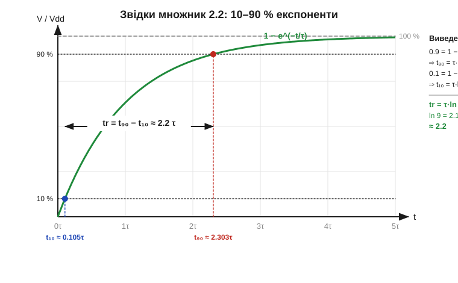
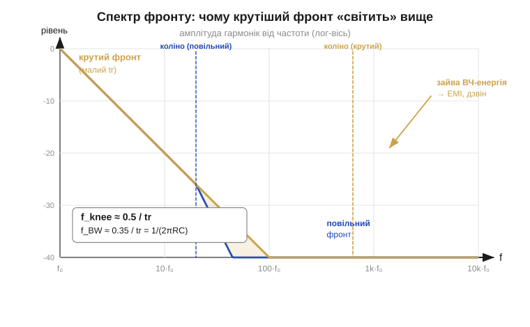

# 🧮 Фронт і смуга: звідки беруться 2.2 і 0.35 та чому крутий фронт шумить

> Математична вставка до теми [«Фронти й час наростання»](topic:electronics/edges-rise-time). Фронт цифрового сигналу — це RC-експонента, і його крутість зазвичай описують двома «магічними» числами: tr ≈ 2.2·τ і BW ≈ 0.35/tr. Тут ми їх **виведемо** — побачимо, що 2.2 і 0.35 беруться з одного й того самого логарифма. А тоді зробимо крок углиб: подивимося на фронт не в часі, а в **частотах**, і саме там стане видно, **чому** крутий фронт неминуче «світить» завадою.

### Означення: фронт — це крок RC-ланки

Драйвер із вихідним опором Rout заряджає ємність вузла C, тож напруга на вузлі — це **відгук RC-ланки на стрибок**, той самий, що дає [стала часу RC-ланки](topic:electronics/rc-time-constant):

```
V(t) = Vdd · (1 − e^(−t/τ)),   τ = Rout · C.
```

Час наростання tr заведено міряти не від 0 до 100 %, а від **10 % до 90 %** розмаху Vdd. Це не примха: математично крива доповзає до 100 % **нескінченно** довго (хвіст e^(−t/τ) ніколи не стає нулем), тож «час до 100 %» — нескінченність, і поміряти його не можна. А рівні 10 % і 90 % сигнал перетинає у цілком конкретні, повторювані миті — отже, проміжок між ними і є чесною, відтворюваною мірою крутості.

### Інтуїція: один логарифм на дві точки

Перш ніж рахувати, варто відчути, **чому** результат узагалі не залежить ні від Vdd, ні від конкретних R і C, а тільки від τ. Експонента 1 − e^(−t/τ) **однакова за формою** для будь-якого вузла: змінюється лише масштаб часу — сама τ. Тому «скільки τ треба, щоб дійти від 10 % до 90 %» — це чисте число, спільне для всіх RC-ланок у світі. Лишається його знайти: прирівняти криву до 0.1 і до 0.9 та відняти дві миті одна від одної.


*RC-експонента, але час відкладено в одиницях τ. Рівень 10 % крива перетинає в момент t₁₀ ≈ 0.105·τ, а 90 % — у t₉₀ ≈ 2.303·τ. Різниця і є часом наростання: tr = t₉₀ − t₁₀ ≈ 2.2·τ. Збоку — усе виведення в чотири рядки: множник 2.2 виявляється просто натуральним логарифмом дев'ятки.*

### Апарат: звідки 2.2

Тепер сам розрахунок. Шукаємо мить t₉₀, коли крива сягає 0.9 розмаху:

```
0.9 = 1 − e^(−t₉₀/τ)
e^(−t₉₀/τ) = 0.1
t₉₀ = τ · ln(10) = 2.3026 · τ
```

Так само — мить t₁₀ для рівня 0.1:

```
0.1 = 1 − e^(−t₁₀/τ)
e^(−t₁₀/τ) = 0.9
t₁₀ = τ · ln(10/9) = 0.1054 · τ
```

Час наростання — різниця цих двох митей, і логарифми гарно складаються в один:

```
tr = t₉₀ − t₁₀ = τ · (ln 10 − ln(10/9)) = τ · ln 9
ln 9 = 2.1972
tr ≈ 2.2 · τ = 2.2 · Rout · C
```

Ось і вся таємниця множника: **2.2 — це ln 9**. Жодної магії, просто наслідок того, що пороги взяли симетрично (10 % і 90 %): різниця логарифмів згортається в ln 9. Узяли б 20–80 % — дістали б ln 4 ≈ 1.39; узяли б 5–95 % — ln 19 ≈ 2.94. Конвенція 10–90 % просто стала загальноприйнятою, тож і 2.2 кочує з даташита в даташит.

### Апарат: звідки 0.35

Тепер до другого числа — смуги (*bandwidth*, BW). Тут потрібен зовсім інший погляд на ту саму RC-ланку: не «як вона відповідає на стрибок у часі», а «які частоти вона пропускає». RC-ланка — це найпростіший [фільтр низьких частот](topic:electronics/rc-low-pass), і його **частоту зрізу** (*cutoff*, рівень −3 дБ) дає класична формула:

```
f_BW = 1 / (2π · Rout · C) = 1 / (2π · τ).
```

А tr ми щойно виразили через ту саму τ: tr = ln 9 · τ, тобто τ = tr / ln 9. Підставмо одне в інше — τ скорочується, і лишається чисте число:

```
f_BW = 1 / (2π · τ) = ln 9 / (2π · tr)
ln 9 / (2π) = 2.1972 / 6.2832 = 0.3497
f_BW ≈ 0.35 / tr.
```

Отже **0.35 = ln 9 / 2π** — той самий ln 9, що дав нам 2.2, лише поділений на 2π. Два «магічні» числа фронту виявилися родичами: обидва народилися з логарифма дев'ятки. Звідси й симетрія двох записів, якими інженери користуються навперемін:

```
tr ≈ 2.2 · Rout · C       (фронт у часі)
BW ≈ 0.35 / tr            (та сама ланка в частотах)
```

> 🔧 **Навіщо це.** Ці дві формули — той самий перерахунок «час ↔ частота», яким щодня користуються на практиці. Бачите в даташиті крутість драйвера tr = 5 нс — поділили 0.35 на 5 нс і знаєте: понад ~70 МГц цей вихід не несе. І навпаки: знаєте смугу осцилографа 100 МГц — помножили й розумієте, що фронти, швидші за ~3.5 нс, прилад просто «розмаже» і покаже не такими крутими, як вони є.

### Чому швидкі фронти шумлять: фронт у частотах

Дотепер ми дивилися на фронт у часі. Та найважливіше для розуміння завад видно лише тоді, коли поглянути на нього в **частотах** — розкласти на гармоніки. І тут схована відповідь на питання з підзаголовка теми: **чому** швидкі фронти шумлять.

Ключова ідея проста: **крутий фронт = багато високочастотних гармонік**. Інтуїтивно — щоб скласти різкий, майже вертикальний перепад, потрібні швидкі складові: повільні синусоїди такого зламу не дають. Чим менший tr, тим вище за частотою тягнеться спектр сигналу. Цю верхню межу називають **частотою коліна** (*knee frequency*):

```
f_knee ≈ 0.5 / tr.
```

(Та сама природа, що й у 0.35/tr, лише з трохи іншим коефіцієнтом, бо коліно проводять по спектру, а не по рівню −3 дБ.) До коліна гармоніки помітні; вище — швидко згасають. А тепер головне: f_knee залежить **тільки від tr**, а не від частоти, з якою ви перемикаєте сигнал. Повільна шина з гострими фронтами випромінює так само високо, як швидка, — бо «світить» не частота бітів, а **крутість країв**.


*Амплітуда гармонік від частоти (лог-вісь). До свого коліна спектр спадає полого (−20 дБ/декаду), після — удвічі крутіше (−40 дБ/декаду). У повільного фронту (синій) коліно низько — високих гармонік майже нема. У крутого (бурштиновий) коліно зсунуте вправо, тож уся заштрихована смуга — це **зайва високочастотна енергія**, якої повільний фронт не має. Саме вона стає електромагнітною завадою (*EMI*) і живить дзвін на «надто крутому» фронті.*

Тепер видно, чому надто крутий фронт небезпечний не на словах, а по суті. Ця зайва ВЧ-енергія нікуди не зникає — вона мусить кудись подітися:

- **EMI.** Високочастотні гармоніки чудово випромінюються петлями доріжок і дротами, що працюють як антени, — і наводяться на сусідні кола.
- **Дзвін.** Ті самі високі частоти збуджують паразитні LC-контури (індуктивність виводів × ємність вузла), і фронт «обростає» затухаючими коливаннями — рівно той overshoot/ringing на самому фронті.
- **Відбиття.** На лінії, довшій за частку довжини хвилі коліна, круте перемикання дає відбиття від [хвильового опору лінії](topic:communications/transmission-lines).

Звідси й практичний бік «золотої середини»: фронт роблять **рівно настільки крутим, скільки треба** для потрібної смуги — і не крутішим. Кожен зайвий наносекундний виграш на фронті піднімає коліно й додає завади. Саме тому драйвери з керованою крутістю (*slew-rate control*) навмисно пригальмовують край: вони обмежують f_knee згори, прибираючи зайві гармоніки, доки сигнал ще встигає проскочити заборонену зону.

### Де це працює

Ця математика — місток, що зшиває аналогову й цифрову картину фронту. Вона спирається на [сталу часу RC-ланки](topic:electronics/rc-time-constant) (звідки взялася експонента й τ) і на частоту зрізу [фільтра низьких частот](topic:electronics/rc-low-pass). А далі дає число до двох практичних тверджень: tr ≈ 2.2·Rout·C визначає, як швидко сигнал проскакує [заборонену зону рівнів](topic:electronics/logic-levels-as-ranges) і скільки [запасу завадостійкості](topic:electronics/noise-margin) лишиться, а BW ≈ 0.35/tr задає стелю швидкості лінії. Той самий перерахунок «фронт ↔ смуга» працює скрізь, де йдеться про тактову частоту, швидкі шини й радіо: там крутість краю — це водночас і пропускна здатність, і джерело завад. Дві формули, один логарифм дев'ятки — а тримають вони на собі весь місток від аналогового фронту до цифрової швидкості.
