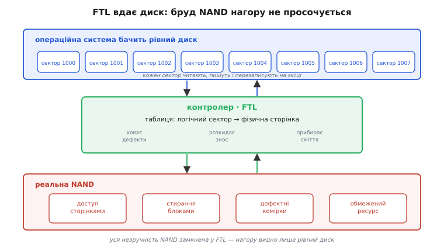
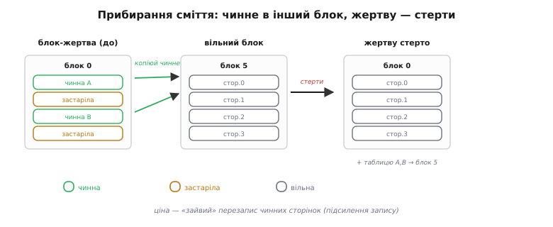
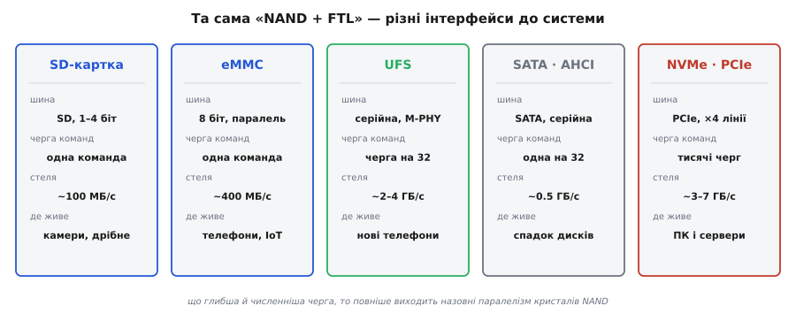
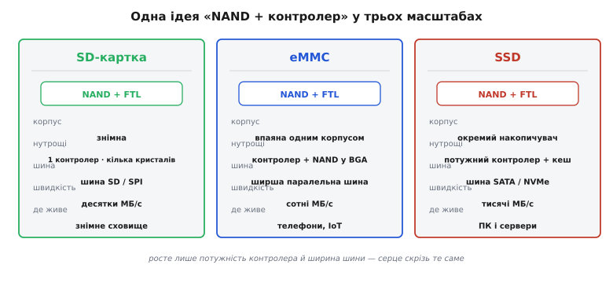

# eMMC і SSD

<preknowlist>
- [NAND-флеш](topic:electronics/nand-nor) — читати й писати можна сторінками, стирати лише цілими блоками, а кожна комірка витримує скінченне число стирань. Без цих трьох рис усе подальше не має сенсу.
</preknowlist>

Візьміть будь-яке флеш-сховище — мікро-SD у камері, впаяну пам'ять телефона, SSD у ноутбуку — і система працює з ним однаково: пронумеровані сектори, кожен читаєш, пишеш і **перезаписуєш на місці** скільки завгодно разів, як на старому жорсткому диску. Це дивно, бо всередині лежить [NAND-флеш](topic:electronics/nand-nor), яка так **не вміє**: перезаписати вже записану сторінку «поверх» вона не може, стерти окрему сторінку теж не може, а кожна комірка ще й помирає після певного числа стирань. Виходить розрив: зверху — ідеальний рівний диск, знизу — норовлива пам'ять, що не робить майже нічого з того, чого від диска чекають.

Хтось цей розрив закриває, і робить це **контролер** (*controller*, керівна мікросхема) — а точніше, прошарок усередині нього з власним ім'ям: **FTL** (*Flash Translation Layer*, прошарок трансляції флеш). Уся справа цього прошарку — змусити примхливу NAND **вдавати з себе диск**, сховавши її незручності так, щоб нагору вони не просочилися. І ось головне, заради чого варто розібрати FTL до дна: **eMMC** (*embedded MultiMediaCard*, вбудована мультимедіа-картка), **UFS**, **SSD** (*Solid-State Drive*, твердотільний накопичувач) і сама SD-картка — це **одна й та сама ідея** «NAND плюс контролер із FTL», лише в різному масштабі. Зрозумієте FTL — наперед знатимете, чому кожен із них поводиться саме так.


*Зверху операційна система бачить рівний диск: пронумеровані сектори, кожен можна читати, писати й перезаписувати на місці. Знизу — реальна NAND: доступ сторінками, стирання великими блоками, дефектні комірки, обмежений ресурс. Між ними у контролері сидить FTL: тримає таблицю «логічний сектор → фізична сторінка», ховає дефекти, розкидає знос, прибирає сміття. Уся незручність NAND лишається внизу.*

### Чому NAND не вміє бути диском

Щоб зрозуміти, що саме мусить робити FTL, треба спершу чесно перелічити, чим NAND відрізняється від того диска, який від неї хочуть. Кожна її риса — це окрема вимога, яку контролер змушений закрити.

**Читають і пишуть її сторінками, а стирають блоками.** Найменша порція для читання чи запису — **сторінка** (*page*, типово кілька кілобайтів). Але стерти окрему сторінку не можна: стирання бере одразу цілий **блок** (*erase block*) — десятки чи сотні сторінок гуртом. Уже сама ця асиметрія несумісна з диском, де будь-який сектор перезаписують незалежно від сусідів.

**Писати можна лише в стерту сторінку.** Комірка NAND після запису тримає заряд; аби записати нове значення, спершу треба зняти старе — тобто **стерти**. А стирання, як щойно сказано, бере цілий блок. Тому «перезаписати сторінку на місці» фізично неможливо: між двома записами в те саме місце мусить пройти стирання цілого блока навколо. Диск такого обмеження не має взагалі.

**Комірка зношується.** Кожне стирання трохи псує ізоляцію комірки, і після скількохсь тисяч (у дешевій багаторівневій пам'яті — сотень) циклів стирання вона перестає надійно тримати заряд. Ресурс скінченний. Отже, не можна раз у раз бити в одні й ті самі комірки — вони помруть перші, поки решта чипа ще свіжа.

**Біти читаються з похибкою, а блоки бувають від народження биті.** Зношена або просто щільно запакована NAND віддає окремі біти неправильно — це нормальний, очікуваний шум, а не поломка. Ба більше, частина блоків дефектна ще із заводу. Диск такого не дозволяє: сектор або читається точно, або вважається зіпсованим.

Складіть це докупи — і стане ясно, чому NAND не можна просто віддати операційній системі «як є». Довелося б, щоб **кожна** файлова система світу знала про сторінки, блоки, заборону перезапису, знос, похибки й дефекти, і давала з усім цим раду. Це нездійсненно. Тому весь тягар бере на себе один прошарок — FTL, — а система вгорі бачить рівний диск і ні про що не здогадується.

### Один рівень непрямості

Уся хитрість FTL тримається на одному прийомі, і його варто назвати прямо: **рівень непрямості** (*indirection*). Замість писати сектор номер N у якесь закріплене за ним фізичне місце, FTL **відв'язує** логічний номер від фізичного розташування й тримає **таблицю відображення** (*mapping table*): для кожного логічного сектора — де його дані лежать **зараз**, тобто в якому блоці й на якій сторінці. Хост шле просту команду «читай сектор N» — FTL зазирає в таблицю й бачить фізичну сторінку. Ось і весь секрет того, що «контролер вдає диск».

Ця сама непрямість одразу знімає найгостріше обмеження — **заборону перезапису на місці**. Простежмо, що робить FTL, коли система хоче переписати сектор, який уже десь лежить. Стару сторінку він **не чіпає** (на місці її однак не перезаписати), а кладе нові дані у якусь **вільну** стерту сторінку — і просто **переводить у таблиці** запис цього сектора на неї. Стара сторінка з минулою версією стає непотрібною, її позначають «застаріла». Цей прийом звуть **записом не на місці** (*out-of-place write*): фізичне місце сектора щоразу нове, а логічний номер сталий.

Аналогія — **бібліотекар із каталогом**. Читач просить «книгу №1000»; йому байдуже, на якій полиці вона лежить, він знає лише номер. Бібліотекар (FTL) тримає каталог «номер → полиця» і вільний переставляти книги, аби читач завжди знаходив своє за номером. Коли книгу оновлюють, бібліотекар не стирає стару на її полиці (це довго), а кладе нову на будь-яку вільну й **виправляє каталог**; стару позначає «на викидання». Аналогія точна аж до цього місця — і саме тут показує, де вона ламається: у бібліотеці стару книгу можна викинути з полиці поодинці, а у NAND «викинути» одну сторінку не можна, бо стирання бере цілий блок. Ось на цій тріщині й виростає друга половина FTL, до якої ми дійдемо за мить.

Спершу договорімо, чому непрямість — це не просто спосіб обійти заборону перезапису, а ключ до всіх інших проблем разом. Раз FTL вільний класти кожен запис **куди завгодно**, то він може: **рівномірно розкидати** записи по всіх комірках, щоб жодна не зношувалася наперед; **обходити** дефектні блоки, підставляючи замість них справні; і взагалі приймати рішення «де писати» так, як йому вигідно цієї миті. Логічний номер, який бачить система, і фізичне місце, де дані насправді, **роз'єднані** — і кожна хитрість контролера родом із цього роз'єднання.

> 🔧 **Навіщо це.** Найкоротший спосіб по-справжньому зрозуміти FTL — зібрати найпростіший робочий прошарок власноруч: таблиця відображення, запис не на місці й прибирання сміття вкладаються у сотню рядків, де видно кожну шестерню. Такий іграшковий FTL з реальним кодом на C розібрано в окремій вставці [«Іграшковий FTL: таблиця й garbage collection»](topic:electronics/emmc-ssd/proj-toy-ftl.md): task → ідея → робочий код → пастки. Після нього поведінка справжнього eMMC чи SSD читається як відкрита книга.

### Ціна непрямості: збирання сміття і підсилення запису

За елегантність запису не на місці доводиться платити, і плата нагромаджується сама собою. Кожен перезапис лишає по собі **застарілу сторінку** — стару версію, яку вже ніхто не читає, але яка досі займає місце. Вільні стерті сторінки тануть, і рано чи пізно їх не лишається зовсім, хоча добра частина чипа — застаріле сміття. Стерти його точково не можна: стирання бере цілий блок, а в кожному блоці впереміш і застарілі сторінки, і ще потрібні, чинні.

Звідси сама собою постає друга половина FTL — **збирання сміття** (*garbage collection*, GC). Ідея проста: вибрати блок, де застарілого багато, а чинного мало (його звуть **блоком-жертвою**), вцілілі **чинні** сторінки скопіювати в інший, вільний блок (і виправити на них таблицю), а тоді спорожнілий блок-жертву стерти **цілком** — і повернути в запас уже як свіжі вільні сторінки. Так контролер добуває вільне місце там, де його точково не звільнити.

І ось тут ховається наслідок, який визначає майже всю практичну поведінку флеш-сховища. Коли GC переносить чинні сторінки блока-жертви, він робить **зайві фізичні записи**, яких хост не просив: на один запис зверху припадає більше ніж один запис у NAND. Це звуть **підсиленням запису** (*write amplification*, WA), і від нього залежить і швидкість, і довговічність. Порахуймо його прямо, бо формула виходить напрочуд проста й багато що пояснює.

**Приклад (скільки коштує звільнити місце).** Нехай **u** — частка чинних сторінок у блоці-жертві (**utilization**). Щоб покласти одну нову сторінку від хоста, треба звільнити одну сторінку; а щоб звільнити її прибиранням, доводиться спершу скопіювати u/(1−u) чинних сторінок із жертви. Звідси підсилення запису:

```
диск майже повний, жертва щільна:   u = 0.80
копій на 1 звільнену сторінку:      u/(1-u) = 0.80/0.20 = 4
фізичних записів на 1 запис хоста:  WA = 1 + 4 = 5
─────────────────────────────────────────────────────────
є запас, жертва напівпорожня:       u = 0.50
копій на 1 звільнену сторінку:      0.50/0.50 = 1
підсилення запису:                  WA = 1 + 1 = 2
```

Висновок прикладу читається одразу: WA ≈ 1/(1−u), тобто підсилення **вибухає**, коли диск наближається до повного (u → 1). Це відразу дає дві речі, з якими стикається кожен. По-перше, **повний накопичувач пише повільніше за порожній**, і то не поломка: на щільно заповненому диску жертви щільні, кожне прибирання копіює купу чинних сторінок, і запис грузне. По-друге, високе WA **швидше зношує** флеш — п'ять фізичних записів на один запис хоста означає, що ресурс комірок вигорає вп'ятеро скоріше. Обидві проблеми — то не окремі болячки, а один наслідок непрямості, виражений однією формулою.


*Прибирання сміття зблизька: спершу чинні сторінки блока-жертви копіюємо у вільний блок і негайно виправляємо на них таблицю, і лише тоді стираємо жертву цілком. Він знову порожній і готовий приймати записи. Ціна — «зайвий» перезапис чинних сторінок, тобто підсилення запису.*

### Скільки коштує сама таблиця

Досі ми говорили про таблицю відображення так, ніби вона дається задарма. Насправді вона займає **пам'ять контролера**, і саме її обсяг найдужче розводить дешеве сховище з дорогим. Прикиньмо масштаб. Якщо відображати кожну сторінку окремо, то на кожні кілька кілобайтів даних треба тримати запис у таблиці; для накопичувача на терабайт це таблиця на сотні мільйонів записів — гігабайти. Тримати її треба у швидкій оперативній пам'яті, інакше кожне читання спершу впиралося б у повільний пошук у таблиці.

Звідси три різні розв'язки, і кожен визначає цілий клас пристроїв. **Відображення посторінкове**: таблиця точна, запис не на місці працює для кожної сторінки, підсилення запису мінімальне — але потрібен окремий чип **DRAM** поряд із контролером, щоб таблицю було де тримати. Так роблять повноцінні SSD. **Відображення поблокове**: таблиця веде не сторінку, а цілий блок, тож вона у сотні разів менша й вміщається у крихітну вбудовану пам'ять контролера — але тоді оновлення однієї сторінки тягне за собою перезапис або перечитування цілого блока, і підсилення запису велике. Так змушені жити дешеві SD-картки з мікроскопічним контролером. **Гібрид**: більшість сховища відображають грубо, поблоково, а невеликий «гарячий» шматок, куди сиплеться багато дрібних записів, — точно, посторінково; у RAM тримають лише активну частину таблиці. Це компроміс для eMMC й недорогих накопичувачів.

Тепер видно, чому та сама NAND в різних пристроях працює по-різному ще **до** будь-яких відмінностей у шині. Різниця в тому, скільки пам'яті контролер може віддати під таблицю відображення й наскільки дрібно завдяки цьому він відстежує дані. Це не про «швидший інтерфейс» — це про розум самого прошарку.

### Решта роботи контролера — з тієї ж непрямості

Те, що ховається під словом «контролер», робить кілька справ нараз, і кожна виростає з того самого роз'єднання логічного й фізичного. Перелічмо їх — не як окремі теми, а як гілки одного кореня.

**Вирівнювання зносу.** Раз FTL вільний класти запис куди завгодно, він мусить робити це так, щоб усі блоки старіли рівно, а не кілька «гарячих» наперед. Легко подбати про дані, які часто переписують, — вони й так мандрують по чипу. Важче з даними, що лежать роками недоторкані: їхні блоки не зношуються зовсім, поки решта вигорає, тож іноді контролер спеціально **зрушує** такі холодні дані з місця, щоб звільнити свіжі блоки під знос. Це окрема велика тема з власними алгоритмами — [вирівнювання зносу](topic:programming/wear-leveling) (*wear leveling*); тут досить бачити, що воно теж родом із непрямості.

**Обхід дефектних блоків.** Блоки, що відмовили із заводу або померли з часом, контролер тримає у списку биттих і просто **ніколи** не кладе туди дані, підставляючи натомість блоки із заводського резерву. Для системи вгорі місткість диска лишається сталою — вибулі блоки заміщаються тихо.

**Виправлення похибок при читанні.** Кожну сторінку контролер зберігає разом із **кодом корекції помилок** (*ECC, error-correcting code*): додатковими бітами, які дають змогу відновити кілька перекручених бітів даних. Це не розкіш, а необхідність — стара або щільно запакована NAND віддає биті з похибкою штатно. Що більше бітів пхають в одну комірку (про це нижче), то більше похибок і то сильніший ECC потрібен — від простих кодів **BCH** до потужних імовірнісних **LDPC** у сучасних накопичувачах. Як саме ці коди рахують і скільки помилок ловлять — окрема тема [ECC у NAND-флеші](topic:electronics/nand-ecc).

Останнє тісно пов'язане з тим, **скільки біт живе в одній комірці**. Комірку NAND можна змусити зберігати один біт (**SLC**), два (**MLC**), три (**TLC**) чи чотири (**QLC**) — тоді на тому самому кристалі поміщається вдвічі-вчетверо більше даних, і кожен гігабайт дешевшає. Але за це платять надійністю: що тісніше рівні заряду напхані в комірку, то легше їх сплутати, то більше похибок, то менший ресурс і то повільніший запис. Тому дорога промислова флеш часто SLC, а дешевий споживчий диск — QLC із потужним LDPC, який рятує ситуацію. Ця залежність «біти в комірці ↔ ціна ↔ надійність» розібрана окремо: [рівні комірки NAND](topic:electronics/nand-cell-levels).

**Надлишковий резерв і TRIM.** Дві речі помітно збивають підсилення запису — і обидві дають контролеру більше вільних сторінок, аби жертви були рідші. Перша: виробник навмисно лишає частину чипа **недоступною** хостові — це **надлишковий резерв** (*over-provisioning*). Що більший резерв, то нижче u в жертвах, то менше WA — саме тому «серверні» SSD з великим резервом тримають запис рівніше під навантаженням. Друга: команда **TRIM**, якою файлова система каже контролеру «ці сектори я звільнила, дані в них уже сміття». Без неї FTL не знає, що видалений файл нікому не потрібен, і чесно тягає його сторінки крізь прибирання сміття як чинні; з нею — одразу списує їх у застарілі. TRIM — це місток, яким **верхня** файлова система допомагає **нижньому** прошарку менше працювати.

### Та сама ідея в різних масштабах

Тепер, коли зрозуміло, що робить контролер, розкладім по поличках весь ряд пристроїв. Скрізь усередині — «NAND + FTL»; росте лише **потужність контролера**, **ширина каналу до NAND** і, окремо, **інтерфейс, яким сховище під'єднане до системи**. Останнє варте уваги: воно пояснює, чому та сама флеш то повзе, то летить.

[**SD-картка**](topic:electronics/sd-card) — знімний мінімум: один слабенький контролер, кілька кристалів NAND, вузька шина SD (кілька біт паралельно). Пам'яті на таблицю обмаль, тож відображення грубе, поблокове, а швидкість — десятки, у кращих картах сотні мегабайтів на секунду. Це сховище для камер, реєстраторів, дрібних пристроїв.

**eMMC** — той самий комплект «контролер + NAND», але **впаяний** у плату одним корпусом BGA й з ширшою **паралельною** шиною (до восьми біт даних із подвоєнням на фронтах). Пам'яті трохи більше, відображення часто гібридне, швидкість — сотні мегабайтів на секунду. Це типове вбудоване сховище телефонів, планшетів, IoT-пристроїв: дешево, компактно, надійно припаяно.

**UFS** (*Universal Flash Storage*) — наступник eMMC, де паралельну шину замінили **серійною** (окремі швидкі диференційні пари) й, головне, додали **чергу команд**: хост може закинути контролеру багато запитів нараз, а той виконує їх у зручному порядку й повнодуплексно (читає й пише одночасно). Це вже зовсім інша течія даних — гігабайти на секунду; сучасні телефони саме на UFS.

**SSD** — окремий накопичувач із потужним контролером, власним чипом DRAM під точну посторінкову таблицю й нерідко з конденсаторами, що дають дописати незавершене при раптовому знеструмленні. А от **інтерфейс** до системи у SSD буває двох дуже різних порід, і різниця між ними — гарний фінальний урок про те, що вузьким місцем часто є не сама флеш.


*Один рушій — різні труби до нього. SD і eMMC приймають по суті одну команду за раз. UFS додає чергу на кілька десятків запитів. SATA (протокол AHCI) — спадок доби жорстких дисків: одна черга завглибшки 32, бо в диска була одна головка. NVMe будували вже під флеш: тисячі черг, кожна дуже глибока, — і природний паралелізм багатьох кристалів нарешті виходить назовні.*

Стара порода — **SATA** (*Serial ATA*) з протоколом **AHCI** (*Advanced Host Controller Interface*). Обидва народилися в добу **жорстких дисків**, де під головкою крутиться одна пластина, тож команди має сенс подавати по одній глибокій черзі. Флеш же всередині **паралельна**: багато кристалів можуть читати й писати одночасно. Заганяти цей паралелізм в одну чергу AHCI — все одно що випускати стадіон крізь одні двері: сама NAND готова віддати більше, ніж пропускає інтерфейс. Тому SATA-SSD уперся у стелю близько половини гігабайта на секунду й далі не йде — не через флеш, а через трубу до неї.

Нова порода — [**NVMe**](topic:electronics/nvme-protocol) (*Non-Volatile Memory express*) поверх шини [**PCIe**](topic:electronics/pcie). Його придумали вже **під флеш**, а не під диск: замість однієї черги — тисячі, кожна дуже глибока, тож хост може засипати контролер запитами, а той роздати їх по всіх кристалах NAND нараз. Природний паралелізм флеші нарешті виходить назовні — і швидкість стрибає до кількох, а то й багатьох гігабайтів на секунду. Одна й та сама NAND за тим самим FTL віддає вп'ятеро-вдесятеро більше **лише** тому, що труба до неї стала широка й багатоканальна.


*Одна ідея в трьох масштабах. SD-картка — знімна, слабкий контролер, вузька шина, десятки МБ/с. eMMC — той самий комплект, упаяний у BGA, ширша паралельна шина, сотні МБ/с, пам'ять телефонів та IoT. SSD — потужний контролер із кешем, шина SATA чи NVMe, тисячі МБ/с, диски ПК і серверів. Серце скрізь те саме — «NAND + FTL».*

### Що з цього випливає на практиці

Розібравши прошарок, можна наперед передбачити майже все, що бачить розробник, який працює з флеш-сховищем.

**Продуктивність непостійна за самою природою.** Поки є запас вільних сторінок, запис летить; коли запас вичерпується, вмикається прибирання сміття, і окремі записи раптом просідають — це **сплески затримки**, нормальний наслідок роботи FTL, а не збій. Добрі контролери прибирають наперед, у простої, щоб не потрапляти на прибирання в найгарячіший момент, але цілком уникнути сплесків не можна.

**Повний диск повільніший за порожній.** Це той самий підсилений запис: що щільніші блоки-жертви, то більше чинних сторінок тягне кожне прибирання. Тримати накопичувач заповненим під зав'язку — означає добровільно жити з високим WA й повільним записом. Трохи вільного простору (чи більший надлишковий резерв) відчутно розвантажує контролер.

**Раптове знеструмлення небезпечніше, ніж для жорсткого диска.** У момент запису FTL **оновлює таблицю** відображення й перекидає дані кількома кроками (записати копію → виправити таблицю → стерти джерело). Якщо живлення зникне посеред цієї внутрішньої кухні, відображення може лишитися в напівготовому стані — і постраждає не один сектор, а сама структура «диска». Хороші SSD рятуються конденсаторами, дешеві eMMC й картки — ні. Практичний висновок твердий: не висмикуйте живлення й не виймайте картку під час активного запису, а в пристрої, де живлення може зникнути будь-коли, передбачте акуратне завершення запису.

**Ресурс скінченний, і його рахують наперед.** Оскільки кожне стирання наближає смерть комірки, довговічність накопичувача виражають у **записаних терабайтах** (*TBW, terabytes written*) або в **перезаписах на день** (*DWPD, drive writes per day*) за гарантійний строк. І підсилення запису тут працює множником: реальний знос флеші дорівнює тому, що записав хост, помноженому на WA. Тому в задачах із рясним дрібним записом (журнали, бази) варто і брати накопичувач із більшим резервом, і не заповнювати його дощенту, і — де можна — писати великими послідовними блоками, від яких у контролера менше сміття й нижче підсилення.

> 🔧 **Навіщо це.** Для вашого коду і SD, і eMMC, і UFS, і SSD — це прості блокові пристрої з рівними секторами; складність NAND вас не стосується, нею опікується FTL. Але **поведінку** цих пристроїв ви передбачаєте саме через FTL: сплески затримки — це прибирання сміття; уповільнення повного диска — це підсилення запису; небезпека знеструмлення — це оновлення таблиці на півдорозі; вибір накопичувача під рясний запис — це надлишковий резерв і ресурс комірки. Одна модель у голові пояснює весь ряд.

Насамкінець варто окреслити межу цієї моделі. FTL добрий для **великих** даних, якими сиплять блоками, — файли, потоки, образи. Зовсім інакше поводиться крихітне налаштування, яке треба міняти **окремими байтами** й часто: лічильник, калібрування, конфіг. Для нього блокова флеш незручна — заради одного байта довелося б крутити цілу машинерію стирань і прибирання. Такі дані тримають у пам'яті з побайтовим доступом — [EEPROM чи FRAM](root:embedded/eeprom-fram), — де кожну комірку правлять окремо, без жодного FTL. Але там, де йдеться про мегабайти й гігабайти, панує один принцип: **NAND плюс контролер, що вдає диск**, — і, розібравши FTL, ви наперед розумієте будь-який пристрій цього ряду.
