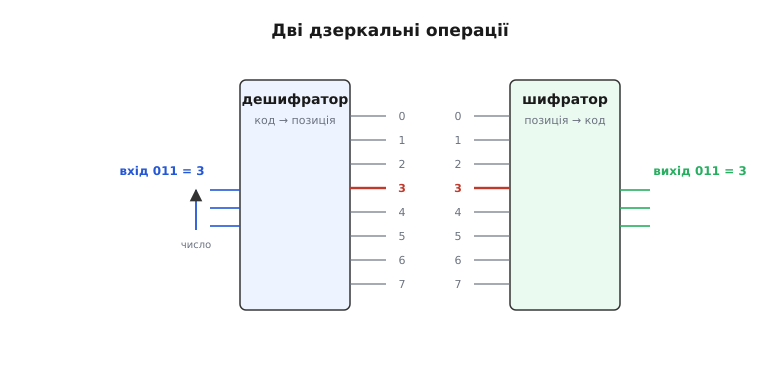
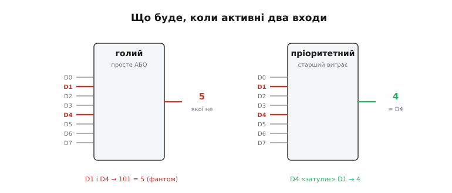

# Шифратор (енкодер)

Уявімо панель із вісьмома кнопками. Кожна кнопка — окремий дріт; натиснута замикає свій дріт у логічну одиницю, відпущена тримає нуль. Вісім кнопок — вісім дротів, і в кожну мить активний щонайбільше один із них. Тепер питання: скільки дротів насправді треба, щоб передати далі, **яку саме** кнопку натиснули?

Вісім окремих ліній — це марнотратство. Адже інформації тут зовсім мало: лишень номер активної кнопки, число від 0 до 7. А будь-яке число від 0 до 7 уміщається у **три** біти двійкового запису (бо 2³ = 8). Виходить, замість восьми дротів вистачило б трьох — якби хтось перетворював «активна лінія номер k» на «двійковий запис числа k». Саме це й робить **шифратор** (англ. *encoder* — «той, що кодує»; від *code* — «код», через лат. *codex* «звід законів», а ще раніше *caudex* — «стовбур дерева», бо перші книги-кодекси складали з навоскованих дерев'яних дощечок). Шифратор стискає позиційний сигнал — «активна одна лінія з багатьох» — у компактний двійковий код її номера.

## Найперша інтуїція: де схована інформація

Чому взагалі вісім ліній можна звести до трьох, нічого не втративши? Бо в наборі «рівно одна з восьми активна» закладено набагато менше можливостей, ніж здається. Вісім незалежних дротів могли б нести 2⁸ = 256 різних комбінацій (кожен сам по собі 0 чи 1). Та ми наклали жорстку умову: активна **завжди рівно одна**. Таких станів лишається тільки вісім — по одному на кожну лінію. А вісім станів — це три біти, не більше. Решта 248 комбінацій (дві активні, жодної активної, п'ять активних) у нашій умові просто заборонені, тож і кодувати їх не треба.

Це той самий принцип, що стоїть за будь-яким стисненням: якщо з усіх мислимих комбінацій реально трапляється лише жменька, їх можна занумерувати коротким кодом. Шифратор — найпростіший приклад цієї ідеї в залізі: він бере «розріджений» сигнал (одна гаряча лінія серед холодних) і пакує його в «щільний» (двійкове число, де працює кожен біт).

> 🔧 **Навіщо це.** Усередині мікроконтролера до контролера переривань тягнуться десятки ліній запитів — по одній від кожного таймера, UART, піна. Тримати під кожну окремий регістровий біт аж до ядра нема сенсу: ядру потрібен лише **номер** джерела, щоб стрибнути на потрібний обробник. Шифратор перетворює «спрацював запит №19» на число 19 — і процесор адресує ним таблицю векторів. Без цього стиснення кожне переривання коштувало б купи зайвих дротів і логіки.

## Шифратор — це дешифратор навпаки

Найшвидший спосіб уловити суть — поставити шифратор поряд із його дзеркальним близнюком, [дешифратором](book:electronics/combinational-circuits). Дешифратор бере трибітне число й вмикає рівно один із восьми виходів: код → позиція. Шифратор робить точно зворотне: бере вісім входів, з яких активний один, і видає трибітне число його позиції: позиція → код. Один «розгортає» компактне число у вісім ліній, другий «згортає» вісім ліній назад у число.


*Дві дзеркальні операції на одному прикладі. Зліва дешифратор: число 3 на трьох входах піднімає рівно лінію 3 з восьми. Справа шифратор: активна лінія 3 з восьми дає на виході число 3. Стрілка показує напрям перетворення — згортання й розгортання тієї самої інформації.*

Звідси одразу видно розміри. Якщо входів N = 2ⁿ, то виходів рівно n = log₂N: вісім входів дають три виходи, шістнадцять — чотири, шістдесят чотири — шість. Кожен зайвий вихідний біт подвоює кількість ліній, які шифратор уміє розрізнити. Це не випадковість, а пряма арифметика: n бітів кодують 2ⁿ різних чисел, і шифратор користується кожним із них.

## Як це збирається з вентилів

Усередині шифратор — чиста [комбінаційна схема](book:electronics/combinational-circuits): жодної пам'яті, виходи — миттєва функція входів. Щоб зрозуміти його будову, дивимось на **кожен вихідний біт окремо** й питаємо: за яких активних входів цей біт має бути одиницею?

Візьмемо шифратор 8→3 із входами D0…D7 і виходами A2 A1 A0 (A2 — старший біт). Випишемо номери у двійці:

```
активний вхід  →  A2 A1 A0
     D0        →   0  0  0
     D1        →   0  0  1
     D2        →   0  1  0
     D3        →   0  1  1
     D4        →   1  0  0
     D5        →   1  0  1
     D6        →   1  1  0
     D7        →   1  1  1
```

Тепер прочитаємо стовпці. Старший біт A2 — одиниця для D4, D5, D6, D7. Молодший A0 — одиниця для непарних номерів D1, D3, D5, D7. Середній A1 — для D2, D3, D6, D7. Кожен вихід — це просто **АБО** тих входів, у номері яких стоїть відповідна одиниця:

```
A0 = D1 OR D3 OR D5 OR D7
A1 = D2 OR D3 OR D6 OR D7
A2 = D4 OR D5 OR D6 OR D7
```

Ось і весь шифратор: три елементи [АБО](book:electronics/basic-gates), кожен на чотири входи. Жодних інверторів, жодного складного дерева — три ниточки логіки, що читають ту саму вісімку входів під різними кутами. Якщо активний, скажімо, D5, то він заведений у виходи A0 і A2, тож на виході стане 101 = 5. Логіка тривіальна рівно тому, що ми правильно поставили питання — «коли цей біт одиниця?» — для кожного виходу нарізно.

## Прихована пастка: а якщо активних дві?

Ця схема працює бездоганно, доки виконується умова «активна рівно одна лінія». Та реальний світ не питає дозволу. Що буде, якщо натиснуть **дві** кнопки одразу — скажімо, D1 і D4?

Простежмо за нашими рівняннями. D1 заведений в A0, D4 — в A2. Обидва активні, тож A0 = 1 і A2 = 1, а A1 = 0. На виході 101 = 5. Але ж ніхто не натискав D5! Шифратор видав номер кнопки, якої взагалі не торкалися — побічну суму двох справжніх. Це не дрібний недогляд, а принципова діра: проста АБО-схема механічно складає біти всіх активних входів, і їхнє накладання дає сміття.

Така сама біда з «нічого не активне». Якщо всі входи в нулях, всі три виходи теж нулі — на виході 000, тобто «номер 0». Та сам по собі цей код не відрізнити від чесного натискання D0: і там, і там 000. Шифратор бреше, що активний D0, хоча насправді мовчать усі. Обидві проблеми — два активні й жоден активний — кажуть одне: голий шифратор довіряти небезпечно, бо він не вміє розрізнити коректний вхід від некоректного.

## Пріоритетний шифратор: вирішуємо суперечку

Очевидний вихід — домовитися наперед, кого слухати, коли активних кілька. Найприродніша угода: **слухати найстарший**. Якщо разом активні D1 і D4, віддаємо перевагу D4 й видаємо 4; молодші ігноруємо. Шифратор із таким правилом зветься **пріоритетним** (англ. *priority encoder*; *priority* від лат. *prior* — «передніший, важливіший»): кожна лінія має пріоритет за своїм номером, і перемагає завжди найвищий серед активних.

Логіка трохи ускладнюється, бо тепер кожен вхід має не просто «бути активним», а ще й «не мати активних старших за себе». Для входу Dk умова участі — «Dk активний **і** всі D(k+1)…D7 неактивні». Простежмо на старшому біті A2: він має стати одиницею, тільки якщо активний хоч хтось із D4…D7, і це правило не псується нічим знизу, бо ніяких старших за D7 ліній немає. А от молодші біти вже мусять «озиратися» вгору. Наприклад, A0 = 1 для D1 лише за умови, що мовчать усі D2…D7; інакше перемагає старша лінія й диктує свій код.


*Зліва голий шифратор: активні D1 і D4 дають на виході 5 — номер кнопки, якої не торкалися. Справа пріоритетний: той самий вхід дає 4, бо D4 старший і «затуляє» D1. Кожна лінія пропускає себе далі, тільки якщо вище за неї все мовчить.*

Друга проблема — «жоден активний» — теж розв'язується, але не всередині самих A2 A1 A0, а окремим виходом. До трьох бітів коду додають сигнал-прапорець, який кажуть по-різному: *valid* («дійсний») або GS (*group select* — «груповий вибір»). Він стає активним тоді й лише тоді, коли активний бодай один вхід. Тепер «номер 0» від D0 і «нічого не натиснуто» легко розрізнити: у першому випадку код 000 **і** прапорець «дійсний» піднятий; у другому — код теж може бути 000, але прапорець опущений, тож код просто ігнорують. Без цього прапорця шифратор лишається двозначним; з ним — кожен його вихід однозначний.

> 🔧 **Навіщо це.** Саме прапорець «дійсний» робить пріоритетний шифратор придатним для каскадування й для переривань. Коли запитів немає, прапорець опущений — і вся гілка логіки «знає», що чекати нема чого, а не кидається обробляти фантомний запит №0. А в зчитуванні клавіатури той самий прапорець відрізняє «натиснуто клавішу 0» від «не натиснуто нічого» — без нього нуль був би сліпою зоною.

## Жива деталь: пріоритетний шифратор у кремнії

Цю логіку давно відлили в кремній. Класична мікросхема пріоритетного шифратора — [74148](book:electronics/encoder/api-74148.md), шифратор 8→3 із [серії 74](book:electronics/logic-74). Усередині — рівно та пріоритетна логіка, що ми зібрали: вісім входів, три біти коду, прапорець дійсності й ще пара ніжок для каскадування. Одна особливість збиває з пантелику новачків: на цьому чипі **і входи, і виходи активні-низькі** (англ. *active-low* — «активний у нулі»). Активна лінія — це 0, а не 1; на виході код теж інверсний. Тому, читаючи реальний чип, доводиться подумки перевертати рівні, але сама логіка пріоритету від цього не міняється — перемагає той самий найстарший вхід.

Дві службові ніжки, *enable input* («дозвіл входу») і *enable output* («дозвіл виходу»), дають змогу **складати** чипи в більший шифратор, не докуповуючи вентилів. Вихід дозволу одного чипа заводять у вхід дозволу наступного: поки старший чип бачить активний вхід, він «глушить» молодший, тримаючи пріоритет цілісним крізь увесь каскад. Двома такими корпусами виходить шифратор 16→4, і найстарша активна лінія перемагає в усіх шістнадцяти. Ця ідея — пріоритет, що тече згори донизу, — потім лежить в основі апаратних контролерів переривань. А сам чип буває в різних технологіях і має близьку рідню — від шифратора десяти клавіш до дзеркального дешифратора; чим ці втілення різняться й де окремому корпусу лишається місце сьогодні, показує [огляд родини цих мікросхем](book:electronics/encoder/comp-encoder-family.md).

## Worked-приклад: шифратор у прошивці

Найчастіше сьогодні шифратор живе не окремою мікросхемою, а **рядком коду**. У регістрі мікроконтролера зведено вісім (чи тридцять два) прапорців запитів — по біту на джерело. Треба знайти номер найстаршого піднятого біта: це і є пріоритетний шифратор, тільки програмний. Завдання настільки часте, що під нього є апаратна команда — «порахувати провідні нулі» (англ. *count leading zeros*, CLZ), яку компілятор вставляє одним машинним тактом.

**Умова.** У 8-бітному регістрі `flags` підняті біти запитів. Повернути номер найстаршого активного (0…7), а якщо активних немає — повернути −1 (наш прапорець «недійсно»).

:::tabs
```cpp
#include <stdint.h>

// Пріоритетний шифратор 8→3 у коді: номер найстаршого піднятого біта.
// Повертає 0…7; -1 означає «жодного активного» (прапорець valid = false).
int8_t priority_encode8(uint8_t flags)
{
    if (flags == 0)
        return -1;                 // нічого не активне → код недійсний

    int8_t code = 7;               // починаємо з найстаршої позиції
    while ((flags & (1u << code)) == 0)
        code--;                    // спускаємось, доки не знайдемо одиницю
    return code;                   // перший знайдений згори = найстарший активний
}
```
```python
# Пріоритетний шифратор 8→3 у коді: номер найстаршого піднятого біта.
# Повертає 0…7; -1 означає «жодного активного» (прапорець valid = false).
def priority_encode8(flags: int) -> int:
    if flags == 0:
        return -1                  # нічого не активне → код недійсний

    code = 7                       # починаємо з найстаршої позиції
    while (flags & (1 << code)) == 0:
        code -= 1                  # спускаємось, доки не знайдемо одиницю
    return code                    # перший знайдений згори = найстарший активний
```
:::

Простежмо за `flags = 0b00010010` (підняті біти 1 і 4, як у нашому прикладі з двома кнопками). Реєстр не нульовий, тож пропускаємо ранній вихід. `code` стартує з 7: біти 7, 6, 5 нульові — спускаємось до 4. Біт 4 піднятий → цикл спиняється, повертаємо 4. Молодший біт 1 навіть не дивимось — пріоритет старшого спрацював сам собою, бо ми йшли **згори вниз**. Саме напрям обходу й кодує правило пріоритету: хто трапився першим від старшого краю, той і переміг.

На справжньому ядрі цей цикл звели б до однієї команди. У ARM Cortex-M інструкція `CLZ` рахує нулі від старшого біта; номер найстаршого активного — це `31 − CLZ(flags)` для 32-бітного слова:

:::tabs
```cpp
// Те саме через апаратний CLZ: один такт замість циклу.
// __builtin_clz не визначений для 0 — нульовий випадок ловимо окремо.
int8_t priority_encode32(uint32_t flags)
{
    if (flags == 0)
        return -1;
    return (int8_t)(31 - __builtin_clz(flags));
}
```
```python
# Те саме через bit_length: номер найстаршого біта одним викликом.
# bit_length() для 0 дає 0 — нульовий випадок ловимо окремо.
def priority_encode32(flags: int) -> int:
    if flags == 0:
        return -1
    return flags.bit_length() - 1
```
:::

**Висновок.** Те, що в залізі було трьома елементами АБО плюс пріоритетна обв'язка, у прошивці стає однією командою. Але суть та сама: зі стану «підняті деякі біти» дістати **номер найстаршого** — і окремо знати, чи був узагалі піднятий хоч один. Шифратор не зникає в програмі — він переїжджає з кремнію в команду процесора.

## Де шифратор працює насправді

Перша й найважливіша робота — **переривання**. До контролера переривань сходяться десятки ліній запитів; коли кілька спрацьовують разом, пріоритетний шифратор миттю видає номер найважливішого, і ядро адресує цим номером таблицю векторів — стрибає прямо на потрібний обробник. Прапорець «дійсний» при цьому каже, чи є взагалі що обробляти. Уся система пріоритетів переривань у мікроконтролері виростає саме з цієї дзеркальної до дешифратора операції.

Друга класична робота — **зчитування клавіатури**. Замість тягти окремий дріт від кожної клавіші, шифратор згортає натиснуту клавішу у двійковий код одразу на вході в систему: десять клавіш — чотири дроти, а не десять. Пріоритет тут теж доречний: якщо випадково втиснули дві, схема віддасть одну певну, а не сміттєву суму. Та сама ідея масштабується до матричних клавіатур, де шифратор разом із дешифратором сканують рядки й стовпці.

Третя — **стиснення адрес і станів**. Коли треба з багатьох взаємно-виключних сигналів зробити компактний номер для подальшої обробки (індекс у таблиці, поле в пакеті, селектор режиму), шифратор — найдешевший спосіб. Він раз у раз з'являється там, де позиційне «одне з багатьох» треба перевести в щільне число, яким уже зручно рахувати.

За всіма цими застосуваннями стоїть одна думка, з якої ми почали: коли реально можливих станів мало, їх варто нумерувати коротким кодом. Шифратор — це та нумерація, втілена в найпростішу логіку; пріоритет і прапорець дійсності лише роблять її чесною там, де вхід буває неідеальним.
