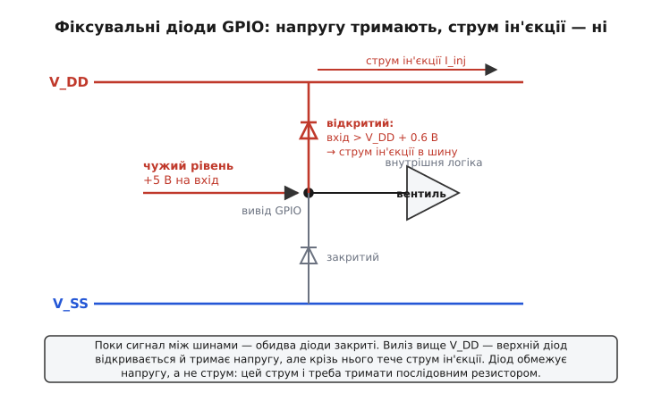
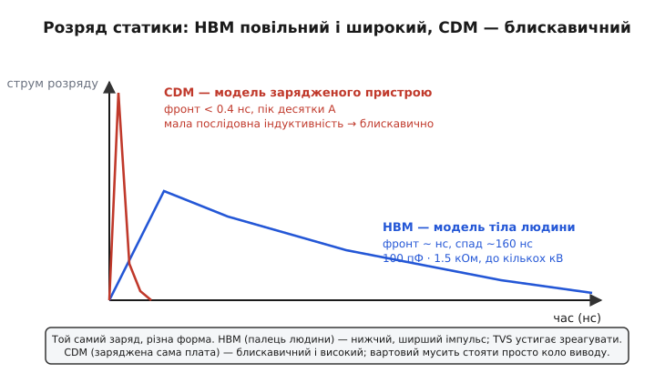
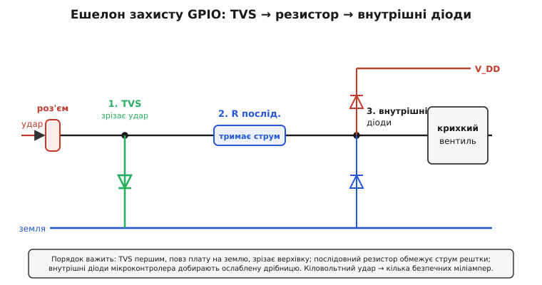

# Захист входів GPIO від перенапруги: чому цифровий вивід виживає, коли в нього б'є зовнішній світ

Вивід загального призначення (англ. *GPIO*, general-purpose input/output — вхід-вихід загального призначення) — це те місце, де чистий цифровий світ мікроконтролера торкається брудної реальності. Усередині за цим виводом стоїть крихітний КМОН-вентиль (англ. *CMOS*, complementary metal-oxide-semiconductor — комплементарна структура метал-оксид-напівпровідник): затвор завтовшки в кілька десятків атомів окису, розрахований рівно на дві напруги — «нуль» коло землі й «одиниця» коло шини живлення, скажімо 3.3 В. А ззовні до того самого виводу тягнеться доріжка на роз'єм, кнопку, давач за метром кабелю — у світ, який про той тонкий затвор не знає нічого. І час від часу цей світ подає на ніжний вивід те, чого той ніяк не чекав: розряд статики з пальця, кидок 5-вольтового сигналу на 3.3-вольтовий вхід, наведення від реле, що клацнуло поряд. Питання захисту GPIO — це питання, **як зробити, щоб цифровий кристал пережив грубість аналогового світу за роз'ємом**.

Захист входу GPIO — це набір прийомів, що **не пускають на вивід кристала напругу й струм, більші за ті, що він витримує**, відводячи надлишок убік раніше, ніж той дістанеться до вразливого вентиля. Не «зробити вхід міцнішим» — кристал не змінити, — а **поставити перед ним вартових**, які приймуть удар. Уся справа стоїть на одному спостереженні: вентиль на вході гине не від напруги взагалі, а від напруги **поза вузькими межами**, у яких його зроблено працювати. Тримай сигнал у цих межах — і вхід цілий, хоч би що коїлося на доріжці.

> 🔧 **Навіщо це.** Без захисту GPIO плата живе рівно до першого необережного дотику. Кнопка, до якої тягнеться палець; роз'єм, що стирчить назовні; вхід, куди хтось заведе датчик не того рівня, — усе це вбиває кристал, коли перед виводом немає вартового. Інженер, що написав бездоганну прошивку, але забув про захист входів, отримає партію плат, які мруть у полі від статики й переплутаних рівнів — і жоден рядок коду цього не полагодить, бо вивід гине фізично, ще до того, як процесор устигне щось прочитати.

## З чим саме б'ється цифровий вивід

Перш ніж ставити вартових, треба знати ворога. На GPIO чигають три різні напасті, і кожна вимагає свого захисту.

**Статичний розряд** (англ. *electrostatic discharge*, ESD) — головний і найпідступніший ворог цифрового виводу, бо невидимий. Людина, пройшовшись синтетичним килимом, накопичує на собі **кілька кіловольтів**; торкнувшись роз'єму, вона за частку наносекунди зливає цей заряд у вивід. Напруга колосальна — тисячі вольтів проти робочих трьох, — але заряду мало й триває все мізерну мить. Проте цієї миті досить, щоб пробити тонкий окис затвора наскрізь, як блискавка пробиває повітря. Розряд має фронт **менш як наносекунду**, тож вартовий проти ESD мусить бути **дуже швидким** — повільний його просто не наздожене.

**Перенапруга від чужого рівня** (англ. *overvoltage*) — коли на вхід приходить напруга **вища за шину живлення**. Класика: 5-вольтова логіка (старіший давач, інша плата) заводить свій сигнал на 3.3-вольтовий вхід. Для 5-вольтового виводу «одиниця» — це 5 В, а для нашого кристала все, що вище 3.3 В плюс трохи, — уже поза межею. Сюди ж — переплутана полярність, сигнал не того стандарту на клемі, залишкова напруга на лінії, коли давач живиться, а мікроконтролер — ще ні.

**Наведення й кидки** (англ. *transient*, *inrush*) — комутаційні викиди від реле й двигунів поряд, наведені в довгий кабель; кидок при ввімкненні, коли напруги на різних вузлах злітають не одночасно. Коротка, але гостра шпилька, що на мить виносить вивід за межу.

Спільна нитка в усіх трьох одна: десь поза вузьким діапазоном, у якому вхід зроблено працювати, з'являється напруга — і якщо дати їй дістатися кристала, вона його вб'є. Тому весь захист зводиться до двох дій: **не пустити напругу за межі** й **не пустити струм понад дозволений**. Погляньмо спершу, звідки ці межі беруться.

## Звідки межі: абсолютна гранична напруга

У даташиті будь-якого мікроконтролера є розділ, який читають **першим**, хоч надрукований він дрібним, — «абсолютні граничні параметри» (англ. *absolute maximum ratings*). Це не робочі значення, а **межа виживання**: напруги й струми, перевищення яких вивід уже **псує**, нехай навіть не одразу. І найважливіший рядок там — допустима напруга на GPIO.

Майже завжди вона записана дивною на перший погляд формулою: напруга на виводі не має виходити за межі **(V_SS − 0.3 В) … (V_DD + 0.3 В)**. Тобто вивід вільно ходить між землею (V_SS) і шиною живлення (V_DD) — і трохи за них, рівно на 0.3 В. Звідки ця межа й чому саме близько третини вольта? Бо всередині кожного цифрового кристала вивід уже захищений — **двома діодами на шини живлення**. Поки сигнал між шинами, ці діоди закриті й їх ніби немає. Щойно сигнал лізе вище V_DD (або нижче V_SS) на пряме падіння діода — діод відкривається. Ці 0.3 В у даташиті й є натяк, що всередині сидять діоди й що з ними слід рахуватися.

> 🔧 **Навіщо це.** Рядок «absolute maximum» — це контракт із виробником: тримай вивід у цих межах, і кристал житиме; вийди за них — і гарантій більше немає. Він не каже «тут вивід працює добре» (для цього є інший рядок — «робочий діапазон»). Він каже «за цією рискою я починаю вмирати». Весь захист GPIO — це інженерна обіцянка ніколи не дати сигналу на виводі переступити цю риску, хоч би що подавав зовнішній світ.

## Перший вартовий: фіксувальні діоди, що вже в кристалі

Найприродніший спосіб не пустити напругу за межі вже придумали й **вбудували в самі мікросхеми**. Ідея проста до краси. Від кожного виводу йдуть **два діоди**: верхній — катодом до шини V_DD, нижній — анодом до землі V_SS. Простежмо, що вони роблять.

Поки сигнал десь **між** шинами — а так і має бути в нормальній роботі, — обидва діоди під зворотною напругою й **закриті**. Вони ніби відсутні: логіка читає рівень, сигнал тече собі у вентиль. Та щойно напруга на виводі полізла **вище** V_DD приблизно на 0.6 В, верхній діод **відкривається** — і стікає надлишок струму просто в шину живлення. Вузол «пришпилюється» до V_DD: вище за шину плюс пів вольта він піднятися не може, бо весь зайвий струм іде в діод. Так само знизу: провалилась напруга нижче землі — відкривається нижній діод і **підтягує** вузол із V_SS, не даючи піти глибше. Тому ці діоди й звуть **фіксувальними** (англ. *clamp* — затиск, *clamping diodes*): вони **затискають** напругу на виводі в коридорі «трохи ширшому за шини».


*Поки сигнал між V_SS і V_DD, обидва діоди закриті — вивід їх «не бачить». Виліз вище V_DD на ~0.6 В — верхній діод відкривається й стікає надлишок у шину живлення; провалився нижче землі — нижній підтягує вузол. Напруга на виводі фізично не може вийти за коридор «шина ± 0.6 В», але крізь відкритий діод при цьому тече струм ін'єкції.*

Ці діоди стоять у кристалі **не завжди навмисно**. Сама технологія КМОН створює на кожному виводі паразитні p-n переходи на підкладку — готові фіксувальні діоди, хочемо ми того чи ні. Виробник це знає й **доповнює** їх спеціальними осередками захисту від статики просто біля контактної площадки. Тому майже кожен GPIO **уже захищений** від помірної перенапруги — самим фактом, що він із кремнію. Лишається одне питання, і воно вирішальне.

## Чому самих діодів мало: струм ін'єкції

Діод чудово тримає **напругу** — пришпилює вузол до шини, і вище не пустить. Але візьміть до уваги, **скільки струму** при цьому крізь нього тече. Струм, що вливається у вивід і стікає крізь фіксувальний діод у шину, звуть **струмом ін'єкції** (англ. *injection current*) — його ніби «впорскують» у кристал ззовні.

Уявімо, що на 3.3-вольтовий вхід сів 5-вольтовий сигнал напряму. Верхній діод відкрився й пришпилив вузол до ~3.9 В. Чудово, напруга майже в межах. Але різницю **5 − 3.9 = 1.1 В** треба десь спалити, і падає вона на тому, що стоїть **перед** діодом. Якщо перед діодом нічого немає — лише доріжка з мізерним опором, — то за законом Ома крізь діод піде струм, обмежений хіба опором доріжки й джерела: десятки, а то й сотні міліампер. Тонкий внутрішній діод, зроблений на кілька міліампер, згорить.

У даташитах це записано як абсолютну межу струму ін'єкції — типово **±5 мА на вивід** (у деяких мікроконтролерів менше, надто для «нестандартних» виводів; точне число завжди в даташиті). Рядок цей — теж натяк: якщо допустимий струм виміряний кількома міліамперами, значить, усередині сидять діоди, і їх легко спалити. Діод скаже «напрузі — стоп», але не скаже «струму — стоп». А палить саме струм.

Та є в цифрового кристала загроза страшніша за просто згорілий діод — і саме вона робить струм ін'єкції в КМОН смертельно небезпечним.

## Найгірше: засувка, що замикає живлення

У структурі КМОН поряд лежать транзистори двох типів, і разом вони мимоволі утворюють **паразитний чотиришаровий прилад** — тиристор (структура p-n-p-n, той самий, що в керованих випрямлячах). У нормі він спить. Але струм ін'єкції, що ти впорснув крізь фіксувальний діод, здатен його **розбудити**: досить перевищити шину десь на 0.3–0.5 В, щоб у паразитну базу пішов струм і тиристор **замкнувся**. А замкнувшись, він утворює **коротке коло між шиною живлення й землею** — і, головне, **не розмикається**, навіть коли шпилька на вході давно зникла. Крізь кристал ллється струм, обмежений лише блоком живлення; чип за секунди вигорає. Це явище звуть **засувкою**, або латч-апом ([англ. *latch-up* — «замикання на засув»; ця вроджена хвороба КМОН має власну драматичну історію](topic:electronics/power-sequencing/hist-latchup.md)).

Ось чому струм ін'єкції в цифровому виводі небезпечніший, ніж в аналоговому. Там надмірний струм спалить діод — прикро, але локально. Тут він може **клацнути засувку** й убити весь кристал коротким замиканням шин. Тому межу струму ін'єкції на GPIO поважають особливо: вона стереже не лише діод, а й від паразитного тиристора, що чигає під ним.

> 🔧 **Навіщо це.** Це найголовніша й найменш очевидна думка всього захисту GPIO: **діод обмежує напругу, але не обмежує струм** — струм мусить обмежити щось інше. А в КМОН надмірний струм ін'єкції не просто палить діод, а ризикує замкнути живлення накоротко через засувку. Інженер-початківець бачить «на вході є захисні діоди» й заспокоюється. Дарма: якщо джерело здатне влити струм, голі діоди не врятують — вони згорять першими або, гірше, розбудять тиристор. Захист GPIO майже ніколи не зводиться до самих діодів; поряд мусить стояти той, хто **тримає струм**.

## Другий вартовий: послідовний резистор

Якщо діод не обмежує струм, поставмо перед ним того, хто обмежить. Найпростіший — **резистор у розрив доріжки**, послідовно з входом. Погляньмо, що змінюється.

Резистор за законом Ома перетворює **різницю напруг** на **струм**: яка напруга на ньому впала, такий струм крізь нього й тече. Поставмо перед виводом послідовний резистор R_s і повернімося до нашої аварії: на 3.3-вольтовий вхід сіли 5 В, верхній діод пришпилив вузол до ~3.9 В. Тепер різниця 5 − 3.9 = 1.1 В падає **на резисторі**, а не жене крізь діод нестримно. Струм виходить керований:

**Умова: на вхід із R_s = 1 кОм сів 5-вольтовий сигнал; V_DD = 3.3 В, пряме падіння діода ≈ 0.6 В.**

```
Напруга на виводі (пришпилена діодом):
  V_pin = V_DD + 0.6 = 3.3 + 0.6 = 3.9 В

Різниця, що падає на резисторі:
  ΔV = 5.0 − 3.9 = 1.1 В

Струм ін'єкції крізь діод:
  I_inj = ΔV / R_s = 1.1 / 1000 = 1.1 мА
```

**Висновок:** 1.1 мА проти дозволених ~5 мА — з добрим запасом. Внутрішній діод відводить цей мізер спокійно, засувка не прокидається, кристал цілий. А без резистора той самий 5-вольтовий сигнал загнав би крізь діод десятки міліампер і спалив би вивід. Один резистор ціною в копійку перетворює аварію на буденність. Обираючи R_s, рахуй від **найгіршого** джерела, яке може сісти на вхід, і бери струм ін'єкції з добрим запасом нижче даташитної межі.

Резистор не безкоштовний: разом із паразитною ємністю входу він утворює RC-ланку, що **сповільнює фронт** сигналу. Для повільних входів — кнопки, реле — це байдуже. Для швидкого інтерфейсу (SPI на десятки мегагерців) завеликий R_s розмиє фронти так, що дані попливуть, тож там резистор беруть невеликий (десятки-сотні ом) і думають про баланс. Це той компроміс, який кожен інженер зважує сам.

## Третій вартовий: TVS-діод на роз'ємі

Внутрішні діоди й послідовний резистор чудово тримають **повільну** перенапругу від чужого рівня. Та проти ESD-розряду з пальця вони заслабкі: заряд приходить із фронтом менш як наносекунда, і поки хвиля дійде крізь резистор до внутрішнього діода, тонкий затвор уже може бути пробитий. Швидкому ворогові — швидкий вартовий, і ставлять його **якнайближче до роз'єму**, щоб перехопити розряд ще на вході, до вразливого кристала.


*Той самий накопичений заряд б'є двома дуже різними формами. Розряд із пальця людини (HBM) — нижчий і ширший, тягнеться сотні наносекунд, і зовнішній вартовий устигає його перехопити. Розряд самої зарядженої плати (CDM) вкладається в частку наносекунди й дає високий пік — тому вартовий мусить стояти просто коло виводу, інакше не встигне.*

Цей вартовий — **діод-обмежувач викидів** (англ. *TVS*, transient voltage suppressor — обмежувач перехідної напруги). Це особливий лавинний діод: поки напруга нижча за його **робочу межу** (англ. *standoff voltage* — напруга, яку він тримає закритим), він у високоомному стані й лінії не заважає. Щойно шпилька перевищує цю межу, діод **лавинно** відкривається за пікосекунди й пропускає крізь себе величезний струм розряду — десятки ампер, — фіксуючи напругу на виводі на своїй **напрузі фіксації** (англ. *clamping voltage*). Простими словами: TVS сидить тихо, поки все гаразд, а на удар статики миттєво замикає його на землю повз кристал.

Ключ до вибору TVS — дві його напруги мусять лягти правильно навколо робочого діапазону:

```
робочий сигнал  <  V_standoff  <  V_clamp  <  абсолютна межа входу
      3.3 В      <    напр. 4 В  <   ~9 В    <   що витримує кристал
```

Робоча межа (standoff) — **вище** найбільшого нормального рівня, інакше TVS відкриється на корисному сигналі й з'їсть його. Напруга фіксації (clamp) — **нижче** абсолютної межі входу, інакше кристал устигне померти раніше, ніж TVS його врятує. Проміжок між цими двома напругами й є вікно, у якому TVS робить свою роботу. Для швидких ліній беруть ще й TVS із **малою власною ємністю** — інакше він, як конденсатор на лінії, зіпсує фронти не гірше за резистор.

> 🔧 **Навіщо це.** Внутрішні діоди мікроконтролера розраховані на «побутову» статику, що набралась на самій платі під час монтажу, — модель зарядженого пристрою. Але розряд із пальця людини, що взялася за роз'єм (модель тіла людини — [англ. *HBM*, human body model](topic:electronics/esd-gpio-protection/hist-esd-models.md)), несе набагато більше заряду, і внутрішні осередки на нього не розраховані. Тому будь-який вивід, що йде **назовні через роз'єм**, — на кнопку панелі, на зовнішній кабель, на клему, — потребує TVS просто біля роз'єма. Виводи, що ходять лише в межах плати, обходяться внутрішнім захистом. Правило просте: **де вивід торкається зовнішнього світу, там TVS**.

## Скільки їх треба й у якому порядку

Три вартові — послідовний резистор, TVS на роз'ємі та внутрішні фіксувальні діоди — працюють не поодинці, а **разом**, ешелоном, і порядок їхній не випадковий. Простежмо шлях розряду від роз'єма до кристала.

Удар приходить на роз'єм. Першим його зустрічає **TVS** — просто на вході, з найкоротшими доріжками до землі: він миттєво зрізає верхівку розряду, скидаючи основну енергію повз плату. Те, що прослизнуло крізь TVS, натикається на **послідовний резистор**, який обмежує струм рештки. І аж наприкінці цей ослаблений, обмежений за струмом залишок доходить до **внутрішніх діодів**, яким тепер лишається дрібниця, з якою вони легко впораються. Кожен вартовий знімає свою частку, а разом вони перетворюють кіловольтний удар на кілька безпечних міліампер.


*Розряд іде зліва направо. TVS біля роз'єма зрізає основну енергію на землю; послідовний резистор обмежує струм того, що прослизнуло; внутрішні фіксувальні діоди мікроконтролера добирають ослаблену решту. Порядок важить: TVS — першим, повз плату; резистор — між ним і кристалом.*

Порядок ешелону — це і є суть. TVS перед резистором, а не за ним: інакше повз резистор основний струм розряду пішов би просто в кристал. Резистор між TVS і виводом: він добиває струм для внутрішніх діодів. Не кожен вивід потребує всіх трьох — внутрішній вивід між мікросхемами на платі живе й на самому внутрішньому захисті, — але вивід, що торкається зовнішнього світу, вартий повного ешелону.

## Що може й чого не може прошивка

Тут криється пастка, у яку легко впасти саме програмісту. **Прошивка не захищає вивід електрично**. Розряд статики б'є за наносекунди — процесор за цей час не встигне навіть прокинутися, не те що зреагувати. Захист входу — це залізо: діоди, резистор, TVS. Жоден рядок коду не врятує вивід, перед яким немає фізичного вартового.

Та прошивка може **не нашкодити** й дещо **пом'якшити наслідки**. Три речі варто тримати в голові.

**Не жени вивід проти пришпиленого сигналу.** Якщо GPIO налаштований на вихід і жене «нуль», а ззовні на нього сів високий рівень, вивід опиниться в боротьбі напруг — потече наскрізний струм, як у короткому замиканні. Тому вивід, куди може прийти чужий рівень, тримай **входом**, а не виходом:

```c
// Вивід, куди може прийти зовнішній рівень: тримаємо його входом,
// а не виходом — щоб не жати проти чужого сигналу й не палити
// драйвер наскрізним струмом.
GPIOA->MODER &= ~(0x3u << (2 * pin));   // 00 = режим входу
GPIOA->PUPDR &= ~(0x3u << (2 * pin));   // без внутрішньої підтяжки:
                                        // зовнішній вартовий сам задасть рівень
```

**Не лишай вхід у повітрі.** Вхід КМОН має величезний опір; неприєднаний, він «ловить» наводки й плаває біля порогу, а вентиль на вході через це може відкритись напівдорозі й грітися. Плаваючий вхід ще й чутливіший до статики. Тому невживані виводи прив'язують — зовнішнім резистором або внутрішньою підтяжкою:

```c
// Невживаний вхід не лишаємо в повітрі — вмикаємо внутрішню
// підтяжку донизу, щоб рівень був визначений, а вентиль не плавав
// біля порогу й не ловив наводки.
GPIOA->PUPDR &= ~(0x3u << (2 * pin));
GPIOA->PUPDR |=  (0x2u << (2 * pin));   // 10 = підтяжка донизу (pull-down)
```

**Знай про засувку.** Якщо кристал усе-таки клацнув засувку від сильної шпильки й почав грітися та жерти струм, вивести його з цього стану можна **лише повним зняттям живлення** — тиристор не розмикається інакше. Прошивка засувку не знімає; але добра система вміє помітити аномальне споживання й **перезапустити живлення** зовнішнім ключем, урятувавши кристал від вигоряння. Це вже не захист входу, а страховка на випадок, коли захист пробило.

> 🔧 **Навіщо це.** Межа відповідальності проходить чітко: **залізо стереже вивід від смерті, прошивка — від дурниць**. Програміст, який думає, що «оброблю перенапругу в коді», втратить кристали — код фізично не встигає. Але програміст, що жене вивід проти чужого рівня, лишає входи в повітрі й не думає про засувку, зведе нанівець і найкращий залізний захист. Обидва шари потрібні, і кожен робить лише своє.

## Суть

Цифровий вивід гине не від напруги взагалі, а від напруги поза вузькими межами, у яких його зроблено працювати, — і особливо від струму, що при цьому в нього вливається. Абсолютна гранична напруга «V_SS − 0.3 … V_DD + 0.3» — це риска виживання й натяк на внутрішні фіксувальні діоди. Ті діоди тримають напругу, але не струм; а надмірний струм ін'єкції в КМОН здатен не лише спалити діод, а й клацнути паразитну засувку, що замкне живлення накоротко. Тому справжній захист — це ешелон: TVS біля роз'єма зрізає швидкий удар статики, послідовний резистор тримає струм у безпечних міліамперах, внутрішні діоди добирають ослаблену решту. Прошивка виводу не рятує — рятує залізо; але прошивка не мусить шкодити: не жени вивід проти чужого рівня, не лишай входи в повітрі, знай, що засувку знімає лише перезапуск живлення. Захист GPIO — це різниця між платою, що «працює на столі», і платою, що працює там, куди її привезли.
