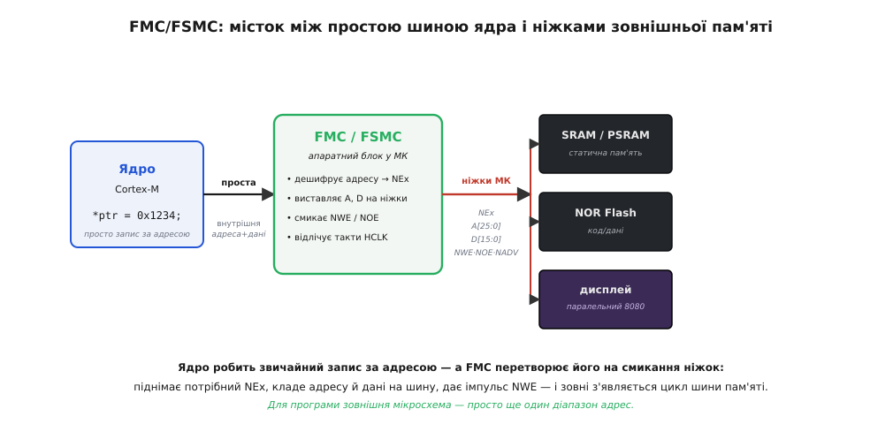
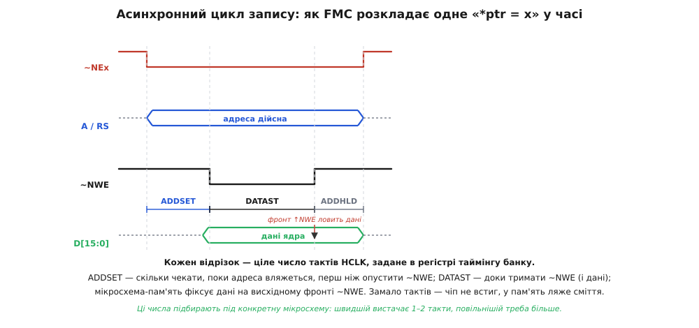

# Інтерфейс зовнішньої пам'яті (FMC/FSMC)

Уявімо мікроконтролер, якому раптом забракло пам'яті. Внутрішньої статичної пам'яті (SRAM) на кристалі — десятки чи сотні кілобайтів, а нам треба кадровий буфер на кольоровий екран (це вже мегабайти) або великий масив даних. На платі поруч лежить дешева мікросхема зовнішньої пам'яті — SRAM, псевдостатична PSRAM чи NOR-флеш — із класичною **паралельною шиною**: жмут ліній адреси, жмут ліній даних і кілька сигналів керування. Питання просте: як пришити її до процесора?

Здавалося б, з'єднай ніжки — і працюй. Але тепер придивімося, що означає прочитати з такої мікросхеми **один** байт. Треба виставити на два десятки ліній адреси потрібне число, витримати, поки воно вляжеться, опустити лінію «читаю», зачекати рівно стільки, скільки треба цій мікросхемі, зчитати вісім (чи шістнадцять) ліній даних і підняти лінію назад — і все це з точністю до наносекунд. Робити це з програми, смикаючи ніжки [GPIO](topic:electronics/gpio-expander) по одній, — божевілля: на кожен байт пішли б десятки інструкцій, а швидкість впала б у сотні разів. Тому в процесорах, розрахованих на зовнішню пам'ять, ставлять окремий апаратний блок, що робить усю цю чорну роботу сам. У світі STM32 його звуть **FMC** — *Flexible Memory Controller* (гнучкий контролер пам'яті), а в старіших і простіших чипах — **FSMC**, *Flexible Static Memory Controller* (гнучкий контролер **статичної** пам'яті). Це той міст, яким велика зовнішня мікросхема під'єднується до ядра так, наче вона — рідна пам'ять процесора.

## Головна ідея: пам'ять як діапазон адрес

Уся суть FMC вміщується в одну думку: він робить зовнішню мікросхему **частиною адресного простору** процесора. Ви пишете у своєму коді звичайне

```c
volatile uint16_t *ext = (uint16_t *)0x60000000;
*ext = 0x1234;                 // запис у зовнішню SRAM
uint16_t v = *ext;             // читання звідти ж
```

— і все. Ядро виконує звичайнісіньку інструкцію запису за адресою, гадки не маючи, що за цією адресою сидить не внутрішня пам'ять, а мікросхема на іншому кінці плати. FMC перехоплює це звернення, бачить, що адреса потрапляє в його діапазон, і **перекладає** просту дію ядра на мову паралельної шини: піднімає потрібний вибір кристала, кладе адресу на ніжки адреси, дані — на ніжки даних, дає імпульс на лінії запису й прибирає все назад. Зовні на ніжках народжується повноцінний цикл шини пам'яті — а програміст написав один рядок.


*Ліворуч ядро говорить просто: «запиши слово за адресою». Ця проста внутрішня шина заходить у блок FMC, а той перетворює звернення на смикання реальних ніжок: піднімає вибір кристала (~NEx), виставляє адресу (A) і дані (D), дає імпульс запису (~NWE). До тих самих ніжок паралельно висять кілька зовнішніх мікросхем — статична пам'ять, флеш, навіть паралельний дисплей; вибір кристала будить рівно одну. Для коду кожна з них — просто ще один діапазон адрес.*

Цей прийом — коли зовнішній пристрій прикидається пам'яттю й живе на [адресній мапі](topic:electronics/address-decoding) поряд зі справжніми комірками — зветься **відображенням у пам'ять** (англ. *memory-mapped* — «відображений у пам'ять»). Його велика зручність у тому, що з мікросхемою працюють тими самими командами читання-запису, що й зі звичайною пам'яттю: жодних спеціальних інструкцій, жодного протоколу в коді. Компілятор, покажчики, `memcpy`, масиви — усе працює із зовнішньою пам'яттю точно так, як із внутрішньою. Уся різниця в тому, що по дорозі стоїть перекладач.

> 🔧 **Навіщо це.** Саме через цей блок відповідають на часте запитання новачка: «чому не можна просто припаяти зовнішню мікросхему пам'яті до ніжок і читати її з програми?». Можна — але лише через FMC, і лише в тих процесорах, де він є. Плануючи пристрій із великим екраном чи об'ємним буфером даних, першим ділом дивляться не на саму мікросхему пам'яті, а на те, чи має обраний мікроконтролер інтерфейс зовнішньої пам'яті. Немає такого блоку на кристалі — немає й простого способу підключити зовнішню паралельну пам'ять.

## Що означають слова «гнучкий» і «статичний»

Назва не випадкова. «Гнучкий» (англ. *flexible* — «гнучкий, пристосовний») — бо той самий блок уміє говорити з **різними** видами паралельної пам'яті, а не з одним. Його налаштовують під конкретну мікросхему: скільки ліній даних (8 чи 16), який тип пам'яті, які паузи. Один блок — багато різних мікросхем, звідси й «гнучкий».

А слово «статичний» окреслює **межу** можливостей FSMC — і саме тут криється різниця між двома назвами. **Статична** пам'ять — та, що тримає записане, поки є живлення, і не потребує обслуговування: [SRAM](topic:electronics/memory-hierarchy), псевдостатична PSRAM, [NOR-](topic:electronics/emmc-ssd) та NAND-флеш. Виставив адресу — одразу отримав дані, жодних періодичних оновлень. Із такими мікросхемами й працює FSMC. А ось **динамічна** пам'ять — [SDRAM і DDR](topic:electronics/sdram-ddr) — влаштована зовсім інакше: її комірки — крихітні конденсатори, що течуть, тож їх треба безперервно **регенерувати**, слати команди «відкрити ряд», «читати стовпець» із точними паузами й ще й правильно ініціалізувати при вмиканні. Це складний протокол, якого простий статичний контролер не знає.

Тому в старіших і скромніших чипах (де ставили лише статичну пам'ять) блок звали **FSMC** — статичний. А в потужніших процесорах, куди додали ще й підтримку динамічної SDRAM, з назви прибрали слово «статичний»: вийшов **FMC**, просто «контролер пам'яті», бо він тепер уміє і статику, і динаміку. Різниця між FSMC і FMC — саме в цьому: FMC — це FSMC плюс окремий вбудований [контролер SDRAM](topic:electronics/memory-controller). Обидва працюють за одним принципом «пам'ять як діапазон адрес»; FMC просто вміє більше.

> 🔧 **Навіщо це.** Практичний висновок: якщо в даташиті вашого процесора написано **FSMC**, то до нього можна підключити статичну пам'ять (SRAM, PSRAM, флеш) і паралельні дисплеї — але **не** SDRAM/DDR. Хочете велику й дешеву динамічну пам'ять — шукайте чип із повним **FMC**, де є контролер SDRAM. Це рішення ухвалюють на самому початку, обираючи мікроконтролер, бо переробити його потім не вийде.

## Адресна мапа й вибір кристала

Щоб кілька мікросхем ужилися на одній шині, кожній потрібне своє **вікно адрес** і свій сигнал-дозвіл. FMC роздає їх апаратно. Уся зовнішня пам'ять у STM32 живе, починаючи з адреси **0x6000_0000**: щойно ядро звертається кудись у цей простір, FMC розуміє, що йдеться про зовнішню мікросхему, а не про внутрішню пам'ять (яка сидить на нижчих адресах). Це найстарші біти адреси — вони вмикають зовнішню пам'ять узагалі.

Далі FMC ділить банк статичної пам'яті (NOR/PSRAM) на **чотири** рівні підвікна по 64 мебібайти, кожне зі своїм окремим виводом **вибору кристала** (англ. *chip select*, ~NE1…~NE4 — «вибір мікросхеми», активний-низький). Який саме вивід підніметься, вирішують два наступні біти адреси, A[27:26]:

```
адреса        A[27:26]   вивід    типовий мешканець
0x6000_0000     00       ~NE1     зовнішня SRAM / PSRAM
0x6400_0000     01       ~NE2     NOR-флеш
0x6800_0000     10       ~NE3     паралельний дисплей
0x6C00_0000     11       ~NE4     (вільно)
```

![Вікно 0x6000_0000 ділиться бітами A[27:26] на чотири вибірки кристала ~NE1…~NE4, а сама адреса розпадається на поля](/book/electronics/digital/external-memory-interface/img/memmap.svg)
*Уся зовнішня пам'ять починається з 0x6000_0000. Старші біти адреси (0110) кажуть «це зовнішня пам'ять узагалі», наступні два біти A[27:26] обирають, який із чотирьох виводів ~NEx підняти, а молодші біти йдуть усередину обраної мікросхеми на вибір комірки. Записав за адресою 0x6800_0000 — активувався ~NE3, і цикл пішов саме до дисплея. Чотири підвікна — це чотири окремі мікросхеми на одній спільній шині даних, що озиваються по черзі.*

Придивившись, ви впізнаєте тут звичайну [адресну дешифрацію](topic:electronics/address-decoding): старші біти вибирають мікросхему, молодші — комірку в ній. FMC просто робить її апаратно й наперед, зашивши в залізо, що вікно ~NE1 починається з 0x6000_0000, ~NE2 — з 0x6400_0000 і так далі. Вам лишається під'єднати вивід ~NE потрібної мікросхеми до її входу вибору кристала й звертатися за відповідними адресами. Дані ж усіх мікросхем висять на **спільних** лініях — тому кожна мусить мати вихід у [третьому стані](topic:electronics/tri-state-output): поки її ~NE не активний, вона тримає лінії даних відпущеними ([Hi-Z](topic:electronics/hi-z-state)), щоб не заважати сусідам. Вибір кристала й гарантує, що в кожен момент віддає дані рівно одна.

## Серце інтерфейсу — таймінги

Тепер найважливіше для практики. Виставити адресу й смикнути лінію запису — замало; треба зробити це **в правильні моменти часу**, бо зовнішня мікросхема реагує не миттєво. У неї є свої мінімальні часи: скільки чекати, поки вона «побачить» адресу, скільки тримати сигнал запису, коли з'являться дані при читанні. Ці числа — фізична властивість конкретної мікросхеми, вони записані в її даташиті в наносекундах. Завдання FMC — витримати їх точно.

Найпростіший режим FMC — **асинхронний** (англ. *asynchronous* — «без спільного такту»): мікросхемі не подають тактового сигналу, а всі часи FMC відлічує **тактами свого внутрішнього годинника HCLK**. Розгляньмо, як FMC розкладає в часі одне звернення на запис.


*Одне «*ptr = x», розкладене в часі. Спершу FMC опускає вибір кристала ~NEx і виставляє адресу — і чекає фазу ADDSET, поки адреса вляжеться на лініях. Тоді опускає строб запису ~NWE й тримає його разом із дійсними даними всю фазу DATAST. На висхідному фронті ~NWE мікросхема-пам'ять фіксує дані в комірку. Наостанок фаза ADDHLD ще трохи тримає адресу, перш ніж усе прибрати. Кожен відрізок — ціле число тактів HCLK; замало тактів — мікросхема не встигне, і в пам'ять ляже сміття.*

Три відрізки з цієї діаграми — головні налаштування будь-якого асинхронного банку FMC, і вони мають говірні назви:

- **ADDSET** (англ. *address setup* — «встановлення адреси») — скільки тактів чекати після виставлення адреси, перш ніж почати сам доступ. Дає адресним лініям устоятися.
- **DATAST** (англ. *data phase* / *data setup* — «фаза даних») — скільки тактів тримати активним строб (~NWE при записі, ~NOE при читанні). Це те головне вікно, протягом якого дані дійсні: мікросхема мусить устигнути прийняти їх (при записі) або виставити (при читанні).
- **ADDHLD** (англ. *address hold* — «утримання адреси») — додаткова пауза утримання адреси; потрібна лише в мультиплексованому режимі (про нього — трохи далі), у простому найчастіше нуль.

Загальна тривалість одного доступу — це сума фаз, помножена на період HCLK. Швидкій мікросхемі вистачає одного-двох тактів DATAST; повільнішій треба більше. Ось звідки береться час доступу:

**Скільки триває доступ до повільної SRAM.** Хай HCLK = 100 МГц (період 10 нс), а мікросхема пам'яті вимагає, щоб дані трималися щонайменше 55 нс. Скільки тактів DATAST задати?

```
період HCLK        = 1 / 100 МГц      = 10 нс
потрібно тримати   ≥ 55 нс
тактів DATAST      = ceil(55 / 10)    = 6 тактів   (6 × 10 = 60 нс ≥ 55 нс)
плюс ADDSET        = 1 такт                        (адресі досить устоятися)
повний доступ      ≈ (1 + 6) × 10 нс  = 70 нс      → близько 14 млн доступів/с
```

Висновок: п'ять тактів дали б лише 50 нс — менше за потрібні 55, мікросхема не встигла б, і читалося б сміття. Тому округлюємо **вгору**: шість тактів, 60 нс, із запасом. Завелика пауза лише сповільнить обмін, замала — зламає дані; тому таймінги підбирають під даташит конкретної мікросхеми, беручи найближче ціле число тактів **не менше** за потрібний час.

Тепер покажемо в коді, як ці числа потрапляють у FMC й що бачить програма. Регістри FMC у STM32 звуть `FSMC_BCRx` (тип пам'яті, ширина шини, увімкнення банку) і `FSMC_BTRx` (самі таймінги — поля ADDSET, DATAST, ADDHLD). Налаштувавши їх один раз при старті, далі працюють простими покажчиками.

**Умова.** Підключено 16-бітну зовнішню SRAM на вивід ~NE1 (вікно з 0x6000_0000). Треба ввімкнути банк, задати таймінги під повільну мікросхему й записати-прочитати комірку.

```c
#include <stdint.h>

// Спрощені адреси регістрів банку 1 FMC (у реальному коді — з CMSIS-заголовка МК).
#define FSMC_BCR1  (*(volatile uint32_t *)0xA0000000)  // керування банком
#define FSMC_BTR1  (*(volatile uint32_t *)0xA0000004)  // таймінги банку

void ext_sram_init(void) {
    // BTR: ADDSET = 1 такт (біти 0..3), DATAST = 6 тактів (біти 8..15).
    FSMC_BTR1 = (1u << 0) | (6u << 8);

    // BCR: MTYP=00 (SRAM), MWID=01 (16 біт, біти 4..5), MBKEN=1 — увімкнути банк (біт 0).
    FSMC_BCR1 = (0u << 2) | (1u << 4) | (1u << 0);
}

void ext_sram_demo(void) {
    // Зовнішня SRAM тепер — просто масив за адресою 0x6000_0000.
    volatile uint16_t *sram = (uint16_t *)0x60000000;

    sram[0]   = 0xBEEF;          // FMC сам зробить цикл запису на ніжках ~NE1/~NWE
    sram[100] = 0x1234;
    uint16_t back = sram[0];     // а це — цикл читання (~NE1/~NOE); back == 0xBEEF
    (void)back;
}
```

Уся складність — у чотирьох рядках ініціалізації; після них зовнішня SRAM невідрізнима від звичайного масиву. `sram[100] = 0x1234` розгортається апаратно у весь той танець із діаграми: FMC опускає ~NE1, кладе на ніжки адресу (базова + зміщення 100), витримує ADDSET, опускає ~NWE, тримає його й дані шість тактів DATAST, піднімає — мікросхема фіксує число. Програміст цього не бачить і не пише; він лише один раз згодував FMC правильні числа таймінгів.

> 🔧 **Навіщо це.** Найчастіша причина, чому самозбірна плата із зовнішньою пам'яттю «майже працює» — саме таймінги. Задали замало тактів DATAST (понадіялися на «швидку» мікросхему, а вона повільніша) — і зчитуються то правильні, то биті дані, залежно від температури й екземпляра; такий плаваючий збій ловиться днями. Тому перше, що роблять при дивній поведінці зовнішньої пам'яті, — беруть даташит мікросхеми, знаходять її мінімальні часи й перевіряють, що фази FMC дають **не менше**. Це пряма економія годин налагодження.

## Мультиплексування адреси й даних

Паралельна пам'ять пожирає ніжки: 16 ліній даних плюс 20 з гаком ліній адреси — уже за сорок виводів лише на шину. Для економних корпусів це багато. Тому FMC вміє **мультиплексувати** адресу й дані — гнати їх по одних і тих самих ніжках, але по черзі в часі.

Ідея така. У **немультиплексованому** (роздільному) режимі адреса й дані мають кожне свої ніжки: A[25:0] окремо, D[15:0] окремо. Просто, але дротів багато. У **мультиплексованому** режимі молодші 16 бітів адреси йдуть по тих самих лініях, що й дані, — спільна шина AD[15:0]. Спершу FMC виставляє на неї молодшу частину адреси й дає імпульс на окремому виводі **~NADV** (англ. *address valid* — «адреса дійсна»; ще звуть ~NL, *latch enable* — «дозвіл фіксації»); зовнішня мікросхема (чи окремий регістр-засувка) ловить цю адресу за фронтом ~NADV і запам'ятовує. А в другій половині циклу ті самі лінії вже несуть дані. Так шістнадцять ніжок роблять подвійну роботу — і адресу, і дані, — заощаджуючи півтора десятка виводів. Саме для цього в діаграмі є фаза ADDHLD: у мультиплексованому режимі адресу треба потримати, поки її зафіксують, перш ніж пустити на ті самі лінії дані.

Плата за економію — трохи складніша мікросхема (вона мусить уміти сама фіксувати адресу за ~NADV) або зовнішня засувка, та й цикл виходить довший, бо адресу й дані передають послідовно, а не разом. Тому мультиплексований режим беруть, коли ніжок бракує; коли їх вистачає — роздільний простіший і трохи швидший. Обидва — той самий FMC, лише різні його налаштування.

## Дисплей, що прикидається пам'яттю

Найелегантніше застосування FMC — підключення **паралельного дисплея**. Багато кольорових TFT-екранів мають так звану паралельну шину в **режимі 8080** (за іменем класичної шини процесора Intel 8080; історію цих двох конкурентних шин — 8080 і 6800 — розбирає [окрема вставка](topic:electronics/external-memory-interface/hist-parallel-bus.md)). Така шина до безглуздя схожа на шину пам'яті: лінії даних, строб запису, строб читання, вибір кристала — і ще одна лінія, **RS** (англ. *register select* — «вибір регістра»), що каже дисплеєві, чим є поточне слово: командою чи піксельними даними. Це майже те саме, що FMC й так робить для пам'яті.

Трюк у тому, щоб під'єднати лінію RS дисплея до однієї з **адресних** ліній FMC — скажімо, до A0 (чи будь-якої іншої). Тоді дві сусідні адреси в пам'яті стають двома «дверима» до дисплея: за однією RS = 0 (шлемо команду), за іншою RS = 1 (шлемо дані). У коді це виглядає майже казково:

**Умова.** Дисплей 8080 висить на виводі ~NE1, його лінія RS з'єднана з адресною лінією A16. Тоді зміна саме цього біта адреси перемикає «команда / дані». Треба надіслати команду й слово даних.

```c
#include <stdint.h>

// RS = A16: коли біт A16 = 0 -> команда, = 1 -> дані.
// Різниця адрес = 2^16 = 0x20000 (бо A16 важить 2^16).
#define LCD_CMD   (*(volatile uint16_t *)0x60000000)   // A16 = 0  -> регістр команд
#define LCD_DATA  (*(volatile uint16_t *)0x60020000)   // A16 = 1  -> регістр даних

static inline void lcd_write_cmd(uint16_t c)  { LCD_CMD  = c; }  // один цикл шини!
static inline void lcd_write_data(uint16_t d) { LCD_DATA = d; }

void lcd_pixel(uint16_t color) {
    lcd_write_cmd(0x2C);        // команда «пиши в пам'ять дисплея»
    lcd_write_data(color);      // саме піксельне слово (RGB565)
}
```

Запис `LCD_DATA = color` — це один-єдиний цикл шини: FMC піднімає ~NE1, кладе на лінію A16 одиницю (тож RS = 1, «це дані»), виставляє на шину даних колір, дає імпульс ~NWE — і дисплей ловить піксель. Ніякого повільного смикання ніжок із програми: заповнити цілий екран можна на швидкості шини пам'яті, женучи слова кольору підряд. Саме тому FMC так люблять для екранів — [зовнішній кадровий буфер](topic:electronics/sdram-ddr) чи безпосередньо пам'ять дисплея наповнюють майже так само швидко, як звичайну пам'ять. Повний робочий приклад — від ініціалізації банку під дисплей до заливання кадру — зібрано в [окремому проєкті-вставці](topic:electronics/external-memory-interface/proj-fmc-lcd.md).

## Граблі, на які наступають усі

- **Занизькі таймінги.** Головна пастка. Задали замало тактів DATAST/ADDSET — мікросхема (чи дисплей) фізично не встигає, і замість даних записується-читається сміття, часто плаваюче й невідтворюване. Лік один: узяти даташит цієї мікросхеми, знайти її мінімальні часи й перевірити, що фази FMC дають **не менше** за потреби, з невеликим запасом.
- **Забутий вибір кристала на спільній шині.** Кілька мікросхем на одній шині даних мусять по черзі виходити з [третього стану](topic:electronics/tri-state-output). Якщо дві озвуться на одну адресу (помилка в підключенні ~NE або в мапі), вони поб'ються на лініях даних — одна тягне в «1», інша в «0», майже коротке замикання, гарячі корпуси й каша замість даних. Кожен ~NE мусить будити рівно одну мікросхему.
- **Плутанина активних-низьких сигналів.** Виводи ~NEx, ~NWE, ~NOE — [активні-низькі](topic:electronics/active-low): «вибрано» і «пиши» — це логічний **нуль**. Хто чекає на цих лініях одиницю, той марно проколупається півдня. Тримайте в голові, що тут «нуль означає так».
- **Ширина шини не збіглася.** Задали в FMC 16-бітну шину, а мікросхема 8-бітна (чи навпаки) — і адреси «поїдуть»: кожне слово ляже не туди. При 16-бітній пам'яті молодша лінія адреси A0 часто взагалі не використовується (адресуються слова, а не байти), і це збиває з пантелику при розрахунку зміщень. Звіряйте ширину шини FMC з розрядністю мікросхеми.
- **Плутанина FSMC та SDRAM.** Спроба підключити SDRAM/DDR до чипа, де є лише **FSMC** (статичний), приречена: статичний контролер не вміє регенерації й команд динамічної пам'яті. Для динамічної пам'яті потрібен повний **FMC** із контролером SDRAM. Це перевіряють ще при виборі мікроконтролера.

## Де це живе

Інтерфейс зовнішньої пам'яті — не вузька екзотика, а стандартний спосіб розсунути межі мікроконтролера, коли внутрішньої пам'яті замало. На ньому тримаються плати з великими кольоровими екранами (пам'ять дисплея й кадровий буфер), пристрої з об'ємними масивами даних (зовнішня SRAM/PSRAM під буфери), системи з великою програмою в зовнішній NOR-флеш, з якої процесор виконує код напряму. Усюди принцип один: апаратний блок перетворює просте звернення ядра за адресою на танець сигналів паралельної шини — і робить це за наносекунди, на кожному доступі, непомітно для програми. Ви пишете `*ptr = x`, а на ніжках народжується цикл шини пам'яті; уся складність — вибір кристала, точні паузи, мультиплексування — замкнена в кремнії. Саме ця непомітність і робить зовнішню пам'ять зручною: підключив, налаштував таймінги один раз — і далі велика мікросхема на краю плати відповідає так, наче вона рідна пам'ять процесора.
