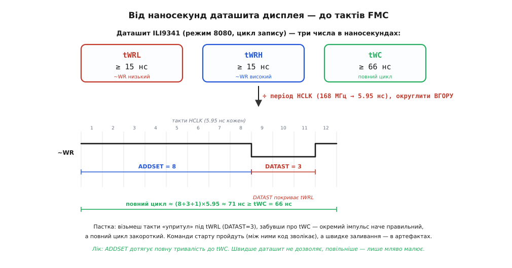

# ⚙️ Паралельний дисплей через FMC

## Задача

У нас на столі проста, але дуже поширена ситуація. Є плата на STM32 — скажімо, F407 чи F429 — і є кольоровий TFT-екран 240×320 на контролері ILI9341 з **паралельним** входом. Не той крихітний модуль на чотири дроти SPI, а «широкий»: вісім чи шістнадцять ліній даних плюс жменя керувальних. Хочемо, щоб на ньому малювалося — і не по піксельку на секунду, а щоб можна було залити весь екран суцільним кольором за частку кадру, прокрутити список, намалювати шкалу приладу, що плавно рухається.

Поставимо межу вимогливо, бо саме тут ховається вся суть. Екран 240×320 у форматі RGB565 — це 240 × 320 × 2 = **153 600 байтів** на один кадр. Якщо ми хочемо оновлювати його бодай 30 разів на секунду, це вже 4.6 мебібайта на секунду **тільки** піксельних даних, які треба фізично проштовхнути в контролер дисплея. Спробуймо зробити це, смикаючи ніжки [GPIO](book:electronics/gpio-expander) з програми: на кожен піксель — виставити 16 ліній даних, підняти-опустити строб запису, ще й перемкнути напрям RS раз на початку. Навіть якщо вкластися в десяток інструкцій на піксель (а реально виходить більше), на кадр піде під мільйон інструкцій, і 30 кадрів на секунду з'їдять усе ядро, не лишивши нічого на власне логіку. Це глухий кут.

Значить, потрібен спосіб віддавати піксель у дисплей **однією** інструкцією ядра — і щоб апаратура сама зробила всю метушню з ніжками. Саме це і є [FMC/FSMC](book:electronics/external-memory-interface): він робить зовнішню мікросхему частиною адресного простору, тож звернення до неї — звичайний запис за покажчиком, який ядро виконує за пару тактів. Наша задача — акуратно налаштувати FMC під конкретний дисплей, написати тонкий шар функцій `lcd_write_cmd`/`lcd_write_data`, провести контролер екрана через його ритуал увімкнення й після цього заливати кадри на швидкості шини пам'яті. І, найголовніше, зробити це так, щоб воно не «майже працювало», а працювало надійно — бо саме тут новачки застрягають на дні й тижні.

## Ідея

Паралельний вхід TFT-контролера в так званому **режимі 8080** (за іменем шини процесора Intel 8080; чому цих режимів історично два — 8080 і 6800 — розповідає [окрема вставка](book:electronics/external-memory-interface/hist-parallel-bus.md)) до сміху схожий на шину звичайної статичної пам'яті. Судіть самі, які в нього лінії:

```
D[15:0]   шістнадцять ліній даних            (у нас 16-бітний режим)
~WR       строб запису, активний-низький     ← лягає на ~NWE
~RD       строб читання, активний-низький     ← лягає на ~NOE
~CS       вибір кристала, активний-низький    ← лягає на ~NEx
 D/C      команда чи дані (data/command)      ← лягає на одну лінію адреси
~RESET    апаратне скидання                   ← окремий GPIO, не через FMC
```

Перші три лінії — точнісінько те, що [FMC й так виставляє для пам'яті](book:electronics/external-memory-interface): вибір кристала, строб запису, строб читання. Лишається єдина «зайва» лінія — **D/C** (її ще звуть RS, *register select* — «вибір регістра»), яка каже контролерові дисплея, чим є слово, що зараз залітає по шині даних: **командою** (номером регістра, куди писати) чи **даними** (аргументом команди — зокрема, кольором пікселя).

І ось трюк, на якому все тримається. Ми під'єднуємо лінію D/C дисплея не до окремого GPIO, а до однієї з **адресних** ліній FMC. Тоді біт цієї адреси стає перемикачем «команда/дані»: FMC сам виставляє адресні лінії на кожному циклі, отже сам і піднімає-опускає D/C — залежно від того, за якою з двох адрес ми звернулися. Дві адреси, що різняться лише цим одним бітом, перетворюються на **двоє дверей** до дисплея:

```
адреса з бітом D/C = 0   →   пишемо в регістр КОМАНД
адреса з бітом D/C = 1   →   пишемо РЕГІСТР ДАНИХ (аргумент/піксель)
```

Тепер уся робота з дисплеєм — це запис двох чисел за двома адресами. `*LCD_CMD = 0x2C` каже «зараз посиплються пікселі», а далі потік `*LCD_DATA = колір; *LCD_DATA = колір; …` наповнює екран. Кожен такий рядок — один цикл шини пам'яті, пара тактів ядра. Апаратура FMC перетворює його на повний танець сигналів: опускає ~CS, виставляє на адресні лінії потрібний біт D/C, кладе колір на шістнадцять ліній даних, дає рівний імпульс ~WR потрібної тривалості й прибирає все назад — і робить це щоразу за наносекунди, поки ядро вже рахує наступний піксель. Заливання кадру перетворюється на звичайний цикл `while` по буферу, який летить на швидкості пам'яті.

Що ще треба, крім FMC? Дві дрібниці, які через шину пам'яті не проведеш: лінію **~RESET** (нею смикаємо GPIO вручну на старті) і **підсвітку** (звичайний транзистор або вивід із ШІМ під регулювання яскравості). Усе інше — команди, дані, пікселі — через FMC.

> 🔧 **Навіщо це.** Ця схема — стандарт для приладів із «живим» екраном: осцилографи-іграшки, термостати з графіками, панелі керування, ретро-консолі. Щойно на екрані має щось **рухатися** — стрілка, крива, список, що прокручується, — пропускної здатності SPI вже часто бракує, і паралельний вхід через FMC стає природним вибором. Знаючи цей прийом, ви дивитеся на кольоровий модуль в описі й одразу бачите: якщо в нього виведена паралельна шина 8080, його можна повісити на FMC й малювати майже так само швидко, як писати в пам'ять.

## Крок 1. Куди які ніжки й що ставимо в FMC

Перш ніж писати код, треба ухвалити три рішення заліза, і кожне має наслідки.

**Який банк і вибір кристала.** Повісимо дисплей на **~NE1** — перше підвікно, що починається з адреси **0x6000_0000**. Це найпростіше: жодних сусідів на шині, увесь банк наш. (Якщо на тій самій шині вже живе зовнішня SRAM на ~NE1, дисплей вішають на ~NE3 з базою 0x6800_0000 — принцип той самий, змінюється лише базова адреса й номер банку.)

**Яка лінія адреси під D/C.** Ось перше місце, де легко зробити тонку помилку. Здавалося б, бери найменшу адресну лінію A0 — і хай сусідні адреси 0x6000_0000 та 0x6000_0001 будуть «команда» й «дані». Але тут криється пастка **16-бітної шини**. Коли FMC налаштований на 16-бітну пам'ять, він адресує **слова, а не байти**: молодша фізична лінія адреси на ніжках, яку контролер смикає, — це вже A0-контролера, що відповідає A1 у просторі адрес ядра. Простими словами: щоб зовнішня адресна лінія A0 змінилася на одиницю, у покажчику ядра треба додати **2**, а не 1. Тому:

```
D/C з'єднаний з лінією FMC A0  (16-бітна шина)
крок між «команда» і «дані» в адресі ядра = 2 = 0x00000002
    LCD_CMD  = 0x60000000     (A0 = 0 → команда)
    LCD_DATA = 0x60000002     (A0 = 1 → дані)
```

Багато готових плат ведуть D/C не на A0, а на якусь вищу лінію — часто **A18**. Причина практична: тоді «команда» й «дані» лежать далеко одна від одної в адресному просторі (крок 2¹⁸ × 2 = 0x80000), не плутаються з дрібними зміщеннями й не чіпляють одну кеш-лінію. Для нашого прикладу оберемо саме **A18** — це реалістичний, поширений варіант, і на ньому добре видно, звідки береться дивна на вигляд різниця адрес:

```
D/C з'єднаний з лінією FMC A18  (16-бітна шина)
різниця адрес = 2¹⁸ (вага біта A18) × 2 (16-бітне слово) = 0x00080000
    LCD_CMD  = 0x60000000       (A18 = 0 → команда)
    LCD_DATA = 0x60080000       (A18 = 1 → дані)
```

Головне тут — **не вгадувати цю адресу, а вивести її** з того, до якої лінії реально припаяний D/C і чи 16-бітна шина. Помилка на цьому кроці дає найпідступніший симптом: команди йдуть як дані й навпаки, дисплей або мовчить, або показує кашу, а таймінги ідеальні — шукати можна довго.

**Тип пам'яті й ширина шини.** Дисплей у режимі 8080 з погляду FMC поводиться як звичайна **асинхронна SRAM/PSRAM** — виставив адресу й дані, дав строб, зафіксувалося. Тому тип пам'яті ставимо `MTYP = SRAM` (нуль) або `PSRAM`; ширину — `MWID = 16 біт`. Дисплей — не флеш, тож біт доступу до флеш (`FACCEN`) вимикаємо. І потрібен запис, отже `WREN = 1`.

## Крок 2. Таймінги — з даташита дисплея, а не з голови

Це серце всієї справи, і саме тут вирішується, чи буде картинка чиста, чи в артефактах. FMC мусить смикати ~WR **не швидше**, ніж контролер дисплея здатний прийняти. Беремо не «на око», а з даташита ILI9341, розділ про 8080-інтерфейс. Там для циклу запису стоять три числа (усталені значення з офіційного даташита ILI9341, MCU-Interface I):

```
tWRL  ≥ 15 нс     ~WR мусить пробути низьким щонайменше стільки  (низький імпульс)
tWRH  ≥ 15 нс     ~WR мусить пробути високим між циклами щонайменше стільки
tWC   ≥ 66 нс     повний цикл запису — не коротший за це
```

Тобто найшвидше, з чим ILI9341 гарантовано працює, — це цикл 66 нс, приблизно 15 мільйонів слів на секунду. Тепер перекладемо ці наносекунди на **такти HCLK**, бо FMC відлічує все саме тактами свого годинника. Візьмімо HCLK = 168 МГц (типова частота STM32F407), період — 1/168 МГц ≈ 5.95 нс.

Згадаймо, як FMC складає цикл із фаз ADDSET (адреса встановлюється, ~WR ще високий) і DATAST (~WR низький, дані дійсні). Груба, але правильна відповідність до чисел даташита така: **DATAST покриває tWRL** (доки строб низький), а **ADDSET разом із хвостом циклу дає час на встановлення адреси/D/C й на tWRH** між сусідніми записами.

**Розрахунок таймінгів під ILI9341 при HCLK = 168 МГц.**

```
період HCLK            = 1 / 168 МГц        ≈ 5.95 нс

треба tWRL ≥ 15 нс  →  DATAST-тактів = ceil(15 / 5.95) = 3    (3 × 5.95 = 17.9 нс ≥ 15) ✓
треба адресі встоятись → ADDSET-тактів = 4                     (4 × 5.95 = 23.8 нс, з запасом)

повний цикл ≈ (ADDSET + DATAST + 1) × період
            ≈ (4 + 3 + 1) × 5.95 нс ≈ 47.6 нс
```

Тут варто спинитися й подумати чесно. Формула дала повний цикл ~48 нс — це **менше** за tWC = 66 нс з даташита. Отже, розрахунок «упритул» під tWRL недостатній: якщо гнати слова щільно, повний цикл виходить закороткий, і хоча кожен окремий низький імпульс ~WR формально дотягує до 15 нс, дисплей не встигає між циклами. Це і є типове джерело **артефактів** — смуги, «сніг», хаотичні пікселі при швидкому заливанні, тоді як поодинокі команди на старті проходять чудово (бо між ними програма й так зволікає). Тому чесний інженер **округлює вгору до tWC**: збільшує ADDSET, аж поки повний цикл не перевалить за 66 нс.

```
хочемо повний цикл ≥ tWC = 66 нс
   (ADDSET + DATAST + 1) × 5.95 ≥ 66
    ADDSET + DATAST + 1        ≥ 11.1  →  беремо 12 тактів
   лишаємо DATAST = 3, тоді ADDSET = 8:
   повний цикл ≈ (8 + 3 + 1) × 5.95 ≈ 71.4 нс ≥ 66 нс ✓
```

Отже надійні числа під ILI9341 на 168 МГц: **ADDSET = 8, DATAST = 3**. Це дає приблизно 14 мільйонів слів на секунду — з головою для 30 кадрів (нам треба ~4.6 МБ/с, а тут виходить під 28 МБ/с). Швидше — зась: даташит не дозволяє. Повільніше — можна, лише картинка малюватиметься мляво.

> 🔧 **Навіщо це.** Це рівно та точка, де самозбірна плата «майже працює». Найтиповіший шлях у болото: людина бере приклад із форуму з ADDSET/DATAST під якийсь інший дисплей і HCLK, тайминги виходять закороткі під її ILI9341 — і на екрані миготять артефакти, які то є, то нема, залежно від температури й екземпляра. Годинами шукають «плаваючий баг», а лік простий: узяти даташит **свого** контролера, знайти tWRL/tWRH/tWC, перекласти на такти **своєї** HCLK і, головне, не забути дотягнути повний цикл до tWC. Ще один запобіжник: на етапі налагодження навмисно **сповільніть** таймінги вдвічі (подвойте ADDSET). Якщо артефакти зникли — винні таймінги, і ви це довели за п'ять хвилин, а не за три дні.

Ілюстрація нижче зводить розрахунок в одну картину — від чисел даташита до тактів FMC.


*Даташит контролера дисплея дає три числа в наносекундах: скільки строб ~WR мусить бути низьким (tWRL), скільки високим між циклами (tWRH) і яка найкоротша тривалість усього циклу (tWC). Кожне ділять на період HCLK і округлюють угору до цілого числа тактів: DATAST покриває tWRL, а ADDSET разом із хвостом циклу дотягує повну тривалість до tWC. Візьмеш такти «упритул» під tWRL, забувши про tWC, — окремий імпульс наче правильний, а повний цикл закороткий, і при швидкому заливанні лізуть артефакти.*

## Крок 3. Налаштування FMC у коді

Тепер зберемо рішення в код. Покажу два шари: спершу «людський» — через CMSIS-структуру `FMC_Bank1`, як пишуть у житті; далі поясню, що там усередині по бітах, щоб не було магії.

```c
#include "stm32f4xx.h"      // CMSIS: FMC_Bank1, RCC, GPIO, біти з _Pos-суфіксами
#include <stdint.h>

// Дві «двері» до дисплея. D/C з'єднаний з лінією A18, шина 16-бітна,
// тому різниця адрес = 2^18 * 2 = 0x00080000 (див. розрахунок вище).
#define LCD_BASE   0x60000000u
#define LCD_CMD   (*(volatile uint16_t *)(LCD_BASE + 0x00000000u))  // A18 = 0 → команда
#define LCD_DATA  (*(volatile uint16_t *)(LCD_BASE + 0x00080000u))  // A18 = 1 → дані

void fmc_lcd_init(void) {
    // 1. Тактування: сам блок FMC і всі порти GPIO, куди виведені його ніжки.
    RCC->AHB3ENR |= RCC_AHB3ENR_FMCEN;
    RCC->AHB1ENR |= RCC_AHB1ENR_GPIODEN | RCC_AHB1ENR_GPIOEEN
                  | RCC_AHB1ENR_GPIOFEN | RCC_AHB1ENR_GPIOGEN;
    // (Конкретні ніжки D0..D15, A18, ~NE1, ~NWE, ~NOE переводять у режим
    //  альтернативної функції AF12 — це рутина, тут її опускаємо задля ясності.)

    // 2. Керування банком 1 (регістр BCR1 = BTCR[0]).
    //    MTYP=SRAM(00), MWID=16 біт(01), WREN=1, MBKEN=1; EXTMOD=0 (спільні
    //    таймінги на читання й запис — режим A нам достатній).
    FMC_Bank1->BTCR[0] =
          (0u << FMC_BCR1_MTYP_Pos)     // тип пам'яті: SRAM
        | (1u << FMC_BCR1_MWID_Pos)     // ширина шини: 16 біт
        | FMC_BCR1_WREN                 // дозвіл запису
        | FMC_BCR1_MBKEN;               // увімкнути банк

    // 3. Таймінги банку 1 (регістр BTR1 = BTCR[1]) — числа з розрахунку.
    //    ADDSET=8 (біти 0..3), ADDHLD=0 (4..7), DATAST=3 (8..15), решта 0.
    FMC_Bank1->BTCR[1] =
          (8u << FMC_BTR1_ADDSET_Pos)   // ADDSET = 8 тактів
        | (0u << FMC_BTR1_ADDHLD_Pos)   // ADDHLD = 0 (не мультиплексуємо)
        | (3u << FMC_BTR1_DATAST_Pos);  // DATAST = 3 такти
}
```

Що тут по бітах, коротко. Регістри банку 1 CMSIS складає в масив `FMC_Bank1->BTCR[]`, де парні елементи — керування (`BCR1`, `BCR2`…), непарні — таймінги (`BTR1`, `BTR2`…); отже `BTCR[0]` — це BCR1, `BTCR[1]` — BTR1. У BCR1 біт `MBKEN` (позиція 0) вмикає банк, `MWID` (біти 4–5) задає ширину шини (01 = 16 біт), `MTYP` (біти 2–3) — тип пам'яті, `WREN` (біт 12) дозволяє запис, а `EXTMOD` (біт 14) ми лишаємо в нулі: він розділяє таймінги читання й запису, а для дисплея, куди майже завжди тільки пишемо, вистачає спільних (режим A). У BTR1 фази лежать полями: `ADDSET` — біти 0–3, `ADDHLD` — 4–7, `DATAST` — 8–15. Оце і вся «магія»: чотири присвоєння, і дисплей висить на адресі 0x6000_0000, як звичайна пам'ять.

## Крок 4. Тонкий шар доступу

Над сирими макросами кладемо кілька коротких функцій — вони й будуть усім «драйвером шини». Навмисно тримаємо їх мінімальними: що менше коду між ядром і ~WR, то швидше.

```c
#include <stdint.h>

// Один запис у регістр команд — рівно один цикл шини на ~NE1 із D/C = 0.
static inline void lcd_write_cmd(uint16_t cmd) {
    LCD_CMD = cmd;
}

// Один запис у регістр даних — цикл шини з D/C = 1 (аргумент або піксель).
static inline void lcd_write_data(uint16_t data) {
    LCD_DATA = data;
}

// Читання (напр. ID дисплея) — той самий цикл, але ~RD замість ~WR.
static inline uint16_t lcd_read_data(void) {
    return LCD_DATA;
}

// Найчастіший шаблон: команда, за якою йде кілька байтів-аргументів.
static void lcd_cmd_args(uint16_t cmd, const uint8_t *args, int n) {
    lcd_write_cmd(cmd);
    for (int i = 0; i < n; ++i)
        lcd_write_data(args[i]);          // аргументи 8-бітні, але шлемо як слова
}
```

Тут варто одразу помітити тонкість, через яку теж спотикаються. Команди й **аргументи** ILI9341 — переважно **8-бітні** (номер регістра, окремі параметри), а піксель у RGB565 — **16-бітний**. Наша шина 16-бітна, тож 8-бітний аргумент ми шлемо в молодшому байті 16-бітного слова; контролер дисплея читає скільки йому треба. Плутати регістри-аргументи з піксельними даними не можна: команда `0x2C` — це команда (D/C = 0), а колір після неї — дані (D/C = 1). **Порядок «спершу команда, тоді її дані» — залізний**; переставиш місцями — і контролер зрозуміє все навпаки.

## Крок 5. Ритуал увімкнення ILI9341

Голий контролер після подачі живлення нічого не покаже, поки його не провести через послідовність команд: скинути, розбудити зі сну, налаштувати живлення внутрішніх напруг, VCOM, гаму, орієнтацію, формат пікселя — і аж наприкінці ввімкнути вивід на матрицю. Порядок і паузи тут — не забаганка: між скиданням і першими командами, а особливо після «вийти зі сну» контролеру треба фізичний час на розгін внутрішніх генераторів напруги. Пропустиш паузу — команди підуть у ще «сплячий» чип і загубляться.

Значення нижче — усталена робоча послідовність для ILI9341 (звірена з відкритим драйвером Adafruit; ключові з них: формат пікселя `0x3A = 0x55` — це RGB565, орієнтація `0x36 = 0x48`, вихід зі сну `0x11`, увімкнення екрана `0x29`). Наводжу її повністю, бо саме ця «магічна книга заклять» найчастіше буває джерелом мовчазного екрана, і корисно бачити її цілком.

```c
#include <stdint.h>

// Проста затримка. У бойовому коді — від системного таймера; тут спрощено.
extern void delay_ms(uint32_t ms);

// Апаратне скидання дисплея смикає окремий GPIO ~RESET (не через FMC!).
extern void lcd_hw_reset_pin(int level);   // 1 = високий, 0 = низький

void lcd_reset(void) {
    lcd_hw_reset_pin(1); delay_ms(5);
    lcd_hw_reset_pin(0); delay_ms(20);      // тримаємо в скиданні ≥ 10 мкс, з запасом
    lcd_hw_reset_pin(1); delay_ms(150);     // після відпускання даємо контролеру ожити
}

void ili9341_init(void) {
    lcd_reset();

    lcd_write_cmd(0x01);                     // Software reset
    delay_ms(150);

    // --- службові команди «розгону» живлення (значення з даташита/драйвера) ---
    { const uint8_t a[] = {0x03, 0x80, 0x02};       lcd_cmd_args(0xEF, a, 3); }
    { const uint8_t a[] = {0x00, 0xC1, 0x30};       lcd_cmd_args(0xCF, a, 3); }
    { const uint8_t a[] = {0x64, 0x03, 0x12, 0x81}; lcd_cmd_args(0xED, a, 4); }
    { const uint8_t a[] = {0x85, 0x00, 0x78};       lcd_cmd_args(0xE8, a, 3); }
    { const uint8_t a[] = {0x39, 0x2C, 0x00, 0x34, 0x02}; lcd_cmd_args(0xCB, a, 5); }
    { const uint8_t a[] = {0x20};                   lcd_cmd_args(0xF7, a, 1); }
    { const uint8_t a[] = {0x00, 0x00};             lcd_cmd_args(0xEA, a, 2); }

    // --- керування напругами живлення й VCOM ---
    { const uint8_t a[] = {0x23};                   lcd_cmd_args(0xC0, a, 1); } // Power control 1
    { const uint8_t a[] = {0x10};                   lcd_cmd_args(0xC1, a, 1); } // Power control 2
    { const uint8_t a[] = {0x3E, 0x28};             lcd_cmd_args(0xC5, a, 2); } // VCOM 1
    { const uint8_t a[] = {0x86};                   lcd_cmd_args(0xC7, a, 1); } // VCOM 2

    // --- орієнтація та формат пікселя ---
    { const uint8_t a[] = {0x48};                   lcd_cmd_args(0x36, a, 1); } // MADCTL: порядок рядків/колонок і RGB
    { const uint8_t a[] = {0x55};                   lcd_cmd_args(0x3A, a, 1); } // PIXFMT: 0x55 = 16 біт/піксель (RGB565)

    // --- частота кадру, функції дисплея, гама ---
    { const uint8_t a[] = {0x00, 0x18};             lcd_cmd_args(0xB1, a, 2); } // Frame rate
    { const uint8_t a[] = {0x08, 0x82, 0x27};       lcd_cmd_args(0xB6, a, 3); } // Display function control
    { const uint8_t a[] = {0x00};                   lcd_cmd_args(0xF2, a, 1); } // 3Gamma off
    { const uint8_t a[] = {0x01};                   lcd_cmd_args(0x26, a, 1); } // Gamma curve 1

    { const uint8_t gp[] = {0x0F,0x31,0x2B,0x0C,0x0E,0x08,0x4E,0xF1,
                            0x37,0x07,0x10,0x03,0x0E,0x09,0x00};
      lcd_cmd_args(0xE0, gp, 15); }                  // позитивна гама
    { const uint8_t gn[] = {0x00,0x0E,0x14,0x03,0x11,0x07,0x31,0xC1,
                            0x48,0x08,0x0F,0x0C,0x31,0x36,0x0F};
      lcd_cmd_args(0xE1, gn, 15); }                  // негативна гама

    lcd_write_cmd(0x11);                     // Sleep out — вихід зі сну
    delay_ms(150);                           // обов'язкова пауза: генератори напруги розганяються
    lcd_write_cmd(0x29);                     // Display ON — і аж тепер матриця світиться
    delay_ms(50);
}
```

Логіка тут не «завчити напам'ять», а зрозуміти каркас: спершу **скидання** (апаратне ~RESET + програмне `0x01`), тоді **живлення й опорні напруги** (група команд 0xC*/0xE*/0xF*), тоді **як тлумачити дані** (орієнтація `0x36`, формат пікселя `0x3A`), тоді **гама**, і лише в самому кінці — «вийти зі сну» `0x11` і «ввімкнути екран» `0x29`, кожне зі своєю паузою. Конкретні числа службових команд ідуть з даташита конкретної панелі й майже завжди беруться готовими; критично не переставити етапи місцями й не забути паузи після скидання й після `0x11`.

## Крок 6. Вікно виводу й заливання кадру

Малювання в ILI9341 влаштоване так: спершу командами задаємо **прямокутне вікно** — діапазон колонок (`0x2A`) і рядків (`0x2B`), — а тоді командою «пиши в пам'ять» (`0x2C`) відкриваємо потік, і кожне наступне 16-бітне слово даних лягає в наступну комірку вікна, самі колонки й рядки контролер перебирає всередині. Тобто щоб залити прямокутник, ми **один раз** задаємо межі, **один раз** шлемо `0x2C`, а далі просто женемо кольори підряд. Оце «підряд» і є те, заради чого затівався FMC.

```c
#include <stdint.h>

#define LCD_W  240
#define LCD_H  320

// Задати прямокутне вікно виводу [x0..x1] × [y0..y1].
static void lcd_set_window(uint16_t x0, uint16_t y0, uint16_t x1, uint16_t y1) {
    lcd_write_cmd(0x2A);                     // Column address set
    lcd_write_data(x0 >> 8); lcd_write_data(x0 & 0xFF);
    lcd_write_data(x1 >> 8); lcd_write_data(x1 & 0xFF);

    lcd_write_cmd(0x2B);                     // Page (row) address set
    lcd_write_data(y0 >> 8); lcd_write_data(y0 & 0xFF);
    lcd_write_data(y1 >> 8); lcd_write_data(y1 & 0xFF);

    lcd_write_cmd(0x2C);                     // Memory write — далі йдуть пікселі
}

// Залити весь екран суцільним кольором. Ось воно — ядро задачі.
void lcd_fill_screen(uint16_t color) {
    lcd_set_window(0, 0, LCD_W - 1, LCD_H - 1);
    for (uint32_t i = 0; i < (uint32_t)LCD_W * LCD_H; ++i)
        lcd_write_data(color);               // 76 800 циклів шини — і екран залито
}

// Залити довільний прямокутник (напр. очистити рядок списку).
void lcd_fill_rect(uint16_t x, uint16_t y, uint16_t w, uint16_t h, uint16_t color) {
    if (w == 0 || h == 0) return;
    lcd_set_window(x, y, x + w - 1, y + h - 1);
    for (uint32_t i = 0; i < (uint32_t)w * h; ++i)
        lcd_write_data(color);
}

// Вивести готовий буфер зображення (напр. кадр з RAM або спрайт).
void lcd_blit(uint16_t x, uint16_t y, uint16_t w, uint16_t h, const uint16_t *pix) {
    lcd_set_window(x, y, x + w - 1, y + h - 1);
    const uint32_t n = (uint32_t)w * h;
    for (uint32_t i = 0; i < n; ++i)
        lcd_write_data(pix[i]);
}
```

Придивімося, що коштує заливання всього екрана в `lcd_fill_screen`. Це `0x2A`, `0x2B`, `0x2C` — жменя команд-настройки — і потім **76 800** записів `LCD_DATA = color`. Кожен запис — один цикл шини по ~71 нс (наш розрахований тайминг), тож увесь екран заливається приблизно за 76800 × 71 нс ≈ **5.5 мс**. Це майже 180 повних заливань екрана на секунду — межа тут уже не швидкість шини, а сам ILI9341. Порівняйте з GPIO-смиканням, де той самий кадр повз би десяту частку секунди й з'їв би все ядро. Ось прибуток від того, що піксель віддається однією інструкцією.

> 🔧 **Навіщо це.** `lcd_fill_rect` — робоча конячка будь-якого інтерфейсу: очистити ділянку під новий текст, намалювати смужку індикатора, стерти стару стрілку приладу перед тим, як домалювати нову. Оскільки заливання йде на швидкості пам'яті, можна перемальовувати рухомі елементи щокадру, не боячись, що екран «захлинеться». Саме на цих трьох функціях — вікно, заливка, вивід буфера — будується весь вищий графічний шар: шрифти, лінії, віджети.

### Ще швидше: пакетний запис і DMA

У `lcd_fill_screen` ядро крутить цикл і на кожній ітерації робить один запис у пам'ять. Це вже швидко, але ядро при цьому зайняте виключно переливанням. Якщо треба звільнити його для іншої роботи — рахунку, читання давачів, — заливання перекладають на **DMA** (пряме звертання до пам'яті). Хитрість у тому, що адреса призначення — `LCD_DATA` — **не змінюється** (усі пікселі летять в одні й ті самі двері дисплея), а адреса джерела або теж стоїть на місці (суцільний колір), або біжить по буферу (готове зображення).

```c
#include <stdint.h>

// Залити прямокутник суцільним кольором через DMA: джерело — одна комірка
// (інкремент джерела вимкнено), призначення — LCD_DATA (інкремент вимкнено теж).
void lcd_fill_rect_dma(uint16_t x, uint16_t y, uint16_t w, uint16_t h,
                       uint16_t color) {
    static volatile uint16_t src;            // одна комірка-джерело
    src = color;
    lcd_set_window(x, y, x + w - 1, y + h - 1);

    uint32_t n = (uint32_t)w * h;
    // Псевдо-налаштування потоку DMA (конкретні регістри — з CMSIS вашого МК):
    //   PAR  = (uint32_t)&src;   MINC = 0   (джерело не рухається)
    //   M0AR = (uint32_t)&LCD_DATA; PINC = 0 (призначення не рухається)
    //   PSIZE = MSIZE = 16 біт;  NDTR = n;   напрям M→M
    dma_mem_to_mem_16((uint32_t)&src, (uint32_t)&LCD_DATA, n, /*src_inc=*/0);
    // Ядро вільне: поки DMA переливає піксель за пікселем у дисплей, можна рахувати.
}
```

Ідея DMA-заливки та сама, лише перекладач тепер працює без участі ядра: контролер DMA сам витягує слово з `src` і кладе його в `LCD_DATA` рівно `n` разів, а FMC на кожен такий запис формує цикл шини до дисплея. Для суцільного кольору джерело нерухоме (`src_inc = 0`); щоб вивести зображення з буфера — джерело роблять біжучим по масиву пікселів (`src_inc = 1`), а призначення так само стоїть на `LCD_DATA`. Це той рівень, на якому будують плавну анімацію: ядро готує наступний кадр у пам'яті, поки DMA виливає попередній на екран.

## Складність і пастки

Зберемо разом усе, на чому реально спотикаються — від найпідступнішого до дрібного.

- **Таймінги закороткі — артефакти.** Головна й найковарніша пастка. Взяли ADDSET/DATAST з чужого прикладу (інший дисплей, інша HCLK) — і повний цикл виходить менший за tWC даташита. Симптом класичний: команди ініціалізації проходять (між ними програма зволікає), а швидке заливання дає смуги, «сніг», випадкові пікселі; збій плаваючий, залежить від температури й екземпляра. Лік: узяти tWRL/tWRH/**tWC** зі свого даташита, перекласти на такти своєї HCLK і дотягнути повний цикл до tWC. Діагностичний прийом: навмисно подвойте ADDSET — зникли артефакти, значить винні таймінги.
- **Не та адресна лінія під D/C — команди й дані переплутані.** Друга за підступністю. Порахували різницю адрес неправильно (забули множник 2 для 16-бітної шини, або D/C припаяний до іншої лінії, ніж ви думали) — і `LCD_CMD` насправді б'є в регістр даних, а `LCD_DATA` — у регістр команд. Дисплей або мовчить, або показує кашу, при цьому таймінги ідеальні. Виводьте адресу з реального підключення: вага біта тієї лінії, до якої припаяний D/C, помножена на 2 (16-бітне слово).
- **Забута або закоротка пауза після скидання й після `0x11`.** Контролеру треба фізичний час, щоб внутрішні генератори напруги вийшли на режим. Не витримали паузу після ~RESET або після «Sleep out» — перші команди підуть у ще «сплячий» чип і загубляться. Симптом: ініціалізація ніби відпрацювала, а екран білий/чорний. Тримайте паузи ~150 мс там, де їх вимагає даташит.
- **Порядок команда/дані переставлено.** Кожна команда `0x2A`/`0x2B`/`0x2C` мусить іти **перед** своїми аргументами й перед потоком пікселів. Пустили піксель раніше `0x2C`, або задали вікно після того, як почали лити дані, — і зображення повзе, зсувається, ділиться навпіл. Залізне правило: спершу команда (D/C = 0), тоді її дані (D/C = 1).
- **Плутанина 8-бітних аргументів і 16-бітних пікселів.** Аргументи команд переважно 8-бітні, піксель RGB565 — 16-бітний. На 16-бітній шині 8-бітний аргумент шлють у молодшому байті слова. Якщо ж помилково слати аргументи парами байтів як 16-бітні слова там, де контролер чекає по одному, — параметри «поїдуть», і дисплей налаштується криво (не той формат, не та орієнтація).
- **Забули ~RESET або підсвітку.** Дві лінії, що не йдуть через FMC. Не смикнули ~RESET на старті — контролер лишається в невизначеному стані. Не ввімкнули підсвітку (окремий транзистор/вивід) — усе працює, але екран **чорний**, і починається марна гонитва за «мертвим» дисплеєм, який насправді справно малює в темряві.
- **Ніжки FMC не переведені в альтернативну функцію.** Увімкнули тактування FMC, налаштували банк — але забули перевести самі ніжки (D0..D15, A18, ~NE1, ~NWE, ~NOE) у режим альтернативної функції (на STM32F4 — AF12) з потрібною швидкістю. Тоді FMC смикає внутрішні лінії, а на ніжки нічого не виходить: тиша на шині при ідеальному коді.
- **Плутанина FSMC та FMC.** Дисплей 8080 — це статична пам'ять, його тягне навіть простий [FSMC](book:electronics/external-memory-interface). А от якщо задумали ще й зовнішній [кадровий буфер у SDRAM](book:electronics/sdram-ddr) (щоб тримати весь кадр у RAM і виливати його на екран), то SDRAM вимагає **повного** FMC із контролером динамічної пам'яті — на чипі лише з FSMC її не буде. Це вирішують ще при виборі мікроконтролера.

Підсумок простий. Уся хитрість — звести дисплей до пам'яті: вибір кристала, строб запису й читання лягають на однойменні сигнали FMC, а єдина «зайва» лінія D/C сідає на біт адреси, розколюючи дисплей на двоє дверей — команди й дані. Після цього малювання стає записом у пам'ять, а найшвидший спосіб залити кадр — звичайний цикл (чи DMA) по одній нерухомій адресі `LCD_DATA`. Дві третини помилок тут — не в логіці малювання, а в двох числах (таймінги під tWC даташита) і в одній адресі (яка лінія несе D/C). Зробили ці два розрахунки чесно, з даташита й зі схеми, — і решта складається сама.
