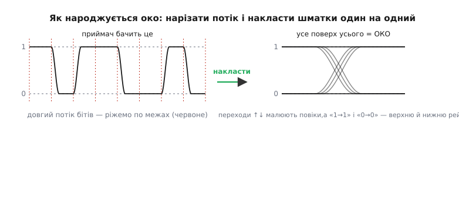
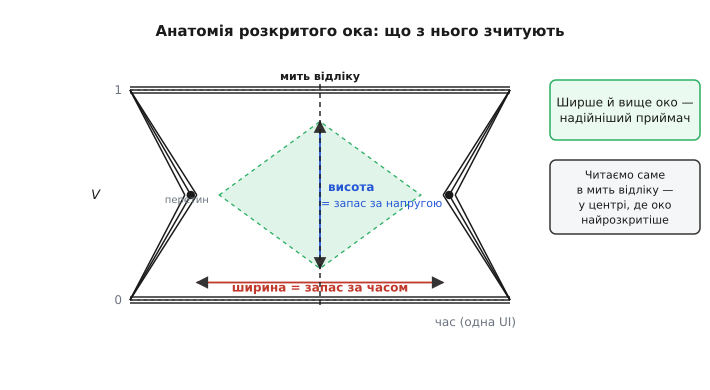
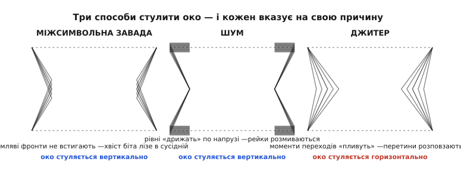
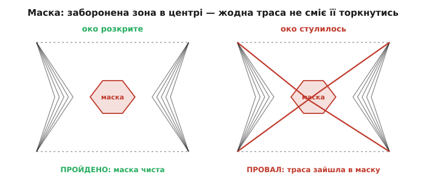

# Діаграма ока: усе про сигнал в одному погляді

Уявіть, що вам дали осцилограму швидкої цифрової лінії — мільйони бітів за секунду, нескінченна стрічка нулів і одиниць. Дивитися на неї «як є» безнадійно: біти летять так густо, що на екрані злипаються в сіру кашу. І тут виникає просте, майже нахабне питання: а що, як не розгортати всю стрічку, а **накласти всі біти один на одного** — розрізати сигнал на однакові шматки завдовжки в один біт і намалювати їх усі поверх себе? Виходить дивна картинка, у якій між парою «рейок» проступає світлий просвіт, схожий на око. Це і є **діаграма ока** (*eye diagram*, *eye pattern* — за схожістю просвіту на око між повіками). І виявляється, що цей один-єдиний малюнок каже про здоров'я цифрової лінії більше, ніж будь-яка інша картинка: чи певно приймач відрізнить 0 від 1, скільки в нього запасу, що саме псує сигнал. Розберімо, **як** він народжується, **що** в ньому читають і **чому** він так добре працює.

### Навіщо накладати біти один на одного

Почнімо з болю, який ця картинка лікує. Цифровий приймач робить, по суті, одну річ: у певну **мить** дивиться на напругу лінії й вирішує — це 0 чи 1. Він порівнює її з порогом (детальніше — [рівні «0» і «1» як діапазони](book:electronics/logic-levels-as-ranges)) і клацає в один зі станів. Щоб він не помилявся, у цю мить сигнал має бути **чисто** високим або **чисто** низьким — подалі від порога, з добрим запасом. Питання інженера просте: а він **справді** такий чистий у цю мить? Чи, може, іноді сигнал не встигає дійти до рівня, іноді дриґається від шуму, іноді перемикається трохи раніше чи пізніше — і приймач час від часу вгадує неправильно?

Одна осцилограма на це не відповість: на ній видно лише ту конкретну послідовність бітів, що якраз пробігла. А нам треба побачити **всі можливі** ситуації разом — усі варіанти того, як сигнал заходить у мить рішення. Ось тут і працює ідея накладання. Візьмімо довгий потік, поріжмо його по межах бітів на однакові шматочки й покладімо їх **усі поверх одного вікна**. Тоді на одному малюнку зберуться геть усі траєкторії, якими сигнал колись проходив крізь цю мить, — і найгірші, і найкращі. Просвіт, що лишиться посередині, покаже, скільки «чистого місця» гарантовано має приймач за **будь-якого** збігу бітів.


*Ліворуч — довгий потік, який бачить приймач; червоні пунктири — межі бітів, по яких ми ріжемо. Праворуч усі нарізані шматки лягли поверх одного вікна: переходи вгору й униз малюють похилі боки («повіки»), а біти, що лишились на своєму рівні (1→1, 0→0), — верхню й нижню рейку. Порожнеча посередині і є «око».*

Ключова думка вже тут: **око — це не якийсь один сигнал, а всі сигнали одразу.** Кожна лінія на картинці — слід одного біта; там, де ліній багато, простір «зайнятий», а там, де їх нема, лишається просвіт. Приймач читатиме сигнал у центрі цього просвіту — і чим більший просвіт, тим менше шансів, що якийсь злощасний збіг бітів заведе напругу туди, де її сплутають.

> 🔧 **Навіщо це.** Діаграма ока — це головний «рентген» будь-якої швидкої лінії: SPI на кілька мегагерц, USB, Ethernet, пам'ять, будь-який серійний канал. Не треба вгадувати, чому «інколи збоїть»: накладаєш біти — і бачиш очима, чи є запас. Сучасні осцилографи будують око кнопкою, а хто розуміє, **що** там видно, за секунди ставить діагноз, на який без ока пішли б години здогадів.

### Як осцилограф малює око насправді

На папері ми «різали й накладали», а всередині приладу це роблять елегантніше й без ножиць. Осцилограф багато разів запускає розгортку **від самого сигналу даних**: щоразу, коли настає момент нового біта (його дає або окремий тактовий сигнал, або відновлений із самих даних — про це нижче), промінь стартує зліва. Вертикаль показує напругу лінії, а горизонталь — час у межах одного-двох бітових інтервалів. Оскільки запуск щоразу прив'язаний до біта, **усі** біти лягають в те саме вікно, накладаючись. Тисячі й мільйони проходів — і на екрані з післясвіченням (*persistence*) поступово проступає густий візерунок: там, де сигнал буває часто, — яскраво, де рідко — тьмяно.

Один бітовий інтервал, це вікно накладання, має власну назву — **одиничний інтервал** (*unit interval*, UI): час, відведений одному символу. По горизонталі око завжди міряють у частках UI, а не в наносекундах, — так порівняння не залежить від швидкості: «око розкрите на 0.7 UI» однаково зрозуміле і для мегабіта, і для гігабіта. Зазвичай малюють два UI поспіль, щоб було видно **ціле** око з рейками обабіч, а не половинки.

Найважливіше в цьому механізмі — що око показує **статистику**, а не один випадок. Сучасні прилади навіть рахують, **скільки разів** промінь пройшов через кожну точку екрана, і будують справжню теплову карту густоти: центр рейок — гарячий (сигнал там майже завжди), краї повік — прохолодні (туди він заходить лише за певних збігів). Саме тому картинка така показова: рідкісний, але небезпечний «поганий» біт лишить на ній блідий, проте видимий слід — а на звичайній осцилограмі ви б його просто не спіймали.

### Що читають з розкритого ока

Тепер найцікавіше: розкрите око — це не просто гарний візерунок, а **лінійка**, з якої знімають конкретні числа. Дві головні величини — розміри самого просвіту.


*Розкрите око та його мірки. Висота просвіту (синя стрілка) — запас за напругою: наскільки далеко сигнал у мить рішення від порога. Ширина (червона) — запас за часом: наскільки можна схибити з моментом відліку й усе одно попасти в чисту зону. Два перетини повік обмежують око з боків; читають його по центру — у «миті відліку», де просвіт найбільший.*

**Висота ока** (*eye height*) — це вертикальний розмір просвіту в миті відліку. Він каже, наскільки впевнено напруга відрізняється від порога: це живий, виміряний [запас завадостійкості](book:electronics/noise-margin). Що вище око — то більше шуму мусить накопичитися, перш ніж сигнал перетне поріг і приймач помилиться. Стулилось по висоті до нуля — приймач узагалі не має надійного «чистого» рівня.

**Ширина ока** (*eye width*) — горизонтальний розмір просвіту між лівим і правим перетинами повік. Це запас за часом: наскільки момент відліку може «поплисти» вліво чи вправо — від неточного такту, від дрейфу — і все одно попасти в розкриту зону. Вузьке око означає, що приймач мусить ловити мить рішення дуже точно, бо трохи раніше чи пізніше вже підстерігає похилий бік повіки, де рівень непевний.

Є й третя важлива дрібниця — **місця перетину повік** (*crossing points*), ті дві точки, де похилі боки сходяться. По-перше, вони й задають ширину ока. По-друге, якщо перетини «розповзлися» по горизонталі в мутну пляму замість чіткої точки — це прямий доказ, що моменти переходів хитаються, тобто в лінії багато **тремтіння фаз**. А ще з ока видно **час наростання** (крутість похилих боків): чим вони пологіші, тим млявіші [фронти](book:electronics/edges-rise-time) в лінії.

І тут прихована сама суть надійності цифрового зв'язку. Приймач читає сигнал у центрі ока — у миті, коли просвіт найбільший. Поки око **розкрите**, там існує «безпечний прямокутник»: смуга напруг (по висоті) на проміжку часу (по ширині), де сигнал гарантовано читається правильно, хоч би яка послідовність бітів прийшла. Уся інженерія швидкої лінії зводиться до одного: **тримати око розкритим** — щоб цей прямокутник лишався достатньо великим для надійного рішення.

### Три способи стулити око — і три різні винуватці

Найкорисніше в діаграмі ока те, що вона не лише кричить «погано», а й **показує, чому саме** погано. Око стуляється трьома різними способами, і кожен вказує на свою хворобу лінії. Навчитися їх розрізняти — це, по суті, навчитися ставити діагноз одним поглядом.


*Кожен винуватець стуляє око по-своєму. Ліворуч: мляві фронти не встигають дійти до рівня, і хвіст біта лізе в сусідній — око тисне по висоті. Посередині: шум змушує рівні дрижати по напрузі — рейки розмиваються, просвіт коротшає згори й знизу. Праворуч: тремтіння моментів переходу розповзає перетини по горизонталі — око вужчає за часом.*

**Перший винуватець — міжсимвольна завада** (*intersymbol interference*, ISI). Уявіть надто повільні [фронти](book:electronics/edges-rise-time): біт іще не встиг дійти до свого рівня, а вже настав час наступного. Тоді «хвіст» одного біта домішується до сусіднього — символи заважають один одному. На оці це видно як **зменшення висоти**: траєкторії не доходять до чистих рейок, повіки провисають досередини. Головна причина ISI — лінія не пропускає достатньо високих частот (обмежена [смуга](book:electronics/bandwidth-3db)), тому круті фронти «розмазуються»; найчастіше винен сам провідник — довга доріжка чи кабель поводяться як [лінія передачі](book:communications/transmission-lines) з відбиттями й втратами, і що швидша передача, то сильніше вони калічать форму бітів.

**Другий винуватець — шум** (*noise*). Це будь-яке паразитне тремтіння напруги, що додається до сигналу: наводки, шум живлення, тепловий шум. Він зсуває рівні по вертикалі туди-сюди, тож рейки з тонких ліній розпливаються в товсті смуги. На оці це теж **зменшення висоти**, але природа інша: не форма бітів погана (фронти можуть бути чудові), а самі рівні «дрижать». Розрізнити з ISI просто: при шумі розмиваються **плоскі рейки**, при ISI — провисають **похилі повіки**.

**Третій винуватець — тремтіння фаз, або джитер** (*jitter*, від англ. *to jitter* — тремтіти, смикатися). Це коли самі **моменти** переходів гуляють у часі: біт перемикається то трохи раніше, то трохи пізніше очікуваного. Причина — нестабільний такт, [фазовий шум генератора](book:electronics/jitter-phase-noise), ті самі відбиття. На оці джитер б'є **по горизонталі**: чіткі перетини повік розповзаються в мутні плями, і око вужчає за часом. Висота при цьому може лишатися доброю — стуляється саме **ширина**.

Ось чому діаграма ока така цінна для наладки. Стулилось по вертикалі, повіки провисли — шукай ISI: занадто вузьку смугу, довгий кабель, слабкий драйвер. Розмилися рейки — шукай шум: погану землю, наводки, брудне живлення. Розповзлися перетини по горизонталі — шукай джитер: кепський такт, тремтливий генератор. Три різні картини стуляння — три різні напрями пошуку, і не треба гадати.

> 🔧 **Навіщо це.** Це найпрактичніший навик діагностики швидких ліній. Побачив на оці, **як** саме воно стуляється, — і одразу знаєш, **що** крутити. По вертикалі провисає → бий по смузі й фронтах (коротша траса, сильніший драйвер, [узгодження лінії](book:communications/transmission-lines)). Рейки товсті → бий по шуму (розв'язка живлення, земля, екран). Перетини пливуть → бий по джитеру (стабільніший такт). Без ока ці три хвороби зливаються в одне безлике «інколи не працює», і наладка перетворюється на стрілянину наосліп.

### Маска: автоматичний іспит для ока

Дивитися на око очима добре, але коли треба перевіряти тисячі виробів на конвеєрі, потрібен **числовий вирок**: годиться / не годиться, без людини. Для цього придумали **маску ока** (*eye mask*) — заборонену зону, намальовану просто на діаграмі. Найчастіше це багатокутник (шестикутник) у центрі ока плюс заборонені смуги згори й знизу. Правило гранично просте: **жодна траєкторія сигналу не сміє торкнутися маски.**


*Маска — заборонена зона в центрі ока. Ліворуч око розкрите, усі траси обходять маску — іспит пройдено. Праворуч око стулилось, одна траса залізла в заборонений шестикутник — провал: у лінії не лишилося гарантованого запасу за напругою й часом.*

Логіка маски точно відповідає тому, що ми вже знаємо про запаси. Центральний багатокутник — це той самий «безпечний прямокутник» рішення, тільки узаконений: він окреслює мінімальні висоту й ширину, які **мусять** лишатися розкритими. Поки всі траси його обходять, у приймача гарантовано є запас і за напругою, і за часом. Щойно хоч одна траса залізла всередину — око стулилося надто сильно, гарантії немає, виріб бракують. Заборонені смуги згори й знизу так само стережуть викиди (*overshoot*), щоб сигнал не вилітав за [межі, безпечні для входу приймача](book:electronics/logic-levels-as-ranges).

Форму й розміри маски задають **стандарти** інтерфейсів. USB, Ethernet, HDMI, інтерфейси пам'яті — кожен має свою затверджену маску з точними розмірами багатокутника в частках UI й у вольтах. Прогнав сигнал крізь маску відповідного стандарту — і маєш об'єктивний, повторюваний вирок про сумісність, той самий на будь-якому заводі й у будь-якій лабораторії. Саме маска перетворює «око гарне на вигляд» на суворий інженерний тест.

### Мить відліку, такт і чому око вимагає синхронізації

Лишилося прояснити тонкість, без якої картина неповна: **звідки береться мить відліку** й чому вона мусить стояти саме в центрі ока. Приймач читає біт не будь-коли, а в конкретний момент кожного UI — і від того, наскільки точно цей момент влучає в центр просвіту, залежить увесь запас.

Момент рішення задає **такт** (детальніше — [тактовий сигнал](book:electronics/clock-signal)). Іноді його ведуть окремою лінією поряд із даними. Але в багатьох швидких інтерфейсах окремого такту немає — приймач **відновлює** його з самих даних, чіпляючись за переходи сигналу (це називають *clock recovery*, відновлення такту). І ось де око стає буквально дзеркалом синхронізації: щоб читати надійно, приймач має поставити мить відліку рівно **посередині** ока — там, де просвіт найширший і найвищий. Зсунеться момент до краю — потрапить на похилий бік повіки, де рівень непевний, і запас з'їсться, хоч саме око було чудове.

Звідси й глибокий зв'язок джитеру з шириною ока. Тремтіння фаз — це і є непевність у тому, де стоять моменти переходів, отже, де центр ока. Що більший джитер — то ширша «мутна пляма» перетинів і то важче приймачу втримати відлік у центрі. Вимога проста: [запас за часом](book:electronics/metastability-timing) (ширина ока) має бути більший за все накопичене тремтіння, інакше момент рішення рано чи пізно з'їде в небезпечну зону й приймач схибить. Тому ширина ока — це, по суті, бюджет на неточність такту: скільки лінія прощає синхронізації, перш ніж почнуться помилки.

Тут корисно згадати, звідки взагалі взявся цей прийом. Уперше багаторівневі «очі» на екрані використали не для налагодження шин, а щоб надійно **відновлювати сигнал у секретному військовому зв'язку**: система [SIGSALY, Bell Labs, 1943 рік](book:electronics/eye-diagram/hist-sigsaly-eye.md) шифрувала мову цифрою, і саме по картині ока її інженери підбирали найкращий момент відліку. Ідея виявилася настільки живучою, що з тих пір перекочувала в кожен швидкий цифровий інтерфейс.

### Скільки помилок? — від ока до BER

Останній крок робить око по-справжньому кількісним. Інженер зрештою хоче число надійності: **як часто** приймач помилятиметься? Це **частота помилок на біт** (*bit error rate*, BER) — скажімо, одна хиба на 10¹² бітів. І око з нею прямо пов'язане.

Зв'язок такий. Помилка стається, коли шум або джитер саме в мить відліку заведуть сигнал за поріг — тобто коли миттєве значення провалиться в те, що мало б бути порожнім оком. Що ширше й вище розкрите око, то **більший стрибок** шуму потрібен для помилки, а великі стрибки трапляються тим рідше — тож BER падає стрімко. Сучасні прилади навіть екстраполюють рідкісні «хвости» шуму й малюють **статистичне око** з лініями рівної ймовірності помилки: внутрішній контур — рідкі помилки (BER 10⁻¹²), зовнішні — частіші. Так «розкрите око» перетворюється на конкретний прогноз надійності каналу — точний [зв'язок між шириною/висотою ока, шумом і BER](book:communications/ber-snr-curve) розглядають окремо. Для нас головне: **більше око → менше помилок**, і саме заради цього його бережуть.

**Приклад (запаси ока в числах).** Лінія 3.3 В передає дані з періодом біта (UI) 10 нс. Осцилограф показав: висота ока 1.8 В, ширина 6 нс. Скільки це в частках і чи є запас?

```
UI = 10 нс, поріг ≈ Vdd/2 = 1.65 В
висота ока = 1.8 В  → запас за напругою ≈ 1.8/2 = 0.9 В по кожен бік порога
ширина ока = 6 нс   → 6/10 = 0.60 UI розкрито
джитер (розкид перетинів) = 10 − 6 = 4 нс = 0.40 UI
```

Читаємо вирок: 0.9 В запасу за напругою — це з добрим гаком більше за типовий [поріг завадостійкості](book:electronics/noise-margin), тож шум лінію не звалить. А от 0.40 UI сумарного тремтіння — це майже половина інтервалу з'їдена джитером: розкритого лишилось 0.60 UI, і момент відліку треба тримати в центрі досить точно. Висновок з одного погляду: за напругою запас щедрий, а от **синхронізацію тут вартувало б підтягнути** — бо саме ширина ока близька до межі.

---

Отже, діаграма ока — це фокус із накладанням: розріж потік по бітах, поклади всі шматки поверх одного вікна — і замість нескінченної стрічки отримаєш один малюнок, що показує **всі** траєкторії сигналу разом. Просвіт-«око» посередині — це живий, виміряний запас надійності: його **висота** — запас за напругою ([завадостійкість](book:electronics/noise-margin)), **ширина** — запас за часом (терпимість до джитеру). Стуляється воно трьома різними способами, і кожен вказує свого винуватця: провисло по вертикалі — [міжсимвольна завада](book:communications/transmission-lines) чи вузька смуга; розмилися рейки — шум; розповзлися перетини — [джитер](book:electronics/jitter-phase-noise). **Маска** робить із цього автоматичний іспит, а зв'язок ока з [BER](book:communications/ber-snr-curve) — прогноз, як часто канал помилятиметься. Уся інженерія швидкого цифрового зв'язку тримається на одному образі: **бережи око розкритим** — і сигнал дійде правильно.
