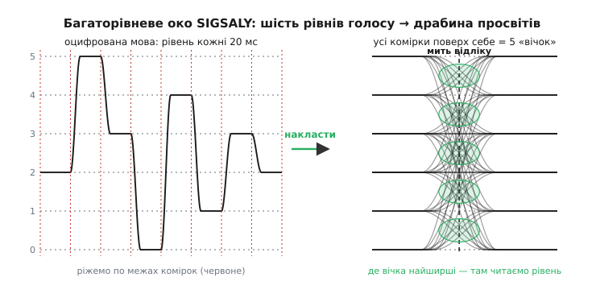

# 📜 Око народилося в бункері: SIGSALY і перший погляд на цифру

Образ «ока між рейками» здається таким природним, ніби він був завжди — накладаєш біти, дивишся на просвіт, читаєш запас. Насправді в нього є цілком конкретне місце й час народження, і місце це несподіване: не лабораторний стенд і не сторінка підручника, а надсекретний бункер військового зв'язку часів Другої світової. Систему звали **SIGSALY**, зібрали її в Bell Labs, у службу вона стала в липні 1943-го — і саме її інженери, воюючи з дуже практичною задачею «в яку мить читати відлік», уперше намалювали на осцилографі багаторівневе «око» й навчилися ним користуватися. Звідти цей погляд і перекочував — спершу в телеграфні лінії, потім у кожен швидкий цифровий інтерфейс, який ви сьогодні можете назвати.

Ця історія — не просто цікавий анекдот про походження терміна. Вона показує **чому** діаграма ока взагалі мусила з'явитися саме тоді: раніше цифрового сигналу з рівнями, які треба відрізняти в точну мить, у зв'язку просто не було — була аналогова хвиля, яку передавали «як є». SIGSALY стала однією з перших систем, що розрізала мову на числа, передала ці числа й зібрала їх назад. А щойно з'являється відлік дискретних рівнів, одразу постає питання, на яке аналогова епоха не мусила відповідати: **де точно натиснути кнопку «читай»?** Око — це і був інструмент, придуманий, щоб відповісти на це питання очима.

## Що бентежило: як зібрати назад те, що розрізали на числа

Щоб зрозуміти, навіщо SIGSALY знадобилося око, треба спершу відчути, у якій пастці опинилися її інженери. Задача була нечувана для 1942 року: зробити телефонну розмову між Вашингтоном і Лондоном такою, щоб ворог, перехопивши її в ефірі, не зрозумів **жодного** слова — навіть теоретично, навіть з усіма ресурсами світу. Аналогове шифрування (просте перемішування чи інверсія спектру, які вживали доти) не годилося: досвідчений слухач із часом розбирав такий «скремблер» на слух. Потрібна була справжня, доказова таємність — а її можна побудувати лише на **числах**, до яких додаєш абсолютно випадковий ключ.

Отут і ховається головна зміна. Голос — це неперервна хвиля тиску: плавна, аналогова, без жодних «рівнів». Щоб її зашифрувати числом, її спершу треба **перетворити на числа**. SIGSALY робила це у два кроки. Спершу спеціальний пристрій — **вокодер** (від англ. *voice coder* — «кодувальник голосу»), винахід фізика Гомера Дадлі (Homer Dudley) з Bell Labs, зроблений іще до війни — стискав мову: замість самої хвилі він щомиті вимірював лише кілька повільних величин (скільки енергії в кожній смузі частот та яка основна висота голосу). Мова багата, але змінюється вона повільно, тож таких вимірів вистачало, щоб потім синтезувати з них зрозумілу — хай і механічну на звук — копію голосу.

> Що саме робить вокодер і чому мову можна стиснути до кількох повільних чисел — окрема тема; тут досить знати, що на виході SIGSALY-вокодера була не хвиля, а **набір повільних вимірів голосу**, які далі перетворювали на числа й шифрували.

Другий крок і є той, що народив око. Ці повільні виміри треба було **оцифрувати** — записати числами з фіксованого набору значень. SIGSALY брала кожен вимір **50 разів на секунду** (тобто кожні 20 мілісекунд) і округляла його до одного з **шести рівнів** — від 0 до 5. Це і є те, що згодом назвуть **імпульсно-кодовою модуляцією** (*pulse-code modulation*, PCM): неперервну величину заміняють найближчим значенням зі сходинок і передають номер сходинки. SIGSALY стала однією з перших систем в історії, що передала мову саме так — числами, а не хвилею.

> 🔧 **Навіщо це.** Саме ця дискретизація — заміна плавної хвилі сходинками рівнів — і є та риса, що робить сигнал **цифровим**, а не аналоговим. І щойно вона з'являється, з'являється й нова, суто цифрова проблема, якої аналогова хвиля не мала: приймач мусить **у точну мить** глянути на лінію й вирішити, який із шести рівнів прийшов. Аналогову хвилю читаєш будь-коли — вона неперервна; дискретний рівень треба зловити саме тоді, коли він стоїть чисто, а не в мить переходу між сходинками. Ось звідки взялося питання «коли читати».

Тепер складімо пастку до купи. Ці шестирівневі числа треба було передати через **радіоканал** — короткохвильовий зв'язок через півсвіту, з завмираннями, шумом, спотвореннями. На передавальному кінці кожен рівень висилали своїм тоном (шість рівнів — шість частот, це **частотна маніпуляція**, *frequency-shift keying*, FSK). На приймальному кінці треба було з понівеченого каналом сигналу відновити: у цю 20-мілісекундну комірку прийшов рівень 0, 1, 2, 3, 4 чи 5? І ось головне питання, від якого залежало все: **у яку саме мить кожної комірки дивитися на сигнал, щоб рівень читався найчистіше?**

## Чому мить відліку — це питання життя і смерті сигналу

Здавалося б, дрібниця: ну дивись собі десь усередині комірки, там же рівень стоїть. Але з дискретним багаторівневим сигналом ця «дрібниця» вирішує, працює зв'язок чи ні, і ось чому.

Сигнал не стрибає з рівня на рівень миттєво. Комірка триває 20 мс, але на її початку рівень ще **переходить** від того, що був у попередній комірці, до нового; лінія передачі й фільтри згладжують цей перехід, розтягують його в часі. Виходить, що всередині кожної комірки є дві дуже різні зони. Є **мить, коли рівень уже стоїть чисто** — дійшов до своєї сходинки, завмер, добре відрізняється від сусідніх. І є **краї комірки, де сигнал у русі** — повзе між рівнями, і там миттєве значення може виявитися будь-де між двома сходинками, тобто читається непевно.

Прочитаєш у чистій миті — і рівень 3 буде ясно рівнем 3, ні з чим не сплутаєш. Прочитаєш на краю, у русі — і сигнал, що якраз повзе від 2 до 4, у цю мить проходить через «майже 3», і ти помилишся. А в шестирівневій системі помилка особливо зла: сходинки стоять **щільно**, просвіт між сусідніми рівнями вузький, тож промахнутися з миттю відліку — означає майже напевно взяти не той рівень. У двійковій системі рівнів лише два, між ними широка прірва, помилитися важче; у шестирівневій прірва вшестеро вужча, і кожна дещиця запасу на вагу золота.

```
Двійковий сигнал:        Шестирівневий (SIGSALY):
  рівень 1 ───────         рівень 5 ───────
                           рівень 4 ─────── } вузькі
     широкий               рівень 3 ─────── } просвіти —
     просвіт               рівень 2 ─────── } промах миті
                           рівень 1 ─────── } = не той рівень
  рівень 0 ───────         рівень 0 ───────
```

Отже, від точності миті відліку прямо залежала розбірливість голосу на тому кінці. Схибиш із моментом на всіх комірках систематично — і мова обернеться на кашу з переплутаних рівнів, з якої вокодер синтезує нісенітницю. А тепер додайте, що канал **дрейфує**: затримки в радіотракті плавають, синхронізація між двома кінцями (їх розділяв океан!) не ідеальна, оптимальна мить сама собою повзе. Інженерам SIGSALY треба було не лише один раз знайти найкращу мить — а **бачити** її, стежити за нею, підстроюватися. Питання з абстрактного «десь усередині комірки» перетворилося на цілком конкретне інструментальне завдання: **дай мені інструмент, який покаже, де в комірці сигнал стоїть найчистіше.**

## Осяяння: накласти всі комірки й подивитися на просвіт

Розв'язок, до якого дійшли інженери Bell Labs, був простий до геніальності — і саме він народив діаграму ока.

Логіка була така. Одна комірка нічого не скаже: у ній лише один випадковий перехід рівнів, і де він чистий, а де ні — не видно загальної картини. Але що, як налаштувати осцилограф так, щоб він **запускав розгортку від самого сигналу** — щоразу від початку нової 20-мілісекундної комірки — і малював усі комірки **поверх одного вікна**? Тоді за секунду на екран ляжуть тисячі комірок, накладені одна на одну: усі можливі переходи між усіма шістьма рівнями, усі варіанти того, як сигнал проходить крізь комірку. А з післясвіченням трубки густота світіння сама покаже, де сигнал буває часто, а де — рідко.

І тут проступає та сама картинка, яку ми знаємо. Там, де сигнал **переходить** між рівнями, промінь малює похилі лінії — і оскільки переходів багато й різних, ці лінії заповнюють цілі ділянки екрана. А там, де в кожній комірці настає **чиста мить**, усі рівні на короткий час розходяться на свої сходинки — і між ними відкриваються **просвіти**. У шестирівневому сигналі таких просвітів утворюється не один, а ціла драбина: п'ять прозорих «вічок», нанизаних один над одним, — між рівнями 0 і 1, 1 і 2, і так далі до 4 і 5.


*Так виглядав інструмент SIGSALY. Ліворуч — сигнал шести рівнів (0–5), яким передавали оцифровану мову. Праворуч усі 20-мілісекундні комірки накладено поверх одного вікна: похилі переходи заповнюють екран, а в одну мить усередині комірки відкривається драбина з п'яти просвітів. Вертикальна лінія — знайдена «мить відліку»: там, де всі п'ять вічок розкриті найширше, рівні відрізняються найпевніше.*

Ось воно, осяяння: **найкраща мить відліку — це та вертикаль, на якій усі просвіти розкриті найширше.** Не треба вгадувати, не треба виводити формулу — досить глянути на екран. Де драбина вічок «найпрозоріша», де сходинки найдалі розійшлися одна від одної — туди й треба ставити момент рішення. Інженер бачив оптимальну мить **очима**, як бачать найширше місце в коридорі. А коли канал дрейфував і просвіти починали звужуватися чи зсуватися — це теж було видно одразу, і мить відліку підправляли, поки картинка знову не ставала найчистішою.

> 🔧 **Навіщо це.** У цьому й полягала нова, доти небувала інструментальна техніка. Раніше осцилографом дивилися на **форму** аналогової хвилі — чи гарний синус, чи немає спотворень. SIGSALY-інженери вперше застосували його інакше: не щоб оцінити форму одного сигналу, а щоб **накласти статистику всіх дискретних рівнів** і побачити просвіт, у якому їх можна певно розрізнити. Це перехід від «дивлюся на хвилю» до «дивлюся на роздільність цифри» — і саме цей перехід зробив осцилограф головним приладом цифрового зв'язку на десятиліття вперед.

Чому саме «око»? За очевидною схожістю: один просвіт двійкового сигналу — це загострений з боків овал зі світлим нутром і темними «повіками» переходів обабіч, викапане око між віями. У багаторівневому сигналі SIGSALY очей була ціла вертикальна низка — але образ прижився за формою одного просвіту, і назва лишилася на всі часи.

## Хто це зробив: колектив Bell Labs, а не один геній

Тут варто зупинитися й назвати дійових осіб точно — бо історія техніки любить стискати колективну працю до одного імені, а з SIGSALY це було б неправдою.

SIGSALY — плід **великої команди Bell Telephone Laboratories**, американської промислової лабораторії, за контрактом Армії США. Науковим напрямом керував **А. Б. Кларк** (A. B. Clark) — інженер Bell Labs, який згодом став директором з досліджень і розробок у структурі, що виросла в Агентство національної безпеки. Ключові виміри голосу забезпечив **вокодер Гомера Дадлі** (Homer Dudley) — його передвоєнний винахід, без якого стиснути мову до кількох чисел не вдалося б. Над самою системою — оцифруванням, кодуванням, синхронізацією — працювали інженери, серед яких у документах і патентах фігурують **Ральф Міллер** (Ralph L. Miller), **Р. К. Матес** (R. C. Mathes), **Р. К. Поттер** (R. K. Potter) та інші; патент на PCM-передачу подали 1943 року Міллер із помічником на прізвище Беджлі (Badgley).

Багаторівневе око народилося саме в цьому середовищі — як **робочий прийом команди**, а не як «винахід» однієї людини з датою й патентом. Це важлива чесна засторога: коли пишуть «діаграму ока винайшли в SIGSALY», мають на увазі не одну підпис під кресленням, а те, що **вперше цю техніку застосували на практиці** інженери цього проєкту, розв'язуючи свою задачу з відліком рівнів. Формальний, теоретичний опис прийому — з математикою міжсимвольної завади й оптимальної миті — з'явився в літературі **пізніше**, у працях Bell Labs 1950-х років (зокрема в статтях Ерлінга Сунде, Erling D. Sunde, у *Bell System Technical Journal*) і остаточно закріпився в класичному томі *Transmission Systems for Communications* 1971 року. Тобто **практика випередила теорію**: інженери спершу почали користуватися оком у бункері, а вже потім наука описала, чому воно працює.

Двоє великих імен крутяться поряд із SIGSALY, і про них теж треба сказати точно, щоб не приписати їм зайвого. **Алан Тюрінг** (Alan Turing) — британський математик з Блетчлі-парку — приїздив у Bell Labs і **оцінював** захищеність системи, консультував щодо криптографічної стійкості; він не проєктував саме око. **Клод Шеннон** (Claude Shannon), майбутній батько теорії інформації, тоді працював у Bell Labs і, за спогадами, **намагався зламати** SIGSALY — не зумів, а згодом дав математичний доказ, чому одноразовий шифроблокнот (той самий випадковий ключ, що робив SIGSALY нездоланною) взагалі неможливо зламати. Обидва — велетні, але їхній стосунок до історії ока непрямий: Тюрінг важив стійкість шифру, Шеннон описав, чому шифр несхитний. Саме око — заслуга безіменнішого, але не менш винахідливого інженерного колективу.

Жодного імперського чи національного міфу тут немає й будувати нема з чого: це історія американської корпоративної лабораторії воєнного часу, з британським математиком у ролі зовнішнього оцінювача. Заслуга колективна й задокументована — саме так її й варто подавати.

## Що це була за машина — щоб відчути ставки

Аби зрозуміти, чому інженери так билися за кожну частку запасу на оці, корисно уявити масштаб самої SIGSALY — бо це не був компактний прилад, це була **кімната завбільшки з машину**.

Один термінал важив близько **55 тонн**, займав **сорок стійок** апаратури, потребував **приблизно 30 кіловат** живлення й окремого кондиціонування, а обслуговувала його ціла зміна операторів. Секрет нездоланності ховався на **грамофонних платівках**: випадковий шумовий ключ (той самий одноразовий блокнот) заздалегідь записували на платівки з ідентичних пар — одну везли на кожен кінець зв'язку. Під час розмови обидва термінали крутили свою платівку **синхронно**, звіряючись із точними годинниками, і кожна платівка давала лише близько **12 хвилин** ключа, після чого її міняли й знищували. Саме ця абсолютна випадковість ключа, а не хитрість алгоритму, робила перехоплений сигнал безнадійним для ворога — і саме тому Шеннонів доказ згодом підтвердив: зламати таке **неможливо в принципі**.

Термінали ставили в найважливіших точках: перший — у Пентагоні (з відводом, щоб до системи мав доступ і Черчілль), далі в Лондоні (в підвалі універмагу «Селфриджес»), у Північній Африці, згодом у Парижі, Франкфурті, на Тихому океані аж до Австралії, Гуаму, Маніли й Токіо — усього близько дюжини вузлів; один навіть працював на кораблі. Ними велися розмови найвищого рівня: **Рузвельт із Черчіллем**, штаби союзників, командування театрів воєнних дій. Перша захищена конференція відбулася **15 липня 1943 року**; система прослужила до **1946-го**, після чого її зняли з чергування й розсекретили лише через десятиліття.

Ворожі радисти, перехоплюючи SIGSALY в ефірі, чули не мову, а рівне гудіння — за нього систему й прозвали **«Зелений шершень»** (*Green Hornet*): звук нагадував дзижчання з тодішньої популярної радіопостановки про героя на прізвисько Зелений Шершень. Це гудіння й було звуком тих самих накладених рівнів, які по інший бік океану інженер саме тоді розкладав на екрані свого осцилографа в акуратну драбину вічок.

Тепер зрозуміло, чому мить відліку важила так багато. Це були не лабораторні вправи, а зв'язок, від якого залежали рішення війни, крізь океан, через капризний радіоканал, із шестирівневим сигналом, де кожен промах — переплутаний рівень і покалічене слово. Інструмент, що показував найкращу мить очима, був не зручністю, а **необхідністю** — і його придумали саме тому, що інакше цей зв'язок просто не тримався б.

## Чому образ ока пережив свою колиску

SIGSALY розібрали, платівки знищили, «Зелений шершень» замовк. А око лишилося — і не просто лишилося, а розповзлося по всій цифровій техніці, яка прийшла потім. Варто зрозуміти, **чому** саме цей образ виявився таким живучим, коли сама машина давно в музеї.

Причина в тому, що око розв'язує не задачу SIGSALY, а **вічну задачу всякого цифрового зв'язку**. Хоч би що ви передавали дискретними рівнями — шість рівнів голосу через радіо в 1943-му чи два рівні даних по мідній доріжці в гігабітному інтерфейсі сьогодні, — питання завжди те саме: **у яку мить читати відлік і чи стоїть рівень чисто?** А ця задача, як ми бачили, найкраще розв'язується не формулою, а **поглядом** на накладені комірки. Тож щойно після війни цифрові методи почали ширитися — спершу в телеграфії й багатоканальному зв'язку, потім у передачі даних, у модемах, у дисководах, у кожній швидкій шині — інженери щоразу впиралися в **ту саму** задачу відліку й тягнулися до **того самого** інструмента.

Змінювалося все, крім суті. Рівнів ставало то два, то знову багато (сучасні швидкі лінії теж часто багаторівневі, як колись SIGSALY); замість грамофонів прийшли мікросхеми; замість трубки з післясвіченням — цифрові осцилографи, що рахують густоту проходжень і малюють теплову карту ока. Але сам **жест** — наклади всі символи поверх одного вікна, знайди просвіт, постав відлік у його центр — не змінився ні на йоту від того, що робив інженер SIGSALY. Тому в кожному сучасному стандарті — USB, Ethernet, інтерфейси пам'яті — досі є «маска ока» й вимога тримати око розкритим: це прямий спадок того першого погляду в бункері.

Є в цьому й гарна історична симетрія. SIGSALY винайшла PCM-мову — і та стала основою всього цифрового звуку, від компакт-диска до телефонного дзвінка через інтернет. І та сама SIGSALY винайшла око — інструмент, яким цю цифру навчилися надійно читати. Одна воєнна машина породила і **зміст** (мову, розкладену на числа), і **інструмент** (погляд, що ці числа певно розрізняє). Коли ви сьогодні дивитеся на діаграму ока швидкої лінії й вирішуєте, чи є в неї запас, — ви повторюєте жест, якому вже понад вісімдесят років і який народився з дуже конкретної потреби: зібрати назад голос, що його розрізали на числа й провели крізь океан так, щоб ворог не почув ані слова.
