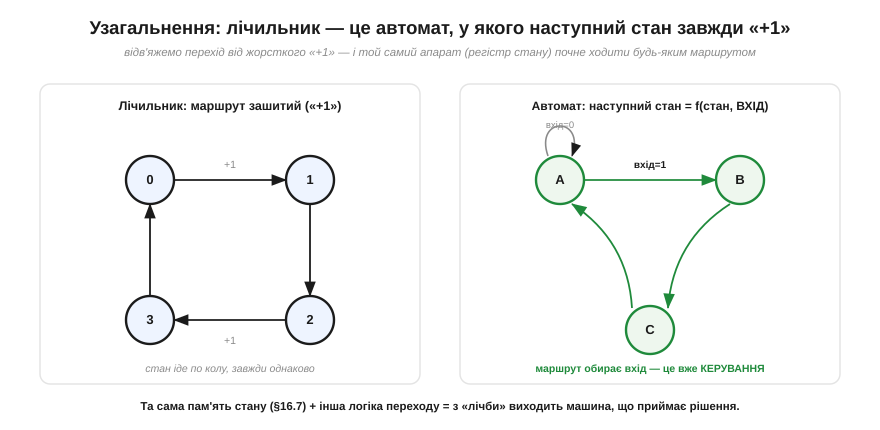
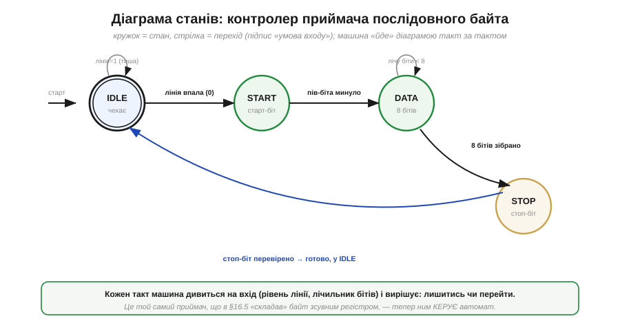

# Скінченні автомати: Мур і Мілі

Звичайний [лічильник](book:electronics/counters) уже виглядає «розумним»: він пам'ятає, де зупинився, і на кожному такті робить наступний крок. Та крок у нього завжди той самий — «додай одиницю». Він крокує по колу однаковим маршрутом і нічого не вирішує. А реальній машині потрібно більше: ловити старт-біт у потоці, чекати на готовність давача, вести багатокрокову операцію «по черзі», блимати світлофором за приписаним порядком. Усе це — не «лічба», а **поведінка**: машина має бути в певному **стані**, дивитися на **вхід** і залежно від нього **вирішувати**, куди перейти й що зробити. Інженерну форму цієї ідеї звуть **скінченний автомат** (*finite-state machine, FSM*), або **скінченний автомат станів**. Тут пам'ять (тригери) і логіка (вентилі) зливаються в машину, що не просто рахує, а **керує**. Саме автомати ховаються в кожному контролері протоколу, у кожному апаратному блоці мікроконтролера, що «веде» якусь послідовність дій, — і навіть сам [процесор](book:programming/what-is-processor) у серці своєму є автоматом.

### Від лічильника до автомата: відв'яжемо «+1»

Почнімо з простого й зробимо один крок убік. [Лічильник](book:electronics/counters) — це регістр стану плюс жорстко зашите правило переходу: «наступне число = поточне + 1». Уся хитрість FSM у тому, щоб **замінити це правило довільним**: хай наступний стан буде не «+1», а **будь-яка** функція поточного стану й входів.


*Рис. Ліворуч — лічильник: маршрут «зашитий», стан іде по колу 0→1→2→3→0 однаково, хоч би що довкола діялося. Праворуч — автомат: той самий регістр стану, але наступний стан тепер залежить і від **входу**. У стані A машина за входом=1 переходить у B, а за входом=0 лишається на місці; маршрут обирає вхід. Те, що раніше було сліпою лічбою, стало **керуванням** — машиною, яка приймає рішення.*

Бачите, як мало треба змінити? Пам'ять стану лишається та сама — той самий регістр на тригерах, що крокує по фронту такту. Складнішою стає лише **логіка переходу**: вона переростає суматор «+1» і впускає в себе **входи**. Цього досить, щоб з лічильника народилася машина зі справжньою поведінкою. У цьому й сила ідеї: FSM — не якась нова екзотична схема, а природне узагальнення лічильника. Лічильник виявляється **окремим, найпростішим випадком** автомата — таким, що ігнорує входи й завжди ходить по колу.

Затримаймося на слові **скінченний**. Воно не випадкове й несе цілком практичний зміст: станів — рівно стільки, скільки бітів у регістрі стану дозволяє розрізнити, тобто на k тригерах — щонайбільше 2ᵏ станів, і ні на один більше. Машина не може «вигадати» новий стан на ходу; усі її можливі становища перелічені наперед, як кімнати в будинку. Саме ця скінченність робить автомат таким зручним для проєктування: поведінку, хоч би яку звивисту, можна **повністю** описати скінченною діаграмою й бути певним, що інших станів не буде. Звідси й перше практичне питання, яким відкривають проєктування будь-якого автомата: «а скільки в нього станів?» — бо відповідь одразу каже, скільки треба тригерів (⌈log₂N⌉) і наскільки складною вийде логіка переходу. Мало станів — машина проста й дешева; багато — складна, та зате й поведінка багатша.

Дамо ідеї точні слова. **Стан** (*state*) — це «де зараз перебуває машина», та сама внутрішня змінна, що живе в регістрі. Скінченних станів — скінченна, наперед відома кількість (звідси й назва). **Перехід** (*transition*) — стрілка «з якого стану в який», і спрацьовує вона за певної **умови** на вході. На кожному фронті такту машина дивиться, у якому вона стані й що на входах, і за цими двома речами обирає **наступний стан**. У математики для цього є строгий [формалізм скінченних автоматів — стани, входи й діаграми переходів](book:math/finite-automata), та нам вистачить інженерної його сутності: формально це дві функції:

```
наступний стан = f(поточний стан, входи)     ← логіка переходу
вихід          = g(поточний стан [, входи])   ← логіка виходу
```

Перший рядок — це знайомий [кістяк усіх схем з пам'яттю](book:electronics/state-memory): комбінаційна логіка плюс зворотний зв'язок. Другий рядок дуже важливий: машина має ще й **щось робити**, тобто видавати **виходи**. І саме від того, як означено цей вихід — рядок `g`, — походять дві школи автоматів, Мура й Мілі. Та спершу варто побачити автомат у дії.

### Діаграма станів: мова, якою малюють поведінку

Перш ніж будувати автомат із вентилів, його **малюють**. Стандартна мова для цього — **діаграма станів** (*state diagram*): кружок на кожен стан, стрілка на кожен перехід, а підпис на стрілці — умова, за якої цей перехід стається. Це той самий жанр, що й мапа: дивишся й одразу бачиш, куди машина може піти і коли.

Візьмімо живий приклад. [Зсувний регістр](book:electronics/register) на приймачі послідовної лінії «складає» байт із окремих бітів, що приходять по одному дроту. Але хтось має тим зсувним регістром **керувати**: розпізнати початок посилки, відлічити рівно вісім бітів даних, перевірити кінець і повернутися чекати наступного. Оце «хтось» — і є автомат.


*Рис. Контролер приймача послідовного байта як автомат із чотирьох станів. **IDLE** — спокій: доки лінія тримає 1 (тиша), машина лишається тут (петля «лишитись»); щойно лінія впала в 0 (старт-біт) — перехід у **START**. Звідти, перечекавши належний час, — у **DATA**, де машина рахує біти й крутиться на місці, доки їх менше за вісім. Зібравши всі вісім — у **STOP** перевірити стоп-біт, і нарешті назад в IDLE, готовою до нової посилки. Подвійне кільце на IDLE позначає **початковий** стан. Кожен такт машина дивиться на вхід (рівень лінії, лічильник бітів) — і вирішує, лишитись чи рушити далі.*

Прочитайте діаграму як інструкцію, і ви фактично прочитаєте **протокол**. Саме тому інженери малюють автомат перш, ніж писати бодай рядок логіки: діаграма — це повний, недвозначний опис поведінки, який видно оком. На ній одразу помітні й типові помилки: стан, з якого нема виходу (машина «застрягне»), або умова, що нікуди не веде. Зверніть увагу на дві **петлі-на-собі** (в IDLE і DATA) — це те саме «тримати», що дає [засувка](book:electronics/sr-latch): за певної умови машина свідомо **лишається** у стані, тобто запам'ятовує, що подія ще не настала. FSM успадковує пам'ять прямо від тригера.

Корисно проглянути діаграму ще й «у русі», по тактах. Уявімо посилку: лінія тримає 1, машина сидить в IDLE — такт за тактом крутиться на петлі, нічого не змінюючи (це утримання стану). Лінія впала в 0 — на найближчому фронті такту (а не «коли заманеться», бо стан живе в [тактованому регістрі](book:electronics/clock-signal)) машина переходить у START. Далі по фронтах вона проходить DATA, де всередині крутиться, доки внутрішній [лічильник бітів](book:electronics/counters) не добереться до восьми, тоді STOP — і назад в IDLE. Кожен **крок** діаграми — це рівно один **фронт** спільного такту; між фронтами машина стоїть незмінно. Тобто автомат — це не якась окрема абстракція «згори», а буквально та сама [синхронна дисципліна спільного такту](book:electronics/clock-signal), лише описана зрозумілою людині мовою станів і переходів замість купи рівнянь для кожного тригера.

### Дві школи: Мур проти Мілі

Тепер — головна розвилка теми, та сама відмінність у рядку `g`. Питання просте: **коли** автомат виставляє свій вихід — за самим лише станом чи ще й зважаючи на поточний вхід? Дві відповіді дали двоє інженерів Bell Labs у 1950-х, і їхні імена закріпилися за двома типами автоматів.

**Автомат Мура** (*Moore machine*, Едвард Мур) каже: вихід залежить **тільки від стану**. У кожному кружку діаграми написано, що на виході, поки машина в цьому стані, — і цей вихід тримається **весь такт**, незалежно від того, як смикається вхід. **Автомат Мілі** (*Mealy machine*, Джордж Мілі) каже інакше: вихід залежить **і від стану, і від входу разом**, тож його пишуть **на стрілці** переходу, а не в кружку.


*Рис. Та сама поведінка, два почерки. **Мур** (ліворуч): вихід приписаний станові — «вих=0» у S0, «вих=1» у S1, і він стабільно тримається, доки машина в цьому стані. **Мілі** (праворуч): вихід висить на переході — «вх=1 / вих=1» означає «коли вхід=1, переходимо й видаємо 1». Тому Мілі реагує на вхід **того ж такту**, а Мур — лише на **наступному** (спершу зміниться стан, а вже він задасть вихід). За це Мілі платить тим, що його вихід може «мигати» слідом за входом між фронтами, тоді як вихід Мура завжди чистий і вирівняний по такту.*

Різниця тонша, ніж здається, тож зважмо її чесно — це і є серце теми. Оскільки у Мура вихід проходить **крізь регістр стану** (спершу вхід міняє стан на фронті, а вже стан визначає вихід), вихід Мура **відстає на один такт**, зате він **синхронний і стабільний**: міняється лише на фронтах, ніколи не «дзвенить». У Мілі вихід — це комбінаційна функція входу, що йде **повз** регістр прямо на вихід, тому реагує **миттєво, того самого такту**, але й успадковує всі смикання входу: змінився вхід посеред такту — смикнувся й вихід (це той самий [привид прозорості рівневої засувки](book:electronics/edge-vs-level), лише на виході автомата). Звідси практичне правило: коли вихід керує чимось чутливим до чистоти — іншим тактованим блоком, лінією, що мусить бути рівною, — беруть **Мура**; коли критична швидка реакція й на такт чекати не можна — **Мілі**. Часто будують **мішаний** автомат: більшість виходів за Муром (стабільні), а один-два — за Мілі (швидкі).

Є ще один практичний бік, через який інженери часто тягнуться до Мілі, — **ощадність на станах**. Хай треба видати сигнал «так!» того такту, коли на вході одиниця, а машина перед тим уже була «насторожена». Автомат Мілі обходиться двома станами («спокій» і «насторожі»), а сам сигнал чіпляє на потрібний перехід — вихід народжується «на стрілці». Автомат Мура для того ж змушений завести **окремий стан** під сам факт «зараз видаю так!», бо інакше виходу нема де «жити», окрім як у кружку, — і станів стає більше. Загальне правило: Мілі нерідко описує ту саму поведінку **меншим числом станів**, зате Мур дає чистіший вихід. І ще важливе: будь-який автомат Мілі можна перетворити на еквівалентний автомат Мура (якраз ціною таких **додаткових станів**) і навпаки — це той самий клас машин, лише по-різному записаний. Вибір між ними — не про можливості, а про **компроміс** «затримка й кількість станів проти чистоти виходу».

### Як його будують: регістр стану плюс дві логіки

Лишилося показати — натяком, бо повний код буде окремою ⚙️-вставкою, — як автомат лягає в залізо. І тут на нас чекає приємний сюрприз: нічого нового будувати не треба. Автомат збирається рівно з тих цеглинок, що ми маємо, у вже знайомій [конфігурації «логіка + пам'ять + зворотний зв'язок»](book:electronics/state-memory).


*Рис. Канонічна «трикутна» схема будь-якого автомата. Серце — **регістр стану** на тригерах: він зберігає поточний стан і на кожному фронті такту робить «наступний стан» поточним. **Логіка наступного стану** — звичайна комбінаційна схема з вентилів, що бере поточний стан і входи й обчислює, куди перейти. **Логіка виходу** — теж комбінаційна, обчислює виходи зі стану. Поточний стан **вертається** з виходу регістра назад у логіку переходу — ось і весь зворотний зв'язок. Пунктир — різниця Мілі: у нього входи заходять **і** в логіку виходу (тому вихід реагує одразу); у Мура цього пунктиру нема.*

Упізнаєте? Це той самий малюнок [«комбінаційна логіка + пам'ять стану + зворотний зв'язок»](book:electronics/state-memory) — лише тепер кожен блок має ім'я й роль. [Регістр стану](book:electronics/register) дає **пам'ять** і **синхронність**: машина крокує строго по фронту спільного такту, тож усі тонкощі [таймінгу й метастабільності](book:electronics/metastability-timing) (критичний шлях, setup/hold, метастабільність на асинхронних входах) діють тут так само — і так само рятують. Дві комбінаційні логіки — це просто два блоки [вентилів](book:electronics/basic-gates), кожен з яких проєктують звичайними методами комбінаційної схемотехніки. Логіка рахує, тригери тримають, такт диригує — а разом вони дають **машину з поведінкою**.

Як саме «записати» стани в бітах регістра — окреме інженерне рішення (кодування станів): можна звичайними двійковими числами (компактно, та логіка переходу складніша), а можна так званим «один-із-багатьох», де на кожен стан — свій тригер (більше тригерів, зате логіка простіша й швидша). Це вже деталі реалізації, до яких разом із повним кодом автомата ми повернемося у ⚙️-вставці; тут досить розуміти **кістяк**.

> ⚙️ **Далі — у вставці.** Повна реалізація автомата (опис станів, таблиця переходів, кодування й готовий код контролера) винесена в окрему ⚙️-вставку до цієї теми, щоб тут лишити чисту теорію: ідею стану, діаграму й вибір Мур/Мілі.

> 🔧 **Навіщо це.** Скінченний автомат — це, мабуть, найважливіший спосіб **мислення** в усій цифровій техніці, бо саме так проєктують будь-яку керувальну логіку. Винесіть головне. Перше: щойно задача звучить як «зробити по черзі», «дочекатися», «розпізнати послідовність», «вести протокол» — це **автомат**, і першим ділом його **малюють** діаграмою станів, а не кидаються писати код. Друге: **стани — це пам'ять** машини (тригери), **переходи — її рішення** (вентилі за входами); ви свідомо обиратимете, які стани потрібні й коли між ними ходити. Третє, суто практичне: **Мур** дає чисті, вирівняні по такту виходи (беріть для всього, що керує іншою синхронною логікою), **Мілі** — швидку реакцію того ж такту (беріть, коли на такт чекати не можна); це компроміс «затримка проти чистоти». І сам [процесор](book:programming/what-is-processor) у глибині — великий автомат (вибірка → декодування → виконання — це його стани), а кожен апаратний блок мікроконтролера, що «веде» обмін по шині, — це теж скінченний автомат, який хтось намалював діаграмою.

**Приклад (скільки станів і тригерів).** Спроєктуймо «на пальцях» автомат для світлофора з послідовністю **зелений → жовтий → червоний → червоно-жовтий → (знову зелений)**, що перемикається по сигналу таймера. Скільки потрібно станів і тригерів і якого типу зробити вихід?

```
Кроки послідовності — і є стани:
    S0 = ЗЕЛЕНИЙ
    S1 = ЖОВТИЙ
    S2 = ЧЕРВОНИЙ
    S3 = ЧЕРВОНО-ЖОВТИЙ
  → кількість станів  N = 4

Скільки тригерів у регістрі стану:
  треба k бітів, щоб закодувати 4 стани → 2^k ≥ N
    2^k ≥ 4  →  k = 2          (двійкове кодування: 00,01,10,11)
  → регістр стану = 2 тригери

Перехід (логіка наступного стану):
  по сигналу таймера tick:  стан → наступний по колу
    S0→S1→S2→S3→S0  (це знов «лічильник», але за модулем 4!)
  без tick:  лишитись (петля на собі)

Вихід (три лампи: R, Y, G) — за станом, тому МУР:
  стан | R Y G
   S0  | 0 0 1     ← вихід залежить ЛИШЕ від стану,
   S1  | 0 1 0       тримається весь час, поки горить, —
   S2  | 1 0 0       лампі НЕ можна «мигати» з входом,
   S3  | 1 1 0       тож Мілі тут небезпечний → беремо Мур
```
Виходить машина на **двох тригерах** (стан) плюс трохи вентилів (перехід «по колу за tick» і таблиця ламп). Зверніть увагу на два уроки. По-перше, перехід «по колу за сигналом» — це по суті **mod-4 [лічильник](book:electronics/counters)**: світлофор виявляється лічильником, чий «рахунок» ми тлумачимо як кольори. По-друге, вихід тут **навмисно Мура**: лампа мусить горіти рівно й стабільно весь свій час, а не смикатися слідом за дрібними змінами входу, — і саме чистота виходу Мура це гарантує. Той самий автомат можна було б зробити й на Мілі, але довелося б пильнувати, щоб лампи не мерехтіли, — зайвий клопіт там, де Мур дає спокій задарма.

---

**Підсумок.** **Скінченний автомат** (*FSM*) — це машина, що перебуває в одному зі **скінченного** числа **станів** і на кожному фронті такту за поточним станом і **входами** обирає **наступний стан** та **вихід**. Він — пряме узагальнення [лічильника](book:electronics/counters): відв'яжіть жорстке «+1», дозвольте логіці переходу залежати від входів — і сліпа лічба стає **керуванням** (лічильник виявляється найпростішим автоматом). Поведінку автомата малюють **діаграмою станів** (кружки-стани, стрілки-переходи з умовами), і ця діаграма — повний опис протоколу. Дві школи різняться тим, **звідки** береться вихід: **Мур** — вихід лише від стану (стабільний, чистий, але на такт пізніше), **Мілі** — вихід від стану й входу (реагує одразу, та може «мигати»); вибір — компроміс «затримка проти чистоти», а самі машини еквівалентні. Будують автомат канонічно: [**регістр стану**](book:electronics/register) (тригери) + **логіка переходу** + **логіка виходу** ([вентилі](book:electronics/basic-gates)) зі зворотним зв'язком. Логіка, пам'ять, такт — і виходить машина з поведінкою.
