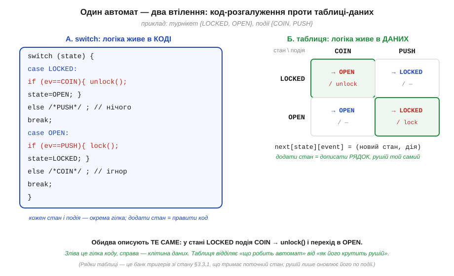
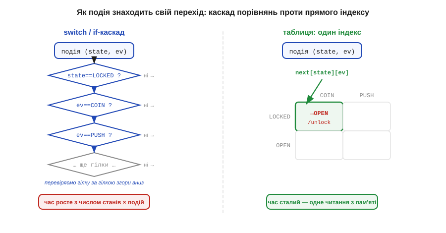
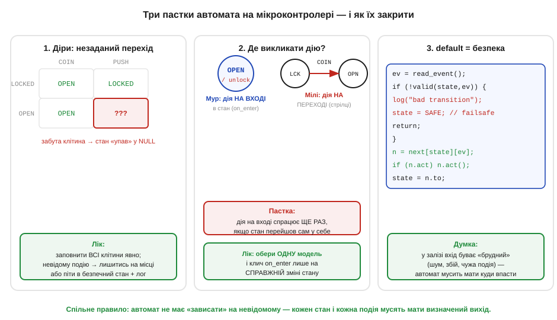

# 📜 Звідки взялися «стани й переходи»: Гаффмен, Мілі, Мур

> Історія за [скінченними автоматами](book:electronics/finite-state-machines). Як схема автомат показує себе так: банк тригерів тримає стан, а [комбінаційна логіка](book:electronics/combinational-circuits) рахує наступний стан і виходи. Тут — звідки взявся сам цей **спосіб думати**. Виявляється, ідея «стан плюс таблиця переходів» народилася не в програмуванні, а в інженерів телефонних релейних схем 1950-х, які шукали, як **перестати вгадувати** й почати проєктувати послідовнісні кола за чіткою процедурою. А корінням вона сягає тієї самої [петлі зворотного зв'язку, що тримає стан](book:electronics/state-memory).

## Проблема, з якої все почалося: схема з пам'яттю — це важко

До кінця 1940-х логічні (комбінаційні) кола вже вміли проєктувати охайно: є [булева алгебра від Шеннона](book:electronics/why-digital/hist-shannon.md), є таблиці істинності, є способи спростити вираз. Але щойно в коло вводили **пам'ять** — зворотний зв'язок, реле, що тримає себе, — усе ламалося. Поведінка такого кола залежала вже не лише від входів **зараз**, а й від того, що було **раніше**, тобто від його внутрішнього **стану**. А станів у заплутаній релейній схемі могло бути десятки, переплетених так, що ніхто не міг ні довести її правильність, ні навіть упевнено сказати, скільки в неї станів насправді.

Інженери збирали такі схеми радше **інтуїцією** й латанням: працює на стенді — добре. Це нагадувало норов простої [SR-засувки](book:electronics/sr-latch): лишена напризволяще, вона реагує на входи будь-коли, і ловити її «прозорість» доводилося хитрощами. Бракувало не кмітливості, а **методу** — формальної процедури, що звела б плутанину пам'яті до чогось такого ж керованого, як таблиця істинності.

Гострим це питання було не випадково: найбільші релейні автомати тих часів — це **телефонні комутатори** Bell System, де те саме [реле з самопідтримкою](book:electronics/state-memory/hist-flip-flop.md) «пам'ятало» зайняті лінії. Схема з сотень реле могла мати астрономічно багато станів, і «латати інтуїцією» там ставало і дорого, і небезпечно. Тож не дивно, що значну частину рятівної теорії дали згодом саме дослідники Bell Labs (Мілі й Мур) — їм цей біль був добре знайомий; а перший крок зробив Гаффмен, тоді ще пов'язаний з MIT.

## Девід Гаффмен (1954): таблиця переходів і «стан — це петля»

Перший великий крок зробив **Девід Гаффмен** (*David A. Huffman*) — той самий, чиє ім'я носить код стиснення. Це була, по суті, його **докторська робота** в MIT (1953, науковий керівник *Samuel H. Caldwell*); скорочену версію він 1954 року опублікував у *Journal of the Franklin Institute* як «The synthesis of sequential switching circuits» — і фактично **заснував** інженерію послідовнісних кіл. Гаффмен запропонував описувати схему з пам'яттю не дротами, а **таблицею станів** (її назвали *flow table*): рядок — стан, стовпець — комбінація входів, у клітинці — куди схема перейде й що видасть. Та сама двовимірна таблиця переходів, на якій тримається [скінченний автомат](book:electronics/finite-state-machines) — чи то в залізі, чи в коді.

Але найглибша його думка — інша. Гаффмен показав, що **кожна двійкова змінна стану неминуче пов'язана з петлею зворотного зв'язку** — тобто із засувкою. Інакше кажучи: щоб схема щось «пам'ятала», у ній **мусить** бути зворотний зв'язок, і кількість бітів стану — це кількість таких петель. Це рівно той самий висновок, до якого приводить [пам'ять як самопідтримна петля](book:electronics/state-memory), тільки взятий з боку **методології**. Гаффмен додав і практичний рецепт: закодувати стани двійковими числами, провести через петлі-затримки, а далі — звести все до кількох **[комбінаційних схем](book:electronics/combinational-circuits)**, які проєктувати вже вміють. Заразом він попередив про **гонки** (коли кілька бітів стану міняються «навперейми» й результат залежить від того, хто встиг першим) — ту саму небезпеку, що виявляється як [метастабільність](book:electronics/metastability-timing).

І ще одне, дуже практичне, дав той самий 1954 рік. Зібравши таблицю «з голови», інженер часто діставав у ній **зайві** стани — різні рядки, що насправді поводяться **однаково** (на будь-яку послідовність входів дають той самий вихід). Гаффмен описав, як такі **еквівалентні стани** знайти й **позлипати**, скоротивши таблицю до мінімальної (для цього він малював «діаграму злиття», *merger diagram*). Навіщо це нам? Бо менше станів — менше рядків — менше бітів — а отже, **менше тригерів** у залізі. Той самий рахунок працює й у коді: зайвий стан — це зайвий рядок таблиці переходів і ще одна нагода помилитися. Ця **мінімізація станів** — Гаффменів спадок, що економить залізо й нерви досі.

> 🔧 **Навіщо це.** Коли ви в коді заводите змінну `state` і таблицю `next[state][event]`, ви буквально користуєтесь апаратом Гаффмена. «Скільки бітів треба на стан» = «скільки тригерів» = log₂ від числа станів — це його ж рахунок. А його засторога про гонки — пряма причина, чому асинхронні входи заводять через [синхронізатор](book:electronics/metastability-timing).

## Джордж Мілі (1955): вихід залежить і від стану, і від входу

Рік по тому, 1955-го, **Джордж Мілі** (*George H. Mealy*) з Bell Labs у статті «A method for synthesizing sequential circuits» (*Bell System Technical Journal*, т. 34) дав цьому строгу **процедуру синтезу** — як від словесного опису поведінки прийти до конкретної схеми кроками, а не осяянням. Мілі прямо спирався на Гаффмена й на роботу Мура (про неї далі), і його внесок зазвичай згадують за однією важливою деталлю в моделі.

У моделі Мілі **вихід** автомата залежить **і від стану, і від поточного входу** — тобто від комбінації «де ми є» плюс «що саме надійшло». На діаграмі це означає, що дію (вихід) підписують на **стрілці переходу**, а не у вузлі. Практично така машина буває **компактнішою** — менше станів на ту саму задачу — і реагує на вхід **того ж такту**. Саме її звуть **автоматом Мілі**, і саме її «дія на переході» дає одну з типових пасток коду.

## Едвард Мур (1956): вихід залежить лише від стану

Майже одночасно **Едвард Мур** (*Edward F. Moore*), теж із Bell Labs, дивився на ту саму річ під іншим кутом. Його стаття «Gedanken-experiments on sequential machines» вийшла 1956 року у збірці «Automata Studies», яку впорядкували **Клод Шеннон** і **Джон Маккарті** (Princeton University Press). Сам термін «геданкен-експеримент» (уявний експеримент) Мур позичив у **фізиків**, і це видає його погляд: не «як збудувати схему», а «що про машину взагалі **можна дізнатися ззовні**».

Питання він поставив так. Уявімо скінченну машину (скінченне число станів, входів, виходів, поведінка строго детермінована) як **запаяну чорну скриньку**: ми вільні подавати на вхід будь-які послідовності й бачити виходи, але **зазирнути всередину не можемо**. Що про її внутрішній **стан** реально вдасться з'ясувати самими лиш дослідами «вхід → вихід»? Мур показав і втішне, і несподіване: підбираючи особливу **розрізнювальну послідовність**, стан часто можна визначити, — але є машини, для яких певні внутрішні відмінності назовні **принципово не проявляються**, тож знати стан «напевно» не вийде нізащо. Це був перший строгий погляд на автомат як на об'єкт, який **спостерігають**, а не лише проєктують, — і саме звідси тягнеться лінія до перевірки й тестування цифрових схем.

З тим самим прицілом на «зовнішню» поведінку пов'язана й модель виходу, що носить Мурове ім'я. У ній **вихід залежить тільки від стану** — від того, «де ми є», незалежно від того, яка подія нас сюди привела. На діаграмі дію підписують **у вузлі стану**. Таку машину ми звемо **автоматом Мура**; вона зазвичай має **більше станів**, ніж еквівалентна машина Мілі, зате її поведінка **простіша й передбачуваніша** — вихід однозначно «прив'язаний» до стану. Цей розкол на дві школи — Мілі (дія на переході) і Мур (дія в стані) — дожив до сьогодні незмінним; обидві моделі еквівалентні за потужністю, і вибір між ними — питання зручності.

## Глибше коріння: нейрони, регулярні події й regex

Варто чесно сказати, що сама **ідея** скінченної машини зі станами старша за цих інженерів. Ще 1943 року **Воррен Маккалок** (*Warren McCulloch*) і **Волтер Піттс** (*Walter Pitts*) у моделі нейрона описали мережу, що по суті була скінченним автоматом, а на початку 1950-х **Стівен Кліні** (*Stephen Kleene*) довів славетну теорему: те, що вміють розпізнавати скінченні автомати, — це точно **регулярні події**, тобто мова **регулярних виразів** (*regex*). Тож «стани з переходами», логічні кола й знайомий програмістам regex — це **одне й те саме** з трьох боків: біологія, залізо й формальна мова. Сам формалізм скінченного автомата — множина станів, алфавіт входів, функція переходів — і його точна рівність із регулярними мовами заслуговують окремого розгляду; тут досить бачити, що всі три погляди сходяться в одному.

Підсумок історії: «стан плюс таблиця переходів» — не випадковий трюк, а вистраждана відповідь інженерів на питання «як приборкати схему з пам'яттю». Гаффмен дав таблицю й показав, що стан — це завжди [петля зворотного зв'язку](book:electronics/state-memory); Мілі й Мур дали дві моделі виходу, між якими обирають досі; а Маккалок–Піттс і Кліні показали, що та сама ідея живе й у нейронах, і в regex. Усе це за нас «знає» схема [скінченного автомата](book:electronics/finite-state-machines) — лишається перенести її в код.

---

# ⚙️ Автомат у коді: switch проти таблиці переходів

> Як [скінченний автомат](book:electronics/finite-state-machines) лягає в код. У залізі він — тригери, що тримають стан, плюс логіка переходів. Той самий автомат щодня живе й **у програмі** на мікроконтролері — кнопкою з антидребезгом, розбором протоколу, перемиканням режимів. І тут одразу постає вибір, як його **записати**: розгалуженням `switch` чи **таблицею переходів** як даними. Різниця не косметична — вона визначає, наскільки автомат легко розширювати й наскільки важко в ньому помилитися.

## Задача

Маємо [скінченний автомат](book:electronics/finite-state-machines): скінченна множина **станів**, потік **подій** на вході, і правило — у якому стані яка подія куди **переводить** і яку **дію** при цьому виконати. Як приклад візьмемо канонічний навчальний автомат — турнікет: стани `LOCKED`/`OPEN`, події `COIN` (жетон) і `PUSH` (штовхнули). Питання вставки вузьке й практичне: яким **кодом** це втілити на МК, щоб автомат було легко читати, безпечно розширювати й важко «зламати» забутим переходом.

## Ідея


*Рис. Ліворуч — логіка автомата «зашита» в код: `switch(state)`, усередині `if` по події, дія й присвоєння нового стану. Праворуч — та сама логіка винесена в **дані**: двовимірна таблиця `next[state][event]`, де клітинка задає (новий стан, дію). Обидва описують той самий перехід (`LOCKED` + `COIN` → `unlock` і в `OPEN`), але таблиця відділяє «що робить автомат» від «як його крутить рушій».*

Перший підхід — **`switch`**: зовнішній `switch` по стану, всередині розгалуження по події, у гілці — виклик дії й присвоєння нового стану. Це найочевидніший спосіб, і для трьох-чотирьох станів він цілком читабельний. Вада в тому, що **логіка автомата розмазана по коду**: щоб додати стан, треба вписати нову гілку, не забувши в **кожній** іншій гілці передбачити переходи до неї й з неї. Зі зростанням числа станів `switch` розповзається, а ймовірність забути комбінацію зростає квадратично.

Другий підхід — **таблиця переходів**: ту саму інформацію кладуть у **дані** — двовимірний масив `next[state][event]`, де кожна клітинка зберігає пару «(новий стан, дія)». Тоді код, що крутить автомат (**рушій**, *engine*), стає крихітним і **незмінним**: знайшов клітинку — виконав дію — оновив стан. Уся поведінка живе в таблиці, тож додати стан — це **дописати рядок**, а не правити логіку. Це прямий нащадок *flow table* Гаффмена з історії вище: стан — рядок, подія — стовпець.


*Рис. Як подія знаходить свій перехід. У `switch`/`if`-каскаді (ліворуч) виконавець перебирає гілки згори вниз — у найгіршому разі час росте з числом станів, помножених на події. У таблиці (праворуч) пара (стан, подія) — це просто **індекс**: одне читання з пам'яті, час сталий незалежно від розміру автомата.*

Є між ними й різниця у **швидкості пошуку** переходу, хоч на малих автоматах вона й непомітна. `switch`, що розгортається в ланцюг порівнянь, у найгіршому разі перебирає гілки по черзі. Таблиця ж адресується **індексом**: `next[state][event]` — це одне звертання до пам'яті, O(1) незалежно від числа станів. (Компілятор іноді й сам перетворює щільний `switch` на стрибок за таблицею, тож на практиці розрив менший, ніж здається, — але концептуально таблиця завжди стала.)

## Псевдокод

Рушій табличного автомата вкладається в кілька рядків — і саме ця стислість і є його головна перевага:

```
# next[state][event] = (новий_стан, дія)   ← уся поведінка тут, як дані
state = START

loop:
    ev = wait_event()                 # подія: натиск, байт, тайм-аут…
    if not valid(state, ev):          # клітинки для цієї пари нема
        log("bad transition")
        state = SAFE                   # failsafe: куди завжди безпечно впасти
        continue
    (next_state, action) = next[state][ev]
    if action: action()                # виконати дію переходу (модель Мілі)
    if next_state != state:            # перехід СПРАВДІ змінює стан?
        on_exit(state)                 # дії «на виході» зі старого…
        on_enter(next_state)           # …і «на вході» в новий (модель Мура)
    state = next_state
```

Зверніть увагу на дві деталі, що прямо випливають з історії. Виклик `action()` **на переході** — це модель **Мілі** (дія прив'язана до стрілки); пара `on_enter`/`on_exit`, прив'язана до стану, — це модель **Мура**. Реальний код часто змішує обидві, і це нормально, доки ви свідомо вирішили, **що** до чого прив'язуєте.

## Складність і пастки на МК


*Рис. Три класичні граблі. Зліва: **діра** в таблиці — забута клітинка, і автомат «провалюється» в невизначеність. У центрі: **де викликати дію** — у стані (Мур) чи на переході (Мілі); дія «на вході» зрадливо спрацьовує вдруге, якщо стан переходить сам у себе. Справа: **default → безпечний стан** — на «брудний» вхід автомат мусить мати куди впасти.*

Складність рушія — **O(1)** на подію (одне індексування) і **O(станів × подій)** пам'яті під таблицю; для типового МК-автомата на одиниці-десятки станів це копійки. Небезпеки не в швидкості, а в **повноті й коректності**, і всі вони добре відомі:

- **Діри в таблиці — найгірша пастка.** Якщо для пари (стан, подія) клітинку забули, автомат потрапляє в невизначеність — «провалюється» в чужий стан або падає. Тому таблицю заповнюють **повністю**: кожен стан × кожна подія. Невідому чи неможливу подію в стані не лишають порожньою, а явно скеровують — лишитися на місці або піти в безпечний стан із записом у лог.
- **`default` має вести в безпеку.** У залізі вхід буває «брудним»: шум, збій, чужа чи невчасна подія. Автомат мусить **завжди** мати визначений `default` — куди впасти при будь-якій несподіванці (часто це стан `SAFE`/`ERROR` чи `IDLE`). Автомат, що «зависає» на невідомій події, на МК неприпустимий.
- **Дія в стані vs на переході (Мур vs Мілі).** Якщо чіпляти дію «на вході в стан» (`on_enter`), а перехід веде зі стану **в нього ж**, дія спрацює **повторно** — класичне джерело подвійних `unlock()`. Рецепт: оберіть **одну** модель і кличте `on_enter`/`on_exit` лише на **справжній** зміні стану (`next_state != state`), як у псевдокоді вище.
- **Хто постачає події — окрема відповідальність.** Автомат **споживає** події, але не породжує їх. Натиск кнопки спершу очищають від дребезгу, зовнішній сигнал — [синхронізують](book:electronics/metastability-timing), байт приходить з переривання. Якщо в `wait_event()` пролізе «брудна» подія, жодна модель автомата вас не врятує — сміття на вході дасть сміття на виході.
- **Таблиця в незмінній пам'яті.** На МК таблицю переходів зазвичай кладуть у `const`/flash: і місце в ОЗП економиться, і логіку автомата неможливо випадково зіпсувати записом. Збереженим лишається тільки `state` — одна змінна, рівно той самий «банк тригерів», що [тримає стан у залізі](book:electronics/state-memory), тільки програмний.

Висновок: `switch` — це автомат, **записаний як код**, і він добрий, поки станів мало; таблиця переходів — це автомат, **записаний як дані**, і він виграє, щойно автомат росте: рушій лишається крихітним і незмінним, повноту легко перевірити оком по сітці, а нову поведінку додають рядком таблиці. Обидва — це той самий [скінченний автомат](book:electronics/finite-state-machines), лише перенесений із тригерів у пам'ять програми; і вся інженерія тут — не в синтаксисі, а в тому, щоб **жодна** клітинка не лишилася незаданою.
