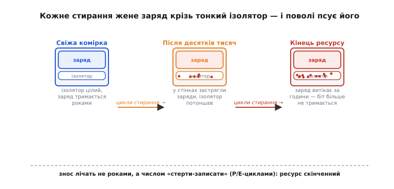
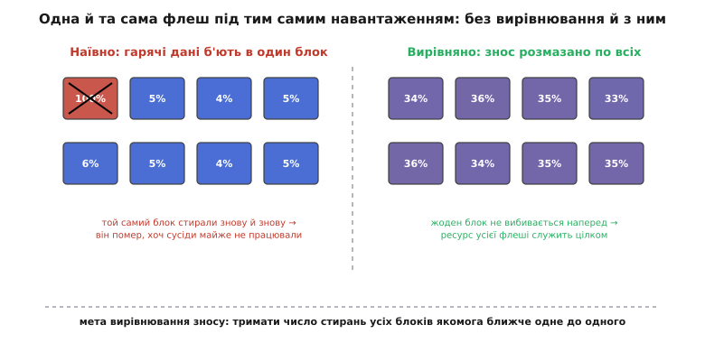
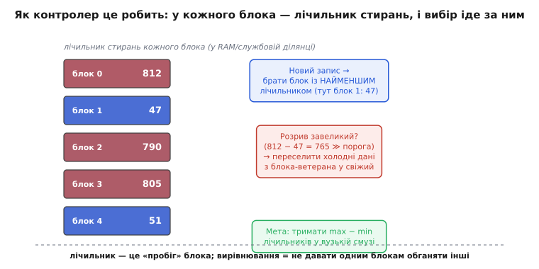
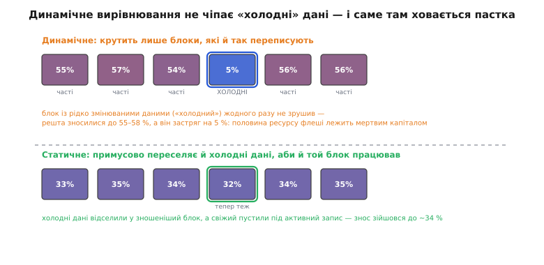

# Вирівнювання зносу Flash

Пам'ять флеш має властивість, якої немає ні в оперативної пам'яті, ні в жорсткого диска: вона **зношується від запису**. Кожна комірка витримує лише скінченне число циклів «стерти-записати», а тоді просто перестає надійно тримати біт — не через роки, а через **число операцій**. І тут ховається підступна пастка. Якщо один і той самий шматок даних переписувати знову й знову — скажімо, лічильник, журнал чи таблицю, що змінюється щосекунди, — то без запобіжника всі ці записи лягатимуть в **одне й те саме фізичне місце**. Кілька блоків флеші зносяться до смерті за лічені дні, тоді як решта мільярда комірок лишиться майже незайманою. Носій «помре» повним сил.

**Вирівнювання зносу** (англ. *wear leveling* — «вирівнювання спрацювання») — це той запобіжник. Його єдина мета: **розмазати знос рівно по всій флеші**, щоб жоден блок не вибіг наперед і не сконав, поки сусіди байдикують. Розберімо, звідки взагалі береться межа зносу, чому наївний запис її так безжально порушує, і якими прийомами контролер тримає всі блоки в одному темпі старіння.

### Звідки береться межа: чому комірка вмирає від запису

Спершу — головне «чому», бо без нього вся тема висить у повітрі. Оперативну пам'ять можна переписувати трильйони разів, і їй байдуже. Флеш — ні. У чому різниця?

Біт у флеші — це порція заряду, замкнена в мікроскопічній пастці всередині транзистора: «є заряд» читається як один логічний рівень, «нема» — як інший. Читати цей заряд можна безкінечно, він від погляду не псується. А от **покласти** заряд у пастку чи **вибити** його звідти — зовсім інша річ. Пастку з усіх боків оточує тонесенький шар ізолятора (**тунельний оксид**, *tunnel oxide*), і в звичайному стані він заряд не пускає — на те він і ізолятор, щоб біт тримався роками. Щоб усе-таки загнати заряд усередину або витягти його назовні, до комірки прикладають високу напругу й **проштовхують заряд просто крізь ізолятор** — фізика зве це тунелюванням.

І ось у цьому «проштовхуванні крізь» — джерело смерті. Щоразу, як заряд силою протискається крізь ізолятор, він лишає в ньому крихітну шкоду: подекуди застрягають окремі заряди, у структурі накопичуються дефекти, шар поволі псується. Одне стирання — мізерна, непомітна травма. Але десятки тисяч стирань складаються, і настає день, коли ізолятор уже не тримає заряд так щільно, як мав: біт починає «підтікати» за години замість років, і комірка стає ненадійною. Це не поломка від старості на полиці — це **втома від роботи**, і лічать її не часом, а числом операцій «стерти-записати».


*Одна комірка на трьох етапах життя. Свіжа — ізолятор цілий, заряд тримається роками. Після десятків тисяч стирань у стінках ізолятора застрягли заряди, він потоншав. Наприкінці ресурсу заряд витікає за години — біт більше не тримається. Кожне стирання жене заряд крізь ізолятор і трохи його псує, тому знос лічать не роками, а числом циклів «стерти-записати».*

Цей ліміт має ім'я — **ресурс за циклами програмування-стирання** (*P/E cycles*, від *program/erase* — «записати/стерти»). Одне «стерти-записати» = один P/E-цикл. І ресурс цей залежить від того, наскільки щільно виробник напхав біти в комірку. Груба орієнтація за типами (точні числа різняться від покоління до покоління й лежать у даташиті):

```
SLC (1 біт у комірку)   ≈ 30 000 … 100 000 P/E-циклів
MLC (2 біти)            ≈  3 000 …  10 000
TLC (3 біти)            ≈  1 000 …   3 000
QLC (4 біти)            ≈    150 …   1 000
```

Закономірність різка: **кожен зайвий біт у комірку зрізає ресурс приблизно вдесятеро**. Дешева щільна QLC-флеш телефона чи бюджетного диска витримує лише сотні перезаписів на комірку — а це вже так мало, що без вирівнювання зносу її можна вбити цілком буденним навантаженням. (Скільки бітів утиснуто в одну комірку й чому це так б'є по ресурсу — окрема тема про [рівні комірки SLC/MLC/TLC/QLC](topic:electronics/nand-cell-levels).)

> 🔧 **Навіщо це.** Коли на пласі стоїть флеш і ви прикидаєте, скільки вона проживе, — рахуйте не в роках, а в **записах**. Прошивка, що раз на секунду скидає у флеш той самий блок налаштувань, за рік зробить понад 30 мільйонів записів у одне місце — і без вирівнювання зносу дешева TLC-комірка (ресурс ~1–3 тисячі) сконає за годину-другу такого биття. Саме звідси береться інженерне правило «не пиши у флеш у циклі» й потреба у вирівнюванні: воно перетворює «30 мільйонів записів в одну комірку» на «по кілька тисяч у кожну з мільйонів».

### Друга особливість флеші: стирають лише цілими блоками

Є ще одна риса флеші, без якої вирівнювання не зрозуміти, — і вона тісно сплетена зі зносом. Записати у флеш можна дрібно, **посторінково** (*page*, типово кілька кілобайтів), але **стерти** окрему сторінку не можна. Стирання працює лише **великими шматками** — цілим **блоком стирання** (*erase block*) з десятків чи сотень сторінок одразу. І записати в сторінку можна тільки якщо вона перед тим стерта; переписати зайняту сторінку «поверх» флеш не вміє.

Ось чому «одиниця зносу» — це саме **блок**, а не байт і не сторінка. Знос накопичує та сама операція, що й стирає, а стирання завжди зачіпає цілий блок. Тому й лічильник, який ми будемо вести, — це число стирань **на блок**: скільки разів цей конкретний блок пройшов повний цикл «стерти-записати».

Ця «стирай блоками, не переписуй на місці» породжує окремий прошарок — [FTL, що вдає рівний диск поверх примхливої флеші](topic:electronics/emmc-ssd/proj-toy-ftl.md). FTL тримає **таблицю відображення** (який логічний сектор де зараз фізично лежить) і пише завжди в **нове** вільне місце, а не на старе. Вирівнювання зносу живе саме тут, усередині цього прошарку, і спирається на його механіку: раз фізичне місце сектора й так щоразу нове, лишається тільки **розумно вибирати, яке саме** нове місце дати — і цим керувати зносом. Далі ми припускаємо, що така непрямість уже є; наша тема — як над нею вирівняти знос.

### Пастка наївного запису: гарячі дані вбивають один блок

Тепер видно саму проблему в усій гостроті. Уявімо, що непрямість є, але вибирає місце наївно — скажімо, завжди бере **перший-ліпший** вільний блок або крутить кілька блоків по колу. Дані на носії бувають дуже різні за «температурою»: одні **гарячі** (*hot*) — їх переписують безперестанку (журнал, лічильник, робоча таблиця); інші **холодні** (*cold*) — лягли раз і лежать роками (прошивка, картинки, архів).

Гарячі дані — це струмінь нескінченних перезаписів. Якщо наївна логіка раз у раз саджає цей струмінь в одні й ті самі кілька блоків, ці блоки перемелюють свій ресурс P/E-циклів за лічені дні, тоді як блоки з холодними даними навіть не наближаються до своєї межі. Носій виходить з ладу, коли **перший-таки** блок вичерпав ресурс, — а на той момент решта флеші зношена, скажімо, на п'ять відсотків. Дев'яносто п'ять відсотків закладеного ресурсу пропало намарно.


*Та сама флеш під тим самим навантаженням. Ліворуч наївно: гарячі дані били в один блок — він відпрацював 100 % ресурсу й помер (перекреслений), хоч сусіди зношені на 4–6 %. Носій відмовив, а майже весь ресурс лежить невикористаний. Праворуч вирівняно: знос розмазано, усі блоки на ~35 % — жоден не вибивається наперед, і ресурс усієї флеші служить цілком. Мета вирівнювання — тримати число стирань усіх блоків якомога ближче одне до одного.*

Мета вирівнювання зносу звідси випливає сама: **не давати жодному блокові обганяти інші за числом стирань**. Якщо всі блоки старіють в одному темпі, то й помруть вони приблизно разом — а це означає, що носій витисне майже весь закладений сумарний ресурс, а не крихітну його частку. Формально: тримати **розкид** між найзношенішим і найсвіжішим блоком у вузькій смузі.

### Найпростіший механізм: лічильник стирань і вибір «наймолодшого» блока

Як цього досягти? Ідея напрочуд проста, і вона прямо випливає з мети. Раз ми хочемо, щоб блоки старіли рівно, треба **знати вік кожного** й щоразу навантажувати **наймолодший**. Тож заведемо на кожен блок **лічильник стирань** (*erase count*) — скільки разів його вже стирали. Це «пробіг» блока. Лічильники живуть у пам'яті контролера (а щоб пережити вимкнення — дублюються в службовій ділянці самих блоків).

Тепер правило вибору: **коли треба свіже стерте місце під запис — бери блок із найменшим лічильником**. Наймолодший блок отримує нову порцію роботи, його лічильник по стиранні зростає, і наступного разу «наймолодшим» стане вже інший. Так навантаження природно **перетікає** з блока на блок, і жоден не виривається далеко вперед.


*Серце вирівнювання. У кожного блока — лічильник стирань (його «пробіг»), що живе в RAM і дублюється у флеші. Новий запис іде в блок із найменшим лічильником (тут блок 1: 47). Якщо розрив між ветераном і новачком завеликий (812 − 47 ≫ порога), контролер додатково переселяє холодні дані з блока-ветерана у свіжий. Мета — тримати різницю max − min лічильників у вузькій смузі.*

Ось як цей вибір виглядає в коді контролера — навмисне спрощено, але це справжня механіка, не псевдокод:

**Приклад (вибір блока під новий запис за лічильником стирань).** Серед усіх вільних (стертих) блоків беремо той, чий лічильник найменший.

:::tabs
```cpp
#include <stdint.h>

#define N_BLOCKS 1024

uint32_t erase_count[N_BLOCKS];   // «пробіг» кожного блока
uint8_t  is_free[N_BLOCKS];       // 1 = блок стертий, готовий приймати запис

// Повертає індекс наймолодшого вільного блока, або -1, якщо вільних нема.
int pick_block_for_write(void)
{
    int best = -1;
    uint32_t best_count = UINT32_MAX;

    for (int b = 0; b < N_BLOCKS; b++) {
        if (is_free[b] && erase_count[b] < best_count) {
            best_count = erase_count[b];
            best = b;                 // цей поки що наймолодший
        }
    }
    return best;                      // сюди й покладемо нові дані
}
```
```python
N_BLOCKS = 1024

erase_count = [0] * N_BLOCKS   # «пробіг» кожного блока
is_free     = [0] * N_BLOCKS   # 1 = блок стертий, готовий приймати запис

def pick_block_for_write():
    """Повертає індекс наймолодшого вільного блока, або -1, якщо вільних нема."""
    best = -1
    best_count = None

    for b in range(N_BLOCKS):
        if is_free[b] and (best_count is None or erase_count[b] < best_count):
            best_count = erase_count[b]
            best = b                  # цей поки що наймолодший

    return best                       # сюди й покладемо нові дані
```
:::

Щоразу, коли блок стирають перед поверненням у запас вільних, його лічильник підростає на одиницю — і природно опускає цей блок у «чергу молодості» нижче за інших:

:::tabs
```cpp
void erase_block(int b)
{
    flash_erase(b);        // фізичне стирання цілого блока (один P/E-цикл)
    erase_count[b]++;      // зафіксували знос: пробіг блока зріс
    is_free[b] = 1;        // блок знову порожній і готовий приймати дані
}
```
```python
def erase_block(b):
    flash_erase(b)         # фізичне стирання цілого блока (один P/E-цикл)
    erase_count[b] += 1    # зафіксували знос: пробіг блока зріс
    is_free[b] = 1         # блок знову порожній і готовий приймати дані
```
:::

Уже цього наївного правила досить, щоб гарячі дані **не залипали** в кількох блоках, а мандрували по всій флеші. Кожен новий запис іде туди, де стирали найменше, — і навантаження саме собою розтікається рівним шаром.

### Чому цього мало: холодні дані «заморожують» свої блоки

Але тут ховається тонка, підступна діра — і саме через неї просте правило недостатнє. Придивімося уважно до слова «**вільних**» у нашому виборі. Ми крутимо серед блоків, що звільнилися, тобто серед тих, чиї дані **переписують**. А блок, у якому лежать **холодні** дані — прошивка, що не мінялася від заводу, — ніколи не звільняється й **ніколи не потрапляє в цей вибір**. Він просто стоїть собі з лічильником стирань, скажімо, 3, поки решта флеші наробила по 800 стирань.

Виходить прикра річ. Гарячі дані сумлінно перемішуються по всіх блоках, які **беруть участь у грі**, — але блоки з холодними даними лишаються **осторонь**, застигши на своєму ранньому пробігу. Їхній нерозтрачений ресурс — це капітал, що лежить мертвим тягарем: флеш зношується нерівно не тому, що гарячі дані десь залипли, а тому, що **частина блоків узагалі не працює**. Носій знову помре передчасно — коли вибіжать «робочі» блоки, — маючи цілий запас незайманого ресурсу в блоках холодних даних.

Оце розрізнення й ділить вирівнювання зносу на два ґатунки:

- **Динамічне вирівнювання** (*dynamic wear leveling*) — саме те просте правило, що ми зібрали: воно перемішує знос лише серед блоків, які **й так переписують**. Дешеве, майже безкоштовне, бо не робить зайвих рухів. Але холодні дані лишає замороженими, тож частина ресурсу флеші йому недосяжна.
- **Статичне вирівнювання** (*static wear leveling*) — робить крок далі: раз-по-раз **примусово переселяє й холодні дані**, звільняючи їхні блоки-«довгожителі» під активний запис. Дорожче (треба зайвий раз переписати незмінні дані), зате втягує в гру **всі** блоки й вичавлює з флеші помітно більший ресурс.


*Де ховається пастка. Угорі динамічне: воно крутить лише блоки, які й так переписують, тож блок із холодними даними жодного разу не зрушив — решта зносилися до 55–58 %, а він застряг на 5 %, і половина ресурсу флеші лежить мертвим капіталом. Унизу статичне: воно примусово відселяє холодні дані у зношеніший блок, а свіжий пускає під активний запис — знос зійшовся до ~34 %. Ціна статичного — «зайвий» перезапис незмінних даних; виграш — увесь ресурс іде в діло.*

### Як статичне вирівнювання переселяє холодне

Механіка статичного вирівнювання проста й тримається на тому самому лічильнику. Час від часу (наприклад, коли розрив між найзношенішим і найсвіжішим блоком переростає поріг) контролер робить так: знаходить **найсвіжіший** блок — той, що майже не стирали, — і дивиться, чи не лежать у ньому **холодні** дані. Якщо лежать, він **пересаджує** ці дані в якийсь зношеніший блок (поправивши, звісно, таблицю відображення), а звільнений свіжий блок повертає у запас — тепер уже під гарячий запис.

Логіка на позір парадоксальна: ми **навмисне** зношуємо свіжий блок, кладучи холодні дані у зношеніший. Але саме це й потрібно. Свіжий блок вивільняється під потік перезаписів, а холодні дані — яким однаково лежати без руху — переїжджають у блок-ветеран, де їхня «нерухомість» більше не шкодить: цей блок і так своє відпрацював. У підсумку **всі** блоки крутяться, і розкид зносу стискається.

**Приклад (поріг запуску статичного переселення).** Раз-по-раз перевіряємо розрив між ветераном і новачком; переріс поріг — переселяємо холодне.

:::tabs
```cpp
#define GAP_THRESHOLD 512   // допустимий розрив пробігу між блоками

// Чи час зрівнювати знос примусово?
int need_static_leveling(void)
{
    uint32_t lo = UINT32_MAX, hi = 0;
    for (int b = 0; b < N_BLOCKS; b++) {
        if (erase_count[b] < lo) lo = erase_count[b];   // наймолодший
        if (erase_count[b] > hi) hi = erase_count[b];   // найстаріший
    }
    return (hi - lo) > GAP_THRESHOLD;   // розрив завеликий → пора переселяти
}
```
```python
GAP_THRESHOLD = 512   # допустимий розрив пробігу між блоками

def need_static_leveling():
    """Чи час зрівнювати знос примусово?"""
    lo = min(erase_count)   # наймолодший
    hi = max(erase_count)   # найстаріший
    return (hi - lo) > GAP_THRESHOLD   # розрив завеликий → пора переселяти
```
:::

А коли треба переселити холодні дані, ми свідомо цілимося в блок із **найменшим** пробігом — бо саме він застряг осторонь гри й саме його ресурс марнується:

:::tabs
```cpp
// Знайти найсвіжіший блок (кандидат на «розморожування» холодних даних).
int pick_stale_cold_block(void)
{
    int best = -1;
    uint32_t best_count = UINT32_MAX;
    for (int b = 0; b < N_BLOCKS; b++) {
        if (!is_free[b] && erase_count[b] < best_count) {
            best_count = erase_count[b];   // застояний ветеран навпаки — з малим пробігом
            best = b;
        }
    }
    return best;   // його вміст переселимо, а блок пустимо під гарячий запис
}
```
```python
def pick_stale_cold_block():
    """Знайти найсвіжіший блок (кандидат на «розморожування» холодних даних)."""
    best = -1
    best_count = None
    for b in range(N_BLOCKS):
        if not is_free[b] and (best_count is None or erase_count[b] < best_count):
            best_count = erase_count[b]   # застояний ветеран навпаки — з малим пробігом
            best = b
    return best   # його вміст переселимо, а блок пустимо під гарячий запис
```
:::

> 🔧 **Навіщо це.** Різниця «динамічне проти статичного» — не академічна: вона прямо каже, скільки протримається ваш носій під **перекошеним** навантаженням, коли частина даних гаряча, а більша частина лежить мертвим вантажем (типова картина для вбудованої системи: незмінна прошивка плюс невеликий журнал, що біжить без упину). Простенькі контролери дешевих карток часто мають лише **динамічне** вирівнювання — і на такому навантаженні здихають набагато раніше за паспортний ресурс, бо холодна більшість флеші не бере участі в зносі. Якщо ваш пристрій пише мало, але **постійно в одні й ті самі логічні адреси**, а решта носія забита сталими даними, — питання «а чи є тут статичне вирівнювання?» стає питанням «рік він проживе чи п'ять».

### Підсилення запису: за вирівнювання доводиться платити зайвим зносом

І тут криється парадокс, який варто засвоїти, щоб не наламати дров. Вирівнювання зносу існує, аби флеш **менше** зношувалася нерівно, — але сам його механізм означає **додаткові** записи. Коли статичне вирівнювання переселяє холодні дані, воно фізично переписує їх на нове місце **без жодного прохання від хоста**: хост нічого не змінював, а стирання й запис усе одно сталися. Те саме роблять і сусідні механізми того самого прошарку — [прибирання сміття у FTL](topic:electronics/emmc-ssd/proj-toy-ftl.md), яке копіює ще потрібні сторінки, перш ніж стерти блок.

Це явище зветься **підсилення запису** (*write amplification*): на кожен байт, що його записав хост, у флеш реально лягає **більше** байтів. Вирівнювання зносу — один із внесків у це підсилення. Тобто в нього два боки, і обидва треба тримати в голові: воно **вирівнює** знос по блоках (це добре), але дорогою **додає** абсолютного зносу (це ціна). Мистецтво доброго контролера — робити рівно стільки переселень, скільки треба, щоб зрівняти знос, і **ні на одне більше**: занадто завзяте статичне вирівнювання саме собою з'їдає ресурс, який мало б зберегти.

Звідси й типове інженерне рішення: **не вирівнювати надто ретельно**. Поріг розриву (`GAP_THRESHOLD` вище) ставлять не надто малим — бо кожне переселення коштує зносу, і ганятися за ідеально рівними лічильниками означало б переписувати холодні дані без кінця. Достатньо тримати розкид у розумній смузі, а не зводити його до нуля.

### Ще один винуватець зносу поряд: підсилення від дрібних записів

Варто назвати ще одне джерело зайвого зносу, бо на практиці воно часто болючіше за саме вирівнювання, — **невідповідність розмірів**. Хост шле дрібний запис (кілька байтів налаштувань), а флеш уміє стирати лише **цілим блоком** у сотні кілобайтів. Щоб змінити ці кілька байтів, прошарок мусить, зрештою, стерти й переписати цілий блок — тобто дрібна зміна тягне за собою знос **усього блока**. Ось звідки правило «пиши у флеш **рідко й великими шматками**»: сотня дрібних записів у той самий блок зношує його так само, як сотня великих, хоч корисних даних у них — крихти.

Тому вирівнювання зносу — необхідна, але **не єдина** лінія оборони. Воно рятує від нерівномірності («один блок помер, решта свіжі»), та не скасовує абсолютного зносу від необачного запису. Обидва треба тримати в полі зору: вирівнювання розкладає знос порівну, а розумний **режим запису** (рідко, гуртом, з буфером у оперативній пам'яті) зменшує сам знос, який доведеться розкладати.

> 🔧 **Навіщо це.** Практичний висновок для прошивки: не покладайтеся на те, що «контролер сам розрулить». Вирівнювання зносу справді розмаже те, що ви записали, рівно по флеші — але **скільки** ви записали, вирішуєте ви. Тримайте лічильники й журнали в оперативній пам'яті, зливайте у флеш пачками й нечасто, уникайте перезапису тих самих байтів у циклі — і тоді вирівнюванню зносу буде що вирівнювати ще довгі роки, а не лічені тижні. Найкраще вирівнювання — те, якому ви дали менше зносу для роботи.

---

Підсумуймо ниткою. Флеш **зношується від запису**, бо кожне стирання жене заряд крізь тонкий ізолятор і поволі його псує; ресурс скінченний і лічиться **P/E-циклами** (від сотень у щільній QLC до десятків тисяч у SLC), а одиниця зносу — цілий **блок стирання**, бо стирають лише блоками. Наївний запис саджає гарячі дані в кілька блоків — і вбиває їх, поки решта флеші майже незаймана, марнуючи левову частку ресурсу. **Вирівнювання зносу** цьому запобігає: веде на кожен блок **лічильник стирань** і завжди навантажує **наймолодший**, розмазуючи знос рівно. **Динамічне** вирівнювання перемішує лише блоки, які й так переписують; **статичне** йде далі й примусово переселяє **холодні** дані, втягуючи в гру всі блоки й вичавлюючи більший ресурс — ціною зайвих записів (**підсилення запису**). А поверх усього стоїть правило самого хоста: пиши у флеш **рідко й гуртом**, бо вирівнювання розкладе знос порівну, але не скасує того зносу, який ти сам на неї навалив.

---
