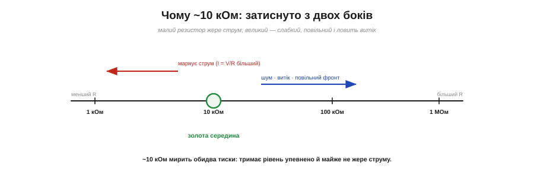
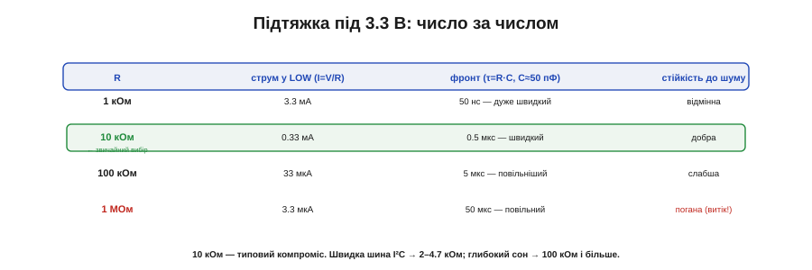

# 🧮 Чому підтяжка саме 10 кОм: струм, шум, фронт

> Підтяжку до лінії зазвичай беруть ~10 кОм. Тут — три прості розрахунки, що показують, **звідки** береться це число.

## Означення

Підтяжка — резистор R між лінією та живленням (чи землею), що задає рівень спокою. Вибір R — компроміс, затиснутий **трьома** величинами: марним струмом, падінням від витоку й часом фронту.


*Знизу номінал підпирає марний струм (I = V/R), згори — шум, витік і повільний фронт. Малий R тримає міцно, та жере струм; великий — ощадний, та слабкий і повільний. ~10 кОм — золота середина.*

## Інтуїція

R хочеться зробити **великим** — щоб у спокої майже не текло струму. І водночас **малим** — щоб рівень тримався міцно (проти шуму й витоку) і встигав підстрибувати швидко. Ці два бажання тягнуть у різні боки; ~10 кОм — точка, де вони миряться. Інженери звуть таке «вікном Ґольдилок» (англ. *Goldilocks* — казкова дівчинка, що з усього обирала «саме враз»): і не замало, і не забагато. Гарна новина — вікно **широке**: будь-що від кількох кілоом до сотні працює для звичайної кнопки, тож точність тут не потрібна, аби лиш не впасти в крайнощі.

## Формальний апарат

**Знизу** номінал обмежує **марний струм**. Коли лінію тягнуть у LOW (натиснута кнопка), через підтяжку тече струм просто в землю:

```
I = V / R
3.3 В / 1 кОм   = 3.3 мА     ← дорого
3.3 В / 10 кОм  = 0.33 мА    ← помірно
3.3 В / 100 кОм = 33 мкА     ← дешево
```

Що менший R, то більше струму марнується — тож від надто малих відмовляються.

**Згори** номінал обмежують **дві** речі. Перша — **падіння від витоку**: вхід МК має крихітний струм витоку I_leak (порядку мікроампера), і він, течучи крізь R, **знижує** «високий» рівень на I_leak·R:

```
V_drop = I_leak · R
1 мкА · 10 кОм  = 0.01 В   ← дрібниця
1 мкА · 1 МОм   = 1.0 В    ← уже з'їдає запас до порога!
```

Друга — **час фронту**: лінія має паразитну ємність C (~50 пФ), і підтяжка заряджає її за τ = R·C:

```
τ = R · C    (C ≈ 50 пФ)
10 кОм · 50 пФ = 0.5 мкс   ← швидко
1 МОм · 50 пФ  = 50 мкс    ← повільно, фронт «повзе»
```

Обидві величини ростуть з R — тож від надто великих теж відмовляються.

Складімо все докупи: 1 кОм надійний, але жере 3.3 мА; 1 МОм ощадний, та ловить витік і повільний; **10 кОм** дає 0.33 мА марного струму, мілівольти падіння й пів-мікросекунди фронту — усе в нормі. Звідси й канонічне «10 кОм».


*Під 3.3 В: 1 кОм — 3.3 мА, дуже швидкий, відмінна стійкість; 10 кОм — 0.33 мА, швидкий, добра (звичайний вибір); 100 кОм — 33 мкА, повільніший; 1 МОм — 3.3 мкА, але повільний і вразливий до витоку.*

## Де це працює на практиці

Те саме вікно зсувається під задачу: [швидка шина I²C](book:communications/i2c-bus) (різкі фронти на ємній лінії) тягне номінал **вниз**, до 2–4.7 кОм; [глибокий сон](book:programming/sleep-modes) на батарейці, де кожен мікроампер на рахунку, тягне **вгору**, до 100 кОм і більше (миряться з повільнішим фронтом). А внутрішня підтяжка ESP32 (~45 кОм) — це готовий «середняк», якого вистачає для звичайних кнопок. На практиці тому «10 кОм» і став рефлексом: він майже завжди в тому широкому вікні, тож його ставлять не думаючи, а рахувати беруться лише на краях — коли треба дуже швидко або дуже ощадливо.
