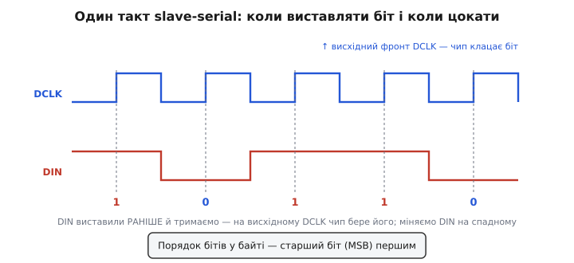

# ⚙️ Завантажувач бітстріму: мікроконтролер конфігурує FPGA у режимі slave-serial

Уявіть плату, де поряд стоять два чипи: невеликий мікроконтролер і FPGA. Мікроконтролер уміє дістати файл звідусіль — з SD-картки, з мережі, з власної флеш-пам'яті, — і саме йому доручають оживити сусіда. FPGA сама по собі порожня: її [комірки конфігурації](book:electronics/fpga-configuration) — це летка SRAM, і при кожному ввімкненні їх треба наповнити [бітстрімом](book:electronics/fpga-configuration) заново. Тут FPGA працює **веденою** (англ. *slave*): вона не бере такт зі свого генератора, а покірно приймає біти в тому ритмі, який їй нав'язує мікроконтролер. Уся робота — виставити чипу дані по одному біту й цокати такт, поки бітстрім не скінчиться, а потім переконатися, що чип відрапортував про успіх.

Задача звучить майже тривіально — «висунь потік бітів у ногу». Але саме в дрібницях цієї «тривіальності» ховаються всі граблі: у якому порядку йдуть біти в байті, скільки часу тримати ногу скидання внизу, коли саме чип клацає біт, що робити, коли флеш порожня, і чому наприкінці нога `DONE` уперто лишається внизу, хоча код начебто відпрацював. Розберімо це до дна — з робочою прошивкою на C, яку можна перенести на будь-який мікроконтролер, замінивши лише чотири функції роботи з ногами.

## Задача: п'ять ліній і потік бітів

Щоб керувати конфігурацією ззовні, FPGA виставляє назовні жменю службових ліній. Назви залежать від виробника, але суть у всіх однакова, тож розберімо їх за призначенням, а конкретні імена подам поряд.

**Лінія скидання конфігурації** — нею мікроконтролер каже чипу «забудь усе, почнемо конфігурацію спочатку». У Altera/Intel вона зветься `nCONFIG`, у Xilinx/AMD — `PROGRAM_B` (літера «n» чи суфікс «\_B» означають, що лінія **активна низьким рівнем**: дія настає, коли на ній 0). Смикнули її вниз і відпустили — чип стер стару SRAM і наготувався приймати новий бітстрім.

**Лінія стану** — нею чип відповідає, чи все гаразд. У Altera це `nSTATUS`, у Xilinx — `INIT_B`. Обидві зроблено з **відкритим стоком** (англ. *open-drain* — вихід уміє лише притягувати лінію вниз, а вгору її підтягує зовнішній резистор): так кілька пристроїв можуть ділити спільну лінію тривоги. Поки все добре, чип відпускає лінію і зовнішній резистор тримає її вгорі; сталася біда з конфігурацією — чип притискає її вниз. Це наш головний детектор помилок.

**Лінія такту** (`DCLK` у Altera, `CCLK` у Xilinx) — під неї чип бере біти. У режимі slave цю лінію жене **мікроконтролер**: кожне піднімання такту — команда «клацни поточний біт із лінії даних».

**Лінія даних** (`DATA0` у Altera, `DIN` чи `D0` у Xilinx) — сюди мікроконтролер виставляє поточний біт бітстріму. Один провід, один біт за такт — тому режим і зветься **serial** (англ. — послідовний): біти течуть один за одним, а не пачкою по шині.

**Лінія готовності** `DONE` (ім'я збіглося в обох таборах) — нею чип каже «конфігурація завершена, я вже несу задану схему». Теж відкритий стік із зовнішнім підтягуванням: доки конфігурація не скінчилась, чип тримає її внизу; заповнив усі комірки й запустився — відпустив, і резистор підтягнув `DONE` угору. Це наш фініш.

П'ять ліній, чотири з них — прості цифрові ноги мікроконтролера (дві на вихід: такт і дані; одна на вихід: скидання; дві на вхід: стан і готовність). Ніякого спеціального заліза не треба — усе робиться звичайним смиканням ніг, яке англійською влучно звуть **bit-bang** (буквально «бити бітами»): процесор власноруч, командами, формує кожен фронт сигналу замість того, щоб доручити це апаратному блокові.

> 🔧 **Навіщо це.** Slave-serial обирають, коли в системі **вже є головний обчислювач** і зайвий чип флеш поряд із FPGA не потрібен: мікроконтролер сам дістане бітстрім звідки завгодно (оновлення прошивки прилетіло по мережі — і FPGA перезалита без жодної мікросхеми пам'яті на платі). Мінус — усі п'ять ліній треба свідомо розвести до мікроконтролера й написати оцей завантажувач; переплутав режим на етапі розводки — і FPGA чекатиме такту, якого ніхто не дає.

## Ідея: виставив біт — цокнув — повторив, поки не скінчиться

Серце завантажувача — крихітний, до безглуздості простий цикл. Але перед ним і після нього є обов'язкова обрядовість, без якої цикл марний. Складімо всю послідовність із причин, а не із заповідей.

**Спочатку — скидання.** Ми не знаємо, у якому стані FPGA: може, вона вже наполовину сконфігурована з минулого разу, може, застрягла на помилці. Тому першим ділом притискаємо лінію скидання (`nCONFIG`/`PROGRAM_B`) вниз. Це наказ «зітри SRAM, скинь конфігураційну логіку». Тут виникає **перша пастка таймінгу**: імпульс скидання має бути не коротший за певний мінімум, інакше чип його просто не помітить. Внутрішня логіка конфігурації має встигнути прокинутися й почати чистку. У Altera Cyclone цей мінімум — близько **2 мікросекунд**; тримати вниз довше не шкодить, коротше — небезпечно. Тому після смикання ноги вниз обов'язково робимо коротку паузу, а не відпускаємо її наступним же рядком.

**Далі — рукостискання.** Відпустивши скидання, ми не кидаємось одразу сипати біти. Спершу питаємо чип: «ти готовий?» Готовність чип показує **лінією стану**. У Altera послідовність така: щойно `nCONFIG` пішов вниз, чип у відповідь притискає `nSTATUS` вниз (мовляв, «прийняв, чищуся»), а коли відпустиш `nCONFIG` назад угору — чип теж відпускає `nSTATUS`, і зовнішній резистор підтягує його вгору протягом приблизно мікросекунди. Оце піднімання `nSTATUS` угору й означає «SRAM очищено, лий бітстрім». Якщо `nSTATUS` угору не піднявся за розумний час — чип не відповідає (не той режим, не те живлення, обірвана лінія), і сипати біти немає сенсу. *(Порядок і напрями сигналів звірено за конфігураційними нотатками Altera Cyclone; статус: підтверджено.)*

**Тоді — той самий цикл.** Беремо бітстрім байт за байтом, кожен байт розкладаємо на 8 бітів і кожен біт:
- виставляємо на лінію даних;
- піднімаємо такт (чип клацнув біт);
- опускаємо такт.

Повторюємо, доки не скінчиться бітстрім. Ключове тут — **коли чип бере біт**. Він бере його на **висхідному фронті** такту (перехід такту з 0 в 1). Значить, дані на лінії мають стояти **стабільно ще до** того, як ми піднімемо такт, і не мінятися, поки такт угорі. Тому правильний порядок у циклі саме такий: спершу виставили дані, тоді підняли такт. Міняти дані слід тоді, коли такт унизу.


*Дані виставляють наперед і тримають стабільно всю клітинку; чип клацає біт на висхідному фронті такту, тож дані міняють, поки такт унизу. Порядок бітів у байті — старший (MSB) першим.*

**Наприкінці — дочекатися `DONE`.** Висипали весь бітстрім — і не факт, що чип уже готовий. Йому треба ще трохи тактів, щоб пройти внутрішню процедуру запуску (заряд ланцюжків, зняття внутрішнього скидання логіки). Тому після бітстріму ми **не спиняємо такт одразу**, а даємо ще кілька зайвих циклів такту й стежимо за лінією `DONE`. Коли `DONE` піднявся вгору — конфігурація вдалася. У Xilinx 7-ї серії тут є конкретна вимога: **після** того, як `DONE` став високим, треба дати ще **щонайменше 8 тактів** `CCLK`, щоб чип завершив запуск. *(Вимогу «8 додаткових тактів після DONE» звірено за застосовною нотаткою Xilinx XAPP583 для 7-ї серії; статус: підтверджено.)*

Оце і вся ідея. Тепер — робочий код.

## Робочий код: bit-bang завантажувач

Код нижче — справжня прошивка на C, а не псевдокод. Він навмисне розділений на два шари. **Нижній шар** — чотири короткі функції, що чіпають ноги конкретного мікроконтролера; їх і тільки їх ви переписуєте під своє залізо (регістри портів у STM32, ESP32, чи будь-де). **Верхній шар** — сама логіка конфігурації — від заліза не залежить і переноситься без змін. Такий поділ — не естетика: він відокремлює «що робити» від «на чому», і саме так побудовано фірмові приклади виробників.

Почнімо з нижнього шару — заглушки з підписами, які ви заміните реальним доступом до портів. Тут показано узагальнено; на реальному чипі `gpio_write` перетворюється на один запис у регістр порту.

```c
#include <stdint.h>
#include <stdbool.h>
#include <stddef.h>

// ── Нижній шар: залежить від конкретного МК. Перепишіть під своє залізо. ──
// Ідентифікатори ніг — просто числа-псевдоніми; зіставте їх зі своїми пінами.
enum {
    PIN_NCONFIG,   // вихід: скидання конфігурації (активний 0). Xilinx: PROGRAM_B
    PIN_DCLK,      // вихід: такт конфігурації.                    Xilinx: CCLK
    PIN_DATA0,     // вихід: лінія даних, один біт за такт.        Xilinx: DIN
    PIN_NSTATUS,   // вхід : стан чипа (open-drain, активний 0).   Xilinx: INIT_B
    PIN_CONF_DONE  // вхід : готовність (open-drain, 1 = готово).  Xilinx: DONE
};

// Виставити вихідну ногу в 0 або 1.
static void gpio_write(int pin, int level);
// Прочитати вхідну ногу: повертає 0 або 1.
static int  gpio_read(int pin);
// Затримка приблизно на задану кількість мікросекунд.
static void delay_us(uint32_t us);
// Джерело бітстріму: заповнити buf до len байтів, повернути СКІЛЬКИ реально
// прочитано (0 — бітстрім скінчився). Може читати з SPI-флеш, SD, масиву…
static size_t bitstream_read(uint8_t *buf, size_t len);
```

Тепер верхній шар. Спершу — один такт: виставити біт і цокнути. Виніс це в окрему функцію, щоб головний цикл читався як опис, а не як плутанина смикань.

```c
// Виставити один біт на DATA0 і дати чипу його клацнути (висхідний фронт DCLK).
// Дані стають СТАБІЛЬНО до підняття такту — інакше чип клацне сміття.
static inline void clock_one_bit(int bit)
{
    gpio_write(PIN_DATA0, bit);   // 1) дані на лінію — заздалегідь
    gpio_write(PIN_DCLK, 1);      // 2) висхідний фронт — тут чип бере біт
    gpio_write(PIN_DCLK, 0);      // 3) опустили такт — тепер можна міняти дані
}
```

Тепер — вивдигання цілого байта. **Ось де живе найтихіша й найзліша пастка — порядок бітів.** У slave-serial біти байта йдуть **старшим уперед** (MSB-first): спершу біт 7, потім 6, … до біта 0. Це не наша вигадка й не налаштування — так влаштовано сам бітстрім, і виробник (Xilinx для 7-ї серії каже це прямо) вимагає подавати дані **без перестановки бітів** саме в цьому порядку. Переплутаєш напрям зсуву — і кожен байт полетить у чип дзеркально; синхрослово на початку бітстріму не збіжиться, чип вирішить, що дані биті, і конфігурація провалиться, часто без жодної підказки, чому.

```c
// Вивдигнути один байт: старший біт першим (MSB-first) — так вимагає бітстрім.
static inline void clock_one_byte(uint8_t byte)
{
    for (int i = 7; i >= 0; --i)         // i = 7,6,…,0 — від старшого до молодшого
        clock_one_bit((byte >> i) & 1);  // виколупали i-й біт і подали
}
```

А ось головна функція — уся послідовність конфігурації разом із обробкою помилок. Читайте її як розповідь: скидання → рукостискання → потік бітів → дочекатися `DONE`. Коди помилок повертаємо назовні, щоб система могла показати світлодіод, записати в журнал чи спробувати ще раз.

```c
typedef enum {
    FPGA_OK = 0,
    FPGA_ERR_NO_STATUS,   // nSTATUS не піднявся — чип не відгукнувся
    FPGA_ERR_STATUS_DROP, // nSTATUS упав під час заливки — помилка конфігурації
    FPGA_ERR_NO_DONE,     // бітстрім вичерпано, а DONE так і не піднявся
    FPGA_ERR_EMPTY        // джерело бітстріму порожнє
} fpga_status_t;

fpga_status_t fpga_configure_slave_serial(void)
{
    uint8_t buf[256];
    size_t  n;

    // ── 1. Скидання: притиснути nCONFIG, витримати мінімальний імпульс ──
    gpio_write(PIN_DCLK, 0);        // такт у спокої — низько
    gpio_write(PIN_NCONFIG, 0);     // наказ «зітри SRAM, почнемо спочатку»
    delay_us(5);                    // тримаємо вниз довше за мінімум (~2 мкс)
    gpio_write(PIN_NCONFIG, 1);     // відпустили — чип починає чистку SRAM

    // ── 2. Рукостискання: чекаємо, поки чип відпустить nSTATUS угору ──
    // Активний-0, open-drain: 1 означає «SRAM очищено, лий бітстрім».
    {
        int tries = 1000;                       // ~1000 × 1 мкс = 1 мс стелі
        while (gpio_read(PIN_NSTATUS) == 0) {
            if (--tries == 0)
                return FPGA_ERR_NO_STATUS;       // чип мовчить — далі немає сенсу
            delay_us(1);
        }
    }

    // ── 3. Потік бітів: качаємо бітстрім байт за байтом ──
    size_t total = 0;
    while ((n = bitstream_read(buf, sizeof buf)) > 0) {
        total += n;
        for (size_t i = 0; i < n; ++i) {
            clock_one_byte(buf[i]);

            // Дешева страховка: чип під час заливки може ВПАСТИ у помилку
            // (CRC не збігся, живлення просіло) — тоді він притисне nSTATUS.
            // Перевіряти щобайт — доступно й ловить збій рано.
            if (gpio_read(PIN_NSTATUS) == 0)
                return FPGA_ERR_STATUS_DROP;
        }
    }
    if (total == 0)
        return FPGA_ERR_EMPTY;      // джерело нічого не дало — порожня флеш?

    // ── 4. Дожати такт, поки DONE не підніметься ──
    // Після бітстріму чипу треба ще трохи тактів на запуск. Женемо їх,
    // тримаючи DATA0 у 1 (так радять виробники — лінія в спокої висока).
    gpio_write(PIN_DATA0, 1);
    for (int extra = 0; extra < 1000; ++extra) {
        if (gpio_read(PIN_CONF_DONE) == 1) {
            // DONE піднявся. Дамо ще з десяток тактів — вимога запуску
            // (Xilinx 7-ї серії: щонайменше 8 після DONE).
            for (int i = 0; i < 16; ++i) {
                gpio_write(PIN_DCLK, 1);
                gpio_write(PIN_DCLK, 0);
            }
            return FPGA_OK;         // FPGA несе схему й готова до роботи
        }
        gpio_write(PIN_DCLK, 1);
        gpio_write(PIN_DCLK, 0);
    }
    return FPGA_ERR_NO_DONE;        // 1000 тактів — а DONE мовчить: дивись пастки
}
```

Уся функція вкладається в екран, а робить чимало: приводить чип у відоме порожнє становище, дочікується його згоди, висипає весь бітстрім у правильному порядку бітів, дорогою ловить зрив конфігурації й наприкінці однозначно каже, вдалося чи ні. Верхній рівень системи викликає її одним рядком:

```c
if (fpga_configure_slave_serial() != FPGA_OK) {
    led_set(LED_FAULT, true);          // світлодіод «біда»
    // тут — журнал, повторна спроба, безпечний режим…
}
```

## Що всередині нижнього шару: приклад на масиві й на SPI-флеш

Джерело бітстріму навмисне сховане за однією функцією `bitstream_read`. Це дає волю: сьогодні бітстрім лежить масивом у прошивці мікроконтролера, завтра — у зовнішній [SPI-флеш](book:programming/spi-flash), і головна логіка не змінюється ні на рядок. Ось дві реалізації.

**Бітстрім зашитий у прошивку масивом** — найпростіше для дрібного дизайну: інструмент експортує бітстрім як C-масив, ви кладете його у флеш мікроконтролера.

```c
// Згенеровано з .rbf/.bin: сирий бітстрім як масив байтів.
extern const uint8_t fpga_bitstream[];
extern const size_t  fpga_bitstream_len;

static size_t s_pos = 0;   // поточне зміщення читання

static size_t bitstream_read(uint8_t *buf, size_t len)
{
    size_t left = fpga_bitstream_len - s_pos;
    if (left == 0) return 0;                 // дійшли до кінця
    size_t take = (left < len) ? left : len;
    for (size_t i = 0; i < take; ++i)
        buf[i] = fpga_bitstream[s_pos + i];
    s_pos += take;
    return take;
}
```

**Бітстрім у зовнішній SPI-флеш** — коли він завеликий для мікроконтролера. Тут `bitstream_read` вичитує його блоками командою читання флеш (`0x03` — read data) із заданої адреси. Це вже сам по собі маленький SPI-обмін; наводжу кістяк, деталі команди залежать від мікросхеми.

```c
#define BITSTREAM_FLASH_ADDR  0x000000u     // де у флеш лежить бітстрім
#define BITSTREAM_TOTAL_LEN   0x080000u     // його довжина в байтах (знаємо наперед)

static uint32_t f_addr = BITSTREAM_FLASH_ADDR;
static size_t   f_left = BITSTREAM_TOTAL_LEN;

// spi_flash_read — ваш драйвер: команда 0x03 + 24-бітна адреса, тоді читання.
extern void spi_flash_read(uint32_t addr, uint8_t *buf, size_t len);

static size_t bitstream_read(uint8_t *buf, size_t len)
{
    if (f_left == 0) return 0;
    size_t take = (f_left < len) ? f_left : len;
    spi_flash_read(f_addr, buf, take);
    f_addr += take;
    f_left -= take;
    return take;
}
```

Зверніть увагу: у варіанті з масивом кінець бітстріму видно самому джерелу (порівняли зміщення з довжиною), а у варіанті з флеш ми **мусимо знати довжину бітстріму наперед** (`BITSTREAM_TOTAL_LEN`) — флеш не має «кінця файлу», за її межами просто лежить сміття або порожні `0xFF`. Це важлива дрібниця: помилишся з довжиною — або не досиплеш бітстрім (чип не доконфігурується), або пересиплеш зайве (у більшості чипів зайві байти нешкідливі, але покладатися на це не варто).

> 🔧 **Навіщо це.** Такий поділ на джерело й логіку — це не абстрактне «красиво». Він дає оновлення «по повітрю»: прилетів новий бітстрім по мережі, мікроконтролер записав його у флеш, смикнув `fpga_configure_slave_serial()` — і FPGA вже несе нову схему, без програматора й без паяльника. Один і той самий завантажувач обслуговує і масив у прошивці (для маленьких), і зовнішню флеш (для великих), бо про різницю знає лише `bitstream_read`.

## Пастки: чому воно «не завелося»

Код вище короткий, але кожен його рядок — це закритий раніше синець. Розберімо найтиповіші зриви, бо на практиці витрачають дні саме на них.

**Порядок бітів — MSB чи LSB.** Найпідступніше. Якщо вивдигати байт молодшим бітом уперед, кожен байт полетить у чип задом наперед. Найгірше, що дрібний шматок навіть може «майже» спрацювати, а частіше — синхрослово на початку бітстріму не збіжиться, чип вирішить, що потік битий, і мовчки провалить конфігурацію. Правило залізне: **старший біт першим**, дані **без перестановки** (як лежать у файлі бітстріму). Якщо джерело бітстріму раптом віддає байти вже переверненими (буває з деякими форматами експорту), перевертати треба їх, а не логіку зсуву. Перше, що перевіряють, коли `DONE` не піднявся, а лінія стану не падала, — саме напрям бітів.

**Мінімальний імпульс на лінії скидання.** Якщо після притискання `nCONFIG`/`PROGRAM_B` вниз одразу відпустити її наступним рядком, на швидкому мікроконтролері імпульс вийде наносекундним — коротшим за той мінімум (у Cyclone ~2 мкс), що потрібен чипу, щоб його помітити. Наслідок: чип не побачив скидання, лишився в старому стані, а ви сиплете біти в нікуди. Тому в коді стоїть `delay_us(5)` — свідомо з запасом. Коротший імпульс — плаваючий баг, який залежить від температури й екземпляра чипа; такі баги найнеприємніші.

**Конфлікт за такт.** У режимі slave такт веде **лише** мікроконтролер. Якщо на платі помилково розведено так, що FPGA налаштована на **master** (тобто теж пробує гнати такт зі свого генератора) або якщо ту саму лінію такту чіпає ще щось, — два джерела зіштовхнуться на одній лінії. Результат — спотворені фронти, випадково клацнуті або пропущені біти, зрідка навіть перегрів вихідних каскадів. Вибір режиму задають **ногами вибору режиму** (`MSEL` у Altera, `M[2:0]` у Xilinx) — і перше, що звіряють, коли конфігурація нестабільна: чи виставлено ці ноги саме на slave-serial. Це не програмна, а апаратна пастка, але вилазить вона як «код начебто правильний, а біти губляться».

**Порожня або побита флеш.** Якщо бітстрім тягнуть із зовнішньої флеш, а вона порожня (стерта, тобто суцільні `0xFF`) чи записана не тим — чип отримає безглуздий потік. У коді на це є дві сітки: `FPGA_ERR_EMPTY`, коли джерело взагалі нічого не дало (розрив зв'язку з флеш, не той адресний простір), і `FPGA_ERR_STATUS_DROP`, коли чип узявся конфігуруватися, але посеред потоку виявив, що дані биті (не збігся внутрішній контроль цілісності), і притиснув лінію стану. Оця щобайтова перевірка `nSTATUS` усередині циклу ловить биту флеш **рано**, а не після того, як ви даремно висипали весь бітстрім.

**`DONE` не піднявся — найчастіше питання новачка.** Ви все висипали, а `DONE` уперто внизу. Причин небагато, і всі — у нашому коді як окремі гілки:
- **не дожали такт після бітстріму** — чип фізично не встиг пройти запуск; тому ми женемо зайві такти, а Xilinx прямо вимагає **щонайменше 8** тактів **після** підняття `DONE`;
- **бітстрім недосипано** — неправильна довжина у флеш-варіанті, або джерело обірвалось раніше часу;
- **порядок бітів** — див. вище, чип не впізнав потік;
- **не той бітстрім** — згенерований під іншу модель чипа: він непрозорий і прив'язаний до конкретного кристала, тож чужий файл чип відкине.

`DONE` — це не прикраса-світлодіод, а **однозначний вирок**: піднявся — SRAM повна й чип живий; лишився внизу — конфігурація не дійшла кінця, і треба йти по цьому списку. Тому серйозний завантажувач не припускає успіх «бо код відпрацював», а буквально дочікується `DONE` і повертає помилку, якщо той мовчить.

**Швидкість bit-bang — і несподіванка.** Здавалося б, повільний програмний bit-bang не встигне за чипом. Насправді проблема зворотна: лінія даних у деяких чипів **вразлива до занадто швидких** фронтів такту, і практики радять давати крихітну паузу після виставляння даних, перш ніж піднімати такт. У межах цієї теми річ у тім, що slave-serial не має нижньої межі швидкості (можна цокати як завгодно повільно — чип терпляче чекає наступного фронту), тож bit-bang цілком робочий; але якщо фронти виходять надто гострими, між рядками `gpio_write(PIN_DATA0, …)` і `gpio_write(PIN_DCLK, 1)` варто вставити мінімальну затримку. *(Спостереження про гострі фронти й потребу невеликої паузи після виставляння даних узято з практичних нотаток розробників; статус: практичний досвід, не жорстка вимога документації.)*

## Ціла картина

Завантажувач slave-serial — це доручення «оживи сусіда» у чистому вигляді. Мікроконтролер приводить FPGA у відоме порожнє становище (імпульс на лінії скидання, витриманий за мінімальним таймінгом), дочікується згоди чипа (лінія стану піднялась угору), а тоді висипає [бітстрім](book:electronics/fpga-configuration) по одному біту — старшим уперед, стабілізуючи дані до кожного висхідного фронту такту, — доки потік не скінчиться; наприкінці дожимає кілька зайвих тактів і чекає, поки `DONE` підніметься, після чого впевнено каже: чип готовий.

Уся хитрість — не в циклі, а в дрібницях довкола нього: правильний порядок бітів, витриманий імпульс скидання, єдине джерело такту, чесна перевірка стану щокроку й безумовне дочікування `DONE`. Кожна з цих дрібниць у коді — окремий рядок і окремий код помилки, бо кожна з них колись коштувала комусь дня налагодження. Зробиш їх правильно — і будь-який мікроконтролер оживить будь-яку FPGA у режимі slave, качаючи бітстрім хоч із власної флеш, хоч із мережі, хоч із SD-картки, а система завжди точно знатиме, вдалося чи ні.
