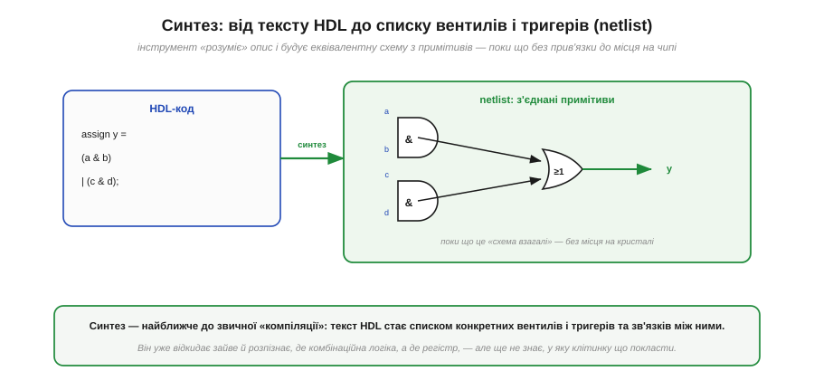
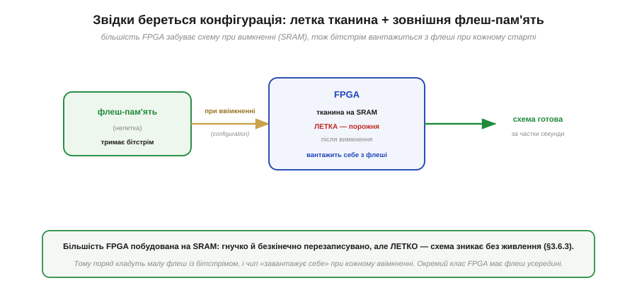

# Потік розробки: синтез → розміщення → трасування → бітстрім

Описати схему можна [мовою HDL](book:electronics/hdl), але між текстом опису й мікросхемою, що ожила, лежить ціла низка перетворень. На відміну від софту, де компілятор за один крок дає готовий машинний код, шлях до FPGA довший і має кроки, **яких у програмуванні взагалі немає**. Зрозуміти цей потік (*flow*) важливо не лише з цікавості: кожен його етап може щось повідомити чи на щось поскаржитися, і розробник постійно читає ці звіти. Пройдімо весь конвеєр — від коду до працюючого чипа — крок за кроком, тримаючи в голові, що половина цих кроків суто **апаратна**.

### Чотири головні кроки

Спершу — карта всього шляху, щоб не загубитися в деталях. Опис HDL проходить чотири головні перетворення й стає **бітстрімом** — потоком бітів, що налаштовує кожну клітинку й перемикач чипа.

*Рис. Чотири кроки: **синтез** (HDL → список вентилів і тригерів, netlist), **розміщення** (кожен елемент → у конкретну клітинку чипа), **трасування** (прокласти дроти між ними крізь перемикачі) і **бітстрім** (файл бітів для всіх комірок конфігурації), який заливають у FPGA. Перші два кроки нагадують компілятор; останні два — суто апаратне «вкладання» схеми в кристал.*

Звернімо увагу на головну відмінність від звичної компіляції, бо саме вона визначає всю своєрідність роботи з FPGA. Програму компілятор перекладає на інструкції — і все, далі їх виконує процесор. Тут після «компіляції» (синтезу) лишається ще **фізична** робота: схему треба **вкласти** в конкретний кристал — вирішити, у яку з мільйонів клітинок сяде кожен елемент (розміщення) і якими саме дротами їх з'єднати (трасування). Цих кроків у софті немає в принципі, бо там немає кристала з фіксованою геометрією. Розгляньмо кожен крок ближче, починаючи з найзнайомішого.

### Синтез: від тексту до списку елементів

Перший крок — **синтез** (*synthesis*) — найближчий до звичної компіляції. Інструмент «розуміє» опис HDL і будує з нього еквівалентну схему з примітивів: вентилів і тригерів, поки що **без** прив'язки до конкретних місць на чипі.

*Рис. Синтезатор перекладає текст HDL (`assign y = (a & b) | (c & d);`) на **netlist** — список з'єднаних примітивів: два вентилі AND, один OR і зв'язки між ними. Це вже конкретна схема, але «схема взагалі» — ще без відповіді, у якій клітинці кристала що опиниться.*

Синтез робить рівно те, що й розумний компілятор, тільки ціль інша. Він розбирає опис, **розпізнає**, де [комбінаційна логіка](book:electronics/combinational-circuits), а де [регістр](book:electronics/register), **відкидає** зайве (недосяжну логіку, сталі, які можна згорнути) і видає **netlist** — список елементів і провідників, що їх з'єднують. Можна сказати, синтез відповідає на питання «**що** будувати»: з яких вентилів і тригерів складається схема. Але він свідомо не чіпає питання «**де**» — у нього ще немає поняття конкретної клітинки. На це питання відповідає наступний крок, перший із суто апаратних.

### Розміщення й трасування: вкладаємо схему в кристал

Тепер — двоє кроків, які роблять FPGA унікальною. **Розміщення** (*placement*) вирішує, у яку фізичну клітинку сяде кожен елемент netlist'а. **Трасування** (*routing*) прокладає реальні дроти між цими клітинками крізь [комутаційні матриці](book:electronics/inside-fpga).

*Рис. **Розміщення**: кожному елементу (A, B, C, D) обирається конкретна клітинка в сітці. **Трасування**: між обраними клітинками прокладаються дроти (червоне — реальний шлях A→B) крізь перемикачі маршрутизації. Мета — все вмістити **й** уложитися в таймінг: зв'язані елементи краще класти ближче, щоб дроти були коротші.*

Ці два кроки часто об'єднують абревіатурою **P&R** (*place and route*), і вони — серце апаратної частини потоку. Тут вирішується доля [**таймінгу**](book:electronics/fpga-timing): якщо два тісно пов'язані елементи опиняться на протилежних кінцях кристала, дріт між ними буде довгий, затримка велика, і схема не встигне за тактом. Тому інструмент намагається класти взаємодійну логіку поруч, мінімізуючи довжину критичних з'єднань, і водночас **усе вмістити** в наявні клітинки й канали. Це складна оптимізаційна задача (математично споріднена з тим, що роблять при проєктуванні самих чипів), і саме вона зазвичай триває найдовше у великих дизайнах. Коли і розміщення, і трасування завершені, схема повністю «лягла» на конкретний кристал — лишається перетворити цей результат на те, що чип розуміє.

### Бітстрім: образ схеми у вигляді бітів

Підсумок усього потоку — **бітстрім** (*bitstream*): один великий файл бітів, що задає стан **кожної** комірки конфігурації — вміст усіх LUT і положення всіх перемикачів маршрутизації.

*Рис. Бітстрім — потік бітів (від сотень кілобітів до десятків мегабітів), що заповнює **всі** комірки конфігурації FPGA. Кожен біт задає стан однієї SRAM-комірки LUT або одного перемикача маршрутизації. Залив бітстрім — і однорідна тканина набула вигляду потрібної схеми.*

Бітстрім — це остаточний **образ** вашої схеми, переведений у єдину «мову», яку розуміє кремній: послідовність бітів конфігурації. Уся програмованість FPGA зводиться до двох речей — вмісту [LUT](book:electronics/lut) і положення [перемикачів маршрутизації](book:electronics/inside-fpga); бітстрім — це рівно набір значень для **всіх** них разом. Тому його розмір прямо відповідає ємності чипа: що більше клітинок і маршрутів, то довший потік бітів. Лишається одна практична деталь, без якої картина неповна: куди цей бітстрім подіти, адже тканина FPGA, побудована на SRAM, **летка**.

### Звідки береться конфігурація при кожному старті

Тут спливає наслідок ключової властивості пам'яті: [**SRAM летка**](book:programming/flash-vs-ram) — вона забуває все без живлення. А LUT і перемикачі FPGA побудовані саме на SRAM-комірках. Отже, при кожному ввімкненні чип прокидається **порожнім** — і мусить звідкись узяти свій бітстрім.

*Рис. Тканина FPGA на SRAM **летка**: після вимкнення схема зникає. Тому бітстрім тримають у малій **нелеткій флеш-пам'яті** поряд із чипом; при кожному ввімкненні FPGA **завантажує себе** з флеші (процес configuration) і за частки секунди постає готовою. Окремий клас FPGA має флеш-пам'ять прямо всередині.*

Це пояснює одну з тих [відмінностей FPGA від CPLD](book:electronics/pal-to-fpga). CPLD зазвичай зберігає конфігурацію в собі й готовий до роботи відразу; SRAM-based FPGA — ні, їй потрібна **зовнішня флеш** із бітстрімом і коротка пауза на завантаження при старті. Це невелика плата за гнучкість і колосальну ємність SRAM-тканини: її можна перезаписувати безкінечно, і саме на ній будують найбільші чипи. (Існує й проміжний клас FPGA з вбудованою флеш-пам'яттю — вони стартують миттєво, як CPLD, ціною дещо меншої ємності.) Як саме виглядає цей потік на практиці, з конкретними відкритими інструментами, показує вставка ⚙️ нижче.

> 🔧 **Навіщо це.** Знати потік потрібно, щоб **читати, що кажуть інструменти, і розуміти, де щось пішло не так**. По-перше, **звіти приходять із різних кроків**: синтез скаржиться на двозначності опису й оцінює ресурси; розміщення-трасування каже, чи все вмістилось і чи дотримано [таймінг](book:electronics/fpga-timing); саме сюди дивляться, коли дизайн «не збирається». По-друге, **P&R — найдовший крок** у великих проєктах, тож терпіння (і запас часу) — частина роботи з FPGA. По-третє, **передбачте флеш для бітстріму** на платі (або візьміть чип із вбудованою), інакше SRAM-based FPGA після ввімкнення просто лишиться порожньою. Розуміючи весь конвеєр, ви перестаєте сприймати інструменти як чорну скриньку й починаєте свідомо вести дизайн від коду до робочого чипа.

> ⚙️ **Загляньте у вставку:** [Відкритий тулчейн: Yosys → nextpnr → бітстрім](proj-open-toolchain.md) — як ці самі кроки проходять у вільних інструментах для чипів класу iCE40.
