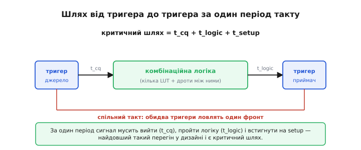
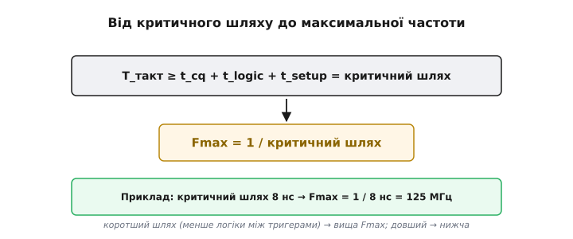
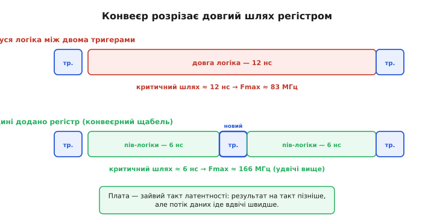

# Таймінг FPGA

<preknowlist>
- [Метастабільність: setup і hold](book:electronics/metastability-timing) — тригер зривається, якщо вхід міняється надто близько до фронту; звідси вимоги setup (перед фронтом) і hold (після нього).
- [Тактовий сигнал](book:electronics/clock-signal) — спільний фронт, за яким тригери синхронно захоплюють нові значення.
- [Програмована логіка](book:electronics/programmable-logic) — FPGA як поле клітинок, що конфігурується під довільну схему.
- [Усередині FPGA](book:electronics/inside-fpga) — сигнал між клітинками йде ланцюжком програмованих перемикачів, а не суцільним дротом.
</preknowlist>

Таймінг (від англ. *timing* — узгодження в часі) відповідає на питання, яке визначає долю будь-якого дизайну на FPGA: на якій частоті він насправді працюватиме — і чому не швидше. Питання виростає з [setup/hold і метастабільності](book:electronics/metastability-timing) окремого тригера, тільки прикладених не до однієї пари, а до цілого поля на десятки тисяч клітинок. Тема має репутацію складної, але її кістяк простий і тримається на кількох поняттях, кожне з яких випливає з попереднього: **критичний шлях** задає **максимальну частоту**, знак **запасу** виносить вирок, а коли вироку не хочеться коритися, довгий шлях **розрізають**. До цього кістяка треба доточити ще три речі, без яких картина неповна: другу межу — **hold**, яку не видно згори; **перекіс** такту, що змінює бюджет; і **петлю**, якою розробник щоразу доводить дизайн до потрібної частоти. Пройдімо це по черзі, від причини до наслідку.

### Один перегін: три відрізки часу між тригерами

Майже всі дизайни на FPGA синхронні: на кожному фронті [такту](book:electronics/clock-signal) тригери **захоплюють** нові значення, а між фронтами комбінаційна логіка ці значення **перемелює**. Уся робота розкладається на однакові «перегони» — від виходу одного тригера до входу наступного. Питання частоти зводиться до одного: чи встигає сигнал за **один період** такту вийти з тригера-джерела, пройти логіку й **усістися** на вході тригера-приймача?


*Сума часів — вийти з джерела (t_cq), пройти логіку й дроти (t_logic), устигнути на setup — і є довжина перегону; найдовший перегін у дизайні зветься критичним.*

Розкладімо цей перегін на складові, бо кожна далі важитиме окремо. **Setup-час** (англ. *set up* — наставити, підготувати) — це інтервал перед фронтом, протягом якого вхід приймача має вже бути стабільним, інакше тригер [зірветься в метастабільність](book:electronics/metastability-timing). Отже, сигнал, що виходить із джерела, **зобов'язаний** прибути не пізніше ніж за t_setup до наступного фронту. Час подорожі складається з трьох частин: вийти з джерела (**t_cq**, від англ. *clock-to-Q* — від фронту такту до появи на виході Q), пролетіти комбінаційну логіку (**t_logic**) і — окремо — пробігти **маршрут** (**t_route**), тобто дроти й програмовані перемикачі між клітинками. У готовому чипі маршрут майже не помітний, а от у FPGA він іде [ланцюжком перемикачів](book:electronics/inside-fpga) і часто важить **більше** за саму логіку; тому далі ми його виділяємо в окремий доданок. Оскільки таких перегонів у дизайні безліч, долю частоти вирішує **найдовший** із них.

### Критичний шлях диктує період

Найдовший перегін і є критичний шлях (англ. *critical path*; *critical* — вирішальний, від грец. *kritikós*), і саме він визначає, наскільки коротким може бути такт. Логіка тут залізна. Якщо найдовший шлях триває, скажімо, 8 наносекунд, то давати новий фронт частіше ніж раз на 8 нс **не можна**: сигнал на найповільнішому маршруті просто не добіжить, приймач захопить недороблене значення й зірветься. Період знизу обмежений критичним шляхом, а частота — зверху:

```
T_такт  ≥  t_cq + t_logic + t_route + t_setup   =  критичний шлях
Fmax    =  1 / критичний шлях
```


*Період такту впирається в критичний шлях, тож Fmax = 1 / критичний шлях: шлях 8 нс дає 125 МГц.*

Наслідок цього протилежний звичній інтуїції про [тактову частоту процесора](book:programming/clock-frequency): частоту тут визначає **не паспортний показник чипа**, а **сам дизайн** — скільки логіки нагромаджено між тригерами й наскільки далеко інструмент розкидав клітинки. Покладеш багато логіки або дозволиш довгий маршрут — шлях довгий, Fmax низька; розкладеш ощадливо — навпаки. Тому «максимальна частота» FPGA — не властивість кристала, а результат конкретного дизайну на ньому.

### Запас як вирок

Інструмент має сказати, чи вкладається критичний шлях у бажаний такт, і робить це через поняття **запасу** (англ. *slack* — провис, вільний кінець мотузки): для кожного шляху він порівнює доступний період із потрібним часом.

```
slack  =  період такту  −  потрібний час шляху
```


*При цілі 10 нс шлях на 8 нс дає запас +2 нс, а шлях на 12 нс — борг −2 нс: від'ємний slack означає провалений таймінг.*

Знак запасу — це вирок. Додатний slack означає «встигаємо із запасом стільки-то наносекунд» — дизайн працюватиме надійно. Нуль — «рівно на межі», тривожно. **Від'ємний** slack — «не встигаємо»: на заданій частоті схема працюватиме ненадійно або не працюватиме зовсім. Рахує ці запаси не якийсь окремий прогін, а [статичний часовий аналіз](book:electronics/static-timing-analysis) — метод, що складає паспортні затримки вздовж **кожного** шляху й порівнює з дедлайном, не проганяючи жодного вхідного вектора. Він зважує запас для всіх приймачів одразу й називає найгірший — **WNS** (*Worst Negative Slack*); саме на WNS дивляться найперше після трасування: невід'ємний — таймінг зійшовся, можна заливати; від'ємний — треба втручатися, і винний шлях видно поіменно.

### Друга межа, якої не видно згори: hold

Досі йшлося про те, що сигнал може **спізнитися**. Але є симетрична, підступніша небезпека: прибути **надто рано**. Поруч із setup живе **hold-час** (англ. *hold* — утримувати) — скільки даним триматися стабільними вже **після** фронту, поки приймач надійно замкне попереднє значення. Якщо шлях **надто короткий**, нові дані від того самого фронту доганяють приймач раніше, ніж він устиг замкнутися на старому, — і псують його. Ось де ховається пастка. Setup ламають надто **повільні** шляхи, і їх лікує **сповільнення** такту; hold ламають надто **швидкі** шляхи, і сповільнення такту тут **не допомагає зовсім** — у формулі hold періоду просто немає:

```
hold-запас  =  t_cq + t_logic(min) + t_route(min)  −  t_hold
```

Найчастіше hold-порушення народжує не сама логіка, а [перекіс такту](book:electronics/clock-skew) — коли фронт доходить до приймача **пізніше**, ніж до джерела. Порахуймо, як це грає в обидва боки.

**Приклад (перекіс рятує setup — і провалює hold).** Нехай T = 8.0 нс, t_setup = 0.4 нс, t_hold = 0.3 нс, а найкоротший шлях між тригерами дає t_cq + t_logic(min) = 0.5 + 0.2 = 0.7 нс. Приймач отримує фронт на Δ = 0.6 нс **пізніше** за джерело.

```
Setup: пізніший фронт приймача = більше часу дійти
       → setup-запас РОСТЕ на Δ = +0.6 нс   (перекіс допомагає)

Hold:  дані від того самого фронту мусять протриматися t_hold
       ПІСЛЯ вже пізнішого фронту приймача:
   hold-запас = 0.5 + 0.2 − 0.3 − 0.6 = −0.2 нс   →  порушення hold
```

Висновок: той самий перекіс, що додає запасу на setup, з'їдає його на hold, і жодне сповільнення такту (більше T) цього не виправить — доводиться навпаки **додати** затримки на короткому шляху. Тому hold — це не «легша версія» setup, а окрема межа зі своїми ліками; детально її розбирає стаття про [порушення hold-часу](book:electronics/hold-violation).

### Як коротшають шляхи: конвеєр і його родичі

Коли setup-запас від'ємний — критичний шлях задовгий, — очевидне «знизити частоту» рятує не завжди, бо частота часто задана ззовні (швидкістю інтерфейсу, потоком даних). Головний прийом інший: **розрізати** довгий шлях тригером навпіл, перетворивши його на дві коротші ділянки. Це і є **конвеєризація** (англ. *pipelining*, від *pipeline* — трубопровід, де порції течуть одна за одною) — той самий [конвеєр, що пришвидшує процесор](book:programming/pipeline), тільки тут він стає універсальним інструментом таймінгу.


*Регістр посередині ділить логіку навпіл — критичний шлях падає з 12 до 6 нс, Fmax росте з 83 до 166 МГц ціною зайвого такту латентності.*

**Приклад (Fmax до й після конвеєра).** Нехай перегін між тригерами дає таку розкладку.

```
Було: t_cq = 0.5 нс, t_setup = 0.5 нс, логіка+маршрут = 11.0 нс (домінує)
  критичний шлях = 0.5 + 11.0 + 0.5 = 12.0 нс
  Fmax = 1 / 12.0 нс ≈ 83.3 МГц

Стало: розрізаємо логіку регістром навпіл (по 5.5 нс кожна половина)
  критичний шлях = 0.5 + 5.5 + 0.5 = 6.5 нс
  Fmax = 1 / 6.5 нс ≈ 153.8 МГц   (майже вдвічі вище)

Ціна: латентність зросла з 1 такту до 2 (результат на такт пізніше).
```

Платимо **латентністю** (англ. *latency* — затримка): результат виходить на такт пізніше, бо проходить крізь зайвий регістр. Але **пропускна здатність** навіть зростає — дані течуть конвеєром швидше; це фундаментальний компроміс цифрового проєктування, і на FPGA ним користуються постійно.

Ручна конвеєризація має автоматичного родича — **ретаймінг** (англ. *retiming* — перерозподіл у часі): інструмент сам пересуває вже наявні регістри крізь логіку, зрівнюючи довжину сусідніх ділянок, без переписування коду. Якщо ж додавати такт латентності не можна, лишаються прийоми, що коротшають шлях **без** нового регістру: зменшити **рівні логіки** (перебудувати арифметику так, щоб між тригерами лягало менше вентилів), або — оскільки в FPGA вагу несе [маршрут](book:electronics/inside-fpga) — підказати інструментові покласти винні клітинки **ближче** одна до одної, укоротивши саме `t_route`.

### Петля закриття таймінгу

Усі ці прийоми складаються в один робочий цикл. Спершу розробник каже інструментові **ціль** — файлом [обмежень (SDC/XDC)](book:electronics/fpga-constraints): яка частота такту, які затримки на входах і виходах. Далі інструмент [розміщує й трасує](root:embedded/fpga-flow) дизайн по кристалу, запускає [часовий аналіз](book:electronics/static-timing-analysis) і повертає WNS. Якщо запас від'ємний — розробник лагодить найгірший шлях (конвеєр, менше логіки, підказка розміщення) і повторює. Ця ітеративна збіжність «ціль → трасування → аналіз → правка» і зветься [закриттям таймінгу](book:electronics/timing-closure); заливати чип має сенс лише тоді, коли вона зійшлася — WNS невід'ємний по всіх шляхах.

### Де аналіз безсилий: перетин доменів

Уся ця машинерія працює, поки обидва тригери перегону тактовані **одним** сигналом. Коли ж дані переходять між двома **незалежними** тактами, спільного фронту немає, і поняття запасу втрачає сенс — статичний аналіз тут порахувати нічого не може. Це окрема дисципліна зі своїми пастками й прийомами (синхронізатори, черги), яку розбирає стаття про [перетин тактових доменів](book:electronics/clock-domain-crossing); у межах таймінгу досить пам'ятати, що такі шляхи інструментові позначають окремо, щоб він не міряв їх звичайною міркою.

> 🔧 **Навіщо це.** Таймінг — це те, на що розробник FPGA дивиться **після кожної збірки**, тож варто завести чотири звички. Перша: **читати WNS** — невід'ємний означає «дизайн триматиме цю частоту», від'ємний означає «ні», і доти заливати чип немає сенсу. Друга: **скорочувати критичний шлях**, а не «оптимізувати код» у софтовому сенсі — менше рівнів логіки між тригерами й обережніше з довгою арифметикою; саме це, а не кількість рядків [мовою опису апаратури](book:electronics/hdl), визначає швидкість. Третя: **конвеєризувати**, коли частоти бракує, свідомо обмінюючи латентність на Fmax. Четверта: **не плутати setup із hold** — від'ємний hold-запас сповільненням такту не лікується, і якщо збірка «то працює, то ні» навіть на низькій частоті, підозра саме на нього.

### Що з цього виходить

FPGA-таймінг найкраще уявляти не як список правил, а як одну геометричну задачу, яку інструмент розв'язує, а розробник скеровує. Логіка й маршрут між тригерами дають затримку; найдовший перегін кладе стелю частоти; знак запасу каже, чи стелі досягнуто, і показує винний шлях поіменно; а набір ходів — конвеєр, ретаймінг, менше логіки, ближче клітинки — цю стелю піднімає, поки hold стереже, щоб, женучись за швидкістю, не розігнати короткі шляхи надто. Через це два прогони того самого опису можуть дати різну частоту: її визначає не сам код, а те, як інструмент цього разу розклав його по кристалу, — і саме тому останнє слово завжди за часовим аналізом після трасування, а не за паспортом чипа.
