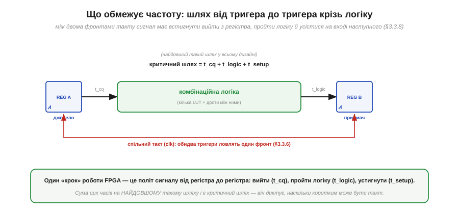
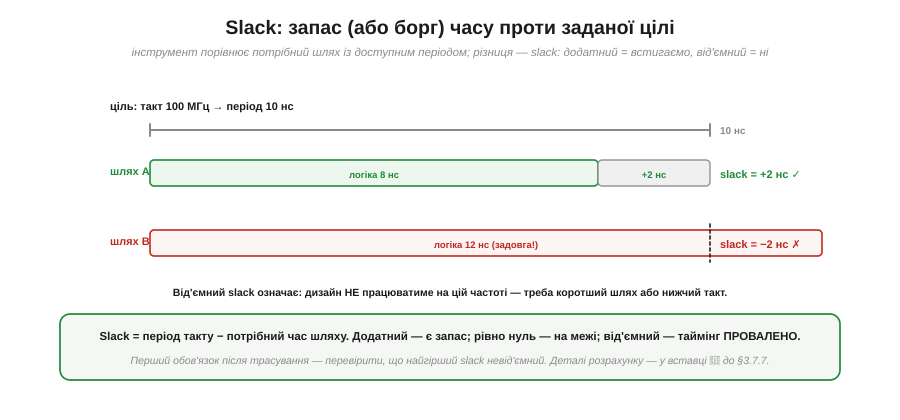
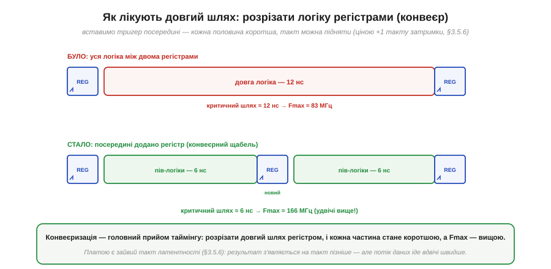

# Таймінг у FPGA: критичний шлях і обмеження

Слово «таймінг» вирішує, що насправді обмежує частоту FPGA. Це питання виростає прямо з [setup/hold і метастабільності](book:electronics/metastability-timing), тільки прикладених не до однієї пари тригерів, а до цілого дизайну на десятки тисяч клітинок. Тема має репутацію складної, але її ядро напрочуд просте й тримається на одному понятті — **критичний шлях**. Зрозумівши його, ви зрозумієте і звідки береться максимальна частота, і чому деякі дизайни «не збираються» на потрібному такті, і як це лікувати. Усе починається з того, що відбувається між двома фронтами такту.

### Що обмежує частоту: шлях від тригера до тригера

Уся синхронна схема (а майже всі дизайни на FPGA синхронні) працює [тактами](book:electronics/clock-signal): на кожному фронті тригери **захоплюють** нові значення, між фронтами комбінаційна логіка ці значення **перемелює**. Питання частоти зводиться до одного: чи встигає сигнал за **один період** такту вийти з одного тригера, пройти логіку й **усістися** на вході наступного?


*Рис. Між двома тригерами, що тактуються спільним сигналом, сигнал має встигнути: вийти з тригера-джерела (час t_cq, clock-to-Q), пройти комбінаційну логіку між ними (t_logic) і прибути на вхід тригера-приймача завчасно — за час t_setup до фронту. Сума цих часів і є довжина шляху; найдовший такий шлях у дизайні зветься **критичним**.*

Саме тут абстрактний таймінг оживає. **Setup-час** — це інтервал перед фронтом, протягом якого вхід тригера має вже бути стабільним, інакше тригер [зірветься в метастабільність](book:electronics/metastability-timing). На рівні цілого дизайну він працює так: сигнал, що виходить із джерела, **зобов'язаний** прибути на приймач не пізніше ніж за t_setup до наступного фронту. Загальний час подорожі складається з трьох частин: вийти з джерела (t_cq), пролетіти логіку й дроти (t_logic) і встигнути на setup. Цей маршрут «від регістра до регістра» — і є той самий «один крок» роботи [програмовної логіки](book:electronics/programmable-logic), що відрізняє її від процесорного такту. А оскільки в дизайні таких шляхів безліч, доля частоти вирішується **найдовшим** із них.

### Від критичного шляху до Fmax

Найдовший шлях зветься **критичним** (*critical path*), і саме він диктує, наскільки коротким може бути такт. Звідси — формула максимальної частоти, проста й невблаганна.


*Рис. Період такту не може бути коротшим за критичний шлях: T_такт ≥ t_cq + t_logic + t_setup. Інакше приймач не встигне зафіксувати правильне значення (метастабільність). Звідси максимальна частота: Fmax = 1 / критичний шлях. Приклад: шлях 8 нс → Fmax = 1/8нс = 125 МГц.*

Логіка тут залізна, і її варто проговорити. Якщо найдовший шлях триває, скажімо, 8 наносекунд, то давати новий фронт частіше ніж раз на 8 нс **не можна**: сигнал на найповільнішому маршруті просто не добіжить, приймач захопить недороблене значення й зірветься. Отже, період такту обмежений знизу критичним шляхом, а частота — обмежена зверху: **Fmax = 1 / критичний шлях**. Зверніть увагу на наслідок, протилежний звичній інтуїції про [тактову частоту процесора](book:programming/clock-frequency): частоту тут визначає **не якийсь паспортний показник чипа**, а **ваш власний дизайн** — те, скільки логіки ви нагромадили між тригерами. Покладете багато — шлях довгий, Fmax низька; розкладете ощадливо — навпаки. Інструмент же має сказати вам, чи вкладається ваш критичний шлях у бажаний такт, і робить це через поняття запасу.

### Slack: запас або борг часу

Після [трасування дизайну](book:electronics/fpga-flow) інструмент рахує **таймінг-аналіз**: для кожного шляху порівнює потрібний час із доступним періодом такту. Різниця зветься **slack** (запас), і її знак — це вирок дизайну.


*Рис. Slack = період такту − потрібний час шляху. Ціль 100 МГц = період 10 нс. Шлях A триває 8 нс → slack = +2 нс (встигаємо, є запас). Шлях B триває 12 нс → slack = −2 нс (не встигаємо, **таймінг провалено**). Перший обов'язок після трасування — переконатися, що найгірший slack невід'ємний.*

Поняття slack робить таймінг **вимірюваним**, і саме ним оперує розробник щодня. Додатний slack означає «встигаємо із запасом стільки-то наносекунд» — добре, дизайн працюватиме надійно. Нуль — «рівно на межі», тривожно. **Від'ємний** slack — «не встигаємо», і це вирок: на заданій частоті схема працюватиме ненадійно або не працюватиме зовсім, бо найдовший шлях не вкладається в період. Тому першим ділом, отримавши результат трасування, дивляться на **найгірший** (worst-case) slack по всьому дизайну: якщо він невід'ємний — таймінг зійшовся, можна заливати; якщо ні — треба втручатися. Найчастіше втручання зводиться до одного перевіреного прийому. (Точну механіку розрахунку slack розписано в математичній вставці нижче.)

### Як лікують довгий шлях: конвеєр

Що робити, коли slack від'ємний — критичний шлях задовгий? Очевидне «знизити частоту» рятує не завжди, бо частота буває задана ззовні (швидкістю інтерфейсу, потоком даних). Головний прийом інший: **розрізати** довгий шлях тригером навпіл, перетворивши його на дві коротші ділянки. Це і є **конвеєризація** (*pipelining*) — той самий [конвеєр, що пришвидшує процесор](book:programming/pipeline).


*Рис. Було: уся логіка (12 нс) між двома тригерами → критичний шлях ≈ 12 нс, Fmax ≈ 83 МГц. Стало: посередині додано **регістр** (конвеєрний щабель), що ділить логіку на дві половини по 6 нс → критичний шлях ≈ 6 нс, Fmax ≈ 166 МГц (удвічі вище). Платою є зайвий такт латентності: результат з'являється на такт пізніше.*

Тут елегантно змикаються дві ідеї цифрової техніки. У [процесорі конвеєр](book:programming/pipeline) перекриває стадії команди; у FPGA він стає універсальним інструментом таймінгу. Суть та сама: довгий шлях — це багато роботи за один такт; уставивши регістр посередині, ми ділимо роботу на **два** такти, і кожна половина тепер коротша, тож період можна вкоротити, а Fmax підняти. Платимо тим самим, що й у процесорі: **латентністю** — результат тепер виходить на такт пізніше, бо проходить через зайвий регістр. Але **пропускна здатність** при цьому навіть зростає: дані течуть конвеєром швидше. Це фундаментальний компроміс цифрового проєктування — більше тактів затримки заради вищої частоти, — і на FPGA ним користуються постійно. Точний розрахунок, скільки щаблів і де додати, дає математична вставка нижче.

**Приклад (порахуймо Fmax до й після конвеєра).** Нехай ланцюг логіки між тригерами дає таку розкладку часу.

```
Параметри (типові порядки для навчального прикладу):
  t_cq    (clock-to-Q тригера)        = 0.5 нс
  t_setup (вимога setup приймача)      = 0.5 нс
  t_logic (затримка логіки на шляху)   = 11.0 нс   ← домінує

Критичний шлях = t_cq + t_logic + t_setup
              = 0.5 + 11.0 + 0.5 = 12.0 нс
Fmax = 1 / 12.0 нс ≈ 83.3 МГц

Розрізаємо логіку регістром навпіл (по 5.5 нс кожна половина):
  новий t_logic однієї ділянки = 5.5 нс
  критичний шлях = 0.5 + 5.5 + 0.5 = 6.5 нс
Fmax = 1 / 6.5 нс ≈ 153.8 МГц     (майже вдвічі вище)

Ціна: латентність зросла з 1 такту до 2 (результат на такт пізніше).
```
Висновок: вузьке місце — t_logic; розрізавши його регістром, ми майже подвоїли частоту ціною одного зайвого такту затримки.

> 🔧 **Навіщо це.** Таймінг — це те, на що розробник FPGA дивиться **після кожної збірки**, тож звикайте до трьох звичок. Перше: **читайте найгірший slack** — невід'ємний означає «дизайн працюватиме на цій частоті», від'ємний означає «ні», і доти, доки він від'ємний, заливати чип немає сенсу. Друге: **скорочуйте критичний шлях**, а не «оптимізуйте код» у софтовому сенсі — менше рівнів логіки між тригерами, обережніше з довгими ланцюгами арифметики; саме це, а не кількість рядків [мовою опису апаратури](book:electronics/hdl), визначає швидкість. Третє: **конвеєризуйте**, коли частоти бракує, — додавайте регістрові щаблі, свідомо обмінюючи латентність на Fmax. Ці три звички відрізняють дизайн, що надійно працює на потрібній частоті, від такого, що «то працює, то ні».

> 🧮 **Загляньте у вставку:** [Критичний шлях і slack: звідки береться максимальна частота](math-critical-path.md) — повний розрахунок із урахуванням перекосу такту й часу логіки.

---

Коротко про головне: частоту FPGA обмежує **критичний шлях** — найдовший маршрут «від тригера до тригера». За один період такту сигнал має вийти з джерела (t_cq), пройти логіку (t_logic) і встигнути на вхід приймача за t_setup до фронту (інакше — [метастабільність](book:electronics/metastability-timing)); сума цих часів на найдовшому шляху не може перевищувати період. Звідси **Fmax = 1 / критичний шлях**, і визначає її **ваш дизайн**, а не паспорт чипа. Інструмент рахує **slack** = період − потрібний час: додатний — встигаємо, від'ємний — **таймінг провалено**; першим ділом перевіряють найгірший slack. Лікують довгий шлях [**конвеєризацією**](book:programming/pipeline): розрізають логіку регістром навпіл, кожна половина коротшає, Fmax росте — ціною зайвого такту **латентності**, але з вищою пропускною здатністю.

---
