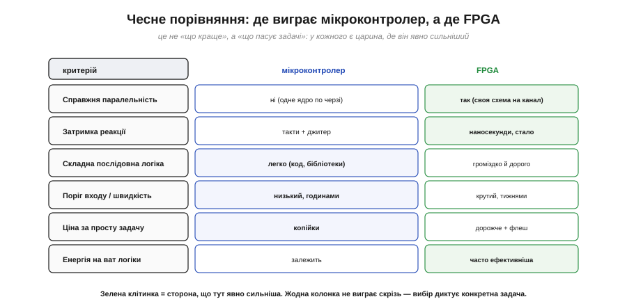
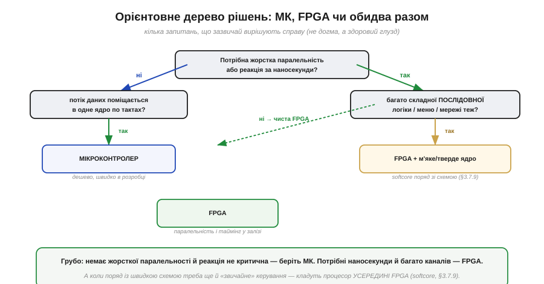

# FPGA чи мікроконтролер: чесні критерії вибору

Найпрактичніше питання, що постає перед кожним інженером на старті проєкту, звучить так: **FPGA чи мікроконтролер?** Його часто ставлять як «що краще», і саме така постановка хибна. Краще — **те, що пасує задачі**; у кожного інструмента є царина, де він явно сильніший, і царина, де він явно зайвий. Ця стаття не агітує ні за кого — вона дає **чесні критерії**, за якими ви самі зважите конкретний випадок: зведемо ключові властивості обох в одну порівняльну рамку, додамо те, про що порівняння швидкодії зазвичай мовчать — ціну й поріг входу, — і виведемо просте практичне правило.

### Порівняння за критеріями

Почнімо з прямого зіставлення по найважливіших осях. Зверніть увагу: жодна сторона не виграє за всіма — кожна має свої сильні клітинки.

*Рис. Шість критеріїв. Справжня **паралельність**: МК — ні (одне ядро по черзі), FPGA — так (своя схема на канал). **Затримка**: у МК такти + джитер, у FPGA — наносекунди, стало. Складна **послідовна логіка**: МК легко (код, бібліотеки), FPGA громіздко. **Поріг входу**: у МК низький (годинами), у FPGA крутий (тижнями). **Ціна** простої задачі: МК — копійки, FPGA — дорожче плюс флеш. Зелене — де сторона явно сильніша.*

Прочитаймо цю таблицю не як змагання, а як **розподіл ролей**. Перші два рядки — вотчина FPGA, і причина в самій її природі [програмовної логіки](book:electronics/programmable-logic): справжня паралельність і стала наносекундна затримка недосяжні для послідовного ядра. Наступні рядки, навпаки, на боці мікроконтролера. Складна **послідовна** логіка — розбір протоколу, меню, файлова система, мережа — природно лягає на код із готовими бібліотеками, а на FPGA вимагала б громіздкого опису [скінченних автоматів](book:electronics/finite-state-machines). **Поріг входу** в МК незрівнянно нижчий: працюючу прошивку можна написати за години, тоді як опанування [потоку синтезу FPGA](book:electronics/fpga-flow) і [мислення схемами на HDL](book:electronics/hdl) забирає тижні. І **ціна**: простий мікроконтролер коштує копійки й не потребує зовнішньої флеші, тоді як FPGA дорожча й тягне за собою обв'язку. Найнаочніше ця двоїстість видно на одному показнику — затримці.

### Один наочний приклад: затримка реакції

Щоб критерії не лишалися абстрактними, візьмемо одну вісь — **затримку реакції** — і покажемо порядки величин. Це той випадок, де перевага FPGA не на відсотки, а в рази.

*Рис. Груба ілюстрація порядків (конкретика залежить від задачі). МК з опитуванням у циклі: сотні нс–мкс, поки дійде черга до перевірки. МК через переривання: десятки–сотні тактів на вхід у обробник. FPGA з прямою логікою: одиниці–десятки нс — лише крізь кілька вентилів. Коли важливі саме наносекунди, FPGA виграє з великим відривом.*

Цей приклад добре окреслює, **де проходить вододіл**. Якщо вашій задачі досить зреагувати «за мікросекунди» — спалахнути світлодіодом на натискання, опитати давач, оновити дисплей, — мікроконтролер це робить легко, і його простота й дешевизна переважують. Але якщо реакція потрібна **за наносекунди й зі сталою затримкою** — швидке аварійне відключення, обробка фронтів швидкого сигналу, точне багатоканальне керування, — тут навіть переривання МК завеликі й «плавають», і потрібна пряма логіка FPGA. Затримка — лише одна вісь, але вона добре ілюструє загальний принцип: збігаються вимоги задачі з природною силою інструмента — він виграє; ні — програє. Перш ніж зводити все в дерево рішень, треба чесно зважити ще дві осі, які новачки часто недооцінюють: **ціну** й **поріг входу**.

### Ціна, енергія й поріг входу — те, про що мовчать порівняння швидкодії

Розмови про FPGA зазвичай крутяться навколо швидкості, та на практиці проєкт частіше вбивають **інші** три речі — гроші, енергія й час на опанування. Почнімо з **ціни**. Простий мікроконтролер коштує копійки й самодостатній: вставив у плату — і він працює. FPGA дорожча сама по собі, та головне — вона **тягне за собою обв'язку**: окрему флеш для бітстріму, який [потік синтезу](book:electronics/fpga-flow) щоразу вантажить у чип, часто кілька різних напруг живлення з власними стабілізаторами, ретельне розведення плати під швидкі сигнали. Тож реальна ціна рішення на FPGA — це не лише чип, а вся ця інфраструктура; для дрібносерійного чи бюджетного пристрою вона нерідко вирішує справу на користь МК ще до будь-яких технічних аргументів.

Друга вісь — **енергія**, і тут картина не однобока. Само собою FPGA не «економніша» й не «ненажерливіша» — усе залежить від навантаження. На **ват корисної логіки** паралельне залізо часто ефективніше: те, на що процесор витратив би мільйони тактів (а отже, й енергію на кожен такт), FPGA робить кількома спеціалізованими блоками за раз. Але порожня чи слабко завантажена FPGA все одно споживає помітний струм спокою на саму свою тканину й конфігурацію, тоді як мікроконтролер у режимі сну опускається до мікроамперів. Тому для пристрою «прокинувся, швидко щось зробив, заснув на годину» — типова автономна задача на батарейці — МК майже завжди ощадливіший, а перевага FPGA в енергоефективності розкривається лише під **постійним важким паралельним навантаженням**.

Третя, і часто найнедооціненіша, вісь — **поріг входу** (*barrier to entry*), а з ним і час до робочого пристрою. Працюючу прошивку для МК пишуть готовими бібліотеками за години, відлагоджують звичним покроковим налагоджувачем, а помилку виправляють перезаливанням за секунди. Дорога на FPGA крутіша: треба перебудувати мислення з «кроків» на «схему», що його вимагає [опис на HDL](book:electronics/hdl), опанувати весь [потік синтезу й P&R](book:electronics/fpga-flow), а кожна збірка великого дизайну триває довго, і відлагоджувати паралельне залізо складніше, ніж читати лог послідовної програми. Цей **час на опанування й ітерацію** — реальна стаття витрат проєкту, і її легко недооцінити, надивившись на самі лиш цифри швидкодії. Маючи всі осі — паралельність, затримку, ціну, енергію, поріг входу, — звести їх у рішення вже неважко.

### Орієнтовне дерево рішень

Звівши міркування докупи, дістанемо кілька запитань, що зазвичай вирішують справу. Це не догма, а здоровий глузд, оформлений як послідовність розвилок.

*Рис. Грубий орієнтир. Немає жорсткої паралельності й наносекундної реакції? Якщо потік ще й уміщується в одне ядро — **мікроконтролер**. Потрібні паралельність чи наносекунди? Якщо поряд є й купа складної послідовної логіки — **FPGA з процесором усередині** (softcore); якщо ні — **чиста FPGA**. Вибір диктує задача, а не мода.*

Логіка цього дерева зводить усі осі докупи. Стартова розвилка — головна: **чи є жорстка паралельність або потреба в наносекундній реакції**, тобто саме те, заради чого існує [програмовна логіка](book:electronics/programmable-logic)? Якщо ні, і задача вкладається в послідовне ядро по тактах, — беріть мікроконтролер, він простіший, дешевший і швидший у розробці; шукати тут FPGA означало б платити складністю ні за що. Якщо ж так — далі питання, **чи багато поряд звичайної послідовної логіки** (меню, мережа, конфігурація). Якщо її чимало, найкраще рішення — не «або-або», а **обидва разом**: FPGA для паралельного заліза плюс процесор **усередині неї** для рутини — гібрид, який називають [softcore-процесором](book:electronics/soft-core). А якщо потрібна тільки паралельна швидкість без рутини — чиста FPGA. Зверніть увагу, що в дереві немає переможця за замовчуванням: кожна гілка веде до інструмента, відповідного **конкретним** вимогам.

> 🔧 **Навіщо це.** Це питання ви розв'язуватимете на старті **кожного** серйозного проєкту, і ціна помилки висока — невдалий вибір тягне за собою тижні переробок. Тримайте в голові суть: **мікроконтролер — типова відповідь** (дешево, просто, гнучко через код), і відходити від неї варто лише за вагомої причини; **FPGA — коли задача жорстко паралельна або вимагає наносекундної детермінованої реакції**, бо саме цього послідовне ядро дати не може; **обидва разом** — коли поряд зі швидким залізом потрібна й «звичайна» логіка, для якої зручний [softcore-процесор у тканині FPGA](book:electronics/soft-core). І не забувайте про **поріг входу й ціну**: FPGA коштує і грошей, і часу на опанування, тож тягнути її в задачу, що чудово лягає на МК, — поширена й дорога помилка. Чесно зваживши критерії, ви оберете не модне, а **доречне**.
