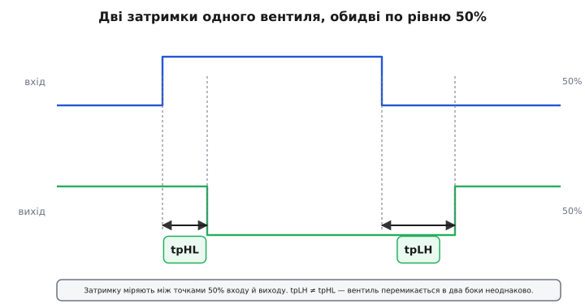
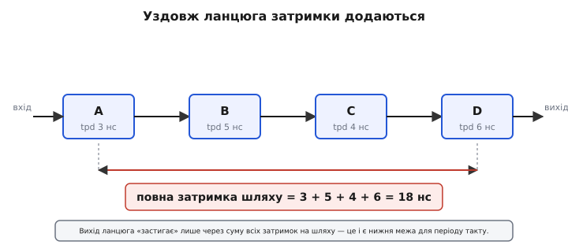
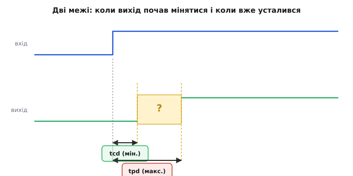
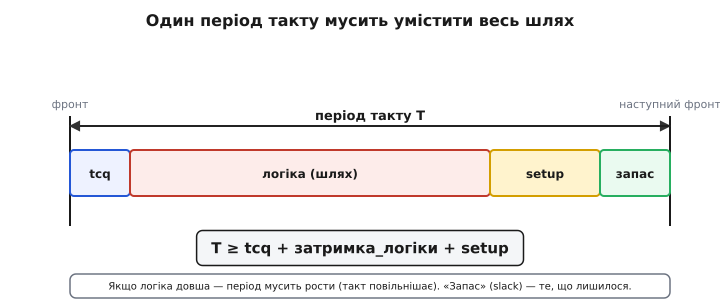

# Часові параметри вентилів: затримки і фронти

Логіку зручно уявляти позачасовою: подав на вхід вентиля (англ. *gate* — ворота, заслінка) одиниці й нулі — миттєво маєш результат на виході. Таблиця істинності ж не питає «коли»: вона лише каже «при таких входах вихід ось такий». Та кремній не читає таблиць. Реальний вентиль — це транзистори, що **перезаряджають ємності**, а на це йде час. Тому в даташиті будь-якого логічного чипа поряд із функцією стоять **числа в наносекундах**: скільки вихід **запізнюється** за входом і скільки часу триває сам **перехід**. Розберімо, що це за числа, **звідки** вони беруться, **чому** їх кілька різних на той самий вентиль — і як з них складається межа швидкості цілої схеми.

> 🔧 **Навіщо це.** Усе тактування — від простого лічильника до процесора — стоїть на цих числах. Не знаєш затримок вентилів — не знаєш, на якій частоті схема ще працює, а на якій починає видавати сміття. Це не теорія: це той рядок даташита, через який ваша плата або працює на 50 МГц, або «незрозуміло глючить» на 60.

### Чому затримка взагалі є

Почнімо з причини, бо без неї числа здаватимуться випадковими. Вентиль перемикає вихід не сам по собі — він **заряджає або розряджає ємність** наступного вузла: затвори транзисторів-приймачів, ємність доріжки, входи всіх під'єднаних чипів. А зробити це за нуль часу неможливо: транзистор віддає **скінченний** струм, тож напруга на ємності повзе вгору (чи вниз) за [RC-кривою](book:electronics/rc-time-constant). Поки вона повзе, вихід ще не перетнув поріг — результат «не готовий».

> Будь-який цифровий вузол має ємність, а драйвер — скінченний струм; тому перехід напруги — це RC-заряджання, а не миттєвий стрибок. Звідси і скінченний час фронту, і запізнення виходу. [Фронти й час наростання](book:electronics/edges-rise-time) показують цю RC-причину докладно.

Звідси випливає головне розрізнення, яке варто закарбувати одразу. Час, поки вихід **реагує** (запізнення реакції), і час, поки сам фронт **їде** від рівня до рівня (крутість переходу), — це **два різні числа про дві різні речі**. Перше називають **затримкою поширення**, друге — **часом переходу**. Сплутати їх — типова помилка початківця, бо обидва міряють у наносекундах і обидва ростуть від ємності. Розгляньмо їх по черзі.

### Затримка поширення: запізнення виходу

**Затримка поширення** (*propagation delay*, tpd) — це наскільки **пізніше** вихід відгукнувся на зміну входу. Щоб число було однозначним, домовилися міряти його між **серединами** фронтів: від моменту, коли **вхід** перетнув 50% свого розмаху, до моменту, коли **вихід** перетнув свої 50%.

Чому саме 50%, а не, скажімо, від початку входу до кінця виходу? Бо середина фронту — найповторюваніша, найменш капризна точка: «хвости» переходу довгі й залежать від навантаження, а перетин половини — чіткий і стабільний. Це та сама інженерна конвенція, що й [10–90% для часу наростання](book:electronics/edges-rise-time): домовилися про однозначну точку — і користуємося.

Тепер тонкість, через яку затримок насправді **дві**. Вентиль перемикається в два боки — вихід то йде вгору (0→1), то вниз (1→0), — і ці два переходи **майже ніколи не однакові за часом**. Тому даються окремо:

- **tpLH** — затримка, коли **вихід** іде **L**ow→**H**igh (з 0 у 1);
- **tpHL** — затримка, коли **вихід** іде **H**igh→**L**ow (з 1 у 0).


*Вхід інвертора (синій) стрибає вгору, потім униз. Вихід (зелений) відгукується із запізненням — але вниз і вгору по-різному: tpHL і tpLH не рівні. Обидві затримки міряють між точками 50% входу й виходу. Через цю асиметрію в даташиті майже завжди два числа, а не одне.*

Звідки асиметрія? У [CMOS-вентилі](book:electronics/cmos-gate) вихід угору тягне один набір транзисторів (p-канальні), а вниз — інший (n-канальні), і їхня «сила» (опір у відкритому стані) різна. Сильніша половина перемикає свій бік швидше — звідси й розбіжність tpLH ≠ tpHL. На практиці беруть **гірше** з двох (більше), бо схема має працювати в найповільнішому випадку. Тому в розрахунках часто пишуть просто tpd, маючи на увазі максимум із tpLH і tpHL.

> 🔧 **Навіщо це.** Якщо ваш сигнал «трохи не встигає» лише на одному з фронтів — гляньте, чи не tpLH і tpHL у вентиля сильно різні. Класичний випадок: вузький імпульс проходить крізь ланцюг і **деформується** — стає коротшим або довшим, бо передній і задній край запізнюються неоднаково. Достатньо довгий ланцюг з асиметричними затримками може імпульс і зовсім «з'їсти».

### Затримки складаються вздовж шляху

Один вентиль — наносекунди. Але логіка — це **ланцюги** вентилів: вихід одного йде на вхід наступного. І тут проста, але вирішальна арифметика: **затримки на шляху додаються**. Сигнал не бачить кінцевого результату, поки не «продереться» крізь усі вентилі від входу до виходу, а кожен додає своє запізнення.


*Чотири вентилі поспіль, кожен зі своєю tpd. Вихід останнього «застигає» лише через суму всіх затримок на шляху: 3 + 5 + 4 + 6 = 18 нс. Саме ця сума, а не затримка окремого вентиля, визначає, як швидко цілий блок видає готовий результат.*

**Приклад (сумарна затримка ланцюга).** Сигнал проходить крізь чотири вентилі із затримками 3, 5, 4 і 6 нс. Через скільки на виході гарантовано стабільний результат?

```
tpath = 3 + 5 + 4 + 6 = 18 нс
```

Вісімнадцять наносекунд — це межа, раніше за яку результату цього ланцюга **не існує**. У реальній [комбінаційній схемі](book:electronics/combinational-circuits) шляхів багато, вони різної довжини, і нас цікавить **найдовший** із них — той, що визначає, коли готова **остання** ще не дорахована бітинка. Цей найдовший шлях називають критичним, і він — головний клопіт у тактуванні.

> Серед усіх шляхів комбінаційної логіки рахується найповільніший — критичний шлях. Саме він задає мінімальний період такту: швидше за нього схема порахувати не встигне. [Критичний шлях і тайминг-клоужер](book:electronics/critical-path-timing) розбирає, як його знаходять і «закривають».

### Дві межі: мінімальна і максимальна затримка

Дотепер ми говорили про tpd як про **максимум** — коли вихід **гарантовано** усталився. Але є й друге, протилежне за змістом число: коли вихід **щонайраніше** **почав** мінятися. Його називають **затримкою забруднення** (*contamination delay*, tcd) — від образу, що вихід «забруднюється», тільки-но почав відходити від старого значення.

Різниця тонка, але важлива. Уявіть вхід змінився. Що знаємо про вихід?

- **До** tcd після входу вихід **точно ще тримає старе** значення — він фізично не встиг зрушити.
- **Після** tpd вихід **точно вже тримає нове** усталене значення.
- **Між** tcd і tpd вихід **невизначений** — десь у переході, йому довіряти не можна.


*Після зміни входу вихід ще тримає старе значення аж до tcd (мінімальна затримка). Потім настає «жовта зона» невизначеності — вихід їде, читати його не можна. І лише через tpd (максимальна затримка) він гарантовано усталився на новому рівні. tcd — найраніший рух, tpd — найпізніший спокій.*

Навіщо дві межі замість однієї? Бо вони охороняють **дві протилежні небезпеки**, і обидві реальні в тактованих схемах:

- **tpd (максимум)** відповідає на питання «чи **встигне** дані дорахуватися **до** наступного фронту такту?». Якщо найдовший шлях довший за період — не встигне, схему треба **сповільнити**. Це порушення часу встановлення (*setup*).
- **tcd (мінімум)** відповідає на протилежне: «чи дані часом **не змінилися надто рано** — ще до того, як [тригер](book:electronics/d-flip-flop) їх **захопив**?». Якщо найкоротший шлях занадто швидкий, нове значення може «наздогнати» фронт і зіпсувати захоплення. Це порушення часу утримання (*hold*).

> Тригер захоплює дані чисто лише тоді, коли вхід стабільний у вікні **setup/hold** довкола фронту такту. Максимальна затримка логіки бореться за setup, мінімальна — за hold. [Метастабільність і таймінг](book:electronics/metastability-timing) пояснює, що буває, коли це вікно порушити.

Ось чому серйозний даташит дає не одне число: для setup потрібен **найгірший великий** шлях (max), для hold — **найгірший малий** (min). Дизайнер мусить вкластися в обидва.

### Часовий бюджет: звідки межа частоти

Тепер зведімо все докупи — бо саме тут затримки вентилів перетворюються на **число мегагерців** на коробці. У [тактованій схемі](book:electronics/clock-signal) між двома фронтами такту має статися ціла подорож: тригер на початку видає нове значення (теж із затримкою), сигнал біжить крізь комбінаційну логіку, і нове значення мусить **застигнути біля наступного тригера завчасно** — за час setup до фронту. Усе це має вкластися в **один період** такту.


*Період такту T — це бюджет, у який усе має влізти: затримка регістра після фронту (tcq), сума затримок логіки на критичному шляху, плюс час setup перед наступним фронтом. Що лишилося — запас (slack). Якщо логіка довшає, бюджет тріщить — і період доводиться збільшувати, тобто такт сповільнювати.*

Запишімо це як нерівність — вона і є серцем усього цифрового тактування:

```
T ≥ tcq + tlogic + tsetup
```

де T — період такту, tcq — затримка тригера-джерела після фронту (*clock-to-Q*), tlogic — сума затримок вентилів на критичному шляху, tsetup — час встановлення тригера-приймача. Усе зайве над цією сумою — **запас** (*slack*): його лишають на старіння, температуру й розкид деталей.

**Приклад (максимальна частота).** Тригер-джерело має tcq = 5 нс, критичний шлях логіки складається в tlogic = 18 нс (з прикладу вище), тригер-приймач вимагає tsetup = 4 нс. Яку найвищу тактову частоту потягне ця схема?

```
Tmin = tcq + tlogic + tsetup = 5 + 18 + 4 = 27 нс
fmax = 1 / Tmin = 1 / 27 нс ≈ 37 МГц
```

Тридцять сім мегагерців — і ні герцем більше, поки логіка така, як є. Хочеш швидше — **скорочуй критичний шлях**: менше вентилів послідовно, швидші вентилі ([логічне сімейство](book:electronics/logic-families) з меншою tpd), або розбий довгий шлях навпіл, уставивши посередині ще один регістр (так роблять конвеєр). Це той самий розрахунок, що визначає [максимальну частоту процесора](book:programming/clock-frequency) і живе в кожному звіті [таймінгу FPGA](book:electronics/fpga-timing).

### Від чого затримка залежить: навантаження, напруга, температура

Числа в даташиті — не висічені в камені. Вони дані **за певних умов**, і поза ними «пливуть». Знати, в який бік, — половина мистецтва налагодження таймінгу.

**Навантаження (ємність).** Це найголовніше і повертає нас до самого початку: вентиль заряджає ємність вузла. Більше ємності — довше заряджати — **більша затримка** і **повільніший фронт**. А ємність росте від кожного зайвого входу, що висить на виході, і від кожного зайвого сантиметра доріжки. Тому даташит завжди вказує, **при якому** навантаженні (типово CL = 15 пФ або 50 пФ) виміряна tpd; на вашій платі з довгими доріжками й купою приймачів вона буде помітно більшою.

> Скільки входів один вихід здатний «потягнути», не сповільнившись надміру, описує навантажувальна здатність (fan-out). Кожен доданий приймач додає вхідної ємності й струму витоку — а отже, затримки й просідання фронту. [Навантажувальна здатність](book:electronics/pin-drive-limits) показує, де межа.

**Напруга живлення.** У CMOS вища напруга живлення дає транзисторам більший струм — ємність заряджається швидше, **затримка падає**. Це не дрібниця, а разючий ефект. Скромний вентиль 74HC00 (чотири елементи І-НЕ) має типову затримку близько 7 нс при 6 В, ~9 нс при 4.5 В — і аж ~25 нс при 2 В (за даними даташитів Nexperia й Diodes, навантаження 15–50 пФ). Тобто, опустивши живлення вдвічі, можна сповільнити логіку втричі.

```
74HC00, типова tpd від напруги живлення:
  6.0 В → ~7 нс
  4.5 В → ~9 нс
  2.0 В → ~25 нс
(тенденція усталена для CMOS: вище живлення — швидше)
```

**Температура.** Тепліший кремній → рухливість носіїв нижча → транзистори «мляві» → **затримка росте**. Тому виробник дає числа на гарячий край діапазону (гірший випадок), і саме там схему треба перевіряти. Поєднання «низька напруга + висока температура + слабкий екземпляр» — це той найгірший кут, у якому критичний шлях найдовший; на нього й закладають запас.

Звідси правило: завжди читайте, **за яких умов** наведено затримку, і додавайте запас на свій реальний кут — інакше схема, що «працює на столі», впаде в спеку або на просілому живленні.

### Нерівні шляхи — джерело короткочасних збоїв

Є ще один наслідок того, що затримки різні й складаються по-різному, — і він пояснює цілий клас підступних багів. Уявіть, що сигнал розгалужується на два шляхи з **різною** сумарною затримкою, а тоді ці шляхи знову сходяться в одному вентилі. Поки «швидка» гілка вже принесла нове значення, а «повільна» ще тримає старе, вихід на коротку мить може смикнутися в **хибне** значення — навіть якщо за усталеною таблицею істинності його там бути не повинно.

Цей короткий хибний імпульс називають **глітч** (*glitch* — збій), а саму причину — гонитва сигналів неоднаковими шляхами. Усталене кінцеве значення правильне, але **на шляху до нього** на виході промайнуло сміття. Для звичайної логіки, яку читають лише раз за такт **після** того, як усе устоялося, глітч нешкідливий — його просто не встигають побачити. Але якщо таким сигналом тактувати тригер або вести його напряму в асинхронний вхід — глітч сприймуть як справжній фронт, і схема зробить казна-що.

> Хибні короткі імпульси через гонитву неоднаковими шляхами усувають вирівнюванням затримок, синхронним проєктуванням або [тригером із гістерезисом](book:electronics/threshold-schmitt) на вході. [Глітчі в комбінаційних схемах](book:electronics/glitch-combinational) розбирають, коли вони безпечні, а коли ні.

Ось чому досвідчені інженери ніколи не тактують схему «сирим» виходом комбінаційної логіки й не заводять його в керування напряму: спершу дають усьому **устоятися** за період такту, а вже потім захоплюють тригером по чистому фронту. Уся [синхронна дисципліна](book:electronics/clock-signal) — це, по суті, спосіб дочекатися, поки затримки відіграють своє, і прочитати результат лише в безпечну мить.

### Як ці числа дізнаються

Лишається питання: звідки беруть самі наносекунди? Виробник міряє їх на тестовому стенді й гарантує даташитом. Але й самому інженерові часто треба **оцінити** реальну затримку на своїй платі чи в [програмованій логіці](book:electronics/programmable-logic) — бо вона залежить від навантаження й розведення. Найдотепніший спосіб виміряти затримку, яка сама по собі надто мала для звичайного приладу, — замкнути непарне число інверторів **у кільце** й дати йому **самозбудитися**: кільце почне коливатися з періодом, що дорівнює подвоєній сумі затримок ланцюга. Поміряв частоту коливань — порахував затримку одного вентиля.

> Кільце з непарного числа інверторів коливається саме; за частотою цих коливань пряма арифметика дає середню затримку вентиля — класичний і дешевий спосіб «зважити» tpd просто на платі чи в чипі. [Вимірювання затримки кільцевим генератором](book:electronics/gate-timing/proj-ring-oscillator.md) дає робочий код і формулу.

---

Зведімо нитку докупи. Вентиль не миттєвий, бо **заряджає ємність** скінченним струмом — це [RC](book:electronics/rc-time-constant). Звідси два різні числа: **затримка поширення** tpd (запізнення виходу, по 50%) і **час переходу** ([крутість фронту](book:electronics/edges-rise-time)) — їх не плутати. Затримка йде в двох видах, tpLH і tpHL, бо вентиль перемикається в два боки неоднаково. Уздовж ланцюга затримки **додаються**, а серед усіх шляхів важить найдовший — критичний. Розрізняють **мінімальну** (tcd, найраніший рух) і **максимальну** (tpd, найпізніший спокій) затримки: перша охороняє hold, друга — setup [тригера](book:electronics/metastability-timing). Усе це складається в нерівність бюджету **T ≥ tcq + tlogic + tsetup**, яка й задає [межу тактової частоти](book:programming/clock-frequency). А самі числа «пливуть» від навантаження, напруги й температури — тож завжди дивись, за яких умов їх дано, і закладай запас.
