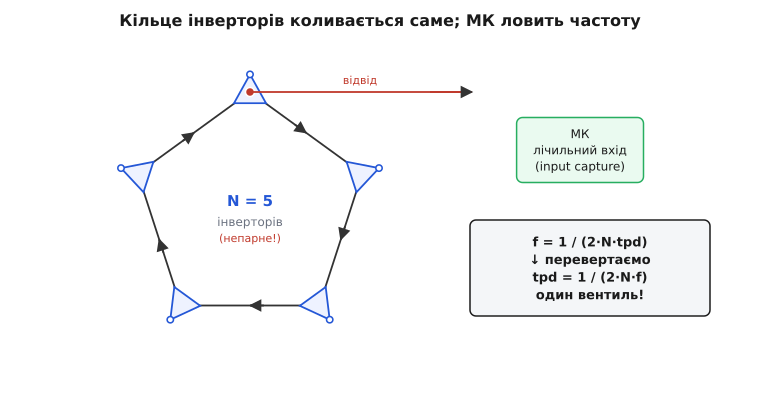
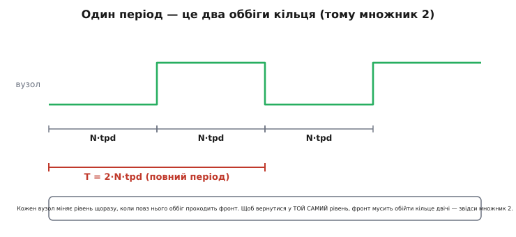

# ⚙️ Вимірюємо затримку вентиля кільцевим генератором

Затримка одного логічного вентиля — одиниці наносекунд. Це прикро мала величина: щоб побачити її прямо, треба осцилограф із смугою в гігагерци й пробники, що самі не додають більше, ніж міряють. У [даташиті](topic:electronics/gate-timing) число є, але воно виміряне за ідеальних лабораторних умов і за одного конкретного навантаження — а вам цікаво, скільки цей вентиль дає **на вашій платі**, з вашими доріжками й вашим живленням. Як зважити наносекунду, не маючи гігагерцового приладу?

Хитрість дотепна до нахабства: змусити затримку **саму себе розмножити** доти, доки вона не виросте до величини, яку легко міряє будь-який дешевий мікроконтролер — звичайним лічильником імпульсів. Замкнімо непарне число інверторів у кільце, дамо йому самозбудитися, і воно почне коливатися з періодом, що дорівнює **подвоєній сумі затримок ланцюга**. Поміряв частоту коливань — поділив, і маєш затримку одного вентиля. Прилад для наносекунд збирається з кількох копійчаних логічних елементів і рядка коду.

> 🔧 **Навіщо це.** Це не лабораторна забавка. Кільцеві генератори живуть **усередині** кожного сучасного процесора й ПЛІС як вбудовані датчики: за їхньою частотою чип на льоту вимірює, наскільки він гарячий, наскільки просіла напруга живлення і наскільки «швидким» чи «повільним» вийшов саме цей кристал із конвеєра. Той самий прийом, що ми зберемо на макетці, працює на кремнієвому рівні як термометр і вольтметр без жодного термометра й вольтметра.

## Задача

Дано: жменя інверторів (скажімо, шестиелементний чип 74HC04 — це вже готові шість інверторів в одному корпусі), макетна плата, живлення й мікроконтролер із будь-яким лічильним входом. Треба виміряти **середню затримку поширення** одного інвертора — ту саму tpd, — не маючи ні швидкого осцилографа, ні частотоміра. Єдиний вимірювальний прилад — сам мікроконтролер, який уміє лише дві прості речі: **рахувати імпульси** й **дивитися на годинник**.

Складність, яку доведеться взяти: частота коливань кільця з кількох вентилів — десятки мегагерців. Це вже надто швидко, щоб мікроконтролер устигав «побачити» кожен окремий фронт своєю програмою (переривання на кожен фронт при 30 МГц просто затопить процесор). Тому вимір мусить бути **апаратним** там, де швидко, і **програмним** лише там, де вже повільно. Як саме розвести це — половина задачі.

## Ідея

Візьмемо один інвертор. Подамо на його вхід 0 — на виході стане 1. З'єднаймо цей вихід із входом… самого себе. Що буде? Вхід був 0, але тепер на нього прийшла 1 з виходу; інвертор побачить 1 і почне гнати вихід у 0; той 0 повернеться на вхід, інвертор почне гнати вихід у 1 — і так без кінця. Схема не має **стабільної точки**: у якому б стані вона не опинилась, вона сама себе з нього виштовхує. Це і є самозбудження — коливання, що народжується само, без жодного зовнішнього джерела (автоколивання).

Один інвертор, замкнений сам на себе, теоретично коливався б, але надто мляво й ненадійно: на такій частоті його підсилення вже замале, фронти вироджуються в синусоїду, і схема радше застрягне десь посередині, ніж чисто заколиватиметься. Тому інверторів беруть **кілька, і обов'язково непарне число** — три, п'ять, сім. Чому непарне — ключ до всього, і його варто розжувати.

### Чому саме непарне число

Ланцюг інверторів на **постійному** рівні (коли нічого не змінюється) поводиться просто: кожен інвертор перевертає рівень, тож ланцюг із **парного** числа інверторів дає на виході **той самий** рівень, що на вході (два перевороти скасовуються), а з **непарного** — **протилежний**.

Тепер замкнімо вихід ланцюга назад на його вхід і спитаймо: чи є в цій петлі **стала точка** — рівень, який, обійшовши коло, вертається сам у себе?

```
парне число:    вхід 0 → … → вихід 0 → назад на вхід 0.  Збігається!
                Петля має стабільну точку — вона просто застигає, НЕ коливається.

непарне число:  вхід 0 → … → вихід 1 → назад на вхід 1.  Суперечність!
                Стабільної точки НЕМА — петля мусить вічно перекидатися. Коливається.
```

Ось у чому суть непарності: непарне кільце — це петля з **інверсією**, тобто з від'ємним зворотним зв'язком по постійному струму. Від'ємний зв'язок не дає системі застигнути: щойно рівень десь усталюється, петля його перевертає й виштовхує назад. Парне ж кільце має **додатний** зв'язок по постійному струму — воно радо застигає в одному з двох стійких станів (це, до речі, і є [защіпка-тригер](topic:electronics/d-flip-flop): два інвертори в кільце — і маємо клітинку пам'яті, а не генератор).

> Два інвертори, замкнені в кільце, не коливаються — вони **защіпаються** в один зі стійких станів і так зберігають біт. Це основа статичної комірки пам'яті: додатний зворотний зв'язок утримує стан, а не розгойдує його. [D-тригер](topic:electronics/d-flip-flop) показує, як із такої защіпки будують кероване запам'ятовування по фронту такту.

А чому ж непарне кільце не просто «дзеленчить» безладно, а коливається з чіткою частотою? Бо перекидання не миттєве. Кожен інвертор перевертає рівень **не одразу**, а через свою затримку tpd. Тож «суперечність», яку ми знайшли, розв'язується не миттєвим стрибком, а хвилею перемикань, що біжить кільцем по колу зі скінченною швидкістю. Ця хвиля й задає період.

### Звідки береться формула

Уявімо, що в якомусь вузлі кільця рівень щойно змінився — скажімо, став високим. Ця зміна поповзе далі: наступний інвертор через свою tpd перекине свій вихід, за ним наступний, і так фронт оббіжить усі N вентилів. Час одного повного оббігу:

```
один оббіг = N · tpd
```

Але після одного оббігу наш початковий вузол опиниться в **протилежному** рівні (бо N непарне — ланцюг інвертує). Щоб він вернувся у **той самий** рівень, з якого почали — тобто щоб завершився один повний **період** коливання, — фронт мусить обійти кільце **двічі**:

```
T = 2 · N · tpd
```


*Непарне число інверторів, замкнене в кільце: петля не має стабільної точки, тож хвиля перемикань вічно біжить по колу. Один вузол відводимо на лічильний вхід мікроконтролера. МК рахує частоту коливань f, а тоді простим діленням дістає затримку одного вентиля tpd = 1 / (2·N·f).*

Ось звідки цей загадковий множник **2**, на якому початківці найчастіше плутаються. Він не «про запас» і не «бо синусоїда» — він строго через те, що повний період прямокутного сигналу складається з **двох** півперіодів (високого й низького), і кожен півперіод — це рівно один оббіг кільця:


*Рівень одного вузла кільця в часі. Перший півперіод (високий) — фронт один раз обійшов усі N вентилів; другий півперіод (низький) — обійшов ще раз, уже протилежним рівнем. Щоб вузол вернувся в той самий рівень, потрібні два оббіги, тому повний період T = 2·N·tpd, а не N·tpd.*

Частота — величина, обернена до періоду, тож із коливань кільця маємо:

```
f = 1 / T = 1 / (2 · N · tpd)
```

А оскільки нам потрібна затримка, а не частота, — перевертаємо рівність і дістаємо **робочу формулу вимірювання**:

```
tpd = 1 / (2 · N · f)
```

Ось і весь прилад в одному рядку. N ми знаємо (самі поставили стільки інверторів), f міряє мікроконтролер — а tpd падає з ділення. Наносекунда, надто мала для прямого спостереження, «розтягнулася» в частоту, яку легко полічити.

**Приклад (від частоти до затримки).** Зібрали кільце з N = 5 інверторів 74HC04. Мікроконтролер намірив частоту коливань f = 12.5 МГц. Яка середня затримка одного інвертора?

```
tpd = 1 / (2 · N · f)
tpd = 1 / (2 · 5 · 12.5×10⁶ Гц)
tpd = 1 / (1.25×10⁸)
tpd = 8.0×10⁻⁹ с = 8.0 нс
```

Вісім наносекунд на вентиль — і це число ми дістали лічильником, який рахує імпульси десятки мільйонів разів на секунду, тобто цілком буденною для мікроконтролера роботою. Порівняйте з даташитом 74HC04 (типово 8–9 нс при 5 В) — збіг, і при цьому ми виміряли затримку **на своїй платі, зі своїм навантаженням**, а не на ідеальному стенді виробника.

## Робочий C/C++: рахуємо частоту й рахуємо затримку

Тепер найцікавіше — прошивка. Пастка, з якої треба вийти, вже названа: частота кільця (десятки МГц) надто висока, щоб ловити кожен фронт програмою. Розв'язання — **розділити роботу за швидкістю**:

- те, що швидко (лічити мільйони фронтів), доручаємо **апаратному лічильнику/таймеру** — він тактується прямо сигналом кільця й нарощує число сам, без участі процесора;
- те, що повільно (відкрити «вікно» рівно на відомий час і зчитати, скільки за нього набіглó), робить **програма** — вона лише двічі поглядає на годинник і один раз читає лічильник.

Це те саме «апаратно там, де швидко; програмно там, де повільно», що рятує будь-який частотомір. Розгляньмо два способи — від грубого, який працює на будь-чому, до чистого апаратного.

### Спосіб 1: воротний рахунок (працює всюди, зокрема на Arduino)

Найпростіша ідея частотоміра: відкрий ворота на **точно відомий** проміжок часу (скажімо, рівно 100 мс), полічи всі імпульси, що пройшли крізь них, а тоді поділи число імпульсів на час — це і є частота. У класичному Arduino для цього є готовий інструмент: функція `pulseIn` міряє довжину одного імпульсу, але для десятків мегагерців вона надто повільна. Тож ідемо іншим шляхом — рахуємо **самим таймером**, а не програмою.

Але тут чигає пастка, суто аврівська, і саме на ній валиться більшість наївних реалізацій. Таймер1 уміє тактуватися від зовнішньої ніжки T1, проте цю ніжку він **не слухає безперервно** — він опитує її своїм внутрішнім синхронізатором раз на такт ядра (тут 16 МГц) і лише порівнянням двох сусідніх зчитувань вирішує, чи стався фронт. Щоб такий механізм жодного фронту не проґавив, зовнішня частота мусить бути **помітно нижчою** за тактову: даташит ATmega328 кладе стелю близько **fCLK_I/O / 2.5**, тобто при 16 МГц — лише **≈6.4 МГц** (жорстка межа — половина такту, 8 МГц; поділ на 2.5 — це вже із запасом на шпаруватість і розкид). Гірше того, **зовнішній такт не можна поділити внутрішнім прескейлером таймера** — прескейлер діє тільки на внутрішнє джерело. А частота нашого кільця — десятки мегагерців, у рази вище за стелю. Заведеш кільце прямо на T1 — синхронізатор ковтатиме фронти, і лічильник намірить нісенітницю.

Ліки прямі — ті самі, що рятують і другий спосіб: **поділити частоту кільця апаратним дільником, перш ніж вести її на T1**. Ставимо між кільцем і ніжкою T1 дешевий лічильник-дільник (74HC4040 чи короткий ланцюжок тригерів), розрахований на частоту вище за кільце, який ділить на відоме P; візьмімо P = 8. Тоді на T1 приходить 12.5 МГц / 8 ≈ 1.6 МГц (а навіть найпрудкіше кільце на 30 МГц дасть 30 / 8 ≈ 3.75 МГц) — надійно під стелею 6.4 МГц. Повне число фронтів кільця дістаємо, помноживши полічене таймером назад на P. Правило вибору P просте: тримай `f_кільця / P` із запасом під 5 МГц.

Ось повна прошивка для плати на AVR (Arduino Uno / Nano). Апаратний Таймер1 налаштовуємо в режим **зовнішнього лічильника**: він сам рахує фронти **поділеного** сигналу, що приходять на ніжку T1 (цифровий вивід D5 на Uno), доки процесор зайнятий іншим. Переповнення 16-бітного лічильника ловимо не опитуванням у циклі, а **апаратним перериванням переповнення** (TOV1) — так жоден перекот не загубиться, хай би як швидко таймер крутився.

```c
// Кільце інверторів (напр. 5×74HC04) виходом заведене на апаратний дільник ÷P,
// а вже ПОДІЛЕНИЙ сигнал — на D5 (ніжка T1 таймера1).
// AVR-таймер1 у режимі зовнішнього лічильника сам рахує фронти поділеного сигналу.
// Плата: Arduino Uno/Nano (ATmega328), тактова 16 МГц.
//
// ЧОМУ ДІЛЬНИК: ніжку T1 таймер опитує синхронізатором на частоті ядра, тож
// зовнішня частота мусить бути < fCLK_I/O/2.5 ≈ 6.4 МГц при 16 МГц, і поділити
// її внутрішнім прескейлером не можна. Кільце дає десятки МГц — тому ділимо
// на P (тут 8) ЗОВНІШНЬО, до T1, а число фронтів множимо назад на P.

#include <Arduino.h>

const uint8_t  N          = 5;         // скільки інверторів у кільці (НЕПАРНЕ!)
const uint32_t P          = 8;         // коефіцієнт зовнішнього дільника перед T1
const uint32_t WINDOW_MS  = 100;       // ширина вікна лічби, мс

volatile uint32_t t1_ovf = 0;          // рахунок переповнень Таймера1 (нарощує ISR)

// Апаратне переривання: спрацьовує щоразу, коли Таймер1 перекотився через 65536.
ISR(TIMER1_OVF_vect) {
    t1_ovf++;
}

void setup() {
    Serial.begin(115200);
    pinMode(5, INPUT);                 // D5 = вхід T1, туди йде ВИХІД ДІЛЬНИКА
}

// Полічити фронти кільця за час WINDOW_MS, повернути частоту КІЛЬЦЯ в Гц.
double measure_frequency(void) {
    noInterrupts();
    TCCR1A = 0;                        // звичайний режим, без ШІМ
    TCCR1B = 0;                        // таймер поки стоїть
    TCNT1  = 0;                        // обнулити лічильник
    t1_ovf = 0;                        // обнулити рахунок переповнень
    TIFR1  = (1 << TOV1);             // скинути завислий прапорець переповнення
    TIMSK1 = (1 << TOIE1);            // дозволити переривання переповнення Таймера1
    interrupts();

    // Старт: CS = 111 → зовнішнє джерело такту на висхідному фронті ніжки T1.
    // Реальний час вікна засікаємо micros() (він іде від власного 16 МГц ядра).
    uint32_t t0 = micros();
    TCCR1B = (1 << CS12) | (1 << CS11) | (1 << CS10);   // старт зовнішнього лічильника

    // Просто чекаємо кінця вікна — переповнення тим часом рахує ISR, не програма.
    uint32_t deadline = t0 + WINDOW_MS * 1000UL;
    while ((int32_t)(micros() - deadline) < 0) { /* чекаємо */ }

    // Зупиняємо таймер і атомарно дочитуємо стан (TCNT1 уже застиг).
    TCCR1B = 0;                        // стоп: TCNT1 більше не змінюється
    uint32_t t1 = micros();

    noInterrupts();
    uint32_t ovf = t1_ovf;
    uint16_t rem = TCNT1;
    if (TIFR1 & (1 << TOV1)) ovf++;   // перекіт стався, але ISR ще не встиг — врахуймо
    interrupts();

    // Повне число фронтів ПОДІЛЕНОГО сигналу = переповнення·65536 + залишок.
    uint32_t div_counts  = ovf * 65536UL + rem;
    // Фронтів САМОГО КІЛЬЦЯ у P разів більше (дільник видає 1 фронт на кожні P).
    double   ring_counts = (double)div_counts * P;
    double   secs        = (t1 - t0) * 1e-6;   // реальна ширина вікна, с
    return ring_counts / secs;                 // частота КІЛЬЦЯ, Гц
}

void loop() {
    double f   = measure_frequency();
    double tpd = 1.0 / (2.0 * N * f);      // РОБОЧА ФОРМУЛА: затримка одного вентиля

    Serial.print("f = ");   Serial.print(f / 1e6, 3);  Serial.print(" МГц   ");
    Serial.print("tpd = "); Serial.print(tpd * 1e9, 2); Serial.println(" нс");
    delay(500);
}
```

Розберімо серце цього коду. Перше — **навіщо зовнішній дільник**. Таймер1 не тактується сигналом кільця напряму: він лише раз на такт ядра зазирає на ніжку T1 і за двома сусідніми зчитуваннями вирішує, чи був фронт. Якщо між двома зазираннями встигло промайнути **два** фронти (а на десятках МГц при ядрі 16 МГц саме так і буде), один зникне безслідно. Стеля fCLK_I/O/2.5 ≈ 6.4 МГц — це й є межа, за якою синхронізатор починає губити фронти, а внутрішнім прескейлером зовнішній такт не збити. Дільник ÷P опускає частоту під цю стелю; результат чесно множимо назад на P, бо дільник видає один свій фронт на кожні P фронтів кільця.

Друге — **чому переповнення рахує переривання, а не цикл опитування**. Таймер1 лише 16-бітний: він рахує до 65535 і перекочується в нуль. Навіть після ділення на 8 за стомілісекундне вікно на T1 набіжить `1.6×10⁶ · 0.1 ≈ 1.6×10⁵` фронтів — це кілька перекотів через 65536. Спокуса ловити їх у циклі, порівнюючи «поточне значення менше за попереднє», підступна: якщо одна ітерація забариться (а `micros()` усередині недешевий), таймер устигне перекотитися **двічі** між двома поглядами, і один перекіт загубиться — вимір тихо занизиться. Апаратне переривання TOV1 такої діри не має: залізо саме зводить прапорець переповнення в мить перекоту, і коротка ISR нарощує лічильник у своєму, апаратно засіченому часі, а не в ритмі забарного головного циклу. Жоден перекіт не проходить повз — тому наприкінці лишається тільки зчитати накопичене й підібрати останній, ще не оброблений перекіт за прапорцем `TOV1`.

Третя тонкість — **вікно міряємо реальним часом, а не припущенням**. Ми задали `WINDOW_MS = 100`, але цикл `while` завершиться не рівно через 100.000 мс, а трохи пізніше (остання ітерація ж має добігти). Тому ми не ділимо на «0.1 с», а беремо справжню ширину вікна з різниці `micros()` до й після — `secs = (t1 - t0)·1e-6`. Крихітна дрібниця, але саме такі дрібниці відрізняють вимір із похибкою 0.1% від виміру з похибкою 5%.

> 🔧 **Навіщо це.** Прийом «апаратний лічильник рахує швидке, програма міряє повільне вікно» — це універсальний скелет **будь-якого** частотоміра на мікроконтролері, не лише для кільця. Тахометр двигуна, лічильник Гейгера, вимірювач частоти з давача — усі стоять на цій самій парі «зовнішній лічильник + воротне вікно». Навчився тут — умієш скрізь.

### Спосіб 2: апаратне захоплення періоду (STM32 / точніше)

Воротний рахунок простий, але має вбудовану межу точності: за 100 мс вікна ми полічимо ціле число імпульсів ± один, і цей «±1» кладе стелю на роздільність. Для кільцевого генератора є елегантніший шлях — не рахувати імпульси за вікно, а прямо **виміряти період одного коливання**, спіймавши два послідовні фронти апаратним блоком **захоплення входу** (*input capture*). Такий блок є майже в кожному 32-бітному мікроконтролері: коли на ніжку приходить фронт, таймер **сам, миттєво, апаратно** запам'ятовує своє поточне значення в регістр — без жодної затримки на переривання. Різниця двох таких зафіксованих значень — і є період у тактах таймера.

Пастка тут інша: період кільця (десятки наносекунд) настільки короткий, що навіть швидкий таймер на 100 МГц устигне натикати між двома фронтами лише кілька своїх тактів — надто грубо. Тому перед захопленням сигнал кільця **ділять на велике число** апаратним [дільником частоти](topic:electronics/frequency-divider) (лічильником-прескейлером): 25 МГц, поділені на 256, дають ~98 кГц — а такий період таймер на 100 МГц міряє вже з тисячею тактів на період, тобто дуже точно. Ми ділимо частоту на відоме M, міряємо повільніший сигнал, а тоді множимо результат назад.

```c
// STM32 (HAL). Вихід кільця поділений апаратним лічильником на M=256,
// поділений сигнал заведено на канал input-capture таймера TIM2.
// Таймер тактується від системної шини (тут APB1 timer clock = 84 МГц).

#include "stm32f4xx_hal.h"

#define N            5U         // інверторів у кільці (непарне)
#define DIV_M        256U       // на скільки поділили частоту кільця перед захопленням
#define TIMER_HZ     84000000.0 // такт таймера TIM2, Гц

extern TIM_HandleTypeDef htim2; // TIM2, канал 1 у режимі input capture (CubeMX)

// Захопити два послідовні фронти, повернути період поділеного сигналу в секундах.
double capture_divided_period(void) {
    // Чекаємо перший фронт і фіксуємо значення таймера в мить фронту.
    __HAL_TIM_CLEAR_FLAG(&htim2, TIM_FLAG_CC1);
    while (!__HAL_TIM_GET_FLAG(&htim2, TIM_FLAG_CC1)) { }
    uint32_t c1 = HAL_TIM_ReadCapturedValue(&htim2, TIM_CHANNEL_1);

    // Чекаємо наступний фронт.
    __HAL_TIM_CLEAR_FLAG(&htim2, TIM_FLAG_CC1);
    while (!__HAL_TIM_GET_FLAG(&htim2, TIM_FLAG_CC1)) { }
    uint32_t c2 = HAL_TIM_ReadCapturedValue(&htim2, TIM_CHANNEL_1);

    // Різниця з урахуванням можливого перекоту 32-бітного таймера.
    uint32_t ticks = c2 - c1;              // беззнакове віднімання само коректне при перекоті
    return ticks / TIMER_HZ;               // період ПОДІЛЕНОГО сигналу, с
}

double measure_gate_delay(void) {
    // Усереднимо кілька захоплень — приберемо тремтіння (jitter) одиничного виміру.
    const int K = 64;
    double sum = 0.0;
    for (int i = 0; i < K; i++) sum += capture_divided_period();
    double T_div = sum / K;                // середній період поділеного сигналу

    // Повертаємо поділ назад: справжній період кільця у M разів коротший.
    double T_ring = T_div / DIV_M;         // T = 2·N·tpd
    double tpd    = T_ring / (2.0 * N);    // затримка одного вентиля
    return tpd;                            // с
}
```

Головна думка тут — у двох рядках наприкінці. Ми виміряли період **поділеного** сигналу `T_div`, який у M = 256 разів довший за справжній період кільця (бо дільник видає один свій імпульс на кожні 256 коливань). Тож справжній період кільця — `T_div / M`, а вже з нього звична формула дає затримку: `tpd = T_ring / (2·N)`. Дільник частоти тут — не ускладнення, а саме те, що робить вимір точним: він **сповільнює** сигнал якраз настільки, щоб таймер устигав його докладно розгледіти, і рівно на відоме число, яке ми потім чесно повертаємо.

Усереднення `K = 64` захоплень — не косметика. Одиничний вимір періоду завжди тремтить: теплові флуктуації, шум живлення, дрібне тремтіння самого таймера. Кожен окремий період трохи «гуляє» довкола істинного, але ці відхилення **випадкові й симетричні**, тож середнє з багатьох сходиться до правди, а розкид спадає. Це загальний закон вимірювання, не хитрість саме кільця.

## Складність і пастки

Прийом простий на вигляд, але між «зібрав кільце» і «намірив правильну наносекунду» лежить кілька ям, у кожну з яких легко впасти. Пройдімося по них — бо кожна псує результат по-своєму й лікується по-своєму.

**Пастка нуль: парне число вентилів — і кільце не заколивається.** Найбанальніша й найчастіша. Поставив чотири інвертори замість п'яти — кільце має стабільну точку, тихо в ній застигає й **мовчить**. Ніякого сигналу на виході, лічильник показує нуль, а новачок годину шукає «поганий контакт». Завжди рахуй вентилі: **три, п'ять, сім** — тільки непарне. Якщо під рукою парне число, додай один зайвий інвертор або прибери один.

**Затримка міряється середня, а не якогось одного вентиля.** Формула дає `tpd = 1/(2·N·f)` — це затримка **на вентиль у середньому**. Але ми з [самої природи вентиля](topic:electronics/gate-timing) знаємо, що перехід угору (tpLH) і вниз (tpHL) майже ніколи не однакові. Фронт, оббігаючи кільце, по черзі проходить обидва типи переходів, тож виміряна «середня» tpd — це насправді середнє арифметичне tpLH і tpHL:

```
виміряне tpd ≈ (tpLH + tpHL) / 2
```

Це чесне й корисне число (для оцінки швидкості логіки саме воно й треба), але не плутай його з «найгіршою» затримкою з даташита, яку беруть як **максимум** із двох, а не середнє. Кільце усереднює — даташит для розрахунку такту бере гірший край.

> Один вентиль має **дві** різні затримки — вгору (tpLH) і вниз (tpHL), бо тягнуть вихід різні транзистори. Кільцевий генератор проходить обидві по черзі, тож міряє їхнє **середнє**; а для розрахунку максимальної частоти схеми беруть **гіршу** з двох. [Часові параметри вентилів](topic:electronics/gate-timing) розкладають, звідки ця асиметрія і де яке число доречне.

**Ємність відводу підмішується у вимір — і завищує затримку.** Той вузол, який ми відвели на мікроконтролер (чи на дільник), тепер несе зайве навантаження: вхідну ємність ніжки МК, ємність доріжки, ємність пробника, якщо дивишся осцилографом. А ми знаємо: [більша ємність — більша затримка саме цього вентиля](topic:electronics/gate-timing). Тобто вентиль, з якого зроблено відвід, стає повільнішим за решту, і виміряне середнє трохи завищується. Ліки: відводити сигнал через окремий **буфер** (ще один вентиль-повторювач, що не входить у кільце), який приймає навантаження МК на себе, а кільцю показує лише свою малу вхідну ємність. Тоді кільце «не відчуває» приладу.

**Кільце — чутливий термометр і вольтметр, і це заважає, поки не почнеш цим користуватися.** Частота кільця «пливе» від усього, що змінює швидкість транзисторів: [напруги живлення й температури](topic:electronics/gate-timing). Просів живлення на десяту вольта — затримка підросла, частота впала; нагрів чип пальцем — те саме. Для точного виміру tpd це прокляття: тримай живлення стабільним і дай платі прогрітися до сталої температури, інакше число «дихає». Але це прокляття — оборотний бік суперзірки: **та сама** чутливість робить кільцевий генератор ідеальним вбудованим датчиком. Розгойдай кільце на кристалі процесора, стеж за його частотою — і ти безкоштовно маєш і термометр (частота падає з нагрівом), і індикатор просідання живлення, і навіть «сортувальник» кристалів (швидкий кремній дає вищу частоту). Дефект вимірювання одного стає корисною функцією іншого.

> 🔧 **Навіщо це.** Саме тому кільцеві генератори — стандартний блок усередині чипів: вони «зважують» реальну швидкість кремнію в реальних умовах прямо на місці. Керування частотою й напругою процесора (коли він сам скидає тактову в спеку чи піднімає, коли є запас) спирається зокрема на показання таких вбудованих кілець. Ваша макетна вправа й промислова технологія — буквально та сама схема в різному масштабі.

**Занизька частота — не крути її туди-сюди довгим кільцем.** Хочеться поставити багато вентилів (більше N — нижча, «зручніша» частота). Але довге кільце на макетці — це довгі доріжки, антена для наводок, і сигнал вироджується. Розумніше тримати кільце **коротким і компактним** (3–5 вентилів поряд), а «сповільнення для зручного виміру» робити **окремим дільником частоти** після кільця, як у прикладах вище — його довжина доріжок уже не критична, бо він працює з уже сформованим сигналом. Не плутай «сповільнити для виміру» зі «сповільнити сам генератор».

**Кільце обов'язково заведи в захоплення чистим фронтом, а не крізь шум.** Вихід кільцевого генератора на високій частоті — не ідеальний меандр, а щось ближче до синусоїди з розмитими фронтами. Якщо завести його прямо на звичайний лічильний вхід, той може «побачити» на одному пологому фронті кілька перетинів порога поспіль (через шум) і порахувати зайве. Тому на вхід приймача корисно поставити [тригер із гістерезисом](topic:electronics/threshold-schmitt) (Шмітта): він робить із пологого зашумленого фронту чистий різкий перепад і рахує рівно один фронт на перехід. Багато мікроконтролерних входів уже мають гістерезис усередині — але як дійде до дивних показань, перевір це першим.

> Пологий чи зашумлений фронт звичайний логічний вхід може порахувати кілька разів поспіль. [Тригер із гістерезисом](topic:electronics/threshold-schmitt) розводить поріг спрацювання вгору й униз на дві різні напруги, тож дрібне тремтіння довкола порога вже не породжує зайвих перемикань — на виході рівно один чистий фронт на кожен справжній перехід.

Зведімо докупи. Кільцевий генератор перетворює наносекундну затримку, яку прямо не поміряти, на мегагерцову частоту, яку легко полічити звичайним мікроконтролером, — бо непарне кільце інверторів не має стабільної точки й самозбуджується з періодом `T = 2·N·tpd`. Прошивка розводить роботу за швидкістю: апаратний лічильник рахує швидкі фронти, програма міряє повільне вікно (або апаратне захоплення прямо ловить період поділеного сигналу), а робоча формула `tpd = 1/(2·N·f)` віддає затримку одного вентиля. Головні ями — парне число вентилів (мовчить), ємність відводу (завищує), плавучість від живлення й температури (та сама, що робить кільце чудовим вбудованим датчиком) і брудні фронти (лікуються гістерезисом). Виміряне число — це **середнє** з tpLH і tpHL саме на вашій платі, і в цьому його цінність: воно каже правду про ваше залізо, а не про ідеальний стенд виробника.
