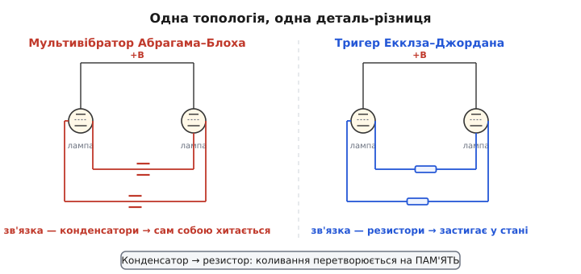
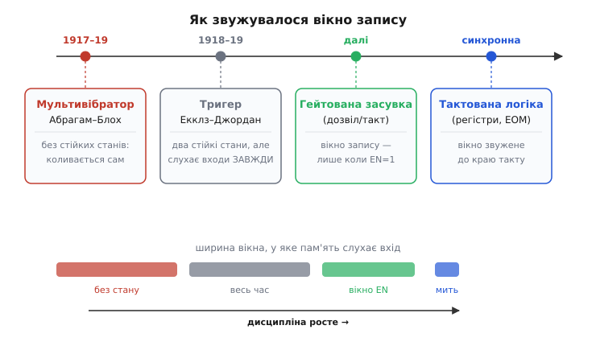

# 📜 Від «завжди ввімкненого» тригера до вікна запису

Уся синхронна цифрова техніка тримається на одній звичці, такій буденній, що її вже й не помічають: пам'ять слухає вхід **не завжди, а лише в дозволену мить**. Такт цокнув — регістри защепнули нові значення; між тактами вони глухі до всього, що діється на входах. Ця дисципліна здається настільки очевидною, що важко уявити світ без неї. А тим часом перші електронні комірки пам'яті працювали рівно навпаки — вони слухали входи **безперервно**, кожну секунду свого життя, і ніхто спершу не бачив у цьому проблеми. Історія гейтування — це історія того, як інженери усвідомили, що безперервна чутливість заважає, і навчилися свідомо її обмежувати. Шлях від «завжди ввімкнено» до «лише коли дозволено» зайняв не один рік і провів електроніку від коливального контуру воєнного передавача до тактового генератора цифрового комп'ютера.

Розберімо цей шлях чесно, розрізняючи, де була ідея, де реалізація, а де лише термін, який причепився пізніше. І — оскільки тут легко наплести красивих легенд про «першого винахідника» — звірмо кожну дату й кожне ім'я з тим, що насправді підтверджено.

## Дивна річ, яка не хотіла зупинятися

Почалося все не з пам'яті, а з коливань. Ішла Перша світова, і радіозв'язок раптом став зброєю: армії потребували точних передавачів, приймачів і — це вже нудна, але критична деталь — способу **вимірювати частоту**. Щоб настроїти приймач на ворожу станцію чи повірити власний передавач, треба мати еталон частоти, з яким звіряєшся. А для цього зручно мати генератор, який видає не чистий тон однієї частоти, а сигнал, **багатий на гармоніки** — щоб одразу мати цілу гребінку опорних частот, кратних основній.

Саме таку річ і зробили двоє французьких фізиків — **Анрі Абрагам** (Henri Abraham) і **Ежен Блох** (Eugène Bloch). Обидва — французи, обидва пов'язані з паризькою Вищою нормальною школою (École Normale Supérieure). Абрагам ще у 1915 році долучився до створення надійної французької підсилювальної лампи — так званої **лампи TM** (*lampe TM*, від «télégraphie militaire» — «військова телеграфія»), яка під час війни випускалася в Франції понад мільйоном штук і стала робочим тілом усієї тодішньої радіоелектроніки. З двох таких ламп Абрагам і Блох і склали свій генератор.

> 🔧 **Навіщо це.** Тут варто закарбувати межу, яку історія техніки постійно розмиває: **робоча деталь** (надійна лампа) — це передумова, без якої жодна схема не існує. Скільки блискучих схемних ідей лишилися на папері лише тому, що не було стабільного активного елемента. Лампа TM — той тихий фундамент, на якому вже можна було будувати і генератори, і, згодом, пам'ять.

Схема виявилася чудернацькою. Дві лампи ввімкнені навхрест — вихід кожної через **конденсатор** заведений на керувальну сітку іншої. Така пара не має спокою: щойно одна лампа відкривається, вона через конденсатор притискає другу, та закривається, конденсатор поволі перезаряджається — і за мить усе перекидається навпаки. Виходить нескінченне самочинне гойдання туди-сюди, і на виході — не синусоїда, а різкі стрибки, **прямокутна хвиля**, напхана гармоніками. За цю рясноту частотних складників автори й назвали пристрій **мультивібратором** (*multivibrateur* — «багатоколивач»): він ніби вібрує на багатьох частотах одразу, на відміну від однотонного синусоїдного генератора.

Тут — перша тонкість з датами, і її треба подати точно, бо джерела на позір суперечать одне одному. **Опубліковано** мультивібратор було 1919 року — в «Annales de Physique» (том 12, с. 252) і в закритому виданні французького військового міністерства («Publication 27»). Але **розроблено** його раніше: за французькими документами, що довго лежали під грифом «secret défense» і були оприлюднені вже в наш час, робочу схему Абрагам і Блох мали ще наприкінці 1917 року. Розрив між створенням і публікацією — типова прикмета воєнного часу: працездатну річ тримали в секреті, а до друку вона дійшла, коли війна скінчилася.

> Статус доказовості: **усталено** — авторство Абрагама й Блоха, назва «мультивібратор», астабільна природа схеми й датування публікації 1919 роком підтверджені багатьма незалежними джерелами. Дата *розробки* (кінець 1917) спирається на пізніше розсекречені французькі військові документи — **правдоподібно й документовано**, хоч і не так широко відоме, як дата публікації.

## Один крок від гойдалки до пам'яті

Мультивібратор не пам'ятає нічого — він **не може зупинитися**, у нього немає стійкого стану, лише вічний перекид. Але в самій його будові вже сховано зерно пам'яті, і побачити його — означає зрозуміти, звідки взялася вся цифрова техніка.

Уся справа в **конденсаторах** зв'язку. Саме вони змушують схему хитатися: конденсатор пропускає лише *зміну*, тимчасовий поштовх, а тоді перезаряджається й «відпускає» — тому жоден стан не тримається, за мить його змиває. А тепер поставмо просте питання: що як прибрати цю тимчасовість? Що як замінити конденсатори на **резистори** — на постійний, не зникний зв'язок?

Тоді схема міняє характер докорінно. Резистор не «відпускає» з часом — він тримає зв'язок вічно. Відкрита лампа через резистор постійно притискає закриту, і та лишається закритою **скільки завгодно довго**. Гойдання зникає, а натомість з'являються **два стійкі стани**: «ліва відкрита, права закрита» і навпаки. Схема застигає в одному з них і сидить у ньому, аж поки зовнішній поштовх не перекине її в інший. Це вже не гойдалка — це **тумблер із пам'яттю**, що зберігає своє положення.

*Топологія одна: дві лампи, ввімкнені навхрест, вихід кожної керує сусідньою. Уся різниця — в елементі зв'язку. Конденсатори (ліворуч, червоні) пропускають лише зміну й перезаряджаються — схема не має спокою й вічно перекидається: це астабільний мультивібратор Абрагама–Блоха. Резистори (праворуч, сині) тримають зв'язок постійно — схема застигає в одному з двох станів і зберігає його: це бістабільний тригер, електронна пам'ять на один біт. Заміна однієї деталі перетворює коливання на пам'ять.*

Цей крок — від астабільної гойдалки до бістабільного фіксатора — зробили двоє британських інженерів, **Вільям Генрі Екклз** (William Henry Eccles) і **Френк Вілфред Джордан** (Frank Wilfred Jordan), обидва британці, обидва пов'язані з лондонським технічним коледжем City and Guilds. Патентну заявку «Improvements in Ionic Relays» (британський патент **148,582**) вони подали **21 червня 1918 року**; опубліковано патент було пізніше — 5 серпня 1920-го. Коротку статтю «A trigger relay utilizing three-electrode thermionic vacuum tubes» надрукували в журналі «The Electrician» **19 вересня 1919 року**. Схему назвали **тригером Екклза–Джордана** (*Eccles–Jordan trigger circuit*); слово «тригер» (*trigger* — «спусковий гачок») точно вловлює суть — коротким поштовхом «спускаєш» пристрій з одного стану в інший, і він там лишається.

> 🔧 **Навіщо це.** Ось де народжується сама ідея електронної пам'яті — і вона до безглуздого проста: **позитивний зворотний зв'язок**, доведений до самопідтримання. Схема тримає власний стан, бо кожна половина безперервно підтверджує другу. Це той самий принцип, що й у сучасній SR-засувці на двох [вентилях NOR](book:electronics/sr-latch): петля, яка сама себе годує. Дев'яносто років технологій відділяють лампу від нанометрового транзистора, а серце пам'яті лишилося тим самим — коло, що само себе тримає.

## Хто в кого запозичив — і чому дати сваряться

Тут доводиться зупинитися й акуратно розплутати вузол, який у популярних переказах зазвичай зав'язують нашвидку. Дуже часто пишуть коротко: «тригер Екклза–Джордана походить від мультивібратора Абрагама–Блоха — просто конденсатори замінили на резистори». Твердження гарне, і по суті **правильне схемно**, але з датами воно вступає в очевидну суперечку, і чесність вимагає це проговорити.

Придивімося. Мультивібратор **опубліковано** 1919 року. Патент Екклза–Джордана **подано** в червні 1918-го — тобто **раніше** за публікацію французів. Як же британці могли «походити» від того, що ще не надруковане? Виходить одне з двох. Або то було **паралельне, незалежне** відкриття — двоє британців дійшли до бістабільної схеми своїм шляхом, не бачивши французької роботи, і схожість топологій — річ природна, бо обидві виростають з тієї самої ідеї двох ламп навхрест. Або ж лінія спадковості таки є, але тягнеться не від *публікації* 1919-го, а від *раніших* напрацювань і циркуляції ідей воєнного часу — адже саму французьку схему, як згадано вище, мали вже 1917 року, просто під секретом.

Обидва пояснення сумісні з фактами, і **надійно вибрати між ними лише за датами не можна**. Що можна стверджувати впевнено: обидві схеми — рідня за будовою (дві лампи навхрест, позитивний зворотний зв'язок), і **функційна** різниця між ними чітка й глибша за просту заміну деталі — астабільна проти бістабільної, гойдалка проти пам'яті.

> Статус доказовості: твердження «Екклз–Джордан прямо *походить* від Абрагама–Блоха» — **поширене, але не безумовно доведене**. Хронологія (подання патенту 1918 vs публікація 1919) лишає відкритою можливість незалежного паралельного відкриття. Схемну спорідненість двох топологій і функційну різницю (астабільна ↔ бістабільна) — **усталено**. Найчесніше формулювання: споріднені ідеї спільного походження, а не однозначне «нащадок від предка».

Це якраз той випадок, коли варто опиратися звабі однієї чистенької історії про «того, хто перший придумав». Винаходи такого штибу — колективні й «носяться в повітрі»: працездатна лампа є в усіх, ідея двох ламп навхрест лежить на поверхні, кілька команд у різних країнах під тиском війни рухаються паралельно. Приписати все одному імені чи одній нації — означає підмінити реальну, багатолюдну картину зручним міфом.

І ще одну людську ноту тут не можна проминути. Ежен Блох був французьким фізиком **єврейського походження**. 1940 року, після ухвалення антиєврейських законів вішістського режиму, його усунули з посади у Вищій нормальній школі; він переховувався під чужим ім'ям, намагався втекти до Швейцарії — і не зумів. Його схопили й вивезли; **12 березня 1944 року Ежен Блох загинув в Аушвіці**. Про це варто пам'ятати щоразу, коли ім'я співавтора мультивібратора спокійно згадують у підручнику: за сухим «Абрагам і Блох» стоїть учений, якого вбила держава за те, ким він народився.

## «Завжди ввімкнено» — і чому це стало вадою

Тригер Екклза–Джордана вмів дві речі: **зберігати** стан і **перемикатися** від поштовху. Але — і це головне для нашої історії — він **не мав жодного вимикача уваги**. Комірка слухала свої входи **безперервно**: щойно на вхід приходив спусковий сигнал, вона тієї ж миті перекидалася. Сучасною мовою це звучить так: перший електронний тригер за поведінкою був **прозорою засувкою** (*transparent latch*) — вихід є живим відгуком на вхід у будь-яку секунду, між ними немає жодних воріт.

Попервах у цьому не бачили вади — навпаки, це була сама суть. Екклз і Джордан описували свій винахід прозаїчно: «спосіб реле або підсилення в електричних колах для телеграфії та телефонії». Їм ішлося про **реле** — швидкий електронний перемикач, що спрацьовує від сигналу. Реле й **має** реагувати одразу, безперервна чутливість для нього — гідність, а не хиба. Ідея «а нумо забороняти йому реагувати більшу частину часу» була б тоді просто безглуздою: навіщо глушити те, що для того й зроблено, щоб слухати?

Вада прозорості вилазить назовні лише тоді, коли з одиничних комірок починають будувати **систему** — багато пам'яті, що мусить працювати **злагоджено**. Уяви ряд таких комірок, крізь які тече обчислення: вихід одних — вхід інших. Поки кожна слухає безперервно, зміна на вході першої **тут-таки** проповзає в другу, звідти в третю, і хвиля розповзається схемою некерованим фронтом. Значення накладаються, «нове» переганяє «старе», результат залежить від випадкових відмінностей у затримках дротів. Система стає **перегоновою** — правильність відповіді визначає не логіка, а те, який сигнал устиг першим. Ось де прозорість із чесноти обертається на прокляття.

> 🔧 **Навіщо це.** Той самий конфлікт живий і сьогодні, лише в іншому вбранні. Прозора засувка чудова, коли треба **миттєво віддзеркалити** сигнал (наприклад, короткочасно «защепити» шину даних). І вона ж — джерело хаосу, коли з таких комірок збирають конвеєр, де все має рухатися **крок за кроком**. Розуміння, коли прозорість — друг, а коли ворог, і досі відрізняє того, хто вміє проєктувати цифрову логіку, від того, хто ловить «примарні» збої в готовій платі.

## Народження вікна: обмежити мить, а не змінити пам'ять

Розв'язок, коли він визрів, виявився концептуально невеликим, а наслідки мав величезні. Не треба переробляти саму комірку пам'яті — вона добра, вона тримає біт. Треба лише **поставити перед нею ворота** й додати окремий сигнал, який ці ворота відчиняє й зачиняє. Поки сигнал каже «можна» — комірка слухає входи, як звикла; щойно каже «не смій» — на входи комірки силоміць подають «тримати», і жодне смикання зовні крізь зачинені ворота не проходить. Цей керувальний сигнал і назвали **дозволом** (*enable*), а коли він періодичний — **тактом** (*clock*).

Це і є **гейтування** (від англ. *gate* — «ворота»). Суть його треба вимовити гранично точно, бо саме тут криється вся глибина ідеї: ворота керують **не тим, що́ пам'ятати, а тим, коли до пам'яті можна достукатися**. Вміст комірки лишається її власною справою; додається тільки **розклад доступу**. Пам'ять із простого фіксатора стану, що слухає всесвіт цілодобово, перетворюється на **кероване вікно** — вузьку смугу часу, у яку вона й тільки тоді сприймає нове.

Зверни увагу, який це тонкий і красивий зсув думки. Проблему прозорості можна було б спробувати вбити «в лоб» — зробити комірку якось нечутливою, ускладнити саме серце пам'яті. Натомість інженерна ідея пішла збоку: серце лишили недоторканим, а розв'язали задачу **зовні**, окремим сигналом-заслінкою. Складність не додали всередину — її винесли назовні, у ясний і незалежний керувальний вхід. Це один із тих ходів, які згодом виявляються нескінченно плідними саме через свою скромність.

*Чотири віхи одного руху. Мультивібратор (1917–19) стійкого стану не має взагалі — він «слухає себе» безперервно й вічно хитається. Тригер Екклза–Джордана (1918–19) уже має пам'ять, але слухає зовнішні входи ЗАВЖДИ — вікно доступу нескінченне. Гейтована засувка звужує це вікно до часу, поки активний дозвіл EN. Тактована синхронна логіка стискає його ще далі — фактично до краю такту. Нижня смуга показує головне: ширина вікна, у яке пам'ять сприймає вхід, неухильно зменшується, і рівно з цим наростає дисципліна цифрової системи.*

Хто саме «перший» причепив дозвіл до тригера — назвати одним ім'ям і датою чесно **не можна**, і не варто вигадувати. Гейтована комірка — не героїчний винахід одного дня, а поступове осідання практики: коли з тригерів почали складати лічильники, регістри й керувальні схеми, потреба відділити «коли писати» від «що писати» проступила сама, і різні інженери в різних лабораторіях відповідали на неї тими самими воротами з логічних вентилів. Це радше **дозрівання ідеї**, ніж точковий винахід із патентом і датою.

> Статус доказовості: конкретне «хто перший додав дозвіл/такт до тригера» — **не має однозначної атрибуції**; гейтована засувка усталилася як загальноінженерна практика, а не як іменований винахід. Тому будь-яке «її винайшов той-то тоді-то» слід вважати спрощенням. Що усталено — сам напрям еволюції: від безперервно чутливого тригера до керованого вікна запису.

## З вікна виростає такт усієї машини

Коли ворота вже є, наступний крок робиться майже неминуче — і саме він виводить нас до цифрового комп'ютера. Якщо кожна комірка пам'яті в машині має свій дозвіл, то напрошується подати на **всі** дозволи **один спільний сигнал** — єдиний ритм, під який уся система оновлюється **разом, в одну домовлену мить**. Цей спільний періодичний дозвіл і є **тактовий сигнал**, а машина, що живе за ним, — **синхронна**.

Вигода колосальна саме тому, що прибирає перегони. Поки такт «низький» — усі комірки тримають своє, а комбінаційна логіка між ними спокійно рахує й устигає **вгамуватися**, хай навіть сигнали біжать різними дротами з різними затримками. Коли такт «цокає» — усі комірки одночасно защеплюють уже усталені, правильні значення. Хаос некерованого розповзання зникає: усе рухається **дискретними кроками**, крок за тактом, і на кожному кроці стан машини визначений однозначно. Перегони між сигналами більше не вирішують результату — його вирішує логіка, а такт лише каже, **коли** підбивати підсумок.

Так із маленької ідеї «поставмо перед пам'яттю ворота» виросло тактування — кістяк, на якому тримається кожен процесор, кожен мікроконтролер, кожна цифрова мікросхема з тактовим входом. Перші електронні обчислювальні машини вже спиралися саме на цю дисципліну: британський **Colossus** (1943), що зламував шифрувальні коди, був складений із тригерів Екклза–Джордана, а повоєнні архітектури зробили центральний такт своєю основою. Комірка, яку колись зробили як безперервно чутливе реле, стала слухати світ лише в такт — і саме ця самонакладена стриманість зробила можливою всю подальшу цифрову техніку.

> 🔧 **Навіщо це.** Ця історія — не музейна старовина, а прямий ключ до того, як ти й досі проєктуєш і лагодиш логіку. Кожен раз, ставлячи тактовий вхід на регістр чи заводячи сигнал `WE` (write enable) чи `LE` (latch enable) у комірку, ти повторюєш той самий давній хід: **відділяєш «коли» від «що»**. І коли схема на латчах поводиться «за настроєм» — писати то пише, то ні, — перше питання лишається тим самим, що визріло сто років тому: а чи справді ворота були відчинені **саме тоді**, коли на входах стояли дійсні, стабільні дані? Уся синхронна логіка — це, зрештою, мистецтво відчиняти ворота пам'яті в потрібну мить і ні на йоту раніше чи пізніше.

Погляньмо на пройдений шлях цілком. Спершу — воєнна гойдалка, що не вміла стояти на місці. Потім заміна однієї деталі перетворила гойдалку на пам'ять, яка тримала стан, але слухала входи цілодобово. Тоді хтось — точніше, багато хто потроху — здогадався, що безперервна увага заважає, і поставив перед пам'яттю ворота, звузивши її чутливість до дозволеного вікна. І нарешті одне спільне вікно на всю машину стало тактом, під який синхронно б'ється серце кожного цифрового пристрою. Пам'ять навчилася **мовчати між тактами** — і саме ця дисципліна мовчання, а не сама здатність пам'ятати, зробила з набору перемикачів упорядковану обчислювальну машину.
