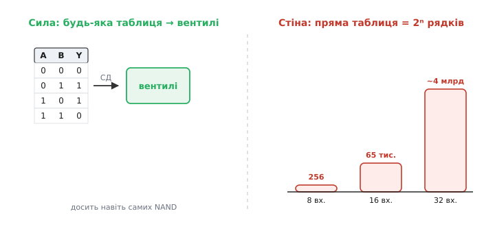
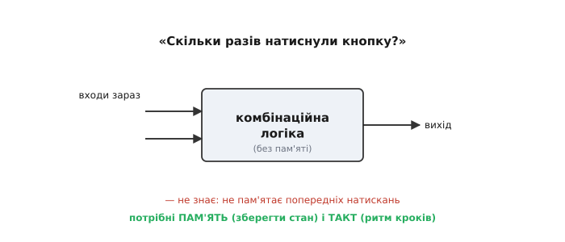
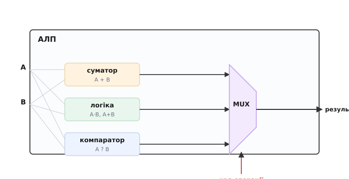
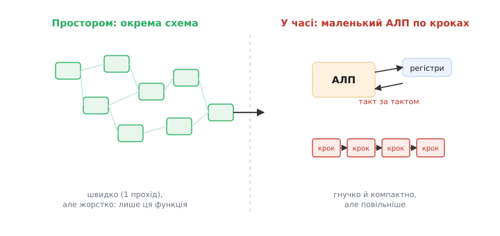

# Складні функції з вентилів

Одна [булева операція](topic:math/boolean-algebra) — це мало, та з [вентилів](topic:electronics/basic-gates) виростають блоки, що додають числа й спрямовують сигнали. Постає природне питання: **куди** це веде і де межа. Що з вентилів можна (і чого не можна) збудувати взагалі — і чи приводить ця дорога до процесора. Відповідь менше про обчислення й більше про **ціле**: як логічні цеглини складаються в обчислювальну машину і де пролягають межі самої логіки.

### Драбина абстракції

Найважливіша ідея — навіть не конкретна схема, а **спосіб думати**. Складність приборкують **рівнями абстракції** (*abstractio*, лат. «відведення, відволікання» — відведення уваги від деталей): кожен рівень будують із нижнього й **ховають** його деталі, щоб на наступному рівні думати вже про нього як про цеглину.


*Чотири щаблі абстракції. **Транзистор** ([ключ](book:electronics/field-control)) → **вентиль** (кілька транзисторів, [зібраних у CMOS](book:electronics/cmos-gate)) → **блок** (десятки вентилів: [суматор, мультиплексор, дешифратор](book:electronics/combinational-circuits)) → **функціональний вузол** (АЛП, регістр — блоки плюс пам'ять) → **[процесор](book:programming/what-is-processor)** (вузли плюс керування). На кожному щаблі нижчий рівень — поза увагою: проєктуючи суматор, не думають про транзистори; пишучи програму, не думають про вентилі.*

Це і є відповідь на питання «як узагалі можна збудувати щось із мільярдів транзисторів». Ніхто не тримає в голові мільярд — їх групують у вентилі, вентилі в блоки, блоки у вузли, і на кожному рівні працюють із кількома зрозумілими цеглинами. Без цієї драбини сучасна електроніка була б неможлива; з нею — посильна. Той самий принцип повторюється всюди, від схемотехніки до програмування.

### Збудувати можна будь-що — та не однією таблицею

Сила комбінаційної логіки вражає: [сума добутків](topic:math/boolean-algebra) і [універсальність NAND](topic:electronics/nand-nor) разом доводять, що **будь-яку** логічну функцію можна збудувати з вентилів. Дай яку завгодно таблицю істинності — і знайдеться схема, що її точно відтворює. У цьому сенсі вентилі **всемогутні**.


*Ліворуч — сила: будь-яка таблиця істинності → сума добутків → вентилі (досить навіть самих NAND). Праворуч — стіна: пряма таблиця для функції з n входів має **2ⁿ** рядків, а це число **вибухає** (8 входів — 256, 16 — 65 тисяч, 32 — близько чотирьох мільярдів). Корисну функцію 32-бітних чисел «однією величезною таблицею» фізично неможливо викласти.*

Ось перша межа. Теоретично «будь-що» — це правда, та практично гігантські функції **не роблять** однією плоскою таблицею-схемою: вона була б завбільшки з планету. Натомість складне **розбивають** на блоки (так додавання розкладають на повні суматори) і на **кроки в часі**. Всемогутність вентилів реальна, але користуватися нею треба з розумом ієрархії.

### Друга межа: немає пам'яті

Друга межа фундаментальніша. Комбінаційна схема, хоч би яка велика, **нічого не пам'ятає** — її вихід залежить лише від входів **зараз**. А отже, цілий клас задач їй просто не під силу.


*Спитай комбінаційну схему «скільки разів натиснули кнопку» — вона не відповість, бо не пам'ятає попередніх натискань, знає лише стан **зараз**. Так само вона не вміє лічити кроки чи виконувати дії **по черзі**. Для всього цього потрібні **пам'ять** (зберегти стан між подіями) і **такт** (ритм, що відмірює кроки).*

Це той самий поділ між [комбінаційним і послідовнісним](topic:electronics/combinational-circuits): без пам'яті проти з пам'яттю. Більшість по-справжньому корисного — лічильники, автомати, **виконання програми крок за кроком** — потребує пам'яті й часу. Дві межі разом — вибух таблиці й брак пам'яті — штовхають інженерію від ідеї «одна схема = одна функція» до ідеї **машини, що працює в часі**.

### АЛП: де всі блоки сходяться

[Комбінаційні блоки](topic:electronics/combinational-circuits) сходяться в один вузол, що стане серцем машини, — **арифметико-логічний пристрій** (*ALU*, arithmetic logic unit, АЛП). Це блок, що вміє **кілька** операцій і за командою видає потрібну.


*Усередині АЛП кілька схем рахують **одночасно**: суматор дає A+B, логіка дає A·B та A+B, компаратор порівнює. А **мультиплексор** за **кодом операції** обирає, який із результатів випустити назовні. Тобто АЛП — це суматор + логіка + мультиплексор, з'єднані разом. Це вже **обчислювальне ядро** процесора; бракує пам'яті й керування, що подаватиме коди операцій.*

Усі грані логіки сходяться разом: арифметика ([суматор](topic:electronics/combinational-circuits)), [логіка вентилів](topic:electronics/basic-gates), вибір ([мультиплексор](topic:electronics/combinational-circuits)) — в одному блоці, що за одним числом-командою робить будь-що з переліку. АЛП — це місток від «логіки» до «[процесора](topic:programming/what-is-processor)»: дай йому пам'ять для операндів і керування, що йтиме програмою, — і вийде машина, що виконує обчислення.

### Однобітна скибка АЛП — з самих вентилів

Щоб АЛП перестав бути коробкою-схемою, варто скласти його **скибку** — частину, що обробляє один розряд, — із самих вентилів. Хай вона вміє три дії: **додати**, **A AND B**, **A OR B**, а двобітний код операції `op` обирає, котру випустити. Один розряд бере доданки `a`, `b` і перенос-вхід `cin`; усе багатобітне — це ряд таких скибок, де перенос біжить від молодшої до старшої.

Усередині три схеми рахують паралельно: повний суматор дає біт суми й перенос-вихід, окремі вентилі дають `a·b` та `a+b`. Біт суми повного суматора — це непарність трьох входів, тобто `a ⊕ b ⊕ cin`; перенос-вихід — «більшість», одиниця коли серед трьох щонайменше дві. Готові три результати заходять у мультиплексор «3-в-1», а `op` пропускає на вихід `y` рівно один.

**Скибка для a=1, b=1, cin=0, op=00 (додати).** Порахуймо всі три блоки, тоді виберімо результат за кодом операції.

:::tabs
```cpp
// один розряд АЛП: повертає біт результату y і перенос-вихід cout
// op: 00=ADD, 01=AND, 10=OR
uint8_t alu_bit(uint8_t a, uint8_t b, uint8_t cin, uint8_t op, uint8_t *cout) {
    uint8_t sum  = a ^ b ^ cin;             // біт суми: непарність трьох входів
    uint8_t cout_add = (a & b) | (cin & (a ^ b));  // перенос: «більшість»
    uint8_t and_ = a & b;                   // a AND b
    uint8_t or_  = a | b;                    // a OR b

    *cout = (op == 0) ? cout_add : 0;        // перенос має сенс лише для ADD
    if (op == 0) return sum;                 // мультиплексор «3-в-1»
    if (op == 1) return and_;                // обирає один із трьох
    return or_;                              // op == 2 → OR
}
```
```python
# один розряд АЛП: повертає (біт результату y, перенос-вихід cout)
# op: 0=ADD, 1=AND, 2=OR
def alu_bit(a, b, cin, op):
    sum_     = a ^ b ^ cin                   # біт суми: непарність трьох входів
    cout_add = (a & b) | (cin & (a ^ b))     # перенос: «більшість»
    and_     = a & b                         # a AND b
    or_      = a | b                          # a OR b

    cout = cout_add if op == 0 else 0        # перенос має сенс лише для ADD
    if op == 0:
        return sum_, cout                    # мультиплексор «3-в-1»
    if op == 1:
        return and_, cout                    # обирає один із трьох
    return or_, cout                         # op == 2 → OR
```
:::

```
вхід:  a=1  b=1  cin=0  op=00 (ADD)
sum      = 1 ⊕ 1 ⊕ 0       = 0
cout_add = (1·1) + 0·(1⊕1) = 1
and_     = 1 · 1           = 1
or_      = 1 + 1           = 1
мультиплексор за op=00 пропускає sum:
y = 0,  cout = 1     →  1+1 = 10₂, тобто сума 0 з переносом 1 ✓
```

Та сама скибка з `op=01` віддала б `y = a·b = 1`, а з `op=10` — `y = a+b = 1`, і перенос тоді не потрібен. Жодного нового заліза для вибору операції: рахують **усі три блоки завжди**, а мультиплексор лише вирішує, чий результат побачить світ. Ось чому АЛП на схемі — це суматор, банка логічних вентилів і мультиплексор, з'єднані докупи.

> 🔧 **Навіщо це.** Та сама скибка пояснює, чому віднімання в процесорі не потребує окремого віднімача. Досить подати `b` через XOR із керувальною лінією `sub` і завести `sub` у `cin` наймолодшого розряду: за `sub=1` біти `b` інвертуються, а `+1` від переносу дає доповняльний код, тож `a + (~b) + 1 = a − b`. Один суматор робить і додавання, і віднімання — менше вентилів, менше площі, менше тепла.

### Два способи обчислити: простором чи в часі

Найглибша думка зв'язує логіку з усією рештою цифрової техніки: одну й ту саму функцію можна реалізувати **двома принципово різними** способами.


*Просторово (ліворуч): вентилі викладають так, щоб вони **прямо** обчислювали потрібну функцію. Швидко (відповідь — за один прохід сигналу), але **жорстко**: ця схема вміє лише цю функцію, а складніша потребує більше площі. У часі (праворуч): беруть **маленький** АЛП із регістрами й виконують функцію **по кроках**, такт за тактом, за програмою. Гнучко й компактно (один АЛП робить що завгодно), але **повільніше**. Це і є вибір «залізо проти програми».*

Цей вододіл визначає всю електроніку. Потрібна **максимальна швидкість** однієї конкретної задачі — «відлий» її в окрему схему (так роблять відеокарти, спеціалізовані чипи, [ПЛІС](topic:electronics/programmable-logic)). Потрібна **гнучкість** — щоб один пристрій робив що завгодно, лише зміни програму — візьми **[процесор](topic:programming/what-is-processor)**: маленький АЛП, що крок за кроком виконує будь-який алгоритм. Перший шлях — **апаратне** обчислення, другий — **програмне**. Майже вся робота з [мікроконтролером](topic:programming/microcontroller) — це другий шлях: гнучка машина, що виконує **програму**. А починається вона рівно тут: АЛП є, бракує пам'яті й ритму.

> 🔧 **Навіщо це.** Ця тема дає **карту**, без якої легко загубитися. Перше: мисли **рівнями** — не тримай у голові транзистори, працюючи з блоками, чи вентилі, пишучи код; кожен рівень має свою цеглину. Друге: пам'ятай про **дві межі** комбінаційної логіки (вибух таблиці й брак пам'яті) — саме вони пояснюють, навіщо взагалі існують пам'ять, такт і процесор. Третє, найпрактичніше: за кожною задачею стоїть вибір «**схемою чи програмою**» — швидко-але-жорстко проти гнучко-але-повільніше. Робота з мікроконтролером — це свідомий вибір **програмного** шляху.

---

Складність приборкують **драбиною абстракції** ([транзистор](topic:electronics/field-control) → вентиль → блок → вузол → [процесор](topic:programming/what-is-processor)), де кожен рівень ховає деталі нижчого. Комбінаційна логіка **функціонально всемогутня** (будь-яка таблиця → вентилі), але має **дві межі**: пряма таблиця **вибухає** як 2ⁿ, і вона **не має пам'яті**. Звідси — потреба у блочній ієрархії та в **машині, що працює в часі**. [Комбінаційні блоки](topic:electronics/combinational-circuits) сходяться в **АЛП** (суматор + логіка + мультиплексор за кодом операції), а одна його [однобітна скибка](topic:electronics/gates-to-functions/proj-alu-slice.md) показує це з самих вентилів — обчислювальне ядро процесора. А найглибше: ту саму функцію можна реалізувати **просторово** (окрема швидка, та жорстка схема) або **в часі** (гнучкий процесор, що виконує кроки за програмою) — це вибір «залізо проти програми», що визначає всю цифрову електроніку. Щоб АЛП став повноцінною машиною, бракує одного — здатності **запам'ятовувати**: схеми, що [утримує стан](topic:electronics/state-memory) між тактами.
