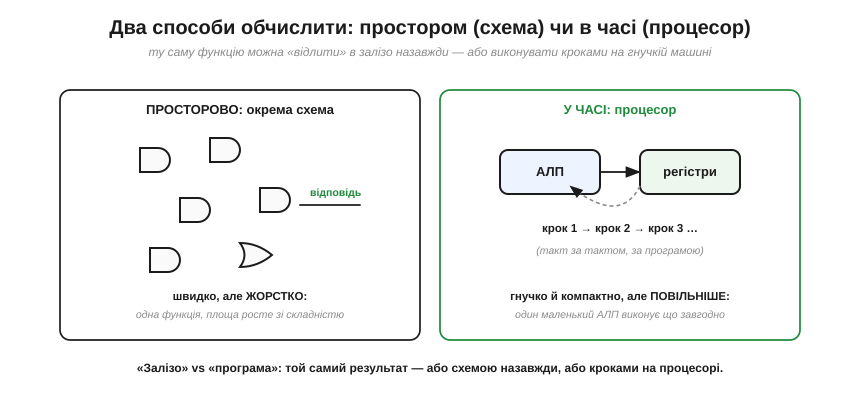

# Від вентилів до складних функцій

Від однієї [булевої операції](book:math/boolean-algebra) логіка виростає до блоків, що додають числа й спрямовують сигнали. Та постає природне питання: **куди** це веде і де межа? Що з [вентилів](book:electronics/basic-gates) можна (і чого не можна) збудувати взагалі, і куди ця дорога приводить — до процесора? Тут ми менше рахуємо й більше **бачимо ціле**: як окремі логічні цеглини складаються в обчислювальну машину і де пролягають межі самої логіки.

### Драбина абстракції

Найважливіша ідея — навіть не конкретна схема, а **спосіб думати**. Складність приборкують **рівнями абстракції**: кожен рівень будують із нижнього й **ховають** його деталі, щоб на наступному рівні думати вже про нього як про цеглину.

*Рис. Драбина абстракції на одному малюнку. **Транзистор** ([ключ](book:electronics/field-control)) → **вентиль** (кілька транзисторів, [зібраних у CMOS](book:electronics/cmos-gate)) → **блок** (десятки вентилів: [суматор, MUX, дешифратор](book:electronics/combinational-circuits)) → **функціональний вузол** (АЛП, регістр — блоки плюс пам'ять) → **[процесор](book:programming/what-is-processor)** (вузли плюс керування). На кожному щаблі ми **забуваємо** про нижчий: проєктуючи суматор, не думаємо про транзистори; пишучи програму, не думаємо про вентилі.*

Це і є відповідь на питання «як узагалі можна збудувати щось із мільярдів транзисторів?». Ніхто не тримає в голові мільярд — їх групують у вентилі, вентилі в блоки, блоки у вузли, і на кожному рівні працюють із кількома зрозумілими «цеглинами». Без цієї драбини сучасна електроніка була б неможлива; з нею — посильна. Цей принцип повторюється всюди, від схемотехніки до програмування.

### Збудувати можна будь-що — та не однією таблицею

Тепер — про силу й межу комбінаційної логіки. Сила вражає: [сума добутків](book:math/boolean-algebra) і [універсальність NAND](book:electronics/nand-nor) разом доводять, що **будь-яку** логічну функцію можна збудувати з вентилів. Дайте яку завгодно таблицю істинності — і знайдеться схема, що її точно відтворює. У цьому сенсі вентилі **всемогутні**.

*Рис. Ліворуч — сила: будь-яка таблиця істинності → сума добутків → вентилі (досить навіть самих NAND). Праворуч — стіна: пряма таблиця для функції з n входів має **2ⁿ** рядків, а це число **вибухає** (8 входів — 256, 16 — 65 тисяч, 32 — близько чотирьох мільярдів). Збудувати корисну функцію 32-бітних чисел «однією величезною таблицею» фізично неможливо.*

Ось перша межа. Теоретично «будь-що» — це правда, та практично гігантські функції **не роблять** однією плоскою таблицею-схемою: вона була б завбільшки з планету. Натомість складне **розбивають** на блоки (так додавання розкладають на повні суматори) і на **кроки в часі**. Всемогутність вентилів реальна, але користуватися нею треба з розумом ієрархії.

### Друга межа: немає пам'яті

Друга межа фундаментальніша. Комбінаційна схема, хоч би яка велика, **нічого не пам'ятає** — її вихід залежить лише від входів **зараз**. А отже, цілий клас задач їй просто не під силу.

*Рис. Спитайте комбінаційну схему «скільки разів натиснули кнопку?» — вона не відповість, бо не пам'ятає попередніх натискань, знає лише стан **зараз**. Так само вона не вміє рахувати, лічити кроки, виконувати дії **по черзі**. Для всього цього потрібні **пам'ять** (зберегти стан між подіями) і **такт** (ритм, що відмірює кроки).*

Це той самий поділ між [комбінаційним і послідовнісним](book:electronics/combinational-circuits): без пам'яті проти з пам'яттю. Більшість по-справжньому корисного — лічильники, автомати, **виконання програми крок за кроком** — потребує пам'яті й часу. Дві межі разом — вибух таблиці й брак пам'яті — і штовхають інженерію від ідеї «одна схема = одна функція» до ідеї **машини, що працює в часі**.

### АЛП: де всі блоки сходяться

Перш ніж дійти до машини, зберімо [комбінаційні блоки](book:electronics/combinational-circuits) в один вузол, що стане її серцем, — **арифметико-логічний пристрій** (*ALU*, АЛП). Це блок, що вміє **кілька** операцій і за командою видає потрібну.

*Рис. Усередині АЛП кілька схем рахують **одночасно**: суматор дає A+B, логіка дає A·B та A+B, компаратор порівнює. А **мультиплексор** за **кодом операції** обирає, який із результатів випустити назовні. Тобто АЛП — це суматор + логіка + MUX, з'єднані разом. Це вже **обчислювальне ядро** процесора; лишилося додати пам'ять і керування, що подаватиме коди операцій.*

Погляньте, як гарно сходяться всі грані логіки: арифметика ([суматор](book:electronics/combinational-circuits)), [логіка вентилів](book:electronics/basic-gates), вибір ([мультиплексор](book:electronics/combinational-circuits)) — в одному блоці, що за одним числом-командою робить будь-що з переліку. АЛП — це місток від «логіки» до «[процесора](book:programming/what-is-processor)»: дайте йому пам'ять для операндів і керування, що йтиме програмою, — і отримаєте машину, що виконує обчислення.

### Два способи обчислити: простором чи в часі

І нарешті — найглибша думка, що зв'язує логіку з усією рештою цифрової техніки. Одну й ту саму функцію можна реалізувати **двома принципово різними** способами.

*Рис. **Просторово** (ліворуч): викладаємо вентилі так, щоб вони **прямо** обчислювали потрібну функцію. Швидко (відповідь — за один прохід сигналу), але **жорстко**: ця схема вміє лише цю функцію, а складніша функція потребує більше площі. **У часі** (праворуч): беремо **маленький** АЛП із регістрами й виконуємо функцію **по кроках**, такт за тактом, за програмою. Гнучко й компактно (один АЛП робить що завгодно), але **повільніше**. Це і є вибір «залізо проти програми».*

Осягніть цей вододіл — він визначає всю електроніку. Хочете **максимальної швидкості** однієї конкретної задачі — «відлийте» її в окрему схему (так роблять відеокарти, спеціалізовані чипи, [ПЛІС](book:electronics/programmable-logic)). Хочете **гнучкості** — щоб один пристрій робив що завгодно, лише зміни програму — візьміть **[процесор](book:programming/what-is-processor)**: маленький АЛП, що крок за кроком виконує будь-який алгоритм. Перший шлях — це **апаратне** обчислення, другий — **програмне**. Майже вся робота з [мікроконтролером](book:programming/microcontroller) — це другий шлях: гнучка машина, що виконує **програму**. А починається вона рівно тут: АЛП є, лишилося дати йому пам'ять і ритм.

> 🔧 **Навіщо це.** Ця тема дає вам **карту**, без якої легко загубитися. Перше: мисліть **рівнями** — не намагайтеся тримати в голові транзистори, коли працюєте з блоками, чи вентилі, коли пишете код; кожен рівень має свою «цеглину». Друге: пам'ятайте про **дві межі** комбінаційної логіки (вибух таблиці й брак пам'яті) — саме вони пояснюють, навіщо взагалі існують пам'ять, такт і процесор. Третє, найпрактичніше: за кожною задачею стоїть вибір «**схемою чи програмою**» — швидко-але-жорстко проти гнучко-але-повільніше. Робота з мікроконтролером — це свідомий вибір **програмного** шляху, і тепер ви розумієте, що саме він означає на рівні заліза.

---

Отже, складність приборкують **драбиною абстракції** ([транзистор](book:electronics/field-control) → вентиль → блок → вузол → [процесор](book:programming/what-is-processor)), де кожен рівень ховає деталі нижчого. Комбінаційна логіка **функціонально всемогутня** (будь-яка таблиця → вентилі), але має **дві межі**: пряма таблиця **вибухає** як 2ⁿ, і вона **не має пам'яті**. Звідси — потреба у блочній ієрархії та в **машині, що працює в часі**. [Комбінаційні блоки](book:electronics/combinational-circuits) сходяться в **АЛП** (суматор + логіка + MUX за кодом операції) — обчислювальне ядро процесора. А найглибше: ту саму функцію можна реалізувати **просторово** (окрема швидка, та жорстка схема) або **в часі** (гнучкий процесор, що виконує кроки за програмою) — це вибір «залізо проти програми», що визначає всю цифрову електроніку. Щоб АЛП став повноцінною машиною, йому бракує одного — здатності **запам'ятовувати**: схеми, що [утримує стан](book:electronics/state-memory) між тактами.
