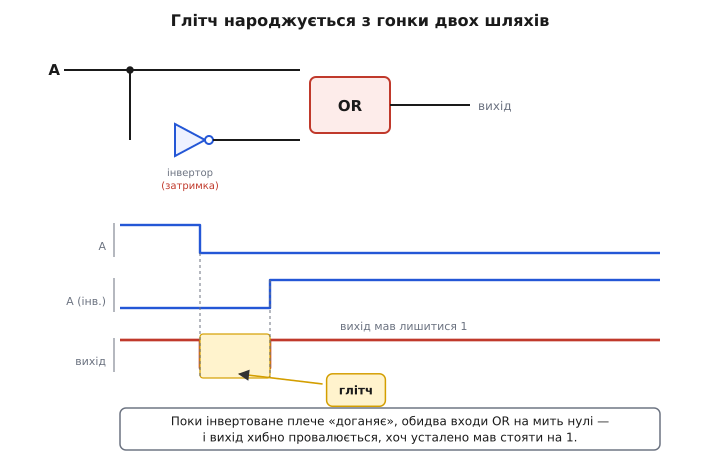
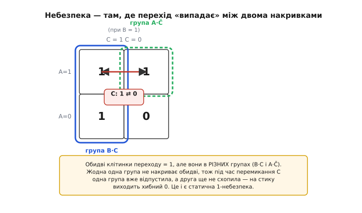
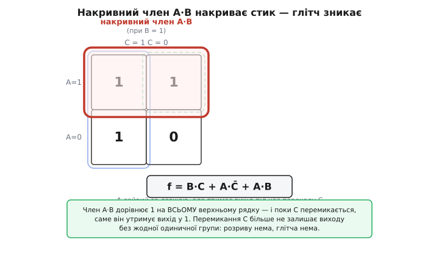
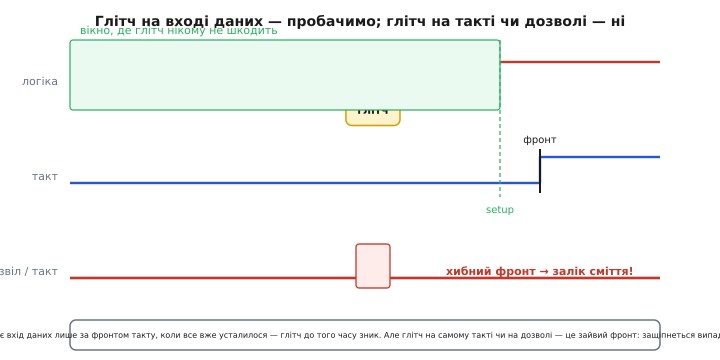

# Глітчі в комбінаційних схемах

<preknowlist>
- [Комбінаційна схема](book:electronics/combinational-circuits) — вихід визначається лише поточними входами, без пам'яті.
- [Булева алгебра](book:math/boolean-algebra) — AND/OR/NOT, таблиця істинності, форма «сума добутків».
- [Карти Карно](book:math/karnaugh-maps) — розкладка таблиці істинності, де сусідні клітинки різняться рівно одним бітом.
- [D-тригер (регістр)](book:electronics/d-flip-flop) — защіпує вхід даних лише за фронтом такту, з вимогою setup.
</preknowlist>

Уявіть просту річ: схема з вентилів обчислює якусь функцію, ви міняєте один вхідний біт — і чекаєте, що вихід плавно перейде від старого значення до нового. На папері так і є. А на осцилографі ви раптом бачите, що між «старим» і «новим» вихід **смикнувся** — на якісь наносекунди вискочив у протилежний рівень, хоча за логікою мав стояти незмінно. Цей короткий хибний імпульс і називають **глітч** (англ. *glitch* — від їдишського «слизький, ковзкий рух»): сплеск, якого в таблиці істинності немає, а в залізі — є.

Звідки він береться, чому таблиця істинності його не показує, коли він небезпечний, а коли ні, і як його прибрати — про це й мова. Ключ до всього один: **таблиця істинності описує лише усталений стан, а сигнали в реальній схемі рухаються не миттєво й не одночасно.**

### Сигнал не телепортується

Перша і головна причина: кожен вентиль має **затримку поширення** — сигнал заходить на вхід і виходить на вихід не миттєво, а через якісь одиниці наносекунд. Якщо ви хочете розібратися з цифрами цих затримок окремо, є тема про [часові параметри вентилів](book:electronics/gate-timing) — там по-чесному, з tpd і фронтами; нам тут досить одного факту: **затримка існує, і вона різна для різних шляхів.**

Тепер уявіть, що один і той самий вхідний сигнал доходить до вихідного вентиля **двома** дорогами — однією напряму, а іншою через зайвий інвертор. Пряма дорога коротша, отже швидша; дорога через інвертор довша, отже на ту саму наносекунду «запізнюється». І ось у момент, коли вхід перемикається, на вихідному вентилі на коротку мить зустрічаються **неузгоджені** значення: пряме плече вже показує новий стан, а кружне ще тримає старий. Логіка на цю частку наносекунди дає не той результат — поки повільніше плече не «дожене».


*Сигнал A роздвоюється: пряме плече йде на OR відразу, кружне — через інвертор із затримкою. Коли A падає 1 → 0, пряме плече вже в нулі, а інвертоване ще не встигло стати одиницею. На цю коротку мить обидва входи OR — нулі, і вихід хибно провалюється, хоч усталено мав стояти на 1. Жовте вікно — і є глітч; його ширина дорівнює різниці затримок двох шляхів.*

Ось чому це принципово непомітно в таблиці істинності. Таблиця питає: «який вихід, коли входи **застигли** ось так?» — і відповідає правильно для кожного **окремого** усталеного рядка. Але вона нічого не каже про **дорогу між** двома рядками — а саме там, у переході, плечі схеми на мить розходяться. [Комбінаційна схема](book:electronics/combinational-circuits) гарантує правильний вихід **в усталенні**; перехідний процес між усталеннями — поза її гарантією.

На практиці це проявляється так: коли на осцилографі ви бачите вузький сплеск на виході суто комбінаційної логіки, не кидайтеся шукати «завади» чи «погану землю». Найімовірніше, це не шум ззовні, а **власний** глітч схеми — різниця затримок двох шляхів до одного вентиля. Лікують його не екрануванням, а **логікою** або **тактуванням**, а це зовсім інші дії, ніж боротьба із зовнішньою завадою.

### Дві сім'ї глітчів: статичні й динамічні

Глітчі зручно поділити за тим, **як мав** поводитися вихід.

**Статичний глітч** — це коли вихід **мав лишитися незмінним** (старе значення = нове значення), а він на мить смикнувся й повернувся. Якщо вихід стояв на 1 і коротко провалився в 0 — це **статична 1-небезпека** (*static-1 hazard*); якщо стояв на 0 і коротко вискочив у 1 — **статична 0-небезпека** (*static-0 hazard*). Слово «небезпека» (*hazard*) тут означає саму **можливість** такого сплеску, закладену в структурі схеми; чи проявиться вона на конкретному екземплярі — залежить від реальних затримок, але можливість є об'єктивна.

**Динамічний глітч** (*dynamic hazard*) — це коли вихід **мав** перемкнутися (0 → 1 або 1 → 0), але замість одного чистого переходу він **смикнувся кілька разів**: наприклад, 0 → 1 → 0 → 1. Так буває, коли сигнал доходить до виходу не двома, а **трьома й більше** шляхами з різними затримками — кожне плече приходить у свій момент, і вихід «дзвенить» сходинками, поки всі не вляжуться.

І окремо стоїть **функційна небезпека** (*function hazard*) — підступніший випадок: він з'являється, коли **одночасно** міняються **кілька** входів. Тут глітч закладений у самій функції, а не лише в схемі: навіть ідеальна реалізація без жодного зайвого вентиля не врятує, бо між «старим» і «новим» набором входів лежить проміжний набір, на якому функція дає інше значення, і схема неминуче через нього «проскакує». Із функційними небезпеками не борються переробкою вентилів — їх обходять так, щоб **критичні входи не мінялися разом** (звідси, до речі, ростуть ноги в кодів Ґрея, де сусідні значення різняться рівно одним бітом).

Найчастіша на практиці — саме **статична 1-небезпека** у схемі типу «сума добутків» (AND-вентилі, зведені через OR). Розберімо її докладно, бо на ній видно і причину, і ліки.

### Де живе небезпека: розрив між накривками

Візьмемо функцію трьох змінних:

```
f = B·C + A·C̄
```

(тут C̄ — «не C»). Це звичайна сума двох добутків: один AND дає B·C, другий — A·C̄, їхні виходи зводяться через OR. Усталено все правильно. Подивімося на небезпечне місце.

Хай A = 1 і B = 1, а C перемикається 1 → 0. Порахуймо усталені значення:

```
C = 1:   f = B·C + A·C̄ = 1·1 + 1·0 = 1
C = 0:   f = B·C + A·C̄ = 1·0 + 1·1 = 1
```

Обидва усталені значення — **1**. Вихід **має лишитися** на одиниці. Але погляньмо, **хто саме** тримає цю одиницю:

```
до переходу (C=1):  одиницю дає член B·C   (бо C=1)
після переходу (C=0): одиницю дає член A·C̄  (бо C̄=1)
```

Одиницю передають **з рук у руки** від одного добутку до іншого. А тепер згадаймо про затримки. Коли C падає, член B·C **відпускає** свою одиницю майже відразу (його AND швидко бачить C=0). А член A·C̄ хапає одиницю **трохи пізніше** — бо C̄ народжується з C через інвертор, а в інвертора своя затримка. На цю коротку мить **обидва** AND видають 0: один уже відпустив, другий ще не схопив. OR від двох нулів дає 0 — і вихід **провалюється**, хоч мав стояти на 1. Ось вона, статична 1-небезпека.

Найнаочніше це видно на [карті Карно](book:math/karnaugh-maps) — сітці, де таблицю істинності розкладають так, що сусідні клітинки різняться рівно одним бітом, а кожен добуток-член накриває прямокутну групу одиниць.


*Карта функції при B=1: рядок — значення A, стовпець — значення C. Член B·C накриває лівий стовпець, член A·C̄ — верхній рядок праворуч. Перехід C: 1 ⇄ 0 у верхньому рядку (A=1) проходить між двома сусідніми одиницями, що належать РІЗНИМ групам. Жодна одна група не накриває обидві клітинки переходу — і саме цей розрив на стику породжує хибний 0.*

Звідси універсальне правило, як небезпеку **побачити**: на карті Карно статична 1-небезпека ховається там, де перехід веде між двома сусідніми одиницями, які **не накриті жодною спільною групою**. Кожна група — це окремий AND-член; якщо дві сусідні одиниці лежать у різних групах і між ними нема спільної накривки, то під час переходу одна група відпускає, друга ще не хапає — і вихід провисає.

### Ліки: дописати зайвий член

Якщо причина — розрив між накривками, то ліки очевидні: **накрити цей стик окремою групою**, яка тримає одиницю **протягом усього переходу**. Подивіться на карту ще раз: обидві клітинки переходу — це верхній рядок, де A = 1 і B = 1. Отже, потрібна група, що накриває весь цей рядок, тобто член **A·B**.

```
f = B·C + A·C̄ + A·B
```

Член A·B за логікою **зайвий**: коли A=1 і B=1, вихід і так уже одиниця через інші члени, тож на таблицю істинності він не впливає — функція лишилася та сама. Але під час переходу C він стає рятівником: A·B не залежить від C **узагалі**, тож поки C метушиться, цей член незворушно тримає на своєму AND одиницю, OR бачить її — і вихід **не провисає**. Розрив зашитий.


*Той самий перехід, але додано член A·B (червона накривка на весь верхній рядок). Він дорівнює 1 на обох клітинках переходу одночасно й не залежить від C, тому під час перемикання C утримує вихід у 1 без жодної паузи. Перехід більше не залишає вихід без накривної групи — статичної 1-небезпеки нема.*

Такий додатковий член називають **накривним** (або *consensus*, від «згоди» двох сусідніх членів). Загальне правило: **щоб прибрати всі статичні 1-небезпеки в сумі добутків, треба, щоб кожна пара сусідніх одиниць на карті була накрита спільною групою** — тобто додати накривні члени для всіх «голих» стиків. Алгебру цього накривного члена і те, чому він прибирає саме статичну небезпеку (і чому, на жаль, **не** прибирає функційну), розписано окремо в [математиці накривного члена](book:electronics/glitch-combinational/math-consensus.md) — там і формальний накривний теорем, і випадок одночасної зміни кількох входів.

Ціна цих ліків — **зайві вентилі**: ви свідомо додаєте логіку, яку «оптимізатор» викинув би як надлишкову. Тому накривні члени дописують **не завжди**, а лише там, де глітч реально шкодить. А коли він шкодить?

### Кому глітч смертельний, а кому байдужий

Тут — найважливіше практичне розрізнення, і воно рятує від зайвої роботи.

Якщо вихід комбінаційної логіки йде на **вхід даних** защіпки чи регістра — глітч **майже завжди байдужий**. Бо [регістр](book:electronics/d-flip-flop) читає свій вхід даних **не весь час**, а лише в момент **фронту такту** — і то за умови, що значення на вході вже постояло стабільно за `setup`-час до фронту. А такт навмисне підбирають так, щоб фронт приходив **після** того, як уся комбінаційна логіка вляглася. На той момент будь-які глітчі давно вщухли: защіпка бачить чистий усталений результат. Саме тому в синхронних схемах [внутрішню комбінаційну логіку](book:electronics/combinational-circuits) глітчить скільки завгодно — і це нікого не турбує: важливе лише усталене значення в момент заліку.

Але є місця, де глітч **смертельний**. Це сигнали, на які схема реагує **самим фронтом**, а не рівнем у момент такту:

- **тактовий сигнал.** Якщо глітч потрапить на лінію такту регістра чи лічильника, схема прийме його за **зайвий фронт** і защіпне сміття або порахує зайвий імпульс. Тому такт **ніколи** не формують «трохи логіки» з можливим глітчем — його ведуть чистим;
- **сигнали дозволу й скидання** (*enable*, *clear*), асинхронні входи. Короткий глітч на асинхронному скиданні скине регістр **посеред** роботи;
- **входи асинхронних защіпок** (рівневих), що прозорі весь час, поки відкриті, — вони **зловлять** глітч, бо в них нема фронту, який чекав би усталення.


*Угорі: вихід логіки глітчить, але фронт такту приходить пізніше, у зеленому вікні все вже усталене — глітч на даних нікому не шкодить. Унизу: той самий глітч, але на лінії дозволу чи такту, читається як хибний фронт — і защіпнеться випадкове значення. Висновок простий: глітч на даних пробачимо, глітч на керуванні фронтом — ні.*

Звідси випливає золоте правило цифрового дизайну, яке економить безсонні ночі: **тримати все синхронним**. Такти, дозволи й скидання не формують комбінаційною логікою з ненульовим ризиком глітча — усі рішення заводять на **вхід даних** регістрів, а керують ними одним чистим тактом. Тоді глітчі лишаються нешкідливою внутрішньою метушнею, і кожну статичну небезпеку ловити накривними членами **взагалі не доводиться**: їх дописують точково, лише там, де сигнал керує фронтом і синхронності досягти не можна.

### Коли все ж доводиться боротися

Отже, повний арсенал проти глітчів — від найдешевшого до найдорожчого:

**Перше — зробити сигнал синхронним.** Завести його на вхід даних регістра й читати тактом після усталення. Найдешевше і найнадійніше: глітч просто перестає когось обходити. Це перший вибір майже завжди.

**Друге — дописати накривні члени.** Коли синхронність недосяжна (сигнал керує фронтом), додають надлишкові AND-члени, щоб накрити кожен стик на карті Карно. Прибирає **статичні** небезпеки за одну зміну входу; коштує зайвих вентилів і **не** рятує від функційних небезпек (одночасна зміна кількох входів).

**Третє — придушити сам сплеск.** Іноді на вихід ставлять елемент, що ігнорує надто короткі імпульси: фільтр-затримку або [тригер Шмітта з гістерезисом](book:electronics/threshold-schmitt), який не реагує на вузькі викиди. Це не прибирає причину, а ховає наслідок — і додає затримки, тож годиться лише там, де затримку можна дозволити.

Логіка вибору проста й завжди та сама. Спершу спитай: **чи цей сигнал керує фронтом?** Якщо ні — забудь про глітч, він безпечний. Якщо так — спершу спробуй зробити сигнал **синхронним**; не вийшло — **накрий стики** на карті Карно; не вистачило (функційна небезпека або одночасні входи) — **придуши** короткий імпульс або перебудуй так, щоб критичні входи не мінялися разом.

Сама ідея, що глітчам можна давати раду наперед — будувати схему, яка **гарантовано** не зморгне на жодному переході, — народилася ще наприкінці 1950-х, коли інженери вперше зіткнулися з тим, що логічно правильна схема дає хибні імпульси в залізі. Про те, хто й коли формально приборкав небезпеки та довів, що схему завжди можна зробити безглітчевою, — у [короткій історії безглітчевих мереж](book:electronics/glitch-combinational/hist-huffman.md).
