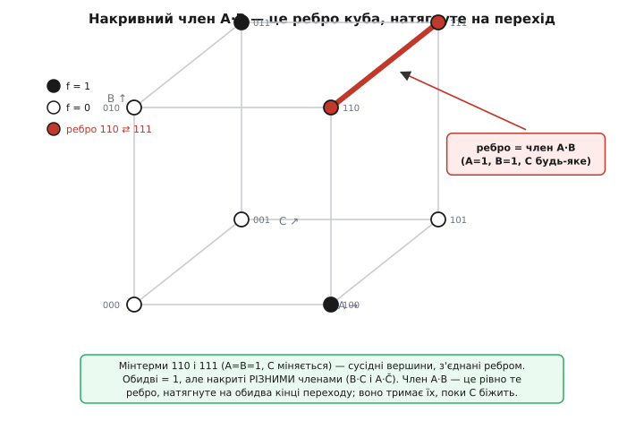
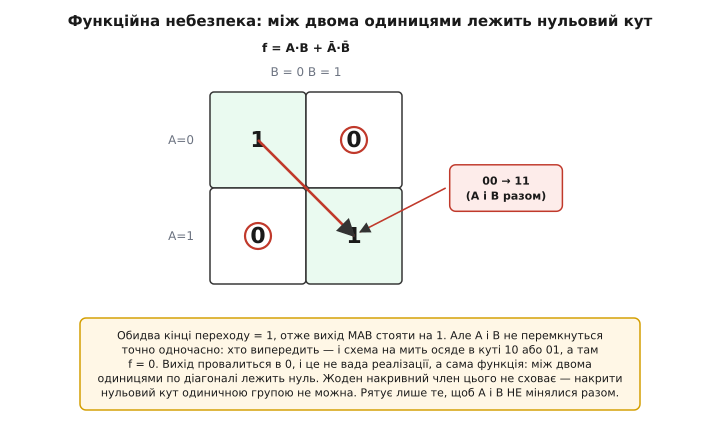

# 🧮 Накривний член: алгебра, що зашиває статичну небезпеку

Стаття-власник показала на пальцях і на карті Карно, звідки береться статична 1-небезпека і чому рятує дописаний член A·B. Тут доведемо це **строго** — від першопричини, засобами самої булевої алгебри. Мета не в тому, щоб перекрасти формулу з підручника, а щоб побачити три речі до кінця:

- **звідки взагалі береться** цей «зайвий» член — він не з голови, його породжує сама пара сусідніх добутків (це й є **накривний теорем**, англ. *consensus theorem*);
- **чому** він прибирає саме статичну небезпеку — і що конкретно доводить його присутність;
- **чому** він безсилий проти **функційної** небезпеки — і де проходить межа, за яку алгебра вже не рятує.

Наприкінці — короткий, але реальний C-приклад, де все це рахується в числах.

## Означення: що таке накривний член

Візьмемо два добутки (кон'юнкції), у яких **рівно одна** змінна входить в один із них прямо, а в інший — із запереченням. Скажімо, `x` і `x̄`. Тоді ця пара має **накривний член** (*consensus term*) — новий добуток, зібраний із **усіх решти** літералів обох членів, крім самої суперечної змінної `x`.

```
члени:          x·P   і   x̄·Q
накривний член:      P·Q          (без x і без x̄)
```

Тут `P` і `Q` — це «все інше», що стояло в тих добутках. Приклад із статті лягає точно сюди. Функція була

```
f = B·C + A·C̄
```

Суперечна змінна — `C` (у першому члені пряма, у другому — заперечена). Отже `P = B` (усе, що при `C` у першому члені), `Q = A` (усе, що при `C̄` у другому). Накривний член — їхній добуток:

```
P·Q = B·A = A·B
```

Ось звідки взявся A·B — не з інтуїції «накриймо верхній рядок», а механічно, з формули накривного члена. Це важливо: накривний член **обчислюють**, а не вгадують.

> 🔧 **Навіщо це.** Практична вага означення в тому, що воно перетворює пошук ліків на механічну процедуру. Не треба щоразу малювати карту Карно й ловити стик очима: для кожної пари добутків, що різняться однією запереченою змінною, ви **обчислюєте** накривний член за формулою P·Q — і саме його дописуєте. Це те, що робить синтезатор логіки всередині: перебирає пари, рахує накривні члени, лишає потрібні. Око — для розуміння; формула — для роботи.

## Накривний теорем: чому член справді «зайвий»

Тепер головне алгебричне твердження. Воно каже, що накривний член **уже міститься** в сумі двох вихідних — тобто дописати його можна, а на функцію це не вплине:

```
x·P + x̄·Q  =  x·P + x̄·Q + P·Q
```

Це і є **накривний теорем** (його ще звуть теоремою надмірності, бо він додає надлишковий член). Доведімо його з аксіом, не на віру. Уся хитрість — в одному ході: `P·Q` розкладемо через `x`, домноживши на `(x + x̄) = 1` (від цього нічого не змінюється, бо множення на одиницю тотожне):

```
P·Q = P·Q·1 = P·Q·(x + x̄) = x·P·Q + x̄·P·Q
```

Тепер підставмо це у праву частину й гляньмо, чи додає воно щось нове:

```
x·P + x̄·Q + P·Q
  = x·P + x̄·Q + x·P·Q + x̄·P·Q          (розклали P·Q)
  = (x·P + x·P·Q) + (x̄·Q + x̄·P·Q)      (перегрупували)
  = x·P·(1 + Q)   + x̄·Q·(1 + P)         (винесли спільне)
  = x·P·1         + x̄·Q·1               (бо 1 + будь-що = 1)
  = x·P + x̄·Q
```

Права частина **згорнулася назад** у ліву. Отже рівність тотожна: `P·Q` нічого не додає до суми, коли ті два члени вже там. Ключовий крок — `1 + Q = 1` (поглинання одиницею): щойно `x·P` уже стоїть, приліплений до нього `x·P·Q` не додає жодного нового набору входів, на якому вихід став би одиницею, — бо `P·Q` при `x=1` є **підмножиною** того, що вже накриває `x·P`. Так само з другого боку. Тому таблиця істинності лишається та сама — а це якраз те, що нам треба: **ліки не міняють функцію.**

> Ця викладка спирається на закони булевої алгебри — поглинання (`a + a·b = a`), тотожність множення на 1, розклад через `x + x̄ = 1`. Якщо якийсь із цих кроків не самоочевидний, він виводиться в темі про [булеву алгебру](book:math/boolean-algebra) з базових аксіом. Тут ми беремо їх як робочий інструмент.

## Інтуїція: чому саме P·Q, а не щось інше

Формулу довели, але звідки в ній така **точна** форма — чому накривний член це `P·Q`, і чому він накриває рівно стик? Гляньмо очима на те, що алгебра щойно зробила.

Член `x·P` тримає одиницю, **поки `x = 1`** (і `P` виконано). Член `x̄·Q` тримає одиницю, **поки `x = 0`** (і `Q` виконано). Між цими двома володіннями лежить кордон — момент, коли `x` перемикається. І от питання: чи є ділянка, де **обидва** члени вже мали б тримати одиницю, тобто де виконано **і `P`, і `Q`** одночасно, незалежно від `x`? Так — це рівно набори, де `P·Q = 1`. На них перший член тримає одиницю доти, доки `x=1`, а другий підхоплює її, щойно `x=0`. Але **між** ними, у саму мить перемикання, кожен покладається на своє значення `x` — і жоден не гарантує неперервності. Накривний член `P·Q` не залежить від `x` **узагалі**; там, де він виконаний, він тримає одиницю **весь час**, зокрема й у ту небезпечну мить.

Ось чому форма саме така. `P·Q` — це перетин умов двох членів **за викидом суперечної змінної**. Він живе рівно там, де два володіння стикаються, і саме він перекриває шов. Алгебра `1 + Q = 1` — це формальний запис того самого: `P·Q` не додає нового краю функції, він **лягає всередину** вже накритого, підпираючи його зсередини.


*Мінтерми функції на кубі трьох змінних. Небезпечний перехід (A=B=1, C міняється) — ребро між вершинами 110 і 111; обидва кінці одиниці, але їх накривають РІЗНІ члени (B·C і A·C̄). Накривний член A·B (при трьох змінних це рівно те ребро {A=1, B=1, C будь-яке}) натягнутий на обидва кінці переходу й тримає їх незалежно від C. Розриву нема.*

## Чому це прибирає саме статичну небезпеку

Тепер зберімо докупи — від алгебри до заліза. Статична 1-небезпека, як показала стаття, — це перехід між двома сусідніми одиницями, які **не накриті спільним членом**: одна група відпускає раніше, ніж друга хапає, бо перемикання їхньої спільної змінної проходить через інвертор із затримкою, і на цю мить жоден член не тримає виходу в 1.

Що робить накривний член у цьому переході? Він накриває **обидва** його кінці й **не залежить** від тієї змінної, що метушиться. Розберімо на нашому прикладі. Перехід — `C: 1 → 0` при `A=B=1`. Простежмо всі три члени в часі:

```
момент         B·C        A·C̄        A·B (накривний)
─────────────────────────────────────────────────────
C=1 (усталено)  1          0           1
C падає, C̄ ще 0 0 ← впав   0 ← ще ні   1 ← НЕ залежить від C
C=0 (усталено)  0          1           1
```

Середній рядок — і є небезпечна мить. Без накривного члена в ньому стоять два нулі (`B·C` уже відпустив, `A·C̄` ще не схопив), і OR від двох нулів дає провал. З накривним членом у цьому рядку стоїть `A·B = 1` — і OR, бачачи хоч одну одиницю, тримає вихід у 1 **без паузи**. Провалу нема.

Формально: наявність накривного члена **гарантує**, що на кожному одноперемінному переході між двома одиницями завжди виконаний **хоча б один** член суми протягом усього переходу. Це і є визначення відсутності статичної 1-небезпеки. Тому правило безглітчевого синтезу коротке й повне:

> Сума добутків **вільна від статичних 1-небезпек тоді й лише тоді**, коли для **кожної** пари сусідніх одиниць на карті існує член, що накриває **обидві**. Аби це забезпечити, дописують **усі** потрібні накривні члени — по одному на кожен «голий» стик.

Зверни увагу на «лише тоді»: це не лише достатня, а й **необхідна** умова. Якщо десь пара сусідніх одиниць лишилася без спільної накривки, статична 1-небезпека там **об'єктивно можлива** — проявиться вона чи ні на конкретному кристалі, залежить від реальних затримок, але структурна діра є. Накривні члени затикають рівно ці діри, і нічого зайвого понад те.

Симетрично працює двоїста картина для **статичної 0-небезпеки** — коли вихід мав стояти в 0, а коротко вискочив у 1. Її ловлять у **добутку сум** (POS-формі) тим самим накривним теоремом, лише в двоїстому вигляді:

```
(x + P)·(x̄ + Q) = (x + P)·(x̄ + Q)·(P + Q)
```

Тут накривний член — це сума `(P + Q)`, і накриває вона стик між двома сусідніми **нулями**. Механіка та сама, дзеркальна: там, де два «нульові» співмножники передають нуль з рук у руки, накривна сума тримає його неперервно. У сумі добутків 0-небезпеки не буває взагалі (структура AND-OR її не породжує) — тому на практиці частіше говорять саме про 1-небезпеки та накривні добутки; але апарат покриває обидві форми однаково.

## Межа: чому накривний член не рятує від функційної небезпеки

А тепер — найважливіше обмеження, те, задля чого й варто розуміти алгебру, а не завчати рецепт. Усе доведене вище трималося на одному тихому припущенні: **міняється рівно одна змінна за раз**. Накривний теорем закриває стик між сусідами, що різняться **одним** бітом. А що коли міняються **два** входи одночасно?

Тут з'являється **функційна небезпека** (*function hazard*), і вона іншої природи. Візьмімо функцію «рівність», `f = A·B + Ā·B̄` (одиниця, коли A і B однакові):

```
         B=0   B=1
A=0       1     0
A=1       0     1
```

Хай входи йдуть `A=0,B=0 → A=1,B=1` (обидва перемикаються). Обидва кінці — одиниці, тож усталено вихід **має стояти на 1**. Але A і B фізично **не перемкнуться точно в один момент**: якийсь із них випередить на частку наносекунди. Якщо A випередить B, схема на мить пройде через набір `A=1,B=0` — а там `f = 0`. Якщо B випередить A — через `A=0,B=1`, і там теж `f = 0`. Хоч би хто виграв гонку, дорога з одного кута в діагонально протилежний **неминуче** веде через кут, де функція нульова, — і вихід провалиться.


*Функція «рівність» A·B + Ā·B̄: діагональні кути одиниці, побічні — нулі. Перехід 00 → 11 міняє обидва входи; залежно від того, хто випередить, схема на мить осідає в куті 10 або 01, а там f = 0. Провал закладений у самій функції: між двома одиницями по діагоналі лежить нуль. Одиничною групою накрити цей нуль не можна.*

Тепер спитаймо: чи допоможе тут накривний член? **Ні — і ось чому строго.** Накривний член завжди **накриває одиниці** (це AND-член, що дає одиницю на своєму наборі). Щоб урятувати цей перехід, треба було б, аби якийсь член тримав вихід у 1 і на проміжному куті `A=1,B=0`. Але там функція **дорівнює нулю** — а член, що дає одиницю там, де функція нуль, **змінив би саму функцію**. Це вже не «зайвий» член: він порушив би таблицю істинності. Накривний теорем додає лише члени, **тотожні наявним** (ми це довели: `1 + Q = 1`); він **не має права** засвітити одиницю там, де її бути не повинно. Тому проти функційної небезпеки він безсилий **за побудовою**, а не через недогляд.

Різниця, яку варто закарбувати:

```
статична (логічна) небезпека — вада РЕАЛІЗАЦІЇ:
    міняється 1 вхід; обидва кінці однакові;
    зайвий проміжок через різні затримки шляхів;
    → лікується накривним членом (він тотожний, функцію не чіпає).

функційна небезпека — властивість САМОЇ ФУНКЦІЇ:
    міняються ≥2 входи; між кінцями лежить кут іншого значення;
    → накривний член безсилий (накрити «чужий» кут = змінити функцію);
    → рятує лише те, щоб критичні входи НЕ мінялися одночасно.
```

Звідси й обхід функційної небезпеки — не в схемі, а в **порядку зміни входів**: зробити так, щоб між сусідніми робочими станами мінявся **рівно один** біт. Саме на цьому стоїть [код Грея](book:electronics/gray-code), де будь-які два сусідні значення різняться одним розрядом: якщо входи перебирають стани в коді Грея, одночасних змін двох бітів **не виникає взагалі**, а отже й функційній небезпеці нема звідки взятися. Накривні члени тим часом добивають статичні небезпеки, що лишилися на одноперемінних переходах. Два різні інструменти під дві різні хвороби — і тепер видно, чому їх не можна переплутати.

## Worked-приклад: рахуємо небезпеку в коді

Покажемо, що все це — не абстракція, а обчислюване. Ось коротка прошивкова процедура, що для функції двох добутків `f = B·C + A·C̄` перевіряє, чи є на переході `C: 1→0` (при заданих A, B) статична 1-небезпека, і чи закриває її накривний член A·B. Ідея проста: змоделювати три моменти — до, «в шві» (коли `C` уже впав, а `C̄` ще не піднявся) і після — і подивитися на вихід OR **без** накривного члена й **із** ним.

**Умова: A=1, B=1, вхід C падає 1 → 0. Перевіряємо вихід у шві.**

```c
#include <stdio.h>
#include <stdbool.h>

// Один добуток-член; C та notC подаємо ОКРЕМО, щоб змоделювати
// момент, коли C вже впав (0), а notC ще не піднявся (0) — це і є "шов".
static inline bool f_plain(bool A, bool B, bool C, bool notC) {
    bool p1 = B && C;        // член B·C
    bool p2 = A && notC;     // член A·C̄
    return p1 || p2;         // OR без накривного члена
}

static inline bool f_fixed(bool A, bool B, bool C, bool notC) {
    bool p1 = B && C;        // B·C
    bool p2 = A && notC;     // A·C̄
    bool pc = A && B;        // накривний член A·B — НЕ залежить від C
    return p1 || p2 || pc;   // OR із накривним членом
}

int main(void) {
    bool A = true, B = true;

    // Три моменти переходу C: 1 -> 0. У "шві" C=0, а notC ще=0 (інвертор не встиг).
    struct { const char *when; bool C, notC; } t[] = {
        { "до    (C=1)", true,  false },  // усталено: C=1, notC=0
        { "шов   (C впав, C̄ ще ні)", false, false },  // небезпечна мить
        { "після (C=0)", false, true  },  // усталено: C=0, notC=1
    };

    for (int i = 0; i < 3; i++) {
        bool plain = f_plain(A, B, t[i].C, t[i].notC);
        bool fixed = f_fixed(A, B, t[i].C, t[i].notC);
        printf("%-28s  без члена=%d   з членом=%d\n",
               t[i].when, plain, fixed);
    }
    return 0;
}
```

Прогнавши це подумки, дістаємо:

```
до    (C=1)                   без члена=1   з членом=1
шов   (C впав, C̄ ще ні)       без члена=0   з членом=1   ← ось вона, різниця
після (C=0)                   без члена=1   з членом=1
```

Рядок «шов» — це і є глітч у числах. Без накривного члена вихід у цю мить **провалюється в 0** (обидва добутки нулі), хоч усталені сусіди — одиниці. Із накривним членом `A·B` вихід тримається на 1 наскрізь: перехід більше не залишає OR без жодної одиниці на вході. Затримку інвертора ми змоделювали найчесніше, як вона й трапляється: подавши `C` і `C̄` окремими сигналами й піймавши мить, коли вони **обидва** нулі. Саме цю мить таблиця істинності не бачить — а код, що розрізняє `C` і `notC`, бачить.

І одразу — межа з попереднього розділу в тому самому коді: якби ми дозволили мінятися **двом** входам разом (скажімо, A і C одночасно), жодне додавання членів у `f_fixed` не прибрало б провалу на функції, де між кінцями лежить нульовий кут. Бо там ми боролися б уже не з різницею затримок, а з формою самої функції — а її накривний член міняти не має права.

## Підсумок

Накривний член — не рецепт, а **наслідок алгебри**. Для пари добутків `x·P` і `x̄·Q`, що різняться однією запереченою змінною, він дорівнює `P·Q` — добутку решти літералів без суперечної змінної. **Накривний теорем** доводить, що цей член **тотожний** сумі двох вихідних (`x·P + x̄·Q = x·P + x̄·Q + P·Q`), тож дописати його можна, не змінивши функції, — доведення тримається на розкладі `P·Q = P·Q·(x + x̄)` і поглинанні `1 + Q = 1`. Дописаний, він **не залежить** від суперечної змінної й тому тримає вихід в 1 протягом усього одноперемінного переходу між двома сусідніми одиницями — цим і прибирається **статична** 1-небезпека (двоїсто, у добутку сум, накривна сума `P + Q` прибирає 0-небезпеку). Умова безглітчевості точна й повна: кожна пара сусідніх одиниць мусить бути накрита спільним членом. Але накривний член завжди **накриває одиниці**, тож проти **функційної** небезпеки — коли міняються ≥2 входи й між кінцями лежить кут іншого значення — він безсилий **за побудовою**: накрити «чужий» кут одиничною групою означало б змінити саму функцію. Функційну небезпеку обходять не схемою, а порядком змін входів (код Грея, де сусіди різняться одним бітом). Дві різні хвороби — два різні інструменти, і алгебра чітко каже, де проходить межа між ними.
