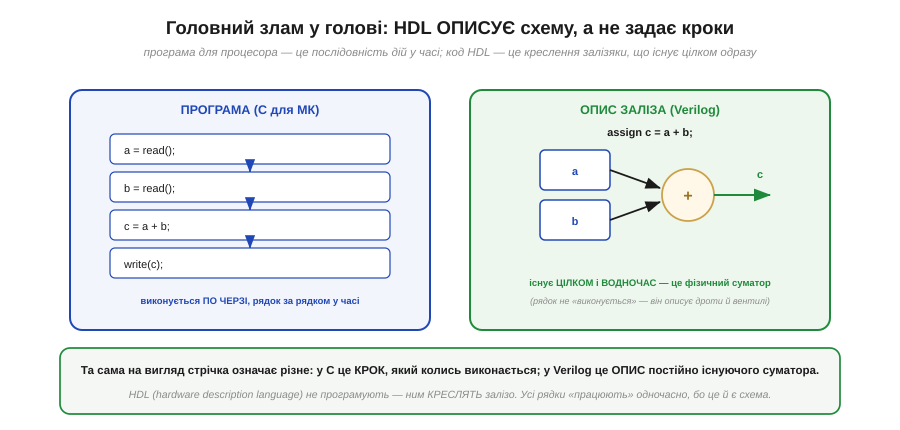
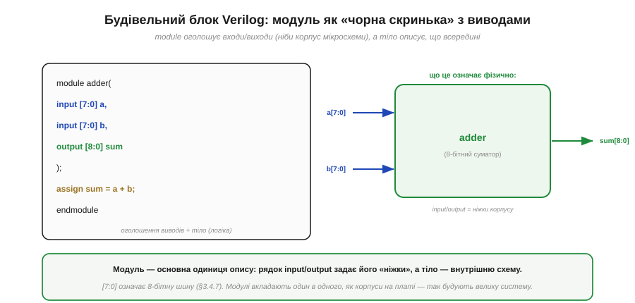
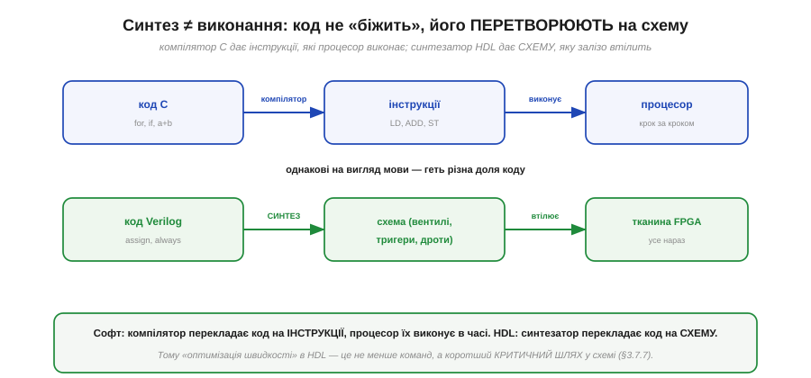
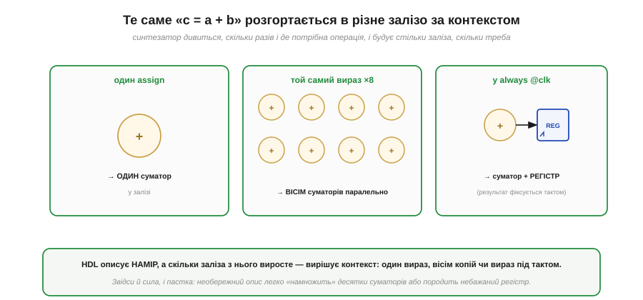

# HDL: описуємо залізо, а не пишемо програму

[Усередині FPGA](book:electronics/inside-fpga) — тканина з тисяч клітинок логіки, але лишається найголовніше для практики: **як** людина задає потрібну схему? Не ж розставляти мільйони бітів конфігурації вручну. Відповідь — окремий клас мов, **HDL** (*hardware description language*, мова опису апаратури), і найпоширеніша з них — **Verilog**. Але перш ніж писати бодай рядок, треба пережити один злам у голові, без якого HDL збиває з пантелику кожного, хто прийшов із звичайного програмування. Цей злам — у самому слові **опис**. Розберімося, чому це не програмування, хоч на вигляд буває схоже.

### Головний злам: опис, а не послідовність кроків

Звичайна програма (як на C для мікроконтролера) — це **послідовність дій у часі**: спершу це, потім те, крок за кроком [виконує процесор](book:programming/fetch-decode-execute). Код на HDL — це геть інше: це **креслення залізяки**, що існує цілком і **водночас**, як існує намальована на схемі мікросхема.

*Рис. У програмі на C рядки виконуються **по черзі**: спершу одне читання, потім друге, потім додавання — кроки в часі. У Verilog рядок `assign c = a + b;` не «виконується» — він **описує** постійно існуючий апаратний суматор, що завжди тримає на виході суму своїх входів. Усі рядки HDL «працюють» одночасно, бо це й є схема.*

Цей злам вартий того, щоб затриматись. Однакова на вигляд стрічка означає в двох світах протилежне. У C `c = a + b` — це **наказ**: «у цю мить візьми a і b, склади, поклади в c»; він станеться один раз, коли до нього дійде черга. У Verilog `assign c = a + b` — це **констатація факту про залізо**: «існує суматор, чий вихід c назавжди дорівнює a + b»; він не «трапляється», він просто **є**, постійно. Тому в HDL немає «порядку виконання рядків»: усе описане існує паралельно, бо паралельно існують і дроти на платі. Звикнути до цього — половина опанування HDL; друга половина — навчитися думати, **яку схему** малює кожна конструкція. Почнімо з найбільшої одиниці опису.

### Модуль: чорна скринька з виводами

Будівельний блок Verilog — **модуль** (*module*). Це опис шматка схеми як «чорної скриньки» з названими **входами** й **виходами**, дуже схожої на корпус мікросхеми з ніжками.

*Рис. `module adder` оголошує **виводи**: входи `a`, `b` і вихід `sum` (запис `[7:0]` означає [8-бітну шину](book:programming/bits-bytes-endianness)). Тіло (`assign sum = a + b;`) описує, що всередині. Фізично це 8-бітний суматор, чиї `input`/`output` — ніби ніжки корпусу. Модулі вкладають один в одного, як корпуси на платі, будуючи велику систему.*

Аналогія з мікросхемою тут глибша, ніж здається, і дуже допомагає. **Оголошення виводів** (`input`/`output`) — це як розпіновка корпусу: воно каже, якими сигналами модуль обмінюється зі світом, і нічого не каже про нутрощі. **Тіло** модуля — це сама схема всередині. А запис `[7:0]` — це не один провід, а **шина** з восьми, що разом [несуть ціле число](book:programming/bits-bytes-endianness). Найважливіше ж — **вкладеність**: великий проєкт будують не одним велетенським модулем, а ієрархією — дрібні модулі (суматор, лічильник, інтерфейс) збирають у більші, як мікросхеми на платі сполучають у пристрій. Усередині ж тіла модуля опис буває двох дуже різних родів, і плутати їх не можна.

### Два роди опису: комбінаційний і реєстровий

Уся цифрова логіка ділиться на дві половини: [комбінаційну логіку без пам'яті](book:electronics/basic-gates) і [послідовнісну логіку з тригерами](book:electronics/d-flip-flop). У Verilog цей поділ проступає прямо в синтаксисі: є опис **комбінаційний** (миттєвий) і **реєстровий** (по такту).

*Рис. `assign y = a & b;` описує **комбінаційну** логіку: вихід залежить лише від входів і міняється миттєво за ними — це [вентиль AND](book:electronics/basic-gates), без пам'яті й такту. `always @(posedge clk) q <= d;` описує **реєстровий** елемент: значення оновлюється тільки [на фронті такту](book:electronics/edge-vs-level) — це [тригер](book:electronics/d-flip-flop), що має пам'ять стану.*

Розрізняти ці два роди — критично, бо вони породжують **фізично різне залізо**. `assign` (і логіка всередині блоку, що реагує на будь-яку зміну входів) дає **мережу вентилів**: вона відгукується на входи негайно, не чекаючи такту, і нічого не пам'ятає. `always @(posedge clk)` — конструкція, що спрацьовує **[на фронті такту](book:electronics/edge-vs-level)**, — дає **тригери**: значення фіксуються по фронту й тримаються до наступного, тобто з'являється пам'ять стану. Це не косметичні «стилі коду», а вибір між [логікою без пам'яті](book:electronics/basic-gates) і [логікою зі станом](book:electronics/state-memory): написане під такт стане регістром і займе тригери клітинок, написане без такту — комбінаційною логікою на LUT. Звідси й типова пастка новачка: забув про такт там, де потрібен стан, — отримав миттєву логіку без пам'яті; або, навпаки, ненавмисно описав регістр і здивувався зайвій затримці на такт. А все тому, що **код не виконується — він синтезується**.

### Синтез ≠ виконання

Варто назвати прямо найважливіше: код на HDL **не «біжить»**. Його не виконує жоден процесор. Спеціальний інструмент — **синтезатор** — **перетворює** опис на схему, яку потім втілить тканина FPGA. Це настільки інакше, ніж компіляція й виконання програми, що варто поставити їх поряд.

*Рис. Софт: компілятор перекладає код C на **інструкції** (LD, ADD, ST), які процесор **виконує** крок за кроком у часі. HDL: **синтезатор** перекладає код Verilog на **схему** (вентилі, тригери, дроти), яку тканина FPGA **втілює** — і вона працює вся нараз. Однакові на вигляд мови — геть різна доля коду.*

Це порівняння переставляє на місце багато інтуїцій, винесених із програмування. Найважливіша — про **оптимізацію**. У софті «зробити швидше» зазвичай означає «виконати менше інструкцій». У HDL інструкцій немає взагалі; «зробити швидше» означає **вкоротити [критичний шлях](book:electronics/fpga-timing)** у схемі — найдовший ланцюжок логіки між двома тригерами. Так само переосмислюються «цикли» й «змінні»: цикл у HDL частіше означає не повторення в часі, а **розмноження заліза** (стільки однакових блоків, скільки витків), а змінна — не комірку пам'яті, а **дріт** або **регістр**. Думати треба не «що робить машина крок за кроком», а «яку схему я описую». І ця зміна оптики має один особливо повчальний наслідок.

### Той самий вираз — різне залізо

Оскільки HDL описує **намір**, а не кроки, кількість заліза, що з нього виросте, залежить від **контексту**. Той самий вираз «c = a + b» розгортається в дуже різну схему залежно від того, як і де його вжито.

*Рис. Один `assign c = a + b;` дає **один** суматор. Той самий вираз, повторений для восьми пар даних, дає **вісім** суматорів, що працюють паралельно. А вираз усередині `always @(posedge clk)` дає суматор **плюс регістр**, де результат фіксується тактом. Опис однаковий — залізо різне, бо різний контекст.*

Тут і сила HDL, і його головна пастка, дві сторони однієї медалі. **Сила**: щоб подвоїти продуктивність, інколи досить описати дві копії блоку — і синтезатор побудує вдвічі більше заліза, що працюватиме вдвічі паралельніше — [рівно та масштабованість](book:electronics/programmable-logic), задля якої FPGA й беруть. **Пастка**: необережний опис так само легко **намножить** десятки суматорів там, де ви уявляли один, або породить небажаний регістр, що зсуне таймінг. Тому досвідчений розробник HDL завжди тримає в голові питання «**скільки** заліза я зараз описую і **яке**» — бо пише він не програму, а креслення, і кожен рядок чогось коштує в кремнії.

> 🔧 **Навіщо це.** Цей зсув свідомості — найважливіше, що варто винести перед першим проєктом на FPGA, бо без нього код «компілюється», а схема поводиться загадково. Запам'ятайте три речі. Перше: **усе паралельно** — рядки HDL не виконуються по черзі, вони описують одночасно існуюче залізо. Друге: **під такт — [регістр](book:electronics/state-memory), без такту — [комбінаційна логіка](book:electronics/basic-gates)**; саме це визначає, чи буде у вашій схемі пам'ять, тож стежте, що пишете в `always @(posedge clk)`. Третє: **думайте про кількість заліза** — цикл часто означає розмноження блоків, а не повторення в часі. Хто опанував цей погляд, перестає «програмувати FPGA» й починає **проєктувати схему** — а саме цього вона й вимагає.

> ⚙️ **Загляньте у вставку:** [Перші проєкти на Verilog: мигалка й UART-передавач](proj-verilog-first-projects.md) — від найпростішого модуля до тестбенча, на якому опис перевіряють ще до заливання в чип.
