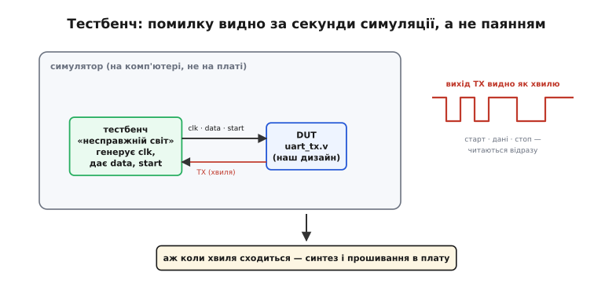

# ⚙️ Перші проєкти на Verilog: мигалка й UART-передавач (від модуля до тестбенча)

> Алгоритмічна вставка до [мови опису апаратури (HDL)](book:electronics/hdl). Головна й найнезвичніша думка Verilog у тому, що його рядки — це **не команди**, що виконуються одна за одною, а **опис схеми**, яку синтез збере в кремнії. Думка ясна на словах, та по-справжньому вона лягає в голову лише тоді, коли її **зробиш руками**. Тож зберемо два канонічні «перші проєкти» — мигалку й передавач UART — і доведемо кожен до **тестбенча**, бо саме на ньому видно, що твій опис справді означає те, що ти думав.

## Задача

Маємо одну спільну мету на два проєкти: пройти повний шлях від **тексту модуля** до **доказу, що він працює** — не торкаючись плати. Перший проєкт навмисне крихітний: **мигалка** (англ. *blinky*) — світлодіод, що блимає від тактового генератора плати. Це «Hello, world» програмованої логіки, і його роль — показати найперше: один і той самий опис є **і текстом для людини, і схемою для кремнію**. Другий проєкт уже інженерний — **передавач UART** (англ. *universal asynchronous receiver-transmitter*, універсальний асинхронний приймач-передавач): узяти байт і виштовхнути його по одному дроту як послідовність бітів зі старт- і стоп-бітом. Питання вставки вузьке: яким **кодом на Verilog** це описати, щоб опис був синтезовний, передбачуваний у часі й перевірюваний у симуляторі.

## Ідея

Почнемо з мигалки, бо вона тримає всю суть на одному екрані. Беремо тактовий сигнал плати, заводимо широкий **лічильник**, і виводимо на світлодіод лише його **старший біт**. Лічильник тікає щотакту, тож старший біт перемикається у багато разів повільніше — рівно те «ділення такту», яке роблять [двійкові лічильники](book:electronics/counters) на тригерах. Уся принада в тому, що ці кілька рядків — не «програма блимання», а **опис заліза**: реєстр-лічильник, суматор «+1» у петлі та тригер виходу.


*Ліворуч — кілька рядків `blink.v`, які читає людина. Праворуч — те, у що їх перекладе синтез і що виконує кремній: 24-бітний [лічильник](book:electronics/counters) `cnt` (банк тригерів), суматор «+1» у петлі зворотного зв'язку та окремий тригер світлодіода, у який защіпується `cnt[23]`. Одне й те саме `cnt <= cnt + 1` — це не «крок програми», а постійно існуючий дріт від суматора назад у реєстр. Старший біт перемикається у 2²⁴ разів повільніше за такт — і око бачить блимання.*

Ключове, що варто помітити вже тут: блок `always @(posedge clk)` не «викликається». Він **описує**, що защіпується в тригери по фронту такту — і так буде щотакту, вічно, паралельно з усім іншим. Це і є вся різниця між «писати програму» й «описувати залізо».

Передавач UART додає рівно один новий клопіт — **час**, — і тут спрацьовує найприємніше: жодного нового **заліза** винаходити не треба. Кадр UART — це старт-біт (0), вісім бітів даних і стоп-біт (1), що йдуть один за одним по єдиному дроту. Розкладемо задачу на три блоки, кожен з яких уже знайомий тригерами.


*Передавач — це три знайомі блоки в одному модулі. Дільник бода ([лічильник](book:electronics/counters) ÷N) з частоти такту виробляє рівно один імпульс на бітовий інтервал — задає швидкість. [Автомат](book:electronics/finite-state-machines) рахує фази кадру: IDLE → START → вісім бітів DATA → STOP, і на кожному кроці вирішує, коли реєстр вантажити, а коли зсувати. [Зсувний реєстр](book:electronics/register) тримає кадр і по одному біту виштовхує його в лінію TX. Унизу — той самий кадр у часі: спокій=1, провал старту, вісім даних [молодшим бітом уперед](book:programming/bits-bytes-endianness), стоп=1.*

Уся «програма» тут — це опис того, **як ці три блоки з'єднані** і що кожен робить на свій такт. Дільник каже «пора зробити крок», автомат каже «зараз вантажимо / зараз зсуваємо», реєстр віддає черговий біт. Послідовність бітів на дроті виникає не тому, що рядки коду виконуються підряд, а тому, що **залізо так з'єднане**.

## Ядро передавача на Verilog

Структуру UART-передавача зручно тримати в голові як автомат, керований тиком дільника. Ось те саме ядро вже справжнім, синтезовним Verilog — рівно ті три блоки (дільник, лічильник фаз, зсувний реєстр), зведені в один модуль:

```verilog
module uart_tx #(
    parameter integer DIV = 1250   // тактів на біт: 12 МГц / 9600 бод = 1250
)(
    input        clk,      // тактовий генератор плати
    input        start,    // імпульс "відправ байт" (на один такт)
    input  [7:0] data,     // байт, який передаємо
    output       tx,       // лінія передачі, у спокої = 1
    output       busy      // 1, поки кадр іще йде
);
    reg [12:0] div     = 0;        // дільник бода: рахує такти в межах одного біта
    reg [9:0]  shreg   = 10'h3FF;  // зсувний реєстр кадру (у спокої — усі одиниці)
    reg [3:0]  bitcnt  = 0;        // скільки бітів кадру ще лишилось виштовхнути
    reg        sending = 0;        // 1 = передаємо, 0 = спокій

    wire tick = (div == DIV-1);    // рівно один імпульс на бітовий інтервал

    always @(posedge clk) begin
        if (!sending) begin                    // спокій: чекаємо на start
            div <= 0;
            if (start) begin
                shreg   <= {1'b1, data, 1'b0}; // стоп(1) + 8 даних + старт(0)
                bitcnt  <= 10;                 // усього 10 бітів у кадрі
                sending <= 1;
            end
        end else begin                         // передача кадру
            div <= tick ? 0 : div + 1;
            if (tick) begin                    // лише на межі біта!
                shreg  <= {1'b1, shreg[9:1]};  // зсув праворуч, зверху вливаємо 1
                bitcnt <= bitcnt - 1;
                if (bitcnt == 1)               // останній біт щойно виданий —
                    sending <= 0;              // ...повертаємось у спокій
            end
        end
    end

    assign tx   = shreg[0];   // молодший біт кадру — постійно в лінії
    assign busy = sending;
endmodule
```

Дві деталі вирішують усе. По-перше, реєстр **завантажується одразу всім кадром** — старт-біт стає молодшим, стоп-біт найстаршим, — а далі ми лише **зсуваємо** й читаємо `shreg[0]`. По-друге, зсув і видача нового біта відбуваються **тільки коли `tick`**, тобто на межі бітового інтервалу; між тиками лінія тримає поточний біт. Саме дільник, а не швидкість такту, задає бод.

## Складність і пастки на МК

За «вартістю» обидва проєкти — копійки заліза: мигалка — це лічильник і тригер, передавач — лічильник-дільник, маленький автомат і 10-бітний зсувний реєстр. Складність тут не в розмірі, а в тому, щоб опис **означав саме те, що ти думав**, — і пастки тут специфічні для HDL, не схожі на помилки звичайних програм.

- **Це опис, а не послідовність — звідси головна пастка.** Спокуса написати UART «програмою» — поставити біти в лінію один підряд у тілі блоку. Але всі присвоєння в `always @(posedge clk)` стаються **одночасно** по фронту такту; «підряд» не існує. Передачу в часі **мусить** розгортати автомат + дільник, інакше синтез або відмовить, або збере не те.
- **Комбінаційна петля — коли забув тригер.** Якщо описати зворотний зв'язок (як «+1» мигалки) **без** защіпки в тригер по `posedge clk`, виходить логічна петля, що живить сама себе без тактового кроку. Реальне залізо на таке відповідає брязкотом і непередбачуваністю. Рецепт простий: стан **завжди** живе в [тригері](book:electronics/d-flip-flop), оновлюється по фронту такту.
- **Усе синхронне до одного такту.** Зсувати реєстр треба строго по `tick` від дільника, а не «коли захочеться». Біти, виставлені поза межею інтервалу, або зливаються, або дублюються — і приймач на іншому кінці бачить сміття. Один такт — джерело часу для всього модуля.
- **[Порядок бітів](book:programming/bits-bytes-endianness) вирішує все.** UART шле дані **молодшим бітом уперед**, тому в лінію йде `shreg[0]`, а кадр вантажиться так, щоб старт опинився молодшим. Переплутаєш порядок завантаження чи напрям зсуву — байт приймач прочитає «дзеркально». Це той самий клопіт із порядком, що й при серіалізації чисел.

Останнє — і найважливіше — **як упевнитися, що все це правда, ще до плати**. Тут і потрібен **тестбенч** (англ. *testbench*, «випробувальний стенд»): окремий модуль, що сам подає на твій дизайн такт і входи й дивиться на виходи — у симуляторі, без жодного заліза.


*У симуляторі (на комп'ютері, не на платі) тестбенч грає роль «несправжнього світу»: сам генерує такт `clk`, виставляє `data` і `start` і подає їх у DUT (англ. *device under test*, пристрій під випробуванням) — наш `uart_tx.v`. Вихід TX видно як хвилю: одразу читається, чи правильні старт-біт, порядок даних і стоп-біт. Аж коли хвиля сходиться з очікуваною — дизайн синтезують і прошивають у плату, де TX уже йде в реальний термінал. Помилку видно за секунди симуляції, а не паянням і осцилографом.*

Ось цей стенд для нашого `uart_tx` — кілька рядків, які й синтезувати не можна, зате в симуляторі роблять усю роботу:

```verilog
`timescale 1ns/1ps
module uart_tx_tb;
    reg        clk   = 0;
    reg        start = 0;
    reg  [7:0] data  = 8'h41;  // байт 'A' (0x41) — щоб було що впізнати на хвилі
    wire       tx, busy;

    // DUT з навмисне малим дільником, щоб симуляція бігла швидко
    uart_tx #(.DIV(4)) dut (
        .clk(clk), .start(start), .data(data),
        .tx(tx), .busy(busy)
    );

    always #5 clk = ~clk;      // такт: період 10 нс

    initial begin
        $dumpfile("uart_tx.vcd");  // куди писати хвилі для перегляду
        $dumpvars(0, uart_tx_tb);
        @(negedge clk);
        start = 1; @(negedge clk); start = 0;  // імпульс "відправ" на один такт
        @(negedge busy);           // ждемо, доки кадр добіжить до кінця
        #50 $finish;
    end
endmodule
```

Читається він як сценарій: `#`-затримки гойдають такт, один імпульс смикає `start`, а по спаду `busy` стенд знає, що кадр вийшов увесь; `$dumpvars` тим часом пише хвилю TX у файл, де старт-біт, вісім даних і стоп видно на око. Тестбенч — це **не залізо** й тому не має обмежень синтезу: у ньому вільно писати затримки `#`, цикли, друк — усе, що зручно для перевірки. Звідси й мораль обох проєктів: на Verilog ти **двічі** описуєш світ — сам дизайн (те, що стане схемою) і його оточення (те, що лишиться в симуляторі), — і саме друге дає змогу зловити помилку в першому, поки вона ще нічого не коштує. Мигалка вчить бачити в коді **схему**; UART-передавач вчить **складати** з відомих блоків нову й **доводити** її правильність хвилями. Це і є робочий цикл усієї подальшої роботи з FPGA — а що далі відбувається з перевіреним описом, показує [маршрут синтезу для FPGA](root:embedded/fpga-flow).
