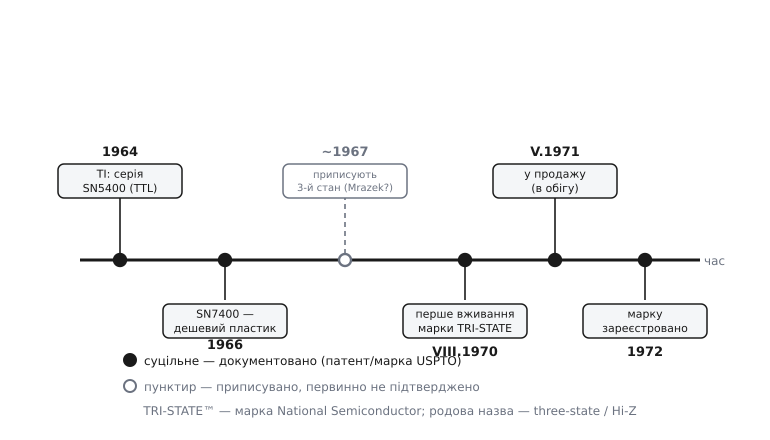

# 📜 Чому «третій стан» звуть по-різному: історія назви TRI-STATE

Тут дивна річ із назвами. Те саме явище — коли ніжка відпускає дріт і нічого йому не нав'язує — інженери називають щонайменше чотирма способами: **третій стан**, **тристановий** (three-state), **високий опір** (Hi-Z) і просто буквою **Z**. Мов би не могли домовитися. А ще є п'ята назва, найгучніша й наймодніша — **TRI-STATE**, — яку в підручниках і на схемах пишуть завзятіше за всі інші, часто великими літерами й із дужкою ®. Здавалося б, ось він, справжній термін; решта — недомовки.

Насправді все навпаки. TRI-STATE — не термін, а **чужа власність**: зареєстрована торгова марка однієї фірми. І саме тому решта світу мусила вигадувати собі власні, «нічийні» слова — three-state, Hi-Z, Z. Ця історія добре показує, як народжуються терміни: не завжди від науки, іноді від відділу маркетингу, а тоді решта галузі обходить чужу назву, і в підсумку в одного поняття виявляється ціла жменя імен. Розплутаймо її від початку — від того, чому третій стан узагалі знадобився.

## Що бентежило: дроту стало тісно

Наприкінці 1960-х цифрова техніка різко подорослішала. З'явилися логічні мікросхеми серії **7400** — маленькі корпуси, у кожному по кілька вентилів на транзисторах, дешеві настільки, що з них почали складати цілі комп'ютери. Texas Instruments вивела **SN5400** (військова керамічна версія) у 1964-му, а в 1966-му — дешеву пластикову **SN7400**, і та миттю захопила більшу частину ринку логіки. Раптом інженер міг за копійки купити сотні вентилів і з'єднувати їх як заманеться.

І тут вилізла проблема, якої на кількох вентилях не помічаєш, а на цілому комп'ютері вона стає стіною. Комп'ютер — це процесор, пам'ять і десяток пристроїв, і всі вони мусять **обмінюватися числами**. Найпростіше — прокласти між кожною парою окремий жмут дротів. Але пар — квадратично багато: десять пристроїв дали б десятки жмутів по вісім дротів, суцільне павутиння, яке нікуди не вміщається й нічого не коштує з'єднати. Природне бажання — **один спільний жмут** на всіх, [шину](topic:programming/bus-arbitration), до якої причеплені геть усі, і хай передають нею по черзі.

І ось об цю ідею спільного дроту звичайний [активний вихід](topic:electronics/push-pull-output) розбивається вщент. Активний вихід тим і хороший, що **силою тримає** рівень: щоб дати одиницю, він транзистором з'єднує дріт із живленням; щоб нуль — із землею. Він міцний, чіткий, стійкий до завад — але саме тому не вміє **промовчати**. Причепи до одного дроту два такі виходи, і щойно один захоче одиницю, а інший нуль, — між живленням і землею відкриється наскрізний шлях крізь два транзистори. Це [конфлікт на шині](topic:electronics/hi-z-state): величезний струм, напруга застрягла в забороненій зоні, кристали гріються.

> 🔧 **Навіщо це.** Уся сучасна архітектура — процесор, ОЗП, флеш, периферія на спільних дротах даних — тримається на тому, що халепу спільного дроту колись розв'язали. Без третього стану кожен обмін числами вимагав би окремих ліній «точка-точка», і плата перетворилася б на непрохідне павутиння. Розуміючи, *чому* знадобився Hi-Z, ви розумієте, чому взагалі можлива дешева шина — а на ній стоїть майже вся цифрова техніка.

Виходів було, по суті, два. Перший уже існував і звався [відкритий колектор](topic:electronics/wired-or) (згодом на польових транзисторах — відкритий стік): такий вихід уміє тільки **тягнути вниз** або відпускати, а вгору лінію повертає спільний [підтяжний резистор](topic:electronics/floating-pullups). Двоє «нулів» на такому дроті не сваряться — конфлікт неможливий за будовою. Але за це платять швидкістю: угору лінію тягне не транзистор, а кволий резистор, і на кожному переході в одиницю доводиться чекати, поки він повільно дозарядить [ємність дроту](topic:electronics/active-pullup/math-rc-vs-ramp.md). Для повільних сигналів (переривання, готовність) — годиться; для швидкої **паралельної шини даних**, де за такт летить цілий байт, — надто мляво.

Отже, потрібен був вихід, який **зберігає активну силу** звичайного 7400 (тягне і вгору, і вниз, швидко й чітко) — але вміє на команду **зникнути з лінії зовсім**, прибрати обидва зусилля, поки говорить хтось інший. Ось цей третій режим — «активно тримаю» плюс «мене тут немає» — і став третім станом.

## Хто: народження третього стану в National Semiconductor

Технічна ідея, коли її нарешті побачиш, майже прикро проста. Усередині активного виходу — пара транзисторів: верхній з'єднує ніжку з живленням, нижній із землею. В одиниці відкритий верхній, у нулі — нижній; **завжди рівно один**. Уся хитрість третього стану: додати логіку, яка на окрему команду **закриє обидва**. Тоді ніжка не з'єднана ні з живленням, ні з землею — повисає з дуже великим опором до обох, [майже обривом](topic:electronics/hi-z-state), і на напругу дроту вплинути не може. Сила збережена (коли треба — тягне вгору й униз), але з'явилося вміння відступити.

Народження цього прийому історія пов'язує з фірмою **National Semiconductor** — молодою на той час компанією з Кремнієвої долини, яка робила собі ім'я саме на логіці серії 7400 як другий постачальник і на власних покращеннях до неї. Приписують авторство конкретному інженерові — **Дейлові Мразеку** (Dale Mrazek), і датують приблизно **1967 роком**.

Отут треба зупинитися й чесно позначити, **наскільки ми це знаємо**. Твердження «Mrazek, 1967» кочує довідниками й енциклопедичними статтями, але **первинним джерелом** — датованим патентом, публікацією чи внутрішнім документом National із тих років — незалежно підтвердити саме це ім'я й саме цей рік **не вдається**. У патентних базах справді трапляються винахідники на прізвище Mrazek, пов'язані з напівпровідниками, тож постать реальна й правдоподібна; але поставити знак рівності «ось цей патент = перший тристановий вихід = 1967» на доступних даних не виходить. Тому статус цього твердження чесно назвати так: **правдоподібно, але первинно не підтверджено**. Ідея третього стану точно дозріла в National на межі 1960–70-х — це видно з подальшої історії марки, до якої зараз дійдемо; а от точний автор і рік лишаються переказом, який варто подавати як переказ, а не як доведений факт.

Це, до речі, типова пастка історії техніки. Винахід майже ніколи не буває миттю осяяння однієї людини: над схемами виходу тоді працювали в багатьох фірмах одночасно, ідея «вимкнути обидва транзистори» лежала на поверхні, щойно припекло зі спільними шинами, і цілком могла зринути в кількох головах паралельно. National має заслужену першість не в тому, що «придумала фізику» (вона нескладна), а в тому, що **зробила з цього товар і дала йому гучну назву** — і саме назва, а не фізика, стала предметом власності.

*Хроніка «третього стану» й марки TRI-STATE. Суцільні віхи — документовані записом USPTO; пунктиром і порожнім кружком позначено приписуване авторство, якого первинно не підтверджено.*



## TRI-STATE: коли назву віддають у власність

А тепер — головний поворот, заради якого й затіяна ця вставка. National не просто випустила тристанові мікросхеми — вона назвала їх **TRI-STATE** (від лат. *tri-* «три» + англ. *state* «стан») і **зареєструвала цю назву як торгову марку**. І це не переказ, а тверда, документована річ: запис живе в реєстрі патентного відомства США (USPTO), і його можна перевірити по номерах.

Ось що каже реєстр по цій марці:

```
Марка:                 TRI-STATE
Власник:               National Semiconductor Corporation
Серійний номер:        72393674
Реєстраційний номер:   0941335
Клас товарів:          IC 009 — інтегральні схеми
Перше вживання:        серпень 1970
Перше вживання в обігу: 11 травня 1971
Дата подання заявки:   1 червня 1971
Дата реєстрації:       22 серпня 1972
Марку скасовано:       29 липня 1993 (не поновлено)
```

Прочитаймо цей запис по-людськи, бо в кожному його рядку є зміст. **«Перше вживання — серпень 1970»** означає: приблизно тоді National уперше пустила слово TRI-STATE у діло (на етикетках, у документації). **«Перше вживання в обігу — 11 травня 1971»** — приблизно тоді тристанові мікросхеми пішли **у продаж**, тобто перетнули межу між лабораторією й ринком. Різниця між цими двома датами — звична: спершу назву вигадують і починають нею користуватися всередині, і лише за кілька місяців товар справді з'являється на полиці. **«Реєстрація — серпень 1972»** — відомство остаточно закріпило марку за National (заявку подали в середині 1971-го, а розгляд, як завжди, забрав понад рік).

І остання дата, теж промовиста: **марку скасовано 1993 року, бо її не поновили**. У США торгову марку треба періодично підтверджувати; National цього не зробила — вочевидь, на той час слово вже настільки розчинилося в загальному вжитку, що боронити його як власність не було ні сенсу, ні можливості. Марка, яку всі вживають як звичайне слово, юридично «вмирає»; TRI-STATE до 1990-х саме таким і став.

Але зверніть увагу на **клас товарів**: марка охоплює *інтегральні схеми* — тобто **фізичні мікросхеми виробництва National**, а не «явище третього стану» взагалі. Марка ніколи не володіла фізикою — закрити обидва транзистори не заборониш нікому. Вона володіла лише **назвою на конкретному товарі**. Тож будь-хто інший мав повне право робити тристанові виходи — але **не мав права називати їх TRI-STATE**.

> 🔧 **Навіщо це.** Ось чому в даташитах різних фірм те саме поняття підписане по-різному: у National — «TRI-STATE® Outputs» із дужкою ®, а в Texas Instruments чи інших — «3-State Outputs» або «outputs with high-impedance state». Це не примха й не синоніми на вибір: одні мали право на марку, інші свідомо її обходили. Коли читаєте старий даташит і бачите то «TRI-STATE», то «3-state» — тепер ви знаєте, що по цій дрібниці можна впізнати виробника й що назва тут — юридичний слід, а не технічна відмінність.

## Як народилася родова назва: three-state, Hi-Z, Z

І ось саме через цю власність народилися всі інші імена. Решта галузі — Texas Instruments, Motorola, Signetics, усі, хто теж робив тристанові виходи, — опинилися в кумедному становищі: явище є, воно всім потрібне, а найзручніше слово для нього **зайняте**. Довелося вигадувати **нейтральні, нічийні** назви, які не порушують чужу марку. Так і з'явилася ціла родина синонімів, кожен зі своєю логікою.

**Three-state** («тристановий») — найбуквальніший обхід: та сама думка «три стани», але звичайними словами, без фірмового написання через дефіс і великі літери. Це чиста калька змісту без марки — і саме її взяли за **родову**, загальновживану назву. Українською вона й лягла як «тристановий (буфер, вихід)».

**High-impedance**, скорочено **Hi-Z**, — назва з іншого боку: не «скільки станів», а **що фізично** з ніжкою в тому третьому стані. А фізично там — **високий опір** (точніше, [імпеданс](topic:electronics/hi-z-state), лат. *impedire* «перешкоджати»): закриті транзистори чинять струмові дуже великий опір, тож ніжка практично від'єднана. Ця назва зручна тим, що описує **суть**, а не маркетинговий підрахунок станів, тож інженери-схемотехніки полюбили саме її.

А звідки **окрема буква Z**? Вона — з тих самих кіл. В електротехніці імпеданс здавна позначають латинською **Z** (умовний символ у формулах опору змінному струмові). «Високий імпеданс» природно скоротився спершу до **Hi-Z**, а тоді й до самого **Z** — коли з контексту й так ясно, що йдеться про стан ніжки. Тож Z — це не «третя цифра після 0 і 1», а буквено скорочене «високий опір», тобто **ніжка не керує лінією**.

Найцікавіше, що ця буква пережила саму марку й перетворилася на **офіційний символ у мовах опису апаратури**. Коли інженери почали не малювати схеми руками, а **описувати** їх текстом — мовами на кшталт VHDL і Verilog (це [логічний синтез](topic:electronics/logic-synthesis): з такого опису програма сама будує схему), — стало треба позначати не лише 0 і 1, а весь набір станів, у яких буває реальний дріт. Стандарт **IEEE 1164** (1993 рік) для VHDL закріпив дев'ять значень одного логічного «дроту» (тип `std_ulogic`), і серед них рівноправно стоїть **'Z'** — саме «високий опір». У коді це виглядає буквально так:

```vhdl
-- тристановий вихід мовою VHDL (IEEE 1164):
-- дозвіл активний → жену дані; знятий → віддаю лінію, ставлю 'Z'
data_bus <= drv_value when oe = '1' else 'Z';
```

Тут `'Z'` — не число й не напруга, а команда моделі: «ця ніжка **не керує** лінією, хай її стан визначає хтось інший». Тобто рівно те саме «відпустити дріт», що й у залізі, тільки записане однією літерою в тексті. Дев'ять значень `std_ulogic` (`'U' 'X' '0' '1' 'Z' 'W' 'L' 'H' '-'`) розрізняють ще й силу та невизначеність рівня, але для нашої історії головне одне: **'Z' — це стандартизований, галузевий, нічий символ третього стану**. Те, що National колись назвала фірмовим TRI-STATE, урешті осіло в міжнародному стандарті як скромна велика літера Z — без жодної дужки ®.

## Що з усього цього лишилося

Складімо історію в одну нитку — вона коротка, але повчальна. Спільні дроти цифрових машин наприкінці 1960-х уперлися в те, що активний вихід не вміє мовчати; розв'язком став **третій стан** — закрити обидва транзистори й прибрати ніжку з лінії. Фізика проста й нічия; хто саме зібрав її в перший товар, історія приписує **National Semiconductor** (і, за переказом, інженерові Mrazek близько 1967-го — *правдоподібно, але первинно не підтверджено*). National дала виробу гучну назву **TRI-STATE** і **зареєструвала** її як марку (це вже тверда документована річ: USPTO, серійний 72393674, у продажу з травня 1971-го). А що марка була чужою власністю, решта галузі виробила **нейтральні** назви — **three-state**, **high-impedance / Hi-Z** — і врешті звела все до однієї літери **Z**, яку стандарт IEEE 1164 закріпив назавжди.

Тому, коли те саме поняття трапляється вам під п'ятьма іменами, за цим не плутанина, а **сліди історії**: TRI-STATE — фірмове ім'я, яке колись хотіли зробити терміном; three-state й Hi-Z — нейтральні відповіді галузі на чужу марку; Z — те, у що все це стислося в мові опису апаратури. Явище ж під усіма назвами одне: ніжка, яка навчилася **не тримати нічого**, — і саме тому дозволила багатьом говорити одним дротом.
