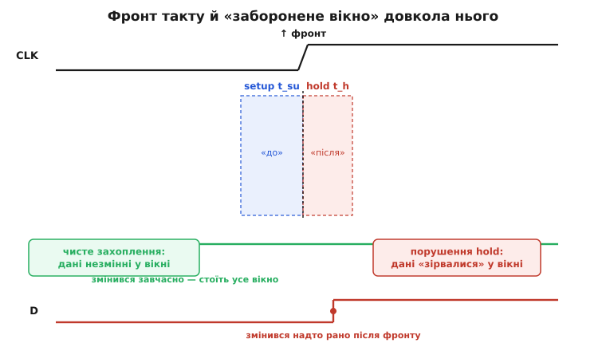
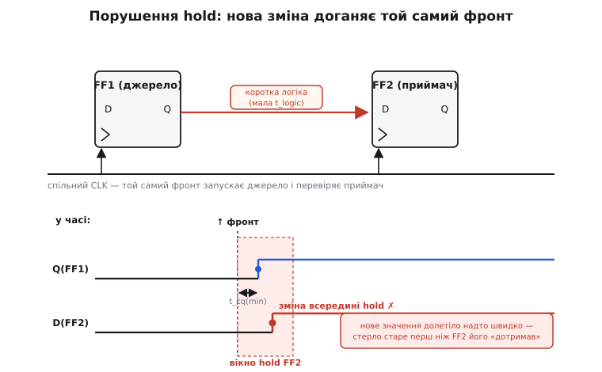
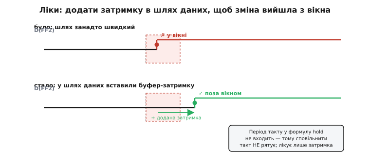

# Порушення hold-часу в цифрових схемах

Про [setup-час](book:electronics/metastability-timing) знають усі, хто хоч раз бачив слово «таймінг»: дані мусять устигнути на вхід тригера **до** фронту такту. І майже всі підсвідомо думають, що це вся історія — треба лише встигати. Але в тригера є **другий**, дзеркальний бік тієї самої умови, про який згадують куди рідше, а він ловить розробників зненацька: дані мусять ще й **не зникнути надто рано** — постояти незмінно **трохи після** фронту. Цю вимогу звуть **hold-часом** (англ. *hold* — утримувати), а її порушення (англ. *violation* — від лат. *violare*, ламати, зазіхати) — це окремий, підступний клас збоїв. Підступний тому, що поводиться він **навпаки** до всього, чому вчить інтуїція про швидкодію: тут проблему створює не повільна, а **надто швидка** схема, і сповільнити такт, аби «дати всім час», не рятує зовсім.

Розберімося від першопричини: чому взагалі є вимога «постояти після фронту», як її ламають короткі шляхи, чому частота такту тут ні до чого — і як інженер це лікує.

### Дві половини одного вікна

Тригер усередині — це петля з двох вентилів, що тримають одне з двох стійких значень; захоплення нового значення означає **перекинути** цю петлю в інший стан ([як приручили бістабільну петлю](book:electronics/state-memory/hist-flip-flop.md)). Перекидання не миттєве: петля має скінченний час, поки нове значення «замкнеться» саме на себе й стане самопідтримним. І поки цей внутрішній процес триває, вхід D **не можна чіпати** — інакше він втрутиться в напівзамкнену петлю й зіб'є її.

> 🔧 **Навіщо це.** У даташиті будь-якого тригера **t_su** і **t_h** стоять поряд, серед перших параметрів, — і це не бюрократія, а дві половини однієї фізичної умови. Setup стереже вхід **зліва** від фронту, hold — **справа**. Проєктувальник, що дивиться лише на setup (бо той обмежує частоту), рано чи пізно наступає на hold — і дістає збій, який на осцилографі виглядає як «дані ж правильні, чому не захопилося?». Знати, що вікно має **два** краї, — половина справи.

Звідси й береться те саме **заборонене вікно** довкола фронту, спільне для setup і hold. Вхід D має застигнути на час t_su **перед** фронтом і простояти незмінно ще час t_h **після** нього. Порушиш будь-який край — і тригер може [зірватися в метастабільність](book:electronics/metastability-timing): застрягти виходом десь між 0 і 1 на непередбачуваний час, а тоді випадково впасти в один зі станів. Тобто hold-порушення й setup-порушення ведуть до **однакової** біди — метастабільного зависання, — але з **протилежних** боків фронту.


*Вхід D має бути стабільним увесь час вікна: setup (t_su) **перед** фронтом і hold (t_h) **після**. Якщо D змінюється завчасно (зеленим) і стоїть усе вікно — захоплення чисте. Якщо ж D «зривається» надто рано після фронту, всередині hold (червоним) — це порушення: петля тригера ще не замкнулася, а вхід уже смикнули.*

Ключова відмінність, з якої випливає геть усе далі: **setup ламають надто повільні шляхи** (дані спізнилися до фронту), а **hold ламають надто швидкі** (дані змінилися рано, ще у вікні після фронту). Дві протилежні хвороби — і лікують їх протилежно.

### Звідки береться «надто швидко»: перегони на спільному такті

Уявімо найзвичайнісіньку річ — два тригери під **спільним** тактом, з’єднані короткою логікою (а то й прямим дротом), як у [зсувному регістрі](book:electronics/shift-register). Джерело FF1 віддає значення, приймач FF2 його захоплює. Обидва цокають від **того самого** фронту.

Ось де корінь усього. **Той самий** фронт, що велить FF2 захопити **старе** значення на його вході, водночас велить FF1 **виставити нове**. Це перегони: старе значення на вході FF2 мусить протриматися ще час t_h після фронту — але нове значення від FF1 уже мчить дротом йому назустріч і намагається його стерти. Якщо новий сигнал добіжить **надто швидко**, він застане вхід FF2 ще у вікні hold — і зіб’є захоплення. Порушення hold — це завжди така гонка «нове проти старого» **в межах одного фронту**.


*Той самий фронт запускає FF1 і перевіряє FF2. Нове значення виходить з FF1 через час t_cq(min), долає коротку логіку за t_logic(min) — і, якщо цієї затримки мало, змінює вхід FF2 ще всередині його вікна hold. Старе значення «не дожило» покладений час — порушення.*

Скільки часу є в нового значення, перш ніж воно стане проблемою? Рівно вікно hold приймача. А скільки йому треба, щоб добігти? Затримка виходу джерела плюс затримка логіки між ними. Порушення настає, коли **найшвидший** можливий пробіг **коротший** за вікно hold:

```
t_cq(min) + t_logic(min)  <  t_hold
        ↑           ↑          ↑
 найшвидший    найшвидша    вимога
 вихід FF1     логіка       приймача FF2
```

Зверніть увагу на **min**. Для setup нас лякали найгірші, **повільні** затримки (щоб устигнути до фронту). Для hold усе навпаки — небезпечні **найшвидші**, **мінімальні** затримки: чим спритніше сигнал проскакує, тим імовірніше він влучить у вікно. Тому в hold-аналізі беруть t_cq і t_logic у їхніх **найменших** значеннях (швидкий кремній, висока напруга, низька температура — усе, що пришвидшує вентилі).

**Приклад (швидкий тригер, з’єднаний майже без логіки).** Візьмімо типові для швидкого CMOS-тригера порядки й порахуймо, чи виживе прямий зв’язок FF1→FF2 без жодної логіки між ними.

```
Параметри (типові порядки для навчального прикладу):
  t_cq(min)     (найшвидший вихід джерела)   = 0.20 нс
  t_logic(min)  (прямий дріт, логіки нема)    = 0.05 нс
  t_hold        (вимога hold приймача)        = 0.35 нс

Найшвидший пробіг нового значення до входу FF2:
  t_cq(min) + t_logic(min) = 0.20 + 0.05 = 0.25 нс

Порівнюємо з вимогою:
  0.25 нс  <  0.35 нс   →  ПОРУШЕННЯ hold на 0.10 нс

Нове значення дісталося входу FF2 за 0.25 нс після фронту,
а старе мусило б там стояти 0.35 нс. Не дожило 0.10 нс.
```

Висновок разючий: зв’язок узагалі **без логіки**, звичайнісінький дріт між двома тригерами, — і вже порушує hold. Саме тому в реальних бібліотеках тригери проєктують так, щоб їхня власна затримка (t_cq) **перевищувала** їхню ж вимогу hold; тоді прямий ланцюжок FF→FF безпечний сам собою. Але щойно з’являється [перекіс такту](book:electronics/clock-skew), ця страховка тане.

### Головний винуватець — перекіс такту

Досі ми мовчки припускали, що фронт приходить до FF1 і до FF2 **одночасно**. У житті — ніколи. Такт розходиться кристалом дротами скінченної довжини, і до різних тригерів фронт приходить із різницею в десятки-сотні пікосекунд. Цю різницю звуть **перекосом такту** (англ. *clock skew* — перекіс, зсув), і саме він перетворює hold із рідкісного курйозу на щоденний головний біль.

Уявіть: фронт дійшов до джерела FF1 **раніше**, ніж до приймача FF2. Тоді FF1 виставить нове значення завчасно й дасть йому **фору** — воно мчить до FF2, а фронт FF2 ще навіть не настав. Коли ж фронт нарешті дійде до FF2, нове значення давно там і давно стерло старе. Перекіс **додається** до пробігу сигналу — фактично **збільшує** вимогу hold:

```
Умова порушення з перекосом:
  t_cq(min) + t_logic(min)  <  t_hold + t_skew
                                        ↑
                        фронт приймача спізнився на t_skew —
                        нове значення дістало стільки ж фори
```

Ось чому hold — це передусім **проблема розведення такту**, а не логіки. Setup можна полагодити, **сповільнивши** такт; hold так не полагодиш ніяк (нижче побачимо, чому), і головний важіль тут — **тримати перекіс малим** і докладати затримку в дані там, де перекіс усе-таки лишає борг. Повне виведення цієї нерівності — з обома краями бюджету, найгіршими кутами й знаком запасу — варте окремого розгляду: [бюджет hold-часу й перекіс такту](book:electronics/hold-violation/math-hold-slack.md).

### Чому частота такту тут ні до чого

Тепер найважливіше й найнеінтуїтивніше. Setup обмежує **частоту**: коротший період — менше часу пройти логіку — важче встигнути. Тому природний рефлекс на будь-який таймінг-збій — «сповільнимо такт, дамо схемі відсапатися». Для hold цей рефлекс **марний**, і причина проста, коли її побачити.

Придивіться до умови порушення: `t_cq(min) + t_logic(min) < t_hold + t_skew`. **Де тут період такту?** Його немає. Жодна величина в цій нерівності від частоти не залежить. Затримки тригера й логіки — це фізика вентилів, вони однакові хоч на 1 МГц, хоч на 1 ГГц. Вимога hold — властивість тригера. Перекіс — властивість розведення. Період — не входить.

Глибша причина — у тому, що для hold-перевірки **запускний і перевірний фронт — це той самий фронт**. У setup ми порівнюємо фронт, що **запустив** дані (у джерелі), з **наступним** фронтом, що їх **захопить** (у приймачі), — між ними лежить рівно один період, тож період і входить у розрахунок. А в hold дані, запущені цим фронтом, ми перевіряємо на **цьому ж** фронті приймача. Обидва — одна й та сама подія. Період, тобто відстань до **наступного** фронту, у цю картину просто не потрапляє: розсунеш фронти далі один від одного — гонка «нове проти старого» на **поточному** фронті не зміниться анітрохи.

> 🔧 **Навіщо це.** Це найпрактичніший висновок усієї теми, і він рятує години марної роботи. Побачивши в звіті аналізатора **hold violation**, **не чіпайте частоту** — зниження такту не зрушить його ні на пікосекунду (а підвищення — не погіршить). Лікувати треба **шлях даних** або **перекіс такту**, ніколи не період. Розробники, які цього не знають, годинами крутять дільник частоти, дивуючись, чому hold-борг стоїть як укопаний.

### Як лікують: додати затримку в дані

Якщо hold ламає **надто швидкий** сигнал, ліки очевидні від протилежного: **уповільнити** цей сигнал — але тільки на шляху **даних**, не такту. Треба, щоб нове значення дійшло до входу приймача **пізніше** — вже **поза** вікном hold, коли старе значення своє відстояло. Найпряміший спосіб — **вставити затримку** в шлях даних: кілька буферів (пар інверторів) або спеціальних затримкових комірок, які нічого не міняють логічно, лише додають часу.


*Було: пробіг короткий, зміна входу FF2 влучає у вікно hold (✗). Стало: додана затримка в шлях даних зсуває зміну вправо, за межу вікна (✓). Оскільки період такту у формулі hold відсутній, сповільнення такту не зрушує проблему — рятує тільки затримка в даних (або зменшення перекосу).*

У світі [FPGA й мікросхем](book:electronics/fpga-timing) це роблять інструменти автоматично: після трасування аналізатор рахує **hold slack** — запас часу для кожного шляху; від’ємний slack означає порушення. Тоді EDA-програма вставляє в проблемні шляхи затримкові буфери, доки борг не закриється. Є й тонший важіль — **навмисний перекіс**: спеціально трохи **затримати** фронт до джерела (щоб нове значення виходило пізніше) або **пришвидшити** до приймача, — але це двосічно, бо той самий перекіс шарпає setup. Тому основне робоче лікування hold — саме **затримка в даних**: вона додає запас hold і **не чіпає** setup ані на йоту (дані ж і так приходять із запасом до **наступного** фронту).

Один різкий контраст варто закарбувати. Setup і hold тягнуть шлях у **протилежні** боки. Setup хоче, щоб шлях був **коротким** (устигнути до наступного фронту). Hold хоче, щоб шлях був **довгим** (не смикнути приймач на поточному). Робочий шлях мусить бути **водночас** не задовгим (інакше провалить setup, обмежить частоту) і не закоротким (інакше провалить hold). Це вузьке горло між двома стінами — і саме тому таймінг-аналіз завжди дивиться на **обидва** краї, а не лише на «встигаємо чи ні».

### Де це реально кусає розробника

Наостанок — де hold-порушення підстерігає на практиці, поза межами FPGA-потоку. Три типові засідки.

Перше й найчастіше — **зсувні регістри та ланцюжки лічильників**, де тригери зчеплені майже без логіки. Це рідні для hold умови: короткий шлях, спільний такт. Тому виробники мікросхем ретельно балансують такі бібліотеки, а розробник плати, з’єднуючи кілька зовнішніх регістрів у ланцюг спільним тактом, має пильнувати за розведенням тактової лінії — щоб перекіс не «підсадив» hold.

Друге — **велике віяло такту (clock fan-out)**: коли один тактовий сигнал живить багато тригерів через довгі, нерівні дроти чи слабкий буфер, перекіс між ними розповзається, і десь на кінці довгої гілки hold зривається. Ліки — акуратне тактове дерево з вирівняними затримками; в мікросхемах для цього є цілий етап синтезу тактового дерева.

Третє — **перетин тактових доменів**, але тут важливо не сплутати. Коли сигнал іде з-під **чужого** такту, hold (як і setup) порушується **неминуче й постійно**, бо два такти взагалі не узгоджені; це не «полагодити затримкою», це фундаментальна метастабільність на межі. Її не лікують балансуванням шляху — її **ізолюють** [синхронізатором](book:electronics/metastability-timing) чи [належним мостом між доменами](book:electronics/clock-domain-crossing). Hold-аналіз із затримками стосується лише **синхронних** шляхів, де такт **спільний**; для асинхронних входів це інша, окрема історія.

Зведімо нитку. **Hold-час** — вимога, щоб дані на вході тригера стояли незмінно ще трохи **після** фронту, поки внутрішня петля замкнеться; порушити її — те саме [метастабільне зависання](book:electronics/metastability-timing), що й від setup, лише з іншого боку фронту. Ламають hold **надто швидкі** шляхи: під спільним тактом той самий фронт запускає нове значення в джерелі й перевіряє старе в приймачі, і якщо нове добігає за `t_cq(min) + t_logic(min)` швидше за `t_hold + t_skew` — воно стирає старе прямо у вікні. Головний винуватець — **перекіс такту**, що дає новому значенню фору. І найважливіше: **період такту у формулу не входить**, бо запускний і перевірний фронт — той самий, тож **сповільнення такту не допомагає** — лікують лише **затримкою в шляху даних** (або зменшенням перекосу). Setup хоче короткого шляху, hold — довгого; надійна схема лежить між цими двома стінами.
