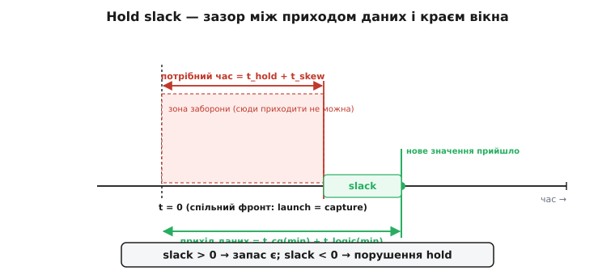
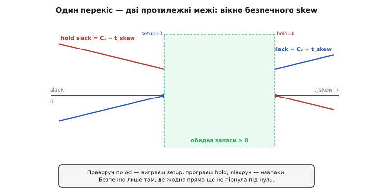

# 🧮 Бюджет hold-часу й перекіс такту

Слово «порушення» звучить як вирок, а насправді за ним ховається проста арифметика: одне число віднімають від іншого й дивляться на знак. Це число — **запас hold** (англ. *hold slack* — від *slack*, провисання, вільний хід). Додатне — усе гаразд, є люфт; від'ємне — порушення, і рівно на стільки пікосекунд, скільки в мінусі. Уся наука таймінг-аналізу для hold зводиться до того, щоб чесно порахувати обидва доданки цієї різниці й не переплутати, який край бюджету за що відповідає.

Тут ми виведемо цю нерівність **від першопричини** — не запам'ятаємо формулу, а **побачимо, звідки береться кожен її член**: чому одні затримки допомагають, а інші шкодять; чому той самий перекіс такту, що рятує setup, топить hold; чому період такту випадає з рівняння **тотожно**, а не приблизно; і як інженер свідомо грає перекосом, торгуючи один запас проти іншого. Наприкінці — числовий приклад у пікосекундних порядках, де все зійдеться до конкретних цифр.

## Дві події на одній осі часу

Почнімо з того, що взагалі означає «порушення». У hold бере участь **пара тригерів** під спільним тактом: джерело (англ. *launch* — той, що **запускає** нове значення) і приймач (англ. *capture* — той, що **захоплює**). Коротка комбінаційна логіка (а часом голий дріт) з'єднує вихід джерела зі входом приймача.

Ключ до всього — **вибір осі часу**. Візьмімо за нуль (t = 0) момент **активного фронту такту**. І тут стається головне, що відрізняє hold від setup: для hold **запускний і перевірний фронт — це той самий фронт**. Джерело виставляє нове значення від t = 0, і на цьому ж t = 0 приймач мусить іще тримати **старе**. Дві події, які ми зараз порівняємо, обидві прив'язані до **однієї** точки на осі — і саме звідси випливе вся дальша своєрідність hold.

На цій осі є два моменти, що нас цікавлять:

- **Коли нове значення реально прийде** на вхід приймача — назвімо це **часом приходу даних** (англ. *data arrival time*). Нове значення виходить з джерела не миттєво: спершу минає власна затримка тригера від фронту до виходу, **t_cq** (англ. *clock-to-Q* — від такту до виходу Q), тоді сигнал повзе логікою ще **t_logic**. Отже прихід = t_cq + t_logic після фронту.
- **Доки старе значення мусить простояти** незмінно — назвімо це **потрібним часом** (англ. *required time*). Приймач вимагає тримати вхід ще **t_hold** після свого фронту (доки внутрішня петля замкнеться). Якщо фронт приймача приходить не рівно в t = 0, а зі зсувом — цей зсув теж додається; про нього за мить.

Порушення hold — це коли **нове прийшло раніше, ніж старому дозволено піти**. Тобто час приходу даних **менший** за потрібний час. А запас — це просто наскільки прихід **пізніший** за потрібне: різниця «прихід мінус вимога».


*Обидві події живуть на одній осі, нуль — спільний фронт (launch = capture). Червона зона заборони тягнеться на t_hold + t_skew: сюди нове значення приходити не можна. Зелена точка — коли воно реально приходить, за t_cq(min) + t_logic(min). Slack — зелений зазор між правою межею зони й приходом; якби точка заповзла в червоне, зазор став би від'ємним.*

> 🔧 **Навіщо це.** Саме так думає аналізатор таймінгу (STA) усередині — не «швидко чи повільно», а **дві мітки часу** на спільній осі: коли дані прийшли й доки мали не приходити. Коли ви читаєте звіт і бачите рядки `data arrival time` та `data required time`, а під ними `slack` — це буквально ця різниця. Навчившись бачити hold як відстань між двома точками на одній осі, ви читаєте будь-який таймінг-звіт як відкриту книгу, а не як шифр.

## Виведення нерівності: обидва краї бюджету

Тепер зберімо різницю акуратно, член за членом, і не приховаймо жодного припущення.

**Ліва частина — час приходу даних.** Нове значення стартує з виходу джерела через t_cq після фронту й долає логіку за t_logic:

```
t_arrival = t_cq + t_logic
```

**Права частина — потрібний час.** Приймач вимагає тримати вхід t_hold після **свого** фронту. Якщо фронт приймача приходить у момент t_skew (відносно фронту джерела, який ми взяли за нуль), то момент, до якого вхід має бути незмінним, — це t_skew + t_hold:

```
t_required = t_skew + t_hold
```

**Умова коректного захоплення** — прихід не раніше вимоги:

```
t_arrival  ≥  t_required
t_cq + t_logic  ≥  t_skew + t_hold
```

Ось і весь бюджет hold. Перепишемо його як **запас** — наскільки ліва частина перевищує праву:

```
hold_slack = (t_cq + t_logic) − (t_hold + t_skew)
```

Знак вирішує все:

```
hold_slack ≥ 0   →  захоплення чисте (є люфт)
hold_slack < 0   →  ПОРУШЕННЯ hold (борг = |hold_slack|)
```

Тепер найтонше місце, де плутається пів галузі: **які саме значення затримок сюди підставляти**. Кожна затримка — не одне число, а **діапазон** від мінімуму до максимуму (кремній ніколи не однаковий: розкид виробництва, напруга, температура). І бюджет hold живе на **одному** краю цього діапазону, а бюджет setup — на **протилежному**. Розберімося, чому.

Порушення hold настає, коли нове значення приходить **надто рано**. А найраніше воно прийде тоді, коли обидві затримки — **найменші**: t_cq(min) і t_logic(min). Тому в лівій частині беруть **мінімуми**:

```
hold_slack = (t_cq(min) + t_logic(min)) − (t_hold + t_skew)
              └──────── найшвидший можливий прихід ────────┘
```

А що з правим краєм — t_hold і t_skew? Їх беруть у **найгіршому** для hold напрямку, тобто в бік **більшого** потрібного часу: **t_hold(max)** (найсуворіша вимога тримати) і **t_skew** у той бік, що дає новому значенню найбільшу фору (нижче побачимо, який це бік). Правило єдине й наскрізне: **для hold усе зводимо до найшвидшого приходу проти найсуворішої вимоги.**

Порівняйте з setup, щоб відчути дзеркальність. Для setup дані мусять **устигнути** до **наступного** фронту, і небезпечні там **повільні** шляхи — тому в setup беруть t_cq(max) і t_logic(max). Одна пара тригерів дає **дві** перевірки на **двох протилежних краях** діапазону затримок: setup на максимумах, hold на мінімумах. Повний бюджет setup із періодом такту виведено окремо — [бюджет таймінгу тригера](topic:electronics/metastability-timing/math-timing-budget.md); тут ми ведемо його дзеркального близнюка.

> 🔧 **Навіщо це.** Це джерело найкаверзніших багів. Схема, що бездоганно проходить типовий («typical») кут, може провалити hold на **швидкому** кремнієві — бо аналізатор для hold зобов'язаний брати **мінімальні** затримки, а ви подумки рахували типові. Тому таймінг завжди підписують кутом: «hold @ fast corner». Хто цього не знає, ганяє симуляцію на typical, бачить зелене й дивується, чому партія на швидкому кремнієві сипле збоями.

## Чому перекіс додається саме до правої частини

Перекіс такту (англ. *clock skew* — перекіс, зсув) заслуговує окремого погляду, бо його знак — постійне джерело помилок. Домовмося про напрям твердо: **t_skew = (момент фронту приймача) − (момент фронту джерела)**. Позитивний t_skew означає, що **до приймача фронт приходить пізніше**, ніж до джерела.

Тепер простежмо причинно-наслідково, що це робить із hold. Фронт дійшов до джерела в t = 0 — джерело **одразу** починає виставляти нове значення, і воно мчить до приймача. А фронт приймача ще **не настав** — він настане аж у t_skew. Тобто в нового значення є **фора** t_skew: воно виходить і біжить, поки приймач іще навіть не «прокинувся». Коли ж приймач нарешті прокинеться в t_skew і почне відлік свого вікна hold, старе значення на вході, можливо, **вже стерте** новим, що прибуло раніше.

Формально: вимога тримати старе тягнеться до t_skew + t_hold. Позитивний t_skew **відсуває цю межу вправо** — робить вимогу **суворішою**, бо тепер старому треба протриматися ще довше (аж поки запізнілий фронт приймача добіжить і відлічить своє t_hold). Ось чому в бюджеті перекіс стоїть **на боці вимоги**, зі знаком **плюс**:

```
hold_slack = (t_cq(min) + t_logic(min)) − (t_hold + t_skew)
                                                      ↑
                              позитивний перекіс (приймач пізніше)
                              дає новому значенню фору → з'їдає запас
```

І дзеркально: **негативний** перекіс (приймач раніше за джерело) для hold **помічний** — приймач устигає «дотримати» старе ще до того, як нове дожене. Але той самий негативний перекіс, що рятує hold, **шкодить setup** — бо тепер до наступного фронту приймача лишається менше часу. Ця протилежність — не збіг; це стрижень усієї гри з перекосом, до якого ми ще повернемось окремим розділом.

Одне застереження про природу t_skew, щоб не звести його до однієї цифри. Перекіс — не константа плати, а **різниця двох затримок гілок** тактового дерева, кожна зі своїм розкидом. У чесному аналізі беруть **найгіршу реалізовну** різницю: для hold — ту, що дає новому значенню найбільшу фору. До того ж інструмент часто прибирає з рахунку **спільну** частину шляху такту (спільний корінь дерева тремтить однаково для обох тригерів і не створює перекосу) — це зветься усуненням спільного песимізму (англ. *common-path pessimism removal*). Але суть від цього не міняється: у формулі стоїть **ефективний** перекіс між точками розгалуження, і для hold він працює проти нас.

## Найгірший кут: чому «швидко» тут — вороже слово

Поглибимо думку про краї діапазону, бо саме тут ховається найбільше пасток. Кожна затримка залежить від трьох чинників, які в галузі скорочують до **PVT** (англ. *Process, Voltage, Temperature* — процес, напруга, температура):

- **процес (P)** — де конкретний кристал ліг у розкиді виробництва: «швидкий» кремній (сильні транзистори) чи «повільний» (слабкі);
- **напруга (V)** — вища живлення пришвидшує вентилі, нижча сповільнює;
- **температура (T)** — для більшості цифрових КМОН-вузлів нижча температура пришвидшує (менший опір каналу), хоча на глибоких техпроцесах буває інверсія.

Для hold нас губить **найшвидший** пробіг даних, тож найгірший для hold кут — це поєднання всього, що **пришвидшує** логіку: швидкий процес, висока напруга, низька температура (для класичних вузлів). Цей ріг діапазону так і звуть — **fast corner** (швидкий кут). Порівняйте зі setup, чий ворог протилежний — **slow corner** (повільний кут): повільний процес, низька напруга, висока температура.

Звідси разючий, але залізний висновок:

```
setup — небезпечний на ПОВІЛЬНОМУ кремнієві (slow corner):  t_cq(max), t_logic(max)
hold  — небезпечний на ШВИДКОМУ кремнієві (fast corner):    t_cq(min), t_logic(min)
```

Одна пара тригерів мусить пережити **обидва** роги одночасно: бути не задовгою для setup на повільному кремнієві й не закороткою для hold на швидкому. Це і є те **вузьке горло** між двома стінами, про яке говорять, коли пояснюють, чому таймінг завжди дивиться на два краї, а не на один.

Сучасні інструменти йдуть іще далі й не вірять, що весь кристал однаково швидкий. Той самий чип має **локальні** відхилення: сусідні вентилі трохи різняться. Тому застосовують **накутове варіювання** (англ. *on-chip variation, OCV*): шлях **даних** дерейтять у бік **швидкого** (щоб прихід був якнайраніший), а спільний шлях **такту** — обережно, з поправкою на спільний песимізм. Практично це означає, що навіть у межах одного кута аналізатор **окремо** штовхає дані «швидше», а такт «повільніше», аби не проґавити найзліший збіг обставин для hold. Деталь для нас важлива однією річчю: вона ще дужче зміщує ліву частину бюджету до мінімумів — hold-аналіз **песимістичний за побудовою**, і це навмисно.

## Період такту зникає — і це тотожність, не наближення

Тепер — серце всієї теми, місце, де інтуїція про «сповільнимо такт» розбивається об алгебру. Твердження сильне: **період такту не входить у бюджет hold узагалі**. Не «майже не впливає», а **тотожно відсутній**. Доведімо це, а не проголосімо.

Порахуймо запаси setup і hold для **однакового** шляху, поставивши поруч. Хай T — період такту. Тоді (у найпростішій моделі, без джитера):

```
setup_slack = (T + t_skew) − (t_cq(max) + t_logic(max) + t_setup)
hold_slack  = (t_cq(min) + t_logic(min)) − (t_hold + t_skew)
```

Придивіться, **де** сидить T. У setup дані, **запущені цим** фронтом, ловить **наступний** фронт приймача — а між сусідніми фронтами лежить рівно один період. Тому в setup порівнюють прихід із моментом T (плюс перекіс): період **природно** входить, бо дедлайн setup — це **інша**, пізніша подія.

А в hold — **немає жодного T**. І причина не арифметична, а фізична: дані, запущені цим фронтом, перевіряють на **цьому ж** фронті приймача. Запускна й перевірна події — **одна й та сама** точка на осі. Відстань до **наступного** фронту (тобто період) у цю картину просто не потрапляє: подовжиш період — розсунеш поточний і наступний фронти далі, але **поточний** фронт, на якому й точиться гонка «нове проти старого», не зрушиш ані на пікосекунду.

Проведімо уявний експеримент — найпереконливіший доказ. Уповільнимо такт удвічі. Що станеться з кожним доданком hold_slack?

```
Було T → стало 2T.  Перевіримо КОЖЕН член hold_slack:
  t_cq(min)    — властивість тригера (фізика вентилів)     → без змін
  t_logic(min) — властивість логіки (фізика вентилів)      → без змін
  t_hold       — властивість тригера (вимога приймача)     → без змін
  t_skew       — властивість розведення такту              → без змін
  ──────────────────────────────────────────────────────────────────
  hold_slack   — жоден член не залежить від T              → БЕЗ ЗМІН
```

Кожнісінький доданок — властивість **заліза** (тригера, логіки, розводки), а не **розкладу**. Період можна крутити як завгодно — hold_slack стоїть як укопаний. Це і є та тотожність: T не «майже не впливає», його в рівнянні **фізично немає**.

Тоді як же тактова частота **інколи** «допомагала» комусь із hold на практиці? Не сама по собі — а через **побічний ефект**. Наприклад, зміна дільника частоти могла перемкнути джерело такту на іншу гілку дерева з іншим перекосом; або перекомпонування під новий такт зрушило розводку. «Допоміг» тут перекіс чи розводка, а не період. Сам по собі період — глухий важіль для hold.

> 🔧 **Навіщо це.** Найпрактичніший висновок усього бюджету, що економить години. Побачивши **hold violation** у звіті, **не чіпайте частоту** — ні зниження, ні підвищення не зрушать його ні на піко. Період скорочується сам собою: launch = capture edge, і T просто немає в рівнянні. Лікуйте **шлях даних** (додайте затримку) або **перекіс** (вирівняйте дерево) — ніколи період. Розробник, що годинами крутить дільник над hold-боргом, воює з членом рівняння, якого в рівнянні нема.

## Навмисний перекіс: як торгувати hold проти setup

Ми бачили, що перекіс входить у setup зі знаком **плюс** (додається до дедлайну T), а в hold — теж стоїть біля вимоги, і позитивний перекіс запас hold **з'їдає**. Складімо ці два спостереження в одну картину — і відкриється потужний інструмент.

Випишемо обидва запаси як **функції** одного аргументу — перекосу t_skew, — сховавши все стале в константи C₁ і C₂:

```
hold_slack (t_skew) = C₁ − t_skew          де C₁ = t_cq(min) + t_logic(min) − t_hold
setup_slack(t_skew) = C₂ + t_skew          де C₂ = T − t_cq(max) − t_logic(max) − t_setup
```

Дві прямі з **протилежним** нахилом по одному й тому ж аргументу. Зсуваєш перекіс праворуч (робиш приймач пізнішим) — **setup_slack росте, hold_slack падає**. Зсуваєш ліворуч — навпаки. Це **гойдалка**: один запас купуєш ціною іншого, піко за піко.


*Той самий перекіс тягне два запаси в протилежні боки. Hold slack (червона) спадає зі зростанням skew і пірнає під нуль праворуч; setup slack (синя) зростає й пірнає під нуль ліворуч. Безпечно лише у вузькому вікні між зерокросингами, де жодна пряма ще не від'ємна. Вийдеш праворуч — провалиш hold; ліворуч — setup.*

Звідси — **вікно допустимого перекосу**. Обидва запаси невід'ємні лише там, де:

```
setup_slack ≥ 0   ⇒   t_skew ≥ −C₂       (ліва стіна: далі вліво провалює setup)
hold_slack  ≥ 0   ⇒   t_skew ≤  C₁       (права стіна: далі вправо провалює hold)

           −C₂  ≤  t_skew  ≤  C₁          ← вікно безпечного перекосу
```

Це вікно — вимірна кількість. Якщо C₁ ≥ −C₂ (тобто вікно непорожнє), пара тригерів має рятівний коридор перекосу. Якщо ж вікно **порожнє** (C₁ < −C₂) — жоден перекіс не задовольнить обидві умови водночас, і шлях треба перебудовувати (коротшати заради setup, довшати заради hold), а не перекошувати.

Тепер сам прийом — **навмисний перекіс** (англ. *useful skew* — корисний перекіс). Ідея зухвала: раз перекіс — це важіль на гойдалці, **навмисне** його підкрутімо там, де один із запасів у скруті. Тригер з обмаллю setup? Дай його фронту **фору** (зроби перекіс, що подовжує йому ефективний період) — купиш setup. Тригер з обмаллю hold? Прибери перекіс у протилежний бік. Інструмент синтезу тактового дерева робить це автоматично: розставляє мікрозатримки в гілках, щоб **позичити** запас там, де густо, і **віддати** туди, де голо.

Але ключове застереження, заради якого й ведемо цей розділ: **useful skew двосічний**. Кожна пікосекунда перекосу, яку ти додав заради hold одного тригера, **водночас** зрушила гойдалку setup **того самого** тригера — і, що підступніше, перекосила **сусідні** пари, для яких цей самий фронт — уже інша роль. Тому useful skew — тонкий глобальний баланс, а не локальна латка. Саме через цю двосічність **основне** робоче лікування hold — усе-таки **не** перекіс, а **затримка в шляху даних**: додаткові буфери зсувають лише t_logic(min), піднімають C₁ (розширюють праву стіну вікна) — і **не чіпають setup ані на йоту**, бо дані й так приходять із запасом до **наступного** фронту. Затримка в даних торкається **однієї** прямої на гойдалці; перекіс шарпає **обидві**. Ось чому перше — безпечна робоча конячка, а друге — гострий інструмент для тонкого доведення.

## Числовий приклад: усе разом у пікосекундах

Зберімо весь апарат на конкретних числах. Візьмімо швидкий КМОН-тригер і простежмо бюджет hold крізь усі стадії — від голого дроту до перекосу й до лікування.

**Крок 1. Прямий зв'язок FF1→FF2 без логіки, перекіс нульовий.** Типові порядки для швидкого кута навчального тригера:

```
Дано (fast corner — мінімальні затримки, бо для hold небезпечні саме вони):
  t_cq(min)     (найшвидший вихід джерела)      = 35 пс
  t_logic(min)  (голий дріт між тригерами)       = 10 пс
  t_hold        (вимога hold приймача)           = 60 пс
  t_skew                                          = 0 пс

Ліва частина (найшвидший прихід нового значення):
  t_cq(min) + t_logic(min) = 35 + 10 = 45 пс

Права частина (потрібний час):
  t_hold + t_skew = 60 + 0 = 60 пс

Запас:
  hold_slack = 45 − 60 = −15 пс   →  ПОРУШЕННЯ на 15 пс
```

Разючий результат: **голий дріт** між двома тригерами вже порушує hold на 15 пс. Нове значення прибуло за 45 пс, а старе мало стояти 60 пс — не дожило 15 пс. Саме тому бібліотечні тригери проєктують так, щоб власна затримка перевищувала власну вимогу hold; але цей приклад свідомо взяв «недобалансований» тригер (t_cq(min) < t_hold), щоб показати механізм у чистому вигляді.

**Крок 2. Додаємо реалістичний перекіс.** Хай фронт до приймача спізнюється на 20 пс — типове розведення такту:

```
Дано те саме, але:
  t_skew = +20 пс   (приймач прокидається на 20 пс пізніше — нове значення дістало фору)

Права частина:
  t_hold + t_skew = 60 + 20 = 80 пс

Запас:
  hold_slack = 45 − 80 = −35 пс   →  ПОРУШЕННЯ вже на 35 пс
```

Перекіс **погіршив** борг із 15 до 35 пс — рівно на свої 20 пс. Видно, як перекіс прямо додається до вимоги: кожна пікосекунда перекосу — пікосекунда боргу hold.

**Крок 3. Доводимо, що частота ні до чого.** Спокуса: «сповільнимо такт». Перевіримо на числах, узявши період спершу 1 нс (1000 пс, 1 ГГц), тоді 10 нс (100 МГц):

```
T = 1000 пс:  hold_slack = 45 − 80 = −35 пс
T = 10000 пс: hold_slack = 45 − 80 = −35 пс   ← той самий борг!

Жоден член (45, 60, 20) не містить T. Сповільнення такту в 10 разів
не зрушило hold_slack ні на піко. T у формулі просто немає.
```

**Крок 4. Лікуємо затримкою в шляху даних.** Порушення — 35 пс. Треба підняти ліву частину так, щоб прихід відсунувся **за** праву межу. Потрібна додаткова затримка Δ, така що новий запас невід'ємний:

```
Умова закриття боргу:
  (t_cq(min) + t_logic(min) + Δ) − (t_hold + t_skew) ≥ 0
  (45 + Δ) − 80 ≥ 0
  Δ ≥ 35 пс

Вставимо ланцюжок буферів, що додає, скажімо, Δ = 40 пс (із запасом 5 пс):
  Ліва частина:  45 + 40 = 85 пс
  hold_slack = 85 − 80 = +5 пс   →  порушення закрито, є люфт 5 пс
```

**Крок 5. Перевіряємо, що setup не постраждав.** Найважливіша перевірка: додана затримка не повинна провалити setup. Хай період T = 1000 пс, а для setup (повільний кут) затримки більші:

```
Дано для setup (slow corner — максимальні затримки):
  t_cq(max)     = 70 пс
  t_logic(max)  = 25 пс   (той самий дріт, але на повільному кремнієві)
  Δ             = 40 пс   (наші буфери — вони теж сповільнюються на slow, хай 55 пс)
  t_setup       = 40 пс
  t_skew        = +20 пс

setup_slack = (T + t_skew) − (t_cq(max) + t_logic(max) + Δ_slow + t_setup)
            = (1000 + 20) − (70 + 25 + 55 + 40)
            = 1020 − 190
            = +830 пс   →  setup з величезним запасом
```

Затримка з'їла аж 55 пс запасу setup (на повільному кутові буфери повільніші) — і setup усе одно лишився з люфтом 830 пс. Ось чому **затримка в даних — безпечна робоча конячка hold**: вона додає стільки запасу hold, скільки треба, а від setup відкушує дрібку, яку той майже завжди легко переживає (адже період T зазвичай на порядок більший за додану затримку). Гойдалку хитнули, але лише одну її пряму, і в межах вікна.

Зведімо весь приклад у нитку. Голий дріт між тригерами дав борг 15 пс; реалістичний перекіс погіршив його до 35 пс; сповільнення такту в 10 разів **не змінило нічого**, бо T у формулі відсутній; додана затримка 40 пс закрила борг із люфтом 5 пс; і setup цю затримку навіть не помітив. Уся драма hold — у трьох числах на боці даних проти двох на боці вимоги, а період такту сюди не запрошено.

## Що лишається в голові

**Hold slack = (t_cq(min) + t_logic(min)) − (t_hold + t_skew)** — одна різниця, чий знак вирішує все: додатна — люфт, від'ємна — порушення на стільки ж пікосекунд. Ліву частину беруть на **мінімумах** (найшвидший прихід, fast corner), праву — на найсуворішій вимозі й найгіршому перекосі, бо hold ламає **надто швидкий** сигнал, а не повільний. **Перекіс** входить у вимогу зі знаком плюс: позитивний (приймач пізніше) дає новому значенню фору й з'їдає запас. **Період такту випадає тотожно** — не приблизно, а фізично відсутній, бо запускний і перевірний фронт для hold **той самий**, тож сповільнення такту не рятує ніколи. Setup і hold — дві прямі на **гойдалці перекосу** з протилежним нахилом: **навмисний перекіс** торгує один запас проти іншого в межах вузького вікна −C₂ ≤ t_skew ≤ C₁, а **затримка в даних** піднімає лише запас hold, майже не чіпаючи setup, — тому саме вона й лишається основним, безпечним лікуванням.
